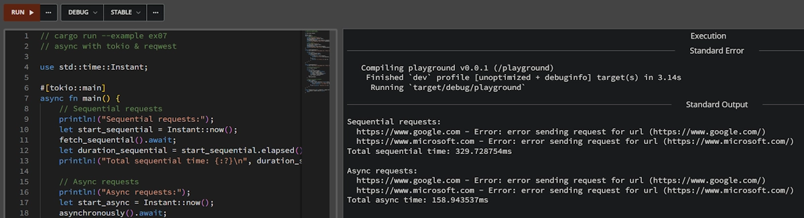

# Function, Method, Closure, Coroutine and Iterator in Rust
{: .no_toc }

A short, practical reminder with working examples.
{: .lead }


<!--
<h2 align="center">
<span style="color:orange"><b> 🚧 This post is under construction 🚧</b></span>
</h2>
 -->


<!-- ###################################################################### -->
<!-- ###################################################################### -->
<!-- ###################################################################### -->
## TL;DR
{: .no_toc }

* For beginners, tinkerers, hobbyists, amateurs, and early-career developers...
* **Function**: Executes once, returns once
* **Method**: Function tied to a type
* **Closure**: Function that captures environment variables
* **Coroutine**: Function that can suspend and resume, maintaining state across suspension points
* **Iterator**: Produces a sequence of values lazily, one at a time

**Note**
The [companion project](https://github.com/40tude/coroutines_and_friends) with all the examples is available on GitHub.

<div align="center">
<br/>
<span>1992: When Batman returned and Windows 3.1 relied on cooperative multitasking via coroutines.</span>
</div>


<!-- ###################################################################### -->
<!-- ###################################################################### -->
<!-- ###################################################################### -->
## Table of Contents
{: .no_toc .text-delta}
- TOC
{:toc}


<!-- ###################################################################### -->
<!-- ###################################################################### -->
<!-- ###################################################################### -->


## Function
- Runs from start to finish in one go
- Returns a single value
- Stack is destroyed when it returns
- No state preservation between calls

**Example:** You can copy and paste the code below into the [Rust Playground](https://play.rust-lang.org/):

```rust
// cargo run --example ex00
// Function

fn regular_function(x: i32) -> i32 {
    println!("Regular function computing {} * 2", x);
    x * 2
}

fn main() {
    let result = regular_function(5);
    println!("Result: {}\n", result);
}
```


**Expected output:**

```powershell
Regular function: computing 5 * 2
Result: 10
```


<!-- ###################################################################### -->
<!-- ###################################################################### -->
<!-- ###################################################################### -->

## Function Pointer

* A primitive type (`fn`) that points to the address of a function
* Does **not** capture any environment variables (unlike closures, see below)
* Has a fixed size (the size of a pointer)
* Can be passed to other functions as arguments or stored in data structures
* Functions that don't capture anything can be coerced to function pointers


**Example:** You can copy and paste the code below into the [Rust Playground](https://play.rust-lang.org/):

```rust
// cargo run --example ex_01
// Function Pointer

fn add_one(x: i32) -> i32 {
    x + 1
}

fn do_math(f: fn(i32) -> i32, arg: i32) -> i32 {
    f(arg)
}

fn main() {
    // Passing a named function as a pointer
    let result = do_math(add_one, 5);
    println!("Named function result: {}", result);

    // Closures that don't capture state can also be function pointers
    let closure_ptr: fn(i32) -> i32 = |x| x * 2;
    let result_closure = do_math(closure_ptr, 10);
    println!("Closure pointer result: {}\n", result_closure);
}

```

**Expected output:**

```powershell
Named function result: 6
Closure pointer result: 20

```


<!-- ###################################################################### -->
<!-- ###################################################################### -->
<!-- ###################################################################### -->
## Method
- A function associated with a type/object
- Same execution model as functions (runs to completion)
- Can access `self` data
- Methods take `self` as their first parameter, whereas Associated Functions (see below) do not


**Example:** You can copy and paste the code below into the [Rust Playground](https://play.rust-lang.org/):

```rust
// cargo run --example ex02
// Method

struct Calculator {
    multiplier: i32,
}

impl Calculator {
    fn multiply_method(&self, x: i32) -> i32 {
        println!("Method computing {} * {}", x, self.multiplier);
        x * self.multiplier
    }
}

fn main() {
    let calc = Calculator { multiplier: 3 };
    let result = calc.multiply_method(7);
    println!("Result: {}\n", result);
}
```

**Expected output:**

```powershell
Method computing 7 * 3
Result: 21
```


<!-- ###################################################################### -->
<!-- ###################################################################### -->
<!-- ###################################################################### -->
## Associated Function ("Static" Method)
- A function defined inside an `impl` block that does **not** take a `self` parameter
- Called using the `Type::function()` syntax (namespace syntax)
- Often used for **constructors** (like `new()`) or factory methods
- Similar to "static methods" in other programming languages

**Example:** You can copy and paste the code below into the [Rust Playground](https://play.rust-lang.org/):

```rust
// cargo run --example ex03
// Associated Function

struct User {
    username: String,
    active: bool,
}

impl User {
    // This is an associated function (no self)
    fn new(name: &str) -> Self {
        println!("Associated Function: Creating a new User instance for {}", name);
        Self {
            username: name.to_string(),
            active: true,
        }
    }
}

fn main() {
    // We call associated functions using the :: operator
    let user = User::new("Alice");
    println!("User name: {}\n", user.username);
}
```

**Expected output:**

```powershell
Associated Function: Creating a new User instance for Alice
User name: Alice
```


<!-- ###################################################################### -->
<!-- ###################################################################### -->
<!-- ###################################################################### -->
## Closure
- A function that **captures variables** from its environment (current block)
- Still runs to completion like a regular function
- The captured state exists across multiple calls to the closure


**Example 1:** You can copy and paste the code below into the [Rust Playground](https://play.rust-lang.org/):

```rust
// cargo run --example ex04
// Closure

fn demonstrate_closure() {
    let captured_value = 10;

    let closure = |x: i32| {
        println!("Closure computing {} + captured {}", x, captured_value);
        x + captured_value
    };

    println!("Closure result: {}", closure(5));
}

fn main() {
    demonstrate_closure();
}
```


**Expected output:**

```powershell
Closure computing 5 + captured 10
Closure result: 15
```

**Example 2:** You can copy and paste the code below into the [Rust Playground](https://play.rust-lang.org/):

```rust
// cargo run --example ex05
// Closure

pub fn shift_all<F>(data: &mut [i32], mut mutator: F)
where
    F: FnMut(i32) -> i32,
{
    for v in data {
        *v = mutator(*v);
    }
}

fn main() {
    let bias = 42;
    let add_bias = |n| n + bias;

    let mut my_data = vec![1, 3, 5, 7];
    shift_all(&mut my_data, add_bias);

    println!("{:?}", my_data);
}
```
**Expected output:**

```powershell
[43, 45, 47, 49]
```

**Note**
* Rust has three traits for closures: `Fn` (reads), `FnMut` (modifies), and `FnOnce` (consumes).
* Rust chooses the most restrictive one automatically based on what you do inside the `|| {}`.
* [Read this page](https://doc.rust-lang.org/book/ch20-04-advanced-functions-and-closures.html?highlight=FnMut#function-pointers)


**Example 3:** You can copy and paste the code below into the [Rust Playground](https://play.rust-lang.org/):

```rust
// cargo run --example ex06
// Generator-style coroutine (using iterator)

fn generator_style(start: i32, count: i32) -> impl Iterator<Item = i32> {
    (0..count).map(move |i| {
        println!("Generator: yielding value {}", start + i);
        start + i
    })
}

fn main() {
    let mut iterator = generator_style(100, 3);
    println!("First value: {:?}", iterator.next());
    println!("Second value: {:?}", iterator.next());
    println!("Third value: {:?}", iterator.next());
}
```

**Note:**
* `move |i|`?
<!-- * It’s the bridge between a closure and a state machine. Without `move`, the closure only borrows start, which wouldn't work if the iterator outlives the function call. -->
* `(0..count)` create a `Range<i32>` which goes from 0 to  `count-1`.
* `.map(move |i| { ... })` transforms each element of the range (`i` goes from 0 to 3)
* `move` force the closure to take the ownership of the variables it captures (otherwise it get the variables by reference and it does not compile. Make a test, remove the `move`)
    * If `move` is removed the explanation goes like that: The closure attempts to capture `start` by reference (`&start`), but `start` lives in the stack of `generator_style()`. When the function returns, `start` is destroyed, and the closure would contain an invalid reference (dangling reference). Not a good idea, especially for the next time closure will execute.
* `move` forces the closure to copy `start` (because `i32` implements `Copy`). The closure now has its own copy of `start`, independent of the `generator_style()` function and everybody is happy-happy.

**Expected output:**

```powershell
Generator: yielding value 100
First value: Some(100)
Generator: yielding value 101
Second value: Some(101)
Generator: yielding value 102
Third value: Some(102)
```


**Note:**
In Rust, the distinction between a [Closure](#closure) and a [Function Pointer](#function-pointer) is purely about state. If we need to pass "logic" to a function without needing any external variables, a function pointer is the most efficient way to do it.


<!-- ###################################################################### -->
<!-- ###################################################################### -->
<!-- ###################################################################### -->
## Coroutine
- Can **pause and resume** execution
- Maintains its execution state (local variables, instruction pointer)
- Can yield multiple values over time
- Often used for async operations, generators, or cooperative multitasking
- Primarily implemented through `async`/`await`, which compile to state machines that can be suspended at `.await` points.


**Example:** You can copy and paste the code below into the [Rust Playground](https://play.rust-lang.org/):

```rust
// cargo run --example ex07
// async with tokio & reqwest

use std::time::Instant;

#[tokio::main]
async fn main() {
    // Sequential requests
    println!("Sequential requests:");
    let start_sequential = Instant::now();
    fetch_sequential().await;
    let duration_sequential = start_sequential.elapsed();
    println!("Total sequential time: {:?}\n", duration_sequential);

    // Async requests
    println!("Async requests:");
    let start_async = Instant::now();
    asynchronously().await;
    let duration_async = start_async.elapsed();
    println!("Total async time: {:?}\n", duration_async);
}

async fn fetch_sequential() {
    let urls = vec!["https://www.google.com", "https://www.microsoft.com"];

    for url in urls {
        let start = Instant::now();
        match fetch_url(url).await {
            Ok(_) => {
                let duration = start.elapsed();
                println!("  {} - {:?}", url, duration);
            }
            Err(e) => {
                println!("  {} - Error: {}", url, e);
            }
        }
    }
}

async fn asynchronously() {
    let urls = vec!["https://www.google.com", "https://www.microsoft.com"];

    // Create a vector of futures
    let mut tasks = vec![];

    for url in urls {
        let url = url.to_string();
        let task = tokio::spawn(async move {
            let start = Instant::now();
            let result = fetch_url(&url).await;
            let duration = start.elapsed();
            (url, result, duration)
        });
        tasks.push(task);
    }

    // Wait for all tasks to complete
    for task in tasks {
        match task.await {
            Ok((url, result, duration)) => match result {
                Ok(_) => println!("  {} - {:?}", url, duration),
                Err(e) => println!("  {} - Error: {}", url, e),
            },
            Err(e) => println!("  Task error: {}", e),
        }
    }
}

async fn fetch_url(url: &str) -> Result<(), reqwest::Error> {
    let _response = reqwest::get(url).await?;
    Ok(())
}
```

**Expected output:**

```powershell
Sequential requests:
  https://www.google.com - 147.6548ms
  https://www.microsoft.com - 125.9957ms
Total sequential time: 274.657ms

Async requests:
  https://www.google.com - 72.3342ms
  https://www.microsoft.com - 116.1267ms
Total async time: 116.6558ms
```

**Note**
At the time of writing, the code above runs in Rust Playground but I get the following error messages. Surprisingly the timing are in the correct order of magnitude (300 vs 150, see below).


```bash
Sequential requests:
  https://www.google.com - Error: error sending request for url (https://www.google.com/)
  https://www.microsoft.com - Error: error sending request for url (https://www.microsoft.com/)
Total sequential time: 329.728754ms

Async requests:
  https://www.google.com - Error: error sending request for url (https://www.google.com/)
  https://www.microsoft.com - Error: error sending request for url (https://www.microsoft.com/)
Total async time: 158.943537ms
```

<div align="center">
<br/>
<!-- <span>Optional comment</span> -->
</div>


**Note**
Here is the `[dependencies]` section of the `Cargo.toml` file of the [companion project](https://github.com/40tude/coroutines_and_friends) I use locally.

```toml
[dependencies]
reqwest = "0.13.1"
tokio = { version = "1.49.0", features = ["macros", "rt-multi-thread"] }
```

**Note**
* Don't trust the comment under the first picture above, check by yourself and read the article [Windows Multitasking: A Historical Aside](https://youngmumpster.wordpress.com/2013/10/13/windows-multitasking-a-historical-aside/comment-page-1/)
* You can also read: [How was Multi-Tasking Possible in Older Versions of Windows?](https://www.howtogeek.com/187631/how-was-multi-tasking-possible-in-older-versions-of-windows/)


<!-- ###################################################################### -->
<!-- ###################################################################### -->
<!-- ###################################################################### -->
## Iterator
- Represents a sequence of values produced one at a time
- Maintains internal iteration state between calls
- Returns the next value on each call, or signals completion
- Often used in for / foreach loops
- Does not necessarily store all values in memory
- Can be implemented by collections, generators, or custom types
- May be finite or infinite


**Example:** You can copy and paste the code below into the [Rust Playground](https://play.rust-lang.org/):

```rust
// cargo run --example ex08
// Iterator
struct Counter {
    current: u64,
}

impl Iterator for Counter {
    type Item = u64;

    fn next(&mut self) -> Option<Self::Item> {
        let value = self.current;
        self.current += 1;
        Some(value) // Never returns None → infinite iterator
    }
}

fn main() {
    let counter = Counter { current: 0 };

    for n in counter.take(5) {
        println!("{}", n);
    }
}
```


**Expected output:**

```powershell
0
1
2
3
4
```


<!-- ###################################################################### -->
<!-- ###################################################################### -->
<!-- ###################################################################### -->


## Are iterators based on coroutines?

**No, an iterator is not a coroutine** in the traditional sense.

Iterator can behaves like a coroutine but but:
- **Iterators** simulate this through state stored in struct fields
- **Coroutines** achieve this through actual execution suspension


### Iterator
{: .no_toc }

- Pull-based: The consumer calls `.next()` to get values
- Synchronous: Computation happens immediately when `.next()` is called
- State machine: Implemented as a struct with state fields
- No suspension points: Code doesn't "pause" - each `.next()` runs fresh logic
- Simple trait: Just needs `fn next(&mut self) -> Option<Item>`

### Coroutine (async/await)
{: .no_toc }

- Push-based: (in async context): The runtime drives execution
- Asynchronous: Can wait for I/O, timers, etc.
- State machine: Compiler generates one from async fn
- Suspension points: Can `.await` and resume later
- Complex: Involves `Future`, `Poll`, `Waker`, executors


### Philosophical Difference
{: .no_toc }

**A mind model for Iterator**

> Each call is a **fresh execution** of the `next()` method. There's no "pausing" mid-function.

```
User calls next() → Execute logic → Return value → DONE
User calls next() → Execute logic → Return value → DONE
User calls next() → Execute logic → Return value → DONE
```

**A mind model for Coroutine**

> A **single execution** that suspends and resumes, preserving the exact position and local variables.

```
Start execution → Compute → PAUSE (await)
                           ↓
Resume → Compute more → PAUSE (await)
                           ↓
Resume → Compute more → DONE (return)
```


### Visual Comparison
{: .no_toc }


```rust
// Iterator: each next() call executes independently
struct Counter { count: i32, max: i32 }

impl Iterator for Counter {
    type Item = i32;

    fn next(&mut self) -> Option<i32> {
        // This code runs fresh each time
        // No "pausing" - just checking state and updating
        if self.count < self.max {
            self.count += 1;
            Some(self.count)
        } else {
            None
        }
    }
}

// Coroutine: execution can suspend and resume
async fn async_counter(max: i32) -> Vec<i32> {
    let mut results = vec![];
    for i in 0..max {
        // This is a suspension point - execution can pause here
        some_async_operation().await;
        results.push(i);
    }
    results
}
```


**Example:** You can copy and paste the code below into the [Rust Playground](https://play.rust-lang.org/):


```rust
// cargo run --example ex09
// Iterator vs coroutine

use tokio::time::{Duration, sleep};

// Iterator: each next() call executes independently
struct Counter {
    count: i32,
    max: i32,
}

impl Iterator for Counter {
    type Item = i32;

    fn next(&mut self) -> Option<i32> {
        // This code runs fresh on every call to next()
        // No suspension, just state checking and updating
        if self.count < self.max {
            self.count += 1;
            Some(self.count)
        } else {
            None
        }
    }
}

// Simulated async operation
async fn some_async_operation() {
    // Simulate an async I/O or timer-based operation
    sleep(Duration::from_millis(200)).await;
}

// Coroutine: execution can suspend and resume
async fn async_counter(max: i32) -> Vec<i32> {
    let mut results = vec![];

    for i in 0..max {
        // Suspension point: the task can pause here
        some_async_operation().await;
        results.push(i);
    }

    results
}

#[tokio::main]
async fn main() {
    // --- Iterator demo ---
    let counter = Counter { count: 0, max: 3 };

    println!("Iterator output:");
    for value in counter {
        println!("  {}", value);
    }

    // --- Async coroutine demo ---
    println!("\nAsync coroutine output:");
    let values = async_counter(3).await;

    for value in values {
        println!("  {}", value);
    }
}
```


**Expected output:**

```powershell
Iterator output:
  1
  2
  3

Async coroutine output:
  0
  1
  2
```

**Note**
* Is it crystal clear why both outputs are different? Do you feel brave enough to play with the code in [Rust Playground](https://play.rust-lang.org/) so that they become similar?
* I find that this difference is interesting from the learning standpoint:
    * The iterator encodes its logic in the `next()`.
    * The async coroutine encodes its logic in the code structure (`for`, `.await`).
    * Same intent, but the "where" of the control is different.