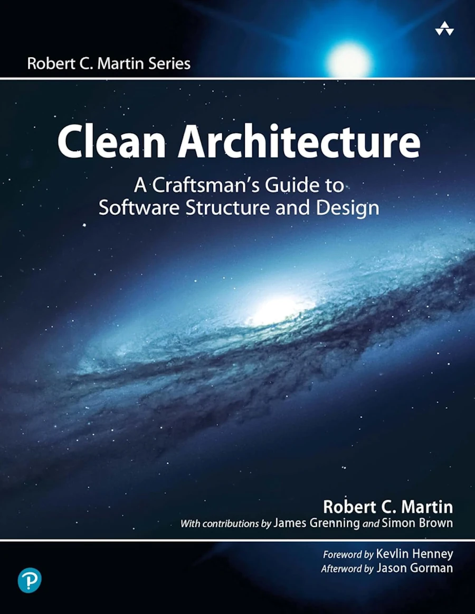
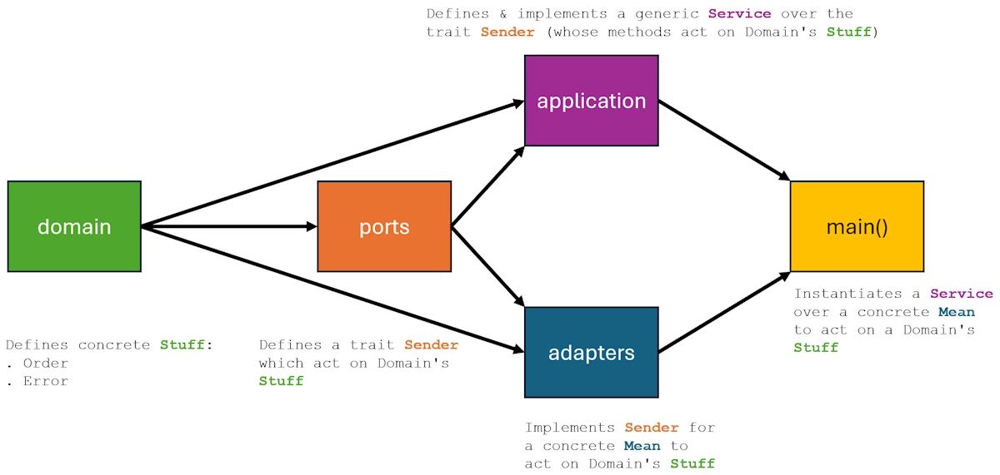
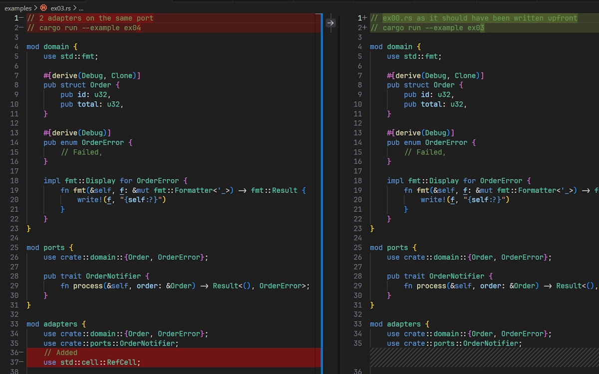
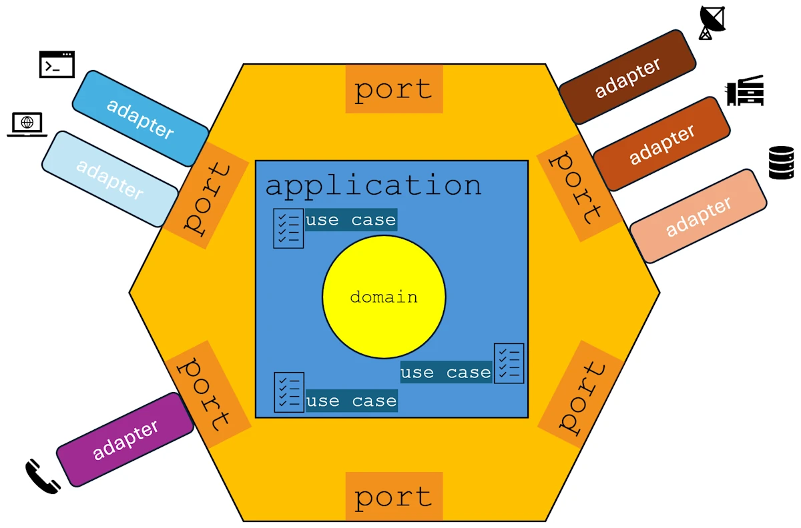

# Hexagonal Architecture in Rust: A Beginner’s Guide
{: .no_toc }

Learn how to structure your Rust code with ports, adapters, and clean separation of concerns using practical examples.
{: .lead }


<!-- <h2 align="center">
<span style="color:orange"><b> 🚧 This post is under construction 🚧</b></span>
</h2> -->


<!-- ###################################################################### -->
<!-- ###################################################################### -->
<!-- ###################################################################### -->
## TL;DR
{: .no_toc }

* For beginners
* Ports = Traits
* Adapters = Implementations
* `application` owns the use case
* `application` borrows adapters
* The caller decides which `adapter` to plug in
* `application` is **NOT** a container for `adapters`, but a consumer of `ports`.
* `application` orchestrates the **use case**, `ports` define the contracts and `adapters` plug concrete behavior into those contracts

All the [examples](https://github.com/40tude/hexagonal_lite) are on GitHub

<!-- **Note**
The [companion project](https://github.com/40tude/coroutines_and_friends) with all the examples is available on GitHub. -->

<div align="center">
<br/>
<span>2005: When Hexagonal Architecture emerged and War of the Worlds hit theaters.</span>
</div>


<!-- ###################################################################### -->
<!-- ###################################################################### -->
<!-- ###################################################################### -->
## Table of Contents
{: .no_toc .text-delta}
- TOC
{:toc}


<!-- ###################################################################### -->
<!-- ###################################################################### -->
<!-- ###################################################################### -->

## Introduction
Just to make sure you did'nt reach this page in order to learn how to draw an hexagon on screen with Rust... Hexagonal Architecture is a way to structure an application around its **use cases** rather than its technical details. In this article, we explore how the application core acts as an orchestrator, coordinating work without owning the implementation. Don’t worry about the fancy terminology: hexagons, architecture, ports, adapters, business rules. At the end of the day, this all boils down to writing traits, implementing structs, and defining a few enums.

This said... Don't ask me why but our company wants to develop its own Orders Management System. We had a first meeting with the board: CFO, COO, CEO... They speak "business" they have their own vocabulary, rules, invariants... To tell the truth, they don't care if they receive orders via email or by owl. They don't care if orders are tracked in a database or on papyrus... They want to process orders as fast as possible, ship products in a matter of minutes and send the invoices within the same second.

If we must write an application for these guys one of the idea is to decouple the business from the external concerns like user interfaces, databases... What  "Uncle Bob's" call the "details" in the book [Clean Architecture](https://www.amazon.fr/dp/0134494164).

<div align="center">
<br/>
<!-- <span>Optional comment</span> -->
</div>

Do not misinterpret the word "business" above. We could be talking about "how to operate a nuclear plant" or "how to operate a cabaret"... In each case the business is different but a business remains a business.

One option could be to apply the Dependency Inversion Principle. You can read more about DIP on this [page](). However real applications are complex: they need storage, payment systems, notification services... How do we scale DIP to handle all of that?

This is the purpose of the **Hexagonal Architecture** which leverages what we already know about SOLID and DIP but goes one step further.

At the heart of Hexagonal Architecture are the concepts of **Ports** and **Adapters**.
* Ports are **interfaces** that define contracts for the communications between the business and the components.
* Adapters are **implementations** of these interfaces.


**Note:**
Think of it that way: "Ciao ragazze! I'm the latest Ferrari cell phone and you know what? If you want to reload my battery, connect an external drive or a ledger, like on any car you will have to use an OBD-II port."

<div align="center">
<br/>
<span>This is an OBD-II connector</span>
</div>

I know this is ridiculous... However keep in mind that, in this context, this is the phone which impose the port. As a supplier, if you want to get the "Ferrari Compatibility Label" you have no choice than to provide an OBD-II compliant connector for your wired earphones. Good luck!

As on any electronic device there are two types of Ports:
* **Output Ports:** aka driven ports (secondary). Describe the methods the business is ready to use to send "Stuff" outside. Here, "Stuff" may be a invoice, notifications... I say "ready to use" because I want to insist on the fact that this is the business, the core, which defines the means to be used. This is nothing else than DIP in action.
* **Input Ports:** aka driving ports (primary). Describe how the business is ready to receive "Stuff" from external systems. Here "Stuff" could be a messages, an order... Again, the core define the methods that external systems will have to use to trigger actions in the core. The keyword here is "will have to use". Yes, this is 4 words but the point is that this is mandatory. If you don't use the input port the business will not take your request/call into account.

Things to keep in mind:
* **Ports = Traits** (Interfaces in plain Rust)
* **Adapters = Implementations** (Rust `impl Xyz for Abc`)


**Note:**
Why DIP alone isn't sufficient? DIP is a principle, it explains what we have to do but not how to organize our architecture. For example DIP doesn't tell us where to place our abstractions (traits), nor how to organize dependencies between layers and what depends on what at the architectural level. On the other hand, the Hexagonal Architecture clearly defines what is the domain (the business logic, the center of the hexagon), what are the ports (interfaces defining how the outside world interacts with our domain) and what are the adapters (concrete implementations of ports, outside the hexagon). Keep in mind: DIP = What | Hexagon Architecture = How.


Now... The one million dollar question. Is there a way to demonstrate an Hexagonal Architecture in less than 100 lines of code?


<!-- ###################################################################### -->
<!-- ###################################################################### -->
<!-- ###################################################################### -->
## Show me the code!
Get the [Rust project](https://github.com/40tude/hexagonal_lite) from the repo. The examples are in the `examples/` folder. Run the first sample with:

```powershell
cargo run --example ex00
```

Expected output:

```text
[Console] Order #1 confirmed! Total: 4999
Success! Order #1 processed.
```


I want to make sure "we learn how to walk before we try to run". So let's take some time to review the code of `ex00.rs` and understand how this works at the simplest level. Open the code. Good news, it is 85 LoC.

**Lines 1-20**

We left the meeting with the board and now, we know more about their vocabulary. So, we create a module named `domain` where we recreate the entities we heard about.

```rust
mod domain {
    use std::fmt;

    #[derive(Debug, Clone)]
    pub struct Order {
        pub id: u32,
        pub total: u32,
    }

    #[derive(Debug)]
    pub enum OrderError {
        // Failed,
    }

    impl fmt::Display for OrderError {
        fn fmt(&self, f: &mut fmt::Formatter<'_>) -> fmt::Result {
            write!(f, "{self:?}")
        }
    }
}
```
First we create the type `Order`. What is an `Order`? An `Order` is an `id` associated with a `total`. We may not agree but, if tomorrow morning we cross the CFO at the cafeteria, we can discuss with him using *his* vocabulary. He will not be lost and more than happy to help us. If needed we will be able to add field to the `struct` later.

Second, we create a type `OrderError`. What is an `OrderError`? It is not yet crystal clear but we know for sure that an error is only one kind of error at a time so we create an empty `enum`. Once we know more about the kind of business errors they encounter in their domain we will be able to add variants to the `enum`. At the end, we implement the `Display` trait for the `OrderError`.

**Note:**

Here, all the modules are in the same source file. In a real application each module would be in its own folder.


**Lines 22-28**

```rust
mod ports {
    use crate::domain::{Order, OrderError};

    pub trait OrderNotifier {
        fn process(&self, order: &Order) -> Result<(), OrderError>;
    }
}
```

We create a `ports` module. "Remember the Alamo" but remember that **ports = traits**. So we "just" define which methods must be available if something want to be considered as a valid `OrderNotifier`.

Note that the module `ports` depends on `domain` because the `.process()` method sends a `domain::Order` and return a `Result<(), domain::OrderError>`.


**Lines 30-45**

```rust
mod adapters {
    use crate::domain::{Order, OrderError};
    use crate::ports::OrderNotifier;

    pub struct ConsoleNotifier;

    impl OrderNotifier for ConsoleNotifier {
        fn process(&self, order: &Order) -> Result<(), OrderError> {
            println!(
                "[Console] Order #{} confirmed! Total: {}",
                order.id, order.total
            );
            Ok(())
        }
    }
}
```

We said **adapters = implementations**. In this module we define a `ConsoleNotifier`, a concrete data type. Once this is done, since we want that the objects of type `ConsoleNotifier` being used to process orders, we implement the `OrderNotifier` trait for the `ConsoleNotifier`. In our case this consist in defining what will happen when the `.process()` method will be invoked.

Note that in the module `adapters` we depend on `domain` and `ports` because we implement a trait defined in `ports` which act on objects defined in `domain` (`Order` for example)


**Lines 47-74**

For me, this is where the magic takes place.

```rust
mod application {
    use crate::domain::{Order, OrderError};
    use crate::ports::OrderNotifier;

    pub struct OrderService<N: OrderNotifier> {
        notifier: N,
        next_id: u32,
    }

    impl<N: OrderNotifier> OrderService<N> {
        pub fn new(notifier: N) -> Self {
            Self {
                notifier,
                next_id: 1,
            }
        }

        pub fn process_order(&mut self, total: u32) -> Result<Order, OrderError> {
            let order = Order {
                id: self.next_id,
                total,
            };
            self.next_id += 1;
            self.notifier.process(&order)?;
            Ok(order)
        }
    }
}
```

The code of the module `application` is important because this is where we define and implement a generic `OrderService` data type over the trait `OrderNotifier`. Realize that this means that *any* concrete type having the `OrderNotifier` trait can be used. Thanks to Rust, expressing this intent is almost natural.

So far, only the `ConsoleNotifier` data type has the trait `OrderNotifier` but, tomorrow, we can easily extend the application with a `BellNotifier` (people ring a bell when an order is received).

Once the generic `OrderService` is defined, then we write its implementation which consist of 2 methods: `new()` and `.process_order()`. The latter use the `.process()` method that any object having the `OrderNotifier` trait has.

Take some time to *read* and understand each line of the code above. At the end you must be convinced that `application` is the place where we describe the **use case**: receive an order, ring the bell, send an invoice... And we do this without knowing how this will happens. When `.ring_the_bell()` is invoked, does someone get up to go to the bell and use a hammer, or do they press a button on their desk or on their screen? I don't know, and that's not the point.

Note that in the module `application` we depend on `domain` and `ports` because we create an `OrderService` data type which depends on an `OrderNotifier` trait defined in `ports` which act on object defined in `domain` (`Order` for example)


**Lines 76-86**

```rust
fn main() {
    use adapters::ConsoleNotifier;
    use application::OrderService;

    let mut service = OrderService::new(ConsoleNotifier);

    match service.process_order(4999) {
        Ok(order) => println!("Success! Order #{} processed.", order.id),
        Err(e) => println!("Error: {e}"),
    }
}
```
Show time! All the pieces fit together. The code involved is very short. This is **NOT** the problem here. No, in fact my main concern is to make sure we all understand that above, the `application` module is **NOT** an executable. For obvious didactic reasons I keep all the modules in one source code, but, repeat after me, `application` is **NOT** an executable but should be considered more like a lib.

In this context `main()` is:
* Not part of Hexagonal Architecture
* Not part of the `application` core
* Just a delivery mechanism
* A primary adapter

Think of it as a "client", a proof that the architecture works. `main()` belongs to an adapter and does not include any business logic. From the files and folders stand point you can keep this model in mind if this helps:

```text
my_app/
├── domain/
├── application/
├── adapters/
├── ports/
├── main.rs
```

Now, having all this in mind we can *read* the code of `main()`. We create a new `OrderService` based on the data type `ConsoleNotifier` which implements the trait `OrderNotifier`. Then we call `.process_order()` and print the results.


**Note:**
* Naming is difficult. Order, Invoice, Notifier... I realize things should/could be better. Welcome to the club! Hopefully, intellisense (F2) is our friend.

**Note:**

From a pragmatic point of view I would suggest to:
1. Start by "fixing the vocabulary". I mean, first, work on the `domain` module and define the data types of the business you are modeling. Make sure everybody agree.
1. Then I would work on the `ports` (interface, traits)
1. Using the ports, write the **use cases** in the `application` module as you would describe, in plain English, what is going on during such or such **use case**.
1. Write the `adapters` modules and the concrete implementation.
1. Finalize the `main()` function adding the needed `use...` statements
1. Sleep on it
1. Review it with a colleague tomorrow morning.


<!-- ###################################################################### -->
<!-- ###################################################################### -->
<!-- ###################################################################### -->
## `ex00.rs` types organization

* Below I use `Sender` instead of `OrderNotifier`
* The arrows show the dependencies: `ports` depends on `domain`, `domain` depends on no one.

<div align="center">
<br/>
<span>Visual Representation of our Hexagonal Architecture </span>
</div>

The graph above helps to understand why, quite often, the ports are defined in the `domain`. Doing so simplify the graph. For example, this is the organization I use in this [project](https://github.com/40tude/hexagonal_architecture).


<!-- ###################################################################### -->
<!-- ###################################################################### -->
<!-- ###################################################################### -->

## About ex01.rs
The code is the same but the domain is slightly different. I just want to make sure we understand that business/domain can be anything.

```powershell
cargo run --example ex01
```

**Expected output:**
```text
[Megaphone] 🎪 Act #1 is ON! Silliness level: 9001
🤡 Success! Clown act #1 scheduled.
```

Skim over the code because, compared to `ex00.rs` I just renamed some variables.


<div align="center">
<br/>
<span>Optional comment</span>
</div>


<!-- ###################################################################### -->
<!-- ###################################################################### -->
<!-- ###################################################################### -->
## Testing `application`

Again, the previous `main()` function was, may be, misleading. So let's go extreme and let's remove it completely. And you know what? Let's remove also the `adapter` that `main()` was using. Remember, adapters are replaceable and owned by the caller, not by the `application`.

Ok... But what can we do next? Easy, let's write some test. Try this:

```powershell
cargo test --example ex02
```

Expected output:

```text
running 1 test
test tests::process_order_successfully ... ok

test result: ok. 1 passed; 0 failed; 0 ignored; 0 measured; 0 filtered out; finished in 0.00s
```

Obviously, since we removed `main()` we cannot `cargo run --example ex02` but this simple experimentation is an attempt to demonstrate some of the key ideas are of the Hexagonal Architecture:

* The `domain` and `application` do not depend on infrastructure
* The `application` is driven by `ports`, **NOT** by a runtime entry point (`main()`)
* We can exercise the system without any real `adapters` and this is really smart.

So let's keep in mind that by replacing `main()` with one focused test we prove ourselves that:
* The `application` core is usable in isolation
* Adapters are just plug-ins
* The system is testable by construction

Let's see the making of and let's open `ex02.rs`

**Lines 62-85**

The rest of the code is untouched so we can focus our attention to the test module.

```rust
#[cfg(test)]
mod tests {
    use crate::application::OrderService;
    use crate::domain::{Order, OrderError};
    use crate::ports::OrderNotifier;

    struct TestNotifier;

    impl OrderNotifier for TestNotifier {
        fn process(&self, _order: &Order) -> Result<(), OrderError> {
            Ok(())
        }
    }

    #[test]
    fn process_order_successfully() {
        let mut service = OrderService::new(TestNotifier);

        let order = service.process_order(4999).unwrap();

        assert_eq!(order.id, 1);
        assert_eq!(order.total, 4999);
    }
}
```
If you remember, in `ex00.rs`, `main()` was using a `ConsoleNotifier` which was defined and implemented in the `adapters` module (lines 30-45 of `ex00.rs`). Here, we no longer have the `adapters` module.

So, first thing first, at the top of the `tests` module we start by creating our own `TestNotifier` and we implement `OrderNotifier` for it. In other words we are creating our test adapter.

When this is done, we can write the test `process_order_successfully()` test function, where, as before in the `main()` function, we create a new `OrderService` based on the data type `TestNotifier` which implements the trait `OrderNotifier`. Then we call `.process_order()` and check the results.

By now, it should be clear that in an Hexagonal Architecture the `application` never knows whether it’s being used by a CLI, a web server, a test... The caller decides which adapter to plug in.

Finally, let's realize that tests are not special. They are just another driving adapter.


<!-- ###################################################################### -->
<!-- ###################################################################### -->
<!-- ###################################################################### -->
## I'm a liar

In order to keep `ex00.rs` as simple as possible I used a trick and I'm not very proud of. So let's look at it in detail because, as you know... The evil is in the details.

<div align="center">
<br/>
<!-- <span>Optional comment</span> -->
</div>

To make a long story short, in `ex00.rs` the module `application` was owning a `Notifier`. Open `ex00.rs`, search the `application` module. We have:

```rust
pub struct OrderService<N: OrderNotifier> {
    notifier: N,
    next_id: u32,
}
```
This is **NOT** wrong. This a choice of design with some advantages:
* Simple to understand
* No lifetimes
* No references
* Works perfectly if:
    * there is only one adapter
    * the adapter has no observable state
    * we never need to access the adapter again (because it is given)

For a first contact with Hexagonal Architecture ideas, it was totally fine. However, this becomes a problem as soon as we want to experiment with more advanced, but typical, Hexagonal scenarios:
* Multiples adapters on the same port
* An adapter with internal state
* Observing what an adapter did
* Reusing the same adapter instance elsewhere

With the original design, the adapter is hidden inside the `application`, the outside world cannot see it and accessing it would require:
* exposing internal fields (bad)
* or even worse, adding getters just for adapters
* or redesigning later anyway

So now that we understand the basic implementation (`ex00.rs`) let's slightly refine the initial design without changing the behavior. No worries, we will go one step at a time.

**Step 1:**
Most important change. In the `application` module, we start with:

```rust
pub struct OrderService<N: OrderNotifier> {
    notifier: N,
    next_id: u32,
}
```
and we end with:

```rust
pub struct OrderService<'a, N: OrderNotifier> {
    notifier: &'a N,
    next_id: u32,
}
```
Now the application has a reference to the `Notifier` (more accurately, it has a reference to a variable which possess the trait `OrderNotifier`)

The lifetime specifier `'a` is mandatory. It’s a nudge for the compiler and a promise from us that the referenced notifier will live at least as long as the `OrderService` that uses it.

Then the implementation has to be modified. We go from:

```rust
impl<N: OrderNotifier> OrderService<N> {
    pub fn new(notifier: N) -> Self {
        Self {
            notifier,
            next_id: 1,
        }
    }
    // Same as before
}
```

To

```rust
impl<'a, N: OrderNotifier> OrderService<'a, N> {
    pub fn new(notifier: &'a N) -> Self {
        Self {
            notifier,
            next_id: 1,
        }
    }
    // Same as before
}
```
The last change occurs in `main()` where we transition from:

```rust
fn main() {
    // Same as before
    let mut service = OrderService::new(ConsoleNotifier);
    // Same as before
}
```
To

```rust
fn main() {
    // Same as before
    let notifier = ConsoleNotifier;
    let mut service = OrderService::new(&notifier);
    // Same as before
}
```
Do you see the reference used as an argument?. Cool, but does this work?

```powershell
cargo run --example ex03
```

Expected output:

```text
[Console] Order #1 confirmed! Total: 4999
Success! Order #1 processed.
```

Let's keep in mind that the `application` is **NOT** a container for adapters. It is a consumer of `ports`.


<!-- ###################################################################### -->
<!-- ###################################################################### -->
<!-- ###################################################################### -->
## More than one adapters on the same port

In a typical hexagonal architecture
1. it is OK to have more than one adapter to the same port.
1. adding a new adapter to an existing port does not require any changes to the `domain`, `ports`, or `application` modules.

In VSCode if you compare `ex03.rs` and `ex04.rs` you should realize that:
* the `domain` module remains untouched
* `ports` is not modified
* `application` is not modified either

You should see something like this:

<div align="center">
<br/>
<span><code>domain</code>, <code>ports</code> and <code>application</code> modules remain untouched when adding a new adapter.</span>
</div>

Obviously we must add a new adapter in the `adapters` module. This is done by adding `use std::cell::RefCell;` at the top of the module plus the lines below:

```rust
    pub struct InMemoryNotifier {
        messages: RefCell<Vec<String>>,
    }

    impl InMemoryNotifier {
        pub fn new() -> Self {
            Self {
                messages: RefCell::new(Vec::new()),
            }
        }

        pub fn messages(&self) -> Vec<String> {
            self.messages.borrow().clone()
        }
    }

    impl OrderNotifier for InMemoryNotifier {
        fn process(&self, order: &Order) -> Result<(), OrderError> {
            self.messages.borrow_mut().push(format!(
                "Order #{} stored, total = {}",
                order.id, order.total
            ));
            Ok(())
        }
    }
```

The second and last modification occurs in the `main()` function. We first bring the brand new `InMemoryNotifier` into the local scope and then we use it as shown below:

```rust
let memory_notifier = InMemoryNotifier::new();
let mut memory_service = OrderService::new(&memory_notifier);
memory_service.process_order(42).unwrap();

for message in memory_notifier.messages() {
    println!("[Memory] {message}");
}
```

That's all. But does it works? Let's test how the 2 adapters work on the same port.

```powershell
cargo run --example ex04
```

Expected output:

```text
[Console] Order #1 confirmed! Total: 4999
[Memory] Order #1 stored, total = 42
```


<!-- ###################################################################### -->
<!-- ###################################################################### -->
<!-- ###################################################################### -->
## Tea Time! Let's take a break

<div align="center">
<br/>
<!-- <span>Optional comment</span> -->
</div>

Let's step back for a while in order to internalize the shape of the Hexagonal Architecture, forget the details and avoid to be distracted by the behaviors. At this point I want to make sure we remember that:
* `domain` contains the entities of the business
* **ports = traits**, they are stable contracts
* **adapters = implementation**, they are placeholders
* `application` borrows adapters
* tests show how the system is driven

Now let's *read* the "template" below:

```rust
mod domain {
    #[derive(Debug, Clone, PartialEq)]
    pub struct Stuff {
        pub value: u32,
    }

    #[derive(Debug)]
    pub enum StuffError {}
}

mod ports {
    use crate::domain::{Stuff, StuffError};

    pub trait StuffHandler {
        fn handle(&self, stuff: &Stuff) -> Result<(), StuffError>;
    }
}

mod adapters {
    use crate::domain::{Stuff, StuffError};
    use crate::ports::StuffHandler;

    pub struct MyAdapter;

    impl StuffHandler for MyAdapter {
        fn handle(&self, _stuff: &Stuff) -> Result<(), StuffError> {
            todo!("Adapter implementation goes here");
        }
    }
}

mod application {
    use crate::domain::{Stuff, StuffError};
    use crate::ports::StuffHandler;

    pub struct StuffService<'a, H: StuffHandler> {
        handler: &'a H,
    }

    impl<'a, H: StuffHandler> StuffService<'a, H> {
        pub fn new(handler: &'a H) -> Self {
            Self { handler }
        }

        pub fn process(&self, value: u32) -> Result<Stuff, StuffError> {
            let stuff = Stuff { value };
            self.handler.handle(&stuff)?;
            Ok(stuff)
        }
    }
}

#[cfg(test)]
mod tests {
    use crate::application::StuffService;
    use crate::domain::{Stuff, StuffError};
    use crate::ports::StuffHandler;

    struct TestHandler;

    impl StuffHandler for TestHandler {
        fn handle(&self, _stuff: &Stuff) -> Result<(), StuffError> {
            Ok(())
        }
    }

    #[test]
    fn process_stuff_successfully() {
        let service = StuffService::new(&TestHandler);

        let stuff = service.process(42).unwrap();

        assert_eq!(stuff.value, 42);
    }
}
```

Does this code tells you a story? Do you hear it? For me, again, the key is in the `application` module when we define (then implement) a generic `StuffService` data type over the trait `StuffHandle`.


```rust
pub struct StuffService<'a, H: StuffHandler> {
    handler: &'a H,
}
```
The template could be shorter without the test module but I hate code fragment that doesn't work. Here you can use the template. You can either copy and past it in [Rust Playground](https://play.rust-lang.org/) or try this:

```powershell
cargo test --example ex05
```

Expected output:

```text
running 1 test
test tests::process_stuff_successfully ... ok

test result: ok. 1 passed; 0 failed; 0 ignored; 0 measured; 0 filtered out; finished in 0.00s
```


<!-- ###################################################################### -->
<!-- ###################################################################### -->
<!-- ###################################################################### -->
## Multiple ports, multiple adapters

Now everything should be in place in our brain. We can accelerate and study a case where we have multiple ports and multiple adapters. But first, let's make sure it works:


```powershell
cargo run --example ex06
```

Expected output:

```text
[InMemory] Saving order #1
[Console] Order #1 confirmed! Total: 4999
Success! Order #1 processed.

Retrieving order #1...
[InMemory] Finding order #1
Found: Order #1, total: 4999
```

Open `ex06.rs` and if you want to compare the changes with one of the previous examples, select `ex03.rs`. The `domain` module remains the same but the `ports` module now hosts a new port, the trait `OrderRepository`:

```rust
pub trait OrderRepository {
    fn save(&mut self, order: &Order) -> Result<(), OrderError>;
    fn find(&self, id: u32) -> Result<Option<Order>, OrderError>;
}
```

In the `adapters` module we define a new concrete adapter named `InMemoryOrderRepository`. Once this is done we implement the trait `OrderRepository` on it.

```rust
pub struct InMemoryOrderRepository {
    orders: HashMap<u32, Order>,
}

impl InMemoryOrderRepository {
    pub fn new() -> Self {
        Self {
            orders: HashMap::new(),
        }
    }
}

impl OrderRepository for InMemoryOrderRepository {
    fn save(&mut self, order: &Order) -> Result<(), OrderError> {
        println!("[InMemory] Saving order #{}", order.id);
        self.orders.insert(order.id, order.clone());
        Ok(())
    }

    fn find(&self, id: u32) -> Result<Option<Order>, OrderError> {
        println!("[InMemory] Finding order #{id}");
        Ok(self.orders.get(&id).cloned())
    }
}
```


In the `application` module things become interesting. Indeed we define a generic `OrderService` that depends on two ports, `OrderRepository` and `OrderNotifier`.

```rust
pub struct OrderService<'a, R: OrderRepository, N: OrderNotifier> {
    repository: &'a mut R,
    notifier: &'a N,
    next_id: u32,
}
```

Then we define a new version of the `process_order` **use case** which:
* creates an `Order`
* saves it through the `repository` port
* notifies through the `notifier` port

```rust
pub fn process_order(&mut self, total: u32) -> Result<Order, OrderError> {
    let order = Order {
        id: self.next_id,
        total,
    };
    self.next_id += 1;

    self.repository.save(&order)?;
    self.notifier.process(&order)?;

    Ok(order)
}
```
It is important to realize that the `application` does **NOT** know:
* how the order is saved. See the line `self.repository.save(&order)?;`
* how the notification is sent. See `self.notifier.process(&order)?;`

However we can say that the `application`:
* owns the **use case**
* orchestrates the workflow

The `application`:
* calls the **repository port** to persist data
* calls the **notifier port** to emit a side effect

The `application`:
* never touches adapters
* never imports infrastructure code

I know I'm being a pain. I will stop here... At the end, in the `main()` function things become concrete with the lines below:

```rust
let mut repo = InMemoryOrderRepository::new();
let notifier = ConsoleNotifier;

let mut service = OrderService::new(&mut repo, &notifier);
```
Pay attention, both arguments are references but `&mut repo` is a mutable reference because... No, you don't win a million but yes, `repo` will be modified.


If we step back, we should be able to see that:
* `OrderService` defines **what must happen**
* `ports` define **what the application needs**
* `adapters` define **how it actually happens**
* `main()` decides **which adapters are used**

In other words, the `application` orchestrates the **use case**, `ports` define the contracts and `adapters` plug concrete behavior into those contracts.


May be, one key to understand Hexagonal Architecture, as well as the behavior of the preceding sample code, is to consider the `application` as an orchestrator. It drives the execution of a **use case** by coordinating its steps, issuing requests for actions without implementing them directly. **The knowledge and technical know-how needed to fulfill those requests exist outside the application boundary**, which is exactly what the hexagonal model is meant to illustrate.

The distinction is not between layers or milestones, no, the distinction is between **inside** and **outside**. The hexagon provides an image with 6 ports where more than one adapter can be plugged.

<div align="center">
<br/>
<!-- <span>Optional comment</span> -->
</div>


<!-- ###################################################################### -->
<!-- ###################################################################### -->
<!-- ###################################################################### -->
## Optional: `ex07.rs` code review

Does it works?
```powershell
cargo run --example ex07
```

Expected output:
```text
--- In-memory configuration ---

  [MockPayment] Charging $179.98
  [InMemory] Saving order OrderId(1)
  [Console] Order OrderId(1) confirmed, total $179.98

  Success! Order OrderId(1) placed.


--- External services configuration ---

  [Stripe] Charging $179.98
  [Postgres] INSERT order OrderId(1)
  [SendGrid] Sending confirmation for order OrderId(1)

  Success! Order OrderId(1) placed.

  [Postgres] SELECT order OrderId(1)
  Retrieved: 2 items, total $179.98
```

Now open `examples/ex07.rs`. You have all the tools to understand what is going on. Feel free to read the comments, rename variable, traits... Break everything and make it work again.


<!-- ###################################################################### -->
<!-- ###################################################################### -->
<!-- ###################################################################### -->
## Webliography
* The [original paper](https://alistair.cockburn.us/hexagonal-architecture) from 2025.
* A set of 5 blog posts about [SOLID with Rust]()
    * Full of examples
    * The last one focus on the  [Dependency Inversion Principle]()
* The [companion repo](https://github.com/40tude/hexagonal_lite) of this post is on GitHub
* This [project](https://github.com/40tude/hexagonal_architecture) demonstrates an Hexagonal Architecture where all components are in individual crates (Modular Monolith)
