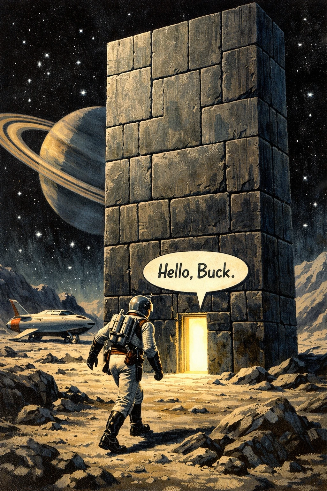

# Modular Monolith in Rust: A Beginner’s Guide
{: .no_toc }

Learn how to structure your Rust...
{: .lead }

<h2 align="center">
<b> 🚧 This post is under construction 🚧</b>
</h2>

<!-- ###################################################################### -->
<!-- ###################################################################### -->
<!-- ###################################################################### -->
## TL;DR
{: .no_toc }

* For beginners

<!-- All the [examples](https://github.com/40tude/hexagonal_lite) are GitHub -->

<!-- 

 

 -->

<!-- ###################################################################### -->
<!-- ###################################################################### -->
<!-- ###################################################################### -->
## Table of Contents
{: .no_toc .text-delta}
- TOC
{:toc}

<!-- ###################################################################### -->
<!-- ###################################################################### -->
<!-- ###################################################################### -->
## Introduction

<!-- ###################################################################### -->
<!-- ###################################################################### -->
<!-- ###################################################################### -->
## Step 00

<!-- ###################################################################### -->
<!-- ###################################################################### -->
<!-- ###################################################################### -->
## Webliography
* link