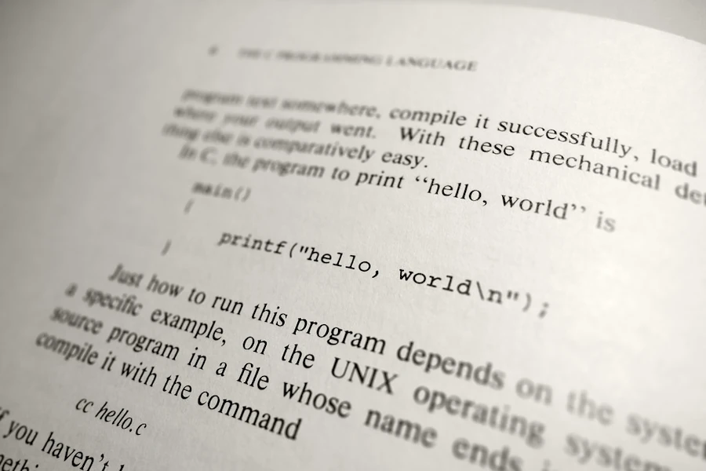

# Learning Modular Monolith Architecture with Rust
{: .no_toc }

A 7-project progression from Hello World to a fully decoupled, I/O-agnostic application using traits and crates
{: .lead }


<!-- <h2 align="center">
<span style="color:orange"><b> 🚧 This post is under construction 🚧</b></span>
</h2> -->


<!-- ###################################################################### -->
<!-- ###################################################################### -->
<!-- ###################################################################### -->
## TL;DR
{: .no_toc }

* For beginners who already wrote some Rust code
* We start from a single `main.rs` that prints "Hello Buck." and end with a fully modular workspace where the business logic has no idea how it reads or writes
* Each step compiles, runs, and passes its tests
* Step 00: Working proof of concept (one file, everything mixed)
* Step 01: Split into multiple files
* Step 02: Proper `tests/` folder
* Step 03: Hexagonal Architecture — ports (traits) and adapters (implementations)
* Step 04: One crate per component (Cargo workspace)
* Step 05: Improved error handling with `anyhow` & `thiserror`
* Step 06: Add a file adapter to prove it all works. If the architecture is right, the domain doesn't change
* Bonus: Improve the file adapter

All the [examples](https://github.com/40tude/modular_monolith_tuto) are on GitHub


<!-- ###################################################################### -->
<!-- ###################################################################### -->
<!-- ###################################################################### -->
### This is Episode 00
{: .no_toc }


#### The Posts Of The Saga
{: .no_toc }
* [Episode 00](): 🟢 Introduction + Step 00 - First prototype working
* [Episode 01](): 🟢 Step 01 - Split the source code in multiple files
* [Episode 02](): 🟢 Step 02 - Add a test folder
* [Episode 03](): 🟢 Step 03 - Implement Hexagonal Architecture
* [Episode 04](): 🔵 Step 04 - One crate per component
* [Episode 05](): 🔴 Step 05 - Anyhow & ThisError
* [Episode 06](): 🟢 Step 06 - Add new adapters + Conclusion
* [Episode 07](): 🟢 Bonus


<div align="center">
<br/>
<span></span>
</div>


<!-- ###################################################################### -->
<!-- ###################################################################### -->
<!-- ###################################################################### -->
## Table of Contents
{: .no_toc .text-delta}
- TOC
{:toc}


<!-- ###################################################################### -->
<!-- ###################################################################### -->
<!-- ###################################################################### -->
## Introduction

<!-- * Components vs Plugins
* More comments in the repo -->


Let me start from the end so you know where we're heading.

By the last episode of this series, we will have built a "Hello World" application that is **completely independent from its I/O**. Read that again. The business logic — the part that decides what greeting to produce — will have absolutely no idea whether it's reading a name from the console, from a file, from a TCP socket, or from a carrier pigeon with a USB stick taped to its leg. It won't know. It won't care. And that's exactly the point.

Now, before you roll your eyes and think "great, another architecture tutorial that overengineers a Hello World"... Yes. That's exactly what this is. And it's on purpose. The whole idea is to take the simplest possible problem — printing `Hello Buck.` — and use it as a vehicle to understand *why* and *how* we structure real applications. Because if you can't see the pattern on a trivial example, you certainly won't see it on a 50,000-line codebase. It is like physics or in mathematics. Rather than thinking in 13 dimension from start, it can be useful to think the problem in 1 or 2 dimensions first.

In addition, just to make sure we are in sync... If your current project consists of 200 LOC in a single `main.rs` file, yes your app is a monolith but no, you don't need an Hexagonal Architecture this would be ridiculous and overkill.


### Nothing new under the sun

Here's the thing: modular monoliths are not a new idea. Not even close. Like fashion, software architecture is an eternal cycle of rediscovery.

Back in the **1990s**, with Turbo C or Borland C++, we were already doing modular development. You'd pick a graphics library here, a math library there, link everything together, and produce a single `.exe`. One binary, multiple components. Sound familiar?

Then came the **2000s** and the era of dynamic loading. DLLs, COM, ActiveX — the idea was to build plugin architectures. Our application was still one process, but it could load and unload components at runtime. Flexibility was the buzzword.

Then we went *distributed*. The application itself was shattered across multiple machines. SOA, then microservices. Each piece running on its own server, communicating over the network. The promise was scalability and independent deployment. The reality was... well, let's just say distributed debugging at 3 AM is a special kind of fun.

In **2005**, Alistair Cockburn formalized [Hexagonal Architecture](https://alistair.cockburn.us/hexagonal-architecture/) (also known as "Ports and Adapters"). He didn't invent the underlying ideas. Good developers had been separating concerns for decades. However he gave us a clear **vocabulary** and well-defined **responsibilities**. Ports, adapters, domain, application layer... Suddenly we had words to describe what we'd been doing (or should have been doing) all along.

And now, in the **2020s**, the pendulum is swinging back. Modular monoliths are trendy again, and for good reason. The insight is simple: if your application is properly modular from day one, you get the best of both worlds. You start as a monolith: fast to develop, easy to deploy, simple to debug. Later, *if and when you actually need it*, you can extract any module into its own service running on a separate server. The key word being "if". Because most applications never need microservices and because not all of us have to solve the problems that Amazon, Nefilx, Google have. However, all applications need clean boundaries.

So that's what this series is about. We'll take a simple Rust project and, step by step, refactor it into a modular monolith following hexagonal architecture principles. By the end, swapping the console for a file adapter (or anything else) will be a matter of changing a couple of lines in `main.rs`.


### What you need before starting

This series is aimed at beginners. That said, you should have:
* Written some Rust code already (you've been through at least half of [The Rust Programming Language](https://doc.rust-lang.org/book/) aka TRPL)
* A working Rust toolchain (`cargo`, `rustc`)
* VSCode (or your editor of choice)
* A terminal and some basic comfort with the command line (create a folder, copy a file...)


### The road ahead

We'll go through 7 steps, each building on the previous one:

* **Step 00** — Build a working proof of concept. Everything in one file. It works, it's ugly, it's fine.
* **Step 01** — Split the code into multiple files. Same behavior, better organization.
* **Step 02** — Move the tests into a proper `tests/` folder.
* **Step 03** — Introduce Hexagonal Architecture: ports (traits) and adapters (implementations).
* **Step 04** — Promote each component to its own crate within a Cargo workspace.
* **Step 05** — Replace our homemade error types with `anyhow` and `thiserror`.
* **Step 06** — Add a file adapter to prove the architecture works. Plus a conclusion.
* **Bonus** — Extra insights, things to explore next.

By the end of the series, not only our "Hello World" application will be completely independent from its I/O but, cherry on the cake we will truely and deeply understand what the following diagram means:

<div align="center">
<br/>
<!-- <span>Optional comment</span> -->
</div>

Again, don't worry, at every step, we keep the application running and the tests passing. No big-bang refactor. No "trust me, it'll work at the end." Each step compiles, runs, and is tested. That's the deal.

Alright, let's get started, let's print "Hello World!" again.

<div align="center">
<br/>
<!-- <span>Optional comment</span> -->
</div>


<!-- ###################################################################### -->
<!-- ###################################################################### -->
<!-- ###################################################################### -->
## Objective

We want a working prototype (POC). This prototype is NOT the final application, but it proves that the "concept" is valid. Here the "concept" is rather simple, the idea is to print "Hello XYZ" if you enter "XYZ". We will go one sample code at a time, validating some "business rule", adding some tests...

At the end of this prototyping phase the folders will look like this:

```text
step_00/
│   Cargo.toml
├───examples
│       ex00.rs
│       ex01.rs
│       ex02.rs
│       ex03.rs
│       ex04.rs
│       ex05.rs
│       ex06.rs
│       ex07.rs
└───src
        main.rs
```


<!-- ###################################################################### -->
<!-- ###################################################################### -->
<!-- ###################################################################### -->
## Setup

You can download the project from [GitHub](https://github.com/40tude/modular_monolith_tuto) (at least you know it works) but I strongly suggest to rebuild it yourself.

```powershell
mkdir modular_monolith
cd modular_monolith
git init
cargo new step_00
cd step_00
code .
```


Once in VSCode, open an integrated terminal (CTRL+ù on FR keyboard)

```powershell
cargo run
```

Expected output:

```powershell
cargo run
   Compiling step_00 v0.1.0 (C:\Users\phili\OneDrive\Documents\Programmation\rust\01_xp\046_modular_monolith\step_00)
    Finished `dev` profile [unoptimized + debuginfo] target(s) in 0.48s
     Running `C:/Users/phili/rust_builds/Documents/Programmation/rust/01_xp/046_modular_monolith/step_00\debug\step_00.exe`
Hello, world!
```

At this point we know everything is up and running. Now, we can start to "play".


<!-- ###################################################################### -->
<!-- ###################################################################### -->
<!-- ###################################################################### -->
## Actions


<!-- ###################################################################### -->
### Example 00


In the project folder, create an `examples/` folder. In the folder write a `ex00.rs` code which uses a function `greet()` to format the message `Hello XYZ` when "XYZ" is used as an argument.

```rust
fn main() {
    let greeting = greet("Bob");
    println!("{}", greeting);
}

fn greet(name: &str) -> String {
    format!("Hello {}.", name)
}
```

Run the application with `cargo run --example ex00`. Expected output:
```powershell
Hello Bob.
```


<!-- ###################################################################### -->
### Example 01

There is an exception in our "business". If the argument is "Roberto", the application writes "Ciao Roberto!". Copy `ex00.rs` into `ex01.rs` and modify the code to take this requirement into account:

```rust
fn main() {
    let greeting = greet("Roberto");
    println!("{}", greeting);
}

fn greet(name: &str) -> String {
    // Special case for Roberto
    if name == "Roberto" {
        return "Ciao Roberto!".to_string();
    }
    format!("Hello {}.", name)
}
```

Run the application:

```powershell
cargo run -q --example ex01
Ciao Roberto!
```


<!-- ###################################################################### -->
### Example 02


There are 2 other specific cases in our "business".
1. If the length of the parameter is 0, nothing is displayed and an error is returned
2. The output cannot exceed 25 chars. If the parameter is too long, the output is truncated and ends with "...".

Copy `ex01.rs` into `ex02.rs`, implement both cases and the error management


```rust
fn main() {
    match greet("Alice") {
        Ok(greeting) => println!("{}\n", greeting),
        Err(e) => eprintln!("Error: {}\n", e),
    }
}

fn greet(name: &str) -> Result<String, String> {
    if name.is_empty() {
        return Err("Name cannot be empty".to_string());
    }

    // Special case for Roberto
    if name == "Roberto" {
        return Ok("Ciao Roberto!".to_string());
    }

    // Calculate greeting length
    let greeting_prefix = "Hello ";
    let greeting_suffix = ".";
    const MAX_LENGTH: usize = 25;
    let available_for_name = MAX_LENGTH - greeting_prefix.len() - greeting_suffix.len();

    // If name fits within limit
    if name.len() <= available_for_name {
        return Ok(format!("Hello {}.", name));
    }

    // Name is too long, truncate with ellipsis
    const TRAILER: &str = "...";
    let truncate_length = MAX_LENGTH - greeting_prefix.len() - TRAILER.len();
    let truncated_name = &name[..truncate_length.min(name.len())];
    Ok(format!("Hello {}{}", truncated_name, TRAILER))
}
```

Run the application and make some experiments:

```powershell
cargo run -q --example ex02
Hello Alice.
```


<!-- ###################################################################### -->
### Example 03

Copy `ex02.rs` into `ex03.rs`and add one test just to see how this works:

```rust
fn main() {
    match greet("Roberto") {
        Ok(greeting) => println!("{}\n", greeting),
        Err(e) => eprintln!("Error: {}\n", e),
    }
}

// Generates a greeting according to business rules
fn greet(name: &str) -> Result<String, String> {
    if name.is_empty() {
        return Err("Name cannot be empty".to_string());
    }

    // Special case for Roberto
    if name == "Roberto" {
        return Ok("Ciao Roberto!".to_string());
    }

    // Calculate greeting length
    let greeting_prefix = "Hello ";
    let greeting_suffix = ".";
    const MAX_LENGTH: usize = 25;
    let available_for_name = MAX_LENGTH - greeting_prefix.len() - greeting_suffix.len();

    // If name fits within limit
    if name.len() <= available_for_name {
        return Ok(format!("Hello {}.", name));
    }

    // Name is too long, truncate with ellipsis
    const TRAILER: &str = "...";
    let truncate_length = MAX_LENGTH - greeting_prefix.len() - TRAILER.len();
    let truncated_name = &name[..truncate_length.min(name.len())];
    Ok(format!("Hello {}{}", truncated_name, TRAILER))
}

#[cfg(test)]
mod tests {
    use super::*;

    #[test]
    fn empty_name_returns_error() {
        let result = greet("");
        assert!(result.is_err());
        let err = result.unwrap_err();
        assert_eq!(err.to_string(), "Name cannot be empty");
    }
}
```


Run the test and make some experiments:

```powershell
cargo test --example ex03
    Finished `test` profile [unoptimized + debuginfo] target(s) in 0.01s
     Running unittests examples\ex03.rs (C:/Users/phili/rust_builds/Documents/Programmation/rust/01_xp/046_modular_monolith/step_00\debug\examples\ex03-259cabc647968b82.exe)

running 1 test
test tests::empty_name_returns_error ... ok

test result: ok. 1 passed; 0 failed; 0 ignored; 0 measured; 0 filtered out; finished in 0.00s
```


<!-- ###################################################################### -->
### Example 04

Copy `ex03.rs` into `ex04.rs`, add a loop in `main()` and more tests. Make sure the `?` operator can be used in the `main()` function:

```rust
use std::io;
fn main() -> Result<(), String> {
    loop {
        // Read user input
        let mut input = String::new();
        io::stdin()
            .read_line(&mut input)
            .map_err(|e| format!("Failed to read input: {}", e))?;

        let name = input.trim();

        // Exit condition
        if name.eq_ignore_ascii_case("quit")
            || name.eq_ignore_ascii_case("exit")
            || name.eq_ignore_ascii_case("q!")
        {
            println!("\nGoodbye!");
            break;
        }

        // Skip empty input
        if name.is_empty() {
            continue;
        }

        match greet(name) {
            Ok(greeting) => println!("{}\n", greeting),
            Err(e) => eprintln!("Error: {}\n", e),
        }
    }

    Ok(())
}

/// Generates a greeting according to business rules
fn greet(name: &str) -> Result<String, String> {
    if name.is_empty() {
        return Err("Name cannot be empty".to_string());
    }

    // Special case for Roberto
    if name == "Roberto" {
        return Ok("Ciao Roberto!".to_string());
    }

    // Calculate greeting length
    let greeting_prefix = "Hello ";
    let greeting_suffix = ".";
    const MAX_LENGTH: usize = 25;
    let available_for_name = MAX_LENGTH - greeting_prefix.len() - greeting_suffix.len();

    // If name fits within limit
    if name.len() <= available_for_name {
        return Ok(format!("Hello {}.", name));
    }

    // Name is too long, truncate with ellipsis
    const TRAILER: &str = "...";
    let truncate_length = MAX_LENGTH - greeting_prefix.len() - TRAILER.len();
    let truncated_name = &name[..truncate_length.min(name.len())];
    Ok(format!("Hello {}{}", truncated_name, TRAILER))
}
```

Expected output (exit with CTRL+C):

```powershell
cargo run --example ex04
   Compiling step_00 v0.1.0 (C:\Users\phili\OneDrive\Documents\Programmation\rust\01_xp\046_modular_monolith\step_00)
    Finished `dev` profile [unoptimized + debuginfo] target(s) in 0.28s
     Running `C:/Users/phili/rust_builds/Documents/Programmation/rust/01_xp/046_modular_monolith/step_00\debug\examples\ex04.exe`
sdf
Hello sdf.
```

Here are the tests:

```rust
#[cfg(test)]
mod tests {
    use super::*;
    const MAX_LENGTH: usize = 25;
    const TRAILER: &str = "...";

    #[test]
    fn empty_name_returns_error() {
        let result = greet("");
        assert!(result.is_err());
        // assert_eq!(result.unwrap_err(), "Name cannot be empty");
        let err = result.unwrap_err();
        assert_eq!(err.to_string(), "Name cannot be empty");
    }

    #[test]
    fn normal_greeting() {
        let result = greet("Alice");
        assert!(result.is_ok());
        assert_eq!(result.unwrap(), "Hello Alice.");
    }

    #[test]
    fn roberto_special_case() {
        let result = greet("Roberto");
        assert!(result.is_ok());
        assert_eq!(result.unwrap(), "Ciao Roberto!");
    }

    #[test]
    fn domain_should_not_use_special_greeting_for_similar_names() {
        // Case sensitive - "roberto" should get normal greeting
        let result = greet("roberto");
        assert_eq!(result.unwrap(), "Hello roberto.");

        // Different name
        let result = greet("Robert");
        assert_eq!(result.unwrap(), "Hello Robert.");
    }

    #[test]
    fn greeting_length_limit() {
        // "Hello " (6) + "." (1) = 7, so max name is 18 chars for MAX_LENGTH total
        let result = greet("ExactlyEighteenChr");
        assert!(result.is_ok());

        let greeting = result.unwrap();
        assert_eq!(greeting, "Hello ExactlyEighteenChr.");
        assert_eq!(greeting.len(), MAX_LENGTH);
    }

    #[test]
    fn truncation_for_long_names() {
        let long_name = "ThisIsAVeryLongNameThatExceedsTheLimit";
        let result = greet(long_name);
        assert!(result.is_ok());

        let greeting = result.unwrap();
        assert!(greeting.starts_with("Hello "));
        assert!(greeting.ends_with(TRAILER));
        assert_eq!(greeting.len(), MAX_LENGTH);
    }

    #[test]
    fn boundary_case_nineteen_chars() {
        // 19 chars should trigger truncation (6 + 19 + 1 = 26, exceeds MAX_LENGTH)
        let name = "NineteenCharactersX";
        let result = greet(name);
        assert!(result.is_ok());

        let greeting = result.unwrap();
        assert!(greeting.ends_with(TRAILER));
        assert_eq!(greeting.len(), MAX_LENGTH);
    }

    #[test]
    fn domain_should_handle_unicode_names() {
        let result = greet("José");
        assert_eq!(result.unwrap(), "Hello José.");

        let result = greet("François");
        assert_eq!(result.unwrap(), "Hello François.");
    }

    #[test]
    fn domain_should_truncate_long_unicode_names() {
        // **Points of attention:** Unicode characters may have different byte lengths
        let long_unicode_name = "Müller-Öffentlicher-Straßenbahn-Überführung";
        let result = greet(long_unicode_name);

        assert!(result.is_ok());
        let greeting = result.unwrap();
        assert_eq!(greeting.len(), MAX_LENGTH);
        assert!(greeting.ends_with(TRAILER));
    }
}
```

Expected output:

```powershell
 cargo test --example ex04
   Compiling step_00 v0.1.0 (C:\Users\phili\OneDrive\Documents\Programmation\rust\01_xp\046_modular_monolith\step_00)
    Finished `test` profile [unoptimized + debuginfo] target(s) in 0.33s
     Running unittests examples\ex04.rs (C:/Users/phili/rust_builds/Documents/Programmation/rust/01_xp/046_modular_monolith/step_00\debug\examples\ex04-b27bcdfa5005af06.exe)

running 9 tests
test tests::boundary_case_nineteen_chars ... ok
test tests::domain_should_handle_unicode_names ... ok
test tests::domain_should_not_use_special_greeting_for_similar_names ... ok
test tests::empty_name_returns_error ... ok
test tests::roberto_special_case ... ok
test tests::truncation_for_long_names ... ok
test tests::domain_should_truncate_long_unicode_names ... ok
test tests::normal_greeting ... ok
test tests::greeting_length_limit ... ok

test result: ok. 9 passed; 0 failed; 0 ignored; 0 measured; 0 filtered out; finished in 0.00s
```


<!-- ###################################################################### -->
### Example 05

Copy `ex04.rs` into `ex05.rs` then improve the `main()` function so that CTRL+C can be avoided:

```rust
use std::io::{self, Write};
fn main() -> Result<(), String> {
    println!("=== Greeting Service (Step 00) ===");
    println!("Enter a name to greet (or 'quit' to exit):\n");

    loop {
        // Prompt for input
        print!("> ");
        io::stdout().flush().map_err(|e| e.to_string())?;

        // Read user input
        let mut input = String::new();
        io::stdin()
            .read_line(&mut input)
            .map_err(|e| format!("Failed to read input: {}", e))?;

        let name = input.trim();

        // Exit condition
        if name.eq_ignore_ascii_case("quit")
            || name.eq_ignore_ascii_case("exit")
            || name.eq_ignore_ascii_case("q!")
        {
            println!("\nGoodbye!");
            break;
        }

        // Skip empty input
        if name.is_empty() {
            continue;
        }

        match greet(name) {
            Ok(greeting) => println!("{}\n", greeting),
            Err(e) => eprintln!("Error: {}\n", e),
        }
    }

    Ok(())
}
// The rest of the code is unchanged
```

Expected output:

```powershell
cargo run --example ex05
=== Greeting Service (Step 00) ===
Enter a name to greet (or 'quit' to exit):

> ert
Hello ert.

> quit

Goodbye!
```


<!-- ###################################################################### -->
### Example 06

On this excellent [Web site](https://www.40tude.fr/docs/06_programmation/rust/), read again this page about [errors](). When this is done, copy `ex05.rs` into `ex06.rs` and modify the code in consequence:

```rust
use std::io::{self, Write};

pub type Error = Box<dyn std::error::Error>;
pub type Result<T> = std::result::Result<T, Error>;

fn main() -> Result<()> {
    println!("=== Greeting Service (Step 00) ===");
    println!("Enter a name to greet (or 'quit' to exit):\n");

    loop {
        // Prompt for input
        print!("> ");
        io::stdout().flush().map_err(|e| e.to_string())?;

        // Read user input
        let mut input = String::new();
        io::stdin()
            .read_line(&mut input)
            .map_err(|e| format!("Failed to read input: {}", e))?;

        let name = input.trim();

        // Exit condition
        if name.eq_ignore_ascii_case("quit")
            || name.eq_ignore_ascii_case("exit")
            || name.eq_ignore_ascii_case("q!")
        {
            println!("\nGoodbye!");
            break;
        }

        // Skip empty input
        if name.is_empty() {
            continue;
        }

        // Call domain logic
        match greet(name) {
            Ok(greeting) => println!("{}\n", greeting),
            Err(e) => eprintln!("Error: {}\n", e),
        }
    }

    Ok(())
}

// Generates a greeting according to business rules
fn greet(name: &str) -> Result<String> {
 ...
}
// The rest of the code is unchanged
```

```powershell
cargo run --example ex06
   Compiling step_00 v0.1.0 (C:\Users\phili\OneDrive\Documents\Programmation\rust\01_xp\046_modular_monolith\step_00)
    Finished `dev` profile [unoptimized + debuginfo] target(s) in 0.57s
     Running `C:/Users/phili/rust_builds/Documents/Programmation/rust/01_xp/046_modular_monolith/step_00\debug\examples\ex06.exe`
=== Greeting Service (Step 00) ===
Enter a name to greet (or 'quit' to exit):

> Zorro
Hello Zorro.

> exit

Goodbye!
```


<!-- ###################################################################### -->
### Example 07


The POC is done! Copy `ex06.rs` into `ex07.rs`, review the code once again, add comments, run the tests and take a break. See you tomorrow!

```rust
//! Greeting service example demonstrating error handling,
//! business rules, and basic I/O interaction.
//!
//! Run with:
//! - cargo run --example ex07
//! - cargo test --example ex07

use std::io::{self, Write};

pub type Error = Box<dyn std::error::Error>;
pub type Result<T> = std::result::Result<T, Error>;

/// Application entry point.
///
/// Runs an interactive loop that asks the user for a name,
/// applies greeting rules, and handles errors gracefully.
fn main() -> Result<()> {
    println!("=== Greeting Service (Step 00) ===");
    println!("Enter a name to greet (or 'quit' to exit):\n");

    loop {
        // Prompt for input
        print!("> ");
        io::stdout().flush().map_err(|e| e.to_string())?;

        // Read user input
        let mut input = String::new();
        io::stdin()
            .read_line(&mut input)
            .map_err(|e| format!("Failed to read input: {}", e))?;

        let name = input.trim();

        // Exit condition
        if name.eq_ignore_ascii_case("quit")
            || name.eq_ignore_ascii_case("exit")
            || name.eq_ignore_ascii_case("q!")
        {
            println!("\nGoodbye!");
            break;
        }

        // Skip empty input
        if name.is_empty() {
            continue;
        }

        // Call domain logic
        match greet(name) {
            Ok(greeting) => println!("{}\n", greeting),
            Err(e) => eprintln!("Error: {}\n", e),
        }
    }

    Ok(())
}

/// Generates a greeting according to business rules.
///
/// Rules:
/// - Default: "Hello {name}." with a maximum of 25 characters total
/// - Special case: "Roberto" returns "Ciao Roberto!"
/// - If the name is too long, it is truncated and suffixed with "..."
///
/// # Errors
/// Returns an error if the name is empty.
fn greet(name: &str) -> Result<String> {
    if name.is_empty() {
        return Err("Name cannot be empty".to_string().into());
    }

    // Special case for Roberto
    if name == "Roberto" {
        return Ok("Ciao Roberto!".to_string());
    }

    const MAX_LENGTH: usize = 25;
    const GREETING_PREFIX: &str = "Hello ";
    const GREETING_SUFFIX: &str = ".";
    const TRAILER: &str = "...";

    let available_for_name = MAX_LENGTH - GREETING_PREFIX.len() - GREETING_SUFFIX.len();

    // Name fits within the allowed length
    if name.len() <= available_for_name {
        return Ok(format!("Hello {}.", name));
    }

    // Name is too long, truncate and add ellipsis
    let truncate_length = MAX_LENGTH - GREETING_PREFIX.len() - TRAILER.len();

    let truncated_name = &name[..truncate_length.min(name.len())];
    Ok(format!("Hello {}{}", truncated_name, TRAILER))
}
// The rest of the code is unchanged
```

Expected output:

```powershell
cargo run --example ex07
   Compiling step_00 v0.1.0 (C:\Users\phili\OneDrive\Documents\Programmation\rust\01_xp\046_modular_monolith\step_00)
    Finished `dev` profile [unoptimized + debuginfo] target(s) in 0.40s
     Running `C:/Users/phili/rust_builds/Documents/Programmation/rust/01_xp/046_modular_monolith/step_00\debug\examples\ex07.exe`
=== Greeting Service (Step 00) ===
Enter a name to greet (or 'quit' to exit):

> Obiwan
Hello Obiwan.

> Luke
Hello Luke.

> Exit

Goodbye!

```


```powershell
cargo test --example ex07
   Compiling step_00 v0.1.0 (C:\Users\phili\OneDrive\Documents\Programmation\rust\01_xp\046_modular_monolith\step_00)
    Finished `test` profile [unoptimized + debuginfo] target(s) in 0.48s
     Running unittests examples\ex07.rs (C:/Users/phili/rust_builds/Documents/Programmation/rust/01_xp/046_modular_monolith/step_00\debug\examples\ex07-789efb9150878b4d.exe)

running 9 tests
test tests::boundary_case_nineteen_chars ... ok
test tests::domain_should_handle_unicode_names ... ok
test tests::empty_name_returns_error ... ok
test tests::greeting_length_limit ... ok
test tests::domain_should_not_use_special_greeting_for_similar_names ... ok
test tests::roberto_special_case ... ok
test tests::domain_should_truncate_long_unicode_names ... ok
test tests::truncation_for_long_names ... ok
test tests::normal_greeting ... ok

test result: ok. 9 passed; 0 failed; 0 ignored; 0 measured; 0 filtered out; finished in 0.00s

```


<!-- ###################################################################### -->
<!-- ###################################################################### -->
<!-- ###################################################################### -->
## Summary

{: .new-title }
> What have we done so far?
>
* We have a working proof of concept
* The business rule (say "Hello") is applied
* Exceptions to the business rule are managed ("Roberto", empty parameter...)
* Errors are returned
* Tests are written but remember that "*testing can be used to show the presence of bugs, but never to show their absence*" (Edsger W. Dijkstra).


<!-- ###################################################################### -->
<!-- ###################################################################### -->
<!-- ###################################################################### -->
## Next Steps

Tomorrow, read [Episode 01]().

* [Episode 00](): Introduction + Step 00 - First prototype working
* [Episode 01](): Step 01 - Split the source code in multiple files
* [Episode 02](): Step 02 - Add a test folder
* [Episode 03](): Step 03 - Implement Hexagonal Architecture
* [Episode 04](): Step 04 - One crate per component
* [Episode 05](): Step 05 - Anyhow & ThisError
* [Episode 06](): Step 06 - Add new adapters + Conclusion
* [Episode 07](): Bonus

