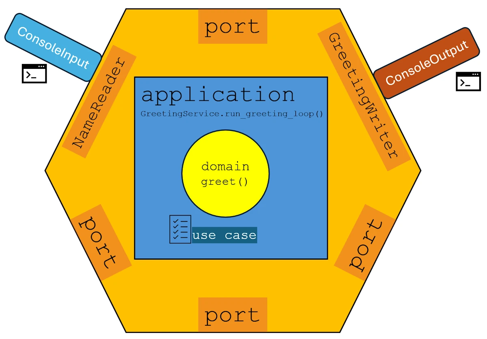
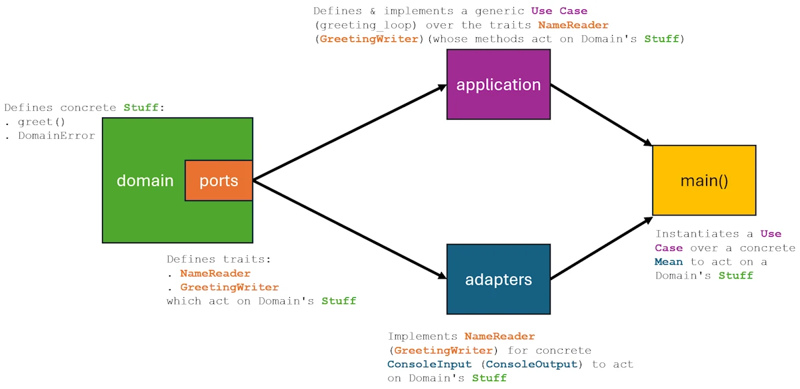

# Learning Modular Monolith Architecture with Rust
{: .no_toc }

A 7-project progression from Hello World to a fully decoupled, I/O-agnostic application using traits and crates
{: .lead }


<h2 align="center">
<span style="color:orange"><b> 🚧 This post is under construction 🚧</b></span>
</h2>


<!-- ###################################################################### -->
<!-- ###################################################################### -->
<!-- ###################################################################### -->
### This is Episode 05
{: .no_toc }

All the [examples](https://github.com/40tude/modular_monolith_tuto) are on GitHub


#### The Posts Of The Saga
{: .no_toc }
* [Episode 00](): Introduction + Step 00 - First prototype working
* [Episode 01](): Step 01 - Split the source code in multiple files
* [Episode 02](): Step 02 - Add a test folder
* [Episode 03](): Step 03 - Implement Hexagonal Architecture
* [Episode 04](): Step 04 - One crate per component
* [Episode 05](): Step 05 - Anyhow & ThisError
* [Episode 06](): Step 06 - Add new adapters + Conclusion
* [Episode 07](): Bonus


<div align="center">
<br/>
<span></span>
</div>


<!-- ###################################################################### -->
<!-- ###################################################################### -->
<!-- ###################################################################### -->
## Table of Contents
{: .no_toc .text-delta}
- TOC
{:toc}


<!-- ###################################################################### -->
<!-- ###################################################################### -->
<!-- ###################################################################### -->
## Objective

We want to include `anyhow` and `thiserror` crates. At the end of this episode, the folder hierarchy should look like this:


```text
step_05
│   Cargo.toml
└───crates
    ├───adapter_console
    │   │   Cargo.toml
    │   ├───src
    │   │       errors.rs
    │   │       input.rs
    │   │       lib.rs
    │   │       output.rs
    │   └───tests
    │           adapter_console_test.rs
    ├───app
    │   │   Cargo.toml
    │   └───src
    │           main.rs
    ├───application
    │   │   Cargo.toml
    │   ├───src
    │   │       errors.rs
    │   │       greeting_service.rs
    │   │       lib.rs
    │   └───tests
    │           application_test.rs
    ├───domain
    │   │   Cargo.toml
    │   ├───src
    │   │       errors.rs
    │   │       greeting.rs
    │   │       lib.rs
    │   │       ports.rs
    │   └───tests
    │           domain_test.rs
    └───integration_tests
        │   Cargo.toml
        ├───src
        │       lib.rs
        └───tests
                integration_test.rs
```


<!-- ###################################################################### -->
<!-- ###################################################################### -->
<!-- ###################################################################### -->
## Setup

* Save your work
* Quit VSCode
* You should have a terminal open and you should be in the `step_04/` folder

```powershell
cd ..
# make a copy the folder step_04 and name it step_05
Copy-Item ./step_04 ./step_05 -Recurse
cd step_05
code .
```

* If you have **ANY** doubt about `anyhow` or `thiserror` before you move forward, read this [dedicated page]().


<!-- ###################################################################### -->
<!-- ###################################################################### -->
<!-- ###################################################################### -->
## Actions
{: .no_toc }

<!-- ###################################################################### -->
### Cargo.toml


```toml
[workspace]
members = [
    "crates/domain",
    "crates/application",
    "crates/adapter_console",
    "crates/app",
    "crates/integration_tests",
]
resolver = "3"

[workspace.package]
version = "0.1.0"
edition = "2024"
license = "MIT"

[workspace.dependencies]
thiserror = "2.0"
anyhow = "1.0"
```


**Points of attention:**
* Obviously, `thiserror` and `anyhow` are listed


<!-- ###################################################################### -->
### The domain crate
<!-- {: .no_toc } -->


Here is `Cargo.toml`:

```toml
[package]
name = "domain"
version.workspace = true
edition.workspace = true
license.workspace = true

[dependencies]
thiserror.workspace = true
```

**Points of attention:**
* `thiserror` is added


Let's first look at `error.rs`

```rust
use thiserror::Error;

#[derive(Error, Debug)]
pub enum DomainError {
    #[error("Name cannot be empty")]
    EmptyName,
}

pub type Result<T> = std::result::Result<T, DomainError>;
```

**Points of attention:**
* Everything here is domain specific
* With the help of `thiserror`, we define a domain error enum (see `DomainError`). So far it only have one variant (see `EmptyName`).
* The type alias `Result` is updated from `std::result::Result<T, Error>` to `std::result::Result<T, DomainError>`


Now we can update `ports.rs`. And believe it or not, the final version of this one took me a while... Why? Simply because initially I put `InfraError` in `error.rs`. I knew it was wrong. I had a red LED blinking somewhere in my mind... But I was not brave (smart) enough to move it here. Then many things were overcomplicated. Anyway, it took me a while but I learnt a lot. Ok, here is the code I have today:

```rust
use std::any::Any;

pub trait InfraError: std::error::Error + Send + Sync + 'static {
    fn as_any(&self) -> &dyn Any;
}

pub trait NameReader {
    fn read_name(&self) -> Result<String, Box<dyn InfraError>>;
}

pub trait GreetingWriter {
    fn write_greeting(&self, greeting: &str) -> Result<(), Box<dyn InfraError>>;
}
```


**Points of attention:**

* **Important.** Look at the figure below. My understanding is as follow: when an adapter report an error this is an error from the "outside world", the infrastructure (file missing, network error...). We don't know and we cannot know them all at compile time (today the input come from UDP, tomorrow it will come from a keyboard...).
* This is why a trait for infrastructure errors is defined (see `InfraError`). In fact, `InfraError` is a contract that the `domain` imposes on the adapters: "if you want to report an infra error to me, implement this feature."
* Once `InfraError` is defined the new signature of `read_name` and `write_greeting` explains that, on error they will return `Box<dyn InfraError>`


<div align="center">
<br/>
<!-- <span>Optional comment</span> -->
</div>


In `greeting.rs` only the beginning of the code is updated because now, it can return a domain specific error when the `name` is empty:

```rust
use crate::errors::{DomainError, Result};

pub fn greet(name: &str) -> Result<String> {
    if name.is_empty() {
        return Err(DomainError::EmptyName);
    }
// Rest of the code unmodified
}
```


Finally here is `lib.rs`:

```rust
pub mod errors;
pub mod greeting;
pub mod ports;

pub use greeting::greet;
pub use ports::{GreetingWriter, InfraError, NameReader};
```

**Points of attention:**
* The reason why `InfraError` and `NameReaderError` are re-exported is to "hide" the name "ports" so that in the input module of the `adapter_console` crate we will write `use domain::{NameReader, NameReaderError}` instead of `use domain::{NameReader, ports::NameReaderError};`. Yes, I know, this somewhat contradict what I said in [Step 02](#librs) but we have to be pragmatic.


<!-- ###################################################################### -->
### The adapter_console crate
<!-- {: .no_toc } -->

```toml
[package]
name = "adapter_console"
version.workspace = true
edition.workspace = true
license.workspace = true

[dependencies]
domain = { path = "../domain" }
thiserror.workspace = true
```

**Points of attention:**
* `thiserror` is added


The `errors.rs` now looks like:

```rust
use domain::InfraError;
use std::any::Any;
use thiserror::Error;

#[derive(Error, Debug)]
pub enum ConsoleError {
    #[error("Console I/O error: {0}")]
    Io(#[from] std::io::Error),
}

impl InfraError for ConsoleError {
    fn as_any(&self) -> &dyn Any {
        self
    }
}

pub(crate) fn into_infra(e: impl Into<ConsoleError>) -> Box<dyn InfraError> {
    Box::new(e.into())
}
```

**Points of attention:**
* To make a long story short, here, every line is important but we will understand why when we will read `input.rs` and `output.rs`
* Using `thiserror` we first express what is a `ConsoleError`
* Then we implement `InfraError` for `ConsoleError`
* At the very bottom of the code there is a utility function which is used in `input.rs` and `output.rs`


Here is the new version of `output.rs`:

```rust
use crate::errors::into_infra;
use domain::GreetingWriter;
use domain::InfraError;
use std::io::{self, Write};

#[derive(Default)]
pub struct ConsoleOutput;

impl ConsoleOutput {
    pub fn new() -> Self {
        Self
    }
}

impl GreetingWriter for ConsoleOutput {
    fn write_greeting(&self, greeting: &str) -> Result<(), Box<dyn InfraError>> {
        // println!("{greeting}"); is replaced by the next expression to show
        // how to handle error (e.g., stdout redirected to full disk)
        writeln!(io::stdout(), "{greeting}").map_err(into_infra)?;
        //                                  .map_err(|e| Box::new(ConsoleError::from(e)) as Box<dyn InfraError>)?;
        Ok(())
    }
}
```

**Points of attention:**
* Check the `use domain::InfraError;`
* In the signature of `write_greeting`, see the `Result<(), Box<dyn InfraError>>`
* In the implementation of `GreetingWriter` for `ConsoleOutput` I no longer use `println!` but `writeln!`. Indeed the first `panic!` on error while the second return an error.
* Then we take this error and we map it to an InfraError. This is the purpose of `into_infra` which shorten the closure in comment. How does this work?
    1. The error, if any is a `std::io::Error` and we want to converti it into a `InfraError`
    2. `into_infra` calls `e.into()` and this triggers the `#[from]` conversion
    3. The `#[from]` generates `impl From<std::io::Error> for ConsoleError`, which builds `ConsoleError::Io(e)`
    4. That `ConsoleError::Io(e)` gets boxed as `Box<dyn InfraError>`
    5. So `ConsoleError::Io` is constructed every time an I/O error occurs. We don't see it explicitly in the code because `into()` does the job for us.

Ok but why do we need `ConsoleError`?

```rust
pub enum ConsoleError {
    #[error("Console I/O error: {0}")]
    Io(#[from] std::io::Error),
}
```
Because we have
```rust
impl InfraError for ConsoleError {...}

```

And the orphan rule say we can't implement `InfraError` for `std::io::Error` in the adapter crate. Indeed, we don't own the trait (it's in `domain`) nor the type (it's in `std`). Finally, `ConsoleError` is the type that makes `impl InfraError for ConsoleError` legal.

I told you, in `errors.rs` every line was important.


In `input.rs` we now have:

```rust
use crate::errors::into_infra;
use domain::{InfraError, NameReader};
use std::io::{self, Write};

#[derive(Default)]
pub struct ConsoleInput;

impl ConsoleInput {
    pub fn new() -> Self {
        Self
    }
}

impl NameReader for ConsoleInput {
    fn read_name(&self) -> Result<String, Box<dyn InfraError>> {
        print!("> ");
        io::stdout().flush().map_err(into_infra)?;
        //                  .map_err(|e| Box::new(ConsoleError::from(e)) as Box<dyn InfraError>)?;

        let mut input = String::new();
        io::stdin().read_line(&mut input).map_err(into_infra)?;
        //                               .map_err(|e| Box::new(ConsoleError::from(e)) as Box<dyn InfraError>)?;

        Ok(input.trim().to_string())
    }
}
```


<!-- ###################################################################### -->
### The app crate
<!-- {: .no_toc } -->

```toml
[package]
name = "app"
version.workspace = true
edition.workspace = true
license.workspace = true

[[bin]]
name = "step_05"
path = "src/main.rs"

[dependencies]
application = { path = "../application" }
adapter_console = { path = "../adapter_console" }
anyhow.workspace = true
```

**Points of attention:**
* `anyhow` is in the dependencies


The `error.rs` file has been deleted, only remains `main.rs`:


```rust
use adapter_console::{ConsoleInput, ConsoleOutput};
use application::GreetingService;

use anyhow::{Context, Result};

fn main() -> Result<()> {
    println!("=== Greeting Service (Step 05 - Modular Monolith & Hexagonal Architecture) ===");
    println!("Enter a name to greet (or 'quit' to exit):\n");

    // Dependency injection: Create adapters
    let input = ConsoleInput::new();
    let output = ConsoleOutput::new();

    // Create application service and run either in a loop or once
    let service = GreetingService::new();

    // service
    //     .run_greeting_loop(&input, &output)
    //     .context("Failed to run interactive loop")?;

    service
        .run_greeting_once(&input, &output)
        .context("Failed to run the greeting service once")?;

    Ok(())
}
```

**Points of attention:**
* As we will see in the application crate (in charge of orchestrating the use cases) I added a `run_greeting_once()` use case.
* The code above demonstrate that no matter the use case, from `main()` the calling process is the same.
* If you want to test the run_greeting_loop again simply uncomment/comment the concerned lines


<!-- ###################################################################### -->
### The application crate
<!-- {: .no_toc } -->

```toml
[package]
name = "application"
version.workspace = true
edition.workspace = true
license.workspace = true

[dependencies]
domain = { path = "../domain" }
thiserror.workspace = true
```

**Points of attention:**
* `thiserror` is added

`lib.rs` is not impacted.

Let's see how `errors.rs` works:

```rust
use domain::InfraError;
use domain::errors::DomainError;
use thiserror::Error;

#[derive(Debug, Error)]
pub enum ApplicationError {
    #[error("Domain error: {0}")]
    Domain(#[from] DomainError),

    #[error("Infrastructure error: {0}")]
    Infrastructure(Box<dyn InfraError>),
}

pub type Result<T> = std::result::Result<T, ApplicationError>;

impl From<Box<dyn InfraError>> for ApplicationError {
    fn from(e: Box<dyn InfraError>) -> Self {
        Self::Infrastructure(e)
    }
}
```

* Remember... A use case in the application crate can receive 2 kinds of error: the ones from the domain (`DomainError`, when `name` is empty) and the ones from the outside world (`InfraError`, after Skynet decided to shutdown all the others networks).
* So an `ApplicationError` is an enum. It can either be a `DomainError` or an `InfraError`
* As usually we keep defining an alias for `Result<T>`
* At the very end we implement `From` in order to convert an `InfraError` into an `ApplicationError`


Let's see how the new use case looks like in `greeting_service.rs`:

```rust
use crate::errors::Result;

#[derive(Default)]
pub struct GreetingService;

impl GreetingService {
    pub fn new() -> Self {
        Self
    }

    pub fn run_greeting_once(
        &self,
        input: &dyn domain::NameReader,
        output: &dyn domain::GreetingWriter,
    ) -> Result<()> {
        let name = input.read_name()?;
        let greeting = domain::greet(&name)?;
        output.write_greeting(&greeting)?;
        println!("\nGoodbye!");
        Ok(())
    }

    pub fn run_greeting_loop(
        &self,
        input: &dyn domain::NameReader,
        output: &dyn domain::GreetingWriter,
    ) -> Result<()> {
        loop {
            let name = input.read_name()?;

            if name.eq_ignore_ascii_case("quit")
                || name.eq_ignore_ascii_case("exit")
                || name.eq_ignore_ascii_case("q!")
            {
                println!("\nGoodbye!");
                break;
            }

            let greeting = match domain::greet(&name) {
                Ok(g) => g,
                Err(e) => {
                    println!("Error: {e}\n");
                    continue;
                }
            };
            output.write_greeting(&greeting)?;
            println!(); // Extra newline for readability
        }
        Ok(())
    }
}
```


**Points of attention:**
* Thanks to the `?` operator at the end of each line, the `run_greeting_once()` use case is deceptively straightforward. However we should not forget this ease of reading come from all the conversion of error types that take place behind the scene.
* Note how in order to demonstrate how errors bulbe-up, in `run_greeting_loop` I removed the `if name.is_empty(){...}` block of code and handle the errors returned by `domain::greet()` (here we just print the error and continue)


<!-- ###################################################################### -->
### The integration_tests crate

Only one change in `integration_test.rs` indeed, the line:

```rust
use domain::{GreetingWriter, NameReader, error::Result};
```

becomes:

```rust
use domain::{GreetingWriter, InfraError, NameReader};
```

Then `read_name` and `write_greeting` have the signature we already explained when we talked about `input` and `output` modules of the `adapter_console` crate.


<!-- ###################################################################### -->
### Build, run & test


Build, run and test the application. Try this:

```powershell
cargo test -p adapter_console
cargo test -p adapter_console --test adapter_console_test
cargo test -p adapter_console --test adapter_console_test console # any test containing "console"

cargo test -p application
cargo test -p domain --test domain_test
cargo test -p integration_tests

cargo run -p app
cargo run
```


Build, run and test the application. Find below the expected output:

If the use case is once here is what you can see:

```powershell
cargo run
    Finished `dev` profile [unoptimized + debuginfo] target(s) in 0.03s
     Running `C:/Users/phili/rust_builds/Documents/Programmation/rust/01_xp/046_modular_monolith/step_05\debug\step_05.exe`
=== Greeting Service (Step 05 - Modular Monolith & Hexagonal Architecture) ===
Enter a name to greet (or 'quit' to exit):

> World
Hello World.

Goodbye!
```


Below is the output with the loop use case:

```powershell
cargo run
    Finished `dev` profile [unoptimized + debuginfo] target(s) in 0.03s
     Running `C:/Users/phili/rust_builds/Documents/Programmation/rust/01_xp/046_modular_monolith/step_05\debug\step_05.exe`
=== Greeting Service (Step 05 - Modular Monolith & Hexagonal Architecture) ===
Enter a name to greet (or 'quit' to exit):

> Marcel
Hello Marcel.

>
Error: Name cannot be empty

> q!

Goodbye!
```


And now the test:

```powershell
 cargo test -p domain
    Finished `test` profile [unoptimized + debuginfo] target(s) in 0.02s
     Running unittests src\lib.rs (C:/Users/phili/rust_builds/Documents/Programmation/rust/01_xp/046_modular_monolith/step_05\debug\deps\domain-812d4dc27a84c7ce.exe)

running 0 tests

test result: ok. 0 passed; 0 failed; 0 ignored; 0 measured; 0 filtered out; finished in 0.00s

     Running tests\domain_test.rs (C:/Users/phili/rust_builds/Documents/Programmation/rust/01_xp/046_modular_monolith/step_05\debug\deps\domain_test-11a40ea11f17113d.exe)

running 9 tests
test domain_should_handle_unicode_names ... ok
test domain_should_truncate_long_unicode_names ... ok
test empty_name_returns_error ... ok
test boundary_case_nineteen_chars ... ok
test greeting_length_limit ... ok
test domain_should_not_use_special_greeting_for_similar_names ... ok
test roberto_special_case ... ok
test normal_greeting ... ok
test truncation_for_long_names ... ok

test result: ok. 9 passed; 0 failed; 0 ignored; 0 measured; 0 filtered out; finished in 0.00s

   Doc-tests domain

running 0 tests

test result: ok. 0 passed; 0 failed; 0 ignored; 0 measured; 0 filtered out; finished in 0.00s
```


<!-- ###################################################################### -->
<!-- ###################################################################### -->
<!-- ###################################################################### -->
## Summary

<div align="center">
<br/>
<!-- <span>Optional comment</span> -->
</div>


{: .new-title }
> What have we done so far?
>
* `anyhow` and `thiserror` are now integrated.
* We added a use case (`.run_greeting_once()`)
* The need to return specific errors forced us to distinguish between `InfraError` and `DomainError` and to find a way to return either one within a single container (`ApplicationError`).
* It was an opportunity to impose an additional port (`InfraError`) to the adapters if they want to report errors from the infrastructure.
* Implementing the `From` trait for `InfraError` helped to keep the `?` in the source code.


<!-- ###################################################################### -->
<!-- ###################################################################### -->
<!-- ###################################################################### -->
## Next Steps

Next you can read [Episode 06]().

* [Episode 00](): Introduction + Step 00 - First prototype working
* [Episode 01](): Step 01 - Split the source code in multiple files
* [Episode 02](): Step 02 - Add a test folder
* [Episode 03](): Step 03 - Implement Hexagonal Architecture
* [Episode 04](): Step 04 - One crate per component
* [Episode 05](): Step 05 - Anyhow & ThisError
* [Episode 06](): Step 06 - Add new adapters + Conclusion
* [Episode 07](): Bonus
