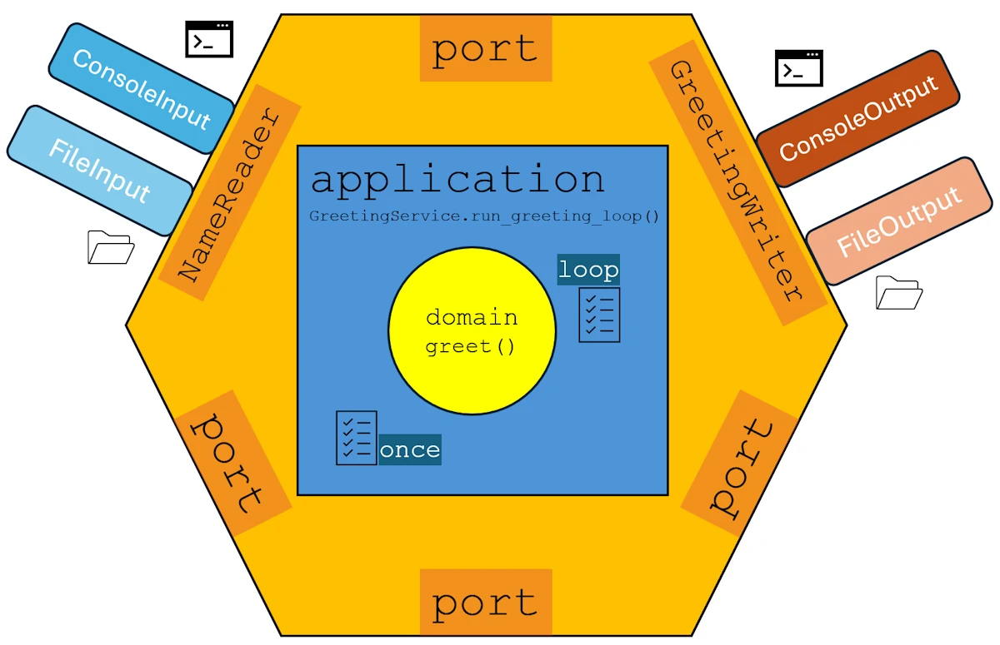

# Learning Modular Monolith Architecture with Rust
{: .no_toc }

Learn Rust modular monolith: 7-step tutorial from Hello World to I/O-agnostic application with hexagonal architecture, traits and crates. For beginners, tinkerers, hobbyists, amateurs, and early-career developers...
{: .lead }


<!-- <h2 align="center">
<span style="color:orange"><b> 🚧 This post is under construction 🚧</b></span>
</h2> -->


<!-- ###################################################################### -->
<!-- ###################################################################### -->
<!-- ###################################################################### -->
### This is the Bonus Episode
{: .no_toc }

All the [examples](https://github.com/40tude/modular_monolith_tuto) are on GitHub


#### The Posts Of The Saga
{: .no_toc }
* [Episode 00](): 🟢 Introduction + Step 00 - First prototype working
* [Episode 01](): 🟢 Step 01 - Split the source code in multiple files
* [Episode 02](): 🟢 Step 02 - Add a test folder
* [Episode 03](): 🟢 Step 03 - Implement Hexagonal Architecture
* [Episode 04](): 🔵 Step 04 - One crate per component
* [Episode 05](): 🔴 Step 05 - Anyhow & ThisError
* [Episode 06](): 🟢 Step 06 - Add new adapters + Conclusion
* [Episode 07](): 🟢 Bonus


<div align="center">
<br/>
<span></span>
</div>


<!-- ###################################################################### -->
<!-- ###################################################################### -->
<!-- ###################################################################### -->
## Table of Contents
{: .no_toc .text-delta}
- TOC
{:toc}


<!-- ###################################################################### -->
<!-- ###################################################################### -->
<!-- ###################################################################### -->
## Objective

We want to improve the `adapter_file` so that, in `main()`, it is used exactly like the `adapter_console`. In addition we want  to be able to read multiple names from the input file and write multiple greetings in the output file.

At the end of this episode, the folder hierarchy should look like this:

```text
step_07/
│   Cargo.toml
│   input.txt
│   output.txt
├───.cargo
│       config.toml
└───crates
    ├───adapter_console
    │   │   Cargo.toml
    │   ├───src
    │   │       errors.rs
    │   │       input.rs
    │   │       lib.rs
    │   │       output.rs
    │   └───tests
    │           adapter_console_test.rs
    ├───adapter_file
    │   │   Cargo.toml
    │   ├───src
    │   │       errors.rs
    │   │       input.rs
    │   │       lib.rs
    │   │       output.rs
    │   └───tests
    │           adapter_file_test.rs
    ├───app
    │   │   Cargo.toml
    │   └───src
    │           main.rs
    ├───application
    │   │   Cargo.toml
    │   ├───src
    │   │       errors.rs
    │   │       greeting_service.rs
    │   │       lib.rs
    │   └───tests
    │           application_test.rs
    ├───domain
    │   │   Cargo.toml
    │   ├───src
    │   │       errors.rs
    │   │       greeting.rs
    │   │       lib.rs
    │   │       ports.rs
    │   └───tests
    │           domain_test.rs
    └───integration_tests
        │   Cargo.toml
        ├───src
        │       lib.rs
        └───tests
                integration_test.rs
```

**Points of attention:**
* No change. This is the same directory tree as in `step_06`


<!-- ###################################################################### -->
<!-- ###################################################################### -->
<!-- ###################################################################### -->
## Setup
{: .no_toc }

* Save your work
* Quit VSCode
* You should have a terminal open and you should be in the `step_06/` folder

```powershell
cd ..
# make a copy the folder step_06 and name it step_07
Copy-Item ./step_06 ./step_07 -Recurse
cd step_07
code .
```


<!-- ###################################################################### -->
<!-- ###################################################################### -->
<!-- ###################################################################### -->
## Actions

<!-- ###################################################################### -->
### Cargo.toml

No change


<!-- ###################################################################### -->
### The domain crate
<!-- {: .no_toc } -->


The `ports.rs` file:

```rust
use std::any::Any;

pub trait InfraError: std::error::Error + Send + Sync + 'static {
    fn as_any(&self) -> &dyn Any;
}

pub trait NameReader {
    fn read_name(&mut self) -> Result<String, Box<dyn InfraError>>;
}

pub trait GreetingWriter {
    fn write_greeting(&self, greeting: &str) -> Result<(), Box<dyn InfraError>>;
}
```

**Points of attention:**
* Now the parameter in `read_name()` is `&mut self` (it used to be `&self`)


<!-- ###################################################################### -->
### The adapter_console crate
<!-- {: .no_toc } -->

The others files of the crate do no change but since the contract has changed in `ports.rs`, we must update the signature of `read_name()`. See below:

```rust

// Rest of the code does not change

impl NameReader for ConsoleInput {
    fn read_name(&mut self) -> Result<String, Box<dyn InfraError>> {
        print!("> ");
        io::stdout().flush().map_err(into_infra)?;

        let mut input = String::new();
        io::stdin().read_line(&mut input).map_err(into_infra)?;

        Ok(input.trim().to_string())
    }
}
```

**Points of attention:**
* Do you see the `&mut self`?
* Here we do not use the fact that `self` is `&mut`
* Apart the signature, the code is the same as in `step_06`


<!-- ###################################################################### -->
### The adapter_file crate
<!-- {: .no_toc } -->

`errors.rs` and `lib.rs` do not change. However, since we want to read and write multiples names, `input.rs` and `output.rs` change.

In `output.rs` here is the new version of `write_greeting()`

```rust
// The rest of the code do not change

impl GreetingWriter for FileOutput {
    fn write_greeting(&self, greeting: &str) -> Result<(), Box<dyn InfraError>> {
        let mut file = std::fs::OpenOptions::new()
            .create(true)
            .append(true)
            .open(&self.path)
            .map_err(into_infra)?;
        file.write_all(format!("{greeting}\n").as_bytes()).map_err(into_infra)?;
        Ok(())
    }
}
```

**Points of attention:**
* Now the file is opened in append mode
* `.write_all()` replace the `::write()` we used in `step_06`


The `input.rs` is much more impacted but it becomes much smarter:

```rust
use crate::errors::into_infra;
use domain::{InfraError, NameReader};
use std::path::PathBuf;

#[derive(Debug)]
pub struct FileInput {
    path: PathBuf,
    names: Option<Vec<String>>,
    index: usize,
}

impl FileInput {
    pub fn new(path: impl Into<PathBuf>) -> Self {
        Self {
            path: path.into(),
            names: None,
            index: 0,
        }
    }

    fn load_names(&mut self) -> Result<(), Box<dyn InfraError>> {
        let content = std::fs::read_to_string(&self.path).map_err(into_infra)?;
        self.names = Some(
            content
                .lines()
                .map(|line| line.trim().to_string())
                .collect(),
        );
        self.index = 0;
        Ok(())
    }
}

impl NameReader for FileInput {
    fn read_name(&mut self) -> Result<String, Box<dyn InfraError>> {
        if self.names.is_none() {
            self.load_names()?;
        }

        let names = self.names.as_ref().expect("names must be loaded");

        if self.index < names.len() {
            let name = names[self.index].clone();
            self.index += 1;
            Ok(name)
        } else {
            Ok("quit".to_string())
        }
    }
}
```

**Points of attention:**
* In `.new()` the `path` to the input file is stored and `Self` is returned. This is what ensures, that now, creating a `ConsoleInput` or a `FileInput` looks the same:
    ```rust
    let mut input = ConsoleInput::new();
    let mut input = FileInput::new("input.txt");
    ```
* When `.read_name()` is called, only during the the very first call (see `self.names.is_none()`) we load the names (see `load_names()`). Think to it as a kind of lazy implementation.
* Then, no matter if it is the first call or not, if the `index` is not at the end of the list of names, a name build and returned.
* If the index is at the end of the vector we return "quit" as we used to do on the console.
* In `load_names()` we do not filter the empty lines. This is not our job. An input adapter get the names from the outside world and if the [WOPR](https://youtu.be/iRsycWRQrc8) did not kill everybody (no `InfraError`), it returns them, as they are.


<!-- ###################################################################### -->
### The application crate
<!-- {: .no_toc } -->

Is not modified.


<!-- ###################################################################### -->
### The app crate
<!-- {: .no_toc } -->

Let's see the impact of the new signature in `main()`:

```rust
use adapter_console::{ConsoleInput, ConsoleOutput};
use adapter_file::{FileInput, FileOutput};

use application::GreetingService;

use anyhow::{Context, Result};

fn main() -> Result<()> {
    println!("=== Greeting Service (Step 07 - File Adapter Demo) ===");

    // Dependency injection: Create file-based adapters
    // let output = ConsoleOutput::new();
    // let mut input = ConsoleInput::new();

    let output = FileOutput::new("output.txt");
    let mut input = FileInput::new("input.txt");

    let service = GreetingService::new();
    service
        // .run_greeting_once(&mut input, &output)
        .run_greeting_loop(&mut input, &output)
        .context("Failed to run greeting service")?;

    Ok(())
}
```


**Points of attention:**
* Creating a `FileInput` is now similar to creating a `ConsoleInput`.
* The error handling has disappear.
* The `adapter_file` can be used in a `.run_greeting_loop()` use case to read more than one name and to generate more than one greeting.


<!-- ###################################################################### -->
### Build, run & test


Create an `input.txt` file at the root of the project. Here is an example with one empty line in the middle:

```text
Buck
Roberto

Lisa
Alice
```

Build, run and test the application. Find below the expected output:

```text
cargo run
warning: unused imports: `ConsoleInput` and `ConsoleOutput`
 --> crates\app\src\main.rs:3:23
  |
3 | use adapter_console::{ConsoleInput, ConsoleOutput};
  |                       ^^^^^^^^^^^^  ^^^^^^^^^^^^^
  |
  = note: `#[warn(unused_imports)]` (part of `#[warn(unused)]`) on by default

warning: `app` (bin "step_07") generated 1 warning (run `cargo fix --bin "step_07" -p app` to apply 1 suggestion)
    Finished `dev` profile [unoptimized + debuginfo] target(s) in 0.03s
     Running `C:/Users/phili/rust_builds/Documents/Programmation/rust/01_xp/046_modular_monolith/step_07\debug\step_07.exe`
=== Greeting Service (Step 07 - File Adapter Demo) ===
Error: Name cannot be empty


Goodbye!
```


A new `output.txt` file is created. Here is its content:

```text
Hello Buck.
Ciao Roberto!
Hello Lisa.
Hello Alice.
```


**Points of attention:**
* Do not worry about the warnings. This is because we don't use `ConsoleInput` nor `ConsoleOutput` in this version of `main()`.
* The error due to the empty line in `input.txt` is reported on error console (the screen here).
* The other greetings are stored in the `output.txt` file.
* As in `step 06` we can mix adapters (file, console) and use case (once, loop).


<!-- ###################################################################### -->
<!-- ###################################################################### -->
<!-- ###################################################################### -->
## Summary

{: .new-title }
> What have we done so far?
>
* With the correct signature for `read_name()` the adapters are created consistently and used in all use cases (loop or once).
* If you behave like an `std::XYZ` then copy the `std::XYZ` API.
* At this point our application can be draw as below:

The organization of the application looks like:

<div align="center">
<br/>
<!-- <span>Optional comment</span> -->
</div>


<!-- ###################################################################### -->
<!-- ###################################################################### -->
<!-- ###################################################################### -->
## Next Steps

* [Episode 00](): Introduction + Step 00 - First prototype working
* [Episode 01](): Step 01 - Split the source code in multiple files
* [Episode 02](): Step 02 - Add a test folder
* [Episode 03](): Step 03 - Implement Hexagonal Architecture
* [Episode 04](): Step 04 - One crate per component
* [Episode 05](): Step 05 - Anyhow & ThisError
* [Episode 06](): Step 06 - Add new adapters + Conclusion
* [Episode 07](): Bonus

