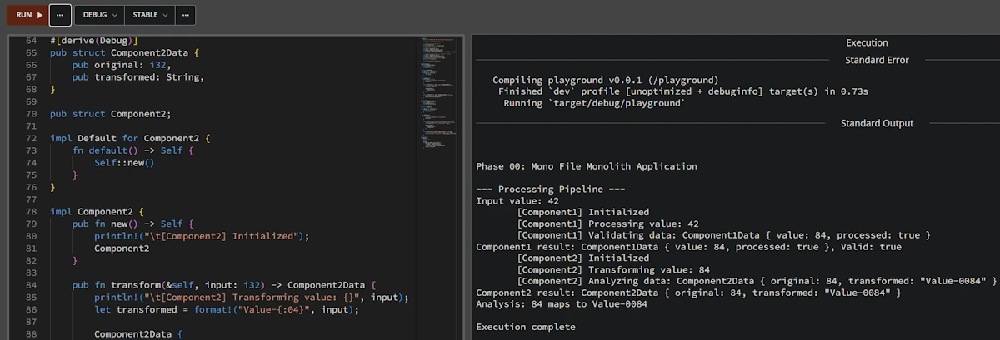
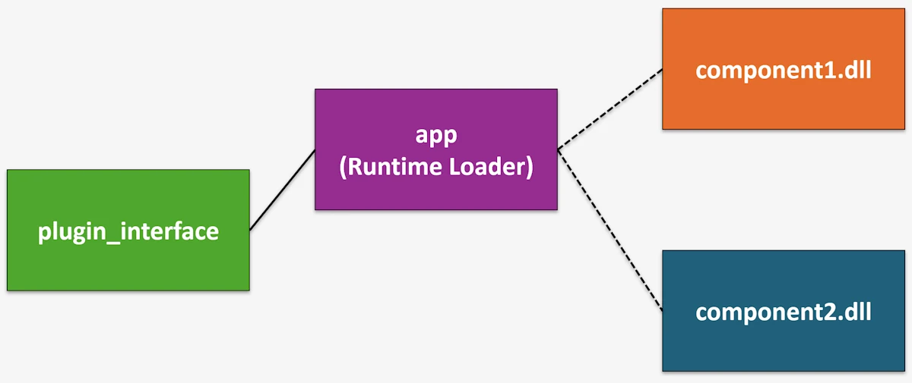

# From Monolith to Distributed Systems in Rust: A Practical Introduction
{: .no_toc }

A hands-on journey through small, working projects to understand when and why architecture needs to evolve
{: .lead }


<h2 align="center">
<span style="color:orange"><b> 🚧 This post is under construction 🚧</b></span>
</h2>


<!-- ###################################################################### -->
<!-- ###################################################################### -->
<!-- ###################################################################### -->
## TL;DR
{: .no_toc }

* For beginners
* ...


**Note**
The [companion project](https://github.com/40tude/mono_to_distributed) with is available on GitHub.


<figure style="text-align: center;">

<figcaption>What used to be a single, self-contained system begins to separate into specialized components, still coordinated but no longer bound to the same runtime.</figcaption>
</figure>


<!-- ###################################################################### -->
<!-- ###################################################################### -->
<!-- ###################################################################### -->
## Table of Contents
{: .no_toc .text-delta}
- TOC
{:toc}


<!-- ###################################################################### -->
<!-- ###################################################################### -->
<!-- ###################################################################### -->

## Introduction

It is on its way...


<!-- ###################################################################### -->
<!-- ###################################################################### -->
<!-- ###################################################################### -->
## Step 00: Single-file Monolith

In the real world, picture all our code living in one single `main.rs` file. And we are not talking about a cute 50 line script. Think 500 lines, maybe more. At some point we stop enjoying reading our own code and we start worrying about breaking things every time we touch something. We have all been there.

Here we are just taking a snapshot of the situation. No judgment. We work with what we have. In this project the code itself is deliberately simple because we care more about project organization than business logic. But imagine the file is way longer than what we see here.


### Show Me the Code
{: .no_toc }

Download the [project](https://github.com/40tude/mono_to_distributed) and open `step00_monofile_monolith` or read the code GitHub withing your browser. You can even copy/paste the code in [Rust Playground](https://play.rust-lang.org/).

<div align="center">
<br/>
<!-- <span>Optional comment</span> -->
</div>

```rust
fn main() {
    println!("\n\nPhase 00: Mono File Monolith Application\n");

    println!("--- Processing Pipeline ---");

    let input_value = 42;
    println!("Input value: {}", input_value);

    let comp1 = Component1::new();
    let data1 = comp1.process(input_value);
    let is_valid = comp1.validate(&data1);
    println!("Component1 result: {:?}, Valid: {}", data1, is_valid);

    let comp2 = Component2::new();
    let data2 = comp2.transform(data1.value);
    let analysis = comp2.analyze(&data2);
    println!("Component2 result: {:?}", data2);
    println!("{}", analysis);

    println!("\nExecution complete");
}

#[derive(Debug)]
pub struct Component1Data {
    pub value: i32,
    pub processed: bool,
}

pub struct Component1;

impl Default for Component1 {
    fn default() -> Self {
        Self::new()
    }
}

impl Component1 {
    pub fn new() -> Self {
        println!("\t[Component1] Initialized");
        Component1
    }

    pub fn process(&self, input: i32) -> Component1Data {
        println!("\t[Component1] Processing value: {}", input);
        let result = input * 2;

        Component1Data {
            value: result,
            processed: true,
        }
    }

    pub fn validate(&self, data: &Component1Data) -> bool {
        println!("\t[Component1] Validating data: {:?}", data);
        data.processed && data.value > 0
    }
}

// Similar code for Component2Data + 1 local test
```

In `main()` we do the following:

1. We set an `input_value` (here 42, because of course it is 42)
1. We create a `Component1`, call `process()` to double the value, then `validate()` to check the result
1. We create a `Component2`, call `transform()` to format the previous result into a string, then `analyze()` to build a summary
1. We print everything and we are done

Below `main()` we find the implementation of both components with plenty of `println!` calls so we can follow what is happening at each step.

At the very bottom of the file, there are a few tests. Yes, they live in the same file too. That is part of the problem.


#### **Expected output**
{: .no_toc }

```text
Phase 00: Mono File Monolith Application

--- Processing Pipeline ---
Input value: 42
        [Component1] Initialized
        [Component1] Processing value: 42
        [Component1] Validating data: Component1Data { value: 84, processed: true }
Component1 result: Component1Data { value: 84, processed: true }, Valid: true
        [Component2] Initialized
        [Component2] Transforming value: 84
        [Component2] Analyzing data: Component2Data { original: 84, transformed: "Value-0084" }
Component2 result: Component2Data { original: 84, transformed: "Value-0084" }
Analysis: 84 maps to Value-0084

Execution complete
```


```text
running 1 test
test test::negative_number_are_invalid ... ok

test result: ok. 1 passed; 0 failed; 0 ignored; 0 measured; 0 filtered out; finished in 0.00s
```


### Why This Step Matters
{: .no_toc }

As hobbyists or beginners, we all know this situation. Either the `app` does what it needs to do and we can manage the 200 lines of code, or there is a little red light blinking in the back of our brain telling us that adding more stuff will eventually break everything.

Here is what we are dealing with right now:

1. Touch one line of code and we have to recompile the whole thing
1. Touch one test and we have to run all the tests because they live in the same source file. There is no way to separate them
1. The source file is long. Really long. Scrolling around and finding what we need is getting painful
1. Maybe a friend or two would like to help, but everyone would be editing the same file and we all know how that goes on GitHub. So we end up working alone


### What Rust Gives Us Here
{: .no_toc }

At this point, honestly, Rust gives us one thing: it compiles. The borrow checker is happy, `cargo build` passes, `cargo test` is green. That is already something. But the language has a lot more to offer when it comes to organizing code. We just are not using any of it yet.


### When to Move On
{: .no_toc }

If the code does the job and we are done with it, let us not touch a thing. Let's run `cargo install` and move on.

But if the application is not finished and we keep wanting to add "just one more little feature", then it is time to look up from the keyboard and take advantage of everything Rust's ecosystem and build system can offer.


### Summary
{: .no_toc }

We wrote code that works. That is awesome and not everyone can do it. But everything lives in a single file that is getting longer, harder to read, and scarier to modify. The fun factor is going down. And that is a problem, because coding should be fun. Time to split things up into smaller, more manageable pieces.


<!-- ###################################################################### -->
<!-- ###################################################################### -->
<!-- ###################################################################### -->
## Step 01: Multi-file Monolith


### What Changed from Step 00
{: .no_toc }

The biggest change is that after splitting `main.rs`, we now have 3 files in the `src/` directory instead of 1. And here is something reassuring: the `Cargo.toml` did not change at all. We reorganized the code and Rust figured out the rest on its own through the `mod` declarations. Zero config change.

```text
step01_multifiles_monolith/
│   Cargo.toml
└───src
        component1.rs
        component2.rs
        main.rs
```


### Show Me the Code
{: .no_toc }

Download the [project](https://github.com/40tude/mono_to_distributed) and open `step01_multifiles_monolith` or read the code on GitHub withing your browser.

We keep only the `main()` function in `main.rs`. Then, and here it is pretty straightforward, we move everything related to `Component1` into `component1.rs` and do the same with `Component2` into `component2.rs`. In real life it is rarely this clean cut, but we have to start somewhere. Go for it, do not be afraid. In the worst case the Rust build system will bark at us and point us in the right direction.

Next, we go back to `main.rs` and at the very top we bring the `component1` and `component2` modules into scope. This part is important, so let us make sure we have the right mental model here.

```rust
// main.rs
mod component1;
mod component2;

use component1::Component1;
use component2::Component2;

fn main() {
  // Rest of the code
}
```

By splitting the code into 3 files we created 3 modules. The Rust build system will find them and build a module tree. Once it has a clear picture of how the modules relate to each other, it compiles everything together. This is not like C++ where each `.cpp` file is compiled independently into an `.o` and then linked. In Rust the compilation unit is the **crate**, not the file. With `mod component1;` and `mod component2;` at the top of `main.rs`, we are telling the build system: "in our crate, `main.rs` is the root and right below it sit `component1` and `component2`." There is a whole set of visibility, access, and re-export rules on top of that, but we are not there yet.

Follow the next link to learn much more about the [Rust build system]() and get a better understanding of the module tree.

> **A word on compilation speed.** We often hear that the Rust compiler is slow. That is partly true for a full rebuild from scratch. But `cargo` does incremental compilation at the crate level: if we only change `component2.rs`, the compiler is smart enough to reuse cached work and not redo everything from zero. Right now with a single crate this does not help us much. But starting from Step 02, when we split into multiple crates in a workspace, incremental compilation really kicks in because `cargo` only rebuilds the crates that actually changed.

<!-- So the "Rust is slow to compile" reputation is mostly a first build problem, and good project structure (which is exactly what we are learning here) is the best remedy. -->

Then we shorten method calls using `use component1::Component1;`. Nothing fancy here, it is just a convenience. Try it: comment out the `use component1::Component1;` line and run `cargo build`. It will fail. To fix it we would have to write `let comp1 = component1::Component1::new();` instead of `let comp1 = Component1::new();`. Again, it is purely a shorthand.

As for the contents of `component1.rs` and `component2.rs`, it is really just copy paste from the original `main.rs`.

**Important:** during this kind of exercise, this is **not** the time to refactor. Yes, we just copy pasted the code, it is shorter now, and we immediately spot something we want to improve. No, no, no my friend. Not now. Write it down on a piece of paper if you really want to (adding a `// TODO:` somewhere in the file is debatable). At the end of this step we want to be "iso functional" with `step00`. Same behavior, same output, zero surprises.

One more thing: let us not go overboard with the splitting either. We do not want to end up with one function per file. At our level, whether we are hobbyists or early career developers, the big blocks to separate are usually pretty obvious.


#### **Expected output**
{: .no_toc }

Do as I say, not as I do: in `main()` I updated the very first `println!` line. That is just for bookkeeping. Other than that, the terminal output is identical to Step 00.

```text
Phase 01: Multi Files Monolith Application

--- Processing Pipeline ---
Input value: 42
        [Component1] Initialized
        [Component1] Processing value: 42
        [Component1] Validating data: Component1Data { value: 84, processed: true }
Component1 result: Component1Data { value: 84, processed: true }, Valid: true
        [Component2] Initialized
        [Component2] Transforming value: 84
        [Component2] Analyzing data: Component2Data { original: 84, transformed: "Value-0084" }
Component2 result: Component2Data { original: 84, transformed: "Value-0084" }
Analysis: 84 maps to Value-0084

Execution complete
```

On the testing side, for fun, I added a test in `component2.rs`. Again, do as I say, not as I do. I just want to show that things are already better than before: tests now live in the module they belong to.

```text
running 2 tests
test component1::test::negative_number_are_invalid ... ok
test component2::test::test_transform ... ok

test result: ok. 2 passed; 0 failed; 0 ignored; 0 measured; 0 filtered out; finished in 0.00s
```


### Why This Step Matters
{: .no_toc }

From a day to day perspective, here is what changes:

1. It is immediately nicer to work with a `main.rs` that has a reasonable size
1. Reviewing each component in isolation is, oddly enough, way more pleasant
1. Adding tests inside each component file is easy and natural
1. If our buddy Buck (yes, Buck Rogers himself) wants to help, he can. We tell him to work on `component1.rs` and things should go smoothly on GitHub. On the build side, as long as the function signatures stay the same, we are good.


<div align="center">
<br/>
<!-- <span>Optional comment</span> -->
</div>


### What Rust Gives Us Here
{: .no_toc }

Three things at this step:

1. **Modules and the module tree.** This is the big one. Understanding how the module tree works and having the right mental model is key. Each file under `src/` becomes a module, and `mod` declarations in `main.rs` define the tree structure
1. **The `use` shorthand.** With `use component1::Component1;` we avoid repeating the full path everywhere. Small thing, but it makes the code much easier to read
1. **Per module tests.** Each `#[cfg(test)] mod test` block stays next to the code it tests. We run `cargo test` and each test clearly shows which module it belongs to in the output


### When to Move On
{: .no_toc }

What is a bit annoying is that if we add a test in the component we are working on, we either call it by name (`cargo test negative_number_are_invalid`), or we get creative with naming and filter with `cargo test component1`, or we just run everything every time. There is no way to truly build and test one component in isolation because we still have a single crate. That is what the next step will fix.


### Summary
{: .no_toc }

We split a monolithic file into 3 files and gained readability, easier code reviews, and per module tests. The Rust module system did the heavy lifting. But we still have one crate, one compilation unit, and no way to build or test a component independently. Time to bring in workspaces.


<!-- ###################################################################### -->
<!-- ###################################################################### -->
<!-- ###################################################################### -->
## Step 02: Workspace Monolith


### What Changed from Step 01
{: .no_toc }

Each component (`component1`, `component2`, and `app`) now lives in its own crate. All three crates are grouped together in a single Cargo workspace. Instead of pulling components from `crates.io`, we reference them locally through relative paths.

```text
step02_modular_monolith/
│   Cargo.toml
├───app
│   │   Cargo.toml
│   └───src
│           main.rs
├───component1_lib
│   │   Cargo.toml
│   └───src
│           lib.rs
└───component2_lib
    │   Cargo.toml
    ├───src
    │       lib.rs
    └───tests
            component2_test.rs
```


### Show Me the Code
{: .no_toc }

Download the [project](https://github.com/40tude/mono_to_distributed) and open `step02_modular_monolith` or read the code on GitHub withing your browser.

The `Cargo.toml` at the project root simply lists the workspace members.

Notice that we list **directory names**, not package names. It is easy to mix these up. When in doubt, think like the build system: before compiling anything, it needs to know **where** to find the ingredients. Directories answer "where", package names answer "what".

```toml
[workspace]
members = ["component1_lib", "component2_lib", "app"]
resolver = "3"
```


#### **The application crate**
{: .no_toc }

The `Cargo.toml` for `app` declares a binary target called `app` (which becomes `app.exe` on Windows) with its source in `src/main.rs`.

Then comes the `[dependencies]` section. This is where it gets interesting. On the left side of the equals sign we write the name we want to use in our code (`component1`). On the right side, instead of specifying a version to fetch from `crates.io` like we usually do, we provide a relative path to the local crate (`"../component1_lib"`). That is the only difference with a "normal" dependency.

```toml
[package]
name = "app"
version = "0.1.0"
edition = "2024"

[[bin]]
name = "app"
path = "src/main.rs"

[dependencies]
component1 = { path = "../component1_lib" }
component2 = { path = "../component2_lib" }
```

In `app/src/main.rs`, we no longer need `mod component1;` declarations because the dependencies are already declared in `Cargo.toml`. This works exactly the same way as when we add `serde` or `tokio` to a project.

At the top of `main()` we show how to print the version numbers of the library crates.

Other than that, the rest of the code is identical to the previous step.


#### **The library crates**
{: .no_toc }

These are now fully independent crates. Everything works as if we pulled them from `crates.io`. For instance, in their respective `Cargo.toml` files they can have different version numbers than the main application (and in fact `component2` is already at `0.2.0` while `component1` is at `0.1.0`).

Inside each crate's `src/` directory, the source file is now called `lib.rs` instead of `main.rs`. The code is exactly the same as before, except for a `get_version()` function that returns the crate version using `env!("CARGO_PKG_VERSION")`. And of course, just like in the previous step, if a library crate grows too large we can split it into multiple modules.

Now here is a nice detail about testing.
* In `component1`, the tests are inside the source file using `#[cfg(test)] mod tests` with `use super::*;`. This is a unit test: it has access to everything in the module, including private items.
* In `component2`, the tests live in a separate `tests/` directory, which forces them to behave like an external client. The test file has to write `use component2::Component2;` because it can only access the public API. Both approaches have their place, and it is good to know the difference early on.

> **Take the time to break things.** Seriously. Rename crates, mess up paths, swap directory names and package names, let the build system complain. Keep going until the relationship between crates, modules, directory names, package names, and the build system clicks in our head. This is one of those things that is much easier to learn by making mistakes than by reading documentation.


#### **Expected output**
{: .no_toc }

```text
Phase 02: Modular Monolith Application (main + 2 libs)

Component1 version: 0.1.0
Component2 version: 0.2.0

--- Processing Pipeline ---
Input value: 42
        [Component1 Lib] Initialized
        [Component1 Lib] Processing value: 42
        [Component1 Lib] Validating data: Component1Data { value: 84, processed: true }
Component1 result: Component1Data { value: 84, processed: true }, Valid: true
        [Component2 Lib] Initialized
        [Component2 Lib] Transforming value: 84
        [Component2 Lib] Analyzing data: Component2Data { original: 84, transformed: "Value-0084" }
Component2 result: Component2Data { original: 84, transformed: "Value-0084" }
Analysis: 84 maps to Value-0084

Execution complete
```

When we run `cargo test`, notice how each crate's tests run independently. The build system compiles and tests them separately, and the output tells us exactly which crate each test belongs to.

```text
running 0 tests

test result: ok. 0 passed; 0 failed; 0 ignored; 0 measured; 0 filtered out; finished in 0.00s

     Running unittests src\lib.rs (...)

running 1 test
test tests::test_process ... ok

test result: ok. 1 passed; 0 failed; 0 ignored; 0 measured; 0 filtered out; finished in 0.00s

     Running unittests src\lib.rs (...)

running 0 tests

test result: ok. 0 passed; 0 failed; 0 ignored; 0 measured; 0 filtered out; finished in 0.00s

     Running tests\component2_test.rs (...)

running 1 test
test test_transform ... ok

test result: ok. 1 passed; 0 failed; 0 ignored; 0 measured; 0 filtered out; finished in 0.00s

   Doc-tests component1_lib

running 0 tests

test result: ok. 0 passed; 0 failed; 0 ignored; 0 measured; 0 filtered out; finished in 0.00s

   Doc-tests component2_lib

running 0 tests

test result: ok. 0 passed; 0 failed; 0 ignored; 0 measured; 0 filtered out; finished in 0.00s

```

And now we can also do `cargo test -p component1` or `cargo test -p component2` to run tests for a single crate. That was the whole point.


### Why This Step Matters
{: .no_toc }

We just crossed an important threshold. At the end of the build we still get a single executable (a monolith), but it is composed of independent modules (modular). That is why this pattern is called a **Modular Monolith**.

We could honestly stop right here. A huge number of real world applications are built exactly this way and they work great.


### What Rust Gives Us Here
{: .no_toc }

The crate system is the big win. Each crate is its own little world where we reason locally. We are not polluted by the rest of the application. We have our code, our tests, and we live our life in our corner without bothering anyone.

1. **Independent builds.** We can build each crate on its own with `cargo build -p component1`. Remember the incremental compilation note from Step 01? This is where it pays off. Change one line in `component2` and only that crate gets rebuilt
1. **Independent tests.** We run `cargo test -p component1` and only that crate's tests execute. No more running the entire test suite every time
1. **Independent versioning.** Each crate has its own version number in its `Cargo.toml`. When `component2` ships a breaking change, the team working on `component1` can keep using the previous version until they are ready to upgrade

The workspace structure also reflects the architecture of the application. By looking at the directory listing, we can immediately tell what the `app` is made of. There is no framework imposing a folder structure on us. We organize things the way that makes sense for our project.


### When to Move On
{: .no_toc }

Before moving away from a Modular Monolith, we are going to need some pretty serious arguments because this architecture has proven itself time and again.

There are two main reasons to consider going further: **elasticity** and **scalability**.

Elasticity is about handling temporary spikes in workload. Think of Amazon during Black Friday: the system needs to spin up extra capacity fast and scale back down when the rush is over. If one of our components is the bottleneck during those spikes, we might want to extract it from the monolith so we can duplicate it on demand.

Scalability is about a sustained mismatch between what we planned for and what we actually need. We designed the system for 100 users and it turns out we have 100_000. That might require more processing power, better geographic distribution, or a fundamentally different deployment strategy.

But let us calm down for a second. We do not all have Netflix's Friday night problems. At our level, as hobbyists or early career developers, a solid architecture ([Hexagonal]() for example) wrapped in a Modular Monolith is more than enough for the vast majority of use cases. We should only move forward when we have **measured** a real bottleneck, not because it sounds cool.


### Summary
{: .no_toc }

We split our project into a Cargo workspace with 3 independent crates. We still produce a single binary, but each component can now be built, tested, and versioned on its own. This is the Modular Monolith pattern. Most of our applications will never need to go beyond this point. When they do, it is because of measured elasticity or scalability needs, not because of hype.


<!-- ###################################################################### -->
<!-- ###################################################################### -->
<!-- ###################################################################### -->
## Step 03: Trait-based Decoupling

Before reading further...
* If you want to dig deeper into **SOLID** and the **Dependency Inversion Principle** (DIP) in Rust, there is a [dedicated page]() here.
* And follow the next link for a primer on  [Hexagonal Architecture]()


### What Changed from Step 02
{: .no_toc }

This step is more about code architecture than build organization. We create a new crate called `traits` that defines the methods our application has decided to use for processing and analyzing data. The components then implement those contracts instead of defining their own standalone methods.

Here is a summary of what changed:

| File | Change |
|------|--------|
| `Cargo.toml` (workspace) | Added `traits` to workspace members |
| `traits/src/lib.rs` | **NEW** — `Processor` trait, `Transformer` trait, shared data types (`ProcessResult`, `TransformResult`) |
| `app/Cargo.toml` | Added `traits` in `[dependencies]` |
| `app/src/main.rs` | Imports traits. Adds `run_pipeline(&dyn Processor, &dyn Transformer, i32)` to demonstrate polymorphism |
| `component1_lib/Cargo.toml` | Added `traits` in `[dependencies]` |
| `component1_lib/src/lib.rs` | `Component1Data` removed, now uses `ProcessResult` from traits. Methods moved into `impl Processor for Component1` |
| `component2_lib/Cargo.toml` | Added `traits` in `[dependencies]` |
| `component2_lib/src/lib.rs` | `Component2Data` removed, now uses `TransformResult` from traits. Methods moved into `impl Transformer for Component2` |


### Show Me the Code
{: .no_toc }

Download the [project](https://github.com/40tude/mono_to_distributed) and open `step03_trait_interface` or read the code on GitHub withing your browser.


In Step 02, `app` calls `Component1` and `Component2` methods directly. The `app` knows every concrete type and every method signature. If we swap an implementation, we have to change the `app` code too.

Here we introduce a `traits` crate that sits between the `app` and the component libraries. It defines two trait contracts:

- `Processor` with `process(i32) -> ProcessResult` and `validate(&ProcessResult) -> bool`
- `Transformer` with `transform(i32) -> TransformResult` and `analyze(&TransformResult) -> String`

The data types (`ProcessResult`, `TransformResult`) also move into `traits` since they are part of the shared contract. The `traits` crate has zero dependencies. It contains no business logic whatsoever, only trait signatures and type definitions.

Notice that `get_version()` is a regular function on each component crate, not part of any trait. It is there purely for informational purposes. Not everything has to go through a trait. Only the methods that define the contract between the `app` and its components belong in a trait. Utility functions like `get_version()` can stay as plain public functions on the crate.

At the end of `main()` we call `run_pipeline()` which runs the exact same processing using trait references (`&dyn Processor`, `&dyn Transformer`). The idea is to show that the results are identical whether we call methods directly or through traits.

> **Try this:** Open `app/src/main.rs` and change `processor.process(input)` to `processor.blahblahblah(input)`. Build. The compiler tells us:
>
> ```text
> error[E0599]: no method named `blahblahblah` found for reference
>               `&dyn Processor` in the current scope
> ```
>
> Fair enough. Now go to `traits/src/lib.rs` and rename `process` to `blahblahblah` in the `Processor` trait definition. Build again. This time it complains in `component1`'s `lib.rs`: we are implementing a `process` method that is not part of `Processor` anymore, and we are missing `blahblahblah`.
>
> This little experiment shows something important. The application **decides** which methods it wants to call. If a component does not implement what the trait requires, the build fails. The component cannot impose anything on the application. And that is exactly what makes the `app` resilient to changes in the components.


#### **Expected output**
{: .no_toc }

```text
Phase 03: Trait-Based Interface (shared contracts)

Component1 version: 0.1.0
Component2 version: 0.2.0

--- Processing Pipeline ---
Input value: 42
        [Component1 Lib] Initialized
        [Component1 Lib] Processing value: 42
        [Component1 Lib] Validating data: ProcessResult { value: 84, processed: true }
Component1 result: ProcessResult { value: 84, processed: true }, Valid: true
        [Component2 Lib] Initialized
        [Component2 Lib] Transforming value: 84
        [Component2 Lib] Analyzing data: TransformResult { original: 84, transformed: "Value-0084" }
Component2 result: TransformResult { original: 84, transformed: "Value-0084" }
Analysis: 84 maps to Value-0084

--- Trait-Based Pipeline ---
        [Component1 Lib] Processing value: 42
Pipeline processed: ProcessResult { value: 84, processed: true }
        [Component2 Lib] Transforming value: 84
Pipeline transformed: TransformResult { original: 84, transformed: "Value-0084" }
        [Component2 Lib] Analyzing data: TransformResult { original: 84, transformed: "Value-0084" }
Pipeline analysis: Analysis: 84 maps to Value-0084

Execution complete
```

The tests are exactly the same as in Step 02.


### Why This Step Matters
{: .no_toc }

1. **Decoupling.** `app` can now call components through `&dyn Processor` and `&dyn Transformer`. The `run_pipeline()` function depends only on the `traits` crate, not on any concrete component. We could swap `Component1` for a completely different implementation without touching `run_pipeline`
1. **Dependency inversion.** Components depend on the trait crate (upward), not the other way around. The `app` also depends on the trait crate. No component depends on another component. The arrows point inward, toward the contracts
1. **Prepares for plugins.** Steps 04 and 05 will turn components into DLLs. Having a clean trait boundary now makes that transition natural: the trait crate becomes the plugin interface, and each DLL just provides a different `impl`

#### **Dependency Graph**
{: .no_toc }

Take a moment to read the `[dependencies]` section of each `Cargo.toml`. At the end you should come with a picture similar to this one:

```
              traits              (defines Processor, Transformer, data types)
             /   |  \
   component1    |   component2   (each implements one trait)
             \   |  /
                app               (uses both through trait references)
```

Everyone depends on `traits`. Nobody depends on each other. That is the whole point.


### What Rust Gives Us Here
{: .no_toc }

Traits are the key ingredient here. But beyond the language feature itself, there is a method worth remembering:

1. We start in `main.rs` and write the function calls *the way we want* them to look. For example in `run_pipeline()` we write `processor.process(input)` because that reads well and makes sense
1. Only when we are happy with how things read in `main.rs` do we move on
1. Then we create the `traits` crate and define the trait signatures that match what we wrote in `main()`. For example the `Processor` trait with its `process()` method
1. From the application's point of view, we are done. We stated what we need. It is up to the components to fall in line

The crucial thing is that **the application sets the tone**. The `app` decides it will call `process()` on something that implements `Processor` (see `fn run_pipeline(processor: &dyn Processor, ...` in `main.rs`). It is not a library imposing its API on the application. The roles are reversed, and that is exactly why it is called the **Dependency Inversion Principle**.


### When to Move On
{: .no_toc }

We need to protect the crown jewels. The core business logic of our application should be immune to changes happening in the components that orbit around it. With traits in place, it is.

My personal take? As soon as the crates from Step 02 are in place, setting up dependency inversion with traits should be the very next move. Do not wait.

And if components use sub-components of their own, the same principle applies: create trait boundaries at their level too. Traits all the way down.


### Summary
{: .no_toc }

The business logic is identical to Step 02. Same input (42), same output ("Value-0084"). What changed is the architecture: `run_pipeline()` uses dynamic dispatch (`&dyn Trait`) and the `traits` crate has zero dependencies, it is a pure contract definition. The `app` now decides the API, and components implement it. We are ready for plugins.


<!-- ###################################################################### -->
<!-- ###################################################################### -->
<!-- ###################################################################### -->
## Step 04: Plugin DLL


### What Changed from Step 03
{: .no_toc }

The component directories are now named `component1_dll` and `component2_dll` instead of `component1_lib` and `component2_lib`, to reflect that they produce dynamic libraries. The package names in `Cargo.toml` stay `component1` and `component2` as before.

Ideally we just add one section to each component's `Cargo.toml`:

```toml
[lib]
crate-type = ["cdylib", "rlib"]
```

And that is it. This tells Cargo to produce **two** artifacts for each component:

| Artifact | Format | Purpose |
|----------|--------|---------|
| `component1.rlib` | Rust static library | Used by `cargo build` to link into `app.exe` |
| `component1.dll` | Windows dynamic library | Available for external consumers (C, C++, Python, other Rust binaries...) |

We also simplified `app/src/main.rs` to use only `run_pipeline()`, making our core business logic immune to changes in the components. This is the natural evolution from what we set up in Step 03.


### Show Me the Code
{: .no_toc }

Download the [project](https://github.com/40tude/mono_to_distributed) and open `step04_plugins_dll` or read the code on GitHub withing your browser.

Here is the new version of `main()`. The code is familiar by now.

```rust
use component1::Component1;
use component2::Component2;
use traits::{Processor, Transformer};

fn main() {
    println!("\n\nPhase 04: Modular Application with Plugins (1 exe + 2 dll)\n");

    println!("Component1 version: {}", component1::get_version());
    println!("Component2 version: {}", component2::get_version());

    let input_value = 42;
    let comp1 = Component1::new();
    let comp2 = Component2::new();
    run_pipeline(&comp1, &comp2, input_value);

    println!("\nExecution complete");
}

fn run_pipeline(processor: &dyn Processor, transformer: &dyn Transformer, input: i32) {
    println!("\n--- Processing Pipeline ---");

    println!("Input value: {}", input);

    let data1 = processor.process(input);
    let is_valid = processor.validate(&data1);
    println!("Component1 result: {:?}, Valid: {}", data1, is_valid);

    let data2 = transformer.transform(data1.value);
    let analysis = transformer.analyze(&data2);
    println!("Component2 result: {:?}", data2);
    println!("{}", analysis);
}
```

One thing worth noticing: `run_pipeline()` is now a clear, self-contained function that only depends on traits. It is a natural candidate for moving into `app/src/lib.rs`. That would let us create an `app/tests/` directory with proper integration tests for the full application pipeline.

For now, I added a simple test that verifies the pipeline does not panic. It is not visible in the snippet above but it is there in the source.


#### **Expected output**
{: .no_toc }

```text
Phase 04: Modular Application with Plugins (1 exe + 2 dll)

Component1 version: 0.1.0
Component2 version: 0.2.0
        [Component1 Lib] Initialized
        [Component2 Lib] Initialized

--- Processing Pipeline ---
Input value: 42
        [Component1 Lib] Processing value: 42
        [Component1 Lib] Validating data: ProcessResult { value: 84, processed: true }
Component1 result: ProcessResult { value: 84, processed: true }, Valid: true
        [Component2 Lib] Transforming value: 84
        [Component2 Lib] Analyzing data: TransformResult { original: 84, transformed: "Value-0084" }
Component2 result: TransformResult { original: 84, transformed: "Value-0084" }
Analysis: 84 maps to Value-0084

Execution complete
```

The tests are similar to what we already know.


### Why This Step Matters
{: .no_toc }

This step is mostly interesting intellectually because **we do not actually get what we want**: one executable loading automatically 2 DLLs at runtime.

What? Really? How can it works? In fact, when we run `cargo build`, Cargo produces both `.rlib` and `.dll` files. But when it links `app.exe`, **it uses the `.rlib` (static library), not the `.dll`**.

We can verify this ourselves:

```powershell
cd target/debug
mv component1.dll component1.dll.bak
mv component2.dll component2.dll.bak
.\app.exe    # runs perfectly
```

The `.exe` is **self-contained**. The component code is baked into it, just like in Step 03. The DLLs sit in the build folder, unused.


#### Why does Cargo use rlib instead of the DLL?
{: .no_toc }

Because `app/Cargo.toml` says:

```toml
[dependencies]
component1 = { path = "../component1_dll" }
```

This is a **Rust-to-Rust** dependency. Cargo always prefers `rlib` for these because:

1. Rust's ABI (Application Binary Interface) is unstable and can change between compiler versions
1. Static linking is simpler and faster
1. `rlib` preserves full type info, generics, and monomorphization

The `cdylib` output exists for **foreign consumers** (C, Python, etc.) that load the DLL via FFI. Rust itself never uses it through a `path` dependency.


#### So why does this step exist?
{: .no_toc }

To be clear, I did not expect this behavior. So now I consider this step is a **preparation step**. It demonstrates that:

1. We can tell Cargo to produce DLLs alongside the static library
1. The DLLs are real, loadable dynamic libraries (Step 05 will actually use them)
1. The `app` code does not change at all. The transition is invisible

Think of it as: our components are now *capable* of being DLLs, even though nobody is loading them dynamically yet.


### What Rust Gives Us Here
{: .no_toc }

The `crate-type` setting in `Cargo.toml` lets us produce dynamic libraries that can be shared with other languages: C, C++, Python, and more. One line of config and Cargo handles the rest.

Worth noting that "DLL" here is the Windows terminology. On Linux the equivalent is `.so` (shared object), on macOS it is `.dylib`. Cargo produces the right format for whatever platform we are building on.


### When to Move On
{: .no_toc }

Honestly, this step is one to understand but not to linger on. Now that we know how it works, let us move to Step 05 where we actually load DLLs at runtime. That is where things get real.


### Summary
{: .no_toc }

We added `crate-type = ["cdylib", "rlib"]` to our component crates. Cargo now produces both a static library and a DLL for each component, but the application still links statically via `rlib`. The DLLs are generated but unused. This step is a stepping stone: it proves our components can be packaged as dynamic libraries. Step 05 will close the loop by loading them at runtime with `libloading`.


<!-- ###################################################################### -->
<!-- ###################################################################### -->
<!-- ###################################################################### -->
## Step 05: Runtime DLL Loading


### What Changed from Step 04
{: .no_toc }

In Step 04 we told Cargo to produce DLLs alongside the static libraries. At the end, the DLLs were sitting in the build folder, nice and shiny, but nobody was actually loading them. The `app` was still statically linked through `rlib`. This time, we close the loop.

The `traits` crate is gone. In its place we have a brand new crate called `plugin_interface`. It still defines the trait contracts (`ProcessPlugin`, `TransformPlugin`) and the shared data types (`ProcessResult`, `TransformResult`), but it also defines the C-compatible function pointer types and the symbol names that DLLs must export. Think of it as the previous version of the `traits` crate plus a "DLL protocol" on top.

The component crates now produce **only** `cdylib` (no more `rlib`). The `app` crate no longer lists `component1` or `component2` in its `[dependencies]`. Instead, it depends on `plugin_interface` and on `libloading`, a Rust crate that wraps the OS functions for loading shared libraries at runtime (`LoadLibrary`/`GetProcAddress` on Windows, `dlopen`/`dlsym` on Linux and macOS).

Here is a summary of what changed:

| File | Change |
|------|--------|
| `Cargo.toml` (workspace) | `traits` removed, `plugin_interface` added. `component1_dll` and `component2_dll` remain |
| `plugin_interface/Cargo.toml` | **NEW** crate, `crate-type = ["lib"]`, zero dependencies |
| `plugin_interface/src/lib.rs` | Traits, data structs, FFI type aliases (`ProcessPluginCreate`, etc.), symbol name constants |
| `component1_dll/Cargo.toml` | `crate-type` changed from `["cdylib", "rlib"]` to `["cdylib"]` only. Depends on `plugin_interface` |
| `component1_dll/src/lib.rs` | Implements `ProcessPlugin`. Exports `extern "C"` factory functions: `_plugin_create`, `_plugin_destroy`, `_plugin_version` |
| `component2_dll/Cargo.toml` | Same as component1: `cdylib` only, depends on `plugin_interface` |
| `component2_dll/src/lib.rs` | Implements `TransformPlugin`. Same three exported symbols |
| `app/Cargo.toml` | **No longer depends on component1 or component2.** Depends on `plugin_interface` and `libloading` |
| `app/src/main.rs` | Loads each DLL at runtime, looks up symbols, creates plugin instances, calls trait methods, destroys instances, unloads DLLs |


### Show Me the Code
{: .no_toc }

Download the [project](https://github.com/40tude/mono_to_distributed) and open `step05_dyn_plugins_dll` or read the code on GitHub within your browser.


#### **The plugin interface crate**
{: .no_toc }

This is the contract between the host (`app`) and the plugins (the DLLs). It defines:

1. `ProcessResult` and `TransformResult`, both marked `#[repr(C)]` so their memory layout is fixed and predictable across the DLL boundary
1. `ProcessPlugin` and `TransformPlugin` traits, same as in Step 03/04, but now with `Send + Sync` bounds
1. Type aliases for the FFI function pointers: `ProcessPluginCreate`, `ProcessPluginDestroy`, `TransformPluginCreate`, `TransformPluginDestroy`, and `PluginVersion`
1. Three constants for symbol names: `PLUGIN_CREATE_SYMBOL`, `PLUGIN_DESTROY_SYMBOL`, `PLUGIN_VERSION_SYMBOL`

Notice that the crate has zero external dependencies. It is a pure contract definition, exactly like `traits` was in Step 03. The difference is that it now also describes *how* to cross the DLL boundary.

One detail worth pausing on: the `#[expect(improper_ctypes_definitions)]` attributes on the function pointer types. The Rust compiler warns us that passing trait object pointers (`*mut dyn ProcessPlugin`) through `extern "C"` functions is not standard FFI. And it is right, this is technically unsafe territory. We silence the warning with `#[expect(...)]` because we control both sides of the boundary and we know the trait object layout will be consistent (same compiler, same build). This would absolutely not work if the DLL was compiled with a different Rust version. More on that later.


#### **The component DLLs**
{: .no_toc }

Each component DLL exports exactly three symbols:

1. `_plugin_create()` allocates a new instance of the component on the heap using `Box::into_raw(Box::new(...))` and returns it as a raw pointer to the trait object
1. `_plugin_destroy(ptr)` takes that pointer back, wraps it in a `Box::from_raw()`, and drops it. This is how we free the memory
1. `_plugin_version()` returns a pointer to a null-terminated C string containing the crate version, built at compile time with `concat!(env!("CARGO_PKG_VERSION"), "\0")`

All three functions are `extern "C"` and marked `#[unsafe(no_mangle)]` so that `libloading` can find them by name in the DLL's export table.

The `Component1` and `Component2` structs themselves are **private** to their respective crates. The only thing that leaks out is the trait implementation, through the factory functions. From the outside, we never see `Component1` or `Component2`. We only see a `*mut dyn ProcessPlugin` or `*mut dyn TransformPlugin`.

The business logic is identical to all previous steps. `process()` doubles the value, `transform()` formats it as `"Value-0084"`, and so on. No surprises there.


#### **The host application**
{: .no_toc }

`app/Cargo.toml` now looks like this:

```toml
[dependencies]
plugin_interface = { path = "../plugin_interface" }
libloading = "0.9"
```

Notice what is **missing**: `component1` and `component2`. The `app` does not know about them at compile time. It only knows the plugin interface. The components are discovered and loaded at runtime.

In `main.rs`, the loading sequence for each plugin follows the same pattern:

1. Build the DLL path relative to the running executable using `plugin_path()`. This helper figures out the right extension (`.dll`, `.so`, or `.dylib`) depending on the target OS
1. Load the DLL with `Library::new(&path)`. This is the equivalent of `LoadLibrary` on Windows
1. Look up the `_plugin_version` symbol, call it, convert the returned `*const c_char` to a Rust string, and print it
1. Look up the `_plugin_create` symbol, call it to get a trait object pointer, and dereference it to get a `&dyn ProcessPlugin` (or `&dyn TransformPlugin`)
1. Call trait methods just like in Step 03. The syntax is exactly the same: `plugin.process(input_value)`, `plugin.validate(&result)`
1. Look up the `_plugin_destroy` symbol and call it to free the plugin instance
1. Let `lib` go out of scope, which unloads the DLL

The entire component1 block is wrapped in a `{ ... }` scope so that `lib` (the loaded DLL) is dropped (and thus unloaded) before we move on to component2. We get the `process_result` out of that scope and pass it to component2, exactly as before.

Everything is wrapped in `unsafe` blocks with detailed `// SAFETY` comments. There are a lot of them. That is not sloppy code. That is how FFI works in Rust: every call across the DLL boundary is inherently unsafe, and we are expected to document why we believe each call is sound.


<div align="center">
<br/>
<span>Dashed lines indicate runtime discovery using LoadLibrary/libloading</span>
</div>


### Note About the Address Space
{: .no_toc }

Since DLLs are loaded *into* the host process, they share the same virtual address space as `app.exe`. A pointer obtained inside the DLL is valid inside the `app` and vice versa. This is fundamentally different from what we will see in Step 06, where each service runs in its own process with its own isolated address space.

```text
+---------------------------------------------------------+
|              Process Virtual Address Space              |
|                                                         |
|  0x00007FF6_00000000   app.exe code + data              |
|  0x00007FFB_10000000   component1.dll                   |
|  0x00007FFB_20000000   component2.dll                   |
|  0x00007FFB_80000000   kernel32.dll, ntdll.dll, ...     |
|  0x000000A0_00000000   heap                             |
|  0x000000FF_FFFFFFFF   stack (grows down)               |
|                                                         |
+---------------------------------------------------------+
```

This means we can pass raw pointers between the `app` and the DLLs and they just work. The only catch is memory allocation: if the DLL allocates memory, the DLL should free it (and vice versa). Different allocator instances do not play well together even within the same address space. That is exactly why we have `_plugin_create` and `_plugin_destroy` as a matched pair.

| Boundary | Same address space? | Can share pointers? | Communication |
|----------|---------------------|---------------------|---------------|
| Function call (Step 02) | Yes | Yes | Direct |
| DLL in same process (Step 04/05) | Yes | Yes* | Function call via FFI |
| Separate process (Step 06) | **No** | **No** | Pipes, HTTP, NATS... |

\* *Careful with allocators: if the DLL and the exe use different allocator instances, free memory on the same side that allocated it.*


#### **Expected output**
{: .no_toc }

```text
Phase 05: Modular Application with Dynamic Plugins (runtime DLL load/unload)

--- Processing Pipeline ---
Input value: 42

Loading component1 DLL from: <path_to_exe_dir>\component1.dll
Component1 DLL loaded
Component1 version: 0.1.0
        [Component1 DLL] Initialized
        [Component1 DLL] Processing value: 42
        [Component1 DLL] Validating data: ProcessResult { value: 84, processed: true }
Process result: ProcessResult { value: 84, processed: true }, Valid: true
[Component1 DLL] Destroying plugin instance
Unloading Component1 DLL...

Loading component2 DLL from: <path_to_exe_dir>\component2.dll
Component2 DLL loaded
Component2 version: 0.2.0
        [Component2 DLL] Initialized
        [Component2 DLL] Transforming value: 84
        [Component2 DLL] Analyzing data: TransformResult { original: 84, transformed: "Value-0084" }
Transform result: TransformResult { original: 84, transformed: "Value-0084" }
Analysis: 84 maps to Value-0084
[Component2 DLL] Destroying plugin instance
Unloading component2 DLL...

Execution complete
```

The DLL path will of course be different on your machine. The rest is identical to every previous step: 42 goes in, gets doubled to 84, gets formatted as "Value-0084". Business logic has not changed one bit.

On the testing side, each component DLL crate has its own unit tests. We can run `cargo test -p component1` or `cargo test -p component2` as usual. The tests exercise the trait implementations directly, no DLL loading involved. This is one of the nice properties of the design: we test the logic in isolation and only involve FFI when we run the full app.

```text
running 2 tests
test tests::test_process ... ok
test tests::test_validate ... ok

test result: ok. 2 passed; 0 failed; 0 ignored; 0 measured; 0 filtered out; finished in 0.00s

running 2 tests
test tests::test_analyze ... ok
test tests::test_transform ... ok

test result: ok. 2 passed; 0 failed; 0 ignored; 0 measured; 0 filtered out; finished in 0.00s
```


### Why This Step Matters
{: .no_toc }

This is the step where we go from "our components *could* be DLLs" to "our components *are* DLLs and the `app` loads them at runtime."

1. **True decoupling at the binary level.** The `app` crate does not depend on `component1` or `component2` at compile time. We can rebuild a component DLL, drop it next to `app.exe`, and run again without recompiling the app. That is the plugin promise
1. **Hot-swappable components (in theory).** Because we explicitly load and unload DLLs, nothing prevents us from loading a *different* DLL that exports the same symbols. As long as the new DLL implements the same plugin interface, the `app` will not care. We could even load plugins from a configuration file or a plugin directory
1. **The cost is `unsafe`.** We are leaving the safe harbor of the Rust type system. Every symbol lookup, every pointer dereference across the DLL boundary is `unsafe`. If we get the types wrong, if we forget to call `_plugin_destroy`, if we use a plugin pointer after the DLL is unloaded, we get undefined behavior with zero compiler help. This is the fundamental tradeoff

> **Worth knowing:** the approach we use here (passing Rust trait object pointers across the DLL boundary) is not standard FFI practice. It works because we compile both sides with the same Rust compiler. If we needed true cross-language compatibility, we would define a C-compatible vtable manually or use a proper C API with opaque handles. What we have here is more of a "Rust-to-Rust plugin system" than a general purpose FFI layer.


### What Rust Gives Us Here
{: .no_toc }

Rust does not make DLL loading *safe*. It makes it *explicit*. Every `unsafe` block screams "something risky is happening here, and I have thought about why it is OK." That might seem like a burden, but compare it to C/C++ where `LoadLibrary` + `GetProcAddress` is just normal code with no special warnings. In Rust, the compiler forces us to acknowledge each danger point.

Beyond that, a few things are really helpful:

1. **`libloading` crate.** Wraps the OS-specific dynamic loading APIs (`LoadLibrary`/`dlopen`) into a single cross-platform interface. We write one codebase and it runs on Windows, Linux, and macOS. The `plugin_path()` helper in `main.rs` handles the file extension differences
1. **`Box::into_raw` / `Box::from_raw`.** This is how we transfer ownership of heap-allocated objects across the FFI boundary. `Box::into_raw` gives up Rust's ownership tracking and hands us a raw pointer. `Box::from_raw` takes it back. The matched `_plugin_create` / `_plugin_destroy` pattern ensures no memory leaks
1. **`#[unsafe(no_mangle)]` and `extern "C"`.** These two attributes are what make a Rust function visible and callable from outside. `no_mangle` preserves the symbol name (Rust normally mangles names), and `extern "C"` uses the C calling convention so `libloading` can find and call the function
1. **`repr(C)` on data structs.** Ensures the struct layout matches what a C compiler would produce. Without this, Rust is free to reorder fields or add padding however it likes, which would break things across the DLL boundary


### When to Move On
{: .no_toc }

Dynamic loading is a powerful tool but it comes with real constraints. The biggest one in our case: **we must compile the DLLs and the host `app` with the same Rust compiler version.** Rust does not have a stable ABI, which means the trait object layout (vtable pointer + data pointer) can change between compiler releases. If we compile the `app` with Rust 1.82 and a DLL with Rust 1.83, we might get silent corruption.

For a plugin system where we control all the pieces and ship everything together, this is fine. For a plugin system where third parties ship DLLs compiled independently, this is a real problem. In that case, we would need a C-based plugin API with a stable ABI.

The other thing to consider is that we are still running everything in a single process. If a DLL crashes (segfault, stack overflow, panic that crosses the FFI boundary), it takes down the whole application. There is no isolation.

If either of these concerns is an issue for you (as it is for me), the next logical step is to move components into their own processes. That is Step 06, where components become standalone executables communicating through pipes. Different address spaces, full crash isolation, and no ABI compatibility worries because data crosses the boundary as serialized JSON, not raw pointers.


### Summary
{: .no_toc }

We replaced static linking with runtime DLL loading using `libloading`. The `plugin_interface` crate defines the contract: traits, data types, FFI function signatures, and symbol names. Each component DLL exports three `extern "C"` functions (`_plugin_create`, `_plugin_destroy`, `_plugin_version`) and the host `app` loads them by name at runtime. The business logic is unchanged (42 in, "Value-0084" out). We gained true binary-level decoupling and the ability to swap plugins without recompiling the host. The price is `unsafe` code at every DLL boundary crossing and the requirement that everything be compiled with the same Rust toolchain.


<!-- ###################################################################### -->
<!-- ###################################################################### -->
<!-- ###################################################################### -->
## Step 06: Multi Processes
The code is ready, not the comments.

<!-- ###################################################################### -->
<!-- ###################################################################### -->
<!-- ###################################################################### -->
## Step 07: Distributed HTTP
The code is ready, not the comments.

<!-- ###################################################################### -->
<!-- ###################################################################### -->
<!-- ###################################################################### -->
## Step 08: Message Broker
The code is ready, not the comments.


<!-- ###################################################################### -->
<!-- ###################################################################### -->
<!-- ###################################################################### -->
## Conclusion
It is on its way...


<!-- ###################################################################### -->
<!-- ###################################################################### -->
<!-- ###################################################################### -->
## Webliography
* (beginners) Would you like to check your knowledge with some [flashcards](https://rust-deck-befcc06ba7fa.herokuapp.com/practice)? Works fine on cell phones. It is hosted for free on Heroku and may be slow to startup.