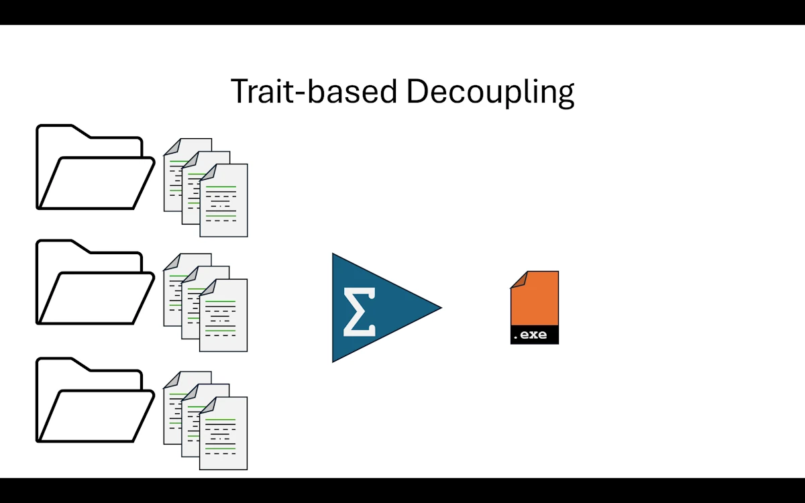
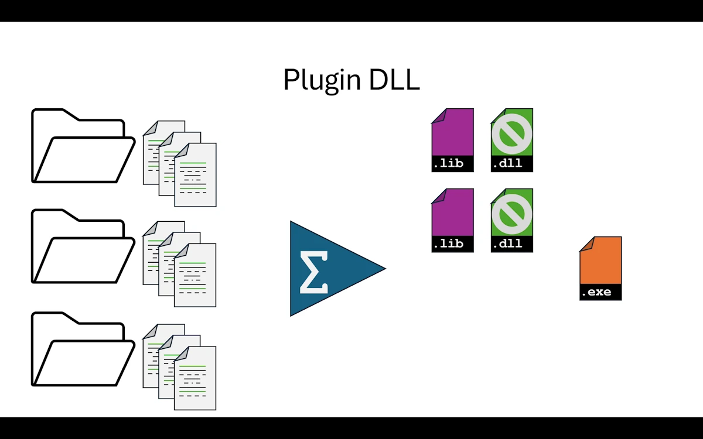
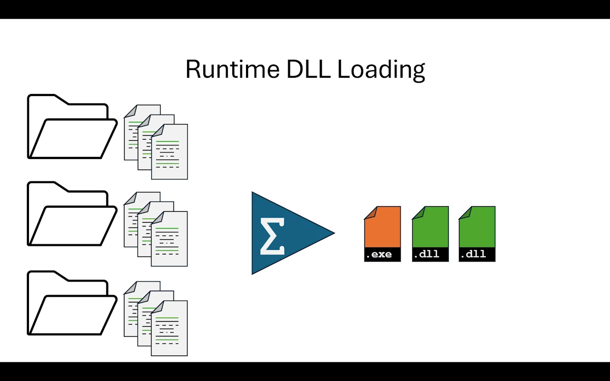
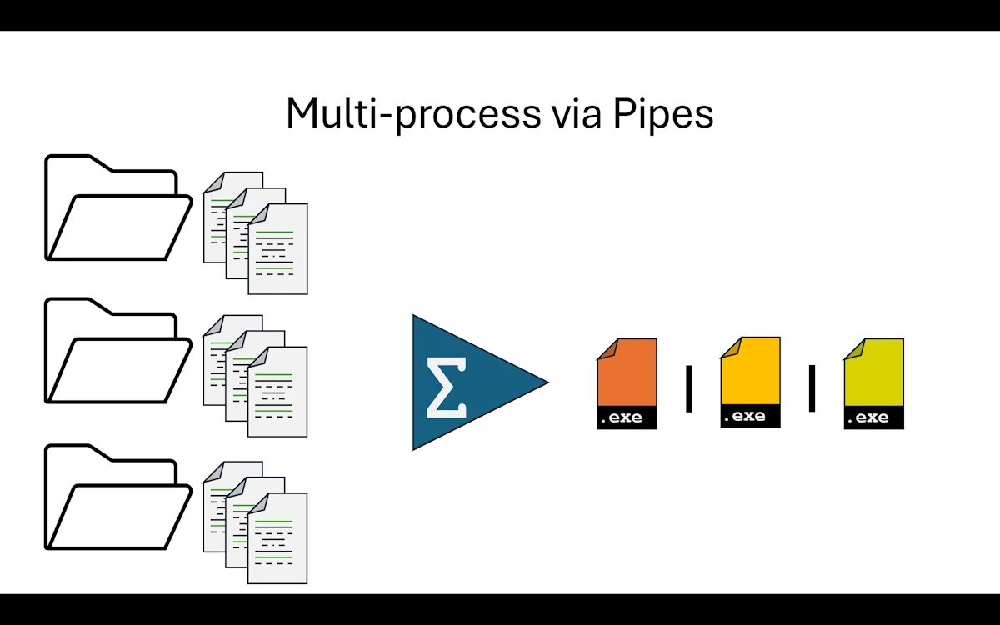
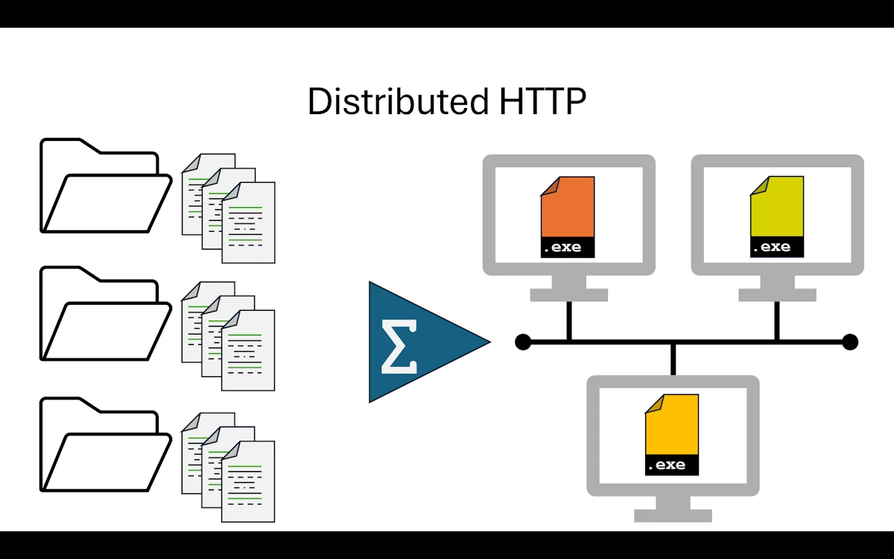
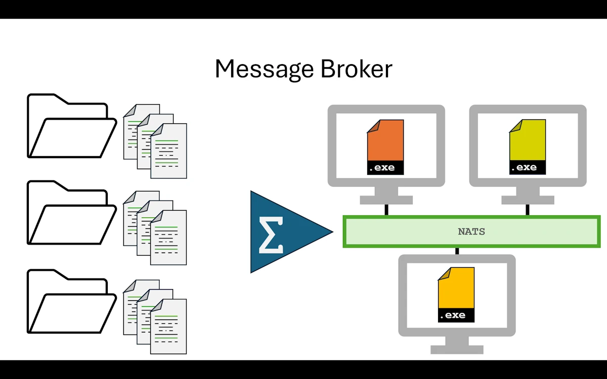
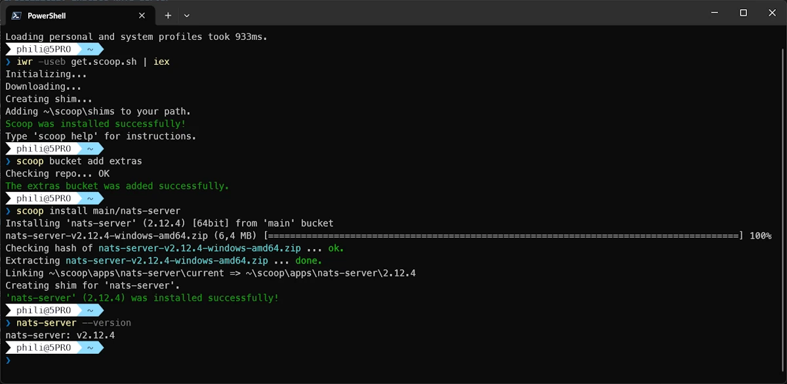
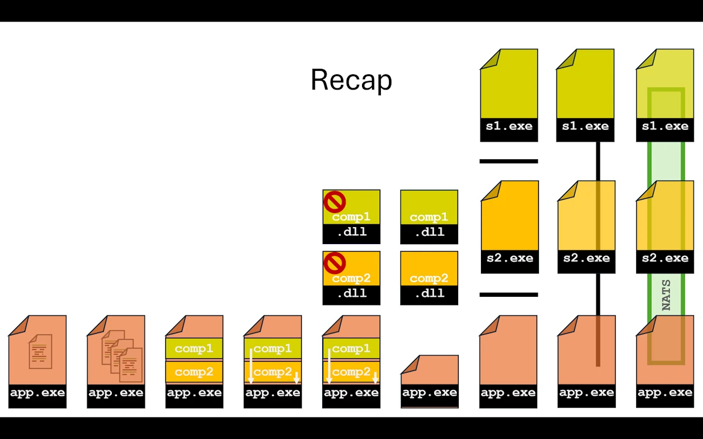

# From Monolith to Distributed Systems in Rust: A Practical Introduction
{: .no_toc }

A hands-on journey through small, working projects to understand when and why architecture needs to evolve
{: .lead }


<h2 align="center">
<span style="color:orange"><b> 🚧 This post is under construction 🚧</b></span>
</h2>


<!-- ###################################################################### -->
<!-- ###################################################################### -->
<!-- ###################################################################### -->
## TL;DR
{: .no_toc }

* For beginners
* ...


**Note**
The [companion project](https://github.com/40tude/mono_to_distributed) with is available on GitHub.


<figure style="text-align: center;">

<figcaption>What used to be a single, self-contained system begins to separate into specialized components, still coordinated but no longer bound to the same runtime.</figcaption>
</figure>


<!-- ###################################################################### -->
<!-- ###################################################################### -->
<!-- ###################################################################### -->
## Table of Contents
{: .no_toc .text-delta}
- TOC
{:toc}


<!-- ###################################################################### -->
<!-- ###################################################################### -->
<!-- ###################################################################### -->

## Introduction

It is on its way...


<!-- ###################################################################### -->
<!-- ###################################################################### -->
<!-- ###################################################################### -->
## Step 00: Single-file Monolith

<div align="center">
<br/>
<span>Single File Monolith</span>
</div>

In the real world, picture all our code living in one single `main.rs` file. And we are not talking about a cute 50 line script. Think 500 lines, maybe more. At some point we stop enjoying reading our own code and we start worrying about breaking things every time we touch something. We have all been there.

Here we are just taking a snapshot of the situation. No judgment. We work with what we have. In this project the code itself is deliberately simple because we care more about project organization than business logic. But imagine the file is way longer than what we see here.


### Show Me the Code
{: .no_toc }

Download the [project](https://github.com/40tude/mono_to_distributed) and open `step00_monofile_monolith` or read the code GitHub withing your browser. You can even copy/paste the code in [Rust Playground](https://play.rust-lang.org/).

<div align="center">
<br/>
<!-- <span>Optional comment</span> -->
</div>

```rust
fn main() {
    println!("\n\nPhase 00: Mono File Monolith Application\n");

    println!("--- Processing Pipeline ---");

    let input_value = 42;
    println!("Input value: {}", input_value);

    let comp1 = Component1::new();
    let data1 = comp1.process(input_value);
    let is_valid = comp1.validate(&data1);
    println!("Component1 result: {:?}, Valid: {}", data1, is_valid);

    let comp2 = Component2::new();
    let data2 = comp2.transform(data1.value);
    let analysis = comp2.analyze(&data2);
    println!("Component2 result: {:?}", data2);
    println!("{}", analysis);

    println!("\nExecution complete");
}

#[derive(Debug)]
pub struct Component1Data {
    pub value: i32,
    pub processed: bool,
}

pub struct Component1;

impl Default for Component1 {
    fn default() -> Self {
        Self::new()
    }
}

impl Component1 {
    pub fn new() -> Self {
        println!("\t[Component1] Initialized");
        Component1
    }

    pub fn process(&self, input: i32) -> Component1Data {
        println!("\t[Component1] Processing value: {}", input);
        let result = input * 2;

        Component1Data {
            value: result,
            processed: true,
        }
    }

    pub fn validate(&self, data: &Component1Data) -> bool {
        println!("\t[Component1] Validating data: {:?}", data);
        data.processed && data.value > 0
    }
}

// Similar code for Component2Data + 1 local test
```

In `main()` we do the following:

1. We set an `input_value` (here 42, because of course it is 42)
1. We create a `Component1`, call `process()` to double the value, then `validate()` to check the result
1. We create a `Component2`, call `transform()` to format the previous result into a string, then `analyze()` to build a summary
1. We print everything and we are done

Below `main()` we find the implementation of both components with plenty of `println!` calls so we can follow what is happening at each step.

At the very bottom of the file, there are a few tests. Yes, they live in the same file too. That is part of the problem.


#### **Expected output**
{: .no_toc }

```text
Phase 00: Mono File Monolith Application

--- Processing Pipeline ---
Input value: 42
        [Component1] Initialized
        [Component1] Processing value: 42
        [Component1] Validating data: Component1Data { value: 84, processed: true }
Component1 result: Component1Data { value: 84, processed: true }, Valid: true
        [Component2] Initialized
        [Component2] Transforming value: 84
        [Component2] Analyzing data: Component2Data { original: 84, transformed: "Value-0084" }
Component2 result: Component2Data { original: 84, transformed: "Value-0084" }
Analysis: 84 maps to Value-0084

Execution complete
```


```text
running 1 test
test test::negative_number_are_invalid ... ok

test result: ok. 1 passed; 0 failed; 0 ignored; 0 measured; 0 filtered out; finished in 0.00s
```


### Why This Step Matters
{: .no_toc }

As hobbyists or beginners, we all know this situation. Either the `app` does what it needs to do and we can manage the 200 lines of code, or there is a little red light blinking in the back of our brain telling us that adding more stuff will eventually break everything.

Here is what we are dealing with right now:

1. Touch one line of code and we have to recompile the whole thing
1. Touch one test and we have to run all the tests because they live in the same source file. There is no way to separate them
1. The source file is long. Really long. Scrolling around and finding what we need is getting painful
1. Maybe a friend or two would like to help, but everyone would be editing the same file and we all know how that goes on GitHub. So we end up working alone


### What Rust Gives Us Here
{: .no_toc }

At this point, honestly, Rust gives us one thing: it compiles. The borrow checker is happy, `cargo build` passes, `cargo test` is green. That is already something. But the language has a lot more to offer when it comes to organizing code. We just are not using any of it yet.


### When to Move On
{: .no_toc }

If the code does the job and we are done with it, let us not touch a thing. Let's run `cargo install` and move on.

But if the application is not finished and we keep wanting to add "just one more little feature", then it is time to look up from the keyboard and take advantage of everything Rust's ecosystem and [build system]() can offer.


### Summary
{: .no_toc }

We wrote code that works. That is awesome and not everyone can do it. But everything lives in a single file that is getting longer, harder to read, and scarier to modify. The fun factor is going down. And that is a problem, because coding should be fun. Time to split things up into smaller, more manageable pieces.


<!-- ###################################################################### -->
<!-- ###################################################################### -->
<!-- ###################################################################### -->
## Step 01: Multi-file Monolith

<div align="center">
<br/>
<span>Multi-file Monolith</span>
</div>


### What Changed from Step 00
{: .no_toc }

The biggest change is that after splitting `main.rs`, we now have 3 files in the `src/` directory instead of 1. And here is something reassuring: the `Cargo.toml` did not change at all. We reorganized the code and Rust figured out the rest on its own through the `mod` declarations. Zero config change.

```text
step01_multifiles_monolith/
│   Cargo.toml
└───src
        component1.rs
        component2.rs
        main.rs
```


### Show Me the Code
{: .no_toc }

Download the [project](https://github.com/40tude/mono_to_distributed) and open `step01_multifiles_monolith` or read the code on GitHub withing your browser.

We keep only the `main()` function in `main.rs`. Then, and here it is pretty straightforward, we move everything related to `Component1` into `component1.rs` and do the same with `Component2` into `component2.rs`. In real life it is rarely this clean cut, but we have to start somewhere. Go for it, do not be afraid. In the worst case the Rust [build system]() will bark at us and point us in the right direction.

Next, we go back to `main.rs` and at the very top we bring the `component1` and `component2` modules into scope. This part is important, so let us make sure we have the right mental model here.

```rust
// main.rs
mod component1;
mod component2;

use component1::Component1;
use component2::Component2;

fn main() {
  // Rest of the code
}
```

By splitting the code into 3 files we created 3 modules. The Rust build system will find them and build a module tree. Once it has a clear picture of how the modules relate to each other, it compiles everything together. This is not like C++ where each `.cpp` file is compiled independently into an `.o` and then linked. In Rust the compilation unit is the **crate**, not the file. With `mod component1;` and `mod component2;` at the top of `main.rs`, we are telling the build system: "in our crate, `main.rs` is the root and right below it sit `component1` and `component2`." There is a whole set of visibility, access, and re-export rules on top of that, but we are not there yet.

Follow the next link to learn much more about the [Rust build system]() and get a better understanding of the module tree.

> **A word on compilation speed.** We often hear that the Rust compiler is slow. That is partly true for a full rebuild from scratch. But `cargo` does incremental compilation at the crate level: if we only change `component2.rs`, the compiler is smart enough to reuse cached work and not redo everything from zero. Right now with a single crate this does not help us much. But starting from Step 02, when we split into multiple crates in a workspace, incremental compilation really kicks in because `cargo` only rebuilds the crates that actually changed.

<!-- So the "Rust is slow to compile" reputation is mostly a first build problem, and good project structure (which is exactly what we are learning here) is the best remedy. -->

Then we shorten method calls using `use component1::Component1;`. Nothing fancy here, it is just a convenience. Try it: comment out the `use component1::Component1;` line and run `cargo build`. It will fail. To fix it we would have to write `let comp1 = component1::Component1::new();` instead of `let comp1 = Component1::new();`. Again, it is purely a shorthand.

As for the contents of `component1.rs` and `component2.rs`, it is really just copy paste from the original `main.rs`.

**Important:** during this kind of exercise, this is **not** the time to refactor. Yes, we just copy pasted the code, it is shorter now, and we immediately spot something we want to improve. No, no, no my friend. Not now. Write it down on a piece of paper if you really want to (adding a `// TODO:` somewhere in the file is debatable). At the end of this step we want to be "iso functional" with `step00`. Same behavior, same output, zero surprises.

One more thing: let us not go overboard with the splitting either. We do not want to end up with one function per file. At our level, whether we are hobbyists or early career developers, the big blocks to separate are usually pretty obvious.


#### **Expected output**
{: .no_toc }

Do as I say, not as I do: in `main()` I updated the very first `println!` line. That is just for bookkeeping. Other than that, the terminal output is identical to Step 00.

```text
Phase 01: Multi Files Monolith Application

--- Processing Pipeline ---
Input value: 42
        [Component1] Initialized
        [Component1] Processing value: 42
        [Component1] Validating data: Component1Data { value: 84, processed: true }
Component1 result: Component1Data { value: 84, processed: true }, Valid: true
        [Component2] Initialized
        [Component2] Transforming value: 84
        [Component2] Analyzing data: Component2Data { original: 84, transformed: "Value-0084" }
Component2 result: Component2Data { original: 84, transformed: "Value-0084" }
Analysis: 84 maps to Value-0084

Execution complete
```

On the testing side, for fun, I added a test in `component2.rs`. Again, do as I say, not as I do. I just want to show that things are already better than before: tests now live in the module they belong to.

```text
running 2 tests
test component1::test::negative_number_are_invalid ... ok
test component2::test::test_transform ... ok

test result: ok. 2 passed; 0 failed; 0 ignored; 0 measured; 0 filtered out; finished in 0.00s
```


### Why This Step Matters
{: .no_toc }

From a day to day perspective, here is what changes:

1. It is immediately nicer to work with a `main.rs` that has a reasonable size
1. Reviewing each component in isolation is, oddly enough, way more pleasant
1. Adding tests inside each component file is easy and natural
1. If our buddy Buck (yes, Buck Rogers himself) wants to help, he can. We tell him to work on `component1.rs` and things should go smoothly on GitHub. On the build side, as long as the function signatures stay the same, we are good.


<div align="center">
<br/>
<!-- <span>Optional comment</span> -->
</div>


### What Rust Gives Us Here
{: .no_toc }

Three things at this step:

1. **Modules and the module tree.** This is the big one. Understanding how the module tree works and having the right mental model is key. Each file under `src/` becomes a module, and `mod` declarations in `main.rs` define the tree structure
1. **The `use` shorthand.** With `use component1::Component1;` we avoid repeating the full path everywhere. Small thing, but it makes the code much easier to read
1. **Per module tests.** Each `#[cfg(test)] mod test` block stays next to the code it tests. We run `cargo test` and each test clearly shows which module it belongs to in the output


### When to Move On
{: .no_toc }

What is a bit annoying is that if we add a test in the component we are working on, we either call it by name (`cargo test negative_number_are_invalid`), or we get creative with naming and filter with `cargo test component1`, or we just run everything every time. There is no way to truly build and test one component in isolation because we still have a single crate. That is what the next step will fix.


### Summary
{: .no_toc }

We split a monolithic file into 3 files and gained readability, easier code reviews, and per module tests. The Rust module system did the heavy lifting. But we still have one crate, one compilation unit, and no way to build or test a component independently. Time to bring in workspaces.


<!-- ###################################################################### -->
<!-- ###################################################################### -->
<!-- ###################################################################### -->
## Step 02: Workspace Monolith

<div align="center">
<br/>
<span>Workspace Monolith</span>
</div>


### What Changed from Step 01
{: .no_toc }

Each component (`component1`, `component2`, and `app`) now lives in its own crate. All three crates are grouped together in a single Cargo workspace. Instead of pulling components from `crates.io`, we reference them locally through relative paths.

```text
step02_modular_monolith/
│   Cargo.toml
├───app
│   │   Cargo.toml
│   └───src
│           main.rs
├───component1_lib
│   │   Cargo.toml
│   └───src
│           lib.rs
└───component2_lib
    │   Cargo.toml
    ├───src
    │       lib.rs
    └───tests
            component2_test.rs
```


### Show Me the Code
{: .no_toc }

Download the [project](https://github.com/40tude/mono_to_distributed) and open `step02_modular_monolith` or read the code on GitHub withing your browser.

The `Cargo.toml` at the project root simply lists the workspace members.

Notice that we list **directory names**, not package names. It is easy to mix these up. When in doubt, think like the build system: before compiling anything, it needs to know **where** to find the ingredients. Directories answer "where", package names answer "what".

```toml
[workspace]
members = ["component1_lib", "component2_lib", "app"]
resolver = "3"
```


#### **The application crate**
{: .no_toc }

The `Cargo.toml` for `app` declares a binary target called `app` (which becomes `app.exe` on Windows) with its source in `src/main.rs`.

Then comes the `[dependencies]` section. This is where it gets interesting. On the left side of the equals sign we write the name we want to use in our code (`component1`). On the right side, instead of specifying a version to fetch from `crates.io` like we usually do, we provide a relative path to the local crate (`"../component1_lib"`). That is the only difference with a "normal" dependency.

```toml
[package]
name = "app"
version = "0.1.0"
edition = "2024"

[[bin]]
name = "app"
path = "src/main.rs"

[dependencies]
component1 = { path = "../component1_lib" }
component2 = { path = "../component2_lib" }
```

In `app/src/main.rs`, we no longer need `mod component1;` declarations because the dependencies are already declared in `Cargo.toml`. This works exactly the same way as when we add `serde` or `tokio` to a project.

At the top of `main()` we show how to print the version numbers of the library crates.

Other than that, the rest of the code is identical to the previous step.


#### **The library crates**
{: .no_toc }

These are now fully independent crates. Everything works as if we pulled them from `crates.io`. For instance, in their respective `Cargo.toml` files they can have different version numbers than the main application (and in fact `component2` is already at `0.2.0` while `component1` is at `0.1.0`).

Inside each crate's `src/` directory, the source file is now called `lib.rs` instead of `main.rs`. The code is exactly the same as before, except for a `get_version()` function that returns the crate version using `env!("CARGO_PKG_VERSION")`. And of course, just like in the previous step, if a library crate grows too large we can split it into multiple modules.

Now here is a nice detail about testing.
* In `component1`, the tests are inside the source file using `#[cfg(test)] mod tests` with `use super::*;`. This is a unit test: it has access to everything in the module, including private items.
* In `component2`, the tests live in a separate `tests/` directory, which forces them to behave like an external client. The test file has to write `use component2::Component2;` because it can only access the public API. Both approaches have their place, and it is good to know the difference early on.

> **Take the time to break things.** Seriously. Rename crates, mess up paths, swap directory names and package names, let the build system complain. Keep going until the relationship between crates, modules, directory names, package names, and the [build system]() clicks in our head. This is one of those things that is much easier to learn by making mistakes than by reading documentation.


#### **Expected output**
{: .no_toc }

```text
Phase 02: Modular Monolith Application (main + 2 libs)

Component1 version: 0.1.0
Component2 version: 0.2.0

--- Processing Pipeline ---
Input value: 42
        [Component1 Lib] Initialized
        [Component1 Lib] Processing value: 42
        [Component1 Lib] Validating data: Component1Data { value: 84, processed: true }
Component1 result: Component1Data { value: 84, processed: true }, Valid: true
        [Component2 Lib] Initialized
        [Component2 Lib] Transforming value: 84
        [Component2 Lib] Analyzing data: Component2Data { original: 84, transformed: "Value-0084" }
Component2 result: Component2Data { original: 84, transformed: "Value-0084" }
Analysis: 84 maps to Value-0084

Execution complete
```

When we run `cargo test`, notice how each crate's tests run independently. The build system compiles and tests them separately, and the output tells us exactly which crate each test belongs to.

```text
running 0 tests

test result: ok. 0 passed; 0 failed; 0 ignored; 0 measured; 0 filtered out; finished in 0.00s

     Running unittests src\lib.rs (...)

running 1 test
test tests::test_process ... ok

test result: ok. 1 passed; 0 failed; 0 ignored; 0 measured; 0 filtered out; finished in 0.00s

     Running unittests src\lib.rs (...)

running 0 tests

test result: ok. 0 passed; 0 failed; 0 ignored; 0 measured; 0 filtered out; finished in 0.00s

     Running tests\component2_test.rs (...)

running 1 test
test test_transform ... ok

test result: ok. 1 passed; 0 failed; 0 ignored; 0 measured; 0 filtered out; finished in 0.00s

   Doc-tests component1_lib

running 0 tests

test result: ok. 0 passed; 0 failed; 0 ignored; 0 measured; 0 filtered out; finished in 0.00s

   Doc-tests component2_lib

running 0 tests

test result: ok. 0 passed; 0 failed; 0 ignored; 0 measured; 0 filtered out; finished in 0.00s

```

And now we can also do `cargo test -p component1` or `cargo test -p component2` to run tests for a single crate. That was the whole point.


### Why This Step Matters
{: .no_toc }

We just crossed an important threshold. At the end of the build we still get a single executable (a monolith), but it is composed of independent modules (modular). That is why this pattern is called a **Modular Monolith**.

We could honestly stop right here. A huge number of real world applications are built exactly this way and they work great.


### What Rust Gives Us Here
{: .no_toc }

The crate system is the big win. Each crate is its own little world where we reason locally. We are not polluted by the rest of the application. We have our code, our tests, and we live our life in our corner without bothering anyone.

1. **Independent builds.** We can build each crate on its own with `cargo build -p component1`. Remember the incremental compilation note from Step 01? This is where it pays off. Change one line in `component2` and only that crate gets rebuilt
1. **Independent tests.** We run `cargo test -p component1` and only that crate's tests execute. No more running the entire test suite every time
1. **Independent versioning.** Each crate has its own version number in its `Cargo.toml`. When `component2` ships a breaking change, the team working on `component1` can keep using the previous version until they are ready to upgrade

The workspace structure also reflects the architecture of the application. By looking at the directory listing, we can immediately tell what the `app` is made of. There is no framework imposing a folder structure on us. We organize things the way that makes sense for our project.


### Things to Think About
{: .no_toc }

- We split code into three crates, but everything still compiles into one binary. What would need to change if we wanted to deploy `service1` and `service2` independently?
- Right now `app` depends on both library crates directly. What happens if `service1` and `service2` start depending on each other? How would we prevent that?
- We chose to put shared types (`ProcessInput`, `TransformInput`, etc.) in each crate. At what point does it make sense to extract them into a shared crate?
- If a teammate only touches `service2`, they still rebuild the whole workspace by default. How could we speed up their inner dev loop?


### When to Move On
{: .no_toc }

Before moving away from a Modular Monolith, we are going to need some pretty serious arguments because this architecture has proven itself time and again.

There are two main reasons to consider going further: **elasticity** and **scalability**.

Elasticity is about handling temporary spikes in workload. Think of Amazon during Black Friday: the system needs to spin up extra capacity fast and scale back down when the rush is over. If one of our components is the bottleneck during those spikes, we might want to extract it from the monolith so we can duplicate it on demand.

Scalability is about a sustained mismatch between what we planned for and what we actually need. We designed the system for 100 users and it turns out we have 100_000. That might require more processing power, better geographic distribution, or a fundamentally different deployment strategy.

But let us calm down for a second. We do not all have Netflix's Friday night problems. At our level, as hobbyists or early career developers, a solid architecture ([Hexagonal]() for example) wrapped in a Modular Monolith is more than enough for the vast majority of use cases. We should only move forward when we have **measured** a real bottleneck, not because it sounds cool.


### Summary
{: .no_toc }

We split our project into a Cargo workspace with 3 independent crates. We still produce a single binary, but each component can now be built, tested, and versioned on its own. This is the Modular Monolith pattern. Most of our applications will never need to go beyond this point. When they do, it is because of measured elasticity or scalability needs, not because of hype.


<!-- ###################################################################### -->
<!-- ###################################################################### -->
<!-- ###################################################################### -->
## Step 03: Trait-based Decoupling

<div align="center">
<br/>
<span>Trait-based Decoupling</span>
</div>

Before reading further...
* If you want to dig deeper into **SOLID** and the **Dependency Inversion Principle** (DIP) in Rust, there is a [dedicated page]() here.
* And follow the next link for a primer on  [Hexagonal Architecture]()


### What Changed from Step 02
{: .no_toc }

This step is more about code architecture than build organization. We create a new crate called `traits` that defines the methods our application has decided to use for processing and analyzing data. The components then implement those contracts instead of defining their own standalone methods.

Here is a summary of what changed:

| File | Change |
|------|--------|
| `Cargo.toml` (workspace) | Added `traits` to workspace members |
| `traits/src/lib.rs` | **NEW** — `Processor` trait, `Transformer` trait, shared data types (`ProcessResult`, `TransformResult`) |
| `app/Cargo.toml` | Added `traits` in `[dependencies]` |
| `app/src/main.rs` | Imports traits. Adds `run_pipeline(&dyn Processor, &dyn Transformer, i32)` to demonstrate polymorphism |
| `component1_lib/Cargo.toml` | Added `traits` in `[dependencies]` |
| `component1_lib/src/lib.rs` | `Component1Data` removed, now uses `ProcessResult` from traits. Methods moved into `impl Processor for Component1` |
| `component2_lib/Cargo.toml` | Added `traits` in `[dependencies]` |
| `component2_lib/src/lib.rs` | `Component2Data` removed, now uses `TransformResult` from traits. Methods moved into `impl Transformer for Component2` |


### Show Me the Code
{: .no_toc }

Download the [project](https://github.com/40tude/mono_to_distributed) and open `step03_trait_interface` or read the code on GitHub withing your browser.


In Step 02, `app` calls `Component1` and `Component2` methods directly. The `app` knows every concrete type and every method signature. If we swap an implementation, we have to change the `app` code too.

Here we introduce a `traits` crate that sits between the `app` and the component libraries. It defines two trait contracts:

- `Processor` with `process(i32) -> ProcessResult` and `validate(&ProcessResult) -> bool`
- `Transformer` with `transform(i32) -> TransformResult` and `analyze(&TransformResult) -> String`

The data types (`ProcessResult`, `TransformResult`) also move into `traits` since they are part of the shared contract. The `traits` crate has zero dependencies. It contains no business logic whatsoever, only trait signatures and type definitions.

Notice that `get_version()` is a regular function on each component crate, not part of any trait. It is there purely for informational purposes. Not everything has to go through a trait. Only the methods that define the contract between the `app` and its components belong in a trait. Utility functions like `get_version()` can stay as plain public functions on the crate.

At the end of `main()` we call `run_pipeline()` which runs the exact same processing using trait references (`&dyn Processor`, `&dyn Transformer`). The idea is to show that the results are identical whether we call methods directly or through traits.

> **Try this:** Open `app/src/main.rs` and change `processor.process(input)` to `processor.blahblahblah(input)`. Build. The compiler tells us:
>
> ```text
> error[E0599]: no method named `blahblahblah` found for reference
>               `&dyn Processor` in the current scope
> ```
>
> Fair enough. Now go to `traits/src/lib.rs` and rename `process` to `blahblahblah` in the `Processor` trait definition. Build again. This time it complains in `component1`'s `lib.rs`: we are implementing a `process` method that is not part of `Processor` anymore, and we are missing `blahblahblah`.
>
> This little experiment shows something important. The application **decides** which methods it wants to call. If a component does not implement what the trait requires, the build fails. The component cannot impose anything on the application. And that is exactly what makes the `app` resilient to changes in the components.


#### **Expected output**
{: .no_toc }

```text
Phase 03: Trait-Based Interface (shared contracts)

Component1 version: 0.1.0
Component2 version: 0.2.0

--- Processing Pipeline ---
Input value: 42
        [Component1 Lib] Initialized
        [Component1 Lib] Processing value: 42
        [Component1 Lib] Validating data: ProcessResult { value: 84, processed: true }
Component1 result: ProcessResult { value: 84, processed: true }, Valid: true
        [Component2 Lib] Initialized
        [Component2 Lib] Transforming value: 84
        [Component2 Lib] Analyzing data: TransformResult { original: 84, transformed: "Value-0084" }
Component2 result: TransformResult { original: 84, transformed: "Value-0084" }
Analysis: 84 maps to Value-0084

--- Trait-Based Pipeline ---
        [Component1 Lib] Processing value: 42
Pipeline processed: ProcessResult { value: 84, processed: true }
        [Component2 Lib] Transforming value: 84
Pipeline transformed: TransformResult { original: 84, transformed: "Value-0084" }
        [Component2 Lib] Analyzing data: TransformResult { original: 84, transformed: "Value-0084" }
Pipeline analysis: Analysis: 84 maps to Value-0084

Execution complete
```

The tests are exactly the same as in Step 02.


### Why This Step Matters
{: .no_toc }

1. **Decoupling.** `app` can now call components through `&dyn Processor` and `&dyn Transformer`. The `run_pipeline()` function depends only on the `traits` crate, not on any concrete component. We could swap `Component1` for a completely different implementation without touching `run_pipeline`
1. **Dependency inversion.** Components depend on the trait crate (upward), not the other way around. The `app` also depends on the trait crate. No component depends on another component. The arrows point inward, toward the contracts
1. **Prepares for plugins.** Steps 04 and 05 will turn components into DLLs. Having a clean trait boundary now makes that transition natural: the trait crate becomes the plugin interface, and each DLL just provides a different `impl`

#### **Dependency Graph**
{: .no_toc }

Take a moment to read the `[dependencies]` section of each `Cargo.toml`. At the end you should come with a picture similar to this one:

```
              traits              (defines Processor, Transformer, data types)
             /   |  \
   component1    |   component2   (each implements one trait)
             \   |  /
                app               (uses both through trait references)
```

Everyone depends on `traits`. Nobody depends on each other. That is the whole point.


### What Rust Gives Us Here
{: .no_toc }

Traits are the key ingredient here. But beyond the language feature itself, there is a method worth remembering:

1. We start in `main.rs` and write the function calls *the way we want* them to look. For example in `run_pipeline()` we write `processor.process(input)` because that reads well and makes sense
1. Only when we are happy with how things read in `main.rs` do we move on
1. Then we create the `traits` crate and define the trait signatures that match what we wrote in `main()`. For example the `Processor` trait with its `process()` method
1. From the application's point of view, we are done. We stated what we need. It is up to the components to fall in line

The crucial thing is that **the application sets the tone**. The `app` decides it will call `process()` on something that implements `Processor` (see `fn run_pipeline(processor: &dyn Processor, ...` in `main.rs`). It is not a library imposing its API on the application. The roles are reversed, and that is exactly why it is called the **Dependency Inversion Principle**.


### Things to Think About
{: .no_toc }

- Our traits have a single method each. What if `Processor` needed two methods (say, `process` and `validate`)? When does a trait become too fat?
- We use `&dyn Trait` (dynamic dispatch). What would change if we switched to generics (`impl Trait`)? What would we gain, and what would we lose?
- The `app` crate now depends only on the `traits` crate, not on concrete implementations. Could we write tests for `app` using mock implementations? What would that look like?
- If we add a third operation (say, `compress`) to the pipeline, how many crates do we need to touch? Is that number satisfying?


### When to Move On
{: .no_toc }

We need to protect the crown jewels. The core business logic of our application should be immune to changes happening in the components that orbit around it. With traits in place, it is.

My personal take? As soon as the crates from Step 02 are in place, setting up dependency inversion with traits should be the very next move. Do not wait.

And if components use sub-components of their own, the same principle applies: create trait boundaries at their level too. Traits all the way down.


### Summary
{: .no_toc }

The business logic is identical to Step 02. Same input (42), same output ("Value-0084"). What changed is the architecture: `run_pipeline()` uses dynamic dispatch (`&dyn Trait`) and the `traits` crate has zero dependencies, it is a pure contract definition. The `app` now decides the API, and components implement it. We are ready for plugins.


<!-- ###################################################################### -->
<!-- ###################################################################### -->
<!-- ###################################################################### -->
## Step 04: Plugin DLL

<div align="center">
<br/>
<span>Plugin DLL</span>
</div>


### What Changed from Step 03
{: .no_toc }

The component directories are now named `component1_dll` and `component2_dll` instead of `component1_lib` and `component2_lib`, to reflect that they produce dynamic libraries. The package names in `Cargo.toml` stay `component1` and `component2` as before.

```text
step04_plugins_dll/
│   Cargo.toml
├───app
│   │   Cargo.toml
│   └───src
│           main.rs
├───component1_dll
│   │   Cargo.toml
│   └───src
│           lib.rs
├───component2_dll
│   │   Cargo.toml
│   ├───src
│   │       lib.rs
│   └───tests
│           component2_test.rs
└───traits
    │   Cargo.toml
    └───src
            lib.rs
```

Ideally we just add one section to each component's `Cargo.toml`:

```toml
[lib]
crate-type = ["cdylib", "rlib"]
```

And that is it. This tells Cargo to produce **two** artifacts for each component:

| Artifact | Format | Purpose |
|----------|--------|---------|
| `component1.rlib` | Rust static library | Used by `cargo build` to link into `app.exe` |
| `component1.dll` | Windows dynamic library | Available for external consumers (C, C++, Python, other Rust binaries...) |

We also simplified `app/src/main.rs` to use only `run_pipeline()`, making our core business logic immune to changes in the components. This is the natural evolution from what we set up in Step 03.


### Show Me the Code
{: .no_toc }

Download the [project](https://github.com/40tude/mono_to_distributed) and open `step04_plugins_dll` or read the code on GitHub withing your browser.

Here is the new version of `main()`. The code is familiar by now.

```rust
use component1::Component1;
use component2::Component2;
use traits::{Processor, Transformer};

fn main() {
    println!("\n\nPhase 04: Modular Application with Plugins (1 exe + 2 dll)\n");

    println!("Component1 version: {}", component1::get_version());
    println!("Component2 version: {}", component2::get_version());

    let input_value = 42;
    let comp1 = Component1::new();
    let comp2 = Component2::new();
    run_pipeline(&comp1, &comp2, input_value);

    println!("\nExecution complete");
}

fn run_pipeline(processor: &dyn Processor, transformer: &dyn Transformer, input: i32) {
    println!("\n--- Processing Pipeline ---");

    println!("Input value: {}", input);

    let data1 = processor.process(input);
    let is_valid = processor.validate(&data1);
    println!("Component1 result: {:?}, Valid: {}", data1, is_valid);

    let data2 = transformer.transform(data1.value);
    let analysis = transformer.analyze(&data2);
    println!("Component2 result: {:?}", data2);
    println!("{}", analysis);
}
```

One thing worth noticing: `run_pipeline()` is now a clear, self-contained function that only depends on traits. It is a natural candidate for moving into `app/src/lib.rs`. That would let us create an `app/tests/` directory with proper integration tests for the full application pipeline.

For now, I added a simple test that verifies the pipeline does not panic. It is not visible in the snippet above but it is there in the source.


#### **Expected output**
{: .no_toc }

```text
Phase 04: Modular Application with Plugins (1 exe + 2 dll)

Component1 version: 0.1.0
Component2 version: 0.2.0
        [Component1 Lib] Initialized
        [Component2 Lib] Initialized

--- Processing Pipeline ---
Input value: 42
        [Component1 Lib] Processing value: 42
        [Component1 Lib] Validating data: ProcessResult { value: 84, processed: true }
Component1 result: ProcessResult { value: 84, processed: true }, Valid: true
        [Component2 Lib] Transforming value: 84
        [Component2 Lib] Analyzing data: TransformResult { original: 84, transformed: "Value-0084" }
Component2 result: TransformResult { original: 84, transformed: "Value-0084" }
Analysis: 84 maps to Value-0084

Execution complete
```

The tests are similar to what we already know.


### Why This Step Matters
{: .no_toc }

This step is mostly interesting intellectually because **we do not actually get what we want**: one executable loading automatically 2 DLLs at runtime.

What? Really? How can it works? In fact, when we run `cargo build`, Cargo produces both `.rlib` and `.dll` files. But when it links `app.exe`, **it uses the `.rlib` (static library), not the `.dll`**.

We can verify this ourselves:

```powershell
cd target/debug
mv component1.dll component1.dll.bak
mv component2.dll component2.dll.bak
.\app.exe    # runs perfectly
```

The `.exe` is **self-contained**. The component code is baked into it, just like in Step 03. The DLLs sit in the build folder, unused.


#### Why does Cargo use rlib instead of the DLL?
{: .no_toc }

Because `app/Cargo.toml` says:

```toml
[dependencies]
component1 = { path = "../component1_dll" }
```

This is a **Rust-to-Rust** dependency. Cargo always prefers `rlib` for these because:

1. Rust's ABI (Application Binary Interface) is unstable and can change between compiler versions
1. Static linking is simpler and faster
1. `rlib` preserves full type info, generics, and monomorphization

The `cdylib` output exists for **foreign consumers** (C, Python, etc.) that load the DLL via FFI. Rust itself never uses it through a `path` dependency.


#### So why does this step exist?
{: .no_toc }

To be clear, I did not expect this behavior. So now I consider this step is a **preparation step**. It demonstrates that:

1. We can tell Cargo to produce DLLs alongside the static library
1. The DLLs are real, loadable dynamic libraries (Step 05 will actually use them)
1. The `app` code does not change at all. The transition is invisible

Think of it as: our components are now *capable* of being DLLs, even though nobody is loading them dynamically yet.


### What Rust Gives Us Here
{: .no_toc }

The `crate-type` setting in `Cargo.toml` lets us produce dynamic libraries that can be shared with other languages: C, C++, Python, and more. One line of config and Cargo handles the rest.

Worth noting that "DLL" here is the Windows terminology. On Linux the equivalent is `.so` (shared object), on macOS it is `.dylib`. Cargo produces the right format for whatever platform we are building on.


### Things to Think About
{: .no_toc }

- We generate DLL files but never load them. In what scenario would generating both `rlib` and `cdylib` actually matter in a real project?
- The DLL and the `rlib` contain the same logic. If we ship the DLL to someone else, can they use it from a different Rust version? From C? From Python?
- We did not change a single line of business logic in this step. Is that a strength or a sign that this step is pointless? What is the value of a step that only changes build artifacts?
- If our goal is runtime plugin loading (next step), what contract do we need between the host and the plugin? Where should that contract live?


### When to Move On
{: .no_toc }

Honestly, this step is one to understand but not to linger on. Now that we know how it works, let us move to Step 05 where we actually load DLLs at runtime. That is where things get real.


### Summary
{: .no_toc }

We added `crate-type = ["cdylib", "rlib"]` to our component crates. Cargo now produces both a static library and a DLL for each component, but the application still links statically via `rlib`. The DLLs are generated but unused. This step is a stepping stone: it proves our components can be packaged as dynamic libraries. Step 05 will close the loop by loading them at runtime with `libloading`.


<!-- ###################################################################### -->
<!-- ###################################################################### -->
<!-- ###################################################################### -->
## Step 05: Runtime DLL Loading

<div align="center">
<br/>
<span>Runtime DLL Loading</span>
</div>


### What Changed from Step 04
{: .no_toc }

In Step 04 we told Cargo to produce DLLs alongside the static libraries. At the end, the DLLs were sitting in the build folder, nice and shiny, but nobody was actually loading them. The `app` was still statically linked through `rlib`. This time, we close the loop.

The `traits` crate is gone. In its place we have a brand new crate called `plugin_interface`. It still defines the trait contracts (`ProcessPlugin`, `TransformPlugin`) and the shared data types (`ProcessResult`, `TransformResult`), but it also defines the C-compatible function pointer types and the symbol names that DLLs must export. Think of it as the previous version of the `traits` crate plus a "DLL protocol" on top.

The component crates now produce **only** `cdylib` (no more `rlib`). The `app` crate no longer lists `component1` or `component2` in its `[dependencies]`. Instead, it depends on `plugin_interface` and on `libloading`, a Rust crate that wraps the OS functions for loading shared libraries at runtime (`LoadLibrary`/`GetProcAddress` on Windows, `dlopen`/`dlsym` on Linux and macOS).

Here is a summary of what changed:

| File | Change |
|------|--------|
| `Cargo.toml` (workspace) | `traits` removed, `plugin_interface` added. `component1_dll` and `component2_dll` remain |
| `plugin_interface/Cargo.toml` | **NEW** crate, `crate-type = ["lib"]`, zero dependencies |
| `plugin_interface/src/lib.rs` | Traits, data structs, FFI type aliases (`ProcessPluginCreate`, etc.), symbol name constants |
| `component1_dll/Cargo.toml` | `crate-type` changed from `["cdylib", "rlib"]` to `["cdylib"]` only. Depends on `plugin_interface` |
| `component1_dll/src/lib.rs` | Implements `ProcessPlugin`. Exports `extern "C"` factory functions: `_plugin_create`, `_plugin_destroy`, `_plugin_version` |
| `component2_dll/Cargo.toml` | Same as component1: `cdylib` only, depends on `plugin_interface` |
| `component2_dll/src/lib.rs` | Implements `TransformPlugin`. Same three exported symbols |
| `app/Cargo.toml` | **No longer depends on component1 or component2.** Depends on `plugin_interface` and `libloading` |
| `app/src/main.rs` | Loads each DLL at runtime, looks up symbols, creates plugin instances, calls trait methods, destroys instances, unloads DLLs |


### Show Me the Code
{: .no_toc }

Download the [project](https://github.com/40tude/mono_to_distributed) and open `step05_dyn_plugins_dll` or read the code on GitHub within your browser.


#### **The plugin interface crate**
{: .no_toc }

This is the contract between the host (`app`) and the plugins (the DLLs). It defines:

1. `ProcessResult` and `TransformResult`, both marked `#[repr(C)]` so their memory layout is fixed and predictable across the DLL boundary
1. `ProcessPlugin` and `TransformPlugin` traits, same as in Step 03/04, but now with `Send + Sync` bounds
1. Type aliases for the FFI function pointers: `ProcessPluginCreate`, `ProcessPluginDestroy`, `TransformPluginCreate`, `TransformPluginDestroy`, and `PluginVersion`
1. Three constants for symbol names: `PLUGIN_CREATE_SYMBOL`, `PLUGIN_DESTROY_SYMBOL`, `PLUGIN_VERSION_SYMBOL`

Notice that the crate has zero external dependencies. It is a pure contract definition, exactly like `traits` was in Step 03. The difference is that it now also describes *how* to cross the DLL boundary.

One detail worth pausing on: the `#[expect(improper_ctypes_definitions)]` attributes on the function pointer types. The Rust compiler warns us that passing trait object pointers (`*mut dyn ProcessPlugin`) through `extern "C"` functions is not standard FFI. And it is right, this is technically unsafe territory. We silence the warning with `#[expect(...)]` because we control both sides of the boundary and we know the trait object layout will be consistent (same compiler, same build). This would absolutely not work if the DLL was compiled with a different Rust version. More on that later.


#### **The component DLLs**
{: .no_toc }

Each component DLL exports exactly three symbols:

1. `_plugin_create()` allocates a new instance of the component on the heap using `Box::into_raw(Box::new(...))` and returns it as a raw pointer to the trait object
1. `_plugin_destroy(ptr)` takes that pointer back, wraps it in a `Box::from_raw()`, and drops it. This is how we free the memory
1. `_plugin_version()` returns a pointer to a null-terminated C string containing the crate version, built at compile time with `concat!(env!("CARGO_PKG_VERSION"), "\0")`

All three functions are `extern "C"` and marked `#[unsafe(no_mangle)]` so that `libloading` can find them by name in the DLL's export table.

The `Component1` and `Component2` structs themselves are **private** to their respective crates. The only thing that leaks out is the trait implementation, through the factory functions. From the outside, we never see `Component1` or `Component2`. We only see a `*mut dyn ProcessPlugin` or `*mut dyn TransformPlugin`.

The business logic is identical to all previous steps. `process()` doubles the value, `transform()` formats it as `"Value-0084"`, and so on. No surprises there.


#### **The host application**
{: .no_toc }

`app/Cargo.toml` now looks like this:

```toml
[dependencies]
plugin_interface = { path = "../plugin_interface" }
libloading = "0.9"
```

Notice what is **missing**: `component1` and `component2`. The `app` does not know about them at compile time. It only knows the plugin interface. The components are discovered and loaded at runtime.

In `main.rs`, the loading sequence for each plugin follows the same pattern:

1. Build the DLL path relative to the running executable using `plugin_path()`. This helper figures out the right extension (`.dll`, `.so`, or `.dylib`) depending on the target OS
1. Load the DLL with `Library::new(&path)`. This is the equivalent of `LoadLibrary` on Windows
1. Look up the `_plugin_version` symbol, call it, convert the returned `*const c_char` to a Rust string, and print it
1. Look up the `_plugin_create` symbol, call it to get a trait object pointer, and dereference it to get a `&dyn ProcessPlugin` (or `&dyn TransformPlugin`)
1. Call trait methods just like in Step 03. The syntax is exactly the same: `plugin.process(input_value)`, `plugin.validate(&result)`
1. Look up the `_plugin_destroy` symbol and call it to free the plugin instance
1. Let `lib` go out of scope, which unloads the DLL

The entire component1 block is wrapped in a `{ ... }` scope so that `lib` (the loaded DLL) is dropped (and thus unloaded) before we move on to component2. We get the `process_result` out of that scope and pass it to component2, exactly as before.

Everything is wrapped in `unsafe` blocks with detailed `// SAFETY` comments. There are a lot of them. That is not sloppy code. That is how FFI works in Rust: every call across the DLL boundary is inherently unsafe, and we are expected to document why we believe each call is sound.


<div align="center">
<br/>
<span>Dashed lines indicate runtime discovery using LoadLibrary/libloading</span>
</div>


### Note About the Address Space
{: .no_toc }

Since DLLs are loaded *into* the host process, they share the same virtual address space as `app.exe`. A pointer obtained inside the DLL is valid inside the `app` and vice versa. This is fundamentally different from what we will see in Step 06, where each service runs in its own process with its own isolated address space.

```text
+---------------------------------------------------------+
|              Process Virtual Address Space              |
|                                                         |
|  0x00007FF6_00000000   app.exe code + data              |
|  0x00007FFB_10000000   component1.dll                   |
|  0x00007FFB_20000000   component2.dll                   |
|  0x00007FFB_80000000   kernel32.dll, ntdll.dll, ...     |
|  0x000000A0_00000000   heap                             |
|  0x000000FF_FFFFFFFF   stack (grows down)               |
|                                                         |
+---------------------------------------------------------+
```

This means we can pass raw pointers between the `app` and the DLLs and they just work. The only catch is memory allocation: if the DLL allocates memory, the DLL should free it (and vice versa). Different allocator instances do not play well together even within the same address space. That is exactly why we have `_plugin_create` and `_plugin_destroy` as a matched pair.

| Boundary | Same address space? | Can share pointers? | Communication |
|----------|---------------------|---------------------|---------------|
| Function call (Step 02) | Yes | Yes | Direct |
| DLL in same process (Step 04/05) | Yes | Yes* | Function call via FFI |
| Separate process (Step 06) | **No** | **No** | Pipes, HTTP, NATS... |

\* *Careful with allocators: if the DLL and the exe use different allocator instances, free memory on the same side that allocated it.*


#### **Expected output**
{: .no_toc }

```text
Phase 05: Modular Application with Dynamic Plugins (runtime DLL load/unload)

--- Processing Pipeline ---
Input value: 42

Loading component1 DLL from: <path_to_exe_dir>\component1.dll
Component1 DLL loaded
Component1 version: 0.1.0
        [Component1 DLL] Initialized
        [Component1 DLL] Processing value: 42
        [Component1 DLL] Validating data: ProcessResult { value: 84, processed: true }
Process result: ProcessResult { value: 84, processed: true }, Valid: true
[Component1 DLL] Destroying plugin instance
Unloading Component1 DLL...

Loading component2 DLL from: <path_to_exe_dir>\component2.dll
Component2 DLL loaded
Component2 version: 0.2.0
        [Component2 DLL] Initialized
        [Component2 DLL] Transforming value: 84
        [Component2 DLL] Analyzing data: TransformResult { original: 84, transformed: "Value-0084" }
Transform result: TransformResult { original: 84, transformed: "Value-0084" }
Analysis: 84 maps to Value-0084
[Component2 DLL] Destroying plugin instance
Unloading component2 DLL...

Execution complete
```

The DLL path will of course be different on your machine. The rest is identical to every previous step: 42 goes in, gets doubled to 84, gets formatted as "Value-0084". Business logic has not changed one bit.

On the testing side, each component DLL crate has its own unit tests. We can run `cargo test -p component1` or `cargo test -p component2` as usual. The tests exercise the trait implementations directly, no DLL loading involved. This is one of the nice properties of the design: we test the logic in isolation and only involve FFI when we run the full app.

```text
running 2 tests
test tests::test_process ... ok
test tests::test_validate ... ok

test result: ok. 2 passed; 0 failed; 0 ignored; 0 measured; 0 filtered out; finished in 0.00s

running 2 tests
test tests::test_analyze ... ok
test tests::test_transform ... ok

test result: ok. 2 passed; 0 failed; 0 ignored; 0 measured; 0 filtered out; finished in 0.00s
```


### Why This Step Matters
{: .no_toc }

This is the step where we go from "our components *could* be DLLs" to "our components *are* DLLs and the `app` loads them at runtime."

1. **True decoupling at the binary level.** The `app` crate does not depend on `component1` or `component2` at compile time. We can rebuild a component DLL, drop it next to `app.exe`, and run again without recompiling the app. That is the plugin promise
1. **Hot-swappable components (in theory).** Because we explicitly load and unload DLLs, nothing prevents us from loading a *different* DLL that exports the same symbols. As long as the new DLL implements the same plugin interface, the `app` will not care. We could even load plugins from a configuration file or a plugin directory
1. **The cost is `unsafe`.** We are leaving the safe harbor of the Rust type system. Every symbol lookup, every pointer dereference across the DLL boundary is `unsafe`. If we get the types wrong, if we forget to call `_plugin_destroy`, if we use a plugin pointer after the DLL is unloaded, we get undefined behavior with zero compiler help. This is the fundamental tradeoff

> **Worth knowing:** the approach we use here (passing Rust trait object pointers across the DLL boundary) is not standard FFI practice. It works because we compile both sides with the same Rust compiler. If we needed true cross-language compatibility, we would define a C-compatible vtable manually or use a proper C API with opaque handles. What we have here is more of a "Rust-to-Rust plugin system" than a general purpose FFI layer.


### What Rust Gives Us Here
{: .no_toc }

Rust does not make DLL loading *safe*. It makes it *explicit*. Every `unsafe` block screams "something risky is happening here, and I have thought about why it is OK." That might seem like a burden, but compare it to C/C++ where `LoadLibrary` + `GetProcAddress` is just normal code with no special warnings. In Rust, the compiler forces us to acknowledge each danger point.

Beyond that, a few things are really helpful:

1. **`libloading` crate.** Wraps the OS-specific dynamic loading APIs (`LoadLibrary`/`dlopen`) into a single cross-platform interface. We write one codebase and it runs on Windows, Linux, and macOS. The `plugin_path()` helper in `main.rs` handles the file extension differences
1. **`Box::into_raw` / `Box::from_raw`.** This is how we transfer ownership of heap-allocated objects across the FFI boundary. `Box::into_raw` gives up Rust's ownership tracking and hands us a raw pointer. `Box::from_raw` takes it back. The matched `_plugin_create` / `_plugin_destroy` pattern ensures no memory leaks
1. **`#[unsafe(no_mangle)]` and `extern "C"`.** These two attributes are what make a Rust function visible and callable from outside. `no_mangle` preserves the symbol name (Rust normally mangles names), and `extern "C"` uses the C calling convention so `libloading` can find and call the function
1. **`repr(C)` on data structs.** Ensures the struct layout matches what a C compiler would produce. Without this, Rust is free to reorder fields or add padding however it likes, which would break things across the DLL boundary


### Things to Think About
{: .no_toc }

- Every FFI call in this step requires `unsafe`. If a DLL has a bug that corrupts memory, what happens to the host process? How does this compare to a bug in a statically linked library?
- We must compile the DLL and the host with the exact same Rust toolchain version. What would happen if we upgraded `rustc` for the host but forgot to rebuild the DLLs?
- Could we design a plugin system where third parties ship DLLs for our host? What extra guarantees would we need beyond what we have here?
- If the host process crashes because of a faulty plugin, all other plugins go down too. How could we get crash isolation without giving up dynamic loading entirely?


### When to Move On
{: .no_toc }

Dynamic loading is a powerful tool but it comes with real constraints. The biggest one in our case: **we must compile the DLLs and the host `app` with the same Rust compiler version.** Rust does not have a stable ABI, which means the trait object layout (vtable pointer + data pointer) can change between compiler releases. If we compile the `app` with Rust 1.82 and a DLL with Rust 1.83, we might get silent corruption.

For a plugin system where we control all the pieces and ship everything together, this is fine. For a plugin system where third parties ship DLLs compiled independently, this is a real problem. In that case, we would need a C-based plugin API with a stable ABI.

The other thing to consider is that we are still running everything in a single process. If a DLL crashes (segfault, stack overflow, panic that crosses the FFI boundary), it takes down the whole application. There is no isolation.

If either of these concerns is an issue for you (as it is for me), the next logical step is to move components into their own processes. That is Step 06, where components become standalone executables communicating through pipes. Different address spaces, full crash isolation, and no ABI compatibility worries because data crosses the boundary as serialized JSON, not raw pointers.


### Summary
{: .no_toc }

We replaced static linking with runtime DLL loading using `libloading`. The `plugin_interface` crate defines the contract: traits, data types, FFI function signatures, and symbol names. Each component DLL exports three `extern "C"` functions (`_plugin_create`, `_plugin_destroy`, `_plugin_version`) and the host `app` loads them by name at runtime. The business logic is unchanged (42 in, "Value-0084" out). We gained true binary-level decoupling and the ability to swap plugins without recompiling the host. The price is `unsafe` code at every DLL boundary crossing and the requirement that everything be compiled with the same Rust toolchain.


<!-- ###################################################################### -->
<!-- ###################################################################### -->
<!-- ###################################################################### -->
## Step 06: Multi-process via Pipes

<div align="center">
<br/>
<span>Multi-process via Pipes</span>
</div>


### What Changed from Step 03
{: .no_toc }

Wait, Step 03? Yes. We are comparing against Step 03, not Step 05. Here is why. Step 04 was an experiment where we asked Cargo to produce DLLs but ended up still linking statically through `rlib`. Step 05 went all the way and loaded DLLs at runtime using `libloading`. Both steps were valuable learning experiences, but the DLL path is a niche pattern in the Rust ecosystem. So we rewind to Step 03 (the trait-based modular monolith) and take a completely different fork in the road.

In Step 05, all components lived in the same address space. If a DLL crashed, the whole application went down with it. This time, we split the application into **separate processes**, each with its own isolated address space. If a service crashes, the orchestrator can detect it and react. No more shared memory, no more raw pointers, no more `unsafe`.

The vocabulary changes too. We no longer talk about "components." From now on, they are **services**. We still run everything on the same machine, but each service is its own executable with its own `main()`.

To keep things simple, the main application (we kept the name `app` in the code, though it really acts as an orchestrator) spawns both services as child processes. It does not expect them to be already running somewhere. It starts them, talks to them, and shuts them down.

The big mental shift is this: we can no longer call functions directly. There are no library crates to link against, no DLLs to load. Instead, we set up a **message protocol**. The orchestrator sends JSON messages through stdin pipes, and the services reply through stdout pipes. Data travels as serialized text, not as in-memory structs.

We kept the `get_version()` pattern from the DLL experiments because it is genuinely useful: the orchestrator can ask each service for its version right after startup, which is handy for logging and debugging.

One more thing about the `app` crate: we display `[App]` in the terminal, but mentally we should think "orchestrator." We could rename it, but for consistency across the series we kept the same crate name.

Now, about the traits we introduced in Step 03. They were a big deal back then because they defined the contract between `app` and its components. Here, traits become less central. The contract is now defined by the **message types** in `common/src/lib.rs`. The `Message` enum lists every possible exchange between the orchestrator and the services: `Process`, `ProcessResult`, `Transform`, `TransformResult`, `GetVersion`, `VersionResult`, `Shutdown`. If we think about it, the message definitions play the exact same role as the trait definitions did in Step 03. They describe what each service can do and what data it expects. The enforcement mechanism is different (runtime JSON parsing instead of compile-time trait bounds), but the intent is identical.


### Show Me the Code
{: .no_toc }

Download the [project](https://github.com/40tude/mono_to_distributed) and open `step06_multi_process` or read the code on GitHub within your browser.


#### **The common crate (message protocol)**
{: .no_toc }

The `common` crate is the shared vocabulary between the orchestrator and the services. Its `Cargo.toml` depends on `serde` and `serde_json`, nothing else. Inside `lib.rs`, we find the request/response structs (`ProcessRequest`, `ProcessResponse`, `TransformRequest`, `TransformResponse`, `VersionResponse`) and the `Message` enum that wraps them all.

All the structs derive `Serialize` and `Deserialize` so they can travel as JSON over the pipes. The `Message` enum also provides two helper methods: `to_json()` for serialization (using `unwrap()` because we control the types and serialization cannot fail) and `from_json()` for deserialization (returning a `Result` because incoming JSON might be malformed).

This crate is the equivalent of the `traits` crate from Step 03. It defines the contract. Any service that wants to participate in the pipeline must understand these message types.


#### **The app (orchestrator)**
{: .no_toc }

The `app/Cargo.toml` depends on `common` (the message definitions, similar to how it depended on `traits` in Step 03) plus `serde` and `serde_json`. No dependency on `service1` or `service2`. The orchestrator does not know anything about the services' internals. It only knows the message protocol.

The core abstraction is `ServiceHandle`, a struct that holds a `Child` process and the service name. Let us walk through it.

`ServiceHandle::new()` spawns the service executable using `Command::new()`. Three pipe configurations matter here:

- `stdin(Stdio::piped())` creates a writable pipe so the orchestrator can send messages to the service
- `stdout(Stdio::piped())` creates a readable pipe so the orchestrator can receive responses
- `stderr(Stdio::inherit())` lets the service's diagnostic output appear directly in the terminal

That last one is important. Since stdout is reserved for JSON protocol messages, services use `eprintln!()` for all their diagnostic output (startup banners, progress logs, error messages). Because stderr is inherited, those messages show up in the same terminal as the orchestrator's own output. This is why we see the indented `[Service1]` and `[Service2]` lines interleaved with the `[App]` lines in the expected output.

`send_message()` serializes a `Message` to JSON, writes it as a single line to the child's stdin, and flushes. The flush is essential: without it, the message might sit in a buffer and the service would never see it.

`read_response()` wraps the child's stdout in a `BufReader`, reads one line (blocking until data arrives), and returns the raw JSON string. The caller is responsible for trimming and parsing.

`shutdown()` sends a `Message::Shutdown` to the service and then calls `wait()` to reap the child process. Notice that `shutdown()` takes `self` by value, consuming the `ServiceHandle`. Once we shut down a service, the handle is gone. No accidental reuse.

In `main()`, the orchestrator locates the service executables, spawns them, queries their versions, runs the processing pipeline (send 42 to service1, get 84 back, send 84 to service2, get "Value-0084" back), and shuts everything down.

The [error handling]() is intentionally lightweight. Most I/O operations use `?` to propagate errors, and JSON parsing uses `expect()` to crash immediately on protocol violations. In a production system we would want retry logic, timeouts, and proper error variants. But that would triple the code size and obscure the architecture lesson, so we keep it simple.

One thing that is more verbose compared to calling functions in a library: there is real plumbing code here. We serialize, send, receive, deserialize, pattern-match on the response variant. What used to be `component1.process(value)` is now a whole send/receive/parse dance. That is the cost of process isolation.


#### **The services**
{: .no_toc }

Let us look at `service1`. Service2 follows the exact same pattern, just with `TransformationService` instead of `ProcessingService`.

The `Cargo.toml` depends on `common` (same message types) plus `serde` and `serde_json`.

In `main.rs`, the interesting part is that the business logic is tiny: `ProcessingService` is a zero-sized struct whose `process()` method doubles the input value and returns a `ProcessResponse`. That is it. Same logic as every previous step.

Everything else is plumbing. The `main()` function sets up a loop over `stdin.lock().lines()`. For each line, it tries to parse the JSON into a `Message` and dispatches with a `match`:

- `Message::Process(request)` calls the business logic, wraps the result in `Message::ProcessResult`, serializes it, and writes it to stdout
- `Message::GetVersion` builds a `VersionResult` using `env!("CARGO_PKG_VERSION")` (the version from `Cargo.toml`, baked in at compile time) and sends it back
- `Message::Shutdown` breaks out of the loop, ending the process
- Any other variant logs a warning to stderr
- Parse errors are logged to stderr but the loop continues (resilient to garbage input)

Notice that services never use `println!()`. All diagnostic output goes through `eprintln!()` (to stderr), and all protocol responses go through `writeln!(stdout, ...)` followed by `flush()`. Mixing those up would corrupt the JSON protocol.

Both the orchestrator and the services run in a single-threaded, linear, synchronous context. No async, no threading. Simple and easy to reason about.

Right now, service1 and service2 are monolithic single-file executables. Of course, we could apply everything we learned in Step 02 and Step 03 to give each service an internal modular architecture with multiple files, separate crates, unit tests, and integration tests. But that would be premature for what we are trying to demonstrate here.


#### **Expected output**
{: .no_toc }

```text
Phase 06: Multi process

[App] Starting service: Service1
[App] Starting service: Service2
        [Service1] Processing Service
        [Service1] Listening on STDIN for JSON messages...
        [Service1] Initialized - Ready to process requests
[App] service1 version: 0.1.0
        [Service2] Transformation Service
        [Service2] Listening on STDIN for JSON messages...
        [Service2] Initialized - Ready to transform requests
[App] service2 version: 0.2.0

--- Processing Distributed Pipeline ---
[App] Input value: 42
[App] Sending to Service1...
        [Service1] Input value: 42
[App] Service1 result: value=84, processed=true

[App] Sending to Service2...
        [Service2] Input value: 84
[App] Service2 result: original=84, transformed=Value-0084

[App] Pipeline completed successfully!
[App] Final result: Value-0084

[App] Cleaning up services...
[App] Shutting down service: Service1
        [Service1] Shutdown signal received
        [Service1] Shutting down
[App] Shutting down service: Service2
        [Service2] Shutdown signal received
        [Service2] Shutting down
[App] All services shut down

[App] Execution complete
```

Tests are similar to what we have seen before. Each service has its own unit tests that exercise the business logic directly, without any pipe or message machinery involved.

```text
cargo test -p service2
    Finished `test` profile [unoptimized + debuginfo] target(s) in 0.05s
     Running unittests src\main.rs

running 2 tests
test test::transform_formats_value ... ok
test test::transform_pads_small_value ... ok

test result: ok. 2 passed; 0 failed; 0 ignored; 0 measured; 0 filtered out; finished in 0.00s
```


### Why This Step Matters
{: .no_toc }

We just crossed a major threshold. We went from calling functions (whether in libraries, through trait objects, or across DLL boundaries) to **exchanging messages between independent processes**. This is a fundamentally different model.

The orchestrator and the services are fully decoupled. It does not matter if service1 needs a nuclear reactor to do its computation. From the orchestrator's perspective, it sends a request and gets a response. The service's internals are completely opaque.

There are a few things we intentionally left simple in this step.

**Error handling** is minimal. In a real system, we would want to handle cases like a service crashing mid-pipeline, malformed responses, timeouts when a service hangs, and so on. We could define error message variants, implement retry strategies, or use supervisor patterns. But all of that would make the code significantly more complex, and the point of this step is to show the architecture, not to build a production-grade framework.

**Elasticity** is within reach. If the orchestrator has a lot of work to do, it can spawn additional instances of service1 or service2. Each new instance is just another child process with its own pipes. We get basic elasticity on a single machine. True scalability (spreading services across multiple machines) is not possible yet because we rely on local pipes, but we are getting closer. That is exactly what Step 07 and Step 08 will address.

> **Try this (mentally):** Imagine the orchestrator spawns ten instances of service1 instead of one. Each gets its own `ServiceHandle` with its own pair of pipes. At the OS level, this is trivial. The real bottleneck is in the orchestrator itself: `read_response()` blocks until one service replies. To send work to all ten in parallel and collect responses as they come, we would need either threads (one per handle) or async I/O (`tokio` with `tokio::process::Command`). The services themselves would not change at all. This is a nice property of process isolation: scaling out is an orchestrator concern, not a service concern.


### What Rust Gives Us Here
{: .no_toc }

Rust does not do anything magical for multi-process communication. Pipes and JSON are OS and library features, not language features. But a few things in the Rust ecosystem make this step smoother than it would be in many other languages.

1. **`serde` and `serde_json`.** The derive macros (`#[derive(Serialize, Deserialize)]`) turn our structs and enums into serializable types with zero boilerplate. The `Message` enum serializes to JSON using Serde's default tagged representation: `{"Process":{"value":42}}`. Deserialization gives us back a proper Rust enum we can `match` on. No manual JSON parsing, no stringly-typed dispatch
1. **`std::process::Command`.** The standard library gives us a clean API for spawning child processes with piped stdin/stdout/stderr. No external crate needed. The `Child` struct owns the process handle and the pipe endpoints, and dropping it cleans up resources
1. **Pattern matching on enums.** The `match` block in each service's main loop is a perfect fit for message dispatch. The compiler ensures we handle every variant (or explicitly ignore them with a wildcard). If we add a new message type to the `Message` enum, every service that does not handle it will get a compiler warning
1. **Ownership for cleanup.** `ServiceHandle::shutdown()` takes `self` by value. Once we call it, the handle is consumed and we cannot accidentally send messages to a dead service. The type system prevents use-after-shutdown bugs at compile time


### Things to Think About
{: .no_toc }

- Our orchestrator spawns one instance of each service. What if we need ten instances of `service1` to handle load? What part of the orchestrator would need to change, and what part of the services would stay the same?
- Right now, if `service2` crashes mid-pipeline, the orchestrator gets a broken pipe error and stops. How would we design a supervision strategy? Should the orchestrator restart the service, retry the message, or bail out?
- We use JSON as our message format. What would change if we switched to a binary format like MessagePack or Protocol Buffers? What would we gain, what would we lose?
- Our pipes only work on the same machine. If we need `service1` on machine A and `service2` on machine B, what is the minimum we need to change? (Hint: think about what the next two steps will introduce.)
- How would we add monitoring? If someone asks "is service1 healthy right now?", where does that question go and who answers it?


### When to Move On
{: .no_toc }

Pipes are great for parent/child communication on the same machine. But they have a fundamental limitation: both processes must run on the same host. The orchestrator spawns the services as children, and the pipes are local OS constructs.

If we are going to rewrite the communication layer anyway, we might as well make the services capable of running anywhere, locally or on a remote machine. That is exactly what Step 07 does with HTTP, and what Step 08 pushes further with a message broker (NATS). The business logic stays the same. Only the transport changes.


### Summary
{: .no_toc }

We split the application into three independent executables: an orchestrator (`app`) and two services (`service1`, `service2`). They communicate through JSON messages sent over stdin/stdout pipes. The `common` crate defines the message protocol (a `Message` enum with variants for each request/response type), replacing the trait definitions from Step 03. The business logic is unchanged (42 in, "Value-0084" out). We gained full process isolation, crash containment, and the foundation for multi-instance elasticity. The tradeoff is more plumbing code and the overhead of serialization compared to direct function calls.


<!-- ###################################################################### -->
<!-- ###################################################################### -->
<!-- ###################################################################### -->
## Step 07: Distributed HTTP

<div align="center">
<br/>
<span>Distributed HTTP</span>
</div>


### What Changed from Step 06
{: .no_toc }

This is another big shift. We still exchange messages between services, but they now travel over HTTP instead of stdin/stdout pipes. That single change unlocks something we could not do before: the services no longer need to run on the same machine as the orchestrator. They do not even need to be started by the orchestrator. Each service is an independent HTTP server that we launch in its own terminal, and the `app` crate simply sends HTTP requests to them.

The directory layout is identical to Step 06. Same four crates, same names.

```text
step07_distributed_http/
│   Cargo.toml
├───app
│   │   Cargo.toml
│   └───src
│           main.rs
├───common
│   │   Cargo.toml
│   └───src
│           lib.rs
├───service1
│   │   Cargo.toml
│   └───src
│           main.rs
└───service2
    │   Cargo.toml
    └───src
            main.rs
```

The root `Cargo.toml` is the same workspace definition. What changed is underneath.

The `common` crate got simpler. In Step 06, it defined a `Message` enum with seven variants covering every possible exchange. Here, we dropped the enum entirely. We only have four plain structs: `ProcessRequest`, `ProcessResponse`, `TransformRequest`, `TransformResponse`. Each carries a `request_id` field alongside the payload data. The routing is now handled by HTTP endpoints (`/process`, `/transform`), so we do not need an envelope enum to tell services which operation we want. The URL itself carries that intent.

The services switched from "read stdin in a loop" to "listen on a TCP port and handle HTTP routes." They use [Axum](https://github.com/tokio-rs/axum) as the HTTP framework and `tokio` as the async runtime. Service1 listens on port 3001, Service2 on port 3002. Both expose a `POST` endpoint for their business logic and a `GET /health` endpoint.

The `app` crate no longer spawns child processes. It does not manage lifetimes, pipes, or shutdowns. It just creates an HTTP client with `reqwest`, sends POST requests, and reads the JSON responses. The code is noticeably shorter and simpler than the Step 06 orchestrator.

One new addition: every request now carries a `request_id` (a UUID). In the sequential version of the app, it might seem like overkill. But we will see in a moment why it matters.


### Show Me the Code
{: .no_toc }

Download the [project](https://github.com/40tude/mono_to_distributed) and open `step07_distributed_http` or read the code on GitHub within your browser.


#### **The common crate**
{: .no_toc }

The `common/Cargo.toml` depends only on `serde`. No more `serde_json` needed here since each service handles its own serialization. The `lib.rs` defines four structs, all deriving `Serialize`, `Deserialize`, `Debug`, and `Clone`:

```rust
#[derive(Debug, Serialize, Deserialize, Clone)]
pub struct ProcessRequest {
    pub value: i32,
    pub request_id: String,
}

#[derive(Debug, Serialize, Deserialize, Clone)]
pub struct ProcessResponse {
    pub value: i32,
    pub processed: bool,
    pub request_id: String,
}
```

`TransformRequest` and `TransformResponse` follow the same pattern. Compared to Step 06's `Message` enum, this is much lighter. The contract between services is now split between the struct definitions (what data travels) and the HTTP routes (where it goes). Together they play the same role as the `Message` enum did before (or the trait in Step 03 even before), just expressed differently.


#### **The services**
{: .no_toc }

Let us look at `service1`. Service2 follows the exact same pattern with `transform` instead of `process`.

The `Cargo.toml` depends on `axum`, `common`, `serde`, `serde_json`, and `tokio`. In `main.rs`, the structure is straightforward:

```rust
#[tokio::main]
async fn main() {
    eprintln!("\t[Service1] Processing  Service");

    let app = Router::new()
        .route("/process", post(handle_process))
        .route("/health", get(handle_health));

    let addr = format!("0.0.0.0:{PORT}");
    eprintln!("\t[Service1] Listening on http://{addr}");

    let listener = TcpListener::bind(&addr).await.expect("failed to bind port");
    axum::serve(listener, app).await.expect("server error");
}
```

We define two routes: `POST /process` for the business logic and `GET /health` for a basic liveness check. Axum handles the JSON deserialization for us. The handler function receives a `Json<ProcessRequest>` and returns a `Json<ProcessResponse>`. That is it. No manual parsing, no `match` on message variants.

The business logic itself is extracted into a standalone `process()` function:

```rust
fn process(request: ProcessRequest) -> ProcessResponse {
    let result = request.value * 2;
    ProcessResponse {
        value: result,
        processed: true,
        request_id: request.request_id,
    }
}
```

Same logic as every previous step. The `request_id` passes through unchanged so the caller can correlate requests and responses.

Notice that services still use `eprintln!()` for their diagnostic output, just like in Step 06. Even though we are no longer using stdout for protocol messages, it is better than a `println!()` but not as good as a log message. Anyway... The service's stdout is not piped to anyone anymore, but keeping diagnostics on stderr means we could add structured logging later without interfering with any future tooling.

Also notice: there is no shutdown handler. In Step 06, the orchestrator sent a `Shutdown` message and reaped the child process. Here, the services run until we press Ctrl+C. They are independent processes, not children. This is simpler but also means we need to manage their lifecycle externally.


#### **The app (HTTP client)**
{: .no_toc }

The `app/Cargo.toml` brings in new dependencies: `reqwest` (HTTP client with JSON support), `tokio`, and `uuid`. No more `std::process::Command`, no more pipe management.

The `main()` function is linear and easy to follow:

```rust
#[tokio::main]
async fn main() -> Result<(), Box<dyn std::error::Error>> {
    let client = reqwest::Client::new();

    let request_id = Uuid::new_v4().to_string();
    let input_value = 42;

    // Step 1: Send to Service1
    let process_request = ProcessRequest {
        value: input_value,
        request_id: request_id.clone(),
    };

    let result1: ProcessResponse = client
        .post(format!("{SERVICE1_URL}/process"))
        .json(&process_request)
        .send()
        .await?
        .json()
        .await?;

    // Step 2: Send to Service2
    let transform_request = TransformRequest {
        value: result1.value,
        request_id: request_id.clone(),
    };

    let result2: TransformResponse = client
        .post(format!("{SERVICE2_URL}/transform"))
        .json(&transform_request)
        .send()
        .await?
        .json()
        .await?;

    println!("[App] Final result: {}", result2.transformed);
    Ok(())
}
```

Compare this to Step 06's orchestrator. No `ServiceHandle`, no `send_message()` / `read_response()` dance, no `BufReader`, no explicit `flush()`. We build a request, post it, await the response, and deserialize. The `reqwest` client handles connection pooling, content-type headers, and serialization under the hood. The plumbing code we spent paragraphs describing in Step 06 simply vanishes.


#### **Expected output**
{: .no_toc }

To run the full pipeline, we need three terminals:

```text
# Terminal 1
cargo run -p service1   # starts on http://127.0.0.1:3001

# Terminal 2
cargo run -p service2   # starts on http://127.0.0.1:3002

# Terminal 3
cargo run -p app        # sends HTTP requests to service1 & service2
```

If you see this window, click `Authorize`:

<div align="center">
<br/>
<span>Do you want to allow this app to communicate on public and private networks?</span>
</div>


The app terminal shows:

```text
Phase 07: Distributed system (HTTP)


--- Processing Distributed Pipeline ---
[App] Starting request: 6a80b91f-d85d-44c6-9a25-787e1e5f3a87
[App] Input value: 42

[App] Sending to Service1...
[App] Service1 result: value=84, processed=true

[App] Sending to Service2...
[App] Service2 result: original=84, transformed=Value-0084

[App] Pipeline completed successfully!
[App] Final result: Value-0084

Execution complete
```

If we run the app three times, the service2 terminal accumulates the requests. Each one shows a different `request_id`:

```text
cargo run -p service2
        [Service2] Transformation Service
        [Service2] Listening on http://0.0.0.0:3002
        [Service2] Transforming request: 02718f45-8b58-417e-820d-29caf75b5a63
        [Service2] Input value: 84
        [Service2] Transforming request: d5615a68-e7a6-4345-90df-98c6cce366fc
        [Service2] Input value: 84
        [Service2] Transforming request: 6a80b91f-d85d-44c6-9a25-787e1e5f3a87
        [Service2] Input value: 84
```

The tests are similar to what we have seen before. Each service tests its business logic directly, without any HTTP machinery involved.

```text
cargo test -p service1
    Finished `test` profile [unoptimized + debuginfo] target(s) in 0.50s
     Running unittests src\main.rs

running 2 tests
test test::negative_value_stays_negative ... ok
test test::process_doubles_value ... ok

test result: ok. 2 passed; 0 failed; 0 ignored; 0 measured; 0 filtered out; finished in 0.00s
```


#### **The concurrent version (`main_multi.bak`)**
{: .no_toc }

The `request_id` might seem like overkill when we process a single value sequentially. But what happens when we process five values at the same time?

> **Try this:**
>
> While `Service1` and `Service2` are **still running** in their terminals:
> * Rename `app\src\main.rs` to `app\src\main.bak`
> * Rename `app\src\main_multi.bak` to `app\src\main.rs`
> * In the terminal where the app was running:
>     ```powershell
>     cargo clean -p app
>     cargo build -p app
>     cargo run -p app
>     ```
> Now we can see the benefit of using `request_id`:

```text
Phase 07: Distributed system (HTTP)

--- Processing Distributed Pipeline (5 values concurrently) ---

[App] Spawning pipeline for value=10  request_id=5122453d
[App] Spawning pipeline for value=20  request_id=fbb63346
[App] Spawning pipeline for value=30  request_id=ac31155f
[App] Spawning pipeline for value=42  request_id=32ddf1c7
[App] Spawning pipeline for value=50  request_id=425b78c7

[fbb63346] Service1 done: value=20 -> processed=40
[32ddf1c7] Service1 done: value=42 -> processed=84
[425b78c7] Service1 done: value=50 -> processed=100
[ac31155f] Service1 done: value=30 -> processed=60
[5122453d] Service1 done: value=10 -> processed=20
[32ddf1c7] Service2 done: value=84 -> transformed=Value-0084
[fbb63346] Service2 done: value=40 -> transformed=Value-0040
[425b78c7] Service2 done: value=100 -> transformed=Value-0100
[App] Completed: value=42 -> Value-0084  request_id=32ddf1c7
[App] Completed: value=20 -> Value-0040  request_id=fbb63346
[ac31155f] Service2 done: value=60 -> transformed=Value-0060
[App] Completed: value=50 -> Value-0100  request_id=425b78c7
[App] Completed: value=30 -> Value-0060  request_id=ac31155f
[5122453d] Service2 done: value=20 -> transformed=Value-0020
[App] Completed: value=10 -> Value-0020  request_id=5122453d

--- Final Results (sorted by input value) ---
  10 -> Value-0020  [5122453d]
  20 -> Value-0040  [fbb63346]
  30 -> Value-0060  [ac31155f]
  42 -> Value-0084  [32ddf1c7]
  50 -> Value-0100  [425b78c7]

Execution complete
```

Responses come back in arbitrary order. Without the `request_id`, we would have no way to figure out which result belongs to which input. The ID acts as a correlation token, tying each response back to the request that triggered it. This is a classic pattern in distributed systems, and it is exactly why we included it from the start.

The concurrent version uses `tokio::task::JoinSet`. We create a `JoinSet`, spawn one task per input value, and collect results as they complete:

```rust
let mut join_set = tokio::task::JoinSet::new();

for &value in &INPUT_VALUES {
    let request_id = Uuid::new_v4().to_string();
    let client = client.clone();
    let rid = request_id.clone();
    join_set.spawn(async move { run_pipeline(client, value, rid).await });
}
```

The `run_pipeline()` function is essentially a copy of the sequential `main()` logic: build a `ProcessRequest`, post to service1, take the result, build a `TransformRequest`, post to service2, return everything.

When collecting results, we run into an interesting line:

```rust
let (value, transformed, request_id) = outcome??;
```

Two question marks. The first `?` unwraps the `Result` from `JoinSet::join_next()`, which can fail with a `tokio::task::JoinError` (if the spawned task panicked). The second `?` unwraps the `Result` returned by `run_pipeline()` itself.

This double unwrap has a ripple effect on the function signature. The sequential version used:

```rust
async fn main() -> Result<(), Box<dyn std::error::Error>> { ... }
```

The concurrent version needs:

```rust
async fn main() -> Result<(), Box<dyn std::error::Error + Send + Sync>> { ... }
```

Why? Because `tokio::task::spawn` requires the future to be `Send`, so `run_pipeline` must return a `Send + Sync` error type. When the `?` operator tries to convert `Box<dyn Error + Send + Sync>` into `Box<dyn Error>`, Rust looks for `impl From<Box<dyn Error + Send + Sync>> for Box<dyn Error>`. That conversion requires `Box<dyn Error + Send + Sync>` to implement `Error` itself, which requires `Sized`, and `dyn Error + Send + Sync` is not `Sized`. The compiler rejects it.

The fix consist in aligning `main`'s return type with `run_pipeline`'s, so both use `Box<dyn Error + Send + Sync>`. The `?` operator has nothing to convert since both types match.

In short: sequential version means no `Send` constraint, so `Box<dyn Error>` is enough. Concurrent version with `JoinSet` means everything must be `Send + Sync`, and that constraint propagates all the way up to `main`.

Worth noting: the services themselves did not change at all. They have no idea whether the client is sending one request or fifty. That is the beauty of HTTP. The concurrency is entirely the client's concern.


### Why This Step Matters
{: .no_toc }

We talked about elasticity and scalability back in Step 02 and Step 06. In Step 06, we had process isolation but were still tied to a single machine because pipes are local OS constructs. The orchestrator had to spawn the services as children.

With HTTP, that constraint is gone. Service1 could run on machine A, service2 on machine B, and the app on machine C. We just change the URL constants. The code does not care whether `127.0.0.1` is localhost or a remote server across the ocean.

This is also the first time we get real concurrent request handling for free. Axum, built on top of tokio, handles each incoming request in its own async task. If ten clients send requests simultaneously, all ten get processed concurrently without us writing a single line of threading code. In Step 06, the services were single-threaded loops reading from stdin. Here, they are full-fledged servers.

The tradeoff is that we now depend on the network. If service1 is down, the app gets a connection error instead of a clean pipe error. If the network is slow, requests take longer. We also need to think about things we never had to worry about before: timeouts, retries, connection pooling, TLS for production deployments. The `reqwest` client handles some of these automatically (connection pooling, for instance), but others are left to us.

The `GET /health` endpoint on each service is a small but important addition. It gives us a way to check whether a service is alive before sending it work. In a production system, a load balancer or orchestration platform (like Kubernetes) would poll this endpoint periodically and route traffic only to healthy instances.


### What Rust Gives Us Here
{: .no_toc }

1. **`axum` and `tokio`.** Axum is remarkably ergonomic for building HTTP services. We define a route, point it at a handler function, and Axum takes care of deserializing JSON request bodies, serializing responses, setting content-type headers, and running everything on the tokio async runtime. The handler signature `async fn handle_process(Json(request): Json<ProcessRequest>) -> Json<ProcessResponse>` is almost self-documenting
1. **`reqwest`.** On the client side, `reqwest` provides a clean async HTTP client that integrates perfectly with tokio. Building a request, sending it, and parsing the JSON response is a three-line chain. It handles connection pooling, redirects, and encoding transparently
1. **`serde` derive macros.** Same story as previous steps, but worth repeating. Our request and response structs derive `Serialize` and `Deserialize`, and both Axum and reqwest use serde under the hood. We never write a JSON parser. The types are the contract
1. **`tokio::task::JoinSet`.** For the concurrent version, JoinSet gives us a clean way to spawn multiple async tasks and collect their results as they complete. It is the async equivalent of spawning threads and joining them, but much lighter weight. Each spawned task is a green thread on the tokio runtime, not an OS thread
1. **The `?` operator and error type propagation.** The double `??` pattern and the `Send + Sync` constraint we encountered in the concurrent version are a good example of how Rust's type system forces us to think about error propagation explicitly. It might feel annoying at first, but it caught a real issue: our error types needed to be thread-safe for concurrent code. In another language, that would have been a subtle runtime bug


### Things to Think About
{: .no_toc }

- Both services listen on hardcoded ports. What happens if port 3001 is already in use? How would we make the port configurable (environment variables, config file, command line arguments)?
- Our services have a `GET /health` endpoint. How would we use it? Think about a script or a tool that checks all services before sending the first request.
- Right now, if service1 is down, the app gets a connection refused error and crashes. How would we add retry logic? How many retries before giving up? Should we use exponential backoff?
- We saw that the concurrent version processes five values at once. What if we need to process a thousand? Would we spawn a thousand tasks, or should we use some form of concurrency limit?
- The services currently accept requests from anyone. How would we add authentication? Where would the credentials live?


### When to Move On
{: .no_toc }

We have a clean HTTP architecture, and it works well. But there are a few things that start feeling awkward.

The app needs to know the exact URL of each service. If we add a third service, we need to update the app. If a service moves to a different port or host, we need to update the app. The app is tightly coupled to the service topology.

There is also no built-in way for services to talk to each other. Our pipeline is strictly "app calls service1, then app calls service2." What if service1 needed to notify service2 directly? We would have to wire up more URLs, more client code, more coupling.

These are exactly the problems that a message broker solves. In Step 08, we introduce NATS. Services publish and subscribe to subjects instead of calling URLs. The broker handles routing, and nobody needs to know where anyone else lives. Same business logic, same results, radically different wiring.


### Summary
{: .no_toc }

We replaced stdin/stdout pipes with HTTP. The services became independent Axum servers listening on ports 3001 and 3002, each exposing a `POST` endpoint for their business logic and a `GET /health` endpoint. The app became a lightweight `reqwest` client that sends JSON requests and reads JSON responses. The `common` crate simplified from a `Message` enum to four plain request/response structs, because HTTP routes now carry the intent that the enum variants used to encode. We introduced `request_id` as a correlation token, which proved its value in the concurrent version where five pipelines run simultaneously through `tokio::task::JoinSet`. The business logic is unchanged (42 in, "Value-0084" out). We gained network transparency (services can run anywhere), native concurrency (Axum handles multiple requests in parallel), and a simpler client. The tradeoff is network dependency and the need to manage service lifecycle externally.


<!-- ###################################################################### -->
<!-- ###################################################################### -->
<!-- ###################################################################### -->
## Step 08: Message Broker with NATS

<div align="center">
<br/>
<span>Message Broker with NATS</span>
</div>


> **Note:** This section covers both `step08_message_broker` and `step09_message_broker2`. Step 09 is a bonus, a polished version of Step 08. We will walk through Step 08 in detail, then point out what Step 09 adds and let the code speak for itself. Improvements from Step 08 to Step 09 include:
> * Multiple values processed and transformed concurrently
> * Error reporting from Service1 and Service2
> * More tests in Service1 and Service2
> * Graceful shutdown (Ctrl+C handling) in Service1 and Service2


### What is a Message Broker?
{: .no_toc }

A message broker is a middleman that routes messages between producers and consumers. Think of it as a post office: the sender drops a letter addressed to a subject, the broker figures out who is subscribed, and delivers.

In Step 07 (HTTP), the app needed to know the exact address of each service:

```
app  POST http://127.0.0.1:3001/process    ->  service1
app  POST http://127.0.0.1:3002/transform   ->  service2
```

With a broker, the app sends to a subject (a named channel). It has no idea who is listening:

```
app  "service.process"    ->  NATS broker  ->  service1
app  "service.transform"  ->  NATS broker  ->  service2
```


#### **Why does this matter?**
{: .no_toc }

| Problem | HTTP (Step 07) | Broker (Step 08) |
|---------|---------------|-----------------|
| Adding a 2nd instance of service1 | Change orchestrator code or add a load balancer | Just start another service1, NATS auto distributes |
| Service1 restarts | Orchestrator gets a connection error | Publisher retries; NATS delivers when service1 is back |
| Service moves to another machine | Update the URL in orchestrator | Nothing changes, it subscribes to the same subject |


### Key Concepts
{: .no_toc }

Before we dive into the code, let us pin down the four NATS primitives we use:

- **Subject**: a string like `"service.process"`. This is the "address" of a message. Not a URL, not an IP. Just a name. We define ours in `common/src/lib.rs`.
- **Publish**: send a message to a subject.
- **Subscribe**: listen for messages on a subject.
- **Request/Reply**: publish a message and wait for exactly one reply. NATS handles this by creating a temporary "inbox" subject behind the scenes. We will look at the mechanics in a moment.


### What Changed from Step 07
{: .no_toc }

#### **What was removed**
{: .no_toc }

No HTTP server. Services no longer run Axum. No ports, no routes, no `Router::new()`. The NATS client library handles all networking for us.

No URLs. The app does not know `http://127.0.0.1:3001`. It only knows the subject name `"service.process"`.

No `reqwest`. The app uses the `Messaging` trait (backed by `async-nats`) instead of HTTP POST.

#### **What was added**

A NATS client (`async-nats` crate) replaces both Axum on the server side and reqwest on the client side. Both the app and the services use the same `async_nats::connect()` call.

Subject constants defined in `common/src/lib.rs`: `SUBJECT_PROCESS` and `SUBJECT_TRANSFORM`. These are the "addresses" where messages travel.

A timeout on requests. Since the broker is async, the app wraps each request in `tokio::time::timeout()` to avoid waiting forever if a service is down.

A `Messaging` trait in `common/src/lib.rs`. This is a transport abstraction: the app never touches NATS types directly. It calls `broker.request(subject, payload)` and does not care whether the broker behind it is NATS, RabbitMQ, or an in memory channel. More on this in a moment.


#### **What stayed the same**
{: .no_toc }

Business logic is identical. Input 42, multiply by 2, format as "Value-0084".

Data types (`ProcessRequest`, `ProcessResponse`, `TransformRequest`, `TransformResponse`) are unchanged from Step 07.

Serialization is still JSON via serde. The bytes go through NATS instead of HTTP bodies, but `serde_json::to_vec` and `serde_json::from_slice` do the same job.

Unit tests are the same. No NATS server needed since they test pure business logic.


#### **Dependency graph**
{: .no_toc }

```
            common              (shared types + subject constants + Messaging trait)
           /  |  \
   service1  service2  app
       \       |       /
        \      |      /
       NATS broker (external)
```

Compared to Step 07:

```
Step 07 (HTTP, point to point):

  app  HTTP POST  ->  service1 (Axum on :3001)
  app  HTTP POST  ->  service2 (Axum on :3002)

Step 08 (NATS, broker mediated):

  app  publish  ->  NATS server  <  subscribe  service1
  app  publish  ->  NATS server  <  subscribe  service2
```

The app no longer talks directly to the services. Everything goes through the broker.

#### **How request/reply works internally**
{: .no_toc }

When we call `client.request("service.process", payload)`:

1. The NATS client creates a temporary inbox subject (something like `_INBOX.abc123`)
1. It subscribes to that inbox
1. It publishes our payload to `"service.process"` with a reply-to header pointing to the inbox
1. Service1 receives the message, processes it, and publishes the response to the reply-to subject
1. The app's inbox subscription receives the response
1. `client.request()` returns it

All of this is hidden behind one line of code. We never see the inbox.


### Show Me the Code
{: .no_toc }

Download the [project](https://github.com/40tude/mono_to_distributed) and open `step08_message_broker` or read the code on GitHub within your browser.

#### **The common crate**
{: .no_toc }

The `common/Cargo.toml` depends on `serde` and `serde_json`. It has no knowledge of NATS or any broker.

In `lib.rs`, we find our four familiar structs:

```rust
#[derive(Debug, Serialize, Deserialize, Clone)]
pub struct ProcessRequest {
    pub value: i32,
    pub request_id: String,
}

#[derive(Debug, Serialize, Deserialize, Clone)]
pub struct ProcessResponse {
    pub value: i32,
    pub processed: bool,
    pub request_id: String,
}
```

`TransformRequest` and `TransformResponse` follow the same pattern. These are identical to Step 07.

What is new is the pair of subject constants and the `Messaging` trait:

```rust
pub const SUBJECT_PROCESS: &str = "service.process";
pub const SUBJECT_TRANSFORM: &str = "service.transform";

pub trait Messaging {
    fn request(
        &self,
        subject: &str,
        payload: Vec<u8>,
    ) -> impl Future<Output = Result<Vec<u8>, Box<dyn std::error::Error + Send + Sync>>> + Send;
}
```

This trait is our transport abstraction. The app calls `broker.request(subject, payload)` and gets back raw bytes. It does not know or care if behind the trait there is NATS, RabbitMQ, or a simple in memory channel. This is Dependency Inversion (DIP) applied to the messaging layer. The trait lives in `common` so both the app and any future adapter can depend on it without circular dependencies.

Notice the return type: `impl Future<...> + Send`. This is RPITIT (Return Position Impl Trait In Traits), stabilized in Rust 2024 edition. It lets us write async trait methods without the `async_trait` macro that older Rust code needed.


#### **The app (publisher)**
{: .no_toc }

The `app/Cargo.toml` depends on `common` for shared types and the `Messaging` trait, then on `async-nats` for the concrete broker connection, `bytes` for zero-copy payload handling (the `async-nats` API takes `Bytes` instead of `Vec<u8>`), `tokio` for the async runtime, and `uuid` for request IDs.

The `main()` function is short and linear:

```rust
#[tokio::main]
async fn main() -> Result<(), Box<dyn std::error::Error + Send + Sync>> {
    println!("\n\nPhase 08: Message Broker Pipeline (NATS)\n");

    println!("[App] Connecting to {NATS_URL}...");
    let broker = NatsMessaging::connect(NATS_URL).await?;
    println!("[App] Connected to NATS broker");

    println!("\n--- Processing Distributed Pipeline ---");

    run_pipeline(&broker, 42).await?;

    println!("\nExecution complete");

    Ok(())
}
```

Connect, run the pipeline, done. All the complexity is hidden behind `NatsMessaging` and `run_pipeline`.

The `NatsMessaging` struct is the concrete NATS adapter. It is the only place in the entire app that knows about `async_nats`:

```rust
struct NatsMessaging {
    client: async_nats::Client,
}

impl NatsMessaging {
    async fn connect(url: &str) -> Result<Self, Box<dyn std::error::Error + Send + Sync>> {
        let client = async_nats::connect(url).await?;
        Ok(Self { client })
    }
}

impl Messaging for NatsMessaging {
    async fn request(
        &self,
        subject: &str,
        payload: Vec<u8>,
    ) -> Result<Vec<u8>, Box<dyn std::error::Error + Send + Sync>> {
        let subject = subject.to_owned();
        let reply = tokio::time::timeout(
            REQUEST_TIMEOUT,
            self.client.request(subject, Bytes::from(payload)),
        )
        .await??;
        Ok(reply.payload.to_vec())
    }
}
```

The double `??` on the `.await??` line is worth pausing on. The outer `?` unwraps the `Result` from `tokio::time::timeout`, which can fail with an `Elapsed` error if the service does not reply within 5 seconds. The inner `?` unwraps the `Result` from `self.client.request()`, which can fail if NATS is unreachable. Two layers of error, two question marks. We saw the same pattern in Step 07's concurrent version with `JoinSet`.

The `run_pipeline` function is broker agnostic. It takes `&impl Messaging`, not a concrete NATS type:

```rust
async fn run_pipeline(
    broker: &impl Messaging,
    input_value: i32,
) -> Result<(), Box<dyn std::error::Error + Send + Sync>> {
    let request_id = Uuid::new_v4().to_string();

    // Step 1: Send to Service1 via subject "service.process"
    let process_request = ProcessRequest {
        value: input_value,
        request_id: request_id.clone(),
    };
    let payload = serde_json::to_vec(&process_request)?;

    let reply = broker.request(SUBJECT_PROCESS, payload).await?;
    let result1: ProcessResponse = serde_json::from_slice(&reply)?;

    // Step 2: Send to Service2 via subject "service.transform"
    let transform_request = TransformRequest {
        value: result1.value,
        request_id: request_id.clone(),
    };
    let payload = serde_json::to_vec(&transform_request)?;

    let reply = broker.request(SUBJECT_TRANSFORM, payload).await?;
    let result2: TransformResponse = serde_json::from_slice(&reply)?;

    println!("[App] Final result: {}", result2.transformed);
    Ok(())
}
```

Compare this with Step 07's `main()`. There, we built a `reqwest::Client`, called `.post(url).json(&request).send().await?.json().await?`. Here, we serialize to bytes with `serde_json::to_vec`, call `broker.request(subject, payload).await?`, and deserialize with `serde_json::from_slice`. The structure is the same: build request, send, read response. The transport changed, the shape did not. If we ever swapped NATS for RabbitMQ, only the `NatsMessaging` struct would change. The pipeline function would not need a single edit.


#### **The services**
{: .no_toc }

Let us look at `service1`. Service2 follows the exact same pattern with `transform` instead of `process`.

The `service1/Cargo.toml` depends on `common`, `async-nats`, `bytes`, `serde`, `serde_json`, `tokio`, and `tokio-stream`. Notice that service1 does not use the `Messaging` trait. It works directly with the NATS client. That is a deliberate choice: the trait exists to insulate the app (the publisher) from the transport layer, because the app is the one that initiates communication and might need to swap brokers someday. The services are listeners; they just subscribe and reply. Wrapping them in the `Messaging` trait would add complexity for no real benefit.

The business logic is the same `process()` function we have seen since Step 01:

```rust
fn process(request: ProcessRequest) -> ProcessResponse {
    let result = request.value * 2;
    ProcessResponse {
        value: result,
        processed: true,
        request_id: request.request_id,
    }
}
```

The `main()` function connects to NATS, subscribes to the `SUBJECT_PROCESS` subject, and enters a loop:

```rust
#[tokio::main]
async fn main() -> Result<(), Box<dyn std::error::Error>> {
    let client = async_nats::connect(NATS_URL).await?;
    let mut subscription = client.subscribe(SUBJECT_PROCESS).await?;

    while let Some(message) = subscription.next().await {
        let request: ProcessRequest = serde_json::from_slice(&message.payload)?;
        let response = process(request);

        if let Some(reply_subject) = message.reply {
            let response_bytes = Bytes::from(serde_json::to_vec(&response)?);
            client.publish(reply_subject, response_bytes).await?;
        }
    }

    Ok(())
}
```

No Axum, no routes, no port binding. The service subscribes to a subject and sits in a `while let` loop. When a message arrives, it deserializes the payload, calls `process(request)`, serializes the response, and publishes it to the `reply_subject` that NATS attached to the incoming message. That reply subject is the temporary inbox we described earlier.

The `if let Some(reply_subject)` guard is there because not all NATS messages carry a reply subject. In pure pub/sub (fire and forget), there is no reply. In our case we always use request/reply, so the guard will always match, but it is good practice.

Worth noting: `subscription.next()` comes from `tokio_stream::StreamExt`. The NATS subscription implements `Stream`, so we can iterate over incoming messages using the same pattern we would use with any async iterator.


#### **Expected output**
{: .no_toc }

Before running, we need a NATS server. Check `QUICK_START.md` in the `step08_message_broker` folder for installation instructions:

<div align="center">
<br/>
<span>Installing scoop and nats-server under Windows and Powershell</span>
</div>


Once installed, we need four terminals:


```text
# Terminal 1: start NATS
nats-server

# Terminal 2
cargo run -p service1

# Terminal 3
cargo run -p service2

# Terminal 4
cargo run -p app
```

The app terminal shows:

```text
Phase 08: Message Broker Pipeline (NATS)

[App] Connecting to nats://127.0.0.1:4222...
[App] Connected to NATS broker

--- Processing Distributed Pipeline ---
[App] Starting request: c907abc8-bccc-47e1-9e96-e10aab766389
[App] Input value: 42

[App] Sending to "service.process"...
[App] Service1 result: value=84, processed=true

[App] Sending to "service.transform"...
[App] Service2 result: original=84, transformed=Value-0084

[App] Pipeline completed successfully!
[App] Final result: Value-0084

Execution complete
```

Service1's terminal after one run of the app:

```text
[Service1] Processing Service (NATS)
[Service1] Connecting to nats://127.0.0.1:4222...
[Service1] Connected. Subscribing to "service.process"...
[Service1] Waiting for requests...
[Service1] Processing request: c907abc8-bccc-47e1-9e96-e10aab766389
[Service1] Input value: 42
```

Service2's terminal after running the app twice:

```text
[Service2] Transformation Service (NATS)
[Service2] Connecting to nats://127.0.0.1:4222...
[Service2] Connected. Subscribing to "service.transform"...
[Service2] Waiting for requests...
[Service2] Transforming request: c907abc8-bccc-47e1-9e96-e10aab766389
[Service2] Input value: 84
[Service2] Transforming request: f0666650-8e5d-4fee-8f07-6460b93d406a
[Service2] Input value: 84
```

The services stay alive between runs. We can launch the app ten times and the services just keep accumulating requests. They are completely independent processes.

The tests work without a NATS server since they exercise pure business logic:

```text
cargo test -p service1
running 2 tests
test test::negative_value_stays_negative ... ok
test test::process_doubles_value ... ok

test result: ok. 2 passed; 0 failed; 0 ignored; 0 measured; 0 filtered out
```


### About Step 09
{: .no_toc }

The `step09_message_broker2` folder contains a polished version of Step 08. We are not going to walk through every line here; the code is there for the taking and the patterns should feel familiar at this point. But let us highlight what changed and what to look for.

The big picture: Step 09 reuses the same concurrent approach we used in Step 07's `main_multi.bak` variant. Instead of processing a single value, the app fires five values through the pipeline at the same time using `tokio::task::JoinSet`. The input array is deliberately chosen to trigger edge cases:

```rust
const INPUT_VALUES: [i32; 5] = [10, 42, 5_000, 50, 1_073_741_824];
```

What happens when the integer passed to Service1 cannot be multiplied by 2? The value `1_073_741_824` is just above `i32::MAX / 2`, so `value * 2` would overflow. In Step 09, Service1 uses `checked_mul(2)` and returns an error response instead of panicking.

What happens when the number passed to Service2 has more than 4 digits? The value `5_000` doubles to `10_000`, which does not fit the `Value-XXXX` format. Service2 validates the range and returns an error response.

To carry these errors cleanly, `ProcessResponse` and `TransformResponse` gain an `error: Option<String>` field. `None` means success, `Some(message)` means a domain error occurred. The app checks this field after each service call and propagates the error message in its final output.

In Service1 and Service2, take a look at the main loop. Instead of a plain `while let`, Step 09 uses `tokio::select!` to race between incoming messages and a `tokio::signal::ctrl_c()` future. When we press Ctrl+C, the service prints a shutdown message and exits cleanly instead of being killed mid-request:

```text
[Service1] Initiating Shutdown...
[Service1] Server Exiting.
```

Here is the full output from the app in Step 09:

```text
Phase 09: Message Broker Pipeline II

[App] Connecting to nats://127.0.0.1:4222...
[App] Connected to NATS broker

--- Processing Distributed Pipeline (5 values concurrently) ---

[App] Spawning pipeline for value=10  request_id=b8baa04e
[App] Spawning pipeline for value=42  request_id=3c71926f
[App] Spawning pipeline for value=5000  request_id=8437a4b9
[App] Spawning pipeline for value=50  request_id=84a2d8d5
[App] Spawning pipeline for value=1073741824  request_id=e768e3b8

[b8baa04e] Service1 done: value=10 -> processed=20
[3c71926f] Service1 done: value=42 -> processed=84
[8437a4b9] Service1 done: value=5000 -> processed=10000
[b8baa04e] Service2 done: value=20 -> transformed=Value-0020
[84a2d8d5] Service1 done: value=50 -> processed=100
[App] Completed: value=10 -> Value-0020  request_id=b8baa04e
[3c71926f] Service2 done: value=84 -> transformed=Value-0084
[App] Completed: value=42 -> Value-0084  request_id=3c71926f
[e768e3b8] Service1 ERROR: overflow: 1073741824 * 2 exceeds i32 range
[App] Completed: value=1073741824 -> ERROR(service1): overflow: 1073741824 * 2 exceeds i32 range  request_id=e768e3b8
[8437a4b9] Service2 ERROR: value 10000 exceeds 4-digit format range [-9999..9999]
[App] Completed: value=5000 -> ERROR(service2): value 10000 exceeds 4-digit format range [-9999..9999]  request_id=8437a4b9
[84a2d8d5] Service2 done: value=100 -> transformed=Value-0100
[App] Completed: value=50 -> Value-0100  request_id=84a2d8d5

--- Final Results (sorted by input value) ---
  10 -> Value-0020  [b8baa04e]
  42 -> Value-0084  [3c71926f]
  50 -> Value-0100  [84a2d8d5]
  5000 -> ERROR(service2): value 10000 exceeds 4-digit format range [-9999..9999]  [8437a4b9]
  1073741824 -> ERROR(service1): overflow: 1073741824 * 2 exceeds i32 range  [e768e3b8]

Execution complete
```

Three values make it through. Two trigger domain errors at different stages of the pipeline. The `request_id` lets us trace each value through the noise of interleaved output.


### Why This Step Matters
{: .no_toc }

We just crossed another important threshold. With HTTP in Step 07, we gained network transparency: services could run on different machines. With a message broker, we gain something more: the services and the app are truly decoupled. The app does not need to know where services live, how many instances are running, or whether they are even online right now.

But let us be honest about where most of us stand. At our level (hobbyists, learners, early professionals), the real takeaway is not "use NATS in production tomorrow." It is this: if we start from a modular monolith and one of our components genuinely needs to become a service, protecting the app from transport changes via a `Messaging` trait is a solid strategy. We saw that the `run_pipeline` function in the app does not mention NATS at all. If we needed to swap in RabbitMQ, or even a simple in memory channel for testing, we would write a new adapter and nothing else would change.

For those who want to push further, this is essentially the beginning of a hexagonal architecture. The `Messaging` trait is a port. `NatsMessaging` is an adapter. We are not using the formal vocabulary here, but the structure is already in place. Naming it explicitly and organizing the code around ports and adapters would be the natural next step for a larger project.


### What Rust Gives Us Here
{: .no_toc }

1. **`async-nats`.** The official NATS client for Rust. Connecting, subscribing, publishing, and request/reply all work through clean async APIs that integrate with tokio. The subscription implements `Stream`, so we consume messages with `while let Some(msg) = subscription.next().await`, the same pattern we would use with any async iterator
1. **The `Messaging` trait with RPITIT.** Rust 2024 edition lets us write `fn request(...) -> impl Future<...> + Send` directly in a trait definition. No need for the `#[async_trait]` macro that older codebases require. This gives us a clean, zero cost abstraction over the transport layer
1. **`bytes::Bytes`.** The `async-nats` API uses `Bytes` (from the `bytes` crate) for message payloads instead of `Vec<u8>`. `Bytes` is a reference counted, cheaply cloneable byte buffer. We convert from `Vec<u8>` with `Bytes::from(payload)` and back with `reply.payload.to_vec()`. In high throughput scenarios, `Bytes` avoids unnecessary copies
1. **`tokio::time::timeout`.** Wrapping a future in `timeout(duration, future).await` gives us a `Result<Result<T, E>, Elapsed>`. The double `??` pattern unwraps both layers cleanly. Without this, a missing service would hang the app forever
1. **`serde` everywhere.** Same story as every previous step. Our structs derive `Serialize` and `Deserialize`, and both the app and the services use `serde_json::to_vec` / `serde_json::from_slice` to go between structs and bytes. The serialization format is the same whether the bytes travel through HTTP, pipes, or NATS
1. **`tokio::select!` (Step 09).** In the enhanced version, services use `tokio::select!` to race between processing the next message and a Ctrl+C signal. This gives us graceful shutdown without complex signal handling code. The macro picks whichever future completes first


### Things to Think About
{: .no_toc }

- We used NATS as our broker, but the `Messaging` trait means we could swap it out. It would be a good exercise to try Redis Streams, RabbitMQ, or even a simple `tokio::sync::mpsc` channel as an alternative adapter. How much code changes?
- The `Messaging` trait is already a port in hexagonal architecture terms, and `NatsMessaging` is already an adapter. We are one rename away from making that vocabulary explicit. For a larger project, organizing code around ports and adapters would make the boundaries even clearer
- NATS and Kafka both call themselves "messaging systems" but they serve different use cases. NATS is lightweight, low latency, and ephemeral by default (messages are not stored). Kafka is built for durable, ordered event streams. Understanding when to pick one over the other is worth the research
- Right now, `nats://127.0.0.1:4222` is a hardcoded constant in both the app and the services. In a real project, we would read it from an environment variable or a `.env` file. How would we share that configuration across services? A shared config file? A `.env` in the workspace root?
- NATS supports JetStream for persistent messaging (messages survive broker restarts, consumers can replay history). Check the `QUICK_START.md` in the step folder for pointers. If our use case requires durability guarantees, JetStream is the NATS answer to Kafka style persistence
- NATS also supports more patterns than we used here. We only used request/reply (one message, one answer). Pub/sub (fan out to multiple consumers) and queue groups (load balancing across multiple instances of the same service) have no equivalent in plain HTTP and are worth exploring


### When to Move On
{: .no_toc }

This is the last step. We have traveled from a single file monolith to a message broker architecture in eight increments, each one building on the previous without rewriting what already worked.

There is no Step 09 to move on to (well, there is `step09_message_broker2`, but that is a refinement, not a new architecture). The question now is: what do we do with all this?

The honest answer is that most of us will not need a message broker for our day to day Rust projects. But the journey matters more than the destination. We now understand the tradeoffs at each level: modules give us organization, workspaces give us build boundaries, traits give us decoupling, processes give us isolation, HTTP gives us network transparency, and a broker gives us full decoupling from service topology.

The right architecture for any given project is the simplest one that solves the actual problem. If a monolith works, ship the monolith. If one component genuinely needs to scale independently or run on a different machine, we know exactly which steps to take and what tradeoffs come with each one. No premature refactoring, no cargo culting microservices. Just the right tool for the job, chosen with full awareness of the alternatives.


### Summary

We replaced HTTP with a NATS message broker. The services dropped Axum and switched to subscribing on NATS subjects (`"service.process"`, `"service.transform"`). The app dropped `reqwest` and sends messages through a `Messaging` trait backed by `NatsMessaging`, the only component that knows about the concrete broker. The `common` crate now hosts both the shared data types and the `Messaging` trait, acting as the contract between the app and the transport layer. The business logic is unchanged (42 in, "Value-0084" out). We gained full decoupling from service topology: the app does not know where services live, how many instances exist, or what broker runs underneath. The tradeoff is an external dependency (NATS server) and the operational overhead of managing a broker. Step 09 extends the pattern with concurrent processing of multiple values, domain error reporting via `Option<String>` fields, and graceful Ctrl+C shutdown using `tokio::select!`.


<!-- ###################################################################### -->
<!-- ###################################################################### -->
<!-- ###################################################################### -->
## Conclusion

<div align="center">
<br/>
<span>From single file monolith to fully distributed in 8 steps</span>
</div>

It is on its way...


<!-- ###################################################################### -->
<!-- ###################################################################### -->
<!-- ###################################################################### -->
## Webliography
* [Learning Modular Monolith Architecture with Rust]()
* [Hexagonal Architecture in Rust:]() A Beginner’s Guide
* [SOLID principles in Rust:]() A Practical Guide
* Read [Clean Architecture](https://amzn.eu/d/069Sfh5P)
* [NATS](https://docs.nats.io/)
* (beginners) Would you like to check your knowledge with some [flashcards](https://rust-deck-befcc06ba7fa.herokuapp.com/practice)? Works fine on cell phones. It is hosted for free on Heroku and may be slow to startup.