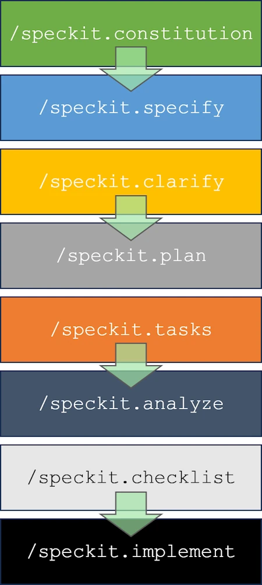
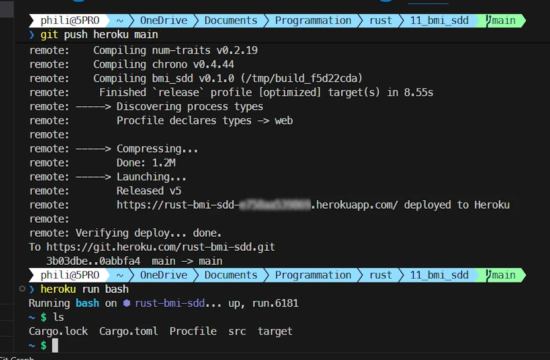
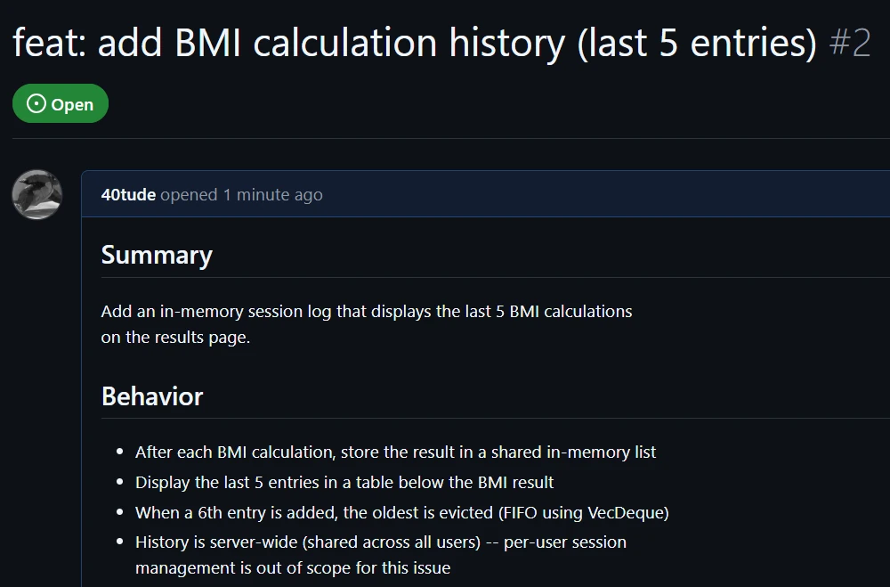
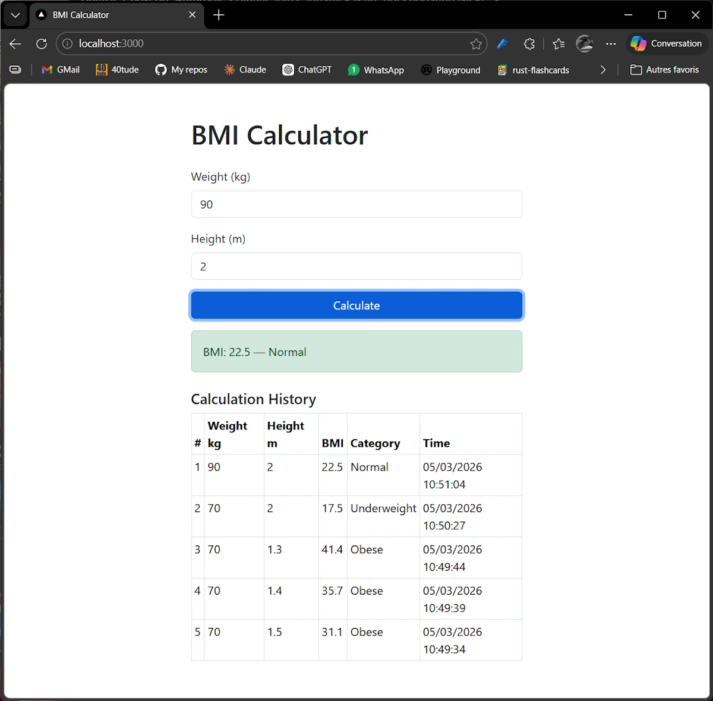
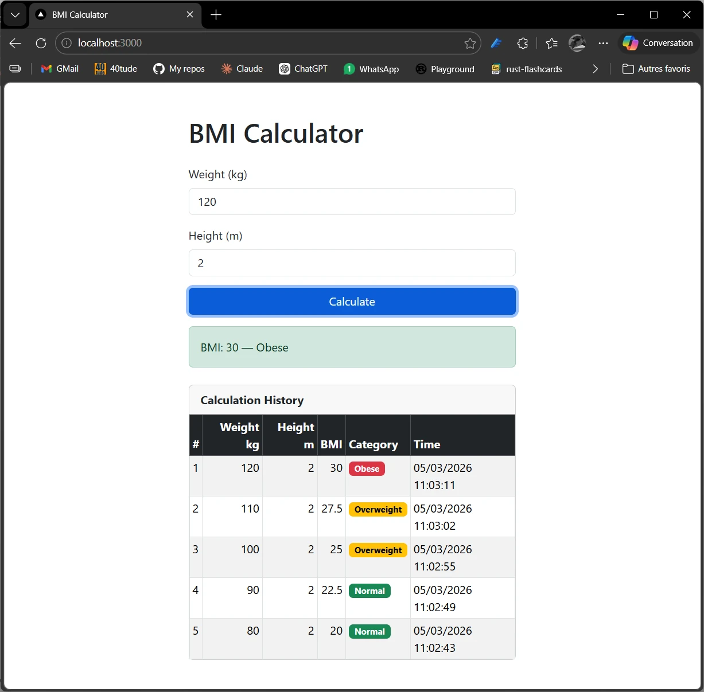

# Spec-Driven Development with Rust and GitHub Spec Kit
{: .no_toc }

Building and evolving a small Axum web app step-by-step using specs, tasks, and AI-assisted workflows.
{: .lead }


<h2 align="center">
<span style="color:orange"><b> 🚧 This post is under construction 🚧</b></span>
</h2>


<!-- ###################################################################### -->
<!-- ###################################################################### -->
<!-- ###################################################################### -->
## TL;DR
{: .no_toc }

* For beginners, tinkerers, hobbyists, amateurs, and early-career developers...
* Spec Kit is an AI assisted structuring workflow using 4 major steps : specification, plan, tasks et implementation.
* Spec-Driven Development (SDD) is not a heavy formal process. It is a lightweight discipline: write the spec first, let the AI build from it, catch contradictions before they become bugs.
* Since the cost of the line of code dropped to 0 it is easy to change the specs and experiment multiple alternatives.
* Since the specification is based on readable documents (markdown) we can read, modify and keep track of everything on GitHub.
* Spec Kit is a set of Claude Code slash commands that turn a plain-text specification into working, tested, deployed software.
* The workflow naturally extends to feature additions. Adding a new feature follows the exact same path: specify, clarify, plan, implement. The spec repo becomes a living record of every architectural decision (the source of truth).
* We are in control. Spec Kit drives the spec and the structure. Claude Code handles everything else. We can mix the two at any point.
* We do not have to choose Spec Kit or Claude. Use Spec Kit when the work benefits from a written spec and use Claude Code directly when it does not.


**Note**
The [companion project](https://github.com/40tude/bmi_sdd) with is available on GitHub but I strongly recommend to follow the instruction and build your own application.


<figure style="text-align: center;">

<figcaption>Caption.</figcaption>
</figure>


<!-- ###################################################################### -->
<!-- ###################################################################### -->
<!-- ###################################################################### -->
## Table of Contents
{: .no_toc .text-delta}
- TOC
{:toc}


<!-- ###################################################################### -->
<!-- ###################################################################### -->
<!-- ###################################################################### -->
## Introduction


The software industry has shifted faster in the past four months than it did in the previous four years. Since the release of [Opus 4.5 in November 2025](https://www.anthropic.com/news/claude-opus-4-5), the introduction of [Cowork in January 2026](https://claude.com/blog/cowork-research-preview), and then [Opus 4.6 early February](https://www.anthropic.com/news/claude-opus-4-6), the gap between what AI agents can do and what junior developers typically do has narrowed to the point where companies are starting to notice.

Hiring of entry-level developers is dropping sharply. At some organizations, opening a new dev position now requires demonstrating that the role cannot be
filled by an AI agent. We are in March 2026. Budget cycles for 2027 start in a few months. Some of those conversations are going to be uncomfortable.

I have been thinking about this for a while (see [this post]()). I am still a
Rust, C++, and Python person. I can still spend three hours on Codingame enjoying a tight algorithm in under 50 lines. But I am convinced that our
relationship to code must change.

Here is how I think about it. We went from punch cards to assembly, then to C, then to C++ and Rust. Each step letting us express intent more naturally, at
a higher level of abstraction. In the span of a few months, we jumped a level again. Today, the programming language is English. Or French. Or whatever
language you think in.

<figure style="text-align: center;">

<figcaption>The 80-character line limit comes from punch cards with 80 columns.</figcaption>
</figure>

At the same time, I trust an AI agent generating code today about as much as I trusted a C compiler from the 1970s: I check twice, I add guardrails, I do not
take the output on faith. But in three years? We will trust the agent the same way we trust clang, gcc, or rustc today. That question will be settled.

So the question is not whether to adapt: it is when. Staying anchored to the old workflow is a "Who Moved My Cheese" problem. The cheese moved.

That brings up a real question of method. We are past the stage of using Claude or ChatGPT as a fancy chatbot. We are past using them as Intellisense on
steroids. What we need is a workflow that takes us from a plain-English description to a working, tested, deployed application. There are smart people
working on this problem. My current answer is Spec Kit.

OK, but what is Spec Kit? In 2 words, it is an AI assisted structuring workflow using 4 major steps : specification, plan, tasks et implementation.

In this post we will demonstrate how to use it and we will:
- Build a small web application (a BMI calculator, though the domain is not the point)
- Deploy it to Heroku
- Add a feature to it
- Do all of this without writing a single line of code by hand

Ok, but when **NOT** to use Spec Kit?
* It requires a bit of discipline ((but no more than writing code requires))
* Can be overkill for small scripts or small feature (we will see examples later)
* It is heavily dependent on the quality of the model and for now Claude is


This said, here we will use the Spec Kit workflow from start to finish. I will walk through every step and every command, and share every prompt I used along with how I
designed each one.

Ok, now that we have an overview of the workflow, let's go through each step and see how Spec Kit guides the development process.

<figure style="text-align: center;">

<figcaption>The Spec Kit workflow.</figcaption>
</figure>


<!-- ###################################################################### -->
<!-- ###################################################################### -->
<!-- ###################################################################### -->
## Prerequisites
I suppose the following software are installed:
1. VScode
1. GitHub
1. GitHub CLI (gh)
    ```powershell
    winget install GitHub.cli
    gh auth login

    # In the wizard:
    #   Account -> GitHub.com
    #   Protocol -> HTTPS
    #   Authenticate Git with GitHub credentials -> Yes
    #   How to authenticate -> Login with a web browser

    gh --version
    gh auth status
    ```
1. Python
1. uv
    ```powershell
    winget install astral-sh.uv
    uv --version
    ```
1. Optional: Heroku
    * You have an account (free)
    * Install Heroku CLI. Read [https://devcenter.heroku.com/articles/heroku-cli](https://devcenter.heroku.com/articles/heroku-cli)
1. Spec Kit
    * https://github.com/github/spec-kit
    ```powershell
    uv tool install specify-cli --from git+https://github.com/github/spec-kit.git
    ```


**Note**
To update specify

```powershell
uv tool install specify-cli --force --from git+https://github.com/github/spec-kit.git
specify check
```
Read : [https://github.com/github/spec-kit/blob/main/docs/upgrade.md](https://github.com/github/spec-kit/blob/main/docs/upgrade.md)


<!-- ###################################################################### -->
<!-- ###################################################################### -->
<!-- ###################################################################### -->
## Setup

```powershell
cargo new bmi_sdd
cd ./bmi_sdd
cargo build
cargo run
# Commit and push on GitHub
git add .
git commit -m "My first commit"

# Create the repo on GitHub with GitHub CLI (gh)
gh repo create my_project --public --source=. --remote=origin --push

# upgrade speckit
uv tool install specify-cli --force --from git+https://github.com/github/spec-kit.git

specify init . --ai claude

# Welcome home
code .

# CTRL + ù on FR keyboard
claude
/model # Set Opus 4.6 &  effort: full
```


<!-- ###################################################################### -->
<!-- ###################################################################### -->
<!-- ###################################################################### -->
## /speckit.constitution

<figure style="text-align: center;">

<figcaption>Constitution</figcaption>
</figure>

The **constitution** is the foundation of the entire workflow. It captures what the project is: its purpose, its constraints, its technology choices, and what it explicitly does not do. Every subsequent command (spec, plan, tasks, implementation) must stay consistent with it. If a feature contradicts the constitution, Spec Kit will flag the conflict rather than silently implementing something that breaks the design.

Think of it as a binding contract between you and the AI: written once, amended deliberately, never ignored.

I open a chat with Claude in my web browser, share the very first version of the `README.md` I wrote and ask:

> I work with the speckit workflow. After reading the `README.md`, suggest a prompt to use with `/speckit.constitution`. If anything is missing from the `README.md`, let me know as well.

We go through a short Q&A session. At the end I get the prompt below, which I paste into the Claude session in VSCode:

```text
/speckit.constitution

Create a BMI Calculator web application in Rust with the following requirements:

## Core Functionality
- Calculate Body Mass Index (BMI) using SI units (kg for weight, meters for height)
- Classify BMI into standard WHO categories:
  - Underweight: < 18.5
  - Normal: 18.5 – 24.9
  - Overweight: 25.0 – 29.9
  - Obese: ≥ 30.0
- Stateless application — no database, no persistence

## API
- Single endpoint: POST /api/bmi
- Request body (JSON): { "weight_kg": f64, "height_m": f64 }
- Success response (200): { "bmi": f64, "category": "string" }
- Error response (422): { "error": "string" } with meaningful messages (e.g., "weight_kg must be positive")
- Health check: GET /health returning 200 OK

## Tech Stack & Crates
- **Web framework:** Axum + Tokio (async runtime)
- **Serialization:** Serde (JSON request/response)
- **Error handling:** thiserror (domain/library errors) + anyhow (application-level errors)
- **Logging:** tracing + tracing-subscriber — all errors logged server-side
- **CLI config:** Clap (port, log level)
- **HTTP client:** Reqwest (for integration tests)
- **UI:** Bootstrap (CDN), served as embedded HTML via Axum

## Architecture
- Clean separation: domain logic, API layer, UI serving
- Domain module: pure functions for BMI calculation and classification (no I/O, no framework dependencies)
- API module: Axum handlers, JSON types, input validation, error mapping
- UI module: single HTML page with Bootstrap form, fetch-based submission to /api/bmi, result display

## Quality & Testing (TDD)
- Unit tests for domain logic (calculation accuracy, category boundaries, edge cases like zero/negative inputs)
- Integration tests for API endpoints using Reqwest (valid requests, invalid inputs, missing fields)
- All tests runnable via `cargo test`

## Deployment
- Run and test locally first — port configurable via --port CLI flag or PORT env var (Heroku convention)
- Deploy on Heroku using Rust buildpack
- PORT env var takes precedence over CLI flag when set
- Procfile included

## Non-goals
- No input range constraints beyond positivity
- No persistence or database
- No API versioning
- No authentication

```


* I review `.specify/memory/constitution.md`
* Commit msg: `add: project constitution v1.0.0`


<!-- ###################################################################### -->
<!-- ###################################################################### -->
<!-- ###################################################################### -->
## /speckit.specify

`/speckit.specify` takes the constitution and a feature description and produces a formal, structured spec. The spec lives in the repo as a markdown file under specs/. It includes acceptance criteria, module boundaries, expected test cases, and design decisions: everything a developer (or an AI agent) needs to implement without guessing.

The constitution says what the app should do; the spec says how it should be structured to do it.

I continue the chat in Claude web. I ask:

> Now I need to use `/speckit.specify` but I'm not sure what to write. I feel like we've already said everything in the constitution. Can you suggest some prompts?

We go back and forth a few times. I finally paste this slash command in Claude in VSCode:


```
/speckit.specify

Specify the project with the following structure:

## Project Layout
- src/main.rs — CLI parsing (Clap) + server startup
- src/domain.rs — BmiInput struct, calculate_bmi(), BmiCategory enum, BmiResult struct
- src/api.rs — Axum handlers, JSON request/response types, error handling
- src/ui.rs — function returning the HTML page as a string
- src/error.rs — thiserror enum (InvalidWeight, InvalidHeight) mapped to 422 responses
- tests/api_tests.rs — integration tests with reqwest

## Key Design Decisions
- BMI rounded to 1 decimal place
- BmiCategory implements Display for the JSON "category" field
- Input validation happens in the domain layer, not the handler
- Tracing subscriber initialized in main with env-filter
- HTML page embedded as a const &str, not served from a file

## Expected Test Cases

### Domain Tests
- calculate_bmi(70.0, 1.75) → 22.9, Normal
- calculate_bmi(50.0, 1.80) → 15.4, Underweight
- calculate_bmi(90.0, 1.70) → 31.1, Obese
- calculate_bmi(0.0, 1.75) → Error: weight must be positive
- calculate_bmi(70.0, -1.0) → Error: height must be positive

### API Tests
- POST /api/bmi with valid JSON → 200 + correct result
- POST /api/bmi with missing field → 422 + error message
- POST /api/bmi with empty body → 422
- GET /health → 200

From these tests, derive the types, modules, and function signatures.

```


* This creates branch `001-bmi-calculator`
* I read `specs\001-bmi-calculator\spec.md`
* I read `specs\001-bmi-calculator\checklists\requirements.md`
* Commit msg: `After /speckit.specify`


<!-- ###################################################################### -->
<!-- ###################################################################### -->
<!-- ###################################################################### -->
## /speckit.clarify

`/speckit.clarify` reads the current spec and surfaces every ambiguity it can find. It asks targeted questions. Things like "what happens when the body is valid JSON but the weight field is a string?", or "should the health endpoint return a body or just a status code?" and expects concrete answers before moving on.

The point is to resolve ambiguities in the spec rather than in the code. Fixing a one-line spec update is cheap. Fixing a baked-in assumption three layers deep in the implementation is not.

```powershell
/clear           # check Opus is active
/speckit.clarify # No additional instruction
```

Commit msg: `After /speckit.clarify`


<!-- ###################################################################### -->
<!-- ###################################################################### -->
<!-- ###################################################################### -->
## /speckit.plan

`/speckit.plan` turns the clarified spec into a technical plan. It produces a set of documents in the spec folder: `plan.md` (overall architecture), `quickstart.md` (how to build and run), `research.md` (crate choices and tradeoffs), `data-model.md` (types and structures), and `api.md` (endpoint contracts).

This is the step where Spec Kit translates "what the app should do" into "how the code should be organized." No code yet, just a blueprint precise enough to implement from.

```powershell
/clear          # check Opus is active
/specify.plan

```
Commit msg: `After /speckit.plan`


**Note:** Reading this page [https://github.com/github/spec-kit/blob/main/spec-driven.md](https://github.com/github/spec-kit/blob/main/spec-driven.md), I wonder if I should have listed the tools to use here instead.


<!-- ###################################################################### -->
<!-- ###################################################################### -->
<!-- ###################################################################### -->
## /speckit.tasks

`/speckit.tasks` breaks the plan into a concrete, ordered list of tasks and writes them to specs/.../tasks.md. Each task is small, focused, and actionable. The kind of unit you can hand to an AI agent (or a junior developer) and get a working result back.

This step is worth switching to a lighter model for. The heavy reasoning happened in the earlier steps; task generation is mostly pattern-matching and decomposition.


* **⚠️ IMPORTANT:** Remember to switch to Sonnet (full)

```powershell
/model # Select Sonnet, Full
/clear
/speckit.tasks
```

* Commit msg: `After /speckit.tasks`


<!-- ###################################################################### -->
<!-- ###################################################################### -->
<!-- ###################################################################### -->
## /speckit.analyze

`/speckit.analyze` cross-checks everything produced so far: the constitution, the spec, the plan, and the tasks. It looks for contradictions, gaps, unstated assumptions, and risks. It assigns each finding a category (Constitution, Implementation, Warning) and a severity (CRITICAL, IMPORTANT, WARNING).

This is a quality gate. It is the step where Spec Kit earns its keep.


```powershell
clear             # check Sonnet is active
speckit.analyze

```
* Commit msg: `After /speckit.analyze`


<!-- ###################################################################### -->
<!-- ###################################################################### -->
<!-- ###################################################################### -->
## /speckit.checklist

`/speckit.checklist` generates two checklists.
1. The first (`requirements.md`) is a pre-implementation gate: does the spec contain enough detail to code from?
1. The second (`pr-review.md`) is a post-implementation gate: does the code match the spec?

The first must be complete before coding starts while the second is used during the PR review.


```powershell
/clear             # check Sonnet is active
/speckit.checklist
```
* Commit msg: `After /speckit.checklist`


<!-- ###################################################################### -->
<!-- ###################################################################### -->
<!-- ###################################################################### -->
## /speckit.implement

`/speckit.implement` does the actual work. Guided by the spec, plan, tasks, and checklists, it generates the code. It processes the task list in order, marks each task complete as it goes, and stops if a checklist item cannot be satisfied.


```powershell
/clear               # check Sonnet is active
/speckit.implement
```

* Commit: `After /speckit.implement`


<!-- ###################################################################### -->
<!-- ###################################################################### -->
<!-- ###################################################################### -->
## Test & Check Local

### Checking
{: .no_toc }

```powershell
# Default port 3000
cargo run

# Custom port via CLI flag
cargo run -- --port 8080

# Custom port via env var (takes precedence over --port)
$env:PORT='8086'; cargo run
# CTRL+C to stop
Remove-Item env:PORT
ls env:

# PORT only exists for the spawned process
Start-Process cargo -ArgumentList 'run' -NoNewWindow -Wait -Environment @{ PORT = '8086' }


# Custom log level
cargo run -- --log-level debug
cargo run -- --log-level "bmi_sdd=debug,hyper=debug,tower=debug"
```

The server starts at `http://localhost:3000` (or the configured port).


### Testing
{: .no_toc }

```powershell
# Run all tests (unit + integration)
cargo test

# Unit tests only (domain logic + port resolution)
cargo test --lib
cargo test --bin bmi_sdd

# Integration tests only
cargo test --test api_test
```


### Manual Verification
{: .no_toc }

With the server running (`cargo run`):

```powershell
# Valid BMI calculation
curl -X POST http://localhost:3000/api/bmi `
  -H "Content-Type: application/json" `
  -d '{"weight_kg": 70.0, "height_m": 1.75}'
# -> 200 {"bmi":22.9,"category":"Normal"}

# Invalid input
curl -X POST http://localhost:3000/api/bmi `
  -H "Content-Type: application/json" `
  -d '{"weight_kg": 0.0, "height_m": 1.75}'
# -> 422 {"error":"weight_kg must be positive"}

# Health check
$response = Invoke-WebRequest http://localhost:3000/health
$response.StatusCode
# -> 200

# Web UI -open in browser
start http://localhost:3000
```


<figure style="text-align: center;">

<figcaption>The first version of the BMI app created with Spec Kit</figcaption>
</figure>


Spec Kit got us to a working implementation. But Spec Kit is not the only tool available inside Claude Code. At this point **I stay on the branch** and use Claude Code directly to add two small things that I wanted but did not spec up:

* Add `CTRL+C` support
* Add one tracing::debug! in src/api.rs

This is the **key practical point**: Spec Kit and Claude Code complement each other.
- Spec Kit is for structured, traceable development: specs, plans, tasks, checklists.
- Claude Code is for everything else: quick fixes, small additions, refactoring, debugging.

You do not have to choose one or the other. Use Spec Kit when the work benefits from a written spec and use Claude Code directly when it does not.


<!-- ###################################################################### -->
<!-- ###################################################################### -->
<!-- ###################################################################### -->
## Merging the branch manually

```powershell
# Switch to the branch (just to make sure)
git switch 001-bmi-calculator

# Push the feature branch
git push -u origin 001-bmi-calculator

# Create the pull request
gh pr create --title "feat: bmi-calculator" --body "First implementation" --base main

# gh pr merge with no argument use the current branch to identify the PR
# Merge + delete the remote branch
# `gh pr merge --delete-branch` delete :
#   * the remote branch
#   * the local branch if we are on another branch (we are on main)
git switch main
gh pr merge 001-bmi-calculator --squash --delete-branch

# Sync
git pull origin main
```


<!-- ###################################################################### -->
<!-- ###################################################################### -->
<!-- ###################################################################### -->
## Deployment to Heroku


### Prerequisites
{: .no_toc }

- Run and test locally first
- Heroku account
- Heroku CLI installed
- Read the `.slugignore` file (avoid useless files on Heroku)
- Check the line `strip = "symbols"` in `Cargo.toml` (reduce size by removing symbol table entries from the final executable)


### Steps
{: .no_toc }

1. Create a new Heroku app:
```powershell
heroku create rust-bmi-sdd
```

2. Set the buildpack:
```powershell
heroku buildpacks:set emk/rust
```

**Note:**
Combine 1 & 2 with:

```powershell
heroku create rust-bmi-sdd --buildpack emk/rust
```


3. Auth:
```powershell
heroku auth:token
```
Select and copy the token.


4. Deploy on Heroku:
```powershell
git push heroku main
```
* When the dialog box popup, enter **ANY** name and paste the token.
* Files are sent, the build process starts and the server is launched.
* Note the URL (for example: https://rust-bmi-sdd-XXXX.herokuapp.com/)

5. Open the app:
```powershell
heroku open
```
Alternatively point your browser to the previous URL (for example: https://rust-bmi-sdd-XXXX.herokuapp.com/)

**Note:**
```powershell
heroku run bash
```
* Use this to inspect the files deployed on Heroku.
* Check the binary size with `ls -al ./target/release/`


<figure style="text-align: center;">

<figcaption>...</figcaption>
</figure>


**Note:**
The typical release cycle from here:
- Add features with Spec Kit, modify the app with Claude Code, test locally
- Commit and push to GitHub
- Push to Heroku (`git push heroku main`)


<!-- ###################################################################### -->
<!-- ###################################################################### -->
<!-- ###################################################################### -->
## Adding a feature

The first implementation is live. Now I want to add a history panel that shows the last 5 BMI calculations.

This is where **Spec Kit really shows its value** beyond the initial build. Adding a feature is not just "tell the AI what to do and hope for the best." It follows the same structured workflow: write a spec for the feature, plan it, task it, implement it. The spec for the new feature must stay consistent with the constitution and if it does not, Spec Kit will tell you.


The general process:
1. Create a GitHub issue for the feature
2. Run the Spec Kit workflow on a new branch
3. Test and refine locally
4. Merge the branch and close the issue

I like to create an issue because doing so, everything is in Github and 6 months from now we can go back and understand the rationales, the choices made...

After a back-and-forth with Claude in my web browser, I end up with the following prompt to create the GitHub issue:


```text
Create a GitHub issue on this project with the following details:

Title: "feat: add BMI calculation history (last 5 entries)"

Body:
## Summary
Add an in-memory session log that displays the last 5 BMI calculations
on the results page.

## Behavior
- After each BMI calculation, store the result in a shared in-memory list
- Display the last 5 entries in a table below the BMI result
- When a 6th entry is added, the oldest is evicted (FIFO using VecDeque)
- History is server-wide (shared across all users) — per-user session
  management is out of scope for this issue

## Implementation hints
- Use `VecDeque<BmiEntry>` with a max capacity of 5
- Wrap in `Arc<Mutex<...>>` and register as Axum shared state
- `BmiEntry` should store: weight, height, bmi value, category, timestamp

## Out of scope
- Persistent storage (database)
- Per-user session isolation (suggested as a follow-up exercise)

## Acceptance criteria
- [ ] History table appears after the first calculation
- [ ] Table shows at most 5 entries
- [ ] Oldest entry is removed when a 6th is added
- [ ] App compiles and deploys to Heroku without regression

Labels: enhancement

```


- At the end I see Issue created: [https://github.com/40tude/bmi_sdd/issues/2](https://github.com/40tude/bmi_sdd/issues/2). The issue number is 2.
- I can go to GitHub to see issue #2.
- From here I follow the standard Spec Kit workflow to implement the feature.

<figure style="text-align: center;">

<figcaption>...</figcaption>
</figure>


<!-- ###################################################################### -->
<!-- ###################################################################### -->
<!-- ###################################################################### -->
### /speckit.specify
{: .no_toc }

* **⚠️ IMPORTANT:** `/model` → Opus 4.6, effort: full
* `/clear`

I paste the following slash command:

```text
/speckit.specify
We want to implement the feature described in GitHub issue #2:
BMI calculation history showing the last 5 entries using an
in-memory VecDeque, shared across all users.
```

* This creates branch `002-bmi-history`
* Creates `specs/002-bmi-history/` folder
* Spec Kit reports: `No clarifications needed -- the GitHub issue was well-specified.`
    * I will **NOT** `/speckit.clarify`
* Commit msg: `After /speckit.specify`


<!-- ###################################################################### -->
<!-- ###################################################################### -->
<!-- ###################################################################### -->
### /speckit.plan
{: .no_toc }

* `/clear` # check Opus is active

```text
/specify.plan
```
* Generate `plan.md`, `quickstart.md`, `research.md` and `data-model.md`, `api.md` in `specs/002-bmi-history` and `CLAUDE.md`...
* Commit msg: `After /speckit.plan`


<!-- ###################################################################### -->
<!-- ###################################################################### -->
<!-- ###################################################################### -->
### /speckit.tasks
{: .no_toc }

* **⚠️ IMPORTANT:** Remember to switch to `/model sonnet full`
* `/clear`
* `/speckit.tasks`
* Create `specs/002-bmi-history/tasks.md`
* Commit msg: `After /speckit.tasks`


<!-- ###################################################################### -->
<!-- ###################################################################### -->
<!-- ###################################################################### -->
### /speckit.analyze
{: .no_toc }

* `/clear` # check Sonnet is active
* `/speckit.analyze`

This is where **things get interesting**. Spec Kit surfaces a critical finding:

```
ID: C1
Category: Constitution
Severity: CRITICAL
Location(s): constitution.md:L64, plan.md:L32
Summary: Principle V declares "The application is stateless." Feature adds server-wide mutable state. Plan marks this as VIOLATION but the constitution itself has never been formally amended (no version bump, no text change).
Recommendation: Run /speckit.constitution to amend Principle V: add an exception clause permitting ephemeral in-memory state when explicitly required by spec and documented in Complexity Tracking.
```

This is an excellent catch. Stateless means the server holds no data between requests. Every request is handled independently with no memory of past ones. That is exactly what the constitution says.

But a `VecDeque` wrapped in `Arc<Mutex<...>>` and registered as Axum shared state is the opposite: the server does hold state that persists across requests.

Spec Kit is right to block on this. There is a formal contradiction between the constitution and the feature. The correct response is to amend the constitution before implementing. For example, updating Principle V to say something like:

> The application minimizes server-side state. Ephemeral in-memory state is permitted when explicitly documented and justified. Persistent storage requires a separate architectural decision.

Then bump the version (e.g., v1.0 to v1.1) with a note explaining why the principle was relaxed.

This is one of the **most valuable things Spec Kit does**. A feature that looks trivial forces a conscious, traceable architectural decision. Instead of quietly introducing shared mutable state and hoping nobody notices, the workflow surfaces the contradiction and requires an explicit amendment. That is the whole point.

I answer `Yes` to "Would you like me to suggest concrete remediation edits for the top 3 issues? I can produce the exact text changes for data-model.md and tasks.md for your review before you apply them."

I let it proceed. It then asks to bump the constitution version. I accept.


* Commit msg: `After /speckit.analyze`


<!-- ###################################################################### -->
<!-- ###################################################################### -->
<!-- ###################################################################### -->
### /speckit.checklist
{: .no_toc }

* `/clear` # check Sonnet is active
* `/speckit.checklist`

`/speckit.checklist` asks three questions before generating the checklists:


- Q1 -- What should the checklist focus on?
For a blog article covering a simple feature, pick D (All three equally) -- balanced coverage shows the full value of the process. Picking A, B, or C would miss interesting angles.
- Q2 -- Depth level?
B (Standard PR review) -- the right balance. Lightweight is too shallow to be educational; Formal release gate is overkill for a small feature.
- Q3 -- Is concurrency a hard blocker?
A (Hard blocker) -- and this makes a great example. Rust forces explicit concurrency management (Arc<Mutex<...>>), so the spec should treat it as a real requirement rather than a background assumption. This shows that SDD catches concurrency concerns before any code exists.

I answer: `D B A`

* Spec Kit creates `pr-review.md`.
* Commit msg: `After /speckit.checklist`


<!-- ###################################################################### -->
<!-- ###################################################################### -->
<!-- ###################################################################### -->
### /speckit.implement
{: .no_toc }

* `/clear` # check Sonnet is active
* `/usage` # I read 54%
* `/speckit.implement`

  At one point it reports:

```text
Checklist Status

  ┌─────────────────┬───────┬───────────┬────────────┬────────┐
  │    Checklist    │ Total │ Completed │ Incomplete │ Status │
  ├─────────────────┼───────┼───────────┼────────────┼────────┤
  │ requirements.md │ 13    │ 13        │ 0          │ PASS   │
  ├─────────────────┼───────┼───────────┼────────────┼────────┤
  │ pr-review.md    │ 28    │ 0         │ 28         │ FAIL   │
  └─────────────────┴───────┴───────────┴────────────┴────────┘

The pr-review.md is a post-implementation PR review checklist (all items are reviewer questions about spec gaps, not implementation prerequisites). It is not intended to be completed before coding.

Some checklists are incomplete. Do you want to proceed with implementation anyway? (yes/no)

```


This is perfectly logical:

- `requirements.md` at 13/13: the pre-implementation checklist. It verifies the spec is detailed enough to code from. Complete means ready.
- `pr-review.md` at 0/28: the post-implementation checklist. It is used during the PR review, once the code exists. Questions like "does the implementation respect the spec?" cannot be answered before there is any code. Zero is the correct value here.

I answer `Yes`. The `pr-review.md` checklist will be useful later when creating the PR to merge the feature and close the GitHub issue.

This distinction matters: Spec Kit separates spec validation (before code) from implementation review (after code). Both are valuable; they just run at different times.

* Commit msg: `After /speckit.implement`


<!-- ###################################################################### -->
<!-- ###################################################################### -->
<!-- ###################################################################### -->
## Checking and testing (local)

See the previous "Checking and testing (local)" section


<!-- ###################################################################### -->
<!-- ###################################################################### -->
<!-- ###################################################################### -->
## Improve the array rendering

<div align="center">
<br/>
<!-- <span>Optional comment</span> -->
</div>

I stay on the branch and use Claude Code directly (not Spec Kit) to improve the visual appearance of the history table. This is exactly the kind of small, focused work where going through a full Spec Kit workflow would be overkill.


* `/clear` # check Sonnet is active
* `/usage` # 71%
* I use this prompt

```
Improve the visual appearance of the Calculation History table using
Bootstrap classes. Keep the existing functionality intact.

Requirements:
- Use Bootstrap's `table-striped table-hover table-bordered table-sm` classes
- Add a `thead-dark` (or `table-dark`) header row for contrast
- Color-code the Category cell based on value:
    - "Underweight" → badge badge-warning (yellow)
    - "Normal"      → badge badge-success (green)
    - "Overweight"  → badge badge-warning (orange)
    - "Obese"       → badge badge-danger  (red)
- Wrap the table in a `card` with a card-header titled "Calculation History"
- The timestamp format is fine as-is, but put date and time on the same line
- Keep the # column but right-align numeric columns (Weight, Height, BMI)

```


<div align="center">
<br/>
<!-- <span>Optional comment</span> -->
</div>


### Merge of the branch
{: .no_toc }

I use this prompt to let Claude Code handle the merge:

```text
Merge the current feature branch into main, then close GitHub issue #2.

Steps:
- Ensure we are on the feature branch
- Merge into main with a descriptive commit message that includes "Closes #2"
- Push main to remote
- Delete the feature branch (local and remote)

```


Or, manually:

```powershell
# Switch to the branch just to make sure
git switch 002-bmi-history

# Push the feature branch
git push -u origin 002-bmi-history

# Create the pull request
gh pr create --title "feat: bmi-calculator" --body "Closes #2" --base main

# gh pr merge with no argument use the current branch to identify the PR
# Merge + delete the remote branch
# `gh pr merge --delete-branch` delete :
#   * the remote branch
#   * the local branch if we are on another branch (we are on main)
git switch main
gh pr merge 002-bmi-history --squash --delete-branch

# Sync
git pull origin main
```


<!-- ###################################################################### -->
<!-- ###################################################################### -->
<!-- ###################################################################### -->
## Deployment to Heroku
- Commit & push on GitHub
- Push on Heroku (`git push heroku main`)


<!-- ###################################################################### -->
<!-- ###################################################################### -->
<!-- ###################################################################### -->
## Conclusion

Spec Kit introduces a different way of thinking about software development. Instead of jumping directly into code, the process begins with a clear description of *what* we want to build and *why*. From there, a structured workflow (constitution, specification, planning, task breakdown, and implementation) progressively transforms that intent into working software.

Throughout this article, we have seen how this approach changes the interaction with AI coding assistants. Rather than relying on one-shot prompts, Spec Kit encourages a step-by-step dialogue where requirements are clarified, the architecture is defined, and implementation tasks are generated before writing the final code. This staged process helps reduce ambiguity, improve consistency, and keep the project aligned with its original goals.

Using Spec Kit and storing every issue on GitHub also brings several practical advantages:

* **Better clarity**: specifications capture the intent of the feature before implementation begins.
* **More predictable development**: planning and task generation create a clear roadmap.
* **Improved collaboration with AI tools**: structured commands guide the assistant and reduce random or inconsistent code generation.
* **Reusable project knowledge**: specifications and plans remain useful documentation instead of being discarded once the code is written.

In other words, Spec Kit helps shift the focus from *writing code quickly* to *building the right thing in a structured way*. By combining clear specifications with modern AI assistants, it offers a workflow that is both disciplined and productive.

Of course, like any methodology, it takes a little time to adopt and adapt to one’s own habits. But once integrated into the development workflow, Spec Kit can become a powerful ally for designing features, structuring projects, and making better use of AI-assisted development.

And perhaps that is the most interesting takeaway: with tools like Spec Kit, the future of programming is not just about generating code faster — it is about **thinking more clearly about what we want to build, and letting the tools help us get there.**


<!-- ###################################################################### -->
<!-- ###################################################################### -->
<!-- ###################################################################### -->
## Webliography
* [Spec Kit repo](https://github.com/github/spec-kit)
