# {{ page.title }}
{: .no_toc }

{{ page.description }}
{: .lead }

<!--
<h2 align="center">
<b> 🚧 This post is under translation 🚧</b>
</h2> -->

<figure style="max-width: 450px; margin: auto; text-align: center;">
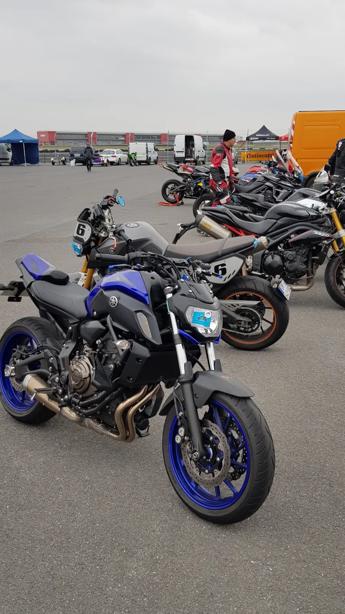
<figcaption>My first track day with the MT07</figcaption>
</figure>

## Introduction

The other day I had a conversation with a female rider who had never set foot on a track and was dying to give it a try. Sure, there are the [Motorcycle Riding Notes](), but ideally she wanted something shorter, less comprehensive, something actionable for a complete beginner that would help her get the most out of her first time on track. Basically, a schedule she could print on a single sheet of paper and keep within reach during the track day.

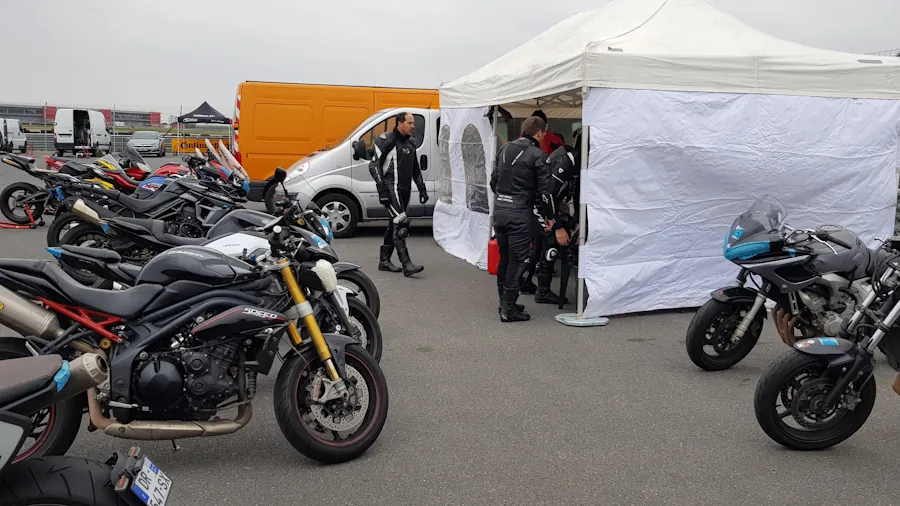

I'm not going to talk about logistics or mechanics here. I'll assume the rider arrives at the track on their own bike, riding in from the road. I'm going to focus solely on riding technique and try not to say too many dumb things. On that note, if you disagree with something I say or have additional information to share, please do so via the [comments](https://github.com/40tude/40tude.github.io/discussions). They're most welcome. Same goes if you have questions I don't answer. Just one thing: be courteous and constructive.

As for the rest, there will be a safety briefing in the morning, but if you really think a dedicated post on logistics and organization would be useful, let me know in the [comments](https://github.com/40tude/40tude.github.io/discussions). Otherwise, you can watch this series of videos (FR):

<figure style="max-width: 560px; margin: auto;">

    <iframe
    src="https://www.youtube.com/embed/sGD8_uOHpKw"
    title="First time on track"
    style="position: absolute; inset: 0; width: 100%; height: 100%;"
    allowfullscreen>
    </iframe>

<figcaption style="text-align: center;">
    First time on track
</figcaption>
</figure>

In this post you'll find:

* [The schedule in summary mode](#the-schedule-in-summary-mode): gives you an overview of the program.
* [The schedule in action mode](#the-schedule-in-action-mode): this is the part to print and keep within reach.
* [The schedule in detailed mode](#the-schedule-in-detailed-mode): to be read **before** going to the track and re-read on your phone at lunchtime on track day. This is the section where I take the time to explain the content of each session.

## The schedule in summary mode

During our discussion, we (my new friend and I) decided to base things on a typical track day schedule split into 6 sessions of 20 minutes each. If the day happens to include a seventh session, we're not going to complain, that's just a bonus. We also agreed that she would come to the track with:
1. a printed copy of the schedule
1. a printed copy of the track map
1. a pencil and an eraser

As for the day itself, in order to discover as many things as possible, we also decided to move from one session to the next even if the previous session wasn't entirely successful. The idea is, for example, to avoid spending three-quarters of the day learning the track layout when you can keep doing that during the following sessions. There's so much to discover by the end of the day!

*So where's your schedule already?* Here's what we agreed on:

1. [Track reconnaissance](#1-track-reconnaissance)
1. [Accelerating on the straights](#2-accelerating-on-the-straights)
1. [Getting down on the bike](#3-getting-down-on-the-bike)
1. [Apex and racing line](#4-apex-and-racing-line)
1. [Braking](#5-braking)
1. [Driving the corner](#6-driving-the-corner)
1. [The seventh session](#7-the-seventh-session)

## The schedule in action mode

Just grab the `.pdf` below and print it. It's written in shorthand. To understand it, you'll need to read the next section.

[Agenda of the track day](assets/agenda_trackday.pdf)

## The schedule in detailed mode

### 1. Track reconnaissance

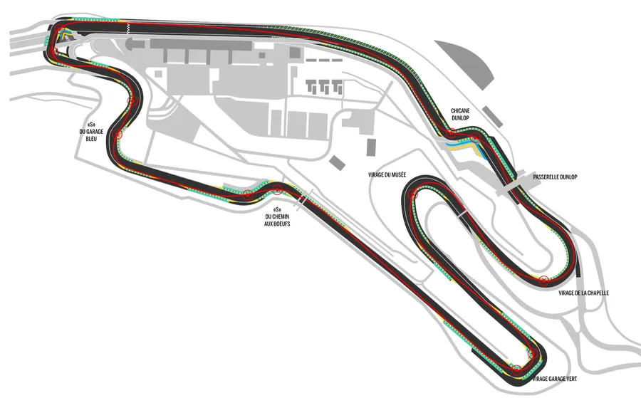

In this session,like in all the others, zero pressure. You ride at 75% of your ability. You're comfortable and relaxed on the bike. Don't worry about your body position or anything else. For 20 minutes you ride at a sustained pace (we're not exactly out for a Sunday stroll) and you learn the track. At no point do you push into the red zone or go into panic mode. For example, after a few laps you'll certainly be braking harder than on the road, but you'll make the effort to stay well within your limits. In this session, you need to keep all your focus for memorizing the track layout. And if someone passes you... Couldn't care less, let them go, we'll revisit this at the end of the day... 😏

Two things to keep in mind, though:

1. From now on you ride with the balls of your feet on the pegs. That's the widest part, just behind the toes. You're not on your tiptoes and you're not jamming your heel against the peg either. You can get used to this foot position on the road in the weeks before the track day.
2. You arrive on the right side of the track if the next turn goes left, and on the left side if the next turn goes right. That's it, and it's already a lot, because when I say "right," for example, I mean your wheels are 1 cm from the white line. Not 1 meter, not 25 cm, no, no, no, you need to hug the line. Sure, if you're 5 cm off I'm not going to take you to court. Seriously though, you need to learn this now while you don't have much speed. You need to get used to seeing the white line very close to your tires (and no, you're not going to crash).

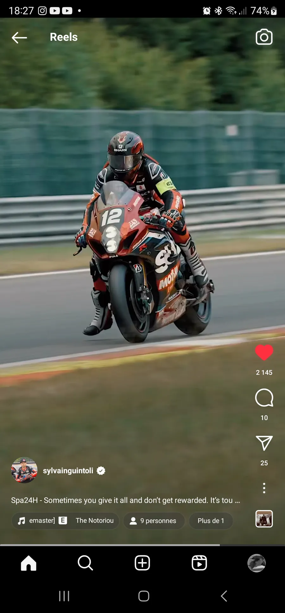

During the session, take the time to go through pit lane. Spot the exit during one lap. On the next lap, a bit before the exit, raise one hand to signal, avoid riding at a snail's pace, and exit without looking behind you. There, you'll have the choice to go back to the paddock or back on track. Of course, you go back on track when the guy watching pit lane gives you the go-ahead.

**Watch out**, and this is exactly why we do this exercise. When you merge back onto the track, the others are already at speed. So, throw a glance (turn your head fully and/or lift your butt off the seat and look back) and if it's clear, accelerate hard. Then, hug the line on the outside of the next turn. Be careful, stay wide in the first corner. After that you're good, you're back in the flow. The riders behind you have to watch out for you (it's like skiing, actually).

Going through the pits can be very useful if you find yourself in a pack and you're not comfortable (too many people, too much noise, too stressful...). The best thing to do in that case is to go through the pits and get right back on track to find yourself alone, calm, and safe. You shouldn't follow others too closely, especially in the "Beginner" group, because anything can happen: a missed gear, a sudden change of line, a Martian invasion... Same thing if you feel your concentration slipping... Pull off, breathe, and go back out. However, if you're tired at the end of a session, just pull off. There's no shame in coming in a lap or two before the session ends.

**Goal at the end of the session**

* You should be able to "recite" the track out loud and "see" it in your head.
* You've exited and re-entered the track at least once to see how it works.

**Notes**

* Are you sure you lowered your tire pressures?
If you don't know what pressures to use, set 27.0 PSI at the rear and 29.9 PSI at the front. I'm not supposed to talk about anything other than riding technique, but this one can affect your riding. If there's a mechanic and/or a sign listing tires and pressures, go check it out.

* If a marshal escorts you on this first session, make sure you're the first one behind them.
It's a bit like ski school. The last kid in line following the instructor doesn't get the instructor's line at all and doesn't learn much.

* Do your hands hurt at the end of the session?
If so, it means you're beyond your 75%. You're not in panic mode but you're not relaxed either, and you're unconsciously gripping the handlebars tighter than necessary. What are you going to do in the next session to fix that?

* Does your neck or shoulders hurt at the end of the session? Same reason as above. Relax, chill, be cool... What are you going to do in the next session to reach Tibetan monk-level zen?

* Can you confirm you weren't holding your breath during the session?
If you're not sure, during the next session make the effort to exhale into your helmet on the straights (and in the sweeping turns). With your pencil, mark a circle on the map where you'll exhale during the next session.

* Do you know what gear you're in on different sections of the track?
Can you write +1 and -1 on the map? If you don't know, it's fine. During the next session try to note 2 or 3, then another 2 or 3 the session after. The idea is to free up mental bandwidth and for example, remembering that at the end of the main straight you downshift 2 gears (-2). That's easier to manage than checking that you're in 2nd in the corner after the straight (while you're at it, put some blue painter's tape over everything on your dashboard except the tachometer. It keeps you from being distracted by useless information).

* If a marshal organizes classroom sessions specifically for Beginners, you attend.
This is not negotiable.
There's always something to learn and hear again. This goes for the rest of your life: whenever a marshal dedicates time to your group (Beginners, Intermediate...) you show up.

### 2. Accelerating on the straights

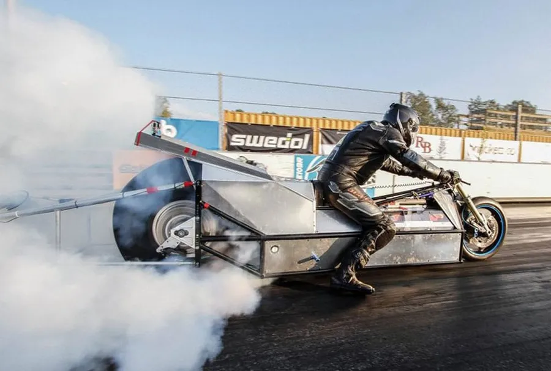

You devote the 20 minutes of this session to making sure you're at full throttle on the straights. No messing around, focus on that and nothing else. Don't start trying to outbrake someone, don't start contorting yourself trying to get a knee down. No, no, no my friend. For now, trust the process, play the game, and focus on getting on the gas, just the gas, all the gas.

This is the foundation, and before doing anything else, you need to get used to rolling the throttle to the **stop** (yes, the **stop**). We never do this on the road and we rarely hear the engine screaming in the upper rev range. So it's something new that you need to learn. For example, it might be coming out of a corner, on the following straight. You're in 2nd gear and the throttle is at the **stop** as you shift into 3rd. The goal is NOT to be in 6th, wide open, and end up calling the local paramedics. The goal is NOT to be at 100% throttle in the middle of a corner either. No, at this stage, you're rolling on the throttle, getting used to the noise, the acceleration, the speed, and the **stop** ✊. So in 2nd, in 3rd, 100% throttle with the bike upright, on a straight, that's perfect.

You need to learn this because your lap time mainly depends on your speed at the end of the straights, not really on your speed through the slow sections. Plus, we need to accustom our brain to speed — after riding at 55 mph every day, we're a bit overwhelmed at first when we hit the track.

**Watch out** — you stay at 75% of your ability. That means on a given straight, you go 100% throttle but you may brake earlier than you did during the first session. Don't put yourself in panic mode under braking when what we're working on here is acceleration.

Once that's validated on one or two straights, you need to do the same exercise in the sweeping turns, because fundamentally these are fast sections of the track. Go ahead, push 2nd, push 3rd while slightly leaned over in a big sweeper.

Less obvious but just as important... You also need to accelerate hard on the short straights. It's not easy to get to 100% throttle, but you need to be deliberate and roll that grip. You need to feel that "whomp effect," that kick in the pants with the engine climbing through the revs even if you chop and brake right after. **Watch out**, you might be tempted to go from 0% to 100% too quickly on the short straights. That's not the goal. If you don't reach the **stop** here, it's fine. What matters is that you accelerate, feel the kick, and get the engine revving without necessarily upshifting before the next corner.

Organize yourself within the session... It's going to be hard to do the exercise on every straight right from the start. I suggest you begin with the longest straight. Then pick another straight on the opposite side of the circuit. This lets you do the exercise twice per lap and catch your breath in between (by the way, are you remembering to exhale in your helmet?). When you've got one of the two sorted, add another segment and you'll be doing the exercise 3 times per lap, and so on.

**Goal at the end of the session**

* There's at least one spot on the track where you're rolling the throttle to the **stop** (typically in 2nd and/or 3rd gear).
* Look at the map. Mark with a "G" the spots where you're at the **stop**, as well as the next spot where you'll make the effort to hit the **stop**. It's obvious, but it bears saying... Yes, of course, in the following sessions you keep going 100% throttle everywhere you can and you add more "G"s to your track map.

**Notes**

* *Yeah but I'm scared I'll crash!*
That's normal, we never do this on the road. It's new. Once again, the goal is to pick a straight and, while the bike is upright in 2nd or 3rd, to roll the throttle all the way to the **stop**. The goal is NOT to be 100% throttle while the bike is at full lean. The goal is NOT to go from 0% to 100% in a tenth of a second. No, at this stage you're rolling on the cable, getting used to the sound, the acceleration, the speed, and the **stop**.

* *Yeah but if I'm at full throttle the engine will redline!*
This is a motorcycle, not an Xbox. So, even when you roll to 100% throttle, there's a delay before the engine reaches the redline. You're wide open and yet the engine keeps building revs. A little before the redline, that's when you upshift.

* *Why do you always say "at the **stop**"?*
Because that's what you need to feel. You need to feel the **stop**, that you can't go any further. If you don't, you might have the "feeling" of being at full throttle when you're actually not. So in short, you turn the throttle grip until you hit the **stop** then you'll know for certain you're at max and can't go further. Practice this in your garage or on the paddock while stationary.

* *Am I going to wheelie and crash?*
No, because the acceleration is supposed to be pro-gres-sive. You're not doing an on-off switch, you're rolling, rolling, rolling... until the **stop**.

* *Yeah but I can't manage it because at some point my wrist is cocked and I can't turn any further!*
Two things to do:
1. Check that your suit sleeves aren't too long. Without gloves, they should NOT cover the wrist. You should be able to extend your fingers and tilt your hand up (fingers vertical, at a right angle) without the back of your hand touching the sleeve edge. If needed, push your sleeves up when you get on the bike, but they'll slide back down during the session.
1. More importantly, **think about it.** Before you start rolling on, while you're off the throttle, spread your fingers slightly from the grip and **roll your hand** forward. Then close your fingers again lightly. This will let you turn the grip all the way. It's called the **grip shift**. You can practice this on the paddock, while stationary. It should actually become a reflex every time you chop the throttle and release the brakes but let's not get ahead of ourselves.

* *Am I going to blow up the engine?*
No chance, go for it, just upshift before the redline.

* Hey... Do you know what gear you're in on different sections of the track?
Add +1 and -1 on your track map.

{: .note }
> All else being equal, the first rider at the end of the straight is always the one who goes 100% throttle first.
>
> So if you can't do this exercise, ask yourself **THE** question. What's the problem? The bike? The rider? The match between the two?
>
> Imagine I cut your bike's power by 4. Do you think you'd be able to go full throttle? Yes? No? Why?
>
> What if I cut it in half? On the longest straight of the track, where would you find yourself at 100% throttle? By the end of the first quarter? At the exit point? At the apex of the previous corner?
>
> Sure, it's your first trackday, we're not in MotoGP. But the whole point is to make progress and give yourself the means to get past the "100% throttle" milestone. So what do we do? **Think about it.** Be honest with yourself. Do you have too much power for what you can actually handle today?
>
> I'm not judging. I've been there too. It's one thing to pull away at a traffic light, it's another to pin the throttle at the apex. Without control, power is nothing.
>
> I'm not asking you to sell your bike. I'm just saying that if you can't go 100% throttle, something needs to change. For the track, have you considered renting a 400cc? It can make all the difference.

### 3. Getting down on the bike

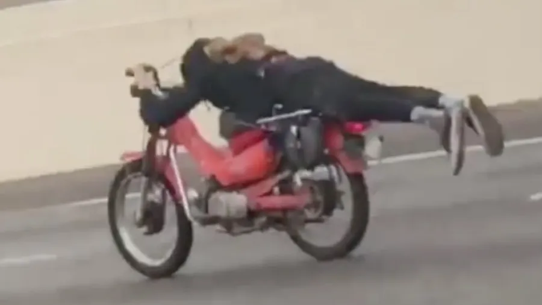

It's 11:40 AM, this is the last session of the morning, after that, we eat! Yes, yes, but first we're going to learn one more new thing.

During this session you're going to make the effort to get down on the tank on the straights and sweeping turns, then on the short straights as well.

Typically, during the first 2 sessions you had a motor officer riding position (no offense guys, please don't send me to Guantanamo for that). Arms straight, torso upright, head tilted in the opposite direction, Sunday cruise style. You won't be able to keep that position in the coming sessions. So you need to practice being dynamic and mobile on the bike, lowering your head, and seeing the track from that angle. You need to tell yourself that you're no longer just riding, you're starting to race. That's a completely different thing.

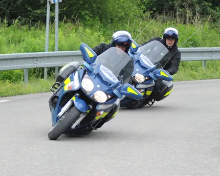

You'll start with the longest straight because that's where you have the most time. Plus, you know it already, you're already hitting the throttle **stop** in 2nd before shifting into 3rd. OK, well now, while the bike is upright, you're going to **use your thighs** to lighten and slide your butt back on the seat. Once that's done, drop your arms (and let go of those grips, there's no point squeezing them like that). Lay your chest on the tank (take the opportunity to exhale through your mouth as your chest makes contact). Tuck your elbows in along the tank. At that point, place the front of your helmet on the tank. Lift your eyes, you can barely see anything, your neck hurts (welcome to the club) and ride to the point where, in the previous session, you started braking. There, you pop up like a jack-in-the-box, arms straight, look far ahead, and brake like before.

Oh... This might sound like a small thing—but it actually makes a big difference. When you lower your upper body, you don't hang on to the handlebars. Ideally, you should be able to lower your torso without using your hands (that's actually a good exercise to do in the paddock or the night before in your garage). The thing is, the less you touch the bike the better and ideally, if there were no rider, the bike would behave much better most of the time. So, basically, you barely hold the grips and you do everything with **your abs**. Yes, I confirm, this is a sport and you're going to sleep well tonight. And no, you don't need to squeeze the throttle the way you do. You can hold it open at 100% with 3 fingers. Try that in the parking lot or during your rides in the week before track day.

<iframe width="560" height="315" src="https://www.youtube.com/embed/_qEe6Krz5JI?si=cIu0-Yq2E-y2WSpP" title="YouTube video player" frameborder="0" allow="accelerometer; autoplay; clipboard-write; encrypted-media; gyroscope; picture-in-picture; web-share" referrerpolicy="strict-origin-when-cross-origin" allowfullscreen></iframe>

You doing OK? Still alive? For this one, there's absolutely no reason to go into panic mode. You accelerate like before, you brake like before. The only difference is that in between, you got down on the bike. And yes, of course, you also sat back up before braking.

Alright, same method as before. Pick another sweeping turn or straight on the other side of the circuit and do the exercise twice per lap. When you've got one of the two down, add another segment and you'll be tucked on the tank 3 times per lap, and so on.

Once again, it's on the short straights that things might get a bit trickier. What's the point of getting down if in 2 seconds I'm sitting back up to brake? Plus, all of this takes a fair amount of energy and let's be honest, at some point you might get lazy. You need to fight that because later, coming out of corners, you'll be keeping your head down, off to the side of the bike. So you need to make the physical investment, learn to be mobile without upsetting the bike, and get used to seeing the track with your head down.

One more thing... **Think about it.** If you're tired of lowering your torso... Then don't raise it anymore... Yes, obviously you'll still need to sit up for braking. But otherwise, tell yourself that from now on, your default position is chest on the tank, and you only sit up during braking. This implies that after braking, in the corner, you've already tucked down but we'll talk about that later. For now, just get used to tucking on the straights at 100% throttle, at the **stop**.

One last thing... If you're feeling lazy, if you feel like you're running out of juice, pull off. It's lunchtime, rest up and come back fresh this afternoon.

**Goal at the end of the session**

* There's at least one straight where you're tucked on the tank, elbows in, and the throttle at the **stop**. You should really feel the tank pressing against your chest and/or the front of your helmet touching.

* Look at the map. Mark the places where you tuck with an "equals" sign. Which straight are you going to tuck on during the next session? Let's not kid ourselves, apart from braking zones, eventually you'll be in a head-down position pretty much all the time.

**Notes**

* *This is completely ridiculous. I'm crawling along and you want me to lie on the tank. It's pointless!*
Sure, right now there's no competitive advantage. However, getting used to having your head low, to seeing the track from that angle, that's a serious investment for later. Once again, we never do this on the road. So it's completely new and the best time to learn is at low speed when you're not in panic mode. It needs to become an attitude, a reflex.

* *I can't see anything!*
Obviously, with a naked bike it's not ideal. No big deal, you adapt. You lean down until your chest touches the tank and then come back up slightly until you can see over the instrument cluster. Uh... words matter here. The idea is: you touch, then come back up a bit. It's not "you lean down until..." No, no. Don't try to pull a fast one on me.

* *My helmet is bothering me. It slides down on my nose and I can't see anything.*
For the next session, once you've strapped your helmet on, put a hand under the front of the helmet and push it up. You should have the unpleasant feeling that people can see your chin. If it slides down during the session, you can either change the inner liner (later, once you're back home), or stuff a folded piece of fabric above your forehead (or better, between the inner liner and the helmet shell itself).

### 4. Apex and racing line

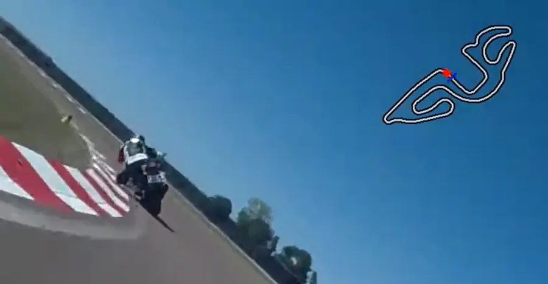

I don't want to put pressure on you, but of all the sessions, this is, in my opinion, the most important one. There, I said it, that sets the tone for the rest of the afternoon.

Also, I hope you went easy on the food at lunch. Seriously, keep it light, you can make up for it tonight if you really need to. I also hope you took the time to rest, because this afternoon you've got 3 or 4 sessions and still quite a lot to discover. That said, to sum up:

* You're starting to know the track. At the very least, you're no longer surprised by this or that corner, you know there's an annoying chicane over there, etc.
* On some straights (long or short) you're hitting the throttle **stop** ✊.
* On some straights (long or short) you're tucking on the tank and breathing well.
* You're staying in your 75% zone, you're re-laxed, chill, you're remembering to exhale, you're gripping the bars less and you've stopped "strangling" the throttle, it never did anything to you.

So, now we can start talking...

You may have noticed that in most corners there are 3 cones:

1. The first one, at the entry *and* on the outside of the turn, is the **T**urn-**I**n **P**oint (TIP)
1. The second one, inside the turn, is the **A**pex **P**oint (AP)
1. The third one, at the exit and on the outside of the turn, is the **E**xit **P**oint (EP)

Your mission, should you choose to accept it, is to connect these points by running your tires over them.

1. When your wheels, which are parallel **and** 1/3 inch from the outside white line, reach the **TIP**, you tip the bike into the turn.
1. You then pass your wheels 1/3 inch from the white line at the **AP**. Since the bike is more or less leaned over, that means your head is above the grass or the curb. The tighter the turn, the further around the **AP** sits. Very often the **AP** is at the 3/4 mark of the inside curb.
1. You finish in style by passing 1/3 inch from the white line at the **EP**. Typically, this point is at the end of the outside curb, at the corner exit (hence the name — clever, right?)

Once you've done it once, you do it again but trying to exit the corner a bit faster and you can spend a lifetime doing that...

*OK, that's nice and all, but once you've said that, what do I actually do on the bike?*

We'll use the magnificent diagram below:

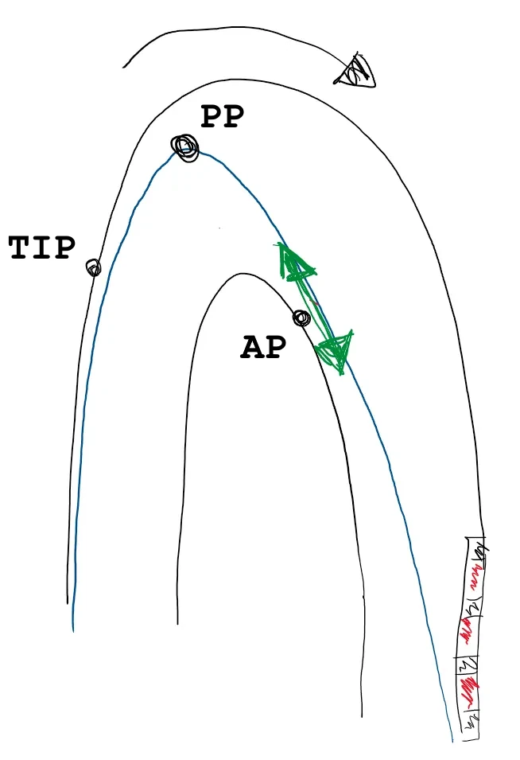

You're arriving from the left side of the diagram, throttle closed, braking completed. You've taken your fingers off the brake lever. The bike is 1/3 inch from the white line, upright **and** parallel to it.
**Watch out**, it's important to arrive at the TIP while hugging the white line. In other words, you don't arrive at the TIP on a diagonal: front wheel on the cone but rear wheel in the middle of the track, for example (I'm exaggerating of course). For instance, if you're exiting a left-hand turn and approaching a right-hand turn, you cross the track and reach the white line well BEFORE the TIP. Then you hug the white line to arrive at the TIP parallel to it (both wheels are 1/3 inch from the white line).

You're going to enter what's called the neutral phase (no brakes, no throttle).

You're already looking at the AP you want to reach. Yes, I confirm. The bike is going in one direction and you're looking in another.

Because the AP is far away, you make the effort to stay wide and not cut toward the inside curb. It feels reassuring to hug the inside of the turn, but **it's a mistake** that everyone makes at the beginning.

You tip the bike in. You reach the **P**ivot **P**oint (PP). There, you make the bike turn. This happens by consciously (or not) pushing on the inside handlebar. This is where you have the most lean angle (and where one day you'll drag a knee). Nothing bad can happen because you're not braking and you're not on the throttle either.

You're still off the throttle. The bike is pivoting, be patient, be patient... This is very hard at first, because since you don't have enough speed, you'll tend to want to open the throttle too early. No, no, you wait, you let the bike turn.

When the bike has pivoted enough, you're away from the curb and your wheels are pointed in the direction that connects the AP to the EP. **That's THE key thing.**

When the wheels are properly aligned, you stop pivoting the bike and just before the AP you start to open the throttle. You're leaving the neutral phase. At first, the acceleration should be imperceptible. You should barely feel the bike's nose lifting.

However, once you've started rolling on the throttle, you don't stop. **No steady-state throttle!** I repeat, **no steady-state throttle**. At first you roll on gently, then faster and faster as the bike stands up.

{: .note-title }
> **Suggestion:**
>
> From now on, here’s what I propose:
>
> * When you hear an instructor or a rider say "steady-state throttle"
> * You should interpret it as: "I’m starting to roll on the throttle".

Don't forget, you should only "touch" the curb once, at the AP.

At the AP you're looking at the EP, that's your next target.

At the AP you have throttle applied. The bike has less lean than at the PP. Later on, at the AP you won't have a knee down and you'll already be on heavy throttle.

The **really important** thing, the mental image you need to keep...
If you freeze time when the bike is at the AP, stand it upright on both wheels and go full throttle nothing bad should happen. The wheels should be pointed toward the EP, not toward the gravel trap. So, if that's indeed the case, what's going to happen? The bike will just rocket out of the corner safely in the direction of the EP. Look at the direction of the green arrow in the diagram.
On the other hand, if at the AP the wheels aren't properly aligned (meaning the bike hasn't finished turning) and you go 100% throttle, you're heading straight into the gravel.

Re-read this paragraph several times if needed. It's important that you keep this mental image: at the apex point AP you're already **rolling on** the throttle, the bike's wheels are pointed in the right **direction** **AND** they pass **1/3 inch** from it.

You pass the AP, you pull on the inside handlebar to keep standing the bike up (you can also "push" the bike away with your arms, it amounts to the same thing). Since you're not at 100% throttle at the AP, you keep rolling on. The bike becomes more and more upright.

It's the acceleration that pushes the bike toward the outside. You pass 1/3 inch from the EP, full gas. The bike can still be slightly leaned at the exit of certain corners.

Don't try to do everything all at once. Here too, pick your battles. Choose 2 corners that are fairly spread out ideally one right-hander and one left-hander, where you feel comfortable, and try to connect the 3 cones. If for now there's only one corner where you feel ready to give it a go, go ahead, work on that corner. On the other sections of the track you can either relax or work on the other points from this morning. But let's not kid ourselves, eventually you'll need to connect the 3 cones in every corner.

**Goal at the end of the session**

* There's at least one corner where you chain TIP, PP, AP, EP and exit much faster than this morning.
* At the AP your wheels are pointed toward the EP **and** are 1/3 inch from the line.
* At the AP it's the wheels that pass 1/3 inch from the line, not the top of your body (your body is above the curb or the grass).

**Notes**

* Did you remember to check your tire pressures before going back out this afternoon?
The temperature has changed since this morning, so the tire pressures have changed too.

* What matters is your exit speed, **not** your entry speed into the corner.
It's better to enter "slowly" and be 100% throttle on exit than to scare yourself under braking, miss the AP, and take forever before you can accelerate.

* I already said it, what matters is your speed at the end of the straight that follows the corner.
That speed depends solely on your ability to be 100% throttle as early as possible, in other words, to not miss the AP. Everything else is poetry and bar talk.

* Missing the AP means "passing your wheels 1 meter away" **or** "not having your wheels pointed in the right direction." To nail an AP you need your wheels to pass at 1/3 inch **and** in the right direction (toward the EP).
Both conditions need to be met, and that's why it's easier to miss an AP than to nail one.

* Of all the reference points we've discussed, the AP is the most important.
It's the same for all riders regardless of their level. It will never change, it depends on the corner, not on the rider. The others, TIP, PP, and EP will evolve with your level. For example, the faster you enter a corner, the earlier your TIP will be. That said, for today, make the effort to use the full width of the track and respect the cones. Really go get the TIP on the outside at the entry and really go get the EP on the outside at the exit. This will "open up" the corner for you and, more importantly, allow your brain to grasp the full width of the track. Later you'll learn that in such-and-such a corner you need to enter at 3/4 track width, or that in another one you need to exit at mid-track. But we're not there yet. For now we're in "textbook" mode we'll fine-tune later.

* *Why do you insist so much on arriving at the TIP while hugging the white line?*
Let's use the figure below, in which you're arriving from the bottom. You've exited a right-hand turn that was followed by a short straight. So at the exit of the first corner you were on the far left of the track, and now you need to negotiate the next corner, which turns left.

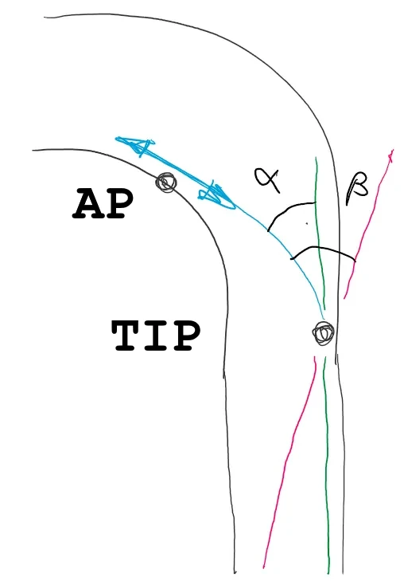

OK, is it clearer with this beautiful figure? Good... Actually, it's an efficiency problem. We are slow, very slow, when tipping the bike in. So we want to make things as easy on ourselves as possible.

1. **Case 1:** The red line. You exit the previous corner, you're on the left side of the track, you accelerate and take your time. At some point you realize you need to get to the right side of the track for the upcoming left-hander coming at you fast. You're late, you aim for the cone (the black dot), and you arrive with the bike aligned along the red line. As a result, to inscribe the bike into the turn, you have to turn it through an angle $$\beta$$. That's the angle between the red line and the blue curve.
1. **Case 2:** The green line. You exit the previous corner, you're on the left side of the track, you accelerate and get your butt moving to the right side of the track quickly. You arrive at the cone with the bike aligned along the green line. Both wheels are 1/3 inch from the white line. To inscribe the bike into the turn, you need to turn it through an angle $$\alpha$$. That's the angle between the green line and the blue curve.

Since we're still just as slow, our tip-in speed hasn't changed. In your opinion, in which case do you tip the bike in faster? Right, so you know what you have to do... To make your life easier, get in the habit of **hugging the white line well before the TIP.**

* *Why isn't the pivot point (PP) the same as the turn-in point (TIP)?*
Actually, the TIP corresponds to the moment you start leaning the bike, while the PP is really the moment you make the bike turn. The tighter the corner, the more distinct the TIP and PP will be. Like the BP (braking point), the PP depends on the rider, on how they feel, etc.

* *Yeah but in corners that aren't hairpins but rather wide-radius turns, after the TIP I need to get back on the gas a bit because otherwise the bike comes to a near stop and/or "falls" toward the apex.*
Welcome to the club! The thing is, we're not suicidal, so we brake, we brake too much, and after tipping the bike in, we don't have enough momentum to get past the PP. On the next lap, change only one thing at a time (this is important if you want to be able to figure out what works, or doesn't, for you). For example, you could try this:
    * Brake the same way but a little later. When I say "a little later," I mean the equivalent of 1 or 2 bike lengths, not 25 meters. Don't put yourself in panic mode under braking when we're trying to work on corner trajectory.
    * Make sure you do **NOT** cut to the apex too early. If the corner has a large radius, it can be very tempting. You need to pass the TIP, lean the bike, but then "take your time" sinking into the corner before pivoting the bike "when you feel it." Seen from above, your line should look like a "V" (especially if you have a big-bore bike).
    * If you have a 1000, try downshifting one fewer gear when you brake. You'll have less engine braking and a higher entry speed. You'll exit the corner on the engine's torque.

* *It's weird, I'm not scared, everything feels fine, but I always pass 1 meter from the AP.*
It's probably because your tip-in or your pivot is **way too slow**. You can try the following:
    * Don't change anything, but make sure you're looking at the AP with **your chin**. Don't look at the scene, designate your target. Sure, you know there are cones, a corner, a guy ahead of you, etc. You have that information in your head, but it falls outside your field of vision because you're designating your target with **your chin**. I say chin to force you to turn your head **and** your shoulders toward the AP.
    * Make the effort to open your shoulders, to orient them toward the inside of the turn. You can perfectly well turn your head toward the AP, point your chin at it **but** keep your shoulders parallel to the handlebars. That's **NOT** what we want here. You need to point your chin at your target **and**, somewhat like Robocop, your shoulders rotate with your head. You need to feel your inside arm bending and the outside arm extending.
    * Brake a bit earlier and do your tip-in as usual but slightly before the TIP. When I say "slightly" I mean the equivalent of 1 or 2 bike lengths. Then on the next lap you adjust, but fundamentally your tip-in is too slow.
    * Don't change anything but be more incisive, faster when you pivot the bike. For that, all you need to do (easier said than done) is push harder on the inside handlebar. You can also try putting a bit more weight on the inside peg by leaning toward the **inside of the turn**, consciously pressing down on it with your foot.

* *I don't know what's happening, my tires hit the apex but at the corner exit I always end up in the middle of the track, never at the EP.*
That's because you're not accelerating hard enough. It's the acceleration that pushes the bike toward the outside. To give you an idea, put your bike on its sidestand. Go behind the bike. At that lean angle, you can easily have all the power to the rear wheel. I didn't say be at the throttle **stop** and wait for the cavalry. No, I said be at the throttle **stop** **and** have all the ponies at the tire. Anyway, you can try 2 or 3 things:
    * Are you sure you're aiming at the EP and not at some point 3/4 of the way across the track? The bike goes where you look.
    * Are you sure you never stop opening the throttle?
    * Roll on the throttle cable at the same speed as before but start accelerating earlier. You'll spend less time with neither brakes nor throttle. You'll reduce the neutral phase. That's good, that's what we want.
    * Start rolling on the throttle cable as before but roll it on faster and faster, and make sure you reach the stop. At first, you'll transfer the load to the rear. The bike will imperceptibly lift its nose, settling into its ideal position with 40% weight on the front and 60% on the rear. Once that's set and the bike is loaded, you can roll on faster and faster while standing the bike up. Yes, you could say we accelerate in 2 phases:
        1. I settle the bike
        1. Big handful

### 5. Braking

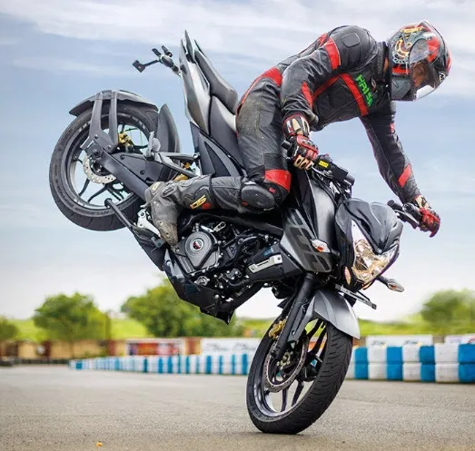

We could have swapped the content of sessions 4 and 5, but in the end we chose this order because it lets us state and explain the purpose of session 5.

During the previous session, lap after lap, you can't do the same thing in the same corner. It's frustrating. You lack consistency.

What's happening is that the braking isn't the same on each lap. One time you brake too much, the next lap you don't brake enough... So the speed at the TIP is never the same, the speed entering the neutral zone is never the same, and since the point where you start rolling on is now more or less fixed, you never arrive at the same spot on the curb: one lap before the AP, the next lap you're 1 meter from the AP... Yes, I confirm, it's maddening because it strongly impacts your top speed at the end of the straight (even though we're not talking about lap times yet).

What we're going to focus on in this session is "building" the braking phase to stop braking "by feel."

What you need to keep in mind is that the goal of braking is to set your corner entry speed as quickly as possible. Then, and this is the last bit of preamble, remember that you have just as much precision in the brakes as you do in the throttle. In one case you're controlling speed as it increases; in the other, you're controlling it as it decreases.

To illustrate how to build your braking, let's take the example of the end of the longest straight on the track. Here's the checklist I suggest you follow:

* 200 meters before the next TIP (in any case, earlier than what you've been doing)
* You're riding 1/3 inch from and parallel to the white line (I don't even know why I'm reminding you)
* You pop your torso up like a jack-in-the-box (makes sense, you were tucked on the tank, butt slid back, knees clamped around the tank)
* You extend your arms, you clamp your knees so your butt doesn't slide forward toward the tank
* You're still aiming at the TIP
* At the same instant, you chop the throttle, immediately downshift one gear, and bring the brake lever in so the pads start to bite the discs.
* A split second later, when the fork is compressed, the front tire is squished nicely, and the weight transfer is done, then you can start squeezing the brake lever **pro-gres-sive-ly** and very hard. No jerking. You squeeze harder and harder, that's all (it's not very glamorous, but think of wringing out a sponge). Nothing bad can happen. The bike is upright, the front tire's contact patch is wide, the fork isn't fully bottomed out, you can go for it, you have margin, no worries. Tell yourself you're squeezing so hard that the brake lever is going to end up touching the throttle grip.

Of course, if you need to downshift more, you keep doing it **as early as possible**, and when you release the clutch lever, you release it **gen-tly**.

Toward the end, you release the brake lever **gen-tly** until you're at the speed at which you feel capable of tipping the bike into the corner (TIP).

The first time, at the end of your braking, when you think you're at the right entry speed, you'll probably be very far from the TIP. But now, lap after lap, you just need to adjust your **B**raking **P**oint (BP). For that, you need to find a fixed reference point along the track: a paint mark, a tree... Avoid anything that might move: a shadow, a corner marshal, a parked car, a rock that turns out to be a turtle... Once you've found your BP, you stick with it, and you should always have the same speed at the TIP.

You gain nothing by barreling into a corner, but there are big gains to be made by being consistent. What matters is exit speed, **NOT** entry speed.

Well, all that's left is to do the same with every other corner on the track... A lifetime, I'm telling you, you can spend a lifetime on this...

**Goal at the end of the session**

* There's at least one corner where you're consistent with your braking.
* By braking in 3 phases (load the front, squeeze hard, release gently) you should be braking much shorter than this morning. Note that this can also be useful on the road.

**Notes**

* Have you identified the corner where you want to do the exercise first?
You need to find the most important corner. For that, look at the map, identify the longest straight, and refine the braking for the corner that precedes it. Same as always... By nailing your braking, you give yourself the means to exit faster, and therefore have a higher speed at the end of the following straight.

* *That's odd what you're saying, because I usually downshift at the very end of the braking zone.*
Yes, but no. It's fine when you're stopping at a red light, but on track you need to use everything at your disposal to slow the beast down. By downshifting very early you benefit from engine braking, and it's really important. Oh... no funny business, if you don't have a quickshifter on your bike, you give it a blip of throttle yourself every time you downshift.

* *I can't do it all, it's too complicated!*
OK, no problem, we adapt... Pick a corner where there's no downshifting needed. At the end of a short straight, for example. That way you can focus **only** on the brake lever and 3-phase braking.
1. The pads kiss the discs and the weight transfer happens.
1. Once that's in place, you squeeze the brake lever very hard and smoothly (think of the sponge).
1. At the end, you release the brake lever **gen-tly** to precisely adjust the speed at which you pass through the TIP and quickly tip the bike in. At that point you have no brakes and no throttle, you're in the neutral zone.

* Once that's in place, take a corner where you need to downshift 1 gear (not 2, just 1). That should be fine because you'll downshift right away. Don't be afraid of downshifting too early. It's really "I chop the throttle, I downshift."
When that's sorted, you need to tackle a corner where you have to downshift multiple gears. At first, give yourself margin, move your BP back and be careful not to forget to brake just because you're concentrating on the gear changes. If things go sideways, don't pull the clutch in, brake and at the very end, pull the clutch lever to avoid stalling, then try again next lap.

Note that you can practice downshifting multiple gears right at the start of your braking zone on the road, in the weeks before you come.

* *If I brake hard, won't I end up with the rear wheel in the air and crash?*
That would be surprising. What's more likely is that you'll feel the rear wheel bouncing, doing its own thing, living its rebellious teenage life, etc. In that case, decouple the engine from the rear wheel by pulling the clutch lever 1 mm (no more). There won't be any engine braking anymore, the bike will feel like it's lunging forward but... the rear wheel will snap back in line instantly. I don't have a precise number in mind but we're talking about a tenth of a second. So, very quickly, you'll release the clutch and get engine braking back.
By the way, in your opinion, why does this happen?
Bingo! Because you released the clutch too quickly after downshifting.
Regarding the rear wheel lifting, if it does happen, slightly ease off the brake lever (easier to write than to live through, I know). Most importantly, ask yourself whether you didn't jerk the brake lever and whether you're not too far forward, pubic bone glued to the tank (by the way — can you confirm you're clamping the tank with your knees? That should prevent you from ending up pressed against the tank).

* *And what if I mess up and arrive way too fast into the corner? What do I do?*
OK, you're going to have to take my word for it. Trust in me, just in me... Release the brakes, turn your chin and shoulders hard toward the AP and lean everything. It'll work.
What's for sure is that if you add brake while leaned over, the bike will stand up. If it's still only slightly leaned and you add brake, you won't be able to add lean (or you'll crash. Brake pressure and lean angle are inversely proportional). What's the alternative? There's no other choice. You turn your head toward the apex, release the brakes, and commit to the corner with whatever speed you have. Yes, I know, it's easier to write than to live through, but that's reality.

* *How do I know I'm starting to reach the limits?*
To maximize braking you need to benefit from both engine braking on the rear wheel and front brakes on the front wheel. When the rear wheel starts to lift, you're at the max. Next lap, try sliding back on the seat and using your knees around the tank so you don't slide forward.
In my opinion, what's more likely to happen is that your brakes will start fading and the lever will feel spongy. Other possibility: the front fork, which has never been serviced and whose springs aren't meant for track use, bottoms out, which seriously limits what you can do under braking.

* *Why do you always say **gen-tly**?*
Once again, if there were no rider on the bike, the bike would behave much more sanely, less violently, less erratically. If the rider falls off and the bike stays on its wheels, it'll just keep going straight. When it hits the curbs and goes into the grass, it'll bounce, land on its wheels, and keep going. Leave a rider on it, they'll grab the brakes and they'll both go down.
You need to be **pro-gres-sive** and go easy so you don't upset the bike. You release the clutch gently. You respect the first 2 phases of braking, let the front end dive, then squeeze the brakes **pro-gres-sive-ly**. You roll the throttle cable on **continuously** and faster and faster. The examples are endless...

### 6. Driving the corner

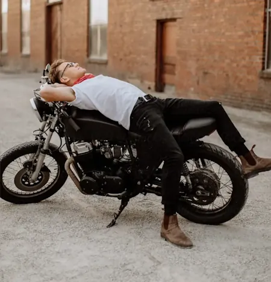

Showtime! By this point, you've put a lot of things in place:

* You know the track.
* You accelerate at full throttle.
* You tuck on the tank and you're getting used to having your head in a low position.
* Your braking gives you the same speed at the TIP every time.
* You know what you're trying to accomplish in the corner: exit as fast as possible by running your wheels over the TIP, AP, and EP. Coming from the PP, at the AP you're trying to pass your wheels at 1/3 inch cm **and** in the right direction.

That said, there are still a few "details" to sort out:

* After braking, your arms stay straight through the corner.
* Your torso stays upright and in line with the bike.
* Since you're getting faster and faster...
* You're leaning more and more. That's dangerous. You may have even scraped a peg already.

You can see we're hitting a limit here, a glass ceiling, because you can't go further than the peg. So we're going to dedicate this session to improving what's called corner technique. The idea is to give ourselves the means to exit faster and faster while still, of course, running the wheels over the TIP, AP, and EP.

Physics dictates that if you want to go faster through a corner, you need to counterbalance the centrifugal force pushing the bike to the outside. To do that, you need to put more mass on the **inside of the turn**. The first instinct was to lean the bike, but you quickly hit the limits of that approach.

In order to start rolling on the throttle earlier to exit faster (that's our only goal), we have no choice but to "lean" the rider to the inside of the turn and keep the bike more upright.

This might be a bit frustrating, but due to time constraints, we're only going to do half of the exercise here, focusing ONLY on the upper body. So no, this is not when you're going to drag a knee.

Here's what I suggest you do in a corner where you feel comfortable:

* *Same as before:* You finish your braking at the TIP while clamping the tank with your knees and staying seated toward the back. Your wheels are 1/3 inch from and parallel to the white line as you arrive at the TIP. When you release the brake lever, grip shift around the throttle.
* *Same as before:* You tip the bike in quickly by pushing the inside handlebar. You're in the neutral zone: no brakes, no throttle.
* *Same as before:* Your chin points at the AP and your shoulders rotate toward the inside of the turn.
* **New:** Instead of staying with arms straight, torso upright and in line with the bike, you're going to lower your torso toward the **inside of the turn** while **exhaling** hard into your helmet.
No, you're not going toward the tank, you're going to the side of the tank, toward the AP that your chin, head, and shoulders are pointing at. Your inside arm bends (it's totally "limp," relaxed, loose) while your outside arm extends and **rests** on the tank (on a naked bike the arm is extended but hovers 2 inches above the tank). Your shoulders open toward the inside of the turn. When you lower your torso, remember to exhale to become "all limp." You need to "deflate."
* **New:** At the same time, act as though you're pushing the bike away to keep it upright while you do everything to put as much of your body as possible on the **inside of the turn**. You **push** the bike away with your arms. You should end up with your "chin at the handlebar" and your helmet level with the mirror.
    * Don't hesitate to **hook** onto the bike with your outside knee on the side of the tank. And no, you don't need to hang on to the handlebars once the bike is leaned over.
    * If your butt is still centered on the seat, your spine and the bike's centerline form a V.
* *Same as before:* No steady-state throttle. When you start rolling on the cable, it's imperceptible at first, but most importantly you never stop. You roll on faster and faster as you stand the bike up approaching the AP.

<figure style="max-width: 450px; margin: auto; text-align: center;">
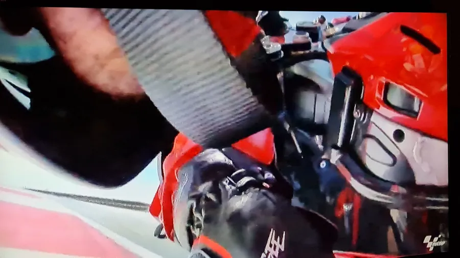
<figcaption>Chin at the handlebar</figcaption>
</figure>

The important thing while driving the corner is to put as much of the rider's weight on the **inside of the turn** as possible and push the bike away to keep it upright. Yes, of course it'll lean, but you get the idea.

Note that I didn't say to put the rider "down". I said "to the inside," meaning as far away from the bike as possible. That's why we say "chin at the handlebar" and "helmet in the mirror."

You should feel that it's your body that "goes" to the **inside of the turn** while you "push" the bike away with your arms to keep it as upright as possible. Opening your shoulders also helps you end up with one arm extended and the other bent. Do this in the paddock or in your garage before you come.

From now on, at the same speed, the bike leans less. You're safer. You can afford to start rolling on the throttle earlier and harder. You can do it because the bike is more upright than before, the rear tire's contact patch on the ground is wider. So you exit the corner faster and you increase your top speed at the end of the following straight. That's the only thing that matters. Period.

**Goal at the end of the session**

* In at least one corner your torso is forward and to the **inside of the turn**. Your head is offset, on the side of the bike, the inside arm is bent, you have your chin at the handlebar, and the other arm is extended on the tank, shoulders open toward the inside of the turn.
* You should feel that the entire corner resembles the following sequence:
  + You brake while aiming at the TIP, wheels parallel and 1/3 inch from the line.
  + At the TIP, you snap the bike onto its lean quickly, pushing the inside handlebar while looking at the AP.
  + Neutral phase. No brakes, no throttle. Good entry speed. Be patient, be patient, be patient.
  + No steady-state throttle. After the PP and before the AP you start rolling on the throttle cable. Imperceptible at first. You roll on faster and faster. Ideally you're 100% throttle at the AP, you pull the inside handlebar, and you point your chin at the EP.
  + Summary of the summary: brake, snap, wait, gas. Too easy, I say... ✊
* When you think your body position looks completely ridiculous, that's when you're starting to look like a real rider.

**Notes**

* *I can't bend the inside arm. I'm tense and feel like I'm forcing it.*
I confirm you are forcing it. You need to convince yourself that once the bike is leaned over, you could do this without touching the handlebars. Think of those guys in the photos who are at full lean waving at the camera.
You can try the following:
  + Start with a left-hand turn, it's generally easier because you can "forget" the throttle grip.
  + When the bike tips in, try to feel that you're moving your torso with your abs and **only your abs**. The idea is to avoid pushing on the handlebars to shift your upper body. Yes, you're going to need to do planks at home.
  + As the bike tips in, release the inside grip and rotate your hand a quarter turn forward around the grip. This will unlock your wrist and "naturally" align your forearm with the clip-on/handlebar. Don't be surprised if you end up holding the bar like a screwdriver. That's normal. That's what we want.
  + Let the arm bend as you rotate your hand and your torso gets closer.
  + Remember to "deflate" by exhaling hard into your helmet.
  + Make sure your shoulders are oriented toward the inside of the turn. They rotate with your chin. They should not be parallel to the triple clamp.
  + In a left-hand turn, by the end you should feel like you could scratch your right ear with your left hand (and vice versa in a right-hander). Basically, exaggerate the position like crazy.

* *Ugh... I really don't like this feeling of having my head hanging in the void, or this point of view.*
Sorry... You're going to have to get used to having your head over the grass and the curbs. You need to eat some miles, but it comes fast... Your brain just needs to adjust. Important: Lift your eyes, point at your next target — it really helps.

* Do you remember session 3 this morning? [Getting down on the bike](#3-getting-down-on-the-bike). At one point I said "If you're tired of lowering your torso... then don't raise it anymore..." Well, now you can actually do that. For example, exiting a corner at the EP, you're still head to the side, one arm bent, one arm extended. When you get back in line, keep your head low with the front of the helmet touching the tank. In fact, from now on you only need to raise your head DURING braking. There you go, you've become a rider!

* You should take the opportunity, while staying within your 75%, to start accelerating earlier. Yes, you stay in your 75% zone, but **think** for 2 minutes. If the bike is more upright and if it's going through at the same speed (wait, you haven't put blue tape over your speedometer yet and you can still read your speed?), you can afford to start rolling on the throttle cable earlier. There's no risk. The tire's contact patch is wider than before. So do it, because by accelerating earlier you'll accelerate longer, which increases your top speed at the end of the following straight (always the same goal).

* You should also take the opportunity, while staying within your 75%, to start increasing your corner entry speed. That's harder, but if you think about it, it's the mirror image of the previous point... Let me explain.
If at constant entry speed, by putting the rider's weight on the **inside of the turn** you keep the bike more upright than before, that means you have more grip. Therefore, if you want the same grip at entry as before, you can afford to enter faster.
However, it's difficult. We all have a sense of the speed at which "oh crap, this isn't going to work." So either we brake too much or our tip-in takes forever.
I think you should, in order, increase the speed of your tip-in **then** increase your entry speed.
  + Regarding tip-in speed, this is an exercise you do in riding courses where you do a gymkhana through cones and have to quickly switch from one side to the other (ideally with a knee on the ground). Plus you're filmed and you get thoroughly embarrassed during the debrief (actually, we all have a good laugh because nobody's great at this exercise).
  On a track day you need to pick 2 corners on opposite sides of the circuit and feel yourself pushing the inside handlebar. That's what lets you "snap" the bike onto its lean. Sure, you can press on the pegs, but the tip-in will be slow. To tip in quickly, you need to countersteer and push the inside handlebar.
  Do the test on the road, on a straight, at 55 mph, let go of the bars and push the left grip with your index finger. What happens? Now imagine a corner where you push with the palm of your left hand. As long as you push, the bike leans. The harder you push, the faster it leans. You need to experiment, you need to accumulate reps... A lifetime, I'm telling you...
  + Once your tip-in is faster, you can gradually increase your corner entry speed. Progressive. Here again, the brain and body need to adjust. In riding courses there's an exercise called "no brakes, no gearbox" where you do laps without being allowed to shift gears or touch the brakes. You modulate speed only with the throttle and you manage however you want, but you enter the corner at whatever speed you've got at that moment... Join up, they said, join up.
  On a track day there aren't 36 solutions. Change only one thing at a time. For example, keep your BPs and TIPs but brake less hard. Or move your BP up by 1 or 2 bike lengths and keep your TIP and your braking style. At our level, make absolutely sure your fingers are off the brake lever when you tip in.

* *You said we've only done half the exercise. What do I do now if I want to go further?*
If you're asking, it means you're snapping the bike onto its lean and you have a good corner entry speed. We agree? OK, well if that's indeed the case, to go even faster through the corner you need to **add more weight to the inside of the turn**. The idea now is to slide the entire rider on the seat toward the **inside of the turn**. Everything we said before still applies, but now the rider is trying to park their butt crack in the corner of the seat. Then they'll add even more mass by placing their inside foot at the tip of the peg. They'll use it as a ball joint when they open their knee. Here, it's not "we need more teeth", it's "we need more weight on the inside."

But hey, "before you can run, you have to walk." Putting all of this together in a single session, when it also affects braking, seemed a bit "touchy" to us. Since the rider is a beginner, we chose to focus on the upper body first. Once that's in place, once they're snapping the bike over and have sufficient entry speed, later they can "easily" add the lower body. You adapt your position to go faster — not the other way around.

### 7. The seventh session

It's the session nobody expected. So it's pure bonus, pure happiness.

You know what? Forget everything we talked about and just go ride. No pressure, you don't even have a lap timer to measure anything. Don't try to stay at 75%, 50%, or 100%. Who cares, you've done the job, you've got nothing left to prove today.

Clear your head, get on your bike, and reel off the laps just for fun, staying cool and smooth.

**Goal at the end of the session**

* Be surprised that the session is already over.

**Notes**

* If you're truly wiped out, skip the last session.
That said, **think about it**. Are you really dead tired, or are you just too lazy to put your sweaty helmet back on? Usually there are fewer riders in the last session. That means more space, more peace of mind, it frees up your head. You need to seize an opportunity when it presents itself. It's like taking the last snowboard run when everyone else has already headed in. "In tartiflette we trust", go ahead, enjoy!

* If your buddies suggest riding together "for the last one," say no.
Let them go ahead. You don't know what kind of "freshness" they're in. As the old saying goes: "If it smells like the last race, it smells like trouble."

## And now, what should I do?

**Warning.** Because we don't mess around with safety, as soon as you come out of the last session you go straight to re-inflate your tires to their "road" pressure.

Now there are two possible scenarios:

1. Either you didn't enjoy the day, you scared yourself, you're not comfortable with people passing you, you're not having fun... That's OK. There are plenty of ways to enjoy motorcycling. However, you might want to try an on-road driving course and if possible do a 2-day course. Yes, it's not free and you might have to sell one of your children, but these courses should be reimbursed by insurance companies (I'm dead serious about this one).
It's nothing like the track, but you and the bike are going to do things you didn't think possible, you'll understand a lot, and above all, you'll gain confidence, a lot of confidence.

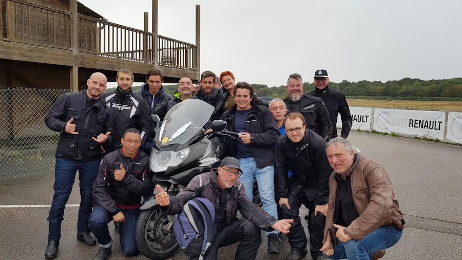

Once that's done, give the track another chance and/or do a day course dedicated to Novices (that's the level before Beginner). The La Ferté Gaucher circuit organizes these kinds of days, but I'm sure they exist elsewhere too. It's great because there are even fewer riders per session (half as many as a typical track day where you have one bike per 100 meters of circuit), everyone is at the same level, it's supervised, there are classroom sessions, debriefs, etc.

2. In the second case, if you're grinning ear to ear even though you're exhausted and you know you still have 12,000 things to learn... Welcome. I just have 3 recommendations:
    * Your bike is way better than you are. So, for now, keep riding it as-is. Don't spend any money. Maintain it properly (tires, front brake pads, brake fluid, fork oil change, fork seals, standard engine maintenance...) and don't go dropping €1,500 on an exhaust. That's dumb.
    * On the other hand, if you truly intend to do more track days, buy a GPS lap timer (don't use your phone or at least stash it under the seat). Say what you will, "the stopwatch doesn't lie." You can tell yourself whatever story you want, make whatever excuses you want... Either you're going faster, or you're less efficient. Period. Plus, the lap timer can be used on other bikes later on.
    * Sign up for a 1- or 2-day riding course soon. It's a serious investment (around €600 just for the 2-day course), but it's structured, professional, etc. It's a budget, but it'll gain you way more seconds per lap than any carbon accessory, rearset, or Mithril exhaust pipe. It's like learning snowboarding on your own versus going through ski school. There's no comparison. **Watch out**, you'll need to show up at the course in shape (abs, thighs) and well-rested, because the pace is intense. It's not a Marine boot camp, but you have to commit, not waste time between sessions, and hold on to the end (physically and mentally). <!-- Exemple avec mon tout premier stage avec DRRS en 2019 (NOT YET TRANSFERED) -->

Remember to check out the photos from the day. Either they're already viewable at the track, or you'll get them online next week. Buy the least awful one and set it aside. We'll talk about it again next year or in 2 years 😊.

Back home, pull out the track map and the day's schedule. Take 15 to 20 minutes to add your notes. Go ahead, let it all out — write everything down. Your feelings, your impressions, the things you don't understand yet, the gear ratios, the questions you want to ask, this or that difficulty... You'll use it as a cheat sheet or a TO DO list the next time you come to this track. Make sure you'll be able to read and understand your notes a year from now or at the next track day. Don't write a novel, but be clear — and don't lose the note sheet in the meantime.

Alright, to be continued in the next installment, and in the meantime re-read the [Motorcycle Riding Notes]() or do some squats to prepare for future track days.

<figure style="max-width: 560px; margin: auto;">

    <iframe
    src="https://www.youtube.com/embed/xqvCmoLULNY"
    title="Exercise Tutorial - Squat"
    style="position: absolute; inset: 0; width: 100%; height: 100%;"
    allowfullscreen>
    </iframe>

<figcaption style="text-align: center;">
    Exercise Tutorial - Squat
</figcaption>
</figure>

