# Première fois sur circuit

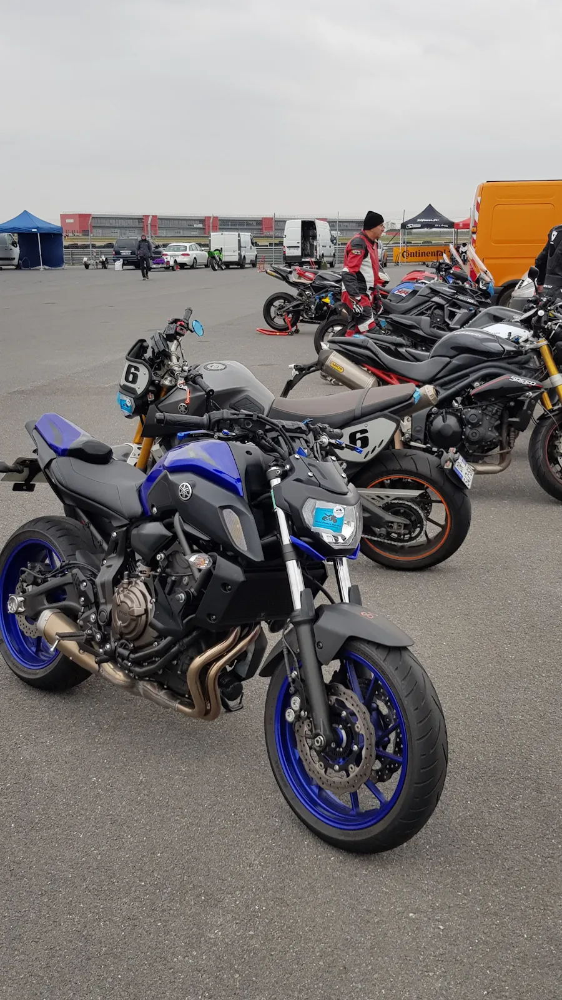

## Introduction

J'ai eu l'occasion de discuter l'autre jour avec une motarde qui n'avait jamais mis les pieds sur un circuit et qui avait une furieuse envie de le faire. Alors oui, il y a les [Notes de Pilotage Moto]() mais idéalement, elle aurait souhaité quelque chose de plus court, de moins complet, un truc actionnable par quelqu'un qui découvre tout et qui l'aide à tirer le meilleur de sa première fois sur circuit. Bref, idéalement, un planning qu'elle pourrait imprimer sur une feuille A4 et garder à portée de main lors de la journée de roulage.

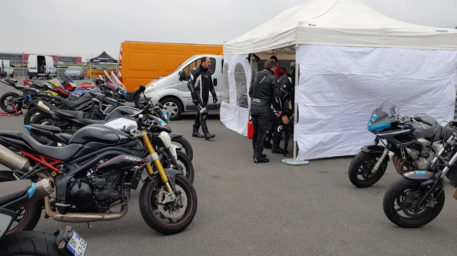

Je ne vais pas parler ici de la logistique ni de l'équipement. Je vais imaginer que le motard arrive sur le circuit par la route avec sa propre moto. Je vais me concentrer uniquement sur le pilotage et éviter de raconter trop de bêtises. À ce propos, si tu n'es pas d'accord avec ce que je dis ou si tu as des compléments d'information à partager, fais-le via les commentaires. Ils sont les bienvenus. Idem, si tu as des questions auxquelles je ne réponds pas. Un seul truc, restes courtois et constructif.

Pour le reste, lors de la journée, il y aura le brief sécurité le matin mais si vraiment tu penses qu'il y a besoin d'un billet particulier sur la logistique et l'organisation dis le moi dans les commentaires. Sinon, tu peux regarder cette série de vidéos sur [YouTube](https://youtu.be/aPERgBZrk4c)

Dans ce billet il y aura :

* [Le planning en mode synthétique](#le-planning-synthétique) : ça donne une idée du programme.
* [Le planning en mode action](#le-planning-en-mode-action) : c'est la partie à imprimer et à garder à portée de main le jour du roulage.
* [Le planning en mode détaillé](#le-planning-en-mode-détaillé) : à lire avant d'aller sur le circuit et à relire sur son téléphone le midi de la journée de roulage. C'est dans cette partie que je prends du temps pour expliquer le contenu des différentes sessions.

## Le planning synthétique

Lors de notre discussion nous avons décidé de nous caler sur l'agenda d'une journée de roulage type qui est divisée en 6 sessions de 20 minutes chacune. Si jamais la journée comporte une septième session on ne va pas se plaindre, ce sera du plus en plus. On s'est mis aussi d'accord sur le fait qu'elle viendra sur le circuit avec une copie papier du planning et du plan de la piste, un crayon à papier et une gomme.

Du point de vue de la journée, afin de découvrir un maximum de choses, on a aussi pris le parti de passer d'une session à la suivante même si la session précédente n'a pas été entièrement couronnée de succès. L'idée c'est, par exemple, d'éviter de passer les 3/4 de la journée à apprendre le circuit alors qu'on pourra continuer à le faire dans les sessions suivantes. Il y a tellement de choses à découvrir d'ici ce soir !

Bon alors ton planning, ça vient ? Voili, voilà ce sur quoi on est tombé d'accord :

1. [Reconnaissance de la piste](#1-reconnaissance-de-la-piste)
1. [Accélération dans les lignes droites](#2-accélération-dans-les-lignes-droites)
1. [Se coucher sur la moto](#3-se-coucher-sur-la-moto)
1. [Point de corde et trajectoire](#4-point-de-corde-et-trajectoire)
1. [Freinage](#5-freinage)
1. [Conduite du virage](#6-conduite-du-virage)
1. [La septième session](#7-la-septième-session)

## Le planning en mode action

Il suffit de récupérer le .pdf ci-dessous et de l'imprimer. C'est écrit en mode sms. Pour le comprendre il faut lire la section suivante.

[Agenda de la Journee de Roulage](assets/agenda_roulage.pdf)
                                          

## Le planning en mode détaillé

### 1. Reconnaissance de la piste

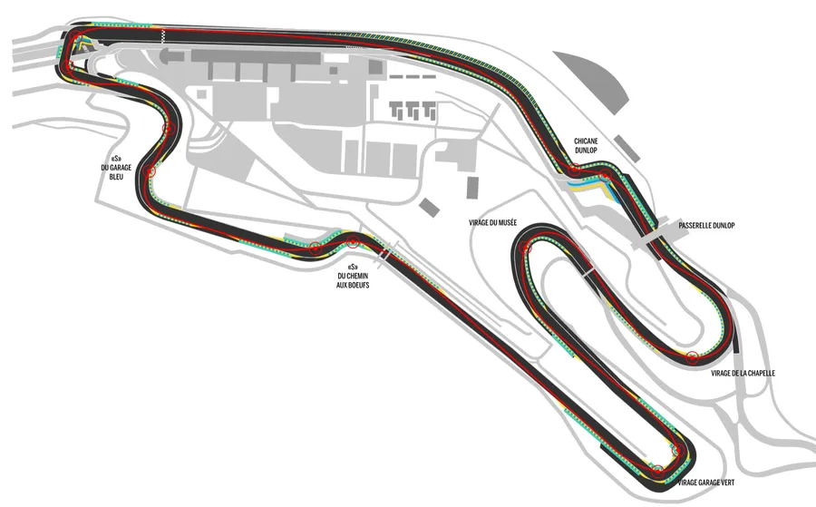

Dans cette session comme dans les autres... Aucune pression. Tu roules à 75% de tes capacités. Tu es donc très à l'aise et décontracté sur la moto. Ne t'occupe pas de ta position ou de quoique ce soit. Pendant 20 minutes tu roules à un rythme soutenu (on ne va pas chercher le pain) et tu apprends le circuit. À aucun moment tu ne te mets dans le rouge ou en mode panique. Par exemple, au bout de quelques tours tu vas certainement freiner plus fort que sur route mais tu feras l'effort de rester loin de tes limites. Dans cette session il faut que tu gardes toute ta lucidité pour mémoriser le circuit. Et si tu te fais doubler... Rien à faire, laisse-les partir, on en reparlera en fin de journée... 😏

Deux choses à respecter cependant:

1. Tu conduis dorénavant avec la partie la plus large de tes pieds sur les repose-pieds. C'est la partie qui se trouve juste après les orteils. Tu n'es donc pas sur le bout des orteils et tu ne cale pas non plus ton talon sur les cale-pieds. Tu peux t'habituer à cette position de pieds, sur route, la semaine avant de venir.
2. Tu arrives en étant à droite de la piste si le prochain virage tourne à gauche et à gauche de la piste si le prochain virage tourne à droite. C'est tout et c'est déjà pas mal car quand je dis à droite par exemple, cela veut dire que tes roues sont à 1 cm de la bande blanche. Pas 1 mètre, pas 25 cm, non, non il faut que tu colles la ligne. Oui bien sûr si c'est 5 cm je ne vais pas te faire un procès. Sérieux, il faut que tu apprennes à le faire maintenant alors que tu n'as pas de vitesse. Il faut que tu prennes l'habitude de voir la bande blanche très proche de tes pneus (et non, tu ne vas pas te sortir).

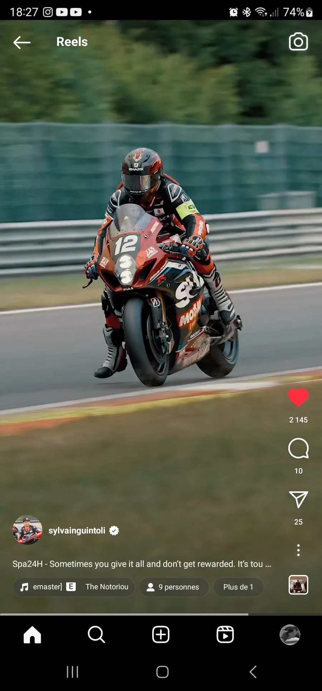

Prends le temps de passer par la voie des stands pendant la session. Tu repères la sortie lors d'un tour. Au tour suivant, un peu avant la sortie, tu lèves une main pour prévenir, tu évites de rouler à 2 à l'heure et tu sors sans avoir regardé derrière toi. Là, tu auras le choix de retourner sur l'aire plane ou en piste. Bien sûr tu retournes en piste quand le gars qui garde la pit lane t'y autorisera.

**Attention**, et c'est d'ailleurs pour ça qu'on effectue cet exercice. Quand tu t'insères sur le circuit, les autres sont déjà lancés. Donc, tu jettes ton œil (tu tournes franchement la tête et/ou tu lèves tes fesses de la moto et tu te retournes) et si c'est clair, tu accélères franchement. Ensuite, tu colles la ligne à l'extérieur du prochain virage. Tu fais attention, tu restes large dans le tout premier virage. Ensuite c'est bon, c'est reparti. Ceux qui sont derrière doivent prendre soin de toi (c'est comme au ski en fait).

Le fait de sortir peut-être très utile si tu te retrouves dans un paquet et que tu n'es pas à l'aise. Le mieux dans ce cas-là c'est de passer par les stands puis de rentrer tout de suite après afin de se retrouver seul, tranquille et safe. En effet, il ne faut pas suivre les autres de trop près, surtout en "Débutants" car tout peut arriver : rater une vitesse, changement de trajectoire inopiné, attaque de Martiens... Même chose si tu sens que tu manques de concentration... Tu sors, tu respires et tu repars. Cependant, si en fin de session tu es fatigué, tu sors. Il n'y a pas de honte à sortir un ou deux tours avant la fin d'une session.

**Objectif à la fin de la session**

* Tu dois être capable de "réciter" le circuit à voix haute et de le "voir" dans ta tête.
* Tu es sorti puis rentré sur la piste au moins une fois pour voir comment cela se passe.

**Remarques**

* Tu es sûr d'avoir baissé la pression de tes pneus ?  
Si tu ne sais pas quelles pressions utiliser, tu mets 1.9 kg à l'AR et 2.1 à l'AV. Je ne suis pas sensé parler d'autre chose que de pilotage mais bon, là, ça peut jouer sur le pilotage. S'il y a un mécanicien et/ou un panneau avec la liste des pneus et les pressions va les voir.

* Si jamais un marshal vous accompagne sur cette première session, tu te débrouille pour être le premier à le suivre.  
C'est un peu comme à l'école de ski. Derrière le moniteur, le dernier de la file n'a pas du tout la trajectoire du premier et il n'apprend pas grand-chose.

* Est-ce que tu as mal aux mains en fin de session ?  
Si oui, cela veut dire que tu es au-delà de tes 75%. Tu n'es pas en mode panique mais tu n'es pas serein et inconsciemment tu serres les poignées plus que nécessaire. Qu'est-ce que tu vas faire dans la prochaine session pour corriger le tir ?

* Est-ce que tu as mal au cou ou aux épaules en fin de session ? Même raison que précédemment. Relax, zen, cool...

* Est-ce que tu confirmes que tu n'as pas fait d'apnée pendant la session ?  
Si tu n'es pas sûr, lors de la prochaine session, fais l'effort de souffler dans ton casque dans les lignes droite (et les grandes courbes). Avec ton crayon, pose un rond sur le plan là où tu vas souffler lors de la prochaine session.

* Est-ce que tu sais sur quel rapport tu es dans les différentes sections du circuit ?  
Peux-tu mettre des +1 et des -1 sur le plan ? Si tu ne sais pas ce n'est pas grave. Lors de la prochaine session essaies d'en retenir 2 ou 3, puis encore 2 ou 3 à la session suivante. L'idée c'est de se libérer la tête et, par exemple, de retenir qu'en bout de ligne droite tu rentres 2 rapports (-2). C'est plus facile à gérer que de vérifier que tu es bien en 2 dans le virage après la ligne droite (à l'occasion, sur ton tableau de bord, met du scotch bleu à peinture sur tout sauf le compte tours. Ça évite d'être dérangé par des informations inutiles).

* Si un marshal organise des sessions en salle spécifiquement pour les Débutants tu y vas.  
C'est non négociable.  
Il y a toujours des choses à apprendre et à entendre de nouveau. C'est valable le restant de ta vie : dès qu'un marshal consacre du temps à ton groupe (Débutants, Intermédiaires...) tu y vas.

<!-- **Note de pilotage que tu peux lire :**

* [D](https://www.40tude.fr/pilotage-moto-01-decouverte-de-la-piste/)[é](https://www.40tude.fr/pilotage-moto-01-decouverte-de-la-piste/)[c](https://www.40tude.fr/pilotage-moto-01-decouverte-de-la-piste/)[o](https://www.40tude.fr/pilotage-moto-01-decouverte-de-la-piste/)[u](https://www.40tude.fr/pilotage-moto-01-decouverte-de-la-piste/)[v](https://www.40tude.fr/pilotage-moto-01-decouverte-de-la-piste/)[e](https://www.40tude.fr/pilotage-moto-01-decouverte-de-la-piste/)[r](https://www.40tude.fr/pilotage-moto-01-decouverte-de-la-piste/)[t](https://www.40tude.fr/pilotage-moto-01-decouverte-de-la-piste/)[e](https://www.40tude.fr/pilotage-moto-01-decouverte-de-la-piste/)[d](https://www.40tude.fr/pilotage-moto-01-decouverte-de-la-piste/)[e](https://www.40tude.fr/pilotage-moto-01-decouverte-de-la-piste/)[l](https://www.40tude.fr/pilotage-moto-01-decouverte-de-la-piste/)[a](https://www.40tude.fr/pilotage-moto-01-decouverte-de-la-piste/)[p](https://www.40tude.fr/pilotage-moto-01-decouverte-de-la-piste/)[i](https://www.40tude.fr/pilotage-moto-01-decouverte-de-la-piste/)[s](https://www.40tude.fr/pilotage-moto-01-decouverte-de-la-piste/)[t](https://www.40tude.fr/pilotage-moto-01-decouverte-de-la-piste/)[e](https://www.40tude.fr/pilotage-moto-01-decouverte-de-la-piste/)[1](https://www.40tude.fr/pilotage-moto-01-decouverte-de-la-piste/)[/](https://www.40tude.fr/pilotage-moto-01-decouverte-de-la-piste/)[2](https://www.40tude.fr/pilotage-moto-01-decouverte-de-la-piste/)

* [D](https://www.40tude.fr/pilotage-moto-01-2-2-decouverte-de-la-piste/)[é](https://www.40tude.fr/pilotage-moto-01-2-2-decouverte-de-la-piste/)[c](https://www.40tude.fr/pilotage-moto-01-2-2-decouverte-de-la-piste/)[o](https://www.40tude.fr/pilotage-moto-01-2-2-decouverte-de-la-piste/)[u](https://www.40tude.fr/pilotage-moto-01-2-2-decouverte-de-la-piste/)[v](https://www.40tude.fr/pilotage-moto-01-2-2-decouverte-de-la-piste/)[e](https://www.40tude.fr/pilotage-moto-01-2-2-decouverte-de-la-piste/)[r](https://www.40tude.fr/pilotage-moto-01-2-2-decouverte-de-la-piste/)[t](https://www.40tude.fr/pilotage-moto-01-2-2-decouverte-de-la-piste/)[e](https://www.40tude.fr/pilotage-moto-01-2-2-decouverte-de-la-piste/)[d](https://www.40tude.fr/pilotage-moto-01-2-2-decouverte-de-la-piste/)[e](https://www.40tude.fr/pilotage-moto-01-2-2-decouverte-de-la-piste/)[l](https://www.40tude.fr/pilotage-moto-01-2-2-decouverte-de-la-piste/)[a](https://www.40tude.fr/pilotage-moto-01-2-2-decouverte-de-la-piste/)[p](https://www.40tude.fr/pilotage-moto-01-2-2-decouverte-de-la-piste/)[i](https://www.40tude.fr/pilotage-moto-01-2-2-decouverte-de-la-piste/)[s](https://www.40tude.fr/pilotage-moto-01-2-2-decouverte-de-la-piste/)[t](https://www.40tude.fr/pilotage-moto-01-2-2-decouverte-de-la-piste/)[e](https://www.40tude.fr/pilotage-moto-01-2-2-decouverte-de-la-piste/)[2/](https://www.40tude.fr/pilotage-moto-01-2-2-decouverte-de-la-piste/)[2](https://www.40tude.fr/pilotage-moto-01-2-2-decouverte-de-la-piste/) -->

### 2. Accélération dans les lignes droites

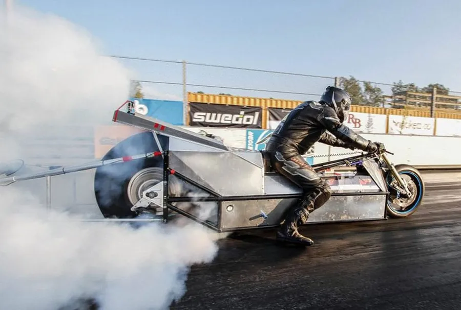

Tu consacres les 20 minutes de cette session à t'assurer que dans les lignes droites tu es bien à fond. Pas d'embrouille, tu te concentre sur ça et sur rien d'autre. Ne commence pas à vouloir faire les freins à un collègue, à te contorsionner sous prétexte de vouloir poser le genou. Non, non pour l'instant aie confiance, joue le jeu et attache-toi à mettre les gaz, tous les gaz.

C'est la base, et donc avant de faire autre chose, il faut que tu t'habitues à mettre la poignée de gaz **en butée** (oui, oui **en butée**). On ne le fait jamais sur route et on entend rarement le moteur très haut dans les tours. Bref, c'est un truc nouveau qu'il faut apprendre à faire. Par exemple, cela peut être en sortie de virage, sur la ligne droite qui suit. Tu es en 2 et la poignée est **en butée** au moment où tu passes la 3. L'objectif n'est pas d'être en 6, à fond et de finir au SAMU local. L'objectif n'est pas non plus de mettre la poignée de gaz à 100% en plein virage. Non, non l'objectif est de s'habituer à tourner la poignée et de sentir qu'on atteint la butée ✊. Donc en 2, en 3, 100% gaz quand la moto est verticale en ligne droite c'est très bien.

Faut apprendre à le faire car le chrono dépend principalement de ta vitesse au bout des lignes droite et pas vraiment de ta vitesse dans les parties lentes. En plus, il faut habituer notre cerveau à la vitesse car à force de rouler à 80 km/h tous les jours, on est un peu largué au début quand on arrive sur circuit.

**Attention**, tu restes bien à 75% de tes capacités. Cela veut dire que dans telle ou telle ligne droite, tu mets 100% gaz mais que tu freines, peut-être, plus tôt que ce que tu faisais lors de la première session. Ne va pas te mettre en mode panique au freinage alors qu'ici on veut travailler l'accélération.

Une fois que c'est validé dans une ou deux lignes droites, il faut effectuer cet exercice aussi dans les grandes courbes car fondamentalement se sont des sections rapides du circuit. Vas-y, pousses la 2, pousses la 3 en étant un peu sur l'angle dans une grande courbe.

Moins évident mais tout aussi important... Il faut aussi accélérer franchement dans les petits bouts de ligne droite. Pas facile de mettre 100% gaz mais il faut être volontaire et tourner la poignée. Il faut sentir le "wouapp effect", le coup de pied aux fesses avec le moteur qui monte dans les tours même si tu coupes et freine juste après. **Attention**, on peut être tenté de faire du 0%-100% trop rapidement dans les petits bouts de ligne droite. Ce n'est pas l'objectif. Là, si on n'arrive pas en butée ce n'est pas grave. En revanche, il faut accélérer, sentir le coup de pied aux fesses et bien faire monter le moteur dans les tours sans nécessairement passer un rapport avant le prochain virage.

Organise-toi dans ta session... En effet, ça va être difficile de faire, d'entrée de jeu, l'exercice sur tous les bouts de ligne droite. Je te propose de commencer par la plus longue ligne droite. Ensuite, tu choisis une autre ligne droite qui est, sur le circuit, à l'opposé de la première. Cela va te permettre de faire l'exercice 2 fois par tour et de reprendre ton souffle entre les 2 (au fait, tu penses bien à souffler dans ton casque ?). Quand c'est acquis sur une des deux lignes droites, tu en choisi une supplémentaire et tu fais l'exercice 3 fois par tour, etc.

**Objectif à la fin de la session**

* Il y a au moins un endroit sur le circuit où tu mets la poignée de gaz **en butée** (en 2 ou/et en 3 typiquement).
* Regarde le plan. Marque avec un "G" les endroits où tu es en butée ainsi que le prochain où tu vas faire l'effort de mettre la poignée en butée.

**Remarques**

* Oui mais moi j'ai peur de m'en coller une !  
Normal on ne fait jamais ça sur route. C'est nouveau. Encore une fois, le but est de choisir une ligne droite et, alors que la moto est verticale en 2 ou en 3, d'enrouler le câble d'accélérateur jusqu'**en butée**. Le but n'est PAS d'être 100% gaz alors que la moto est plein angle. Le but n'est PAS non plus de passer de 0% à 100% en 1/10 de seconde. Non, non, à ce stade on enroule le câble, on s'habitue au bruit, à l'accélération, à la vitesse et à la butée.

* Oui mais si je suis à fond la moto va être en zone rouge !  
C'est une moto, ce n'est pas une Xbox. Donc, même quand on enroule jusqu'à être 100% gaz, il y a un temps avant que le moteur arrive en zone rouge. Tu es gaz grand ouvert et pourtant le moteur continue à prendre des tours. Un peu avant la zone rouge, c'est là que tu passes au rapport supérieur.

* Pourquoi tu dis toujours "**en butée**" ?  
Parce que c'est ce qu'il faut que tu recherches. Il faut que tu sentes la butée, que tu ne peux pas aller plus loin. Si ce n'est pas le cas, tu peux avoir le "sentiment" d'être à fond alors qu'en fait ce n'est pas le cas. Donc bref, il faut que tu tournes la poignée de gaz jusqu'à la butée, tu auras alors la certitude d'être à fond et de ne pas pouvoir aller plus loin.

* Je ne vais pas faire une roue arrière et m'en coller une ?  
Non car l'accélération est sensée être pro-gre-ssive. Tu ne vas pas faire du "tout ou rien" mais plutôt enrouler, enrouler, enrouler... Jusqu'à la butée.

* Oui mais moi je n'y arrive pas car à un moment j'ai le poignet cassé et je ne peux pas aller plus loin !  
Deux trucs à faire :
1. Vérifie que les manches de la combinaison ne sont pas trop longues. Sans les gants elles ne doivent PAS recouvrir le poignet. Tu dois être capable de tendre tes doigts et de faire bouger ta main du bas vers le haut sans que le dessus de cette dernière ne touche le bord de la manche. Si besoin remonte tes manches quand tu t'installes sur la moto mais bon, elles vont retomber.
1. Plus important. Réfléchis... Avant de commencer à enrouler, alors que tu es gaz coupés, écartes légèrement tes doigts de la poignée de gaz et fait rouler ta main vers l'avant. Ensuite tu resserre légèrement tes doigts. Cela va te permettre de tourner la poignée à fond. Ça s'appelle le grip shift. Tu peux faire l'exercice en statique, sur l'aire plane. Il faut d'ailleurs que cela devienne un réflexe à chaque fois que tu coupes les gaz et que tu as relâché les freins mais bon, n'anticipons pas.

* Je ne vais pas casser le moteur ?  
Aucune chance, vas-y, mais passe les rapports avant la zone rouge.

* Heu... Est-ce que tu sais sur quel rapport tu es dans les différentes sections du circuit ?  
Ajoute des +1 et des -1 sur ton plan du circuit.

### 3. Se coucher sur la moto

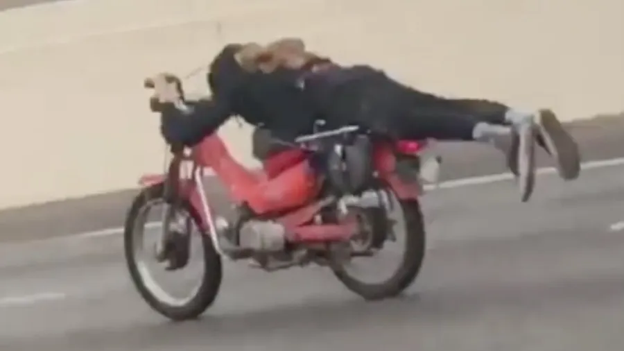

Il est 11H40, c'est la dernière session de la matinée, après on mange ! Oui, oui mais avant ça on va encore apprendre un truc nouveau.

Lors de cette session tu vas faire l'effort de te coucher sur le réservoir dans les lignes droites et les grandes courbes puis dans les petits bouts de ligne droite.

Typiquement, dans les 2 premières sessions tu avais une position type Gendarmerie Nationale (pas d'offense les gars, n'allez pas m'envoyer à Cayenne pour ça). Tu avais les bras tendus, le torse droit, une vision haute, type promenade du dimanche. Tu ne vas pas pouvoir garder cette position dans les sessions à venir. Il faut donc t’entraîner à être dynamique et mobile sur la moto, à baisser la tête et à voir le circuit sous cet angle. Il faut te dire que tu ne roules plus mais que tu commences à piloter. C'est complètement autre chose.

Tu vas commencer par la plus grande ligne droite parce que c'est là que tu as le plus de temps. En plus tu la connais, tu y mets déjà la poignée de gaz **en butée** en 2 avant de passer la 3. Bon, ben maintenant, alors que la moto est verticale, tu vas utiliser tes cuisses pour alléger et faire reculer tes fesses sur la selle. Quand c'est fait, tu baisses les bras (et relâche ces poignées, ça ne sert à rien de les serrer comme ça), tu poses ton torse sur le réservoir (t'en profites pour souffler par la bouche au moment du contact entre les 2), tu serres les coudes le long du réservoir. À ce moment-là tu poses l'avant du casque sur le réservoir, tu lèves les yeux, tu ne vois rien ou presque, tu as mal aux cervicales (bienvenue au club) et tu rejoins le point où, à la session précédente, tu commençais à freiner. Là, tu te redresses comme un diable qui sort de sa boîte, bras tendus et tu freines comme avant.

Heu... C'est peut-être un détail pour toi mais pour moi ça veut dire beaucoup 🎶. Quand tu abaisse le haut du corps tu ne t'accroche pas au guidon. Idéalement tu devrais être capable de baisser le torse sans utiliser tes mains (c'est d'ailleurs un bon exercice à faire en statique sur l'aire plane ou la veille dans ton garage). Le truc, c'est que moins on touche la moto mieux c'est et idéalement s'il n'y avait pas de pilote, la moto se comporterait bien mieux la plupart du temps. Donc, bref, tu ne tiens presque pas les poignées et tu fais tout avec les abdos. Oui, oui je confirme c'est un sport et tu vas bien dormir ce soir. Et non, tu n'as pas besoin de serrer l'accélérateur comme tu le fais. Tu peux le tenir ouvert à 100% avec 3 doigts. Là aussi, fais le test sur le parking ou quand tu roules la semaine qui précède le roulage.

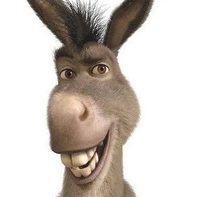

Ça va ? T'es pas mouru l'âne ? Là, pour le coup, il n'y a aucune raison de se mettre en mode panique. Tu accélères comme avant, tu freines comme avant. Le seul truc c'est qu'entre les deux tu t'es couché sur la moto. Oui, bien sûr, tu t'es aussi relevé au moment de freiner.

Allez, même méthode que précédemment. Tu choisis un autre bout de grande courbe ou de ligne droite à l'autre bout du circuit et tu fais l'exercice 2 fois par tour. Quand c'est bon avec l'un des deux tu rajoutes un autre segment de circuit et tu seras alors couché sur le réservoir 3 fois par tour etc.

Encore une fois, c'est dans les petits bouts de ligne droite que ça risque d'être un peu plus délicat. En effet, ça rime à quoi de se baisser alors que dans 2 secondes je vais me redresser pour le freinage ? En plus, tout cela demande pas mal d'énergie et il faut être clair, à un moment tu risques d'avoir la flemme. Il faut se battre contre ça parce que plus tard, en sortie de virage on gardera la tête encore plus basse, à côté de la moto. Il faut donc faire l'investissement physique, apprendre à être mobile sans perturber la moto, s'habituer à voir le circuit avec la tête plus basse qu'elle ne l'était jusqu'à présent.

Un autre truc... Réfléchis. Si tu en a marre de baisser le torse... Ne le relève plus... Oui bien sûr faudra le relever dans les freinages. Mais sinon, dis-toi que dorénavant ta position elle est poitrine sur le réservoir et que tu ne te relève qu'exceptionnellement lors des freinages. Cela sous-entend qu'à l'issue du freinage, dans le virage tu te sois couché mais bon, ça, on en parle un peu plus loin. Pour l'instant habitue toi à te coucher en ligne droite en étant 100% gaz, **en butée**.

Un dernier truc... Si tu as la flemme, si tu sens que tu as moins de jus, sors. C'est la pause de midi, repose-toi et reviens en forme tout à l'heure.

**Objectif à la fin de la session**

* Il y a au moins une ligne droite où tu es couché sur le réservoir, coudes serrés, fesses reculées. Tu dois vraiment sentir la pression du réservoir sur ton torse.

* Regarde le plan. Marque les endroits où tu te couches avec un signe "égal". Dans quelle ligne droite tu vas te coucher lors de la prochaine session ? Il ne faut pas se leurrer, à part lors des freinages, à terme tu seras dans des positions avec la tête encore plus basse quasiment tout le temps.

**Remarques**

* C'est complètement ridicule. Je me traine à 2 à l'heure et tu veux que je m'allonge sur le réservoir. C'est nul !  
Oui bien sûr, là tout de suite, il n'y a pas d'avantage compétitif. En revanche, s'habituer à avoir la tête basse, à voir le circuit sous cet angle de vue, c'est un sacré investissement pour plus tard. Encore une fois, on ne le fait jamais sur route. C'est donc complètement nouveau et le mieux c'est d'apprendre à le faire à basse vitesse alors qu'on n'est pas en mode panique. Il faut que cela devienne une attitude, un réflexe.

* Je n'y vois rien !  
Forcément avec ton roadster ce n'est pas top. Pas grave, on s'adapte. Tu te penches jusqu'à toucher le réservoir avec le torse et ensuite tu te relèves un peu jusqu'à voir par-dessus le compteur. Heu... Les mots sont importants. L'idée c'est : tu touches puis tu te relèves un peu. Ce n'est pas tu te baisse jusqu'à... Non, non. N'essaie pas de me la faire à l'envers.

* Je suis embêté avec mon casque. Il me tombe sur le nez et, je ne vois rien.  
Lors de la prochaine session, quand tu auras sanglé ton casque, mets une main sous l'avant du casque et fais-le remonter. Il faut que tu aies la désagréable impression que l'on voit ton menton. Si jamais il retombe en cours de session tu peux soit changer la mousse intérieure (plus tard une fois de retour à la maison), soit mettre un bout de tissu plié au-dessus de ton front (ou mieux entre la mousse intérieure et le casque lui-même).

### 4. Point de corde et trajectoire

Je ne veux pas te mettre la pression mais bon, de toutes les sessions c'est de mon point de vue, la plus importante. Allez, comme ça, c'est dit.

Pour le reste, j'espère que tu as été raisonnable sur la bouffe ce midi. Sérieux, fais "lite", tu feras mieux ce soir s'il y a vraiment besoin. J'espère aussi et que tu as pris le temps de te reposer car cet après-midi tu as 3 ou 4 sessions et encore pas mal de choses à découvrir. Cela dit, si je résume :

* Tu commences à connaître le circuit. En tout cas tu n'es plus surpris par tel ou tel virage, tu sais que là, il y a un pif-paf qui fait suer etc.

* Dans certaines lignes droites (grandes ou petites) tu arrives à mettre l'accélérateur en butée ✊.

* Dans certaines lignes droites (grandes ou petites) tu te couches sur le réservoir et tu souffle bien.

* Tu restes dans ta zone des 75%, tu es dé-con-trac-té, relax, tu penses à souffler, tu t'agrippes moins aux poignées et tu arrêtes "d'étrangler" l'accélérateur qui ne t'a rien fait.

Donc maintenant on peut commencer à causer...

Tu as peut-être remarqué que dans la plupart des virages il y a 3 cônes :

1. Le premier, à l'entrée et à l'extérieur du virage, c'est le **P**oint de **M**ise **S**ur l'**A**ngle (PMSA)

1. Le second, dans et à l'intérieur du virage, c'est le **P**oint de **C**orde (PC)

1. Le troisième, à la sortie et à l'extérieur du virage, c'est le **P**oint de **S**ortie (PS)

Ta mission, si tu l'acceptes, consiste à relier entre eux ces points en y faisant passer tes pneus.

1. Quand tes roues, qui sont parallèles et à 1 cm de la bande blanche extérieure, arrivent au niveau du PMSA, tu fais basculer la moto pour l'inscrire dans le virage.

1. Tu fais ensuite passer tes roues à 1 cm de la bande blanche au niveau du PC. Comme la moto est plus ou moins penchée cela veut dire que ta tête est au-dessus de l'herbe ou du vibreur. Plus le virage est serré et plus le PC est loin. Très souvent les PC sont aux 3/4 du vibreur intérieur.

1. Tu termines en beauté en passant à 1 cm de la bande blanche au niveau du PS. Typiquement ce dernier se trouve au bout du vibreur extérieur, en sortie du virage (d'où son nom, malins les mecs)

Quand tu l'as fait une fois, tu recommences mais en essayant de rentrer et de sortir un peu plus vite du virage en question et là, tu peux y passer ta vie...

Ok, t'es mignon, mais une fois que tu as dit ça, moi, sur la moto, je fais quoi ?

On va utiliser le formidable schéma ci-dessous :

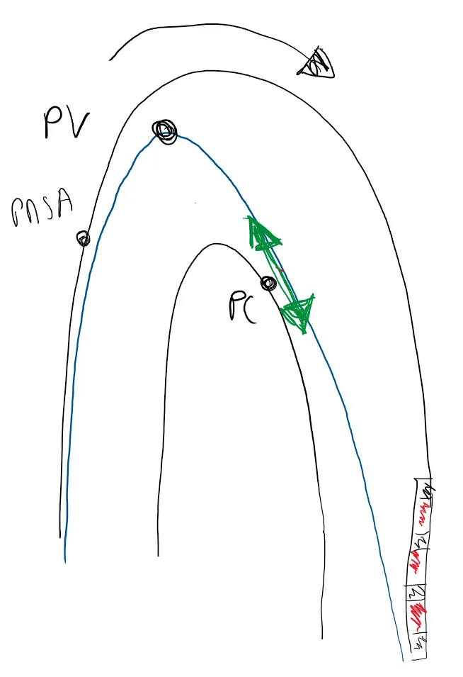

* Tu es gaz coupé, tu as terminé ton freinage. Tu as retiré tes doigts du levier de frein. La moto est à 1 cm de la ligne blanche, verticale et parallèle à cette dernière.  
**Attention**, il est important d'arriver au PMSA en longeant la ligne blanche. Autrement dit, tu n'arrives pas au PMSA en diagonale : la roue AV sur le cône mais la roue AR au milieu de la piste par exemple. Si tu sors d'un virage à gauche et que tu rejoins un virage à droite, traverse la piste mais rejoins la ligne blanche AVANT le PMSA, ensuite tu longes cette dernière pour arriver au PMSA en étant parallèle à la ligne (tes 2 roues sont toutes les 2 à 1 cm de la ligne blanche).

* Tu vas rentrer dans ce que l'on appelle la phase neutre (pas de frein, pas d'accélérateur)

* Tu regardes déjà le PC que tu veux rejoindre. Oui, oui je confirme la moto va dans une direction et toi tu regardes ailleurs.

* Comme le PC est loin tu fais l'effort de rester large et de ne pas rejoindre le vibreur, qui est à l'intérieur du virage. C'est rassurant d'aller se coller à l'intérieur du virage mais c'est une bêtise qu'on fait tous au début.

* Tu mets la moto sur l'angle. Tu arrives sur le point de pivot (PV). Là, tu fais pivoter la moto. Cela se fait en poussant consciemment (ou non) sur la poignée intérieure au virage. C'est à cet endroit que tu as le plus d'angle (et qu'un jour tu mettras le genou au sol). Il ne peut rien arriver de fâcheux car tu ne freines pas et tu n'accélères pas non plus.

* Tu es toujours gaz coupé. La moto pivote, tu es patient, tu es patient... C'est très dur au début car tu vas avoir tendance à vouloir ouvrir les gaz trop tôt. Non, non, tu attends, tu fais tourner la moto.

* Quand la moto a suffisamment pivoté, tu es écarté du vibreur et tes roues sont dans la direction qui relie le PC au PS. C'est LE truc important.

* Quand les roues sont bien alignées tu arrêtes de faire pivoter la moto et un peu avant le PC tu commences à ouvrir les gaz. Tu quittes donc la phase neutre. Au début l'accélération doit être imperceptible.

* En revanche, une fois que tu as commencé à enrouler le câble d'accélérateur tu ne t'arrêtes plus. **Pas de filet de gaz !** Je répète, **pas de filet de gaz**. Au début tu enroule doucement puis de plus en plus vite au fur et à mesure que la moto se redresse.

* N'oublie pas, tu ne dois "toucher" le vibreur qu'une seule fois au niveau du PC.

* Au PC tu regardes le PS, c'est ton prochain objectif

* Au PC tu as du gaz. La moto a moins d'angle qu'au PV. Plus tard, au PC, tu n'auras pas le genou au sol et tu seras 100% gaz.

* Le truc **très important**, l'image que tu dois garder en tête...
Si on arrête le temps quand la moto est au PC, si on la met verticale sur ses deux roues et qu'on met 100% gaz rien de fâcheux ne doit arriver. En effet, ses roues doivent être orientées vers le PS et pas vers le bac à gravier. Donc, si c'est bien le cas, qu'est ce qui va se passer ? La moto va juste sortir du virage comme une balle en toute sécurité dans la direction du PS. Regarde l'orientation, la direction de la flèche verte du dessin.  
En revanche, si au PC les roues ne sont pas bien alignées (en fait cela veut dire que la moto n'a pas fini de tourner) et si on met 100% gaz tu vas droit dans le gravier.

* Tu passes le PC, tu tires sur la poignée intérieure au virage pour continuer à relever la moto (tu peux aussi la "repousser" avec les bras, ça revient au même en fait). Si tu n'es pas 100% gaz au PC tu continues à enrouler. La moto est de plus en plus verticale.

* L'accélération déporte la moto vers l'extérieur. Tu passes à 1 cm du PS, full gaz. La moto peut encore être légèrement anglée dans certains virages.

N'essaie pas de tout faire tout de suite. Là aussi, choisis tes batailles. Choisis 2 virages assez espacés, idéalement un droit et un gauche, où tu te sens à l'aise et essaies d'y relier les 3 cônes. S'il n'y a pour l'instant qu'un virage où tu te sens capable de t'y mettre, vas-y, travaille sur ce virage. Sur les autres sections du circuit tu peux au choix, soit te décontracter soit travailler les autres points du matin. Mais bon, là aussi, il ne faut pas se bercer d'illusions, à terme tu devras relier les 3 cônes dans tous les virages.

**Objectif à la fin de la session**

* Il y a au moins un virage où tu enchaînes PMSA, PV, PC, PS et où tu sors beaucoup plus vite que ce matin.

* Au PC tes roues sont dans la direction du PS **et** à 1 cm de la ligne

* Au PC ce sont les roues qui passent à 1 cm de la ligne, pas le haut de ton corps (lui, il est au-dessus du vibreur ou de l'herbe)

**Remarques**

* As-tu pensé à vérifier la pression de tes pneus avant de repartir en session cet après-midi ?  
La température a évolué depuis ce matin donc la pression des pneus a, elle aussi, changé.

* Ce qui compte c'est ta vitesse de sortie, **pas** ta vitesse d'entrée dans le virage.  
Il vaut mieux rentrer "doucement" et être 100% gaz en sortie plutôt que se faire peur au freinage, rater le PC et mettre 3H avant de pouvoir accélérer.

* Je l'ai déjà dit, ce qui compte c'est la vitesse au bout de la ligne droite qui suit le virage.  
Cette dernière dépend uniquement de ta capacité à être 100% gaz le plus tôt possible, c'est à dire à ne pas louper le PC. Le reste c'est de la poésie et des discussions de comptoir.

* Louper le PC cela veut dire "faire passer les roues à un mètre" **ou** "ne pas avoir les roues dans la bonne direction". Pour réussir un PC il faut faire passer ses roues à 1 cm **et** dans la bonne direction (celle du PS).  
Il faut que les deux conditions soient réunies et c'est pour cela qu'il est plus facile de louper un PC que de le réussir.

* Des points de passage dont on a parlé, le PC est le plus important.  
C'est le même pour tous les pilotes quel que soit leur niveau. Il ne changera jamais, il dépend du virage pas des pilotes. Les autres, PMSA, PV et PS vont évoluer avec ton niveau. Par exemple plus tu vas rentrer vite dans un virage et plus ton PMSA va reculer (se faire tôt). Cela dit, aujourd'hui fait l'effort de bien utiliser toute la piste et de respecter les cônes. Va bien chercher le PMSA à l'extérieur en entrée et va bien chercher le PS à l'extérieur en sortie. Ça va "t'ouvrir" le virage et surtout ça va permettre à ton cerveau d'appréhender toute la largeur de la piste. Ensuite tu apprendras que dans tel ou tel virage il faut rentrer en étant 3/4 piste ou que dans tel autre faut sortir 1/2 piste. Mais bon on n'y est pas encore. Pour l'instant on est en mode "académique" on affinera plus tard.

* Pourquoi le point de pivot ce n'est pas le point de mise sur l'angle (PMSA)?  
En fait, le PMSA correspond au moment où on commence à mettre la moto sur l'angle alors que le PV correspond vraiment au moment où on fait pivoter/tourner la moto. Plus le virage est serré plus PMSA et PV seront distincts. À l'instar du PF (point de freinage) le PV dépend du pilote, de comment il le sent etc.

* Oui mais moi, dans les virages qui ne sont pas des épingles mais plutôt des virages assez grands, après le PMSA, je dois remettre un peu de gaz car sinon la moto est complètement arrêtée et/ou "tombe" vers la corde.  
Bienvenue au club ! En fait, nous ne sommes pas suicidaires donc on freine, on freine trop et après avoir fait basculer la moto, on a plus assez d'élan pour aller au PV. Au prochain tour ne change qu'une chose à la fois (c'est important si tu veux être capable de déterminer ce qui marche, ou pas, pour toi). Par exemple, tu peux essayer ça :
    * Tu freines de la même façon mais un peu plus tard. Quand je dis un peu plus tard cela veut dire l'équivalent d'une ou 2 motos de long, pas 25 m. Ne va pas te mettre en mode panique au freinage alors qu'on veut travailler la trajectoire en virage.
    * Assure-toi bien de ne PAS rejoindre la corde trop vite. Si le virage a un grand rayon cela peut être très tentant. Il faut que tu passes le PMSA, que tu mettes de l'angle mais que tu "perde du temps" à t'enfoncer dans le virage avant de pivoter quand tu le sens. Vue de haut ta trajectoire doit ressembler à un "V" (surtout si tu as une grosse cylindrée).
    * Si tu as un 1000, essaie de tomber un rapport de moins quand tu freines. Tu auras moins de frein moteur et une vitesse d'entrée plus importante. Tu sortiras du virage grâce au couple du moteur.

* C'est bizarre, je n'ai pas peur, tout va bien mais je passe toujours à 1 m du PC.  
C'est sans doute parce que la mise sur l'angle ou le pivot sont beaucoup trop lents. Tu peux alors essayer ça :
    * Ne change rien mais assure-toi de regarder le PC avec ton menton. Ne regarde pas la scène, désigne ta cible. Oui, tu sais qu'il y a des cônes, un virage, un mec devant toi etc. Tu as l'information en tête mais ils sortent de ton champ de vision car tu désignes ta cible avec ton menton. Je dis menton pour t'obliger à tourner la tête **et** les épaules vers le PC.
    * Fais l'effort d'ouvrir tes épaules, de les orienter vers l'intérieur du virage. Typiquement, tu peux très bien tourner la tête vers le PC, le désigner du menton **mais** garder tes épaules parallèles au guidon. Ce n'est pas ce que l'on veut. Il faut que tu désignes ta cible du menton **et** que, un peu à la façon de Robocop, tes épaules tournent avec la tête. Il faut que tu sentes que ton bras intérieur se plie et que le bras extérieur se tend.
    * Freine un peu plus tôt et fais ta mise sur l'angle comme d'habitude mais un peu avant le PMSA. Quand je dis "un peu" cela veut dire l'équivalent d'une ou 2 motos de long. Après, au tour suivant tu ajustes mais bon, fondamentalement ta mise sur l'angle est trop lente.
    * Ne change rien mais sois plus incisif, plus rapide quand tu fais pivoter la moto. Pour cela, il suffit (yaka-faukon) de pousser plus fort sur la poignée intérieure. Tu peux aussi essayer de mettre un peu plus de poids sur le cale-pied intérieur en te penchant vers l'intérieur du virage, en appuyant consciemment dessus avec ton pied.

* Je ne sais pas ce qui se passe, mes pneus passent bien au point de corde mais en sortie de virage, je termine toujours au milieu de la piste et jamais sur le PS.  
C'est parce que tu n'accélères pas assez fort. C'est l'accélération qui déporte la moto vers l'extérieur. Pour te donner une idée, mets ta moto sur béquille latérale. Passe derrière la moto. Avec cet angle-là tu peux facilement avoir toute la puissance à la roue arrière. Je n'ai pas dit être en butée de gaz et attendre la cavalerie. Non, je dis être en butée de gaz **et** avoir tous les canassons au pneu. Quoiqu'il en soit, tu peux essayer 2 ou 3 choses :
    * Es-tu sûr de bien viser le PS et pas un point au 3/4 de la piste à l'extérieur ? La moto va là où tu regardes.
    * Es-tu sûr qu'à aucun moment tu n'arrêtes pas d'ouvrir les gaz ?
    * Enroule le câble d'accélérateur à la même vitesse qu'avant mais commence à accélérer plus tôt. Tu vas donc passer moins de temps sans frein ni gaz. Tu vas réduire le temps de la phase neutre. C'est bien, c'est ce que l'on cherche à faire.
    * Commence à enrouler le câble d'accélérateur comme avant mais enroule-le de plus en plus vite et assure-toi d'atteindre la butée. En fait, au début tu vas transférer la charge vers l'arrière. La moto va se retrouver dans sa position idéale avec 40% du poids à l'avant et 60% à l'arrière. Quand ça s'est fait et qu'elle est callée, tu peux enrouler de plus en plus vite tout en redressant la moto. Oui, on peut dire qu'on accélère en 2 temps : 1, je cale - 2, grosse louche.

### 5. Freinage

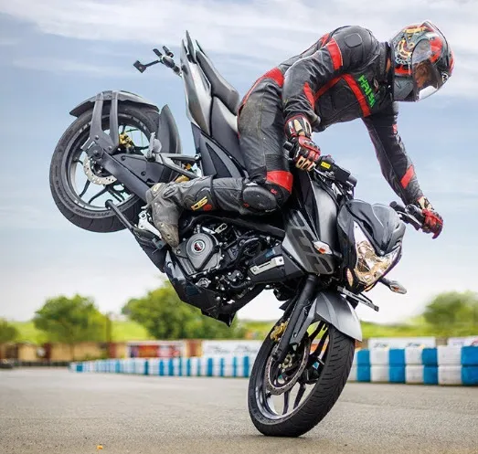

On aurait pu intervertir le contenu des sessions 4 et 5 mais bon, finalement on a choisi cet ordre car cela permet de donner et d'expliquer le but de la session 5.

Lors de la session précédente, tour après tour on n'arrive pas à faire la même chose dans le même virage. C'est frustrant. On manque de régularité.

Ce qui se passe c'est que le freinage n'est pas le même à chaque tour. Un coup tu freines trop, le tour d'après tu ne freines pas assez... Du coup la vitesse au PMSA n'est jamais la même, donc la vitesse à l'entrée de la zone neutre n'est jamais la même et comme l'endroit à partir duquel tu commences à enrouler est dorénavant un peu toujours le même, tu n'arrives jamais au même endroit sur le vibreur : un coup avant le PC, l'autre tour tu es à 1 m du PC... Oui, je confirme c'est rageant car cela impact fortement ta vitesse de pointe en bout de ligne droite même si on ne parle pas encore de chrono.

Ce que l'on va s'attacher à faire dans cette session c'est "construire" la phase de freinage pour arrêter de freiner "au talent".

En fait, il faut garder en tête que le but du freinage c'est de fixer la vitesse d'entrée dans le virage le plus rapidement possible. Ensuite, et après c'est terminé pour les préliminaires, il faut retenir qu'on a autant de précision dans les freins qu'on en a dans l'accélérateur. Dans un cas on règle la vitesse alors qu'elle augmente alors que dans l'autre on la règle alors qu'elle diminue.

Pour illustrer la construction du freinage, prenons le cas du bout de la plus grande ligne droite du circuit. Voici la checklist que je te propose de suivre :

* À 200 m avant le prochain PMSA (en tout cas plus tôt que ce que tu as l'habitude de faire)

* Tu roules à 1 cm et parallèlement à la ligne blanche (je ne sais même pas pourquoi je le rappelle)

* Tu relèves le buste comme un diable qui sort de sa boîte (normal, tu étais couché sur le réservoir, les fesses en arrière et les genoux serrés de chaque côté du réservoir)

* Tu tends les bras, tu serres les genoux

* Tu vises toujours le PMSA

* Au même instant, tu coupes les gaz, tu rentres tout de suite un premier rapport et tu approches le levier de frein de sorte que les plaquettes commencent à mordre les disques.

* Une fraction de seconde après, quand la fourche est enfoncée, que le pneu AV est bien écrasé et que le transfert de masse est effectué, là tu peux te mettre à serrer le levier de frein pro-gre-ssi-ve-ment et très fort. Pas d'à coup. Tu serres de plus en plus fort c'est tout (ce n'est pas très glamour mais penses à une éponge que tu essore). Il ne peut rien arriver. La moto est verticale, l'empreinte du pneu avant est large, la fourche n'est pas complètement comprimée, tu peux y aller, tu as de la marge, il n'y a pas de soucis. Dis-toi que tu serres tellement fort que le levier de frein va toucher la poignée de gaz.

* Bien sûr, si tu dois rentrer d'autres rapports tu continues à le faire le plus tôt possible et quand tu relâche le levier d'embrayage tu le relâche **dou-ce-ment**.

* Sur la fin, tu relâches **dou-ce-ment** le levier de frein jusqu'au moment où tu es à la vitesse à laquelle tu te sens capable de mettre la moto sur l'angle pour prendre le virage.

La première fois, à l'issue du freinage, quand tu estimeras que tu as la bonne vitesse d'entrée tu seras sans doute très loin du PMSA. Mais bon, maintenant tour après tour il te suffit d'ajuster ton **P**oint de **F**reinage (PF). Pour cela tu devras trouver une marque fixe le long du circuit : tâche de peinture, un arbre... Evite tout ce qui est susceptible de se déplacer : ombre, un commissaire de piste, une voiture garée, un caillou qui en fait est une tortue... Une fois que tu as trouvé ton PF, tu le gardes et tu devrais toujours avoir la même vitesse au PMSA. On ne gagne rien à rentrer en catastrophe dans un virage, en revanche il y a de gros gains à faire en étant régulier. Ce qui compte c'est la vitesse de sortie, PAS la vitesse d'entrée.

Bon, ben il ne reste plus qu'à faire la même chose avec tous les autres virages du circuit... Une vie je te dis, tu peux y passer une vie...

**Objectif à la fin de la session**

* Il y a au moins un virage dans lequel tu es constant sur ton freinage.
* En freinant en 3 temps (enfonce l'avant, serre fort, relâche doucement) tu dois freiner beaucoup plus court que ce matin. Note que cela peut être aussi utile sur route.

**Remarques**

* As-tu identifié le virage sur lequel tu veux faire l'exercice en premier ?  
Il faut trouver le virage le plus important. Pour ça, sur le plan, identifie la plus longue ligne droite et peaufine le freinage du virage qui la précède. Toujours pareil... En soignant ton freinage tu te donnes les moyens de sortir plus vite et donc d'avoir une vitesse plus importante au bout de la ligne droite suivante.

* C'est bizarre ce que tu dis, car moi j'ai plutôt l'habitude de rentrer les rapports à la toute fin du freinage.  
Oui mais non. Ce n'est pas un souci quand tu arrives à un feu rouge mais sur circuit il faut utiliser tout ce qui est à notre disposition pour ralentir la bête. En rentrant les rapports très tôt tu vas bénéficier du frein moteur et c'est vraiment important. Heu... Pas d'embrouille, si tu n'as pas de downshifter sur ta moto tu donnes bien un coup de gaz toi-même à chaque fois que tu rentres une vitesse.

* Je n'arrive pas à tout faire c'est trop compliqué !  
OK, pas de problème on s'adapte... Choisis un virage où il n'y a pas de rapport à rentrer. À la fin d'un petit bout de ligne droite par exemple. Du coup tu peux te concentrer uniquement sur le levier de frein et le freinage en 3 temps.
1. Les plaquettes lèchent les disques et le transfert de masse se fait.
1. Quand ça c'est en place, tu serres très fort et sans à coup le levier de frein (pense à l'éponge)
1. À la fin, tu relâches **dou-ce-ment** le levier de frein pour ajuster précisément la vitesse à laquelle tu passes par le PMSA et mettre rapidement la moto sur l'angle. Tu n'as alors plus de frein ni de gaz, tu es en zone neutre.

* Une fois que ça c'est en place, prends un virage où il faut rentrer 1 rapport (pas 2 mais 1 rapport). Ça devrait aller car tu vas rentrer le rapport tout de suite. Ne crains pas de rentrer le rapport trop tôt. C'est vraiment "je coupe les gaz, je rentre un rapport".  
Quand ça c'est bon, il faut que tu t'attaques à un virage où tu dois rentrer plusieurs rapports. Au début prends de la marge, recule ton PF et fais attention à ne pas oublier de freiner sous prétexte que tu te concentre sur le passage des rapports. Si ça part en vrille tu ne débraye pas, tu freine et à la toute fin tu tires sur le levier d'embrayage pour éviter de caler et au prochain tour tu refais un essai.

Note que tu peux t’entraîner à rentrer plusieurs rapports dès le début du freinage, sur route, la semaine avant de venir.

* Si je freine fort, je ne vais pas me retrouver avec la roue arrière en l'air et m'en mettre une ?  
Ce serait étonnant. Il est plus vraisemblable que tu vas sentir la roue arrière qui va rebondir, s'émanciper, vivre sa vie d'ado rebelle etc. Dans ce cas-là, désolidarise le moteur de la roue arrière en tirant 1 mm (pas plus) sur le levier d'embrayage. Il n'y aura plus de frein moteur, la moto va donner l'impression de bondir en avant mais... La roue arrière va revenir instantanément dans l'axe. Je n'ai pas de timing précis en tête mais pour moi on parle de 1/10 de seconde. Donc, très rapidement, tu vas relâcher l'embrayage et retrouver du frein moteur.  
Au fait, d'après toi pourquoi ça fait ça ?  
Bingo ! Parce que tu as relâché l'embrayage trop rapidement après avoir rentré une vitesse.  
Concernant la roue arrière qui se lève, si jamais ça arrive, relâche légèrement la pression sur le levier de frein (plus facile à écrire qu'à vivre, je sais). Surtout, demande-toi si tu n'as pas donné d'à coup dans ta façon de serrer le levier et si tu n'es pas trop avancé, le pubis collé au réservoir (au fait, tu confirmes que tu serres le réservoir avec les genoux. Ça doit t'empêcher de te retrouver collé au réservoir)

* Et si je me loupe et que j'arrive beaucoup trop vite dans le virage. Je fais quoi ?  
Là, il va falloir que tu me croies sur parole. Aie confiance, crois en moi... Lâche les freins, tourne ta tête franchement vers le PC et penche tout. Ça va passer.  
Ce qui est sûr, c'est que si tu freines fort, la moto va se relever si tu es déjà sur l'angle ou être impossible à mettre sur l'angle si tu vertical en train d'arriver au PMSA. L'alternative c'est quoi ? Il n'y a pas d'autre choix, il faut tourner la tête vers le point de corde, lâcher les freins et rentrer dans le virage avec la vitesse que tu as. Oui, je sais, c'est plus facile à écrire qu'à vivre mais c'est la réalité.

* Comment je sais que je commence à atteindre les limites ?  
Pour maximiser le freinage il faut bénéficier du frein moteur à la roue arrière et des freins sur la roue avant. Quand la roue arrière commence à se lever c'est que tu es au max. Au prochain tour essaie de te reculer sur la selle et d'utiliser les genoux autour du réservoir pour ne pas avancer.

* Pourquoi tu dis toujours **dou-ce-ment** ?  
Encore une fois, s'il n'y avait pas de pilote sur la moto, le comportement de cette dernière serait beaucoup moins violent, moins erratique. Si le pilote tombe et que la moto reste sur ses roues, elle va continuer tout droit. Au moment de franchir les vibreurs et d'aller dans l'herbe, elle va sauter, retomber sur ses roues et continuer. Laisse un pilote dessus, il va se jeter sur les freins et ils vont finir tous les 2 au tas.  
Il faut être **pro-gre-ssif** et y aller doucement pour ne pas brusquer la moto. Tu relâches l'embrayage doucement. Tu respectes les 2 premières phases du freinage, tu laisses la moto enfoncer l'avant puis tu serres **pro-gres-si-ve-ment** les freins. Tu enroule **continûment** et de plus en plus vite la câble d'accélérateur, les exemples sont innombrables...

<!-- **Note de pilotage que tu peux lire :**

* [Tout ou presque sur le freinage](https://www.40tude.fr/pilotage-moto-03-freinage/) -->

### 6. Conduite du virage

Showtime ! En effet, à ce stade tu as mis beaucoup de choses en place :

* Tu connais le circuit.
* Tu accélères à fond.
* Tu te couches sur le réservoir et tu t'habitues à avoir la tête en position basse.
* Ton freinage te permet d'avoir toujours la même vitesse au PMSA.
* Tu sais ce que tu cherches à réaliser dans le virage : sortir le plus vite possible en faisant passer tes roues sur les PMSA, PC et PS. Au PC tu cherches à faire passer tes roues à 1 cm **et** dans la bonne direction.

Cela dit il y a encore quelques "détails" à régler :

* À l'issue du freinage, tes bras restent tendus dans le virage
* Ton buste reste vertical et dans l'axe de la moto
* Comme tu passes de plus en plus vite...
* Tu prends de plus en plus d'angle. C'est dangereux. Tu as peut-être même déjà fait frotter un des cale-pieds.

On voit qu'on atteint là une limite, un plafond de verre car on ne peut pas aller plus loin que le cale-pied. On va donc consacrer cette session à améliorer ce que l'on appelle la conduite du virage. L'idée c'est de se donner les moyens de sortir de plus en plus vite du virage tout en continuant, bien sûr, à faire passer les roues sur les PMSA, PC et PS.

La physique fait que si on veut passer plus vite en virage il faut contrebalancer la force centrifuge qui pousse la moto à l'extérieur de ce dernier. Pour cela il faut mettre plus de masse à l'intérieur du virage. Le premier réflexe a consisté à pencher la moto mais bon on atteint vite les limites d'une telle démarche.

Afin de pouvoir commencer à enrouler le câble d'accélérateur plus tôt pour sortir plus vite (c'est notre seul but), on a donc pas d'autre solution que de "pencher" le pilote à l'intérieur du virage et de laisser la moto plus droite.

Ça risque de râler un peu mais, faute de temps, on ne va faire ici que la moitié de l'exercice en ne s'occupant QUE du haut du corps. Donc, non, ce n'est pas maintenant qu'on va poser le genou.

Voici ce que je te propose de faire dans un virage où tu te sens à l'aise :

* *Comme avant :* tu termines ton freinage au PMSA en serrant le réservoir avec les genoux et en restant reculé sur la selle. Tes roues sont parallèles à la ligne blanche en arrivant au PMSA.
* *Comme avant :* tu mets la moto sur l'angle rapidement en poussant la poignée intérieure. Tu es en zone neutre : sans frein, ni gaz.
* *Comme avant :* ton menton désigne le PC
* **Nouveau :** Au lieu de rester bras tendus, le buste droit dans l'axe de la moto, tu vas baisser ton torse vers l'intérieur du virage en expirant fort dans ton casque.  
Non, tu ne vas pas vers le réservoir, tu vas à côté du réservoir, vers le PC que désignent ton menton, ta tête et tes épaules. Ton bras intérieur se plie (il est tout "mou", détendu, relax) alors que ton bras extérieur se tend et se pose sur le réservoir (sur un roadster le bras est tendu mais 5 cm au-dessus du réservoir). Tes épaules s'ouvrent vers l'intérieur du virage. Quand tu abaisse le torse, pense à bien souffler pour devenir "tout mou". Faut que tu te "dégonfle".
* **Nouveau :** En même temps, tu fais comme si tu voulais repousser la moto pour la laisser droite alors que tu fais tout pour mettre un maximum de ton corps à l'intérieur du virage. Tu repousse donc la moto avec les bras. Tu dois finir avec le "menton au guidon" et le casque au niveau du rétro.
* N'hésite pas à "t'accrocher" à la moto avec le genou extérieur sur le côté du réservoir. Et, non, tu n'as pas besoin de t'accrocher au guidon une fois que la moto est sur l'angle.
* Si tes fesses sont toujours en ligne, sur la selle, ta colonne vertébrale et l'axe de la moto forment un V
* *Comme avant :* pas de filet de gaz. Quand tu commences à enrouler le câble tu le fais de manière imperceptible au début mais surtout tu ne t'arrêtes plus et tu enroule de plus en plus vite au fur et à mesure que tu redresse la moto en t'approchant du PC.

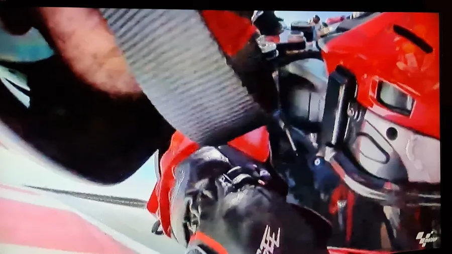

Le truc important lors de la conduite du virage c'est de mettre un maximum du poids du pilote à l'intérieur du virage et de repousser la moto pour la laisser verticale. Oui, bien sûr, elle va prendre de l'angle mais bon, tu saisis l'idée.

Note bien que je n'aie pas dit de mettre le pilote "en bas", j'ai dit "à l'intérieur", donc écarté le plus possible de la moto. C'est pour ça qu'on dit "menton au guidon" et "casque dans le rétro".

Tu dois sentir que c'est ton corps qui "va" à l'intérieur du virage alors que tu "repousses" la moto avec tes bras pour la laisser le plus vertical possible. Le fait d'ouvrir les épaules t'aide aussi à te retrouver avec un bras tendu et l'autre plié. Fais-le en statique sur l'aire plane ou dans ton garage avant de venir.

Dorénavant, à vitesse de passage identique, la moto prend moins d'angle. Tu es plus en sécurité. Tu peux te permettre d'enrouler continument les gaz plus tôt et plus fort. Tu peux le faire car la moto est plus verticale qu'avant, l'empreinte du pneu AR au sol est plus large. Tu sors donc plus vite du virage et tu augmentes ta vitesse au bout de la ligne droite qui suit le virage. C'est le seul truc qui compte. Point.

**Objectif à la fin de la session**

* Dans au moins un virage ton buste est sur l'avant et à l'intérieur du virage. Ta tête est écartée, sur le côté de la moto, le bras intérieur au virage est plié, tu as le menton au guidon et l'autre bras est tendu sur le réservoir, les épaules ouvertes vers l'intérieur du virage.
* Tu dois sentir que l'ensemble du virage ressemble à la séquence suivante :
  + Tu freines en visant le PMSA, roues parallèles et à 1 cm de la ligne
  + Au PMSA, tu claques la moto sur l'angle rapidement, tu pousses la poignée intérieure en regardant le PC
  + Phase neutre. Sans frein, ni gaz. Belle vitesse d'entrée. Tu patiente, tu patiente, tu patiente
  + Pas de filet de gaz. Après le PV et avant le PC tu commence à enrouler le câble d'accélérateur. Tu enroule de plus en plus vite. Idéalement tu es 100% gaz au PC, tu tires la poignée intérieure et tu désignes le PS avec ton menton.
  + Résumé du résumé : freine, claque, patiente, gaz. Trop facile moi je dis... ✊
* Quand tu penses que ta position est complètement ridicule c'est que tu commences à ressembler à un pilote.

**Remarques**

* Je n'arrive pas à plier le bras intérieur. Je suis crispé et j'ai l'impression de forcer.  
Je confirme, tu forces. Il faut que tu te persuades, qu'une fois la moto sur l'angle, tu pourrais faire l'exercice sans toucher le guidon. Pense aux mecs sur les photos qui sont plein angle et qui font "coucou" de la main.  
Tu peux essayer les choses suivantes :
  + Commence avec un virage à gauche c'est généralement plus facile car tu peux alors "oublier" la poignée de gaz.
  + Quand la moto passe sur l'angle, essaies de sentir que tu déplace ton torse avec les abdos et uniquement les abdos. L'idée étant d'éviter de prendre appuis sur le guidon pour déplacer le haut du corps. Oui, va falloir faire des planches à la maison.
  + En même temps que la moto prend de l'angle, relâche la poignée intérieure au virage et fais tourner ta main d'un quart de tour vers l'avant autour de la poignée. Ça va décoincer ton poignet et aligner "naturellement" ton avant-bras avec le bracelet/guidon.
  + Laisse le bras se plier quand tu fais tourner ta main et que ton buste se rapproche.
  + Pense à te "dégonfler" en soufflant fort dans ton casque.
  + Assure-toi que tes épaules s'orientent bien vers l'intérieur du virage. Elles tournent avec ton menton. Elles ne doivent pas être parallèles au té de fourche.
  + Dans un virage à gauche, à la fin il faut que tu aies l'impression de pouvoir te gratter l'oreille droite avec la main gauche (et inversement dans un virage à droite). En gros, exagère à mort la position.

* Heu... J'aime pas du tout cette sensation d'être la tête dans le vide ni ce point de vue.  
Désolé... Va falloir te faire à l'idée d'avoir la tête au-dessus de l'herbe et des vibreurs. Faut en manger mais ça vient vite... Faut juste que ton cerveau s'y fasse. Important : Lève les yeux, regarde loin, ça aide vraiment.

* Dis-moi Barbara, tu te rappelles la 3eme session de ce matin ? [Se coucher sur la moto](#3-se-coucher-sur-la-moto). À un moment j'ai dit "Si tu en as marre de baisser le torse... Ne le relève plus...". Bon, ben dorénavant tu vas pouvoir le faire. Par exemple, en sortie de virage, au PS, tu es toujours la tête sur le côté, bras plié et bras tendu. Quand tu te remets dans l'axe, garde la tête basse avec l'avant du casque qui touche le réservoir. En fait, tu peux dorénavant ne relever la tête QUE dans les phases de freinage. Ayé, t'es devenu un pilote !

* Il faut que tu en profites pour commencer à accélérer plus tôt. Oui, oui tu restes dans tes 75% mais bon, réfléchis 2 minutes. Si la moto est plus verticale et si elle passe à la même vitesse (quoi, tu n'as pas encore mis le scotch bleu sur ton compteur ?) tu peux te permettre de commencer à enrouler le câble d'accélérateur plus tôt. Il n'y a pas de risque. L'empreinte du pneu est plus large qu'avant. Donc, fais-le car en accélérant plus tôt tu vas accélérer plus longtemps et tu vas donc augmenter ta vitesse de pointe au bout de la ligne droite suivante (toujours le même but).

* Il faut que tu en profites pour, tout en restant dans tes 75%, commencer à augmenter ta vitesse d'entrée en virage. Ça c'est plus dur mais, si on y réfléchit un peu, c'est le symétrique du point précédent... Je m'explique.  
Si à vitesse d'entrée constante, en mettant le poids du pilote à l'intérieur du virage tu gardes la moto plus verticale qu'avant, cela veut dire que tu as plus de grip. Donc, si tu veux retrouver, en entrée le même grip qu'avant, tu peux te permettre de rentrer plus vite et donc avec plus d'angle.  
En revanche c'est difficile. En effet, on a tous une idée de la vitesse à laquelle "oh, putain, ça va pas passer". Du coup, soit on freine trop soit on a des mises sur l'angle qui prennent 2H.  
Je pense qu'il faut, dans l'ordre, augmenter la vitesse de mise sur l'angle puis augmenter la vitesse d'entrée.
  + Concernant la vitesse de mise sur l'angle, c'est un exercice qu'on fait en stage où on fait un gymkhana entre des cônes et où il faut rapidement passer d'un côté à l'autre (idéalement en étant genou au sol). En plus tu es filmé et tu te pète la honte de ta vie au débriefing (en fait on rigole bien car on est tous pas très bons sur cet exercice).  
  En journée de roulage il faut choisir 2 virages de part et d'autre du circuit et sentir qu'on pousse la poignée intérieure. C'est ça qui permet de "claquer" la moto sur l'angle. Oui on peut appuyer sur les repose-pieds mais la mise sur l'angle est lente. Pour mettre rapidement la moto sur l'angle il faut contre braquer et pousser la poignée intérieure.
  Fais le test sur route, en ligne droite, à 80 km/h, lâche le guidon et pousse avec ton index la poignée gauche. Il se passe quoi ? Maintenant imagine un virage ou tu pousses avec la paume de ta main gauche ? Tant que tu pousses la moto se penche. Plus tu pousses fort plus elle se met sur l'angle rapidement. Faut expérimenter, faut en manger... Une vie, je te dis...
  + Quand la mise sur l'angle est plus rapide tu peux, progressivement, augmenter la vitesse d'entrée dans le virage. Progressif. Là aussi, il faut que le cerveau et le corps s'habituent. En stage de pilotage on fait un exercice qui s'appelle "sans frein, ni boite" dans lequel on fait des tours de circuit sans avoir le droit de changer de rapport ni de toucher aux freins. On module la vitesse uniquement avec l'accélérateur et tu te débrouilles comme tu veux mais tu rentres dans le virage avec la vitesse que tu as à ce moment-là... Engagez-vous qui disaient, engagez-vous.  
  En session de roulage il n'y a pas 36 solutions. Ne change qu'une chose à la fois. Par exemple garde tes PF et PMSA mais freine moins fort. Ou alors, avance ton PF de 1 ou 2 motos de long et garde ton PMSA ainsi que ta façon de freiner. À notre niveau, assure-toi bien de ne plus avoir les doigts sur le levier de freins quand tu mets la moto sur l'angle.

* Tu as dit qu'on a fait que la moitié de l'exercice. Je fais quoi moi maintenant si je veux aller plus loin ?
Si tu poses la question c'est que tu claque ta moto sur l'angle et que tu as une belle vitesse d'entrée en virage. On est d'accord ? Bon, ben si c'est effectivement le cas, pour passer encore plus vite dans le virage, il faut rajouter du poids à l'intérieur du virage. L'idée consiste alors à décaler tout le pilote sur la selle vers l'intérieur du virage. Tout ce que l'on a dit précédemment reste valable mais typiquement il cherche maintenant à caller sa raie des fesses dans le coin de la selle. Ensuite, il va rajouter encore de la masse en posant le pied intérieur au bout du cale-pied. Il va s'en servir comme d'une rotule lorsqu'il va ouvrir son genou. Ici, ce n'est pas "il nous faut plus de dents" mais "il nous faut plus de poids à l'intérieur".
Mais bon, "avant de savoir courir il faut savoir marcher". Mettre tout ça en place sur une seule session, alors que cela impacte aussi le freinage, nous paraissait un peu "touchy". Comme le pilote débute, on a fait le choix de se concentrer sur le haut du corps dans un premier temps. Une fois que ça c'est en place, qu'il claque la moto sur l'angle et qu'il a la vitesse d'entrée suffisante, plus tard, il pourra "facilement" y rajouter le bas du corps. On adapte sa position pour passer plus vite, pas le contraire.

<!-- **Note de pilotage que tu peux lire :** -->

<!-- * [Une conduite de virage efficace](https://www.40tude.fr/pilotage-moto-04-conduite-du-virage/) -->

### 7. La septième session

C'est celle qu'on n'attendait pas. C'est donc que du bonus, que du bonheur. Tu sais quoi ? Oublie tout ce dont on a pu parler et vas rouler. Pas de pression, tu n'as même pas de chrono pour mesurer quoi que ce soit. N'essaie pas de rester à 75%, à 50% ou à 100%. On s'en fout, tu as fait le job, tu n'as plus rien à prouver aujourd'hui.

Vide-toi la tête, monte sur ta moto et enquille les tours, "pour le plaisir" 🎶, en restant cool et fluide.

**Objectif à la fin de la session**

* Être surpris que la session soit déjà terminée

**Remarques**

* Si tu es vraiment rincé ne fais pas la dernière session.  
Cela dit, réfléchis. Tu es vraiment mort ou tu as juste la flemme de remettre ton casque plein de sueur ? Généralement il y a moins de monde dans la dernière session. Cela donne de l'espace, cela apporte de la sérénité, ça libère la tête. Il faut savoir saisir une opportunité quand elle se présente. C'est comme faire la dernière descente en snowboard alors que tout le monde est déjà rentré. "In tartiflette we trust", allez, enjoy !
* Si tes potes te proposent de rouler ensemble "pour la dernière", refuse.  
Laisse-les partir devant. Tu ne sais pas dans quel état de "fraicheur" ils sont. Comme dit le vieux proverbe Indien : "Si ça sent l'arsouille, ça sent l'embrouille".

## Et maintenant, que vais-je faire ?

**Attention**. Parce qu'on ne rigole pas avec la sécurité, en sortant de la dernière session tu vas directement remettre tes pneus à leur pression "route".

Maintenant il y a deux cas de figure :

1. Soit, tu n'as pas apprécié la journée, tu t'es fait peur, tu n'es pas à l'aise avec les autres qui te double, tu ne prends pas de plaisir... Ce n'est pas grave. Il y a plein de façons de faire de la moto. En revanche, essaies peut-être de participer à un [stage de l'AFDM](https://afdm.org/le-stage-perf-2-jours/) et si possible fais un stage de 2 jours.   
Cela n'a rien à voir avec le circuit mais toi et la moto allez faire des trucs que tu ne penses pas possible, tu vas comprendre beaucoup de choses et surtout, tu vas prendre confiance, beaucoup de confiance.  
Quand ça s'est fait, redonne-toi une chance sur circuit et/ou fais une journée de stage dédiée aux Novices (c'est le niveau avant Débutant). Le circuit de la Ferté Gaucher organise des journées de ce type mais je suis certains que cela existe aussi ailleurs. Là, c'est top car il y a moins de monde par session (moitié moins de monde que ce que l'on a en journée de roulage typique où on compte une moto par 100 m de circuit), tout le monde a le même niveau, c'est encadré, il y a des sessions en salle, des débriefings etc.

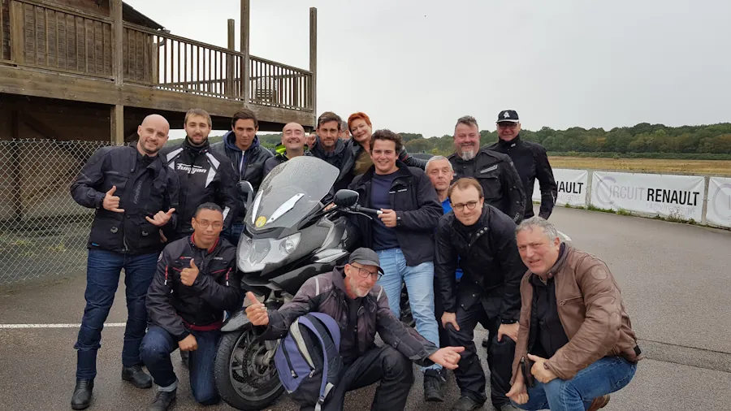

2. Dans le second cas, si tu as la banane alors que tu es crevé et que tu sais que tu as encore 12 000 trucs à apprendre... Welcome. J'ai juste 3 recommandations :
    * Ta moto est bien meilleure que toi. Donc, pour l'instant, continue avec elle, telle qu'elle est. Ne dépense rien. Entretiens-la correctement (pneus, plaquettes de frein AV, liquide de frein, vidange de fourche, joints spi de fourche, entretien moteur classique...) et ne vas pas mettre 1500€ dans un échappement. C'est de la connerie.
    * En revanche, si tu as vraiment l'intention de refaire de la piste achète un chrono GPS (n'utilise pas ton téléphone ou alors mets le sous la selle). On peut dire ce que l'on veut, "le chrono ne ment pas". Tu pourras te faire les films que tu veux, te trouver les excuses que tu veux... Soit, tu vas plus vite soit tu es moins efficace. Point. En plus, le chrono tu pourras l'utiliser sur d'autres motos par la suite.
    * Participe rapidement à un stage de 1 ou 2 jours. C'est un sacré investissement (600 € environ rien que pour le stage de 2 jours) mais c'est cadré, pro etc. C'est un budget mais cela va te faire gagner beaucoup plus de secondes au tour que n'importe quel accessoire carbone, commande reculée ou pot d'échappement en Mithril. C'est comme apprendre le Snowboard tout seul ou passer par l'ESF. Il n'y a pas photo. **Attention**, il faudra que tu arrives au stage en forme (abdos, cuisses) et reposé car le rythme y est soutenu. Ce n'est pas un stage commandos de marine mais il faut se donner, pas perdre de temps entre les sessions et tenir jusqu'au bout (physique & mental). Exemple avec mon tout premier stage avec DRRS en 2019.

Pense à aller voir les photos de la journée. Soit, elles sont déjà consultables sur le circuit soit, tu les auras la semaine prochaine en ligne. Achète la moins moche d'entre elles et mets-la de côté. On en reparlera l'année prochaine ou dans 2 ans😊

De retour à la maison, reprends le plan du circuit et l'agenda de la journée. Prends 15 à 20 minutes pour y ajouter tes notes. Vas-y, lâches toi, notes tout. Tes sentiments, tes impressions, les trucs que tu ne comprends pas encore, les rapports de boite, les questions que tu souhaites poser, telle ou telle difficulté... Tu t'en serviras comme anti-sèche ou comme TO DO list la prochaine fois que tu viendras sur ce circuit.

Bon, allez, la suite au prochain numéro et d’ici-là relis les [Notes de Pilotage Moto]() ou fais des [squats](https://youtu.be/TIhtpItTuxc) afin de préparer les prochains roulages.

