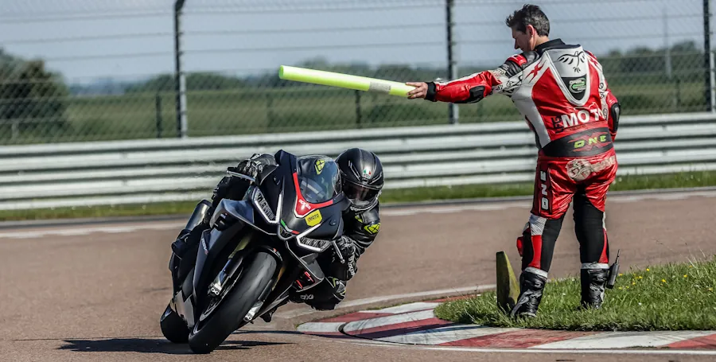

# {{ page.title }}
{: .no_toc }

{{ page.description }}
{: .lead }

<!-- ###################################################################### -->
<!-- ###################################################################### -->
## Première fois sur circuit
Les choses ont évolué depuis la première mise en ligne des Notes de Pilotage Moto (fin 2019). Dorénavant, je vous propose de commencer par lire l'article [Première fois sur circuit]()
* Il n'y a qu'une page à lire
* L'article vous guide tout au long de la journée
* Il y a un agenda .pdf à imprimer
* Le billet a été écrit après les Notes de Pilotage Moto
* Il est moins complet que les Notes de Pilotage Moto, moins exhaustif, moins technique. Cependant, il y a déjà beaucoup de choses (encore un peu trop à mon goût) et il est très **laaaaargement** suffisant.

Une fois que votre première journée c'est bien déroulé et si vous avez trouvé utile les conseils, le ton et l'approche de l'article, alors, et uniquement alors je vous propose de revenir ici afin de rentrer dans les détails et de revoir certains points.

<!-- ###################################################################### -->
<!-- ###################################################################### -->
## Le programme

Ma première journée de roulage... Un bon exemple ici... NOT YET TRANSFERED. Je n'ai pas dormi de la nuit, j'étais excité depuis des semaines, j'avais un peu la trouille de me mettre au tas et de ne pas pouvoir rentrer par mes propres moyens... Cela dit, j'aurai bien aimé qu'on m'explique un peu comment appréhender la piste et le pilotage. Je ne parle pas ici de la [logistique]() mais uniquement du pilotage.

Comme son nom l'indique, la section **Basics** s'intéresse aux fondamentaux. C'est grosso-modo le programme abordé dans [Première fois sur circuit]() mais en plus détaillé. De toute façon cela ne fait jamais de mal que de lire ou d'entendre les mêmes explications mais avec un vocabulaire différent. Typiquement, à la fin des **Basics** on possède des bases saines et solides sur lesquelles on peut s'appuyer pour passer à l'étape suivante.

**Advanced** couvre bien entendu des sujets plus avancés. Pas la peine d'aller lire cette section en avance de phase tant que les **Basics** ne sont pas en place. Oui bien sûr, allez-y, lisez les mais ne "gâchez" pas une session à travailler tel ou tel aspect tant que vous passez à 1m du point de corde. L'idée, c'est Basics puis Advanced.

**Compléments** ça dit bien ce que ça veut dire. C'est du plus en plus. Ce qu'il y a d’intéressant c'est que les mêmes sujets sont abordés MAIS avec un autre vocabulaire, d'autres expressions, d'autres images. Là pour le coup, faut pas hésiter à aller voir ces vidéos à l'issue de votre [Première fois sur circuit]() ou après avoir lu les Basics

### Basics
1. **[Découverte de la piste 1/2]()** : On se prépare pour la journée, on découvre la piste à 75% de nos capacités et on apprend à se coucher sur la moto.
2. **[Découverte de la piste 2/2]()** : On continue à découvrir la piste, on se couche sur la moto et on ouvre les gaz à 100%, **en butée**.
3. **[Three steps]()** : On parle de la façon de décomposer le virage, des endroits où il faut fixer son regard, quand, comment... Le but est de simplifier la lecture du virage ce qui permet de se concentrer sur autre chose et surtout d'être régulier d'un tour à l'autre.
4. **[Freinage]()** : Ce que l'on cherche, c'est de sortir fort du virage afin de favoriser la vitesse de pointe au bout de la ligne droite qui suit. Dans cette première page consacrée au freinage on ne parle que du freinage en ligne droite, de ses différentes phases et on termine avec la mise sur l'angle... Il y a aussi quelques remarques à propos des réglages des commandes. Plus loin il y a une page consacrée au freinage sur l'angle.
5. **[Conduite du virage]()** : On assemble les briques élémentaires précédentes pour construire une base solide sur laquelle on va pouvoir s'appuyer avant de passer à la section Advanced.

### Advanced
6. **[Hook Turns]()** : On parle ici d'une technique qui permet de resserrer les virages. Pour rappel, on souhaite resserrer les virages pour pouvoir au prochain tour avoir de la marge pour sortir plus fort. Bref, ça n'en finit jamais cette histoire, il y a toujours un truc à peaufiner...
En gros, on verrouille le bas du corps "dans" la moto alors que le buste est très mobile. Ensuite on cherche à déplacer le centre de gravité de l'ensemble moto-pilote encore plus vers l'**intérieur du virage**. On en parle que maintenant car il faut que pas mal de choses soient déjà en place avant de s'attaquer à ce sujet.
7. **[Contre braquage en sortie de virage](#ANCHOR)** : En entrée de virage, pour mettre la moto rapidement sur l'angle, je pousse sur le guidon intérieur. En sortie de virage, pour relever la moto rapidement, je tire sur le guidon intérieur. Fallait juste y penser...
8. **[Knee to knee]()** : On ajoute à notre boîte à outils un outil à qui va nous permettre de passer efficacement d'un côté à l'autre de la moto. Ensuite on s'attaquera aux pif-paf.
9. **[Pif-paf]()** : Je prends le temps de décomposer le pif-paf. Ce n'est pas évident car il faut sacrifier l'entrée pour optimiser la vitesse de sortie (c'est toujours la même chose en fait). Comment on fait ? Quelle trajectoire favoriser ? Je vous explique ce que je crois avoir compris.
10. **[Freinage sur l’angle (Trail Braking)]()** : Si je veux favoriser ma vitesse en ligne droite, je dois garder les gaz ouverts à 100% le plus longtemps possible. Cela veut donc dire que je dois réduire de plus en plus ma distance de freinage. Mouai... Mais bon, à un moment, ce n'est plus tenable si on veut toujours continuer à freiner avec la moto droite. Je suis donc amené, logiquement, à terminer mon freinage sur l'angle... On fait le point ici.

### Compléments
12. **[Conseils de pro]()** : Ce sont en effet des conseils de vrais pros pour lesquels il y a des références etc. À lire, à relire et à inscrire dans sa [feuille de session]() comme exercices à faire par exemple.

<!-- ###################################################################### -->
<!-- ###################################################################### -->
## Comment lire les Notes de Pilotage Moto ?

Je souhaite qu'il y ait une dizaine de sujets (c'est toujours pas fixé et je pense que cela ne le sera jamais). Chaque Note de Pilotage Moto suppose qu'on la mette en œuvre lors d'une session de roulage de 20 minutes. Cela dit, on va être pragmatique et se dire qu'il n'y a rien d'obligatoire. Par exemple, s'il faut 3 sessions pour découvrir le circuit et bien... Il faudra 3 sessions "et pis c'est tout !"... Pas la peine de se mettre martèle en tête et/ou de se mettre dans le rouge dès le départ.

### Structure des Notes de Pilotage Moto

Elles ont toutes la même structure :
1. **Objectif de la session** - J'explique rapidement de quoi on va parler
1. **Prérequis** - Certaines Notes Notes de Pilotage Moto demandent que certains points soient déjà acquis. Par exemple pour s'attaquer au contre braquage en sortie de virage il vaut mieux que la conduite du virage soit acquise.
1. **Petit rappel utile avant de rentrer sur le circuit** - C'est juste de la prudence avant d'entrer en piste. Ça va sans doute soûler ceux qui lisent les Notes de Pilotage Moto dans l'ordre mais ça rendra service à ceux qui arriveront directement sur telle ou telle page via une recherche sur le Web.
1. **La session** - C'est là qu'on rentre dans le vif du sujet.
1. **À la fin de la session** - On fait un point sur nos acquis
1. **Remarques** - Des points et des questions plus ou moins en rapport avec le sujet de la Note de Pilotage Moto.

Il y aura des répétitions car certains aspects me paraissent vraiment importants. De toute façon, certains lecteurs, grâce à leur moteur de recherche préféré, arriveront directement sur une Note de Pilotage particulière et donc ce n'est pas complètement idiot de répéter certaines choses. Enfin je suis persuadé de l'utilité qu'il y a à expliquer les mêmes choses dans un contexte légèrement différent, avec un autre vocabulaire, des exemples différents. Des fois c'est là que le "Oh putain, j'ai compris" arrive.

<!-- ###################################################################### -->
<!-- ###################################################################### -->
## À propos des commentaires

Ils sont, bien sûr, les bienvenus s'ils sont bienveillants et constructifs. J'ai ces Notes de Pilotage Moto depuis pas mal de temps dans OneNote et j'estime qu'il est grand temps de les partager. Si dans une des notes vous considérez que je dis une bêtise, pas la peine de me tirer dessus ou de m'agonir avec un commentaire au vitriol. J'ai peut-être, tout simplement, pas encore compris telle ou telle technique de pilotage.

En revanche si un point n'est pas clair ou pas suffisamment expliqué, lâchez-vous et aidez-moi à améliorer la Note de Pilotage Moto en question.

Par exemple, n'hésitez pas à conseiller telle ou telle vidéo sur YouTube qui illustre bien le point abordé dans la Note.

Pour les commentaires, ça se passe par [ici](https://github.com/40tude/40tude.github.io/discussions)

<!-- ###################################################################### -->
<!-- ###################################################################### -->
## Vidéos et podcast

Cliquez sur la vidéo ci-dessous. C'est une playlist d'une centaine de vidéos que je garde sous le coude sur YouTube. Il y a un peu de tout et c'est plus ou moins organisé : Fitness, Trajectoire, Position...

Il y en a dans toutes les langues : Français, Italien, Anglais, Espagnol... Si besoin, mettez les sous-titres et passez la vitesse de lecture à 75% ou moins.

Pour accéder à la playlist (et la mettre de côté le cas échéant), je vous conseille de cliquer sur le "**Regarder sur YouTube**" en bas plutôt que sur le bouton play rouge.

<iframe width="560" height="315" src="https://www.youtube.com/embed/videoseries?si=n7LHAWWeSbHh5IqF&amp;start=1014&amp;list=PLOmfq6wDOTY7St0LApT2rQh3fsZKbvYUS" title="YouTube video player" frameborder="0" allow="accelerometer; autoplay; clipboard-write; encrypted-media; gyroscope; picture-in-picture; web-share" referrerpolicy="strict-origin-when-cross-origin" allowfullscreen></iframe>

Une série de podcasts disponibles sur YouTube qui est pas mal si vous parlez Anglais. En ce qui me concerne je les écoute sur téléphone avec l'application Podcast Addict. Je vous conseille de les suivre dans l'ordre de publication (du plus vieux au plus récent).

<iframe width="560" height="315" src="https://www.youtube.com/embed/videoseries?si=fq-aZtF8T0Rqstxw&amp;list=PLNOc2dc5lwq9CVw_j3IhX6vY4YXYAUrAx" title="YouTube video player" frameborder="0" allow="accelerometer; autoplay; clipboard-write; encrypted-media; gyroscope; picture-in-picture; web-share" referrerpolicy="strict-origin-when-cross-origin" allowfullscreen></iframe>

<!-- ###################################################################### -->
<!-- ###################################################################### -->
## Livres

Si vous avez d'autres propositions n'hésitez pas à laisser un commentaire.

* ATOTW II - [A twist of the wrist II](https://www.amazon.fr/Twist-Wrist-Vol-Performance-Motorcycle/dp/0965045021/ref%3Dsr_1_1?__mk_fr_FR=%C3%85M%C3%85%C5%BD%C3%95%C3%91&crid=TLKKSHBHVY2Z&keywords=twist+of+the+wrist&qid=1567934828&s=gateway&sprefix=TWIST+OF+%2Caps%2C219&sr=8-1) (évitez le I. Je le trouve beaucoup moins bien)
* [Le chrono ne ment pas 1&2](http://kennyforay.com/shop/Le-chrono-ne-ment-pas-1%262-p195955506)
* [Performance Riding Techniques](https://www.performanceridingtechniques.co.uk/product/performance-riding-techniques) (Edition 4)
* [The Perfect Corner 1](https://www.amazon.fr/gp/product/0997382422/ref%3Dppx_yo_dt_b_asin_title_o05_s00?ie=UTF8&psc=1)
* [The Perfect Corner 2](https://www.amazon.fr/gp/product/0997382449/ref%3Dppx_yo_dt_b_asin_title_o04_s00?ie=UTF8&psc=1)
* [Total Control: High Performance Street Riding Techniques](https://www.amazon.fr/gp/product/0760343446/ref%3Dppx_yo_dt_b_asin_title_o06_s00?ie=UTF8&psc=1)
* Le e-bouquin de [Life at Lean](https://lifeatlean.com/free-guide-and-training-series/)

<!-- ###################################################################### -->
<!-- ###################################################################### -->
## Sites

* [Les secrets du pilotage](http://dmic.free.fr/Pilotage/Secrets-du-pilotage-shared-by-Micboy.pdf)
* [Motopiste.net](http://www.motopiste.net/)
* [Life at Lean](https://lifeatlean.com/free-guide-and-training-series/)

