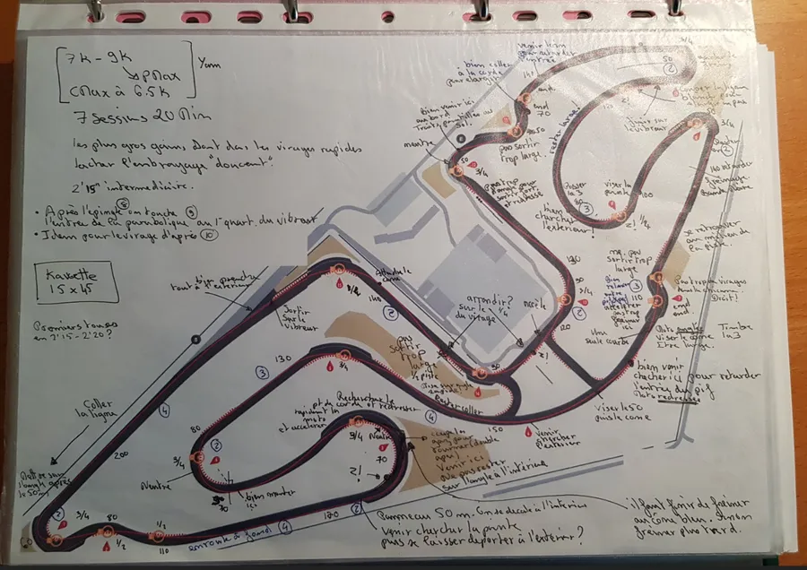
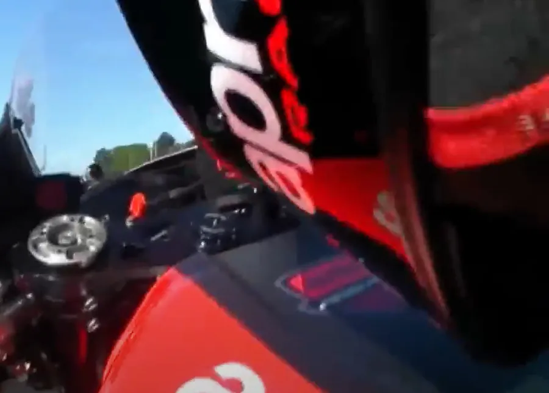
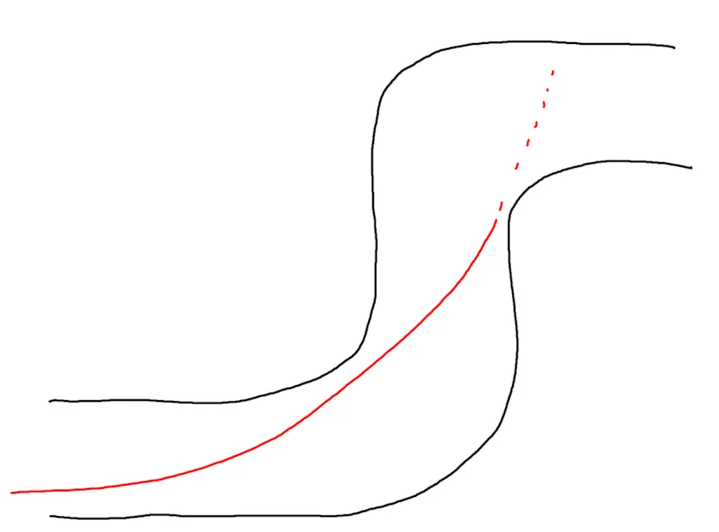

# {{ page.title }}
{: .no_toc }

{{ page.description }}
{: .lead }

## Plan de la Note de Pilotage
{: .no_toc .text-delta}
- TOC
{:toc}

Tu as dormi peu la nuit dernière... Endormis tard, tu t'es levé à 5H30. Dans la voiture tu as fait le mariolle devant les autres mais bon, tu es excité comme une puce et ça gargouille un peu au niveau des intestins... Il est maintenant 9H35, tu as passé le sonomètre et assisté au briefing. Un marshal a peut-être organisé une petite réunion à l'intention des "débutants" pendant que ceux du groupe "des hargneux" ouvraient le bal. Quoiqu'il en soit, il est 9H37 et les débutants doivent prendre possession du circuit dans 3 minutes. Tu mets les pieds et les roues pour la première fois sur un circuit et c'est à ce moment-là que tu te demandes comment ça va se passer et si tu t'es pas embringué dans un plan galère...

<!-- ###################################################################### -->
<!-- ###################################################################### -->
## Objectifs de la session

1. Découvrir la piste en roulant à **75% de nos capacités**.
1. En ligne droite, **se coucher sur la moto**.

<!-- ###################################################################### -->
<!-- ###################################################################### -->
## Prérequis

### Prises de notes
{: .no_toc }

{: .no_toc }

* Je ne connais pas la piste **mais** j'ai étudié les trajectoires sur [YouTube](https://www.youtube.com/playlist?list=PLOmfq6wDOTY7St0LApT2rQh3fsZKbvYUS)

* Est-ce que j'ai une feuille imprimée avec le tracé du circuit et mes notes manuscrites? Typiquement ces notes manuscrites sont prises en regardant YouTube à 75% ou même à 50% de la vitesse normale. Il ne faut pas hésiter à chercher les séances Duo Run de [DRRS](https://www.drrs-moto.com/) où le moniteur fait des remarques au stagiaire. Il faut éviter de regarder les vidéos de pilotes pros ou de record du tour. Leurs marques de freinage, leur vitesse d'exécution n'ont rien à voir avec ce que l'on peut faire. Le seul truc qu'on a en commun avec les pros ce sont les points de corde. Bref, idéalement la découverte de la piste doit se faire avec un "prof". Un bon exemple ci-dessous au Vigeant :

<figure style="max-width: 560px; margin: auto;">

    <iframe
    src="https://www.youtube.com/embed/ifJmAPjkvX0?start=0"
    title="I'm a legend"
    style="position: absolute; inset: 0; width: 100%; height: 100%;"
    allowfullscreen>
    </iframe>

<figcaption style="text-align: center;">
    I'm a legend
</figcaption>
</figure>

### Dans la tête
{: .no_toc }

* Est-ce que je suis capable de faire un tour de circuit "dans ma tête"? Rigolez pas, c'est plus important qu'il n'y paraît. On déclenche le chrono sur son téléphone, on ferme les yeux, on fait un tour complet dans sa tête, on arrête le chrono, on ouvre les yeux et on regarde le temps.
Afin que le chrono d'un tour "dans la tête" soit similaire au chrono d'un tour réel, il faut, pour chaque virage, avoir des points de repère : point de freinage, point de mise sur l'angle, point de corde, point de sortie.
Il faut aussi avoir tout un ensemble de marques tout au long du circuit : je vise le grand arbre, je passe sur la marque jaune, sous la passerelle je suis à gauche de la piste, je fais bien attention d'arriver sur le virage en posant mes roues sur la ligne blanche, à l'extrême droite de la piste...
* Est-ce que je visualise bien les enchaînements de virages? Est-ce que je peux les réciter sans hésitation à voix haute? : Ligne droite, un gauche serré, un pif, un paf, un grand gauche…
* Deux ou trois jours avant d'aller rouler, dans les embouteillages par exemple, c'est un bon moyen de faire passer le temps. Faut juste penser à mettre la feuille avec la piste et ses notes sur le siège passager.

### Sur papier
{: .no_toc }

* Est-ce que je peux "dessiner" (plus ou moins fidèlement) la piste sur une feuille de papier? C'est toujours le même principe... Faut qu'on arrive à avoir la piste en tête avant d'arriver.
* J'ai identifié les virages sur lesquels il va falloir porter une attention particulière durant la session. Dans ce contexte cela veut dire que dans ces virages on passe sur le point de corde au millimètre près. S'il faut diviser par 2 la vitesse dans le virage, tant pis, on pourra toujours l'augmenter ensuite. Les virages importants sont :
    1. Les virages avant les longues lignes droites
    1. Les grands virages rapides

<figure style="max-width: 560px; margin: auto; text-align: center;">

<figcaption>I'm a legend</figcaption>
</figure>

### Pression des pneus
{: .no_toc }

La marshal en a parlé lors de son briefing pour les débutants. En cas de doute 1.9 AR et 2.1 à l'AV. Y a forcément un compresseur et un manomètre quelque part. Ne suppose pas que tes pressions sont bonnes, vérifie-les. Personne ne peut le faire à ta place et je suis pas ta mère.

<!-- ###################################################################### -->
<!-- ###################################################################### -->
## Petit rappel utile avant de rentrer sur le circuit

On ne pourra pas dire qu'on n'en a pas parlé...

* Petit coup d'œil derrière, sur la piste, avant de rentrer
    * Je lève mes fesses de la selle et je tourne franchement la tête et le haut du corps pour vraiment voir ce qui arrive. Si on reste assis, il ne faut pas hésiter à lâcher la main du côté vers lequel on tourne le buste.
* Ne **PAS** prendre la corde du tout premier virage
    * On rentre sur le circuit, généralement, dans une ligne droite
    * Si on va à la corde du premier virage, au bout de la ligne droite, on peut se faire percuter par un gars qui est sur la piste depuis un moment et qui est lancé
* Si on n'a pas de **couvertures chauffantes** alors on a gagné 2 tours de chauffe
    * Accélérations franches en ligne droite pour le pneu arrière
    * Freinages progressivement de plus en plus appuyés pour le pneu avant
    * **PAS** de zigzag. Ça ne sert strictement à rien
* On se fiche du chrono lors des tours de chauffe.
* Rouler très à l'aise, 2/3 de ses possibilités, ne pas se mettre en mode panique
* Au 3eme tour on monte gentiment à 3/4 de ses possibilités car c'est une session de travail (on n'est pas là pour claquer une pendule)

<!-- ###################################################################### -->
<!-- ###################################################################### -->
## La session

### Pas de pression
{: .no_toc }

C'est un loisir. On est là pour ce faire plaisir. Le principe est donc simple : pas de pression.
Lors de découverte de la piste on souhaite juste prendre nos marques sur le circuit en roulant à 75% de nos capacités.
En plus, il faut que notre cerveau s'habitue à la vitesse et qu'il ait suffisamment de bande passante pour bien enregistrer ce qui se passe. Si on brûle les étapes, si on va trop vite, si on se met dans le rouge, on ne va pas pouvoir apprendre le circuit. On va "oublier" de se coucher sur la moto et finalement ce sera une session pour rien.

### Les pieds
{: .no_toc }

Imagine que tu saute à la corde. Quand tu atterris tu es sur la partie la plus large de tes pieds (normal, faut répartir la pression au maximum). Eh bien c'est cette partie du pied que tu dois faire reposer sur tes reposes pieds. Pas la pointe du pied ni le talon, non, non, juste cette partie. Oui, faut plier les genoux. Oui, ça fait bizarre mais oui, tu peux anticiper l'action. Par exemple, les semaines qui précèdent la journée de roulage quand prends l'habitude de poser tes pieds de cette façon quand tu es sur route.

### Utilise toute la piste
{: .no_toc }

* Je roule à gauche si le prochain virage est à droite.
* Je roule à droite si le prochain virage est à gauche.
* Dans les 2 cas je suis à **1cm de la bande blanche**. Je ne suis pas à 1m ou à 25cm. Non, non, je roule à 1cm de la bande blanche.

### La chasse aux cônes
{: .no_toc }

* C'est comme à Pâques lors de la chasse au oeufs. Normalement, sur chaque virage il y aura 3 cônes. Un à l'entrée et à l'extérieur du virage (au bout du vibreur typiquement). Un second à l'intérieur du virage. Un dernier à la sortie et à l'extérieur du virage, lui aussi au bout du vibreur.
* Comme tu es à 75% de tes capacités, prends le temps de les repérer.
* Prends aussi le temps de remarquer que plus le virage est serré, plus le cône intérieur est loin dans le virage. Par exemple dans un virage en épingle tu vas le trouver au 3/4 du virage.
* Idéalement, plus tard, tu devra faire passer tes roues à 1cm de chacun d'entre eux.
    * Pour le 1 et le 3 c'est trop facile car tu roules, tout à gauche ou tout à droite sur la piste. J'en parle même pas. Trop facile je te dis.
    * Le second cône lui par contre... Good luck. On en reparle plus tard.
* Pour l'instant, t'es à 75%, en mode repérage, donc tu note juste où sont les cônes et garde en tête qu'à terme tu veux faire passer tes roues dessus (j'ai bien dis tes roues)

<!-- ###################################################################### -->
<!-- ###################################################################### -->
## À la fin de la session

### Est-ce que tu as la banane ?
{: .no_toc }

Parce qu'en revenant de cette session de découverte de la piste c'est le plus important. Le reste on s'en fout... Faut être clair... En ce qui me concerne, ma carrière en moto GP est plutôt derrière moi 😡. Quant à toi, si tu lis ces pages... Ben, ce n'est pas gagné les "Grid Girls" à tes côtés l'année prochaine. Donc, bref, ce qui compte c'est de s'être fait plaisir 😁.

Alors...Est-ce que tu t'es fait plaisir? Si c'est le cas, bravo. Tu peux être très fier de toi. Ça veut dire que tu as roulé suffisamment lentement pour avoir assez de bande passante afin que ton cerveau réalise et mémorise tout ce qui s'est passé.

### De retour sur l'aire plane
{: .no_toc }

* Tu bois un coup d'eau, tu nettoies la visière et tu te remets de tes émotions
* Pour le reste tu as 40 minutes avant la prochaine session. On est laaarge...
    * Attention, y a peut être un debriefing avec le marshall. Vas-y, y a toujours des choses à apprendre.
* Allez, encore un petit effort. Prends le temps de noter tes impressions, par écrit, virage par virage, sur la feuille de papier que tu utilisais en regardant YouTube.

### Est-ce que je me suis couché sur la moto ?
{: .no_toc }

Ça, ça veut dire que je suis couché, en position aérodynamique dans les lignes droites et les longs virages. Cela n'a l'air de rien mais comme on ne le fait jamais sur route, on a tendance à avoir une position de motard de la Gendarmerie Nationale. C'est gênant car si on ne prend pas l'habitude tout de suite de se coucher, il sera d'autant plus difficile de s'y mettre plus tard.

Oui, je sais, ça fait bizarre. D'un côté on dit qu'on roule à 75% de nos moyens et de l'autre on dit qu'il faut se positionner comme si on devait aller chercher le dernier centième de seconde. En fait, ce n'est pas contradictoire avec la session de découverte de la piste. On est sur circuit, on apprend des choses nouvelles et l'une des toutes premières c'est le positionnement sur la moto dans les lignes droites et les virages rapides.

Bref, en ligne droite il ne faut plus de bras tendus, de nez au vent... Non, non, on est menton sur le réservoir, bras pliés et resserrés sur ce dernier. Quand je dis menton, c'est vraiment ça. Le casque doit toucher le réservoir (tu dois entendre le "poc"). Il ne faut pas hésiter à s’entraîner à la maison, en statique dans le garage avec le casque sur la tête. Cela permet vraiment de voir ce que cela donne. Quand l'avant du casque touche le réservoir, qu'est-ce que je vois devant? Rien, pas grand-chose... Si je veux que ma vision passe juste au-dessus du tableau de bord comment je dois être sur la moto? Est-ce que mes coudes touchent mes genoux, est-ce qu'il y a de la place (ou pas) ... Enfin bref, autant prendre 15 minutes dans le garage ou l'aire plane du circuit pour vérifier tout ça.

Faudra en profiter pour mettre du scotch à peinture bleu sur le compteur (pas la peine d'être tenté de regarder autre chose que la piste le jour du roulage).

Si c'est difficile ou si cela ne passe pas au niveau des bras, pense à reculer tes fesses sur la selle. Si tu es très grand, n'hésite pas à les pousser jusqu'à la section du passager ou alors à carrément t’asseoir sur le dosseret de selle (mais là à mon avis tu mesures 2 m ou tu roules en Piwi).

<figure style="max-width: 560px; margin: auto; text-align: center;">

<figcaption>I'm a legend</figcaption>
</figure>

Bref, on a "l'air d'un coureur" même si pour l'instant les chronos ne sont pas encore là. Perso j'ai un mal de chien à le faire car je me casse les cervicales et que je ne vois pas grand-chose... En plus ce n'est toujours pas devenu un réflexe naturel... Y a du boulot...

### À propos des cônes
{: .no_toc }

* Tu peux indiquer, pour chaque virage où sont les cônes sur ton plan de la piste ?
* En fin de session, pour chaque virage, il faudrait avoir identifié :
    * Le point de freinage (**PF**). Point où on commence à freiner.
    * Le point de mise sur l'angle (**PMSA**). Point où on fait basculer la moto. Le premier cône.
    * Le point de corde (**PC**, apex en anglais US). L'unique point où les pneus de la moto se trouvent à la corde. Le second cône.
    * Le point de sortie (**PS**). Le troisième cône.

### Les rapports
{: .no_toc }

* Je sais, on en a pas parlé, mais pour chaque virage, peux tu indiquer sur ton plan combien de rapport tu rentres (-2, -1, -3...) ?
* Si tu ne sais pas c'est pas grave. Lors de la prochaine session notes l'information pour 1 ou 2 virages puis encore pour 1 ou 2 virages à la session d'après. En fin de journée tu auras couvert tout le circuit.
* En session tu n'as pas de temps à consacrer aux rétrogradages et il ne faut pas regarder ton tableau de bord. Afin de te libérer la tête apprends le nombre de rapport à rentrer à chaque virage.

<!-- ###################################################################### -->
<!-- ###################################################################### -->
## Remarques

### Avant de partir
{: .no_toc }

Il faudra bien se couvrir... Ça on sait. Cela dit, pense peut-être à bien remonter l'avant de ton casque quitte à avoir l'impression que ton menton ressort (ça fait bizarre au départ). Le truc c'est qu'une fois couché sur la moto, si ton casque est positionné comme pour la route tu ne vas pas voir grand-chose ou tu vas t'exploser les cervicales. Si tu oublies à le première session, crois moi, tu le feras à la seconde session 😂.

### Est-ce que tu n'a pas roulé trop vite?
{: .no_toc }

Encore une fois, on est en mode découverte de la piste. Il faut donc savoir rester à 75% de nos capacités ou en tout cas à en garder sous le pied.

En ce qui me concerne, j'ai beaucoup de mal à m'y tenir et à ne pas me mettre rapidement dans le rouge. En effet, au bout de trois tours, j'ai qu'une envie, c'est d'aller "bouffer" celui qui est devant moi. C'est idiot... Je n'apprends rien et je ne progresse pas lors de ces sessions.

Il faut aussi avoir le courage de retomber à 2/3 de ses capacités pour étudier certains virages qui posent des problèmes.

Il ne faut pas hésiter non plus à sortir de la piste et à s'arrêter devant le gars qui autorise les rentrées sur piste. Ça casse le rythme et ça calme les esprits...

### Est-ce que tu étais bien relâché et détendu?
{: .no_toc }

On ne peut pas tenir 7 sessions de 20 minutes par jour si on n'est pas détendu sur la moto. De même, comment être efficace à l'approche du prochain virage si on est tendu comme une corde dans la ligne droite qui le précède? On n'a pas le choix, il faut se ménager des "aires de repos" où on peut reprendre notre souffle (ou s'assurer qu'on n'est pas en apnée), relâcher ses mains, ses doigts, ses bras etc.

Typiquement, je dois être capable de relâcher mon grip, de détendre mes doigts et d'aller tripoter le levier d'embrayage.

Dans un même ordre d'idée, en ligne droite je dois être capable de tenir l'accélérateur avec 3 doigts et avec la paume de la main décollée de la poignée. Qui a dit qu'il fallait être crispé et avoir une force de taureau pour enrouler une poignée de gaz? Prends le temps de regarder cette vidéo par exemple. Instructif...

<figure style="max-width: 560px; margin: auto;">

    <iframe
    src="https://www.youtube.com/embed/h24XjzybrA0?start=0"
    title="I'm a legend"
    style="position: absolute; inset: 0; width: 100%; height: 100%;"
    allowfullscreen>
    </iframe>

<figcaption style="text-align: center;">
    I'm a legend
</figcaption>
</figure>

De même, en ligne droite ou bien quand la moto est sur l'angle, je peux écarter mes coudes du corps. Je suis re-lâ-ché, je peux lâcher la main gauche (tu connais ta droite de ta gauche au fait?) et faire coucou au photographe...

<!-- ### J'insiste. Est-ce que tu es relâché sur la moto ?

Nos premières sessions sont des sessions de découverte de la piste. On est à 75% de nos possibilités. Donc, autant faire l'effort d'être relâché. Non ?

Il faut donc vérifier régulièrement qu'on n'a pas tendance à s'accrocher au guidon. -->

### Être relâché ça veut dire
{: .no_toc }

* Être capable d'écarter et de rapprocher les coudes du corps (Chicken Wings)
* Être capable de changer le grip (la façon de tenir) sur les poignées quand on est sur l'angle.
* Avant et dans le virage, sentir que le buste est mobile et qu'on plie bien le coude intérieur.
* Avant un virage, à la fin du freinage ne pas sentir qu'on force comme un "dahu" sur les avant-bras afin de les garder tendus avec le secret espoir d'enfoncer l'avant de la moto dans le sol. À la fin du freinage, quand on relâche progressivement la poignée de frein, on est de plus en plus "lite" sur le frein avant, on utilise le poids du corps (tête et buste) pour appuyer l'avant de la moto. Les bras ne sont donc pas tendus. Au contraire, à la fin du freinage, les bras se plient pour nous permettre de pencher le buste et approcher la tête vers la poignée qui est à l'intérieur du virage. Mais bon n'anticipons pas... À ce stade retiens juste que tu dois éviter d'être trop tendu au niveau des bras à la fin du freinage.

Alors que la moto roule en ligne droite, afin de confirmer qu'on est "Zen" on peut vérifier qu'on est capable de faire des :
1. **Chicken Wings** : être capable de faire le poulet en levant et en baissant les coudes. Oui, oui je confirme, on est ridicule...
1. **Doigts de Sauron** : être capable d'étirer ses doigts et d'aller les poser sur les leviers d'embrayage. Côté accélérateur, on tient ce dernier à 3 doigts et la paume est écartée de la poignée.

En sortie de virage, la tête de fourche peut bouger si on est pas détendu et si l’accélération est trop brutale. Pour éviter ce phénomène, dans les virages il suffit d'avoir des accélérations précoces, douces et continues. Je dis "il suffit" car c'est vraiment la seule chose qu'il y a à faire. C'est tellement facile... Je me demande bien pourquoi on est pas tous en Moto GP...

### Être accroché au guidon nous fait sortir large
{: .no_toc }

1. Je suis en virage
1. Comme je ne suis pas détendu, je suis accroché au guidon je tire dessus (c'est mécanique)
1. Je tire plus sur le bracelet intérieur car c'est celui qui est le plus accessible (mon bras intérieur est plié donc c'est plus facile de tirer).
1. Donc on contre-braque
    * Si ce n'est pas clair cette histoire de contre-braquage, il faut juste se rappeler qu'en entrée de virage, je pousse sur le bracelet intérieur au virage (qu'on le veuille ou non, qu'on le sente ou non, qu'on le fasse sciemment ou non)
    * Autrement dit la moto tourne
        1. Du côté du bracelet que je pousse
        1. Du côté opposé du bracelet que je tire.
    * Relisez le second point précédent. "Si je tire d'un côté, la moto va tourner de l'autre...". Si je tire (au lieu de pousser) sur le bracelet intérieur, la moto va se diriger de l'autre côté. Pour cela elle va se relever et elle va élargir le virage.
1. Donc, dans un virage, quand on tire sur le bracelet intérieur, on relève la moto
1. Conclusion : quand je suis accroché au guidon en virage, je tire sur le bracelet intérieur ce qui relève la moto et c'est ça qui me fait élargir (ou m'empêche d'atteindre le point de corde à 1 cm près).

La solution? Être détendu au guidon, zen, relâché...

### Être accroché au guidon amplifies les guidonnages (wobble, tank slapper)
{: .no_toc }

<!-- #### À propos des guidonnages (wobble, tank slapper) -->

* Les mouvements de fourche sont nécessaires. Ils font partie du système de la suspension (pneus et fourche)
* Les guidonnages arrivent quand les pneus et la fourche ont atteint leurs limites
* Il y a alors un changement de la charge sur les pneus qui se répercute dans la fourche qui rebondi en ne revenant pas de suite à sa position d'équilibre
* Personne n'a la force d'empêcher les mouvements de la tête de fourche
* Normalement les vibrations de l'avant ne se propagent pas au reste de la moto
* Sauf... Sauf si le pilote est accroché au guidon (les motos rouleraient bien mieux si il n'y avait pas de pilote...)
    * [Exemple de guidonnage](https://www.facebook.com/MotoGP/videos/quartararos-super-scary-sachsenring-moment-at-262kmh/343457489889047/)
    * [Article complémentaire](http://www.lerepairedesmotards.com/conseils/guidonnage.php)

Si la tête de fourche secoue en sortie de virage, si la moto est correctement entretenue, cela ira tout aussi mal si on serre les bracelets. Afin de s'économiser physiquement, il est donc plus efficace de relâcher les bracelets. C'est tellement facile à dire devant un écran de PC...

Bref, autant relâcher les bracelets et laisser la moto s'auto réguler.

<!-- ###################################################################### -->
<!-- ###################################################################### -->
## La suite au prochain épisode

Bon, allez, la suite au prochain numéro. D’ici-là relisez les [notes de pilotage]() ou faites des squats afin de préparer les prochains roulages.

<figure style="max-width: 560px; margin: auto;">

    <iframe
    src="https://www.youtube.com/embed/TIhtpItTuxc?start=53"
    title="I'm a legend"
    style="position: absolute; inset: 0; width: 100%; height: 100%;"
    allowfullscreen>
    </iframe>

<figcaption style="text-align: center;">
    I'm a legend
</figcaption>
</figure>

<!-- ### En cas de wheeling il faudrait...

* Rester couché, s'avancer sur le réservoir, le nez dans la bulle, fesses "soulagées " par les cuisses, en poussant sur les cales pied (sur circuit, faut finir par avoir la marque des cale-pieds sous nos semelles)
* Ne pas serrer trop fort le guidon quand la roue retouchera le sol
* C'est une évidence, mais quand la roue est en l'air, on ne touche surtout pas le frein avant mais on peut toucher le frein arrière pour faire baisser le nez de la moto.
 -->

<!-- ### Est-ce qu'il y a des sorties de virages où tu pourrais sortir moins large?

Oui, oui, c'est contre intuitif car on a beau être débutant et dans une première session de découverte de la piste, on a tous en tête le mantra "Extérieur, Intérieur, Extérieur".

Le truc c'est que s'il faut au début bien penser à utiliser toute la largeur de piste en entrée et en sortie, dès qu'on est un peu plus à l'aise en sortie de tel ou tel virage, il faut alors faire l'effort de resserrer cette dernière.

L'idée, c'est qu'en faisant ainsi, on aura de la marge pour plus tard quand on accélérera beaucoup plus fort au point de corde et en sortie. On prépare l'avenir. Malin...

Un truc qui peut aider au début c'est de se forcer, en sortie de virage, à garder la tête en position basse, sur le côté de la moto alors que cette dernière est en position presque verticale. -->

<!-- ### Est-ce que tu as eu le temps de regarder où passent les marshall et les plus rapides et de les copier si cela a du sens?

Choisissez des gars qui, avant un virage, sont complètement à l'extérieur de la piste (limite à rouler sur la ligne blanche). Pensez aussi à repérer le marshal s'il tourne avec vous sur la piste et bien sûr s'il a adapté son rythme à celui de la session. À notre niveau, il faut regarder une seule chose... Son point de corde.

Ne suivez pas un gars qui vient de vous faire l'intérieur. Il est peut-être complètement à la ramasse, en perdition sur ses freins etc.

Ne suivez pas non plus un gars qui a un 1000 alors que vous roulez en 600. Il roule au couple et pas vous.

Idem si vous êtes en 600 et qu'un gamin en Yam R3 vous met 10" au tour (ptit con!). Il n'a pas le même moteur, et donc pas les mêmes trajectoires. -->

<!--
## Conclusion temporaire

Je réalise que cela fait beaucoup de choses pour une session de découverte de la piste... Ici ma recommandation est la suivante : si tu n'es pas sûr d'ouvrir en grand dès que tu le peux ou si tu n'es pas sûr d'être couché sur la moto à la moindre occasion... Prends ton temps, refais une session, reste bien à 75% de tes capacités et travaille ces deux aspects de ton pilotage.
Maj 17 03 23 : Par exemple à la prochaine session donnes toi pour objectif de sentir que la poignée d'accélérateur arrive en butée à plusieurs endroits du circuit (là tu es sûr d'être 100% gaz). Pour la session d'après, en plus de l'ouverture des gaz à 100%, fixes toi comme objectif de sentir ton menton sur le réservoir à tel ou tel endroit du circuit. Tu auras préalablement choisi ces endroits sur ton plan.

À ce stade les trajectoires, la position, les chronos on s'en fout... Pense juste à te coucher et à ouvrir à 100%. Une fois que ça c'est en place, applique-toi à rentrer suffisamment **lentement** dans les virages pour placer tes roues sur le point de corde à chaque tour. Ou bien... Applique-toi à rentrer suffisamment vite dans les virages pour pouvoir rejoindre le point de corde et placer tes roues sur le point de corde à chaque tour. Généralement on (je) freine trop avant le virage, je rentre trop lentement et la moto n'a pas assez d'inertie pour rejoindre le point de corde toute seule. Au tour suivant je ne fais pas l'effort de freiner plus tard ou de freiner moins fort pour rentrer avec plus de vitesse dans le virage. La trouille? Peut-être... Mais c'est idiot car comme on rentre sans freiner, ni accélérer, rien ne peut arriver... Enfin bref, "100 fois sur le métier, remettez votre ouvrage...". De toute façon je reviens sur ces histoires de point de corde dans l'article suivant.

Oui, oui il y a des pilotes qui roulent beaucoup plus vite... Je confirme, tes trajectoires ne sont pas au top... Oui, oui tu te fais avoir par beaucoup de monde au freinage... Cela dit, **avant de courir il faut savoir marcher**. Donc, refais une première session et acquiers de bonnes bases sur lesquelles tu pourras construire quelque chose.
-->

<!-- ### À vérifier pendant la session

* Que la fin des vibreurs des lignes droites sont les points de mise sur l'angle du virage qui suit.
    * Si ce n'est pas le cas, quel repère fixe on peut prendre pour la mise sur l'angle ?
    * Y a des cônes sur le bord de la piste ?
    * Si je vois un gars beaucoup plus rapide que moi et qui colle vraiment à l'extérieur de la ligne droite qui précède un virage, est-ce que j'ai noté où il débutait sa mise sur l'angle ?
* Vérifier que dans les virages le point de corde est bien matérialisé par un cône au 3/4 du virage (late apex)
    * Si ce n'est pas le cas, quelle est la marque fixe à utiliser ?
    * S'il n'y a pas de cône, alors, si je découpe le vibreur intérieur en 4 sections, où est le point de corde ?
    * Pourquoi le cône n'est pas au 3/4? C'est un virage qui se resserre, qui s'ouvre, un double virage…
* Si le virage est grand et à rayon constant on va sans doute le prendre en double apex (le 2 à LFG ou le 8 des Ecuyers par exemple)
* Si c'est une épingle, il faut tirer tout droit, s'écarter du virage, plonger en retard et choper le point de corde au bout du quatrième quart du vibreur
* Dans un pif paf, on "sacrifie" le pif pour "sauver" le paf. Pas d'angoisse, il y a une fiche dédiée au [pif-paf] NOT YET TRANSFERED (https://www.40tude.fr/pilotage-moto-08-pif-paf/). Cela dit, on ne rentre pas trop vite afin de ne pas sortir trop large du pif. En effet, comme il faut favoriser la sortie du paf il faut s'arranger pour être bien placé à l'extérieur avant l'entrée du paf. Si on rentre trop vite dans le pif, on va sortir large et va se retrouver à la corde du paf et on sera coincé (voir schéma ci-dessous)

<figure style="max-width: 560px; margin: auto; text-align: center;">

<figcaption>I'm a legend</figcaption>
</figure> -->

<!-- ### Est-ce que tu es bien resté large en entrée de virage ?

"Arrêtes de plonger à la corde dès que tu peux car tu vas être dans les soucis à la sortie !" -->

