# Décomposition des virages
{: .no_toc }

## Table of Contents
{: .no_toc .text-delta}
- TOC
{:toc}

J'essaie de courir régulièrement et mon parcours est un peu toujours le même. Là, je sais que le trottoir est vraiment incliné, ici y a une chaîne entre des plots etc. Je sais où je vais, j'ai mes points de repère et je peux quasiment dire si je suis en avance ou en retard sans regarder ma montre.... Le fait de savoir comment ça va se passer me permet d'anticiper, d'être plus à l'aise et de me concentrer sur l'essentiel. 

La décomposition des virages se propose de faire la même chose. C'est un outil qui va nous permettre d'anticiper, de savoir comment ça va se passer, de libérer notre esprit et d'être plus régulier tour après tour.

<!-- ###################################################################### -->
<!-- ###################################################################### -->
## Objectif de la session

La décomposition des virages c'est apprendre à porter son regard
1. Sur le point de corde **AVANT** le point de mise sur l'angle (PMSA)
1. Sur le point de sortie **AVANT** d'être passé par le point de corde (PC, apex)

Le virage est ainsi découpé en 3 étapes :
1. Avant le PMSA
1. Du PMSA au PC (en passant par PV le point où on fait pivoter la moto)
1. Du PC au point de sortie (PS)

<!-- ###################################################################### -->
<!-- ###################################################################### -->
## Prérequis
* On "connaît" la piste et comme on a repéré les cônes, on a identifié les points de mise sur l'angle et les points de corde. Oui, oui je suis d'accord. On ne connaît peut-être pas encore tout le circuit par cœur. Il y a sans doute encore des sections qui posent des problèmes etc.
* Lire **ATOTW II** p 98 (ça parle de Two Steps mais nous ici on passe directement à Three Steps puisqu'on décompose le virage en 3 portions). En deux mots:
    * Two Steps va "over-simplifier" la lecture de l'entrée du virage avec uniquement 2 points de référence qu'on acquiert en avance de phase.
    * Nous ici on passe directement à 3 steps parce qu'on est trop fort ✊

{: .note }
**ATOW II** c'est LE bouquin [A Twist Of The Wrist](https://www.amazon.fr/Twist-Wrist-Vol-Performance-Motorcycle/dp/0965045021/ref%3Dsr_1_3?__mk_fr_FR=%C3%85M%C3%85%C5%BD%C3%95%C3%91&keywords=A+twist+of+the+Wrist&qid=1567893832&s=gateway&sr=8-3). Le livre commence à être un peu vieux mais fondamentalement tout y est.  
Il y a aussi une vidéo... Franchement elle, elle date carrément et franchement le jeu des acteurs n'est pas au top. Mais bon, elle reprend tout le contenu du bouquin. Elle dure une heure quand elle est d'un seul tenant mais ça vaut le coup. J'arrête de mettre un lien dans cette page car la vidéo est régulièrement supprimée de YouTube. Le mieux c'est encore d'aller sur YouTube et de faire une recherche sur "[a twist of the wrist](https://www.youtube.com/results?search_query=a+twist+of+the+wrist)".

<!-- ###################################################################### -->
<!-- ###################################################################### -->
## Petit rappel utile avant de rentrer sur le circuit

On ne pourra pas dire qu'on n'en a pas parlé...

* Petit coup d'œil derrière, sur la piste, avant de rentrer
    * Je lève mes fesses de la selle et je tourne franchement la tête et le haut du corps pour vraiment voir ce qui arrive. Si on reste assis, il ne faut pas hésiter à lâcher la main du côté vers lequel on tourne le buste.
* Ne **PAS** prendre la corde du tout premier virage
    * On rentre sur le circuit, généralement, dans une ligne droite
    * Si on va à la corde du premier virage, au bout de la ligne droite, on peut se faire percuter par un gars qui est sur la piste depuis un moment et qui est lancé
* Si on n'a pas de **couvertures chauffantes** alors on a gagné 2 tours de chauffe
    * Accélérations franches en ligne droite pour le pneu arrière
    * Freinages progressivement de plus en plus appuyés pour le pneu avant
    * **PAS** de zigzag. Ça ne sert strictement à rien
* On se fiche du chrono lors des tours de chauffe.
* Rouler très à l'aise, 2/3 de ses possibilités, ne pas se mettre en mode panique
* Au 3eme tour on monte gentiment à 3/4 de ses possibilités car c'est une session de travail (on n'est pas là pour claquer une pendule)

<!-- ###################################################################### -->
<!-- ###################################################################### -->
## La session

### Acquisition de données

Avant même l'entrée de virage :
* T1 : le premier temps de la décomposition des virages consiste à localiser le point de mise sur l'angle.
Point de mise sur l'angle = **PMSA** (turn-point).  
Cela se fait le plus tôt possible. Cela dit, à notre niveau, cela peut se faire avant ou pendant le freinage… Plus tard, la localisation du PMSA se fera systématiquement bien **AVANT** le freinage.
* T2 : localisation du point de corde (**PC**, apex)
Cela doit être fait pendant le freinage, **AVANT** d'arriver au PMSA.
L'apex peut se situer au milieu du virage mais plus généralement au 3/4 du virage. En règle générale, plus un virage est serré et plus le point de corde est retardé.
* T3 : localisation du point de sortie (**PS**) **AVANT** d'arriver sur l'apex.  
**AVANT** de faire passer les pneus sur le point de corde, avec le regard, on accroche le point de sortie PS et on ne le lâche plus.

Il faut donc **an-ti-ci-per** et accrocher du regard :
* Le point de corde (PC) alors qu'on se dirige vers le point de mise sur l'angle (PMSA)
* La point de sortie (PS) alors qu'on va rouler sur l'apex

Ci-dessous on voit bien que le pilote ne regarde pas du tout sa roue avant mais bien l'endroit où il veut aller

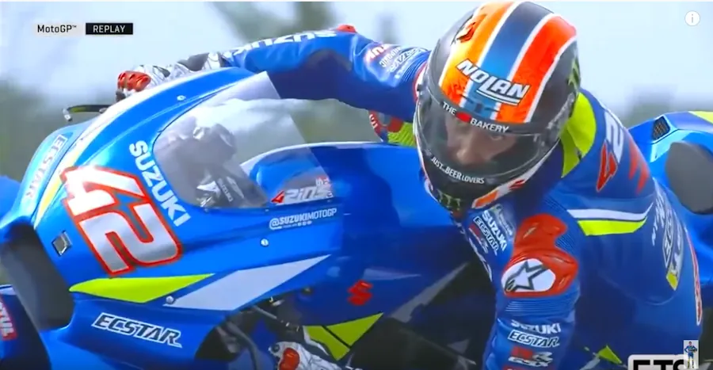

### Anticipation

L'anticipation permet d'être plus à l'aise et plus serein.

* On est en ligne droite
* On vise le cône ou la marque qui identifie le point de mise sur l'angle (facile on se dirige dessus)
* On tourne la tête (vers le point de corde) **AVANT** la mise sur l'angle proprement dite de la moto
* On repère le point où aller : le point de corde et **je ne le lâche plus des yeux**
* Au PMSA je mets la moto sur l'angle rapidement (quick steering, quick flick)
* **ACHTUNG!** Il faut laisser du temps entre les 2 phases.
  + Sinon on n'appellerait pas ça la décomposition des virages 😁
  + Plus sérieusement, on a tendance à aller trop vite entre le moment où on a repéré le point de corde et la mise sur l'angle
  + Il faut donc faire l'effort de viser le point de corde "longtemps" avant la mise sur l'angle effective. En d'autres mots cela veut dire qu'on continue de rouler tout droit, de freiner puis de faire la mise sur l'angle alors qu'on ne regarde QUE le point de corde et plus le PMSA. Un peu comme quand on était gamin et qu'à vélo on tournait la tête pour regarder la belle Rosalie qui marchait sur le trottoir.
* Une fois qu'on est sur l'angle et qu'on est sûr que nos roues vont passer sur le point de corde...
* Alors, on accroche du regard le point de sortie **AVANT** de passer sur le point de corde
* En fait, **on change d'objectif dès qu'on est sûr qu'on va passer sur le point de corde**

### Trouver la vitesse à laquelle on arrive à faire l'exercice
* Apprendre à marcher avant de courir...
* Après on pourra toujours augmenter la vitesse de passage.
* Il faut donc commencer par réduire sa vitesse de passage à 2/3 de nos capacités si besoin.
* Il n'y a pas de honte à avoir même si on se fait passer (pour l'instant)
* On est là pour travailler et apprendre un truc nouveau
* Acquérir le savoir-faire puis augmenter la vitesse de passage au fur et à mesure

<!-- ###################################################################### -->
<!-- ###################################################################### -->
## À la fin de la session

Il faut vraiment être conscient des différentes phases qui composent les virages :
* Instant où on localise le point de mise sur l'angle 
* Instant où on localise le point de corde
* Sentir qu'on se dirige vers le point de mise sur l'angle alors qu'on regarde le point de corde
* On passe sur l'angle en fixant le point de corde
* On fait pivoter la moto en fixant le point de corde
* Instant où on localise le point de sortie
* Faire passer ses pneus sur le point de corde avec les 2 roues dans la direction du PS
* On passe sur le point de corde en fixant le point de sortie

S'assurer qu'il y a bien un délai notable entre le repérage du point de corde et la mise sur l'angle car généralement on va trop vite.

En ayant 3 points ça "over-simplifie" le décodage du virage. Ça aide le cerveau à faire la part des choses et à ne pas être débordé.

Viser le point d'après, en avance de phase, permet de gagner en sérénité et de vraiment passer sur le point en question.

À notre niveau, on prend la fin du freinage en ligne droite comme point de départ de la mise sur l'angle. En d'autres mots, à notre niveau, on ne freine plus et on est gaz coupés lorsqu'on met la moto sur l'angle. Il ne peut donc RIEN arriver.

On se met sur l'angle en visant le point de corde. L'image ci-dessous illustre bien l'idée de "regarder où on veut aller".

Tout se passe comme s'il avait un hameçon dans le nez et qu'il était au bout d'une ficelle en train de tourner autour d'un piquet

<!-- ###################################################################### -->
<!-- ###################################################################### -->
## Remarques

### Le point de corde (PC)

Dans un virage il faut joindre PMSA (point de mise sur l'angle), PV (point de pivot), PC (point de corde) et PS (point de sortie) mais en plus, il faut qu'au PC les points de contacts des pneus indiquent la direction du point de sortie. Pour ne pas louper le PC il faut donc remplir 2 conditions simultanément :
1. Faire passer ses roues dessus (pas à 1m ni à 25cm, non, non, dessus)
1. La moto dans la direction de PS

J'exagère mais si on remonte le circuit, tout se passe comme si on tirait une droite de PS à PC jusqu'à PV.

* Quand on arrive sur un virage, il ne faut pas plonger trop tôt à la corde afin de ne pas y être coincé pendant 3 heures... 
    * Si c'est pas clair, imagine que tu es à la corde à l'entrée d'un grand virage qui est un demi-cercle. À partir de quand tu vas pouvoir accélérer? J'exagère à peine mais comme il va falloir attendre que tes roues indiquent la bonne direction tu ne pourras accélérer qu'à la toute fin du demi-cercle (ou presque).  
    Comme en plus ta trajectoire suit un cercle de faible rayon ta vitesse est faible (double peine).  
    Donc tu va passer 3H dans le virage et accélérer très tard.  
    Bref, t'es mort.
    * Regarde ci-dessous. En 1 et 2 si tu accélères tu sors dans les graviers. Il faut attendre d'être en 3 (ou un peu avant) pour pouvoir accélérer. 

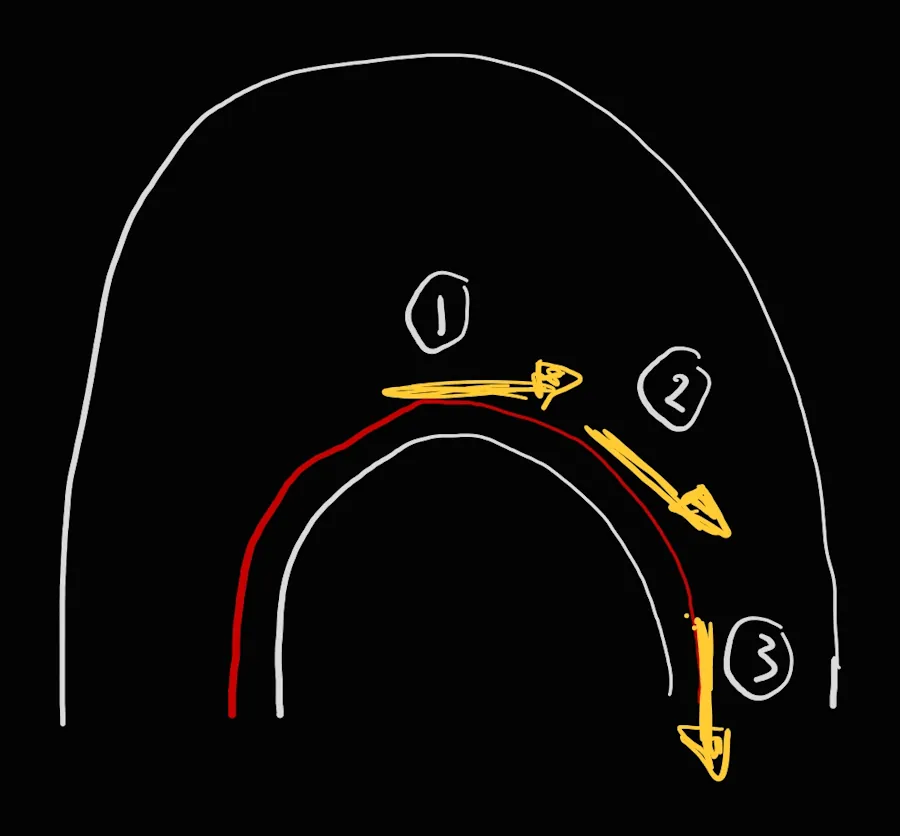

* Je le redis autrement... Si je me dirige trop tôt vers la corde, je me rassure, ma mise sur l'angle est lente etc. Mais... Mais je vais me retrouver très tôt à l'intérieur du virage. Là, je suis coincé, je ne peux rien faire : si j'accélère, je vais m'écarter et d'un autre côté je ne peux pas resserrer encore plus mon virage et finir par rouler dans l'herbe.... Bref, je peux juste attendre l'arrivée du cône libérateur qui marque le point de corde pour accélérer et sortir du virage.

* Le point de corde c'est... Un point. Donc mes pneus ne touchent les vibreurs qu'une fois, qu'une fraction de seconde.

* Le point de corde **ce n'est pas** un point qui se trouve au même niveau que le cône, à un mètre sur le goudron de piste. Nan, nan... Il faut vraiment que les **pneus** (pas le genou ou la tête, les pneus) passent sur les premiers millimètres de goudron à la verticale du cône.
    * Le corps est donc au-dessus du cône, du vibreur ou de l'herbe.
    * Ce qui compte c'est la position des pneus vis à vis du point de corde et pas la position du casque ou des sliders.
    * Comme on est à 75% de nos capacités il faut vraiment en profiter pour faire passer les pneus à un millimètre à la verticale du point de corde. 
    
Perso j'ai tendance à vouloir aller trop vite, trop rapidement. Je ne prends pas le temps d'assurer mes points de corde à "basse vitesse" puis à passer de plus en plus vite au fil des tours. C'est complètement idiot de ma part.

**Un exemple**

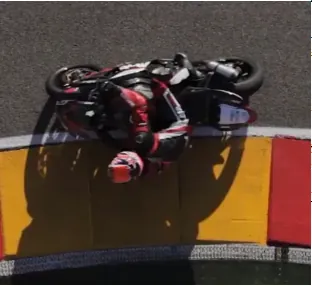

Oui…mais non

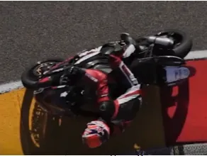

Oui. Notez la différence d'écartement des pneus vis à vis de la bande blanche.

Voir la vidéo associée. On est d'accord, "Body over the paint" ça veut bien dire "Le corps au-dessus de la peinture"...

<iframe width="560" height="315" src="https://www.youtube.com/embed/kfZlxpH2cZ0?si=cnNNl8Og5Z_6LiIj" title="YouTube video player" frameborder="0" allow="accelerometer; autoplay; clipboard-write; encrypted-media; gyroscope; picture-in-picture; web-share" referrerpolicy="strict-origin-when-cross-origin" allowfullscreen></iframe>

### Le point de pivot (PV)

C'est quoi l'objectif? On veut passer **sur** PC (le point de corde) en ayant les roues dans la direction de PS (le point de sortie). Dans le superbe crobar ci-dessous, tu arrives de la gauche et tu vas sortir par la droite (normalement).

Bon, ben vas-y, trace une droite qui va de PS à PC (voir les pointillés). Oui, oui je confirme on "remonte" le circuit. La droite "dépasse PC et s'enfonce dans le virage. 

Imagine... Imagine la situation théorique suivante. Là où la droite coupe l'extérieur du virage (un peu au-dessus du 1). Tu es à l'arrêt, tu oriente les roues de ton dragster (j'ai dis que c'était théorique, je fais ce que je veux...) selon la direction de la droite. C'est bon? Allez, 100% gaz...

Qu'est-ce qui va se passer? Rien. Tu vas sortir comme une balle du virage. Aucune chance d'aller dans les graviers et tu bénificeras de la plus longue durée d'accélération possible (tu pars du bord de la piste)

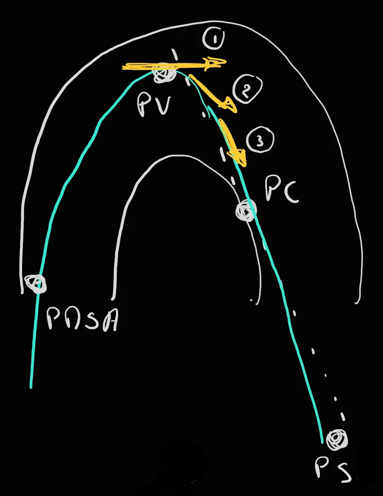

Il va donc falloir trouver un compromis entre "je roule collé à la corde" et "je pars du bord de la piste dans la bonne direction". Ce compromis c'est le point de pivot (PV ci-dessus).

On reprend... 
* Tu as terminé le freinage au PMSA et tu vise le PC avec ton menton
* Tu es gaz coupé et tes doigts ne touchent plus le levier de frein. 
* Tu ne plonges **PAS** à la corde
* Au contraire, tu restes large, tu as peu d'angle et tu "t'enfonces" dans le virage
* "Quand tu le sens" (tu es sur PV), tu fais pivoter très rapidement la moto en poussant fort sur le bracelet intérieur
* C'est possible car tu ne freine pas, tu n’accélère pas, tu ne fais rien. Il ne peut rien t'arriver.
* Tu arrêtes de faire pivoter la moto quand ses roues sont alignées sur la droite qui va de PC à PS
* Tu vises PS du menton. Là c'est facile tu es dans l'axe
* Tu commences à accélérer tout de suite après PV (pas en 2 mais en 3). Tu appliques la **Throttle Rule**. Il ne peux rien arriver car tes roues sont dans la bonne direction. Tu vas juste aller de plus en plus vite entre PV, PC et PS. Rien de plus. Plus la moto se relève plus tu enroule.
* N'hésites pas à tirer sur le bracelet intérieur pour aider la moto à se relever plus vite.

Si on compare avec le pilote qui reste collé à la corde: 
* Qui des deux a accéléré le premier ?
* Qui des deux va avoir l'accélération la plus longue?
* Qui va avoir la vitesse la plus élevée au PC?
* Qui des deux va être le premier 100% gaz, en butée?
* Qui va avoir la vitesse la plus élevée au bout de la ligne droite qui suit?

T'as compris le truc.

### Regarde avec ton menton

Un truc qui peut aider au début c'est de river ses yeux et son menton sur le point de corde. Notre menton et nos yeux vont changer de cible au fur et à mesure de notre avancement dans le virage mais ici l'idée c'est de s'entrainer en exagérant à faire abstraction du reste de la scene et d'être "focus" sur le point de corde.

J'arrive au virage, je chope le cône de PC du regard et du menton. Je ne regarde rien d'autre. Je fais abstraction de tout le reste et jusqu'à ce que je sois sur le point de rouler dessus (2 ou 3 motos de long) je ne le lâche pas. 

Faut vraiment sentir que notre tête s'incline au fur et à mesure qu'on approche du cône. Il ne faut pas regarder l'entrée du virage dans son ensemble. Faut être "laser focus" sur le cône (pense aux lasers des yeux de superman).

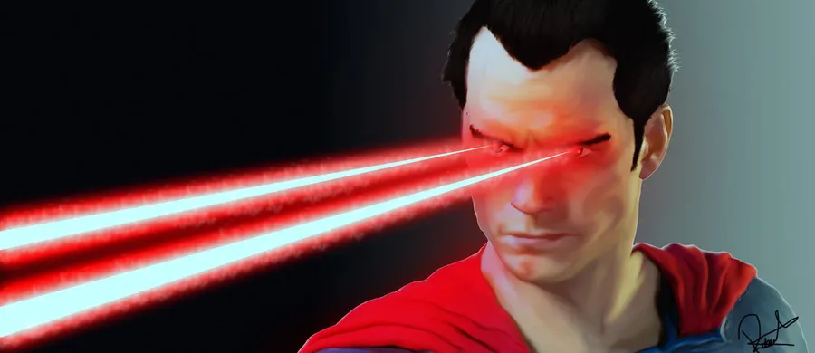

### Triche un peu
Si j'ai du mal à placer mes pneus parfaitement sur le point de corde, je peux appuyer légèrement sur le frein arrière. Ça permet de resserrer le virage et d'ajuster la trajectoire le cas échéant.

### Ta mise sur l'angle et le pivot sont trop lents

Prenons le cas où je suis trop tôt à la corde. Au prochain tour je ne change rien mais je retarde un peu (5 m, 2 motos de long) mon freinage. Je vais m'enfoncer un peu plus dans le virage et m'écarter de la corde, faire mon PV plus loin et passer sur PC.

Si on est d'accord sur le point précédent, si je suis constamment trop loin du cône du PC on va faire le contraire. Au prochain tour on ne change rien mais on freine plus tôt et on fait notre mise sur l'angle plus tôt. En faisant comme ça on ne se met pas dans le rouge en freinant plus fort ou en se mettant sur l'angle plus vite mais on va se rapprocher du point de corde.

Mais bon, faut pas se bercer d'illusions, nous sommes trop lents à la mise sur l'angle et surtout au PV. 

Je crois qu'on hésite car on se dit qu'on va être tellement rapide que l'avant ne va pas suivre et qu'on va le perdre. À notre niveau c'est très improbable. Oui on va perdre l'avant car on a repris les freins mais là... On ne freine plus, on accélère pas encore. Le pneu avant est bien ancré, le pilote n'applique aucune action parasite sur la moto. Aucune chance que ça parte en vrille cette histoire. 

Une solution c'est de faire du gymkhana entre des cônes. C'est un exercice qu'on fait en stage.

**Une image pour bien fixer les idées**

Le seul truc à regarder dans la photo ci-dessous c'est la position des pneus. Ils sont où ? Sur le bitume, à un mètre du vibreur ? Nan. À 10 centimètres ? Nan. À un millimètre ? Même pas en rêve ! Ils sont sur la bande blanche en train de lécher le vibreur.

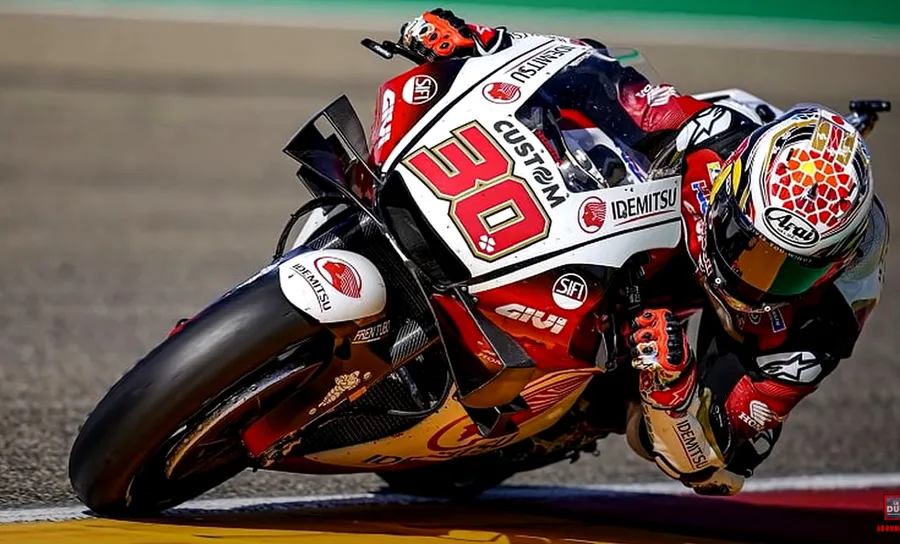

### Je suis lourd
Finalement, avec un peu de recul, je crois que c'est le placement des roues sur le point de corde (position **et** direction) qui est le plus important. Au début il faut donc aller doucement, placer ses roues puis tour après tour passer plus vite en plaçant toujours ses roues sur le point de corde. Il faut apprendre à avoir la tête sur l'herbe, au-delà du vibreur. Ensuite, et seulement ensuite il sera temps d'affiner son freinage, sa position sur la moto, le moment où on ré-accélère dans le virage... En effet, tout cela ne sera bénéfique que, si et seulement si, ils s'ajoutent à un placement correct des pneus au point de corde (**sur** PC **et** dans la direction de PS)

Prenons un exemple. Il est illusoire de vouloir améliorer son accélération en sortie de virage alors que mes roues ne passent toujours pas au point de corde. Pourquoi ? Tout simple. Je suis en intermédiaire, mes temps ne sont pas ridicules, j'ai, je pense des freinages de tueur etc. Je me dis qu'il faut maintenant que je soigne ma façon d'accélérer et de sortir des virages. Cela dit, je passe systématiquement à un mètre des points de corde (ma tête est au-dessus de la ligne blanche et/ou mon slider est sur la bande blanche).

Qu'est-ce qui va se passer ? Je vais peaufiner mon accélération, la vitesse à laquelle je redresse la moto en sortie de virage etc. Cela dit, je vais rapidement me heurter à un plafond de verre. En effet, comme mes pneus sont à un mètre du point de corde, mécaniquement j'ai moins d'espace pour élargir mon virage (il me manque 1 à 1.5 mètre). Le pire c'est que si je comprends qu'il faut que maintenant je soigne mes points de corde il sera trop tard (ou presque). J'aurai tellement de "mauvaises" habitudes qu'il sera très dur de revenir en arrière. En effet, cela revient à tout casser, à revenir aux fondamentaux et à tout reconstruire. Bref, ça va être long, pénible et frustrant. Autant partir sur de bonnes bases et commencer par soigner ses points de corde quitte à passer avec la moto verticale à 2 à l'heure (j'exagère bien sûr). Le reste, on verra plus tard.

Il ne faut pas passer à la suite tant qu'on n'est pas capable de les assurer à chaque tour. À ce point de notre formation (niveau Padawan première année...) on se fiche de la vitesse de passage et de la prise d'angle (les photographes on verra plus tard). Ça viendra naturellement par la suite lorsqu'on va accroître notre rythme. À ce moment-là, pour assurer nos points de corde nous n'aurons pas d'autre choix que d'augmenter la vitesse de nos mises sur l'angle (très important), comme on ira plus vite on devra aussi prendre plus d'angle et pour prendre plus d'angle nous devrons changer notre position sur la moto, sortir un genou etc. Et là, il sera temps d'appeler Canal+ pour faire un reportage.

**Une petite vidéo peut être...**

Dans la vidéo suivante il ne faut pas hésiter à mettre la vitesse de lecture à 50% ou à 25% et à regarder où passe la roue avant... Oui, oui je sais, il n'est pas trop en mode débutant... Quoiqu'il en soit, ce sont vraiment des passages au millimètre sur les bandes blanches...

<!-- https://youtu.be/Ym4SRjSKmoI -->

<iframe width="560" height="315" src="https://www.youtube.com/embed/Ym4SRjSKmoI?si=TxKZ0QJrkl6UXa5b" title="YouTube video player" frameborder="0" allow="accelerometer; autoplay; clipboard-write; encrypted-media; gyroscope; picture-in-picture; web-share" referrerpolicy="strict-origin-when-cross-origin" allowfullscreen></iframe>

**Un autre exemple**

Heu… Oui, oui je confirme, lui aussi est un peu au-delà de nos 75% mais c'est parce qu'il est jeune et enthousiaste… ✊

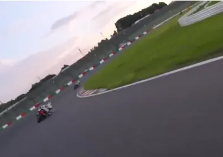

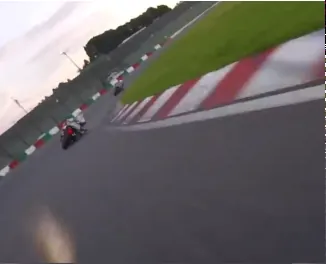

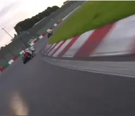

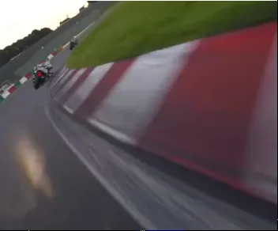

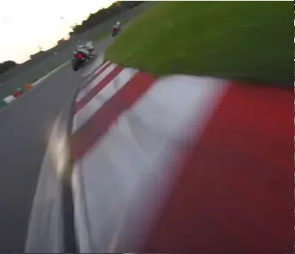

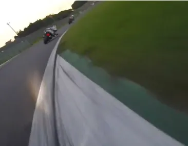

La vidéo complète est ci-dessous.

<!-- https://www.youtube.com/watch?v=0LA2pNlNNw0 -->

<iframe width="560" height="315" src="https://www.youtube.com/embed/0LA2pNlNNw0?si=b_x5V-D-BSLU1jnK" title="YouTube video player" frameborder="0" allow="accelerometer; autoplay; clipboard-write; encrypted-media; gyroscope; picture-in-picture; web-share" referrerpolicy="strict-origin-when-cross-origin" allowfullscreen></iframe>

### Ne pas louper un PC qu'on ne voit pas

* On est au point de mise sur l'angle
* Voir le cône jaune à gauche et en bas de l'écran
* On a regardé à l'intérieur du virage mais **on ne voit pas le PC**
* On voit juste la courbe intérieure

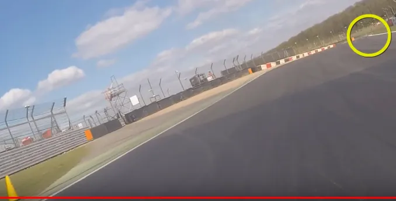

Alors qu'on passe sur l'angle, on continue à regarder l'intérieur de la courbe

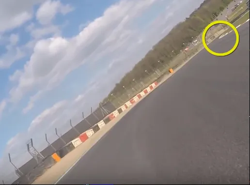

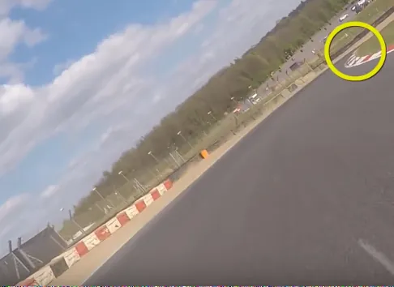

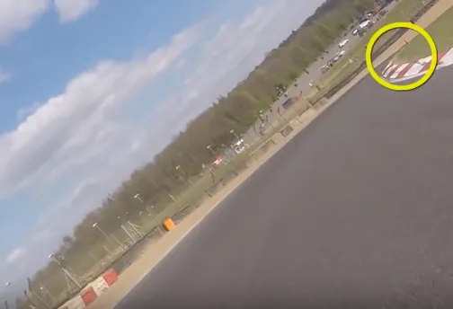

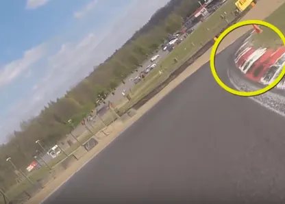

Quand on est sûr d'atteindre le point de corde, on passe à la suite et on vise le point de sortie. Là, pour le coup, on retrouve le schéma classique de la décomposition des virages qu'on a vu plus haut.

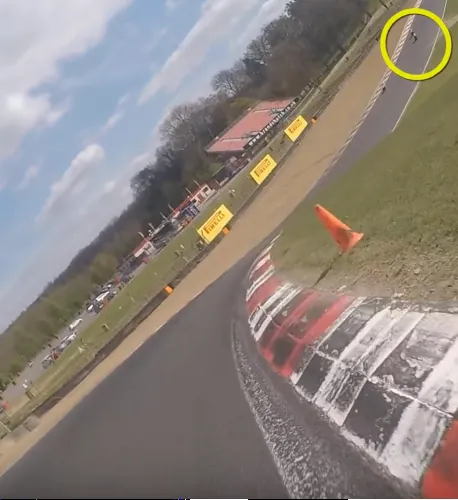

La vidéo dont sont issues les images précédentes

<iframe width="560" height="315" src="https://www.youtube.com/embed/t-QLEVNM7Ss?si=NzZ24xAL7jKubCsr" title="YouTube video player" frameborder="0" allow="accelerometer; autoplay; clipboard-write; encrypted-media; gyroscope; picture-in-picture; web-share" referrerpolicy="strict-origin-when-cross-origin" allowfullscreen></iframe>

Allez, une autre vidéo sur le sujet. J'aime bien la démo à **1:11** ainsi que les spots à **2:58**. Enfin bref, c'est en anglais mais c'est à voir.

<iframe width="560" height="315" src="https://www.youtube.com/embed/gCgvm5oVPWk?si=X17Rd2OHaicvbyHL" title="YouTube video player" frameborder="0" allow="accelerometer; autoplay; clipboard-write; encrypted-media; gyroscope; picture-in-picture; web-share" referrerpolicy="strict-origin-when-cross-origin" allowfullscreen></iframe>

### Confirmer qu'on a la bonne trajectoire dans le virage 

* Si on suppose qu'on rentre gaz coupés et freins relâchés dans la courbe
* C'est la ligne où on accélère constamment à partir du moment où on commence à accélérer. C'est la **Throttle Rule**. Le mieux, c'est de la relire, de la relire encore, de la relire toujours...
* Pour l'instant on est en mode découverte de la piste et/ou débutant. Donc, peu importe le moment où on commence à accélérer
* En revanche, il est très important qu'à partir du moment où on commence à enrouler le câble d'accélérateur, on arrête plus jusqu'à ce que la moto soit verticale et les gaz à 100% (c'est alors la **fin officielle du virage**)
  + Prenons un cas extrême pour fixer les idées. Si on commençait à accélérer à la toute fin de la courbe, notre virage se terminerait "officiellement" au milieu de la ligne droite qui suit le virage en question.
  + Pour un autre pilote qui accélérerait au tout début de la courbe (c'est un exemple théorique), la fin "officielle" de son virage se situerait peut-être juste après le point de sortie (PS) ou plus vraisemblablement au SAMU local.
* En gros, dans un virage, on est sur la ligne idéale quand on applique la **Throttle Rule**. Relire si besoin la [seconde]() Note de Pilotage Moto
* À garder en tête pour plus tard : Théoriquement, on est censé être 100% gaz au point de corde (oui, oui bien sûr ça dépend du vriage). Avec la **Throttle Rule**, cela veut dire qu'on a commencé à enrouler de manière imperceptible avant le point corde (juste après PV). Ouvrir les gaz, permet de répartir la charge de manière idéale entre l'avant (40%) et l'arrière (60%). Ensuite au point de corde on est full gaz mais bon, comme on n'est pas sur une PlayStation, il s'écoule un certain temps entre la commande et le fait d'avoir toute la cavalerie à la roue arrière. À ce moment-là on aura dépassé le point de corde et on aura pas mal relevé la moto. Il n'y aura aucun risque. 

Mouai... Ben moi j'ai beau le savoir et l'expliquer, je n'arrive toujours pas à le faire comme je voudrais.

### Les virages importants

Il y a 2 types de virages qui sont beaucoup plus importants que les autres et qu'il faudra peut être choisir en premier pour faire l'exercice. En tout cas, que ce soit maintenant ou plus tard, il faudra leur porter une attention particulière lors de la reconnaissance :
1. Les virages avant les longues lignes droites. Il faut être sur la ligne qui nous permet d'appliquer la **Throttle Rule** très tôt afin de pouvoir bénéficier d'une accélération maximum pendant le plus longtemps possible.
1. Les grands virages rapides. Il faut avoir une vitesse d'entrée la plus élevée possible car c'est celle qu'on va garder dans le virage. Comme le virage est long, on va la garder longtemps. C'est une question de confiance en notre capacité à rentrer plus fort (plus facile à écrire qu'à faire...)

Un calcul rapide montre que :
* Sur 400 m de ligne droite (c'est court)
* Avec 10 km/h de différence en sortie de virage
* En accélérant à 0,43 G (4.2 m/s²)
* On gagne 0.5 sec
* En bout de ligne droite, à 200 km/h ça représente 25m d'écart, soit 12 motos les unes derrière les autres. Pas mal...

Dans le tableau ci-dessous, on a 0.43 G (4.2 m/s²) d'accélération alors qu'on part à 103 km/h (à gauche) et 90 km/h (à droite). Au bout de 8.32 sec, à gauche, on a fait 400m. A droite, pour faire 400 m il faut attendre 8,79 sec. Y a donc 0.5 sec d'écart.

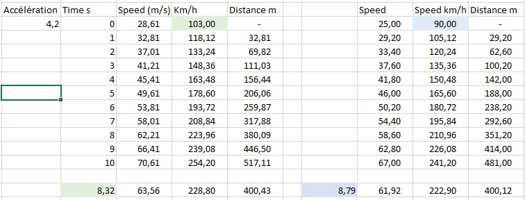

La vidéo ci-dessous rentre plus dans les détails.

<iframe width="560" height="315" src="https://www.youtube.com/embed/xJqnsOYD8T0?si=aohrMEMyOgs7CJYJ" title="YouTube video player" frameborder="0" allow="accelerometer; autoplay; clipboard-write; encrypted-media; gyroscope; picture-in-picture; web-share" referrerpolicy="strict-origin-when-cross-origin" allowfullscreen></iframe>

