# Freinage
{: .no_toc }

## Plan de la Note de Pilotage
{: .no_toc .text-delta}
- TOC
{:toc}

<!-- ###################################################################### -->
<!-- ###################################################################### -->
## L'objectif de la session

Dans cette session dédiée au **freinage en ligne droite** on va s'efforcer à :
* Apprendre à décomposer le freinage en 3 phases : montée rapide en pression, plateau, dégressif
* Freiner à 3 doigts (rien sur le frein AR)
* Avoir relâché le frein au PMSA (point de mise sur l'angle, le point à partir duquel on inscrit la moto dans le virage en lui donnant de l'angle)

<!-- ###################################################################### -->
<!-- ###################################################################### -->
## Prérequis pour la session
* On a identifié les points de mise sur l'angle de chaque virage
* On considère que le freinage se fait en ligne droite, moto verticale
    * Pour l'instant il n'y a donc **PAS** de freinage sur l'angle (Trail Braking). On verra ça plus tard quand on sera grand...

<!-- ###################################################################### -->
<!-- ###################################################################### -->
## Petit rappel utile avant de rentrer sur le circuit

On ne pourra pas dire qu'on n'en a pas parlé...

* Petit coup d'œil derrière, sur la piste, avant de rentrer
    * Je lève mes fesses de la selle et je tourne franchement la tête et le haut du corps pour vraiment voir ce qui arrive. Si on reste assis, il ne faut pas hésiter à lâcher la main du côté vers lequel on tourne le buste.
* Ne **PAS** prendre la corde du tout premier virage
    * On rentre sur le circuit, généralement, dans une ligne droite
    * Si on va à la corde du premier virage, au bout de la ligne droite, on peut se faire percuter par un gars qui est sur la piste depuis un moment et qui est lancé
* Si on n'a pas de **couvertures chauffantes** alors on a gagné 2 tours de chauffe
    * Accélérations franches en ligne droite pour le pneu arrière
    * Freinages progressivement de plus en plus appuyés pour le pneu avant
    * **PAS** de zigzag. Ça ne sert strictement à rien
* On se fiche du chrono lors des tours de chauffe.
* Rouler très à l'aise, 2/3 de ses possibilités, ne pas se mettre en mode panique
* Au 3eme tour on monte gentiment à 3/4 de ses possibilités car c'est une session de travail (on n'est pas là pour claquer une pendule)

<!-- ###################################################################### -->
<!-- ###################################################################### -->
## La session

* L'objectif du freinage c'est de **fixer précisément la vitesse d'entrée dans le virage le plus rapidement possible**
* Dans cette session, on ne doit plus être en train de freiner quand on passe sur l'angle. Les doigts ne sont donc plus sur le levier de frein après le PMSA.
* On ne veut pas faire du [Trail Braking] NOT YET TRANSFERED (https://www.40tude.fr/pilotage-moto-09-freinage-sur-langle-trail-breaking/) c'est-à-dire de finir de relâcher les freins alors qu'on est sur l'angle (Trail off = estomper)
* Attention à ne pas avoir une vitesse d'entrée **trop faible**. Cela arrive entre autres si la mise sur l'angle est trop lente.

### Position

On **an-ti-ci-pe** et on se positionne sur la moto très longtemps avant le prochain virage :
* Reculé sur la selle (un poing entre le réservoir et nous)
* **Une** fesse sortie, buste et épaules décalées mais pas trop
    * Hang off early and **NOT** too far
    * Typiquement, en ligne droite, alors qu'on est 100% gaz, **en butée** et penché en avant on a sorti une fesse et on a la raie des fesses sur le bord de la selle. 

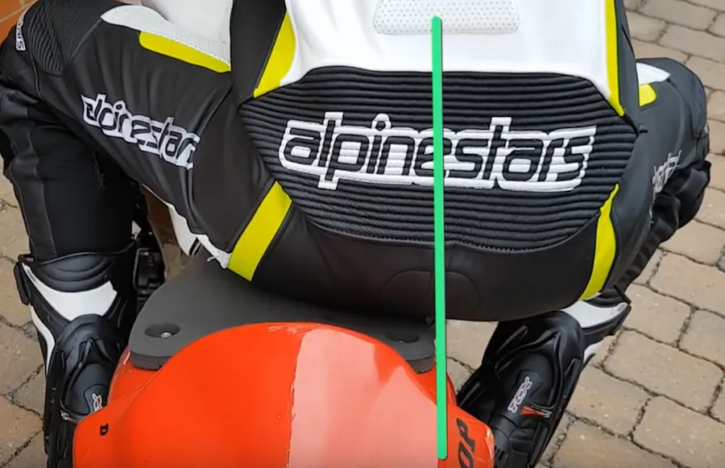

**Màj 17 03 23 :**  
En ce qui me concerne je pense qu'il faut que j'ai "l'intention" de sortir 2 fesses pour qu'au final il y en est une de sortie...

Voir ci-dessous la vidéo dont est extraite la photo :

<iframe width="560" height="315" src="https://www.youtube.com/embed/EJCCMohqHMI?si=yyBj7XFiJsgpDaFR" title="YouTube video player" frameborder="0" allow="accelerometer; autoplay; clipboard-write; encrypted-media; gyroscope; picture-in-picture; web-share" referrerpolicy="strict-origin-when-cross-origin" allowfullscreen></iframe>

* Pointe du pied intérieur sur le bout du repose-pied afin de pouvoir, plus tard, ouvrir le genou
    * Le pied intérieur est très mobile. Tout se passe comme si au bout du cale-pied il y avait une rotule.
    * Pied extérieur à plat, calé au talon (personnellement je n'y arrive pas. La partie la plus large de mon pied reste en place. Comme je ne suis pas grand, je peux pousser sur la point du pied afin de bien ajuster la hauteur du genou "dans" le réservoir)
    * Jambes collées au réservoir pour s'y "accrocher" (Hooked In)
        * Oui, oui c'est bizarre car on a une fesse dehors avec les jambes serrées, pour l'instant on est tordu MAIS…
        * Dès qu'on va ouvrir la jambe intérieure on sera quasiment en position finale pour le virage.
        * À ce propos... Il faut penser à régulièrement vérifier qu'on sent bien les cuisses serrées sur le réservoir. Il ne faut pas hésiter à coller des grips sur ce dernier. Ça évite vraiment de glisser vers l'avant lors des freinages appuyés. Ca aide à garder la majorité du poids du pilote vers l'arrière de la moto. Bref, que des avantages.

Ci-dessous, au bout de la ligne droite il y a un virage à gauche. On voit bien sur l'image de droite que le pilote est de travers, "tordu".  

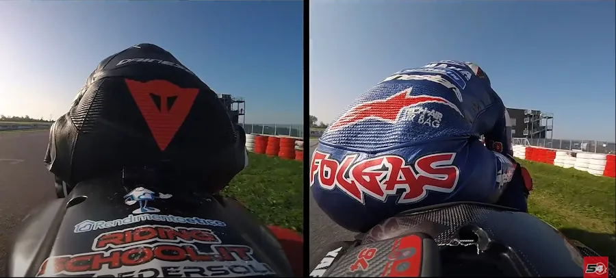

La vidéo dont est extraite la photo :

<iframe width="560" height="315" src="https://www.youtube.com/embed/V8Osi_tAYi0?si=KxT9Wi7HVg8REtCk&amp;start=197" title="YouTube video player" frameborder="0" allow="accelerometer; autoplay; clipboard-write; encrypted-media; gyroscope; picture-in-picture; web-share" referrerpolicy="strict-origin-when-cross-origin" allowfullscreen></iframe>

Heu... Si tu sors d'un gauche, que tu enquilles un petit bout de ligne droite pour attaquer un autre gauche... On est d'accord. On an-ti-ci-pe et on **réfléchit**. Donc c'est même pas la peine de remettre tes 2 fesses sur la selle. Tu gardes la fesse gauche dehors pendant toute la ligne droite. Encore une fois, moins on perturbe la moto mieux c'est. Donc moins tu déplace tes 80 kg (faut pas oublier la combine, les bottes, le casque...) sur une moto qui pèse 200 kg mieux c'est. En plus tu gagnes du temps et tu t'économise physiquement. Que demande le peuple...

On laisse un doigt sur l'embrayage pendant tout le freinage (je ne suis pas sûr de le faire. Faut que je prenne le temps de vérifier)
* Pour rétrograder si besoin
* **Plus important** : si la roue arrière veut passer devant, rebondit etc. il "suffira" de tirer très légèrement sur l'embrayage (1 mm) pour désolidariser le moteur de la roue et remettre cette dernière dans l'axe
* Bien sûr, il faut avoir remis de l'ordre et avoir relâché l'embrayage avant de passer sur l'angle

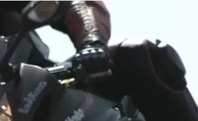

### La freinage proprement dit
On se redresse, on coupe les gaz et on commence à freiner en même temps (oui, oui il y a **3 choses à faire** en même temps).

En règle générale, sur piste, il faut supprimer les moments où on ne freine pas et où on n'accélère pas non plus. On cherche donc à minimiser, voire à supprimer les phases neutres. Autrement dit, soit on accélère, soit on freine. Attention, ça ne veut pas dire, on freine à fond ou on accélère à fond. Non, non, on n'est pas sur une PlayStation. Il y a des cas où on relâchera progressivement les freins et d'autres où on enroulera le cable d'accélérateur continûment. Cela dit, soit on freine, soit on accélère.

La raison pour laquelle il faut faire les trois choses en même temps est purement physique, mécanique. En effet, si on coupe les gaz mais qu'on ne freine pas tout de suite, la fourche va s'enfoncer grâce au transfert de masse qui va s'opérer lorsqu'on va couper les gaz. Ensuite, si on ne freine pas, elle va remonter (la fourche s'équilibre). Puis on va freiner, elle va alors replonger etc. Ce n'est pas bon du tout pour la stabilité ni le grip du pneu avant.

Idéalement, sur un 1000, moto qui a beaucoup d'inertie, il faut aussi rentrer les rapports au moment même où on coupe les gaz. Cela fait donc **4 choses à faire** en même temps. En tout cas, il faut descendre les rapports beaucoup plus tôt que ce que l'on fait d'habitude sur route. Ici l'idée c'est de bénéficier au maximum du frein moteur et ce, qu'on soit en 1000, 600 etc. Il n'est pas efficace d'attendre d'être à 50% ou à 75% de la distance de freinage pour commencer à taper comme un sourd sur notre sélecteur (en plus il ne nous a rien fait, il n'a pas mérité un tel traitement...). Au contraire, l'idée c'est de rentrer les vitesses très tôt, de garder le moteur haut dans les tours et de bénéficier alors d'un vrai frein moteur. 

Plus d'explications dans la vidéo ci-dessous :

<iframe width="560" height="315" src="https://www.youtube.com/embed/Bv0Wb09SAF0?si=VyqwlHWCLN1z5p7C&amp;start=462" title="YouTube video player" frameborder="0" allow="accelerometer; autoplay; clipboard-write; encrypted-media; gyroscope; picture-in-picture; web-share" referrerpolicy="strict-origin-when-cross-origin" allowfullscreen></iframe>

Quand on freine, on redresse le buste, on est bras tendus, verrouillés, le regard sur le point de mise sur l'angle (qui est devant nous normalement… vu qu'on se dirige dessus…). Il faut garder en tête l'image du diable qui sort de sa boîte.

La sortie de derrière la bulle doit être aussi rapide que la coupure des gaz. Heu... Ça sous-entend qu'avant de freiner, on était le nez dans la bulle, le menton posé sur le réservoir. Surtout pas le nez au vent genre balade du dimanche en train de regarder les petits oiseaux...

À propos du freinage... Il faut être rapide mais **on ne saute PAS** non plus sur les freins… On freine "rapidement" de plus en plus fort jusqu'à 100% (plus de détails sur les 100% un peu plus loin).

### Combien de doigts pour freiner ?

* On freine à 3 doigts (pas 1, ni 2, ni 4 mais  3 doigts)
* Oui je sais... Voir les photos ci-dessous... Cela dit, il faut quand même réaliser qu'ils n'ont pas nos freins (carbone etc.) ni notre force dans les doigts.
* Il me semble donc préférable de commencer avec 3 doigts puis d'ajuster, plus tard, si vraiment on est trop musclé des doigts.

Pourquoi 3 et pas 4 ? Tout simplement parce qu'il y a trop de différence entre la taille du majeur et celle de l'auriculaire et donc si on règle le levier pour l'auriculaire il ne sera pas bien réglé pour le majeur. D'un autre côté, les 3 dernières phalanges de l'index, majeur et annulaire sont sensiblement à la même place donc, si on règle pour l'un on règle pour les autres.

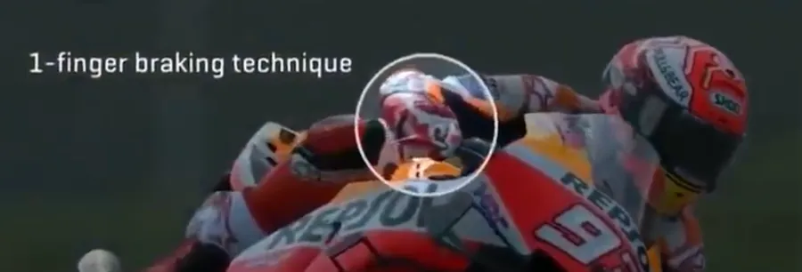

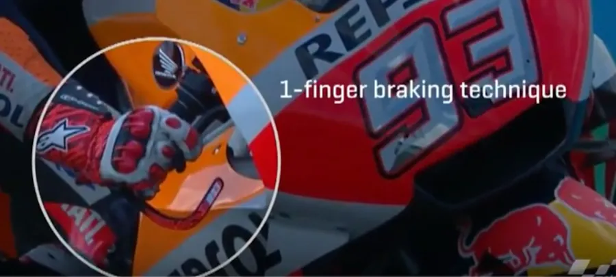

On peut noter la "longueur" du levier de frein

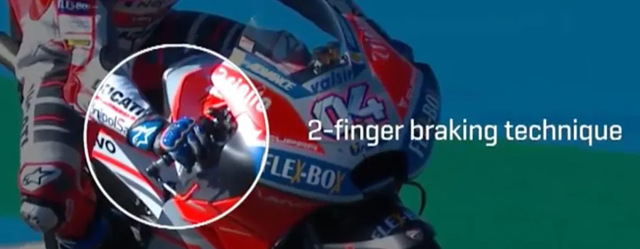

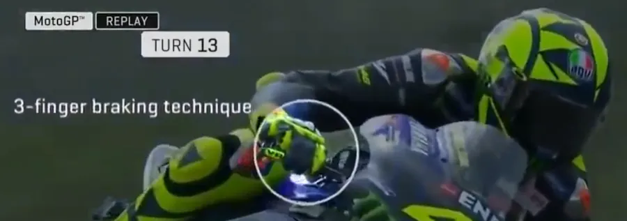

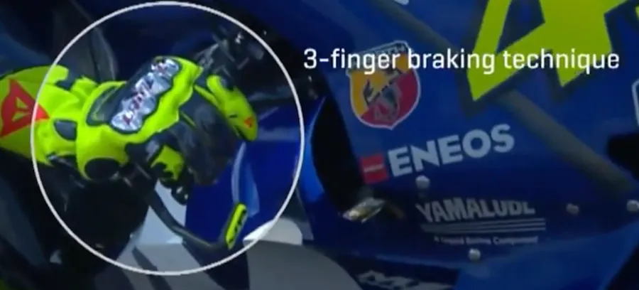

### Réglages des leviers

* Pense à vérifier que le levier de frein est bien réglé (pas trop loin, pas trop proche). Non seulement ça mais il faut aussi régler l'angle afin de ne pas avoir à casser le poignet.
* Assure toi que l'annulaire tombe bien tout au bout du levier afin que les 3 doigts appliquent un maximum de couple au levier de frein.

À ce propos on peut jeter un œil sur la première moitié de la vidéo ci-dessous.

<iframe width="560" height="315" src="https://www.youtube.com/embed/CJwCxrORlR4?si=8t6OAB5z4SBq4N4t" title="YouTube video player" frameborder="0" allow="accelerometer; autoplay; clipboard-write; encrypted-media; gyroscope; picture-in-picture; web-share" referrerpolicy="strict-origin-when-cross-origin" allowfullscreen></iframe>

Il faut sans doute aussi jeter un œil sur la vidéo ci-dessous où l'on parle, en autres et en Italien, de l'importance de l'écartement des bracelets.

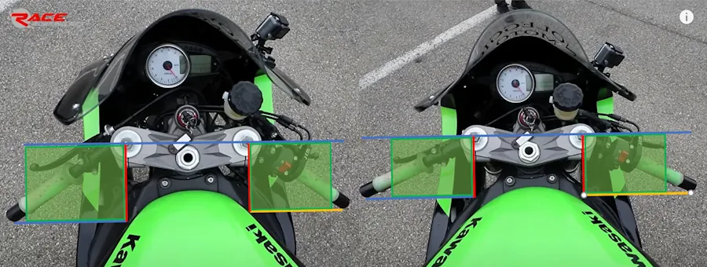

À gauche avant, à droite après.

Ci-dessus, les carrés verts me permettent juste de m'assurer que les angles sont bien droits. Les lignes bleues sont les références par rapport à la fourche. Enfin bref, j'ai essayé d'avoir des mesures à peu près correctes. Finalement je pense que les bracelets de droite sont écartés de 60° par rapport à la verticale contre 54° à gauche. C'est à confirmer car l'image n'est pas prise tout à fait à la verticale mais un peu en biais. Si vous trouvez une autre valeur dites-le dans les [commentaires](https://github.com/40tude/40tude.github.io/discussions). De toute façon, il faut essayer et voir si on se sent bien.

Écarter les bracelets a pour objectif de donner plus de couple au moment où on va pousser le bracelet intérieur et mettre la moto sur l'angle. Si on a plus de couple, à force égale la mise sur l'angle sera plus rapide.

<iframe width="560" height="315" src="https://www.youtube.com/embed/9AuWgTecSBw?si=w4WFFbHGXouRIOAd" title="YouTube video player" frameborder="0" allow="accelerometer; autoplay; clipboard-write; encrypted-media; gyroscope; picture-in-picture; web-share" referrerpolicy="strict-origin-when-cross-origin" allowfullscreen></iframe>

Je ne résiste pas l'envie de pointer cette vidéo à propos de "THE ultimate outils de la mort" qui permet d'avoir des demi-guidon avec les mêmes angles. Sans doute à refaire d'une manière ou d'une autre avec ses propres moyens.

<iframe width="560" height="315" src="https://www.youtube.com/embed/VPTsNQe2M5w?si=0eqWYGNfcRnECCis" title="YouTube video player" frameborder="0" allow="accelerometer; autoplay; clipboard-write; encrypted-media; gyroscope; picture-in-picture; web-share" referrerpolicy="strict-origin-when-cross-origin" allowfullscreen></iframe>

## Retour dans la session...

On freine rapidement car 1 sec c'est 50m à 200 km/h, 25m à 100 km/h (en fait c'est 55m et 27m mais on s'en fout). Il faut passer à 100% de ce que l'on peut donner en terme de force de freinage en 1/2 ou 1/4 de seconde par exemple (c'est très rapide mais c'est pas "je saute sur les freins")

En étant "progressif", on évite de :
* Compresser complètement la fourche
* De perdre la suspension (si la fourche est en butée il n'y a plus de suspension)
* De ne plus avoir que le pneu pour faire amortisseur 
* D'avoir la roue qui rebondit car elle ne peut rien faire d'autre
* De bloquer la roue quand elle est en l'air car la roue seule a très peu d'inertie et qu'à ce moment les freins la stoppent très facilement
* De reposer l'avant avec la roue bloquée
* D'aller au tas puis au SAMU local

On perd 100% de pouvoir directif quand la roue avant est bloquée et qu'elle "glisse" sur le bitume comme si elle était sur de la glace.

### Profil de freinage

Du point de vue du profil de freinage ça donne un truc comme ça. En abscisse c'est le temps et en ordonnée c'est la pressiion en bars. Attention, le plus important c'est le plateau à 100%.

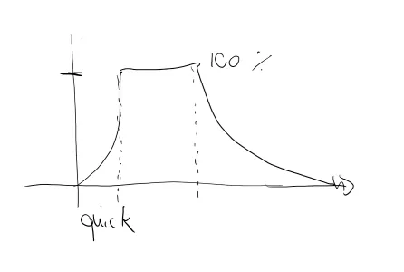

D'abord, il faut comprendre que les 100% c'est les 100% de ce que l'on a décidé d'appliquer. Ce n'est pas les 100% de ce que peuvent donner les freins. Oui, bien sûr avec l'expérience votre 100% sera de plus en plus haut mais...

Le truc à garder en tête, c'est qu'après la montée rapide en pression, on reste **constant**. Une fois atteint nos 100% on ne modifie donc plus la pression exercée sur la poignée.

Donc on arrête les : "oops je me fais peur, j'arrive trop vite, allez, j'en rajoute une louche, mince je suis déjà à l'arrêt, allez, je relâche le levier". Non, non une fois que la pression est appliquée on ne la change plus. Bien sûr, on est pas débile. On ajuste au fil des tours et/ou on tente des trucs de temps en temps.

La raison pour laquelle une fois appliquée on ne change plus la pression exercée est une question de transfert de charge et donc de stabilité de la moto. On a tous fait l'andouille une fois (ben si, quand même...) où on donne des petits coups de frein que ce soit en voiture ou à moto. On sent bien alors le véhicule qui pique du nez et qui remonte, nos corps qui vont vers l'avant puis vers l'arrière. Du point de vue de l'efficacité du freinage ce n'est pas bon du tout car le pneu avant se retrouve tour à tour comprimé puis allégé. Le grip n'est pas du tout constant. Bref, une fois l'intensité du plateau fixée on fait tout pour ne pas la modifier.

Ce que j'ai beaucoup de mal à faire c'est de freiner plus tôt, de baisser l'intensité du freinage et de la garder constante. Par exemple, je n'arrive pas à freiner deux fois moins fort mais à rester constant. En plus avec le rétrogradage, je sens bien le nez de la moto qui pique. C'est vraiment un truc sur lequel il faut que je revienne.

**Note** 
Le problème précédent a été résolu quand je suis passé du ZX6R au RSV4 qui dispose de down-shifter qui donne le petit coup d'accélérateur pour le "pilote".

C'est d'autant plus vrai qu'en freinant très fort (à mon niveau s'entend), au dernier moment, je suis à mes limites mais surtout mes freinages ne sont pas du tout homogènes. Un coup ma mise sur l'angle se fait trop tard, le tour d'après je suis trop lent en entrée de virage... Donc un même virage ne se passe jamais de la même façon, j'ai du mal à l'anticiper, je perds en sérénité etc. Bref, c'est pour toutes ces bonnes raisons qu'il est très important de s’entraîner et à acquérir **une pression de freinage constante**.

Ensuite, on relâche progressivement (fin de la courbe à droite sur le graphe précédent). Plus tard quand on sera "grand", on effectuera la phase de relâchement à partir du moment où on mettra la moto sur l'angle (PMSA) et logiquement, plus la moto sera anglée plus les freins seront relâchés.

Pour s'exercer, au début, il faut sans doute reculer la marque de freinage par rapport à ce que l'on voudrait faire instinctivement. Quand on roule à fond on peut prendre 200 m comme premier point de repère.

Ensuite, au fil des tours, on rapprochera la marque de freinage du point de mise sur l'angle

### Revoyons l'action au ralenti

Pendant le freinage, alors qu'on est en ligne droite, moto verticale, le visage se tourne vers le point de corde (voir la note de Pilotage 03 [Three Steps]())

On freine très fort mais progressivement et de manière contrôlée comme si on pressait une balle en mousse. Si, dans ses conditions, on va au bout de la suspension, il faut revoir les réglages de cette dernière. En effet, si on pousse la fourche en dehors de son domaine de fonctionnement, elle ne va plus être capable d'amortir quoi que ce soit, la moto va rebondir, la roue avant se bloquer etc. (voir ce qu'on a dit un peu avant). 

Pour tester l'amplitude du débattement de la suspension on peut mettre un Rilsan sur un des tubes de fourche (calé en haut sur fourche inversée). Avant de partir en session il faut le remonter au maximum. À la fin de session il suffit de voir l'écart qui reste entre le Rislan et le bas de la fourche.

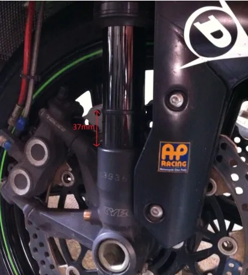

Pour avoir une idée du comportement de la suspension, on peut aussi [interpréter l'état des pneus] NOT YET TRANSFERED (https://www.40tude.fr/lecture-des-pneus-pression-et-suspensions/) comme joe l'indien les traces des bisons.

* On tombe les rapports tout de suite, au tout début du freinage car c'est dans les hauts régimes que le frein moteur est le plus efficace.
  + Typiquement au tout début du plateau
  + On relâche **doucement** l'embrayage. C'est important.
  + Si c'est le "bronx" au niveau de la roue arrière, comme on a un doigt sur l'embrayage, il "suffit" (yaka faukon) de tirer un peu dessus pour que tout rentre dans l'ordre. Cela dit, on perd alors le frein moteur (on a désolidarisé la roue arrière du vilebrequin) et donc on ne reste pas 3 heures avec les doigts sur le levier. Un dernier truc... Pas besoin de ramener le levier d'embrayage jusqu'à la poignée. Généralement on parle d'une course de quelques millimètres (un peu comme quand on fait cirer l'embrayage au démarrage). Si on tire le levier à un doigt, ce dernier n'a pas besoin de toucher les doigts qui sont sur la poignée. On tire vraiment de quelques millimètres.

**Maj 17 03 23**   
Plateau. On garde une pression constante. Pas la peine de se mettre dans le rouge, au taquet ou en mode panique. Dans cette phase, le plus important ce n'est pas l'intensité (5 bars, 10 bars de pression) mais la constance (pas de variations autour de la pression de levier). J'aimerai vraiment installer un système d'acquisition de données afin de mesurer ce qui se passe dans mes plateaux. Je pense que ce serait peut-être démoralisant mais très instructif 😊 (on ne fait progresser que ce que l'on mesure)

* On relâche ensuite **progressivement** le frein jusqu'au point de mise sur l'angle
    * C'est ce qui permet d'ajuster la vitesse de passage précisément
    Si l'accélérateur fixe la vitesse en sortie de virage, les freins fixent la vitesse en entrée de virage. Le degré de précision est exactement le même !
    Encore une fois… Progressif sur la libération des freins. Si on n'est pas progressif, la fourche rebondit, il y a transfert de charge vers l'arrière, l'avant qui est allégé a moins de grip, la roue avant a tendance à se bloquer plus facilement etc.
    Ici on considère que le freinage doit être terminé au moment de la mise sur l'angle. Les doigts ne sont donc plus sur le levier de frein.

* Alors qu'on se dirige vers le PMSA, plier les bras pour ramener le torse vers l'avant afin de garder de la charge sur le train avant alors qu'on freine de moins en moins fort (ATOTW II p 51)
    * Les avant-bras passent à l'horizontal avant qu'on pousse sur le bracelet intérieur. En effet, c'est dans cette position qu'on a le plus de couple pour pousser sur le bracelet intérieur. Au fait est-ce que les bracelets sont bien réglés et suffisamment écartés ?
    * Tant qu'on pousse sur le bracelet la moto va prendre de l'angle. Quand on arrête de pousser sur le bracelet intérieur la moto reste sur son angle, stabilisée.
    * Plus on pousse fort, plus la mise sur l'angle est rapide. Plus on pousse fort, plus la mise sur l'angle est rapide et mieux c'est !

* À la fin de la mise sur l'angle
    * S'assurer que le coude intérieur est abaissé
    * Que l'avant-bras, la main et le poignet sont **dans le prolongement du bracelet** (prise tournevis)

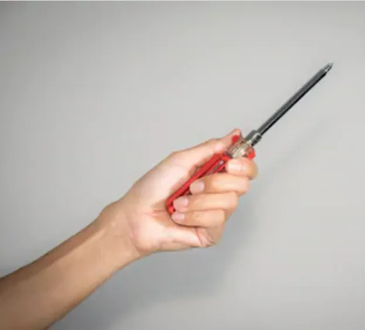

Prise tournevis

* Le visage se retrouve dans le "rétroviseur" (oui, oui je sais y a plus de rétro sur la moto…)
    * La tête et le menton au-dessus de la main
    * Bras détendus et **mains relâchées** pour ne pas transmettre trop de vibrations au reste de la moto

Dans la photo ci-dessous il faut regarder la tête (la main n'est pas en prise tournevis)

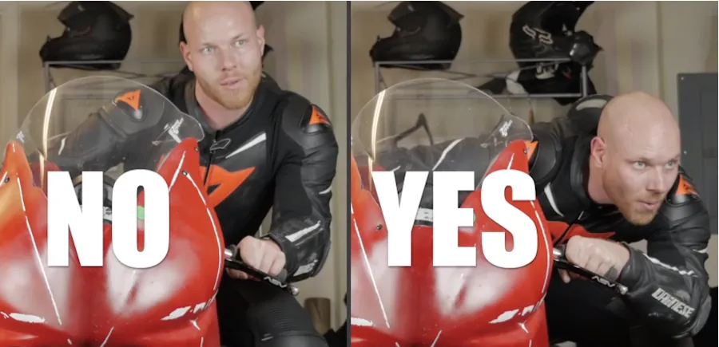

On passe sur l'angle à la bonne vitesse et... La bonne vitesse d'entrée c'est quand l'arrière commence à déraper ! (ATOTW II p 25) 😊

Une fois qu'on est sur l'angle on ne change plus notre position sur la moto. Cela évite de faire des transferts de charge avant/arrière qui parasitent le grip.

<!-- ###################################################################### -->
<!-- ###################################################################### -->
## À la fin de la session

* Pas la peine de freiner tard et comme une brute. 
    * Ce qui compte c'est la vitesse de sortie de virage, **PAS** la vitesse d'entrée. 
    * Il vaut donc mieux rentrer plus lentement, assurer son point de corde et sortir comme une balle plutôt que de rentrer roue arrière levée et sortir en sous régime, hors de la trajectoire idéale et à la ramasse totale.
* Bien sentir les 3 phases lors du freinage
    * Montée rapide à 100% (ce qui est différent de sauter sur les freins comme un requin sur une Australienne)
    * Plateau **constant** à 100% de ce que l'on sait faire
    * Relâche progressive pour ajuster précisément la vitesse au PMSA
* On ne freine plus au moment de la mise sur l'angle
* On pousse fort sur le bracelet intérieur ce qui entraîne une mise sur l'angle rapide.
* Sur l'angle, l'avant-bras, la main et le poignet sont dans le prolongement du bracelet (prise tournevis). Le coude est très bas et le nez est dans le rétro.
* On va du PMSA au PC en passant par PV (pivot) avec l'élan, la vitesse qui reste. C'est la phase neutre. Ici il faut apprendre à être patient, ne pas lâcher le point de corde des yeux, ajuster sa trajectoire au millimètre. Plus tard on va tenter de supprimer complètement cette phase neutre mais on n'y est pas encore.
* Ce n'est pas grave si la position n'est pas encore au top.
    * Vitesse de mise sur l'angle, vitesse de passage dans le virage et position vont progresser ensemble.

<!-- ###################################################################### -->
<!-- ###################################################################### -->
## Remarques

### Relire ces pages
* <http://www.lerepairedesmotards.com/technique/freinage-gp.php>
* <http://www.lerepairedesmotards.com/conseils/savoir-freiner.php>

### Revoir absolument cette vidéo

<iframe width="560" height="315" src="https://www.youtube.com/embed/NauC5A-Wio8?si=IMVLoePGvWkdNVLu&amp;start=5" title="YouTube video player" frameborder="0" allow="accelerometer; autoplay; clipboard-write; encrypted-media; gyroscope; picture-in-picture; web-share" referrerpolicy="strict-origin-when-cross-origin" allowfullscreen></iframe>

J'aimerai vraiment avoir l'occasion de faire des tests similaires afin de vérifier ce que cela donne vraiment.
* Sur un virage où normalement on freine à 175m
* Freinage jusqu'à l'arrêt à 200 m
* Il freine ensuite jusqu'à l'arrêt à 150 m (il s'arrête au début du vibreur externe, avant le PMSA en gros…)
* Dernier freinage à 120 m et passage à 80 km/h dans le virage

<!-- ###################################################################### -->
<!-- ###################################################################### -->
## La suite au prochain épisode

Bon, allez, la suite au prochain numéro. D’ici-là relisez les [notes de pilotage]() ou faites des squats afin de préparer les prochains roulages.

<iframe width="560" height="315" src="https://www.youtube.com/embed/TIhtpItTuxc?si=qL84DxP-ejd_Yi4-&amp;start=53" title="YouTube video player" frameborder="0" allow="accelerometer; autoplay; clipboard-write; encrypted-media; gyroscope; picture-in-picture; web-share" referrerpolicy="strict-origin-when-cross-origin" allowfullscreen></iframe>

