# Conduite de virage efficace
{: .no_toc }

## Plan de la Note de Pilotage
{: .no_toc .text-delta}
- TOC
{:toc}

<!-- ###################################################################### -->
<!-- ###################################################################### -->
## Introduction

Je vais commencer par faire un rappel des épisodes précédents pour bien situer ce billet dans son contexte.

1. Tu as découvert la piste. Tu poses correctement tes pieds, tu sais où sont les cônes (PMSA, PC et PS) et tu te couches sur la moto dans au moins un endroit du circuit. 
1. Tu as continué à découvrir la piste et tu es 100% gaz, **en butée**, dans au moins un endroit du circuit.
1. Tu sais qu'il faut décomposer les virages en 3. Tu regardes le PC avec ton menton **avant** d'arriver au PMSA. Tu vises le PS **avant** de rouler **sur** le PC. Entre le PMSA et le PC, tu sais que tu dois rejoindre sans gaz ni frein le point de pivot (PV). C'est là que tu claques la moto au sol et que tu l'orientes, le plus vite possible, sur la ligne qui va du PV au PS en passant par PC. Dès que c'est fait tu commences à enrouler les gaz (Throttle Rule).
1. Tu décomposes ton freinage en trois phases : mise en pression rapide, maintien sur un plateau, dégressif pour finir. L'objectif c'est d'ajuster précisément la vitesse au PMSA. À la mise sur l'angle (PMSA) la vitesse est suffisante pour rejoindre PV sans frein ni gaz (phase neutre)

Bon ben voilà, tout est dit, y a plus qu'à. Allez, salut!

Hmm... Voilà où on en est : on commence à voir certains éléments se mettre en place, on a une idée générale de ce qu’on cherche à **produire**, mais le problème, c’est qu’on manque encore de régularité. Tout ça manque un peu de cohérence, comme si on avait les points mais pas encore les traits pour les relier. En gros, on n’y est pas tout à fait.

Et c’est pour ça que ce billet est un peu particulier, que c'est celui daont la section Remarques est la plus longue et que c'est le dernier de la section Basics. Maintenant, on sait ce qu’on veut : couché, en butée, trois phases de freinage, au point de corde avec les roues vers le point de sortie… Bref, on a les briques de base du pilotage. Ce qu’il nous reste à faire, c’est assembler tout ça pour **produire** quelque chose de solide. En gros, on va jouer au Lego. Sympa, non ? Allez, c’est parti !

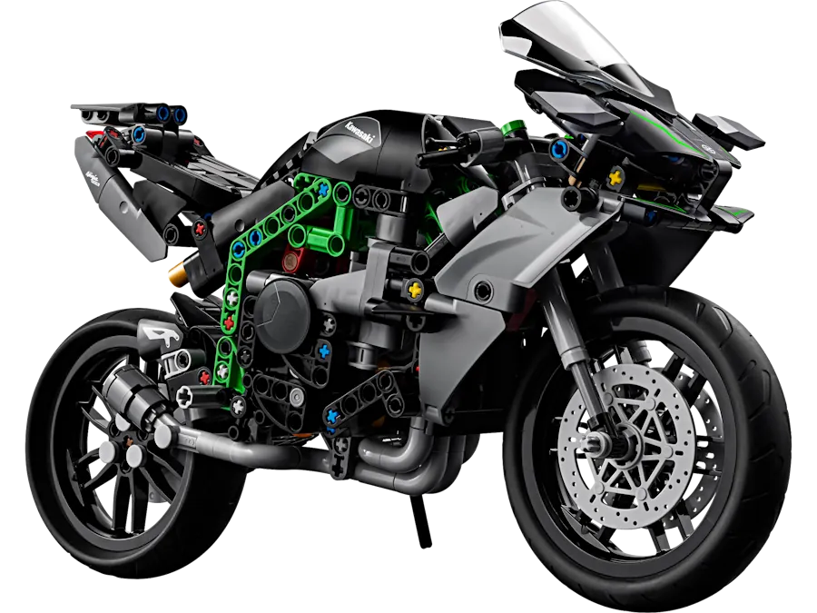

* Le freinage en ligne droite est terminé, on met la moto sur l'angle, on rentre dans le virage et ? 
* Et la seule question que l'on doit se poser alors c'est : **comment je fais pour sortir de là comme une balle ?**

Tu connais la réponse. Réfléchis... Les secondes se gagnent dans les lignes droites et les grands virages (pas dans les petits virages, pas dans les freinages ni les portions lentes du circuit). 

On considère que l'on est efficace en ligne droite lorsque le temps passé à V max est maximisé. L'idée c'est que toute chose égales par ailleurs (ligne droite, moto, accélération, V max...) un pilote est plus efficace qu'un autre si il passe plus de temps à V max. Comme les accélérations sont identiques il n'y a pas d'autre solution que de sortir en étant le premier à accélérer. Mécaniquement, si on est le premier à accélérer, à chaque instant on accéléra plus fort et sortira plus vite que l'autre pilote. *Celui qui gagne ce n’est pas celui qui accélère le plus fort mais celui qui accélère le plus tôt*. C'est ça qu'on cherche à **produire** avec une conduite de virage efficace.

Ce qu'il y a bien, c'est que la mesure de nos progrès va être très simple. En effet, l'efficacité de notre conduite de virage n'est mesurée qu'à l'aune de notre vitesse de sortie de virage. On se fiche de l'angle qu'on prend, on se fout d'être Débutant ou Expert et on se contrefiche de notre vitesse d'entrée... Seule compte notre vitesse de sortie du virage.

<!-- ###################################################################### -->
<!-- ###################################################################### -->
## Objectifs de la session

* Augmenter notre vitesse à la sortie du virage pour maximiser le temps où on est 100% gaz 
* Pour ça faut avancer le moment à partir duquel on commence à accélérer et augmenter la vitesse à laquelle on enroule le câble d'accélérateur
* Cela ne peut se faire que si et seulement si on a trouvé notre ligne idéale pour chaque virage
* Gagner en répétabilité (être capable de faire le même virage tour après tour)
* Ne pas subir mais avoir une vraie conduite de virage

Autrement dit :

* Être capable d'appliquer la **Throttle Rule** dans les virages (voir la [Note de Pilotage N° 02]())
* Car c'est la confirmation qu'on est sur notre ligne idéale pour tel ou tel virage
* On s'occupe du point de sortie (PS) car on veut qu'au point de corde (PC) les roues soient sur la ligne qui relie le PV au PS en passant par PC mais on ne s'occupe pas vraiment de la façon dont on redresse la moto. On verra ça un peu plus tard... [Note de Pilotage N° 06] NOT YET TRANSFERED (https://www.40tude.fr/pilotage-moto-06-contre-braquage-en-sortie-de-virage/).

<!-- ###################################################################### -->
<!-- ###################################################################### -->
## Prérequis

* Ne pas avoir peur d'être 100% gaz, **en butée**. Savoir comment passer à 100% gaz rapidement. Faut avoir déjà expérimenté sinon ça ne sert à rien de venir ici.
* On a un freinage qui nous amène, à la bonne vitesse, au point de mise sur l'angle (PMSA)
    * La bonne vitesse au PMSA, c'est celle qui nous amène sans frein ni gaz au PV
    * Au PV on a une vitesse à laquelle on hésite pas à claquer au sol la moto pour la faire pivoter le plus rapidement possible
    * Plus le virage est serré plus PV et PC sont espacés (dans une épingle on s'enfonce dans le virage avant de faire le pivot)  
* Consacrer du temps aux vidéos ci-dessous. Oui, j'ai remarqué, il y a des trucs de voitures mais ça fait de la culture générale et cela ne peut pas nous faire de mal.

<iframe width="560" height="315" src="https://www.youtube.com/embed/60mpzDGCWVI?si=5lLh65Mcs7RgIxpb" title="YouTube video player" frameborder="0" allow="accelerometer; autoplay; clipboard-write; encrypted-media; gyroscope; picture-in-picture; web-share" referrerpolicy="strict-origin-when-cross-origin" allowfullscreen></iframe>

<iframe width="560" height="315" src="https://www.youtube.com/embed/VEJh4lLCzRc?si=Zh4XeU6fuu2OTAoh" title="YouTube video player" frameborder="0" allow="accelerometer; autoplay; clipboard-write; encrypted-media; gyroscope; picture-in-picture; web-share" referrerpolicy="strict-origin-when-cross-origin" allowfullscreen></iframe>

<iframe width="560" height="315" src="https://www.youtube.com/embed/aZlOkt1oU2k?si=9LlpKjdmhAiAnWtU" title="YouTube video player" frameborder="0" allow="accelerometer; autoplay; clipboard-write; encrypted-media; gyroscope; picture-in-picture; web-share" referrerpolicy="strict-origin-when-cross-origin" allowfullscreen></iframe>

<iframe width="560" height="315" src="https://www.youtube.com/embed/N8qBdOs0s1E?si=FnUlu4iAZNeAxUs5&amp;start=209" title="YouTube video player" frameborder="0" allow="accelerometer; autoplay; clipboard-write; encrypted-media; gyroscope; picture-in-picture; web-share" referrerpolicy="strict-origin-when-cross-origin" allowfullscreen></iframe>

<!-- ###################################################################### -->
<!-- ###################################################################### -->
## Petit rappel utile avant de rentrer sur le circuit

On ne pourra pas dire qu'on n'en a pas parlé...

* Petit coup d'œil derrière, sur la piste, avant de rentrer
    * Je lève mes fesses de la selle et je tourne franchement la tête et le haut du corps pour vraiment voir ce qui arrive. Si on reste assis, il ne faut pas hésiter à lâcher la main du côté vers lequel on tourne le buste.
* Ne **PAS** prendre la corde du tout premier virage
    * On rentre sur le circuit, généralement, dans une ligne droite
    * Si on va à la corde du premier virage, au bout de la ligne droite, on peut se faire percuter par un gars qui est sur la piste depuis un moment et qui est lancé
* Si on n'a pas de **couvertures chauffantes** alors on a gagné 2 tours de chauffe
    * Accélérations franches en ligne droite pour le pneu arrière
    * Freinages progressivement de plus en plus appuyés pour le pneu avant
    * **PAS** de zigzag. Ça ne sert strictement à rien
* On se fiche du chrono lors des tours de chauffe.
* Rouler très à l'aise, 2/3 de ses possibilités, ne pas se mettre en mode panique
* Au 3eme tour on monte gentiment à 3/4 de ses possibilités car c'est une session de travail (on n'est pas là pour claquer une pendule)

<!-- ###################################################################### -->
<!-- ###################################################################### -->
## La session

On a terminé le freinage en ligne droite, on est gaz coupé, on ne touche plus aux freins avant et on vient tout juste de mettre la moto sur l'angle.
* La moto est passée sur l'angle le plus tard possible afin de prolonger le plus longtemps possible la ligne droite précédente et le freinage dans l'axe.
    * Je rappelle que l'idée ici c'est de ne **PAS** faire de freinage sur l'angle (enfin, [pas encore] NOT YET TRANSFERED (https://www.40tude.fr/pilotage-moto-09-freinage-sur-langle-trail-breaking/) 😁)
* La mise sur l'angle doit être **rapide** (j'explique pourquoi plus loin). Pour accélérer la mise sur l'angle il faut s'entraîner à contre braquer :
    * En poussant **consciemment** sur le bras intérieur... Il faut vraiment prendre conscience qu'à l'instant où on le décide, on pousse sur le bracelet intérieur pour mettre la moto sur l'angle. L'idée c'est d'arrêter de réaliser, après coup, que la moto est sur l'angle sans vraiment savoir pourquoi, à partir de quel moment...
    * On peut aussi s'assurer qu'on vise bien le point de corde avec le menton. Normalement c'est le cas mais en faisant la vérification, on va faire tourner la tête, les épaules, le corps et la moto. Ce faisant on va aussi mécaniquement mettre plus de poids sur le cale-pied intérieur. C'est peut-être un détail pour vous mais pour la moto ça veut dire beaucoup 🎶. Ça va contribuer à la faire passer sur l'angle plus rapidement. Mais bon, faut pas se leurrer, appuyer sur les cale-pieds c'est beaucoup moins efficace en terme de rapidité que le contre braquage au guidon. Pour t'en convaincre essaie de prendre une épingle en appuyant uniquement sur les cale-pieds. Good luck.

Quoiqu'il en soit, à ce stade on est sur l'angle, gaz coupé, sans frein, on ne lâche pas le point de corde du menton et on a une vitesse suffisante. Suffisante pour quoi ? Pour laisser la moto avancer sur son erre, son inertie et aller rejoindre le point de pivot. C'est la phase neutre. Ce n'est pas facile, car il faut avoir la bonne vitesse en entrée et apprendre la patience... AU point de pivot, comme on a pas d'action parasite sur la moto (ni frein, ni gaz) on peut la claquer au sol très rapidement pour la faire pivoter et orienter nos roues sur la ligne qui lie PV, PC et PS. 

Dès qu'on a passé PV et que les roues sont alignées, on commence à enrouler. Au début c'est imperceptible et lent. On assois la moto sur sa roue arrière. Comme on est dans la bonne direction on peut pas sortir. Plus on accélère plus on relève la moto. On a plus le genou au sol au PC. On place nos roues sur le point de corde au millimètre près sur la ligne qui relie le PC au PS. 

Ce qui va très certainement se passer pendant la session 
1. Se retrouver trop tôt à la corde
1. Vitesse trop lente au PMSA
1. Une combinaison linéaire des 2 points précédents 

**Premier point** :
* Plus le virage est serré plus il faut s'enfoncer dans le virage pour aller chercher PV loin, très loin (on parle de virage en V, aux US on parle de point'n shoot)
* Faut pas hésiter à copier le marshall ou ceux qui restent large et qui donnent l'impression, à un moment, de "plonger" à la corde. 
* On en a déjà parlé mais normalement le roues touchent la corde 1 fois, une fraction de seconde. Si pendant la session c'est pas le cas, au prochain tour, dans ce virage, faut se forcer à aller chercher un PV plus loin dans le virage

**Second point** : On n'est pas suicidaire et généralement on a freiné trop tôt, trop fort. On entre dans le virage trop lentement et on est obligé de remettre un peu d'accélérateur (filet de gaz) pour empêcher la moto de plonger à la corde. En fait, on accélère pour ouvrir la trajectoire de la moto car, par manque de vitesse l'ensemble moto/pilote est survireur. Si ça arrive pendant la session, au prochain tour il faut retarder le freinage de une ou 2 motos de long, relâcher les freins au même endroit et exécuter une inscription sur l'angle plus rapide. On va alors rentrer un peu plus vite. Si la marque de freinage est la bonne on pourra rejoindre PV gaz coupé. À partir de là c'est trop facile. On claque la moto pour la faire pivoter et tout de suite après, on commence à enrouler, on rejoint PC (au millimètre, j'insiste) avec les roues orientées vers PS (j'insiste aussi).

Si on remet les gaz trop tôt, trop fort on va s'écarter de la ligne idéale
* Faudra couper, réaligner et réaccélérer ce qui est très mauvais pour le grip de la moto
* Couper les gaz c'est LE signe qui indique qu'on a accéléré trop fort, trop tôt
* Faudra corriger le tir au tour suivant en accélérant moins fort ou plus tard

À la fin du virage on peut se permettre d'enrouler de plus en plus vite la poignée de gaz car la moto est de plus en plus verticale et on a de plus en plus de grip sur le pneu arrière.

À la sortie du virage :
* On est 100% gaz. C'est important. Trop souvent nous ne sommes pas complètement full gaz (voir la [Note 01](https://www.40tude.fr/pilotage-moto-01-decouverte-de-la-piste/))
* Le corps et la tête restent à l'intérieur du virage. Cela permet de resserrer la trajectoire en sortie de virage. On se prouve ainsi qu'on a encore de la marge et qu'au prochain tour on pourra accélérer encore plus fort. 
* Ensuite, on ramène juste la tête et le torse derrière la bulle
* Fesse intérieure encore sortie, la raie des fesses calée sur le bord de la selle.
* Si le prochain virage est dans le même sens alors on ne bouge pas (oui, oui on reste de travers sur la moto)
* Si le prochain virage est dans l'autre sens, quand on est en ligne droite, **au prochain passage de vitesse**, on ramène les fesses en utilisant les cuisses.
* Si le virage suivant est dans l'autre sens mais que la ligne droite n'est pas assez longue pour qu'on passe une vitesse, comme on appuie fort sur les cale-pieds et qu'on est light sur la moto, on utilise la cuisse extérieure pour ramener le reste du corps dans l'axe. On peut même anticiper les choses et faire passer le corps carrément de l'autre côté de la moto afin de se positionner pour le prochain virage. Si la ligne droite est courte c'est l'option à choisir.

Dans la vidéo ci-dessous pensez à mettre les sous-titres en Anglais et la vitesse à 0.75 car Alberto parle très vite.

<iframe width="560" height="315" src="https://www.youtube.com/embed/Ox3_unEQx5s?si=dgrvQ8JmYChNDOOa&amp;start=175" title="YouTube video player" frameborder="0" allow="accelerometer; autoplay; clipboard-write; encrypted-media; gyroscope; picture-in-picture; web-share" referrerpolicy="strict-origin-when-cross-origin" allowfullscreen></iframe>

Dans la vidéo suivante Simon Crafar revient en détail sur sa préférence de conduire le virage gaz fermé et sans aucune utilisation des freins (vs [Trail Braking](https://www.40tude.fr/pilotage-moto-09-freinage-sur-langle-trail-breaking/)). Pas d'offense, mais j'avoue, j'ai un peu de mal avec son anglais de néo-zélandais.

<iframe width="560" height="315" src="https://www.youtube.com/embed/ps12mz_i3-0?si=AN03fFpXL2UbP3Yg" title="YouTube video player" frameborder="0" allow="accelerometer; autoplay; clipboard-write; encrypted-media; gyroscope; picture-in-picture; web-share" referrerpolicy="strict-origin-when-cross-origin" allowfullscreen></iframe>

<!-- ###################################################################### -->
<!-- ###################################################################### -->
## À la fin de la session

Il faut sentir :
* Qu'on sort dorénavant plus vite du virage car on a commencé à accélérer plus tôt
* Qu'on est plus tôt et plus longtemps 100% gaz dans la ligne droite qui suit le virage 
* Qu'en entrée de virage on ne lâche pas des yeux le point de corde
* Qu'on rentre avec une vitesse suffisante pour rejoindre PV
* Qu'il y a une phase neutre où on est patient et où on ne touche à rien.
* Qu'on commence à enrouler le câble d'accélérateur juste après PV, avant de placer nos roues sur le point de corde sur la ligne PV-PC-PS
* Que ce sont bien les roues qui passent au point de corde, pas la tête ni le genou
* Qu'idéalement on est 100% gaz au point de corde
* Que la tête et le corps reste à l'intérieur en sortie de virage ce qui permet de resserrer la sortie de virage, de redresser plus vite la moto et d'accélérer plus fort.

<!-- ###################################################################### -->
<!-- ###################################################################### -->
## Remarques

### À propos de la position sur la moto

Ce n'est toujours pas le plus important dans cette session mais on peut en dire 2 mots quand même car il faut que l'on soit bien installé si on veut avoir une conduite de virage efficace. Non ?

* Il ne faut pas avoir peur "d'over-exagérer" et de paraître ridicule
* On se recule et on s'écarte du réservoir (un poing entre nous et lui). Si tu as des doutes, mets un petit bloc de polystyrène de la largeur du poing et fixe-le avec une bonne dose de scotch bleu à peinture (ça s'enlève facilement). Si au freinage tu touches le bloc, tu sais que tu es trop rapproché du réservoir. Quand tes fesses seront en place sur la selle tu enlèveras le bloc. Achète des grips à installer sur le réservoir et surtout pense à serrer ce dernier avec tes cuisses à chaque freinage. Ça doit devenir un automatisme.
* Une fesse dehors (si besoin, "penser" qu'on en sort 2). L'idée c'est de commencer par caler la raie des fesses sur le bord de la selle. Ensuite, en fonction des personnes (et de la vitesse de passage) on sortira un peu plus d'une fesse (ou pas).
* Garder la colonne vertébrale parallèle à l'axe de la moto. Donc si on a sorti une fesse faut aussi décaler le haut du corps : les épaules, la tête...
* **Casser le coude** qui est à l'intérieur du virage
  + Pousser et faire sortir le coude
  + Afin d'amener le menton au-dessus de la main (la colonne vertébrale sera alors un peu moins parallèle et va faire un V avec l'axe de la moto). L'idée c'est mettre la tête à l'intérieur du virage en position basse.
  + Et mettre l'avant-bras ainsi que la main dans l'axe du bracelet intérieur (prise tournevis)

Si "casser le coude" ne fonctionne pour toi, on peut tenter autre chose...

* **Amener le menton sur la main** intérieure
* En penchant le buste
* En abaissant la tête à l'intérieur du virage
* Bien sûr, le coude intérieur sera "cassé"

Que ce soit d'une façon ou de l'autre, à la fin on doit se retrouver
* La raie des fesses sur le bord de la selle. Avec le temps on ajustera mais au début un fesse c'est bien.
* Le nez dans le rétro (même si y a plus de rétro, ce n'est pas grave)
* Les côtes le long du réservoir
* Le côté du casque le long du flanc du réservoir (en tout cas pas en position haute ni dans l'axe de la moto)

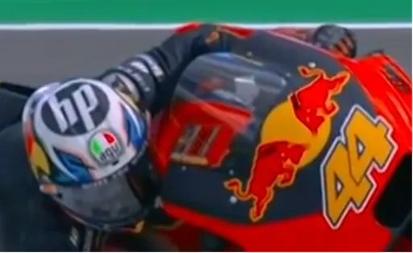

* Le menton (pas les yeux) tourné vers le point de corde.
* Le bras extérieur, tendu et appuyé sur le réservoir. On doit sentir la pression du réservoir sous le bras. Les espagnols disent "codo al sol". Autrement dit on doit avoir le coude au soleil et le pli, l'intérieur, du coude doit être orienté vers le réservoir. On doit sentir que le bras est tendu. Cela oblige mécaniquement à avoir la tête loin à l'intérieur du virage car le bras repousse, l'épaule, le cou et la tête (alouette).

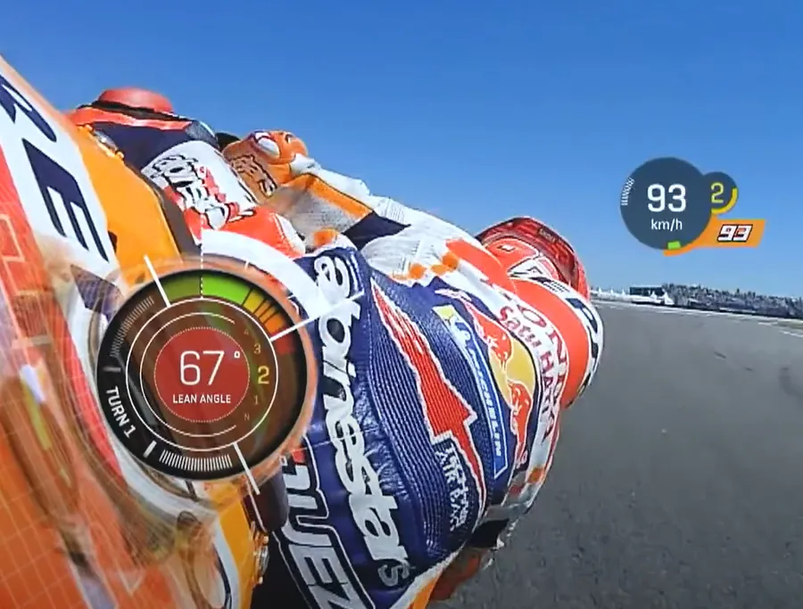

Ci-dessus, faut pas regarder l'angle pris par le petit jeune. Faut juste regarder où se trouve le coude gauche et comment il est orienté. Au soleil 🎶🎵

* Pied intérieur sur la pointe. Plus précisément : c'est la partie la plus large du pied, celle qui est après le raccordement des orteils qui doit reposer sur le cale-pied. Concernant la position latérale, le pied ne doit pas être collé à la moto sinon on ne va pas pouvoir écarter le genou. Le pied ne doit pas être non plus trop écarté car il risque de ripper. Bref, il faut sentir que **le petit orteil** est dans le vide. Ensuite, le pied tourne à 90° (le talon touche la moto) et on appuie sur le cale-pied. Il doit y avoir des marques sur les semelles des bottes !
* Genou ouvert
* Pied extérieur, à plat, calé sur le talon. Perso je n'y arrive pas, je laisse les métatarses sur le cale-pied. Comme je ne suis pas grand cela me permet de toucher le réservoir avec le genou.

* La cuisse extérieure ancrée dans le réservoir (là aussi il faut sentir qu'on appuie sur le réservoir). Vu qu'on n'est pas agrippé au guidon et qu'on ne le tient presque pas, le genou extérieur c'est ce qui doit nous empêcher de "tomber" de la moto.
* Tenir le bracelet intérieur comme **un tournevis** (avant-bras dans le prolongement de la poignée)
* Le coude intérieur, qui est dans l'alignement du poignet, est donc très en dessous du guidon. Voir par exemple ci-dessous :

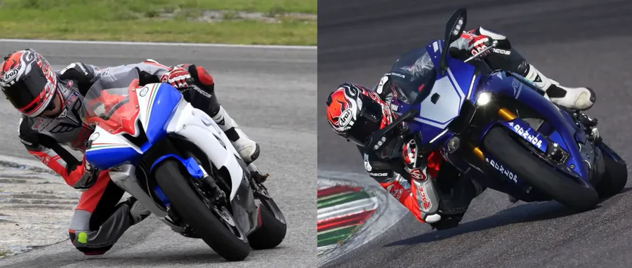

La vidéo associée (où Alberto parle aussi de Grip-Shifting etc.)

<iframe width="560" height="315" src="https://www.youtube.com/embed/jX1VhUhMrtg?si=rDZs1GUy8o9Bv57f&amp;start=58" title="YouTube video player" frameborder="0" allow="accelerometer; autoplay; clipboard-write; encrypted-media; gyroscope; picture-in-picture; web-share" referrerpolicy="strict-origin-when-cross-origin" allowfullscreen></iframe>

**En résumé**
En fait, dans ces histoires de position et de conduite de virage, c'est surtout une question de sensation. Faut trouver LE truc, LA sensation, LE touché qui fait que vous savez que telle ou telle partie du corps est correctement positionnée. Tout ne viendra pas d'un seul coup mais l'idée c'est de travailler un truc, puis un autre etc. Par exemple on peut aller voir les photos de la journée de roulage. C'est toujours très instructif.

Il faut quand même garder à l'esprit que c'est parce que l'on veut passer de plus en plus vite en virage qu'on ajuste et qu'on modifie sa position. C'est donc pour ça qu'au tout début ce n'est pas la peine de se croire en MotoGP. Ce n'est pas la position qui va nous faire passer plus vite, **c'est parce qu'on veut passer plus vite qu'on ajuste notre position**.

On peut s'inspirer des 2 images ci-dessous. Regardez la prise tournevis, l'alignement de l'avant-bras avec le bracelet et la position du coude ainsi que le décalage de l'ensemble tête-colonne par rapport à l'axe de la moto. Il est vraiment sur le côté de la moto.

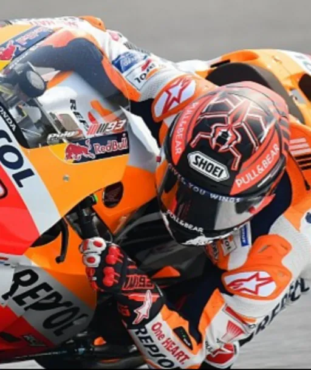

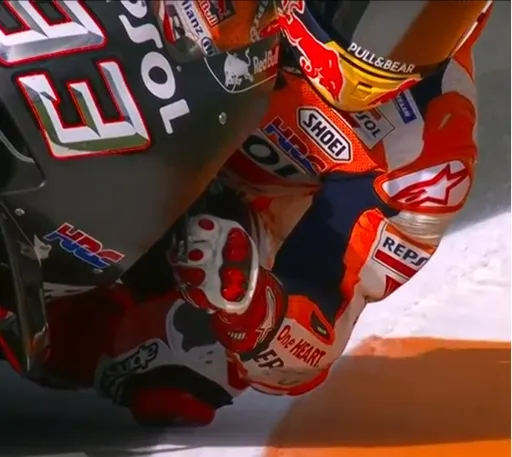

C'est le même virage que l'image précédente mais à la sortie avec la moto qui se relève. Il reste la fesse à côté de la selle car...

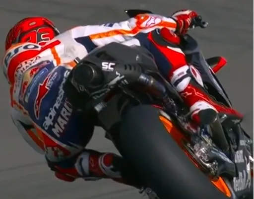

Un peu plus tard, il repique encore à gauche.

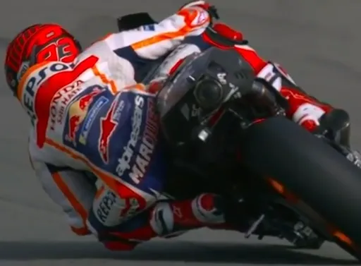

La seconde partie de la vidéo ci-dessous peut donner des idées. Entre autres, elle explique bien pourquoi, sortir la tête de l'axe de la moto permet de passer plus vite en virage.

<iframe width="560" height="315" src="https://www.youtube.com/embed/VFZoZLMZGqQ?si=3PjWQkMzeLQTvU3Q&amp;start=376" title="YouTube video player" frameborder="0" allow="accelerometer; autoplay; clipboard-write; encrypted-media; gyroscope; picture-in-picture; web-share" referrerpolicy="strict-origin-when-cross-origin" allowfullscreen></iframe>

### Qu'est ce qui nous empêche d'avoir des mises sur l'angle plus rapides ? 
Si on garde le même point de mise sur l'angle et la même vitesse cela permet d'avoir moins d'angle dans le virage

La vitesse de mise sur l'angle détermine la vitesse de passage dans le virage. Point, fin de l'histoire

On peut essayer de mettre les bras un peu plus à l'horizontal pour avoir plus de couple quand on pousse sur le bracelet intérieur. Faut aussi penser à vérifier si les bracelets n'ont pas besoin d'être écartés.

Si la mise sur l'angle est lente alors, on :
* Tourne trop tôt
* Part trop large
* Attend trop longtemps avant de remettre les gaz
* Fait des corrections au milieu du virage
* Utilise trop d'angle
* On est rigide sur le guidon

La vitesse de mise sur l'angle c'est **LA** différence entre les pilotes

**Comment faire ?**
* Lors de la mise sur l'angle, penser à alléger les fesses et à appuyer sur les cale-pieds
* Sentir qu'on pousse sur le bras intérieur

### *Quand est-ce qu'il commencer à ouvrir les gaz ?*

Une fois arrivé au point "où on le sent bien" on enroule gentiment et continûment (Throttle rule, répartition des masses 40/60...). Ça peut être au milieu du virage, au point de corde, peu après le point de corde... Plus tard se sera systématiquement avant le point de corde, juste après le PV une fois que nos roues seront sur la ligne PV-PC-PS. L'idée c'est de se donner les moyens d'être 100% gaz au point de corde.

* Si, quand on accélère, on sent le nez de la moto se relever, c'est qu'on a accéléré encore trop fort. Au début ça doit être imperceptible.
* Vraiment, l'un des trucs, c'est de ne plus laisser la poignée de gaz stable sur un filet de gaz en virage. Dorénavant les gaz sont coupés en entrée de virage puis on les ouvre continûment, en le faisant tout "dou-ce-ment" au début. Enfin bref, plus de filet de gaz dans les virages.
* 40/60 : c'est la répartition idéale des charges (en pourcentage) entre l'avant et l'arrière. En accélérant gentiment on déleste un peu l'AV et on charge un peu l'AR. C'est l'idéal pour la moto.

Dit autrement... Le moment où on commence à enrouler le câble d'accélérateur c'est souvent au milieu du virage, un peu avant le point de corde qui lui se trouve généralement au 3/4 du virage (plus le virage est serré plus le point de corde est reculé).

Quand on dit "un peu avant le point de corde" il faut comprendre 2 ou 3 motos de long. L'idée c'est de commencer à ouvrir tout doucement afin que le transfert de charge de l'avant vers l'arrière soit imperceptible. Ensuite, c'est parti, on enroule et on s'arrête plus et on enroule de plus en plus vite.

De manière générale, on commence à ouvrir les gaz une fois que la mise sur l'angle est terminée (ça c'est évident), qu'on est sûr qu'on va placer nos roues sur le point de corde (au millimètre près), qu'on sait par où on va passer pour sortir du virage et qu'on doit commencer à relever la moto.

Du coup selon les virages cela peut être, loin avant, près de, ou carrément sur le point de corde. Dans tous les cas il faut être patient et si on ouvre trop tôt, au tour suivant il faut retarder le freinage, rentrer dans la courbe avec plus de vitesse et commencer à accélérer plus tard.

La vidéo suivante traite spécifiquement du sujet.

<iframe width="560" height="315" src="https://www.youtube.com/embed/vIgiE2IAIUA?si=qisn3UifVEz5TxAs" title="YouTube video player" frameborder="0" allow="accelerometer; autoplay; clipboard-write; encrypted-media; gyroscope; picture-in-picture; web-share" referrerpolicy="strict-origin-when-cross-origin" allowfullscreen></iframe>

### *100% gaz au point de corde, t'es sûr de ton coup ?*

Si tout se passe bien c'est en effet ce qu'il faut rechercher. Il ne faut pas oublier un truc. On n'est pas sur une Xbox et donc même si on est 100% gaz au PC on n'aura pas tout de suite toute la cavalerie à la roue arrière. À cause de l'inertie de la mécanique, cette dernière n'arrivera qu'une fois le PC passé alors qu'on est en train de relever la moto et qu'on a de plus en plus de grip à la roue arrière. Perso je n'y arrive toujours pas et je sais pas si j'y arriverais un jour.

### Virage qui se resserre

Voir aussi [ATOTW II p 82](https://www.amazon.fr/Twist-Wrist-Vol-Performance-Motorcycle/dp/0965045021/ref%3Dsr_1_1?__mk_fr_FR=%C3%85M%C3%85%C5%BD%C3%95%C3%91)

Aller le plus loin possible pour aller chercher le bord extérieur de la piste (late apex, sommet retardé)

Voir la vidéo ci-dessous :

<!-- https://youtu.be/I1GDuD8JuWQ?t=41 -->

<iframe width="560" height="315" src="https://www.youtube.com/embed/I1GDuD8JuWQ?si=1BjVJ2QCKqScrX_1&amp;start=41" title="YouTube video player" frameborder="0" allow="accelerometer; autoplay; clipboard-write; encrypted-media; gyroscope; picture-in-picture; web-share" referrerpolicy="strict-origin-when-cross-origin" allowfullscreen></iframe>

### Les plus gros gains sont dans les virages rapides (et les lignes droites)

**Throttle Rule 2**
* *In any fast-entry turn, calculate the roll-off as carefully as you would a roll-on*

Dans un virage rapide il faut éviter le "**charging**" ([ATOTW II p 29](https://www.amazon.fr/Twist-Wrist-Vol-Performance-Motorcycle/dp/0965045021/ref%3Dsr_1_1?__mk_fr_FR=%C3%85M%C3%85%C5%BD%C3%95%C3%91)). Le "charging" ça ressemble à ça :

* Rentrer à fond le plus loin possible
* Couper les gaz,
* Attendre en zone morte ou freiner légèrement pour supprimer l'excès de vitesse
* Remettre les gaz

En effet :
* Ça fait perdre beaucoup trop de vitesse
* On perd nos points de référence
* Ça masque le sens qu'on a de la vitesse (ça fait plaisir mais ce n'est pas efficace)
* Notre champ de vision se réduit
* Ça tue la vitesse de sortie

Au lieu d'essayer d'arriver à fond à 13 000 tr/minute tout de suite.
* Commencer en arrivant à vitesse constante 9 000 **qu'on est sûr de pouvoir tenir dans tout le virage**
* Dans le virage, accélérer pour faire un transfert de charge vers l'arrière et se retrouver en 40/60 entre l'avant et l'arrière.
* Au prochain tour augmenter de 500 tr/min à l'entrée.

### Que faire si le virage n'est pas grand ouvert?
* Couper les gaz gentiment bien avant ce que l'on ferait habituellement
* Ensuite rouvrir les gaz le plus tôt possible
* Augmenter le nombre de tr/min au tour prochain
* Voir aussi s'il n'y a pas moyen de ne **PAS** couper complètement les gaz à l'entrée.

### *Oui mais moi y a un virage rapide où je coupe carrément*
Si dans un virage on est tenté, en cours de route, de couper les gaz ou de freiner légèrement faut se dire qu'on viole la Throttle Rule.
* Il faut changer d'approche, vérifier si un meilleur contrôle de l'accélérateur ne pourrait pas résoudre le problème et nous faire sortir plus vite du virage.
* Il faut vraiment arriver à accélérer plus tôt mais beaucoup moins fort qu'avant.
* La poignée ne doit plus rester à ouverture constante en virage.
* Une fois qu'on a commencé à ouvrir, on continue à ouvrir jusqu'à 100%.

### Virage en Hook
Lire [ATOTW II p 59](https://www.amazon.fr/Twist-Wrist-Vol-Performance-Motorcycle/dp/0965045021/ref%3Dsr_1_1?__mk_fr_FR=%C3%85M%C3%85%C5%BD%C3%95%C3%91). Faut mettre du poids sur l'avant et en bas pour être capable de faire un virage en Hook et pas en Arc ("Bite and Turn")

Si on rallume les gaz trop tôt on a une trajectoire en Arc

Une fois que la moto est sur l'angle c'est l'arrière qui est responsable de la stabilité

Pour s'en convaincre il n'y a qu'à voir les photos de roue arrière en sortie de virage où la moto garde le même angle que dans le virage

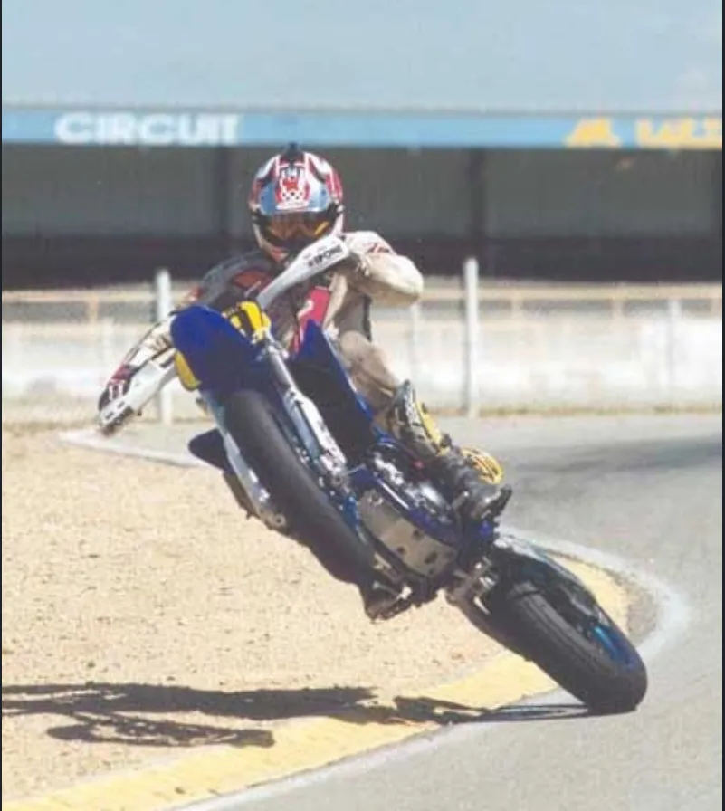

Pour avoir un virage en Hook (crochet, comme le capitaine, pas le tricot) il faut pencher le buste en avant et en bas, à l'intérieur du virage

**Steering Rule N°1**
* *One single steering action per turn*

### Pourquoi quand on freine en virage la moto part à l'extérieur ?

* Je suis sur l'angle
* Je coupe les gaz ou je freine de l'avant
* Il y a transfert de masse vers l'avant
* La fourche s'enfonce
* Le pneu avant s'écrase
* Son empreinte au sol s'agrandie et devient dissymétrique (elle est plus grande à l'intérieur qu'à l'extérieur du virage)
* Il y a plus de grip du côté intérieur du virage
* Un couple s'applique qui fait tourner la roue vers l'intérieur du virage (y a plus de pneu à l'intérieur, donc la roue est plus freinée du côté intérieur).
* Par effet gyroscopique la roue avant se relève alors instantanément
* La moto aussi
* Elle tire tout droit et élargi le virage
* Cela dit, comme les gaz sont coupés, la moto ralentit, reprend de l'angle et une courbe plus resserrée
* Au départ de l'action, c'est donc l'opposé de ce que l'on attend qui se produit !

Il faut bien comprendre que lorsque les gaz sont constants et qu'on est en virage, la moto ralentit. On observe donc le même résultat, la moto s'écarte de sa ligne. C'est d'autant plus vrai que la vitesse dans la courbe est élevée

Bref, en virage, il n'y a qu'une seule règle à appliquer : Le Throttle Rule # 1 (ouvrir gentiment et continûment les gaz en virage)

### Que faire si on est rentré trop vite et qu'on va être trop large?

* Il ne faut pas couper les gaz
  + Facile à dire...
  + Voir question précédente
* Faut pencher encore plus la tête vers le bas
* Faut appuyer son poids sur le cale-pied intérieur
* Le but est de mettre plus de poids à l'intérieur du virage pour compenser la force centrifuge qui nous emmène à l'extérieur

Voir la vidéo ci-dessous à partir de 27'30''

<!-- https://youtu.be/XcMp7wuVKhY?t=1650 -->

<iframe width="560" height="315" src="https://www.youtube.com/embed/XcMp7wuVKhY?si=fbHGWfGTN0_AzZPO&amp;start=1650" title="YouTube video player" frameborder="0" allow="accelerometer; autoplay; clipboard-write; encrypted-media; gyroscope; picture-in-picture; web-share" referrerpolicy="strict-origin-when-cross-origin" allowfullscreen></iframe>

<!-- Pos OK -->
### Que faire si on se retrouve constamment coincé à la corde?

On va là où on regarde. Donc si à l'entrée du virage on regarde l'intérieur du virage, le début du vibreur par exemple, c'est là qu'on va aller.
* On aura une ligne "facile" jusqu'à la l'intérieur du virage mais on sera planté pour la sortie.
* En effet, en sortie, notre trajectoire sera trop large. Il va falloir rester longtemps sur l'angle pour virer, on va donc perdre beaucoup de temps à remettre la moto verticale et à 100% des gaz

Pour éviter ça il est recommandé :
* D'arriver sur le virage en étant tout à l'extérieur (à rouler à 1 cm de la bande blanche)
* Trouver le point de corde (typiquement il est au 2/3 ou 3/4 du virage) avant d'inscrire la moto sur l'angle et ne plus le lâcher des yeux.
  + En focalisant sur le point de corde on fait abstraction de l'entrée du virage, entre autres le vibreur intérieur, et donc, on ne va pas aller droit dessus.
* De faire l'effort de rester large lors de la mise sur l'angle tout en visant le point de corde.

Tout ceci fait partie du **Three Steps** dont on a déjà parlé dans la [note de Pilotage N°03]().

Si on passe l'apex et qu'on se trouve coincé à la corde, avec pas mal d'angle, incapable d'accélérer car on ne voit pas la sortie c'est parce que le PMSA est trop tôt (on a sans doute une mise sur l'angle trop lente).

La solution n'est surtout pas de se dire qu'au prochain tour on va ouvrir en grand alors qu'on est encore complètement sur l'angle. On va en demander trop au pneu AR (angle + accélération) et ça va mal se finir.

Ce qui ne va pas c'est la ligne qu'on suit dans le virage. Au prochain tour il faut donc faire exactement la même chose mais avec un PMSA retardé. Bien sûr ce dernier étant retardé la mise sur l'angle devra être exécutée plus rapidement... Il faudra pousser plus fort sur le bracelet intérieur etc. 

<!-- Pos OK -->
### Image mentale pour éviter d'aller se jeter à la corde
Du point de vue de la trajectoire en virage, je me dis que tout se passe comme si je voulais, sur une ligne droite, aller de A en B (dessin de gauche) mais qu'il y a maintenant un virage entre les 2 points (dessin de droite). Voir ci-dessous le formidable schéma où je prends le cas d'une épingle.

Sur le dessin ça ne se voit pas bien mais au milieu du virage (en C) on doit être

* Dans la moitié intérieure de la piste.
* Bien voir qu'on n'est toujours pas à la corde.
* Noter qu'on est à la corde qu'en un seul point (en B).
* Que c'est en C qu'on prend le plus d'angle car c'est là qu'on fait tourner la moto

Donc on ne passe pas tout notre temps à longer la corde. Les pneus touchent la corde une fois et une seule.

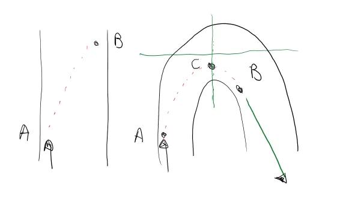

C'est aussi pour ça qu'il faut regarder le point de corde bien avant la mise sur l'angle et faire abstraction de tout ce qui il y a autour afin d'aller de A en B sans plonger trop tôt à la corde comme un idiot.

Normalement, plus le virage est lent et plus le point de corde est retardé et donc les positions de C et B dépendent de chaque virage. Je ne sais pas si c'est correct comme raisonnement mais c'est l'idée que je m'en fais.

<!-- Pos OK -->
### Faut arrêter de se faire plaisir au freinage !

Faut rentrer moins fort pour privilégier l'accélération en virage (.1 ou .2 G) puis la sortie de virage

***Celui qui gagne ce n'est pas celui qui accélère le plus fort mais celui qui accélère le plus tôt !*** *(MotoVudu)*

C'est moins sexy mais, finalement, c'est plus efficace

<!-- https://youtu.be/NqmSB5RJNRg -->

<iframe width="560" height="315" src="https://www.youtube.com/embed/NqmSB5RJNRg?si=ruGXGg1W2Sgqjqyi" title="YouTube video player" frameborder="0" allow="accelerometer; autoplay; clipboard-write; encrypted-media; gyroscope; picture-in-picture; web-share" referrerpolicy="strict-origin-when-cross-origin" allowfullscreen></iframe>

<!-- Pos OK -->
### Rester "relâché des bracelets"

* C'est le meilleur moyen de limiter le nombre d'informations que l'on reçoit et que l'on transmet à la moto
* Aucune pression sur le guidon n'est nécessaire à partir du moment où on a la bonne ouverture de gaz
  + Penser aux photos où le gars a la main levée alors qu'il a un genou au sol et qu'il est en plein virage.

* Penser à vérifier qu'on peut facilement bouger les coudes en virages.
  + **Chicken Wings**. Ne pas hésiter à bouger les coudes en virage juste pour vérifier qu'on est pas rigide comme un bout de bois et avoir l'air ridicule…
  + C'est la confirmation qu'on est décontracté, relâché
  + Penser à lever les doigts et à toucher les leviers de frein et d'embrayage par-dessous avec les doigts tendus (**Doigts de Sauron**)

* Il faut bien tenir la moto avec les jambes (Hooked in)
  + Faut vraiment sentir la pression des cuisses sur le réservoir
  + Ça permet de relâcher les bras du guidon
  + Il faut tenir le guidon comme si on tenait des poussins dans nos mains

* Si en sortie de virage, quand l'avant est "lite", ça guidonne, c'est qu'on n'est pas "relâché des bracelets" et/ou qu'on n'accélère pas gentiment

* Si on aime moins les virages à droite par exemple faut commencer par vérifier qu'on n'y est pas plus tendu que dans les virages à gauche.
  + Faut alors faire l'effort de se relâcher dans les droits

<!-- Pos OK -->
### Grip-Shifting

À propos de l'accélérateur, il faut aussi penser aussi au **Grip Shifting**. Quand on a terminé avec le freinage et **avant** qu'on commence à tourner la poignée des gaz
* On écrate les doigt très légèrement 
* On tourne le poignet vers l'avant, **autour** de la poignée de gaz
* Et ensuite seulement on ouvre les gaz
* Ça évite de coincer le poignet à 50% des gaz dans la ligne droite suivante

Donc il faut penser à faire ça :

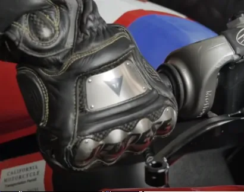

Pour éviter de se retrouver là :

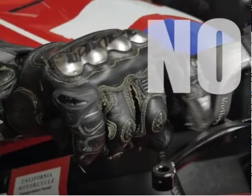

Dans la vidéo ci-dessous c'est instructif de voir, au ralenti, ce qui se passe avec la main au moment où il relâche complètement le frein avant. Faut aussi bien regarder comment il tient l'accélérateur en ligne droite... La main ne touche quasiment pas la poignée. La paume est très écartée de la poignée par exemple (1'19" par exemple).

<!-- https://youtu.be/h24XjzybrA0 -->

<iframe width="560" height="315" src="https://www.youtube.com/embed/h24XjzybrA0?si=3yhZXHpjccY7WmDT" title="YouTube video player" frameborder="0" allow="accelerometer; autoplay; clipboard-write; encrypted-media; gyroscope; picture-in-picture; web-share" referrerpolicy="strict-origin-when-cross-origin" allowfullscreen></iframe>

Maj. 17/03/23 : Sylvain Guintoli vient de dédier une [vidéo](https://youtu.be/f1NR1VdvmTA) à ce sujet. C'est dire si c'est important.

<!-- Pos OK -->
### Le point de vue de Simon Crafar

Toujours à propos de la conduite de virage et sur l'importance que [Simon Crafar](https://fr.wikipedia.org/wiki/Simon_Crafar) accorde à "raccourcir les virages". Sa remarque est que ce qui compte ce sont les vitesses d'entrée et de sortie, pas les vitesses de passage en virage. Il remarque que ceux qui rentrent très loin dans le virage sur les freins (Trail Braking) vont à un moment ou à un autre limiter leur vitesse de passage car ils demandent trop au pneu arrière (là je ne suis pas sûr de comprendre ce qu'il veut dire).

Il propose : très gros freinage, très loin, mise sur l'angle rapide, wait, wait, wait et dès qu'on voit la sortie monter à 100% des gaz.

En tout cas c'est bien d'avoir un avis complémentaire sur la conduite de virage.

<iframe width="560" height="315" src="https://www.youtube.com/embed/5N1KZRcEUzE?si=uyWp-qPrp0YaATw1" title="YouTube video player" frameborder="0" allow="accelerometer; autoplay; clipboard-write; encrypted-media; gyroscope; picture-in-picture; web-share" referrerpolicy="strict-origin-when-cross-origin" allowfullscreen></iframe>

<!-- ###################################################################### -->
<!-- ###################################################################### -->
## La suite au prochain épisode

Bon, allez, la suite au prochain numéro. D’ici-là relisez les [notes de pilotage]() ou faites des squats afin de préparer les prochains roulages.

<iframe width="560" height="315" src="https://www.youtube.com/embed/TIhtpItTuxc?si=qL84DxP-ejd_Yi4-&amp;start=53" title="YouTube video player" frameborder="0" allow="accelerometer; autoplay; clipboard-write; encrypted-media; gyroscope; picture-in-picture; web-share" referrerpolicy="strict-origin-when-cross-origin" allowfullscreen></iframe>

<!-- #### **Remarque**
{: .no_toc }

 -->

