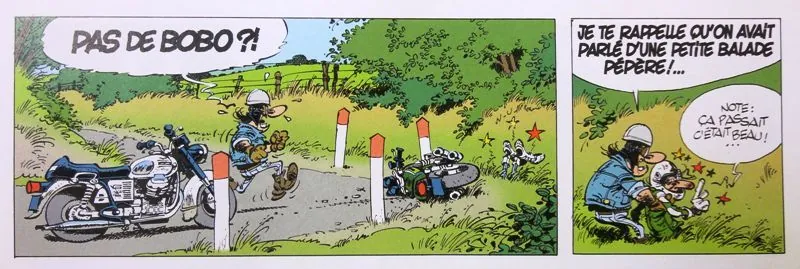
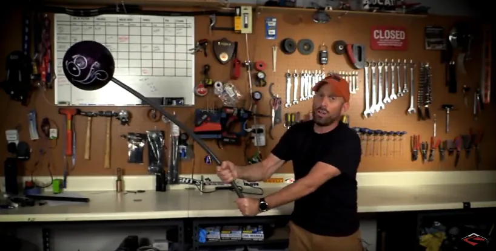

# Conduite de virage efficace
{: .no_toc }

## Plan de la Note de Pilotage
{: .no_toc .text-delta}
- TOC
{:toc}

<!-- ###################################################################### -->
<!-- ###################################################################### -->
## Introduction

Que ce soit sur route ou sur circuit, on s'est tous, au moins une fois, trouvé dans un virage où l'on sentait qu'on allait sortir trop large. Le Hook Turn est l'outil dont on aurait eu besoin...

<!-- ###################################################################### -->
<!-- ###################################################################### -->
## Objectifs de la session

* Se doter d'un outil qui va nous permettre de resserrer les virages (au milieu, au début ou à la fin). Pourquoi ? Afin de favoriser la sortie, faudra le répéter combien de fois ? Ok, mais pourquoi ça favorise la sortie ? Si on sort moins large, la prochaine fois on pourra accélérer plus fort, plus tôt et on se retrouvera 100% gaz plus vite que les autres.

* On veut donner plus d'angle (resserrer le virage) tout en maîtrisant la stabilité de la moto.

<!-- ###################################################################### -->
<!-- ###################################################################### -->
## Prérequis

* [Faire des chaises](https://youtu.be/O1l1DBqYUfc) à la maison, le long d'un mur, pour muscler les cuisses.
* Avoir un virage dont on [maitrise la conduite](), où on se sent bien et dont on souhaite resserrer la sortie :
  + C'est important de resserrer la sortie car ça nous donne de la marge pour les prochaines fois où on sortira encore plus fort (et donc avec une tendance plus forte à aller vers l'extérieur)
  + Si on ne fait pas l'effort de resserrer nos virages avec le Hook Turn on va aller au tas plus tard (généralement... Ça, ça motive...).

<!-- ###################################################################### -->
<!-- ###################################################################### -->
## Petit rappel utile avant de rentrer sur le circuit

On ne pourra pas dire qu'on n'en a pas parlé...

* Petit coup d'œil derrière, sur la piste, avant de rentrer
    * Je lève mes fesses de la selle et je tourne franchement la tête et le haut du corps pour vraiment voir ce qui arrive. Si on reste assis, il ne faut pas hésiter à lâcher la main du côté vers lequel on tourne le buste.
* Ne **PAS** prendre la corde du tout premier virage
    * On rentre sur le circuit, généralement, dans une ligne droite
    * Si on va à la corde du premier virage, au bout de la ligne droite, on peut se faire percuter par un gars qui est sur la piste depuis un moment et qui est lancé
* Si on n'a pas de **couvertures chauffantes** alors on a gagné 2 tours de chauffe
    * Accélérations franches en ligne droite pour le pneu arrière
    * Freinages progressivement de plus en plus appuyés pour le pneu avant
    * **PAS** de zigzag. Ça ne sert strictement à rien
* On se fiche du chrono lors des tours de chauffe.
* Rouler très à l'aise, 2/3 de ses possibilités, ne pas se mettre en mode panique
* Au 3eme tour on monte gentiment à 3/4 de ses possibilités car c'est une session de travail (on n'est pas là pour claquer une pendule)

<!-- ###################################################################### -->
<!-- ###################################################################### -->
## La session

On se place dans le cas où on a un virage connu dont on sort avec 100% des gaz, **en butée**, et sur la bande blanche extérieure de la piste. On est donc dans le virage, une fesse dehors etc. mais bon, on souhaite sortir moins large.
* Pour appliquer le Hook Turn, dans ce virage, il faut gentiment, progressivement, basculer le corps encore plus vers **l'avant** et **l'intérieur** qu'on ne le faisait jusqu'à présent.
* Attention, les mots gentiment et progressivement sont **très** importants. Si on est brusque, la moto va commencer à sauter dans tous les sens comme un cabri, les pneus vont perdre leur grip etc. 
* **Maj 17 03 23 :** Faut pas oublier que le pilote tout équipé représente un pourcentage non négligeable de la masse de l'ensemble moto-pilote (80 vs (200+80) soit 30% environ, ce n'est pa neutre)

* Le déplacement pro-gre-ssif de la masse vers **l'avant** de la moto et **l'intérieur** du virage va attirer la moto vers le bas

* Elle va prendre plus d'angle (c'est ce que l'on souhaite pour resserrer un virage qu'on sent être trop large par exemple)

* Il ne faut **PAS** juste faire sortir le buste sur le côté et se pencher vers le bas (comme si on voulait éviter un ballon qui nous arrive dessus).

* Alors qu'on a déjà une fesse sortie, il faut encore plus basculer le buste vers **l'avant** et à **l'intérieur** du virage en poussant le coude intérieur
  + Tête à côté du réservoir
  + Le coté du casque touche le flan du réservoir
  + Le menton encore plus sur la main
* On pousse :
  1. **Devant** et **en bas** pour charger l'avant. Ce faisant ce dernier est plus enfoncé, la moto est plus courte et vire encore mieux.
  1. Vers **l'intérieur** du virage pour contrebalancer plus efficacement la force centrifuge.

* Bien être calé grâce aux genoux et aux pieds
  + On est accroché à la moto. Pour faire un Hook Turn il faut être Hooked In (accroché)
  + Sentir qu'on tient le réservoir avec les cuisses
  + Le bas du corps fait bloc avec la moto alors que le haut du corps est très mobile.

* On ne change pas la pression sur les poignets. Il faut penser qu'on pourrait faire tout ça **SANS** toucher les bracelets

### Entraînement

* Ce n'est pas le guidon qui supporte le poids du corps ce sont les **cuisses**.
* Il faut avoir mal aux cuisses en fin de journée (ou le lendemain)
* C'est pour ça qu'il faut faire des chaises et des squats à la maison.
* Normalement les semelles des bottes doivent être marquées car on appuie beaucoup sur les cale-pieds.
* Le basculement du buste se fait en se tenant à la moto avec les genoux. Il ne faut pas hésiter à faire des essais à blanc dans le garage.
  + Je serre les genoux.
  + J'écarte les bras et je penche le buste en avant et sur le côté.
  + Je reste bras écarté (oui oui, je confirme, tu as l'air d'une andouille si la petite Chloé, 4 ans, qui cherche son papa (ou sa maman) rentre à ce moment-là dans le garage).
  + Je tiens la position avec les cuisses et les abdos.

### À retenir
* On est Hooked In, accroché, à la moto par le bas du corps.
* En tout cas, **on ne s'accroche pas à la moto avec les mains**

<!-- https://www.youtube.com/watch?v=rsCzhVyCFNg&feature=youtu.be&t=787 -->

<iframe width="560" height="315" src="https://www.youtube.com/embed/rsCzhVyCFNg?si=_5dQOiaLnGGhQJ4w&amp;start=787" title="YouTube video player" frameborder="0" allow="accelerometer; autoplay; clipboard-write; encrypted-media; gyroscope; picture-in-picture; web-share" referrerpolicy="strict-origin-when-cross-origin" allowfullscreen></iframe>

<!-- ###################################################################### -->
<!-- ###################################################################### -->
## À la fin de la session

* Dans les virages il faut dorénavant sentir que
  + Le bas du corps est Hooked In (accroché dans) dans la moto
  + Le haut du corps est très mobile
  + Le buste va vers **l'avant** et vers **le bas** (casque, flan réservoir...)
  + On sent qu'on pousse le coude intérieur *et/ou* qu'on met le menton sur la main
  + La moto reste stable mais change de trajectoire (cette dernière se resserre)
  + **MaJ 17 03 23 :** Le coude est cassé, très bas, plus bas que le bout du bracelet. On tient ce dernier comme un tournevis.
* Il faut constater que toutes choses égales par ailleurs (freinage, point de mise sur l'angle, accélération en sortie etc.) cette action, exécutée jusqu'à la fin du virage, permet de sortir moins large que dans les séances précédentes. Autrement dit, plus tard, on pourra sortir plus fort du virage sans sortir de la piste.
* Finalement, on a un outil qui permet de resserrer les trajectoires ce qu'il leur donne une forme en crochet (Hook)

<!-- ###################################################################### -->
<!-- ###################################################################### -->
## Remarques

### Pourquoi il faut déplacer son corps à l'intérieur du virage ?

Et pas uniquement le mettre encore plus bas...

La vidéo ci-dessous revient sur les forces en action dans un virage et justifie pourquoi il faut pencher la moto vers l'intérieur du virage. A la fin elle revient aussi sur ces histoires de contre braquage.

<!-- https://youtu.be/PgUOOwnZcDU -->

<iframe width="560" height="315" src="https://www.youtube.com/embed/PgUOOwnZcDU?si=gobbx5ouzrZJYF2N" title="YouTube video player" frameborder="0" allow="accelerometer; autoplay; clipboard-write; encrypted-media; gyroscope; picture-in-picture; web-share" referrerpolicy="strict-origin-when-cross-origin" allowfullscreen></iframe>

On comprend dans la vidéo précédente qu'il faut appliquer un couple afin d'empêcher la moto de se relever. **Maj 17 03 23 :** Un couple c'est une force au bout d'un axe. Si tu n'arrives pas à desserrer un écrou, typiquement, tu prends une clé plus longue. Si on veut appliquer plus de couple, à masse égale, il faut avoir un bras de levier plus grand (et pas nécessairement avoir une masse plus basse).

Il faut donc, à tout prix, sortir sa tête de l'axe longitudinal de la moto et la mettre sur le côté. Le plus loin, le mieux. Voir ci-dessous :

On retiendra qu'en virage, il ne faut pas nécessairement mettre sa tête et son corps plus bas afin d'abaisser le centre de gravité de l'ensemble moto+pilote. Il faut sortir sa tête et son corps de l'axe de la moto pour appliquer un couple supérieur et empêcher la moto de se redresser. **Maj 17 03 23 :** C'est aussi pour ça qu'il ne faut pas hésiter à penser qu'on sort 2 fesses (même si dans la réalité on en sort qu'une et demi). En effet, ça permet de décaler plus de masse plus loin à l'intérieur du virage et donc d'exercer plus de couple.

Le lien sur la vidéo précédente dont est extraite l'image

<iframe width="560" height="315" src="https://www.youtube.com/embed/VFZoZLMZGqQ?si=JXyeSsawWDEkG9__&amp;start=187" title="YouTube video player" frameborder="0" allow="accelerometer; autoplay; clipboard-write; encrypted-media; gyroscope; picture-in-picture; web-share" referrerpolicy="strict-origin-when-cross-origin" allowfullscreen></iframe>

Une autre vidéo sur le même sujet sans toutefois parler de Hook Turn

<iframe width="560" height="315" src="https://www.youtube.com/embed/MLrjm84_BOU?si=doGEspUJAkY-k8ou" title="YouTube video player" frameborder="0" allow="accelerometer; autoplay; clipboard-write; encrypted-media; gyroscope; picture-in-picture; web-share" referrerpolicy="strict-origin-when-cross-origin" allowfullscreen></iframe>

<!-- ###################################################################### -->
<!-- ###################################################################### -->
## La suite au prochain épisode

Bon, allez, la suite au prochain numéro. D’ici-là relisez les [notes de pilotage]() ou faites des squats afin de préparer les prochains roulages.

<iframe width="560" height="315" src="https://www.youtube.com/embed/TIhtpItTuxc?si=qL84DxP-ejd_Yi4-&amp;start=53" title="YouTube video player" frameborder="0" allow="accelerometer; autoplay; clipboard-write; encrypted-media; gyroscope; picture-in-picture; web-share" referrerpolicy="strict-origin-when-cross-origin" allowfullscreen></iframe>

