# Conduite de virage efficace
{: .no_toc }

## Plan de la Note de Pilotage
{: .no_toc .text-delta}
- TOC
{:toc}

<!-- ###################################################################### -->
<!-- ###################################################################### -->
## Introduction
Je ferme les yeux et je me vois à moto, avant d'entrer dans un virage à gauche. Non, non, je ne suis pas sur piste, je suis à 80km/h sur une belle route de campagne bien goudronnée. J'ai coupé les gaz, ma vitesse est adaptée et là, je fais quoi ? Que j'en sois conscient ou pas, je fais ce que l'on appelle un contre-braquage. Autrement dit, je pousse sur la partie gauche du guidon pour diriger la roue dans la direction opposée au virage. C'est contre intuitif, mais comme on fait ça depuis que nos vélos n'ont plus de roulettes, c'est quasiment devenu instinctif. Bon, hé ben, fort de ce constat, on va appliquer la même technique mais en sortie de virage...

<!-- ###################################################################### -->
<!-- ###################################################################### -->
## Objectifs de la session

* À vitesse de sortie égale on va utiliser moins de largeur de piste
* Le contre-braquage va nous permettre de relever la moto plus tôt et plus vite ce qui réduit le virage et rallonge la ligne droite qui suit ce dernier.
* Cela permettra d'accélérer plus tôt
* On fera l'effort de rester déhanché en sortie de virage

<!-- ###################################################################### -->
<!-- ###################################################################### -->
## Prérequis
* On a une conduite de virage sur la ligne idéale et on accélère déjà assez tôt. Pour rappel, la ligne idéale c'est la ligne sur laquelle, à partir du moment où on enroule le cable d'accélérateur, on ne s'arrête plus.
* En début de session, afin de mesurer les progrès, il faut penser à prendre un point de référence temporaire pour la fin du virage. Pour rappel, la fin du virage c'est quand la moto est verticale et qu'on est full gaz.

<!-- ###################################################################### -->
<!-- ###################################################################### -->
## Petit rappel utile avant de rentrer sur le circuit

On ne pourra pas dire qu'on n'en a pas parlé...

* Petit coup d'œil derrière, sur la piste, avant de rentrer
    * Je lève mes fesses de la selle et je tourne franchement la tête et le haut du corps pour vraiment voir ce qui arrive. Si on reste assis, il ne faut pas hésiter à lâcher la main du côté vers lequel on tourne le buste.
* Ne **PAS** prendre la corde du tout premier virage
    * On rentre sur le circuit, généralement, dans une ligne droite
    * Si on va à la corde du premier virage, au bout de la ligne droite, on peut se faire percuter par un gars qui est sur la piste depuis un moment et qui est lancé
* Si on n'a pas de **couvertures chauffantes** alors on a gagné 2 tours de chauffe
    * Accélérations franches en ligne droite pour le pneu arrière
    * Freinages progressivement de plus en plus appuyés pour le pneu avant
    * **PAS** de zigzag. Ça ne sert strictement à rien
* On se fiche du chrono lors des tours de chauffe.
* Rouler très à l'aise, 2/3 de ses possibilités, ne pas se mettre en mode panique
* Au 3eme tour on monte gentiment à 3/4 de ses possibilités car c'est une session de travail (on n'est pas là pour claquer une pendule)

<!-- ###################################################################### -->
<!-- ###################################################################### -->
## La session

* Le contre-braquage va permettre de redresser la moto plus tôt qu'avant afin de pouvoir :
  + Accélérer plus fort, plus tôt
  + Avoir une meilleure vitesse au bout de la ligne droite qui suit le virage (en fait c'est le seul objectif)

* Pour relever la moto plus rapidement on va contre-braquer en sortie de virage
* En sortie de virage on vadonc **TIRER sur le bras intérieur**
  + C'est le bras intérieur, qui est plié, qui a de la mobilité et qui a le contrôle sur les bracelets
  + Ce n'est pas le bras extérieur qui est tendu et qui ne peut pas faire grand-chose.
  + Ci-dessous c'est un pif-paf et on est juste entre les 2. Bien voir la direction de la roue avant

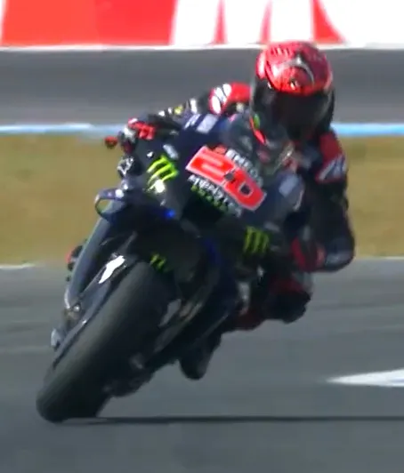

La roue est dorénavant bien levée et comme il tire sur le bracelet intérieur (le gauche), la roue est tournée vers la gauche.

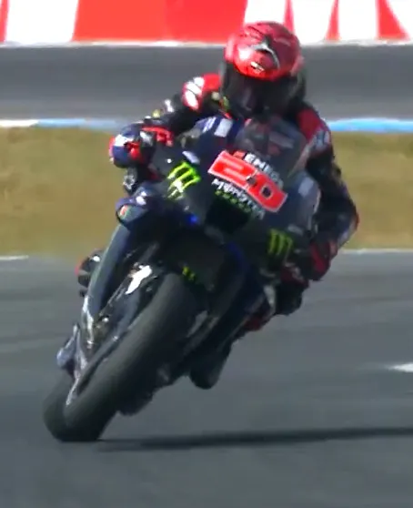

Si cela ne servait à rien de tirer sur le bracelet il ne le ferait pas. En effet, pour tenir plus de 40min à ce rythme, il a intérêt à s'économiser (Maj 17 03 23 : ce sera aussi valable avec les courses sprint et dans tous les cas, nous, à notre niveau, si on veut tenir les 7 sessions d'une journée de roulage on a intérêt à s'économiser). Donc pas la peine de perdre de l'énergie à faire des trucs qui ne servent à rien. Mais là... On voit bien où pointe la roue.

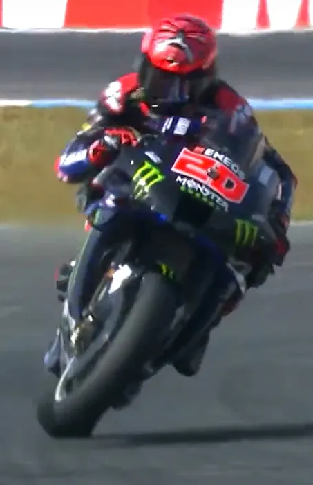

Si elle n'était pas levée on verrait beaucoup moins bien le phénomène.

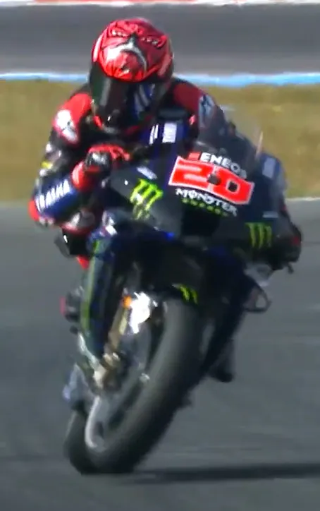

Pas convaincu ? On va donc regarder du côté de Honda. La physique et la mécanique y sont peut-être différentes. Bizarre, les deux affreux ci-dessous ont tous les deux la roues avant en l'air (ça on s'en fiche, ça permet juste de bien faire ressortir le phénomène) et ? Et on voit bien qu'eux aussi tirent sur le bracelet intérieur du virage précédent (regardes comment sont penchées les 2 autres motos derrière)

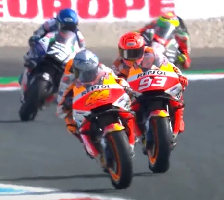

Allez, une dernière pour la route. Je passe les détails, on sort d'un gauche, on va dans un droit (voir la marque au sol) et pourtant, la roue levée pointe vers la gauche. Autrement dit, là aussi, en sortie de virage il tire sur le bracelet intérieur.

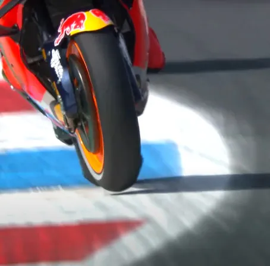

Bon allez, je crois qu'on a notre dose, j'arrête là.

### Mises-en œuvre

* Il ne faut pas tirer trop vite sur le bracelet intérieur
* On tire doucement au début du contre-braquage puis de plus en plus vite alors que la moto se relève et qu'on accélère de plus en plus.
* Au lieu de relever la moto en 2 sec on va quand même la relever en 1 sec (ce n'est pas non plus des vacances 😀)
* Donc il faut y aller, il faut TIRER de manière volontaire sur le guidon intérieur et accélérer en même temps
* Attention. Si on tire trop vite sur le guidon on n'a pas le temps d'accélérer
  + 1 seconde c'est bien, c'est le temps qu'il faut pour dire "mille et un" par exemple. "Tu es un marrant toi, tu crois que j'ai le temps de compter en sortie de virage ?" Nan, c'est juste pour te donner une indication.
* Lors de la séance, comme d'habitude, le mieux c'est de commencer par un virage où on est à l'aise et en confiance.
  + Pour pouvoir constater les progrès, on ne change qu'une seule chose à la fois.
  + Donc on freine pareil, on ne change pas la mise sur l'angle ni la conduite du virage
  + La seule chose qu'on modifie c'est qu'en sortie, on tire sur le bracelet intérieur. Il est peut-être préférable de commencer par un virage à droite car alors on tire sur le bracelet droit et on tourne la poignée d'accélérateur en même temps. À voir, moi ça me parait un peu plus facile.
* Certains pilotes disent qu'en sortie de virage, il faut repousser la moto avec ses bras pour qu'elle se mette, de plus en plus verticale alors qu'on reste penché et qu'on enroule l'accélérateur. Oui oui ils ont raison et si toutes ces histoires de contre braquage te saoule essaies de faire ça.
  Je te propose l'exercice suivant. Assieds-toi sur une chaise. Prends un balai avec tes deux mains et tu le mets à l'horizontale devant toi. Penche ton buste un peu vers la gauche et fais en sorte que le manche à balais te suive (le côté gauche est donc plus bas que le côté droit). OK, maintenant, en restant le buste penché à gauche, sans trop réfléchir, essaies de repousser le balai un peu vers la droite. En ce qui me concerne, je me retrouve toujours penché mais avec le bras gauche un peu plié et le bras droit un peu tendu. Finalement mon buste et le balai sont toujours penchés vers la gauche mais la partie gauche du manche est dorénavant plus proche de moi alors que la partie droite est plus loin de moi. Bref, tout se passe comme si on avait tiré sur le bras intérieur du virage. Conclusion : repousser la moto en sortie de virage revient à tirer sur le bracelet intérieur et donc à contre-braquer. CQFD 😁

Il faut rester déhanché en sortie de virage alors que la moto se relève. Relire si besoin la Note de Pilotage sur la [Conduite du Virage]().

<!--  -->

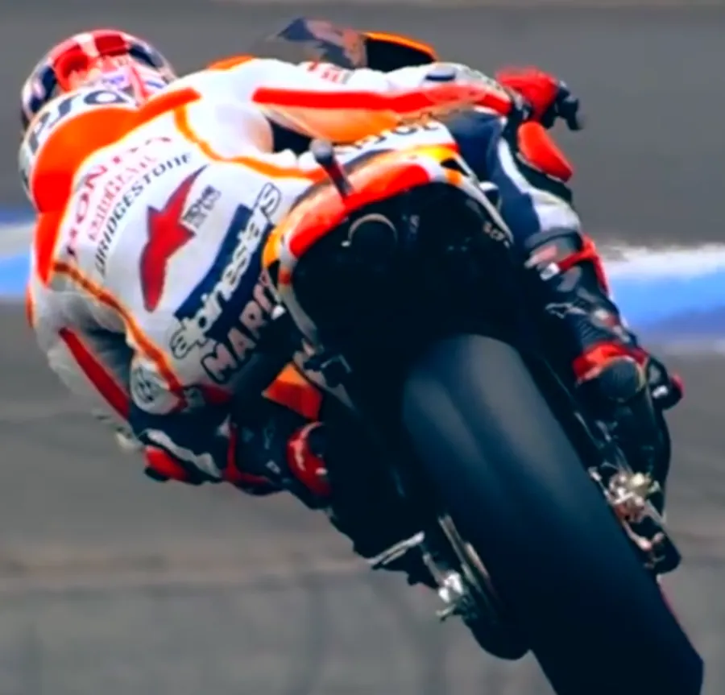

La fin du virage c'est quand la moto est droite et qu'on est 100% gaz

* Alors on peut faire ce que l'on veut avec les gaz, la trajectoire ne va pas changer
* On est alors plus relax, on peut souffler, s'assurer qu'on n'est pas crispé sur l'accélérateur
* Au fait, est-ce que la fin du virage a avancé par rapport au début de la session ?

### Il faut arrêter de se faire plaisir...

En allant chercher systématiquement l'extérieur alors qu'en faisant l'effort de contre-braquer on est plus efficace. Autrement dit "évitons" de transformer les petites lignes droites en "S".

<!--  -->

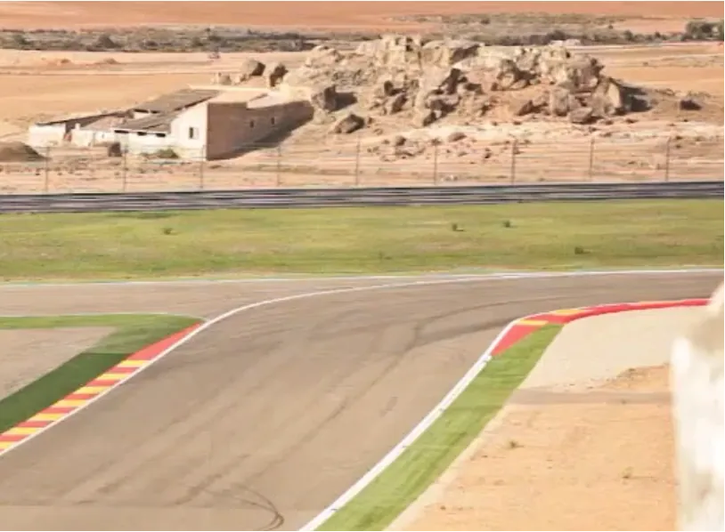

<!--  -->

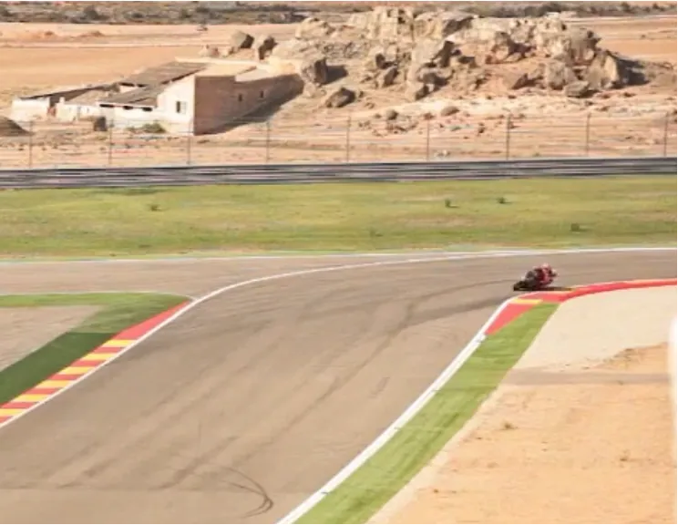

<!--  -->

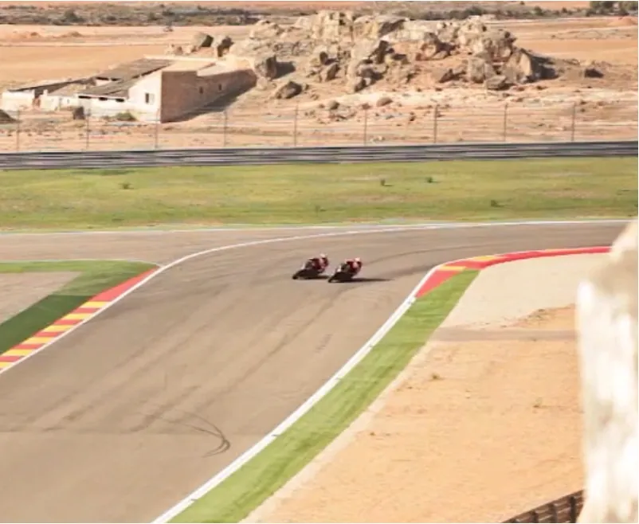

<!--  -->

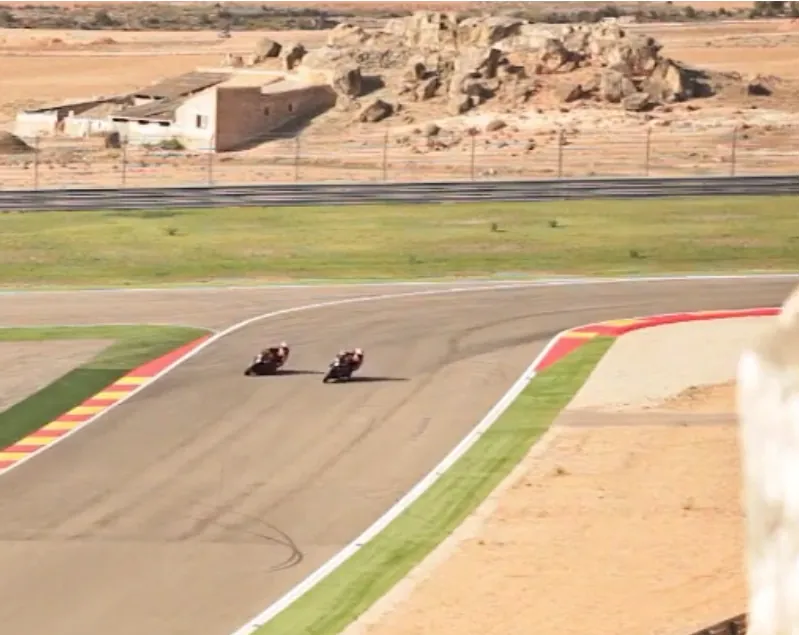

<!--  -->

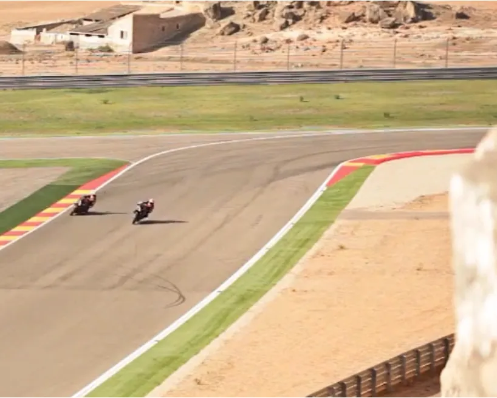

<!--  -->

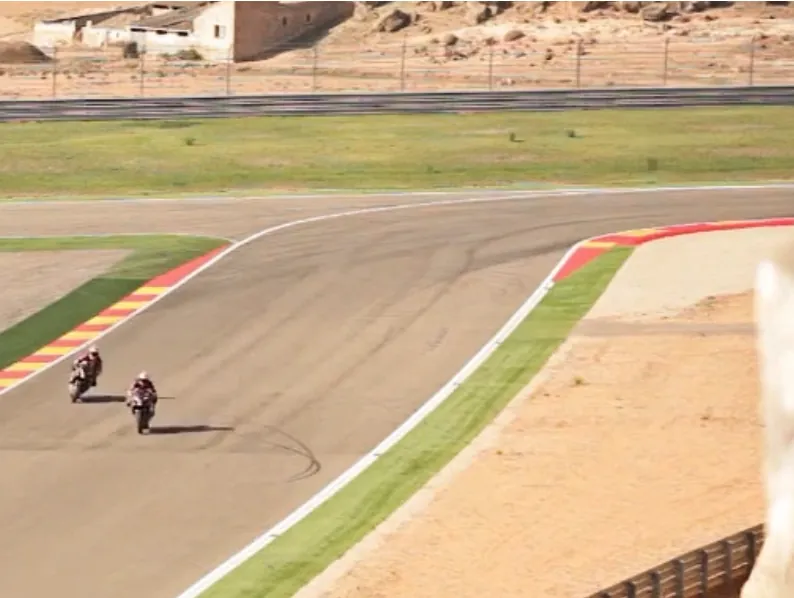

<!--  -->

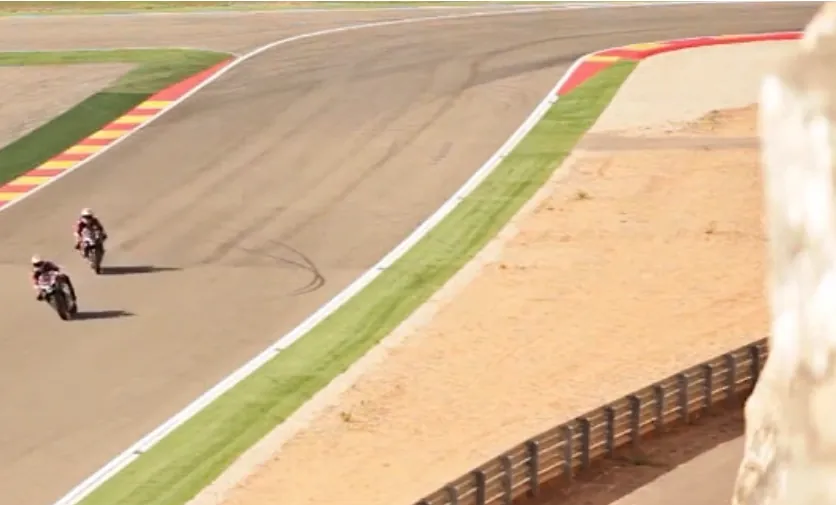

<!--  -->

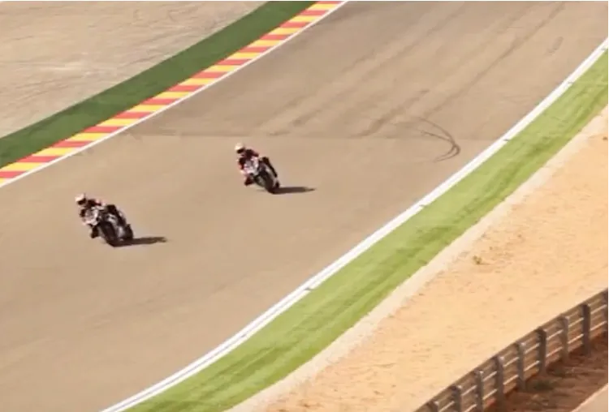

Plus tard, bien sûr, quand on aura une vitesse de sortie bien supérieure, on n'aura pas d'autre choix que d'utiliser toute la piste même si on contre-braque etc. Mais bon, pour l'instant, faisons l'effort d'utiliser un minimum de piste en sortie ça nous donnera de la marge pour plus tard et ça réduit la distance parcourue.

Le reste des explications est ici : 

<iframe width="560" height="315" src="https://www.youtube.com/embed/NqmSB5RJNRg?si=3aTJcWCo-dLm-30Z&amp;start=5" title="YouTube video player" frameborder="0" allow="accelerometer; autoplay; clipboard-write; encrypted-media; gyroscope; picture-in-picture; web-share" referrerpolicy="strict-origin-when-cross-origin" allowfullscreen></iframe>

<!-- ###################################################################### -->
<!-- ###################################################################### -->
## À la fin de la session

* Il faut sentir qu'on effectue le contre-braquage de manière volontaire
* Il faut donc prendre conscience qu'on **TIRE** sur le bras intérieur
* On doit noter qu'on relève la moto plus tôt que dans les sessions précédentes
* Ça donne quoi par rapport au repère de fin de virage qu'on avait choisi au début de la session ?
* Est-ce que la vitesse de pointe au bout de ligne droite suivante a augmenté ?

### Si en entrée de virage tu pousses Alors en sortie tu tires

<!-- ###################################################################### -->
<!-- ###################################################################### -->
## La suite au prochain épisode

Bon, allez, la suite au prochain numéro. D’ici-là relisez les [notes de pilotage]() ou faites des squats afin de préparer les prochains roulages.

<iframe width="560" height="315" src="https://www.youtube.com/embed/TIhtpItTuxc?si=qL84DxP-ejd_Yi4-&amp;start=53" title="YouTube video player" frameborder="0" allow="accelerometer; autoplay; clipboard-write; encrypted-media; gyroscope; picture-in-picture; web-share" referrerpolicy="strict-origin-when-cross-origin" allowfullscreen></iframe>

