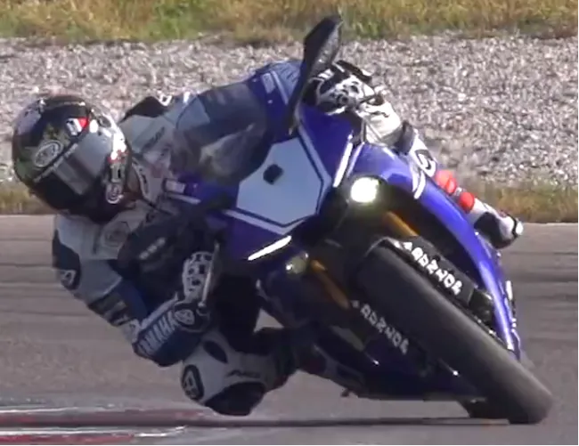
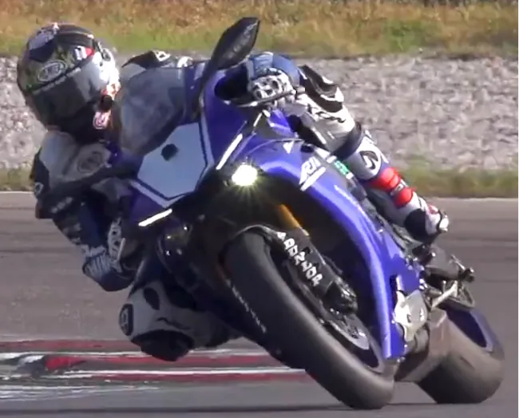
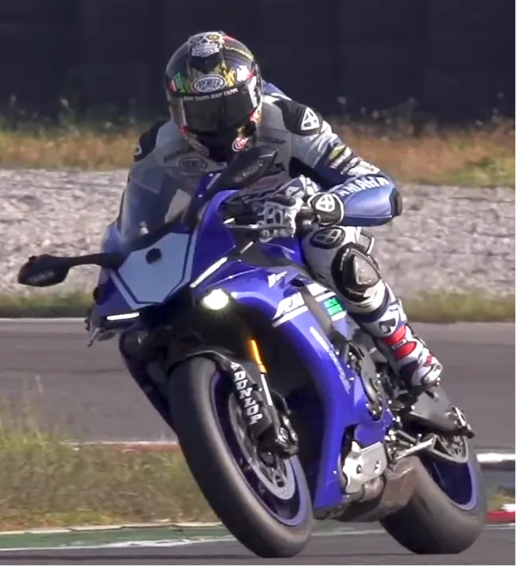
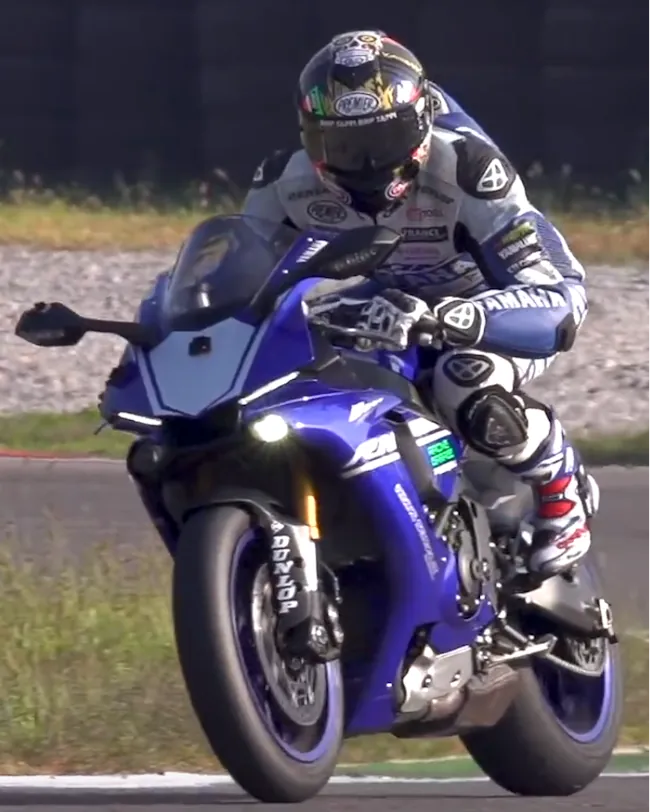
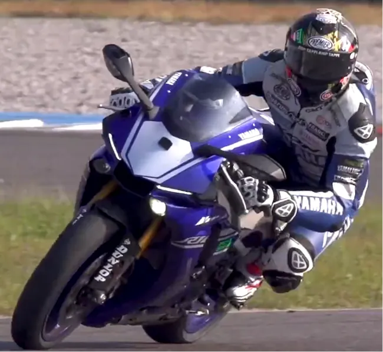
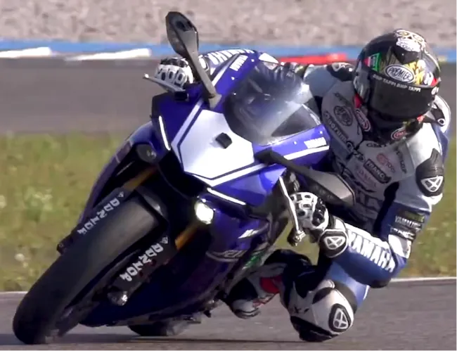
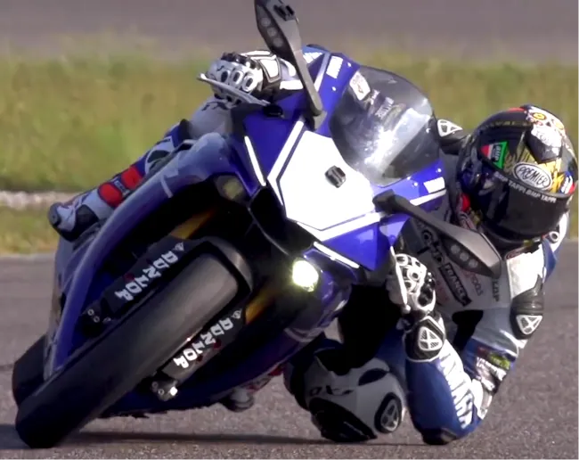

# Les pif-paf
{: .no_toc }

## Plan de la Note de Pilotage
{: .no_toc .text-delta}
- TOC
{:toc}

<!-- ###################################################################### -->
<!-- ###################################################################### -->
## Introduction

<!-- ###################################################################### -->
<!-- ###################################################################### -->
## L'objectif de la session

Dans cette session dédiée au pif-paf on va :
* Soigner le timing dans les pif-paf
* Ne pas rester assis sur la moto
* S'efforcer d'être en position pour le paf **AVANT** le second virage

<!-- ###################################################################### -->
<!-- ###################################################################### -->
## Prérequis

* Le [Knee to knee]() doit être acquis
* Relire [ATOTW II](#livres) p 33.
  + On ne fait pas 2 choses à la fois.
  + Donc on ne se déhanche pas alors qu'on est en train de changer de direction. Ce n'est pas bon pour la stabilité de la moto.
  + Il faut donc se déhancher (ou se mettre en position) **AVANT** le changement de direction
  + Dans un Pif-Paf c'est pareil. Il faut que le corps soit positionné pour le Paf, **AVANT** la mise sur l'angle.

<!-- ###################################################################### -->
<!-- ###################################################################### -->
## Petit rappel utile avant de rentrer sur le circuit

On ne pourra pas dire qu'on n'en a pas parlé...

* Petit coup d'œil derrière, sur la piste, avant de rentrer
    * Je lève mes fesses de la selle et je tourne franchement la tête et le haut du corps pour vraiment voir ce qui arrive. Si on reste assis, il ne faut pas hésiter à lâcher la main du côté vers lequel on tourne le buste.
* Ne **PAS** prendre la corde du tout premier virage
    * On rentre sur le circuit, généralement, dans une ligne droite
    * Si on va à la corde du premier virage, au bout de la ligne droite, on peut se faire percuter par un gars qui est sur la piste depuis un moment et qui est lancé
* Si on n'a pas de **couvertures chauffantes** alors on a gagné 2 tours de chauffe
    * Accélérations franches en ligne droite pour le pneu arrière
    * Freinages progressivement de plus en plus appuyés pour le pneu avant
    * **PAS** de zigzag. Ça ne sert strictement à rien
* On se fiche du chrono lors des tours de chauffe.
* Rouler très à l'aise, 2/3 de ses possibilités, ne pas se mettre en mode panique
* Au 3eme tour on monte gentiment à 3/4 de ses possibilités car c'est une session de travail (on n'est pas là pour claquer une pendule)

<!-- ###################################################################### -->
<!-- ###################################################################### -->
## La session

* Il faut penser et tout faire pour optimiser la sortie du Paf
* On "sacrifie" donc le Pif

### Le Pif

* Je suis sur les pointes de pied sur les 2 cale-pieds.
* Les points de corde dans les Pif-Paf sont en fin de vibreur
* Élargir à l'entrée du Pif pour retarder l'entrée et faire l'effort d'aller chercher loin le point de corde.
* Autrement dit, avant le Pif, je freine longtemps et droit. Alors que je suis très avancé et très ralenti, je fais une mise sur l'angle très rapide pour rejoindre le point de corde du Pif. Ce dernier est en fin de vibreur, donc très loin.
* On ne sort pas large du Pif. Au contraire, on reste à la corde du premier virage car cela correspond à l'extérieur du second.
  Pour éviter de "plonger" trop tôt sur le Paf il faut penser à ne pas lever les yeux vers le Paf mais plutôt à regarder ce qui était l'intérieur du Pif. Ça aide à resserrer la trajectoire en sortie du Pif et à bien se placer pour le Paf.

### La bascule

* Si le Pif-Paf est très petit il n'y a pas d'accélération entre les 2 virages.
* Dès que la distance entre le Pif et le Paf le permet, utiliser l'accélérateur va aider à relever la moto entre les virages. Ça va alléger la moto et on va la faire basculer beaucoup plus facilement. Il faut alors appuyer sur les cales pied, avancer la tête et alléger les fesses.
* On se positionne pour le second virage **avant** le contre braquage du Paf. C'est essentiellement une question de timing.
* Le passage d'un côté à l'autre se fait avec les jambes, les genoux et la pression que l'on met sur les cale-pieds. On ne commence pas par balancer le buste de l'autre côté de la moto. Ça part du bas du corps.
* Je dois sentir mon genou appuyé sur le réservoir et qui ramène le corps de l'autre côté. Je ne dois PAS sentir que je m'agrippe aux bracelets pour balancer la viande de l'autre côté.
* On n'est PAS assis sur la moto. Au contraire, les jambes servent d'amortisseurs supplémentaire et supportent le poids du corps (on est donc léger sur la moto). C'est aussi pour ça qu'il faut faire des squats 😊.

### Le Paf

En fait, tout ce qui précède n'a qu'un seul but. Faire du Paf un virage "classique". On rentre large, la moto a fait sa mise sur l'angle rapidement. Yaka, faukon... Tout comme avant : prise tournevis, coude plié... Je n'ai plus qu'à fixer mon attention sur le point de corde et le point de sortie du Paf (voir ce qu'on avait dit dans [Three Steps]()) et en avant Guingamp, ça devrait bien se passer.

Heu... Faut être clair et humble. Ce que j'explique ci-dessus, c'est ce que je crois avoir compris à ce jour et c'est ce que je voudrais arriver à faire à tous les coups. Malheureusement dans la réalité... Ce n'est pas encore ça.

### Savoir marcher avant de courir

Comme dans les autres sessions je commence par réduire ma vitesse (pas facile) et je fais très attention à ma trajectoire en sortie du Pif ainsi qu'à ce que mon corps soit prêt pour le Paf. La moto n'est pas encore tout à fait verticale. En fait, comme pour n'importe quel virage, mon corps doit être en place avant que la moto ne passe sur l'angle.

Je le répète : dans un Pif-Paf on n'est pas assis sur la moto. Je suis lite et je fais tout avec les cuisses. Une fois que le timing est bon j'augmente gentiment le rythme à chaque tour.

<!-- ###################################################################### -->
<!-- ###################################################################### -->
## À la fin de la session

Il faut sentir :

* Qu'on ne rentre pas fort dans le Pif
* Qu'on ne sort pas large du Pif
* Il faut être lite sur la moto et tout faire avec les cuisses (il faut faire des squats et des chaises à la maison...)
* Qu'on est calé pour le Paf avant que la moto ne soit verticale
* Qu'on n'est pas à la ramasse en sortie du Paf mais qu'on accélère fort et tôt.

### Exemple

Le genou gauche appuie sur le réservoir et tire à lui le reste du corps. C'est d'autant plus facile pour le genou de faire glisser les fesses de droite à gauche que le pilote n'est pas vraiment assis sur la moto. En fait, il est très "lite" sur la moto et porté par ses jambes.

Bien voir que la fesse gauche est déjà dehors alors que la moto est tout juste verticale. Comme pour un virage normal, il est donc positionné pour le Paf alors que la moto n'est pas encore à la verticale.

La tête est venue chercher la main sur le guidon et elle est au niveau du rétroviseur. Le poignet est en prise tournevis et le coude... au sol. C'est tellement facile sur une page web...

Tous les détails dans cette vidéo. Commence par la partie sur le pif-paf MAIS ensuite, prends le tout regarder. Y a vraiment plein de choses à voir et à revoir.

<iframe width="560" height="315" src="https://www.youtube.com/embed/wI8WpN7aCFM?si=hqaC-dbYbDcWD6ry&amp;start=404" title="YouTube video player" frameborder="0" allow="accelerometer; autoplay; clipboard-write; encrypted-media; gyroscope; picture-in-picture; web-share" referrerpolicy="strict-origin-when-cross-origin" allowfullscreen></iframe>

<!-- ###################################################################### -->
<!-- ###################################################################### -->
## Remarques

<!-- ###################################################################### -->
<!-- ###################################################################### -->
## La suite au prochain épisode

Bon, allez, la suite au prochain numéro. D’ici-là relisez les [notes de pilotage]() ou faites des squats afin de préparer les prochains roulages.

<iframe width="560" height="315" src="https://www.youtube.com/embed/TIhtpItTuxc?si=qL84DxP-ejd_Yi4-&amp;start=53" title="YouTube video player" frameborder="0" allow="accelerometer; autoplay; clipboard-write; encrypted-media; gyroscope; picture-in-picture; web-share" referrerpolicy="strict-origin-when-cross-origin" allowfullscreen></iframe>

