# Freinage sur l'angle (Trail Braking)
{: .no_toc }

## Plan de la Note de Pilotage
{: .no_toc .text-delta}
- TOC
{:toc}

<!-- ###################################################################### -->
<!-- ###################################################################### -->
## Introduction

<!-- ###################################################################### -->
<!-- ###################################################################### -->
## L'objectif de la session

À la fin de cette session consacrée au freinage sur l'angle on doit :

* Terminer le freinage alors qu'on est sur l'angle et dans le virage (voir l'image de gauche ci-dessous)
* Être capable de le faire en toute sérénité.

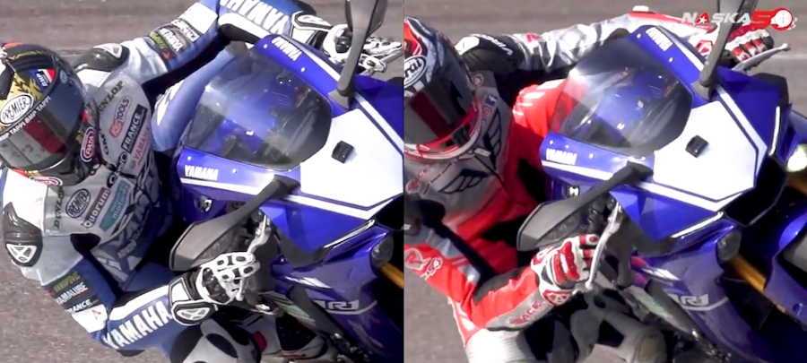

1. Faut surtout noter la position des doigts sur le levier de frein dans les 2 images. 
1. Ensuite, on peut comparer comment le menton désigne la cible dans l'image de gauche alors que c'est pas encore le cas dans l'image de droite.

<!-- ###################################################################### -->
<!-- ###################################################################### -->
## Prérequis

* On a un [freinage en ligne droite]() qui comprend bien les 3 phases
  + Rapide mais progressif
  + Fort mais constant
  + Relâche progressive
* On en est à un stade où on passe par les 3 phases de manière automatique
* Si ce n'est pas le cas, ce n'est même pas la peine de lire le reste de cette page

<!-- ###################################################################### -->
<!-- ###################################################################### -->
## Petit rappel utile avant de rentrer sur le circuit

On ne pourra pas dire qu'on n'en a pas parlé...

* Petit coup d'œil derrière, sur la piste, avant de rentrer
    * Je lève mes fesses de la selle et je tourne franchement la tête et le haut du corps pour vraiment voir ce qui arrive. Si on reste assis, il ne faut pas hésiter à lâcher la main du côté vers lequel on tourne le buste.
* Ne **PAS** prendre la corde du tout premier virage
    * On rentre sur le circuit, généralement, dans une ligne droite
    * Si on va à la corde du premier virage, au bout de la ligne droite, on peut se faire percuter par un gars qui est sur la piste depuis un moment et qui est lancé
* Si on n'a pas de **couvertures chauffantes** alors on a gagné 2 tours de chauffe
    * Accélérations franches en ligne droite pour le pneu arrière
    * Freinages progressivement de plus en plus appuyés pour le pneu avant
    * **PAS** de zigzag. Ça ne sert strictement à rien
* On se fiche du chrono lors des tours de chauffe.
* Rouler très à l'aise, 2/3 de ses possibilités, ne pas se mettre en mode panique
* Au 3eme tour on monte gentiment à 3/4 de ses possibilités car c'est une session de travail (on n'est pas là pour claquer une pendule)

<!-- ###################################################################### -->
<!-- ###################################################################### -->
## La session

La différence entre débutant et le confirmé c'est, entre autres, la longueur de la zone morte entre la fin du freinage et la réaccélération.

* Le débutant termine son freinage droit. Au PMSA il engage la moto gaz coupé, il est patient, il est patient... Après le point de pivot (PV) il ouvre les gaz en appliquant la Throttle Rule qui dit qu'une fois qu'on a commencé à tourner la poignée on ne s'arrête plus.
* Le confirmé, lui, continue, en entrée de virage, à freiner sur l'angle.
  + Il est en phase de relâche des freins. 
  + Plus il a d'angle, moins il freine
  + Sa phase neutre (sans frein ni gaz) est donc plus courte
  + Comme le débutant, quand le PV est passé et que les roues sont alignées, il remet les gaz en appliquant la Throttle Rule

Par rapport à ce que l'on sait déjà faire, on ne rajoute qu'une seule chose. On termine la phase de freinage alors qu'on est sur l'angle

* Pour rappel et éviter tout problème je répète : la dernière phase c'est celle où on relâche **progressivement** la poignée de frein.
* Une fois qu'on le fait de manière automatique alors que la moto est droite alors on peut se mettre à le faire avec la moto sur l'angle.

On peut freiner sur l'angle sans risque car l'avant est chargé. L'empreinte du pneu est large, on a du grip.

Cela dit, pas d'embrouilles… On se rappelle qu'on est bien en phase de "relâche des freins…"

Bien sûr, on ne peut pas être à 100% de pression sur le levier de frein et être sur l'angle. En revanche on peut faire en sorte d'être de plus en plus "lite" sur les freins au fur et à mesure que la moto prend de plus en plus d'angle.

Typiquement on peut continuer à freiner fort jusqu'à 10° d'angle. Sauf erreur de ma part, 10° c'est en gros l'angle de la moto sur sa béquille latérale. Ensuite il faut obligatoirement lâcher progressivement la pression sur les freins proportionnellement à la prise d'angle : de plus en plus d'angle et de moins en moins de pression.

L'idée c'est de rentrer avec une vitesse plus élevée dans le virage et on va faire sur l'angle ce que l'on faisait en ligne droite.

Idéalement, il faudrait être capable de supprimer la phase "neutre" dans laquelle on ne freine plus mais où on patiente jusqu'à ce que l'on rejoigne le point où les roues de la moto sont sur la ligne PV-PC-PS (c'est toujours la même histoire en fait).

<!-- ###################################################################### -->
<!-- ###################################################################### -->
## À la fin de la session

Il faut, de manière consciente :
* Terminer le freinage sur l'angle. Ça ne veut pas dire qu'on freine comme des brutes alors qu'on est sur l'angle. Ça veut juste dire qu'on termine la phase de relâchement des freins alors qu'on est sur l'angle.
* Amener la moto au point où on avait l'habitude de commencer à rouvrir les gaz, à la bonne vitesse
* De sentir que la phase neutre entre la mise sur l'angle et la remise des gaz a été notablement réduite, voire supprimée.

Finalement, toutes choses égales par ailleurs on doit freiner plus tard. On doit donc adapter son point de freinage (PF)

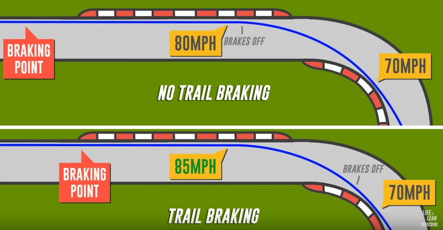

La vidéo associée :

<iframe width="560" height="315" src="https://www.youtube.com/embed/14vS6hnfgrs?si=Dvurx6Yq6nN5USvI" title="YouTube video player" frameborder="0" allow="accelerometer; autoplay; clipboard-write; encrypted-media; gyroscope; picture-in-picture; web-share" referrerpolicy="strict-origin-when-cross-origin" allowfullscreen></iframe>

Il peut être utile de regarder aussi la vidéo ci-dessous à partir de 18'49"

<iframe width="560" height="315" src="https://www.youtube.com/embed/XcMp7wuVKhY?si=ewMs6iQAm1XBomHo&amp;start=1129" title="YouTube video player" frameborder="0" allow="accelerometer; autoplay; clipboard-write; encrypted-media; gyroscope; picture-in-picture; web-share" referrerpolicy="strict-origin-when-cross-origin" allowfullscreen></iframe>

Ainsi que celle-ci à partir de 2'00"

<iframe width="560" height="315" src="https://www.youtube.com/embed/wI8WpN7aCFM?si=GyIRJrhpyI7D9cJt&amp;start=120" title="YouTube video player" frameborder="0" allow="accelerometer; autoplay; clipboard-write; encrypted-media; gyroscope; picture-in-picture; web-share" referrerpolicy="strict-origin-when-cross-origin" allowfullscreen></iframe>

Une dernière dans un contexte de conduite sur route. Cela dit les principes sont les mêmes.

<iframe width="560" height="315" src="https://www.youtube.com/embed/7RA3NSoOfto?si=HmvpPVe24lTqx-YM" title="YouTube video player" frameborder="0" allow="accelerometer; autoplay; clipboard-write; encrypted-media; gyroscope; picture-in-picture; web-share" referrerpolicy="strict-origin-when-cross-origin" allowfullscreen></iframe>

<!-- ###################################################################### -->
<!-- ###################################################################### -->
## Remarques

### Grip shift sur l'angle

Juste après avoir relâché le levier de frein le grip shifting c'est l'action qui consiste à faire tourner sa main d'1/8 de tour (je dis ça au pif) autour de la poignée de gaz mais avant de commencer à enrouler cette dernière jusqu'à la butée. Ci-dessous, le gars est bien, bien sur l'angle et il relâche gentiment le frein avant alors qu'il rejoint le point de corde. Il ne semble pas faire de grip shift : 

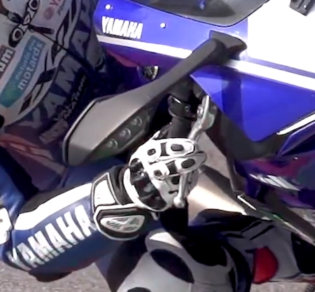

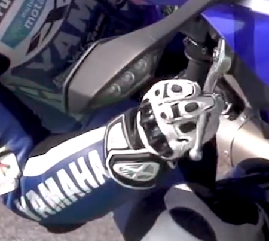

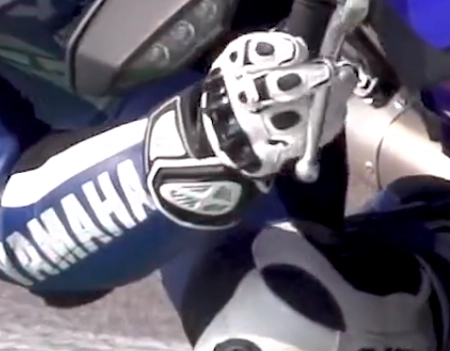

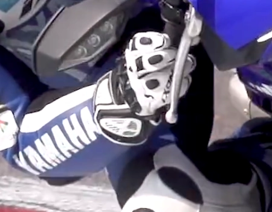

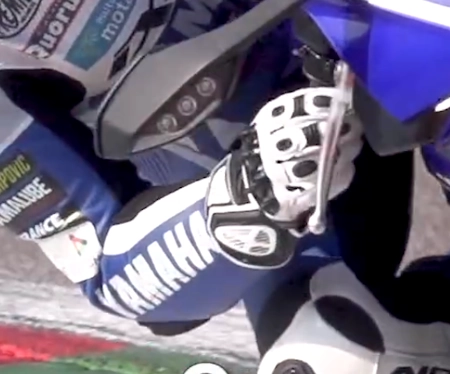

Rossi fait la même chose mais avec un grip shift alors qu'il termine son freinage sur l'angle.

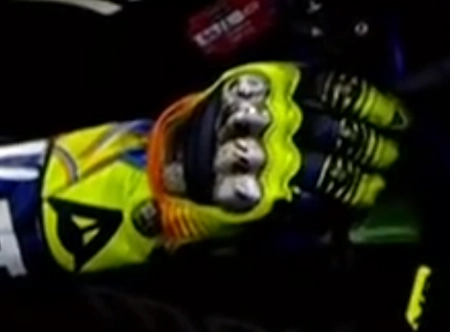

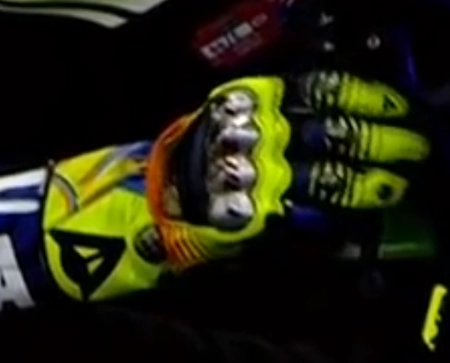

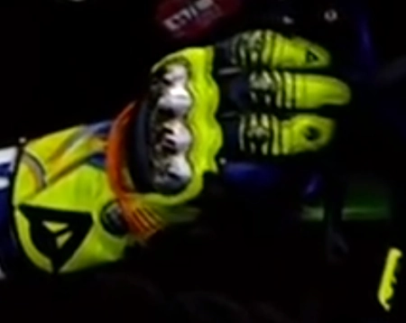

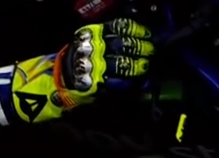

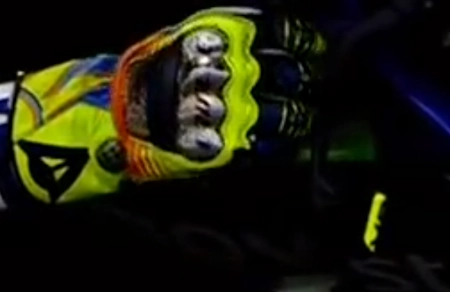

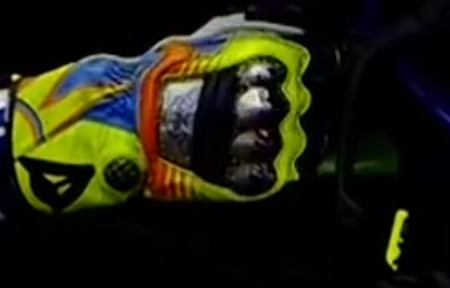

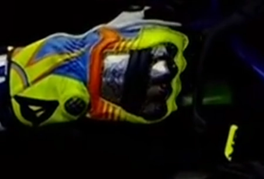

Il faut garder en tête que le grip shift permet 
1. De replacer sa main pour pouvoir accélérer sans se retrouver, plus tard, "coincé" au niveau du poignet. 
1. Ça facilite aussi le positionnement de la main et de l'avant-bras pour prendre la poignée de gaz avec une prise tournevis.

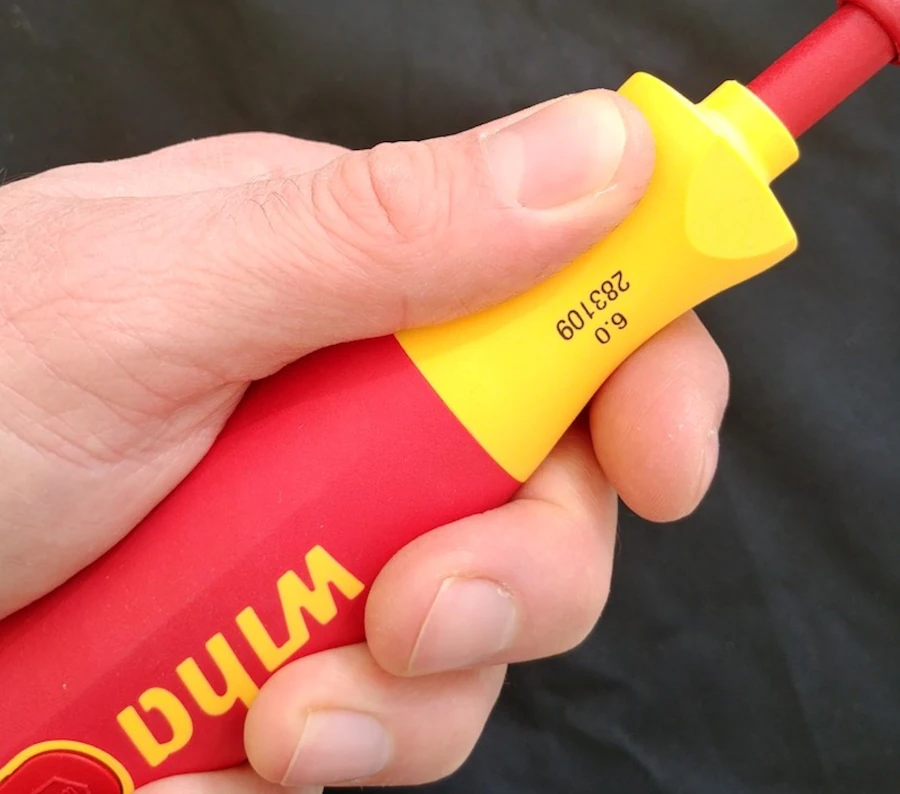

Dans la vidéo ci-dessous il ne faut surtout pas hésiter à mettre la vitesse à 50% et à bien noter le mouvement de rotation que fait la main dès que le levier de frein est lâché. Tu vas voir, c'est systématique. Il faut aussi en profiter pour regarder la façon dont il tient la poignée de gaz dans les lignes droite (à trois doigts, très très lite, à la limite, il y a un espace entre sa paume et la poignée).

<iframe width="560" height="315" src="https://www.youtube.com/embed/h24XjzybrA0?si=-L4KHCqntm-WszWv" title="YouTube video player" frameborder="0" allow="accelerometer; autoplay; clipboard-write; encrypted-media; gyroscope; picture-in-picture; web-share" referrerpolicy="strict-origin-when-cross-origin" allowfullscreen></iframe>

Sylvain Guintoli a dédié une vidéo à ce qu'il appelle en français "la recharge de poignet" mais bon, on parle bien ici de grip shifting. Malheureusement la vidéo est dorénavant réservée aux membres. Bon, je laisse quand même le lien :  

* <https://youtu.be/f1NR1VdvmTA>

<!-- ###################################################################### -->
<!-- ###################################################################### -->
## La suite au prochain épisode

Bon, allez, la suite au prochain numéro. D’ici-là relisez les [notes de pilotage]() ou faites des squats afin de préparer les prochains roulages.

<iframe width="560" height="315" src="https://www.youtube.com/embed/TIhtpItTuxc?si=qL84DxP-ejd_Yi4-&amp;start=53" title="YouTube video player" frameborder="0" allow="accelerometer; autoplay; clipboard-write; encrypted-media; gyroscope; picture-in-picture; web-share" referrerpolicy="strict-origin-when-cross-origin" allowfullscreen></iframe>

