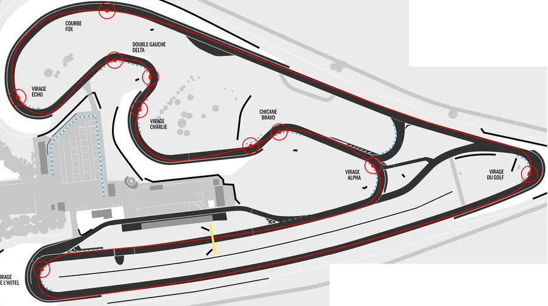
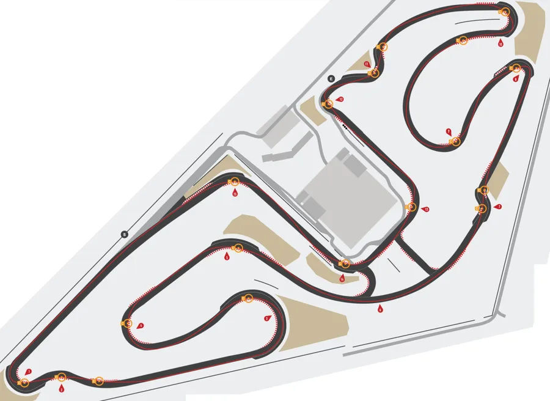
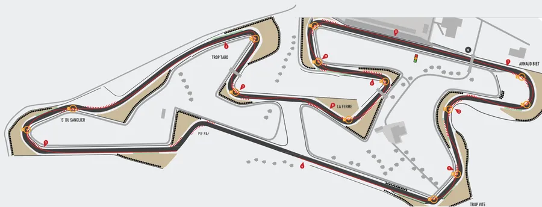

# Short shift
{: .no_toc }

## Plan de la Note de Pilotage
{: .no_toc .text-delta}
- TOC
{:toc}

<!-- ###################################################################### -->
<!-- ###################################################################### -->
## Introduction

Le short shift (ou short shifting) en Français, c'est l'action de passer la vitesse supérieure alors qu'on n'a pas encore atteint le nombre de tour minute optimum. Dans certains cas de short shift, on peut même être amené à passer 2 rapports d'un coup. Bizarre vous avez dit bizarre ?

<!-- ###################################################################### -->
<!-- ###################################################################### -->
## L'objectif de la session

Il n'y a pas vraiment d'objectif dans la session car on est très dépendant du circuit. 

Par contre si tel ou tel endroit du circuit est connu pour nécessiter le short shift, l'objectif c'est bien sûr de l'avoir mis en place.

Pas d'angoisse, il n'y a vraiment rien de compliquer. Faut juste que cela devienne, tour après tour une habitude, 

<!-- ###################################################################### -->
<!-- ###################################################################### -->
## Prérequis

Pour l'instant, c'est simple : **LA** référence française sur le sujet c'est la vidéo ci-dessous. Il suffit de prendre le temps de la voir une ou deux fois. 

<iframe width="560" height="315" src="https://www.youtube.com/embed/7FBEveekLKE?si=D7dj1GO6F7YzO9zX" title="YouTube video player" frameborder="0" allow="accelerometer; autoplay; clipboard-write; encrypted-media; gyroscope; picture-in-picture; web-share" referrerpolicy="strict-origin-when-cross-origin" allowfullscreen></iframe>

<!-- ###################################################################### -->
<!-- ###################################################################### -->
## Petit rappel utile avant de rentrer sur le circuit

On ne pourra pas dire qu'on n'en a pas parlé...

* Petit coup d'œil derrière, sur la piste, avant de rentrer
    * Je lève mes fesses de la selle et je tourne franchement la tête et le haut du corps pour vraiment voir ce qui arrive. Si on reste assis, il ne faut pas hésiter à lâcher la main du côté vers lequel on tourne le buste.
* Ne **PAS** prendre la corde du tout premier virage
    * On rentre sur le circuit, généralement, dans une ligne droite
    * Si on va à la corde du premier virage, au bout de la ligne droite, on peut se faire percuter par un gars qui est sur la piste depuis un moment et qui est lancé
* Si on n'a pas de **couvertures chauffantes** alors on a gagné 2 tours de chauffe
    * Accélérations franches en ligne droite pour le pneu arrière
    * Freinages progressivement de plus en plus appuyés pour le pneu avant
    * **PAS** de zigzag. Ça ne sert strictement à rien
* On se fiche du chrono lors des tours de chauffe.
* Rouler très à l'aise, 2/3 de ses possibilités, ne pas se mettre en mode panique
* Au 3eme tour on monte gentiment à 3/4 de ses possibilités car c'est une session de travail (on n'est pas là pour claquer une pendule)

<!-- ###################################################################### -->
<!-- ###################################################################### -->
## La session

Typiquement, on change de vitesse juste avant d'entrer dans un virage long et qui s'ouvre. Comme le rayon du virage augmente, on peut accélérer continûment. Cela dit, à un moment on sera sans doute amené à monter un rapport alors qu'on est sur l'angle, la tête en bas, avec le moteur qui braille comme un putois et les vibreurs qui nous sautent au nez. Ce ne sont peut-être pas les meilleures conditions pour opérer un changement de rapport... Il est donc parfois plus malin de monter un rapport **avant** la grande courbe en question, de rentrer peut-être un peu en sous régime mais de ne rien avoir à faire d'autre dans le virage qu'à enrouler le câble d'accélérateur.

Exemples de circuits que je connais et où l'on utilise le short shift :

* La parabolique à [Carole](https://www.circuit-carole.com/)
* Le 6 à la [Ferté Gaucher](https://www.circuitslfg.fr/)
* Sanglier au [Vigeant](http://www.circuitvaldevienne.com/)

<!-- ###################################################################### -->
### Carole

Carole - La parabolique c'est la courbe Fox en haut à gauche (clique sur l'image si besoin)

Toujours à Carole, on peut regarder attentivement ce qui se passe à 1'04" dans la vidéo ci-dessous :

<iframe width="560" height="315" src="https://www.youtube.com/embed/k623KIkV8Q4?si=OAa-vuEAYV6cAUc-&amp;start=43" title="YouTube video player" frameborder="0" allow="accelerometer; autoplay; clipboard-write; encrypted-media; gyroscope; picture-in-picture; web-share" referrerpolicy="strict-origin-when-cross-origin" allowfullscreen></iframe>

<!-- ###################################################################### -->
### La Ferté Gaucher

La Ferté Gaucher (LFG) - Le N°6 c'est le plus grand gauche du circuit. Attention, dans la figure, je pense que ce sont des trajectoires Auto. Par exemple, le 3 ne se prend pas du tout comme ça à moto.

Dans la vidéo ci-dessous il faut écouter attentivement le passage de vitesse à 1'01. On est dans le grand gauche N°6.

<iframe width="560" height="315" src="https://www.youtube.com/embed/JZ5-4_W7PFk?si=rJM7dIVBXPDsUn9z&amp;start=46" title="YouTube video player" frameborder="0" allow="accelerometer; autoplay; clipboard-write; encrypted-media; gyroscope; picture-in-picture; web-share" referrerpolicy="strict-origin-when-cross-origin" allowfullscreen></iframe>

<!-- ###################################################################### -->
### Le Vigeant

Sanglier se trouve à tout à gauche ci-dessous :

Ci-dessous, il faut écouter le passage de rapport à 1'13" par exemple.

<iframe width="560" height="315" src="https://www.youtube.com/embed/RxfoK52YFrE?si=5ggjlexgwnAjcp72" title="YouTube video player" frameborder="0" allow="accelerometer; autoplay; clipboard-write; encrypted-media; gyroscope; picture-in-picture; web-share" referrerpolicy="strict-origin-when-cross-origin" allowfullscreen></iframe>

<!-- ###################################################################### -->
<!-- ###################################################################### -->
## À la fin de la session

<!-- ###################################################################### -->
<!-- ###################################################################### -->
## Remarques

* En étant moins haut dans les tours, cela doit permettre à certains de moins stresser. Au final ils vont augmenter leur vitesse de passage car ils n'auront plus le sentiment d'être "à la limite", "de ne pas pouvoir aller plus loin" tout simplement parce que le régime moteur leur donnait une fausse impression de vitesse.

<!-- ###################################################################### -->
<!-- ###################################################################### -->
## La suite au prochain épisode

Bon, allez, la suite au prochain numéro. D’ici-là relisez les [notes de pilotage]() ou faites des squats afin de préparer les prochains roulages.

<iframe width="560" height="315" src="https://www.youtube.com/embed/TIhtpItTuxc?si=qL84DxP-ejd_Yi4-&amp;start=53" title="YouTube video player" frameborder="0" allow="accelerometer; autoplay; clipboard-write; encrypted-media; gyroscope; picture-in-picture; web-share" referrerpolicy="strict-origin-when-cross-origin" allowfullscreen></iframe>

