# Lecture des pneus

{: .note }
Cette page est toujours en construction et je commence à me demander si elle sera terminée un jour.✊

## Introduction

Pour faire court, dans cette page on va parler de la lecture des pneus après les sessions lors d'une journée de roulage moto sur circuit.

L'idée est qu'à l'instar de l'indien qui lit les traces qu'ont laissé les bisons dans la prairie, ce qui est inscrit sur le pneu nous dit quelque chose. "Les pneus ne mentent pas". De plus, c'est très certainement plus précis et plus factuel que les "sentiments" dont on se rappelle à la descente de moto. Autrement dit, sous réserve d'interpréter correctement ces signes, on a là un formidable moyen d'améliorer le comportement de la moto, de préserver ses pneus et de faire tomber les chronos.

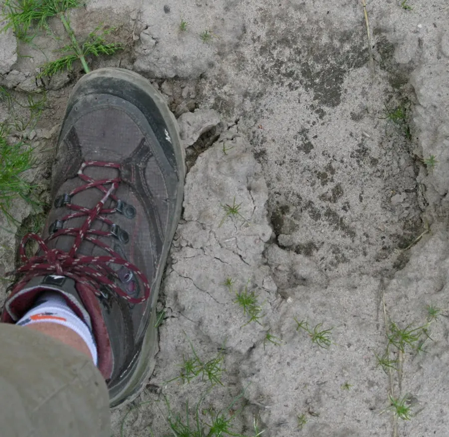

Attention aux Charlots ! Tous ceux avec qui j'aborde le sujet des suspensions et/ou de la lecture des pneus me disent que soit ils n'y comprennent rien, soit ils ne connaissaient que le strict minimum pour survivre sur piste. Dans tous les cas ils confirment que les gens compétents sur le sujet se compte sur les doigts d'une main. Donc, méfiez-vous que ce soit sur les forums ou les tarmacs et méfiez-vous de ce que vous allez lire ici car il se peut que je n'ai pas encore complètement compris tel ou tel aspect.

Cela dit, j'essaie d'être un peu sérieux et de recouper un maximum d'informations avant d'écrire quoique ce soit. De toute façon, au pire, je peux facilement corriger/améliorer l'article au fil du temps. Mais bon, soyez indulgents, je ne suis pas un professionnel du sujet. J'ai juste la chance de parler un peu la langue de Shakespeare et de prendre des notes quand je lis ou que je regarde des vidéos.

En tout cas, ce n'est pas la peine non plus de dire "laisse tomber, je ne comprends rien, c'est compliqué...". Non, non tout au contraire, il faut s'intéresser au sujet car :

* Ça économise les pneus (et vu le prix que ça coûte...)
* Ça rend la moto plus performante, plus homogène et plus sûre
* Ce n'est pas très consommateur de temps
* Cela demande très peu d'outillage
* Il y a pratiquement toujours moyen de faire marche arrière
* Il n'y a quasiment aucun risque de casser quoi que ce soit
* À part peut-être la précontrainte de l'amortisseur arrière (et encore) qui n'est pas toujours facile d'accès et qui peut demander un peu de force tout le monde peut faire tous les réglages : ado, femme, homme, bison...

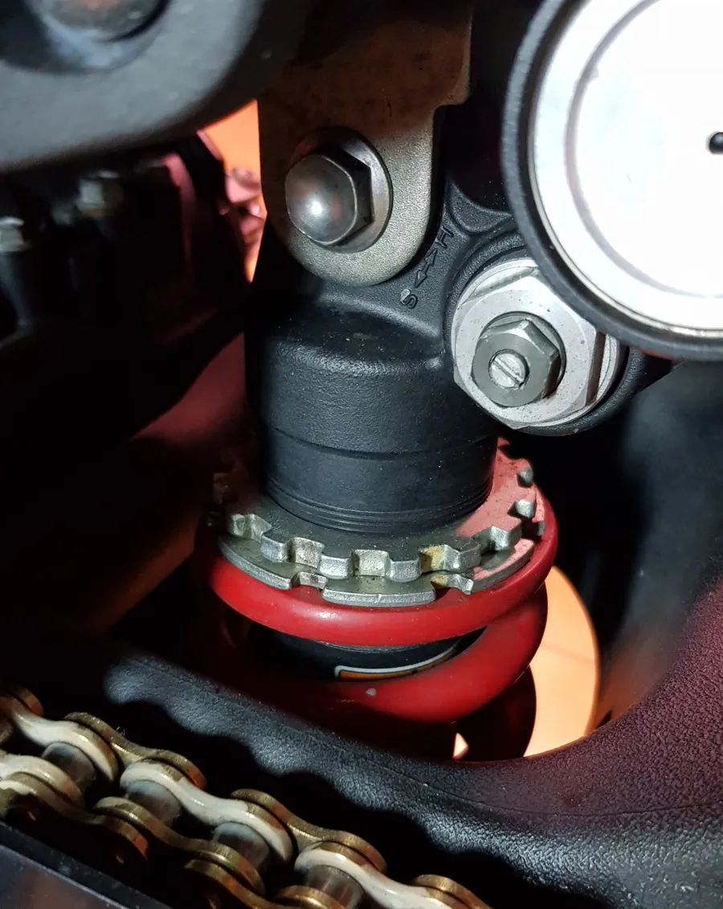

## Parce que ça va mieux en le disant...

* On ne va pas parler du réglage initial des suspensions. Il y a déjà pas mal de choses écrites sur le sujet (voir plus loin la section [Références](#references)).
* On va plutôt parler des pneus à rainures plutôt que des pneus slicks.
* On suppose que la moto est bien entretenue, que la chaine n'est pas trop tendue, que les suspensions sont en bon état et que si on joue sur un paramètre cela engendre un effet.
* Ce qui est dit ici s'applique aussi en grande partie aux motos de route qui viennent pour la première fois sur un circuit. Dans ce cas il faudra penser à baisser la pression des pneus (AV 2.1, AR 1.9 typiquement) et à vérifier que la chaine n'est pas trop tendue (risque d'empêcher le bras oscillant de travailler comme il faut). En fin de journée on pensera à remonter les pressions avant de reprendre la route.
* On suppose bien sûr qu'il y a de la marge avant d'atteindre les témoins d'usure et que les pneus ne sont pas déjà complètement rincés (au fait, savez-vous retrouver la date de production du pneu ?)

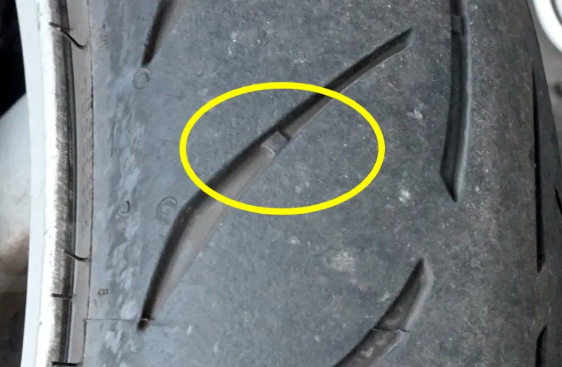

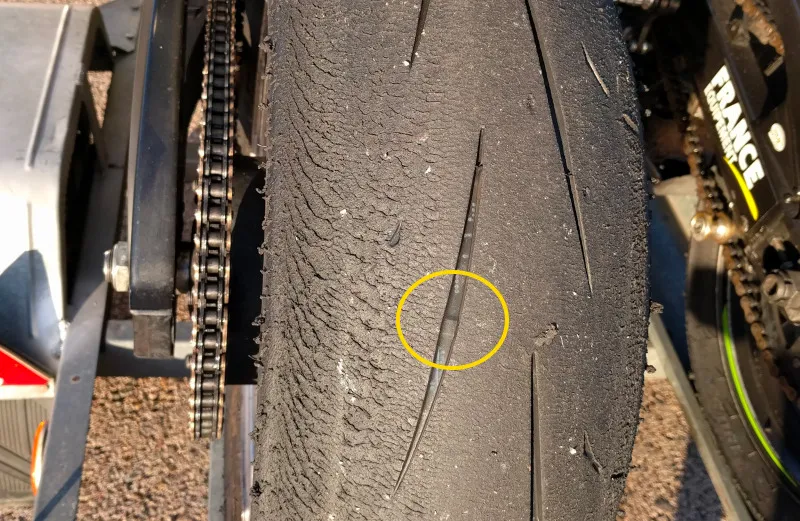

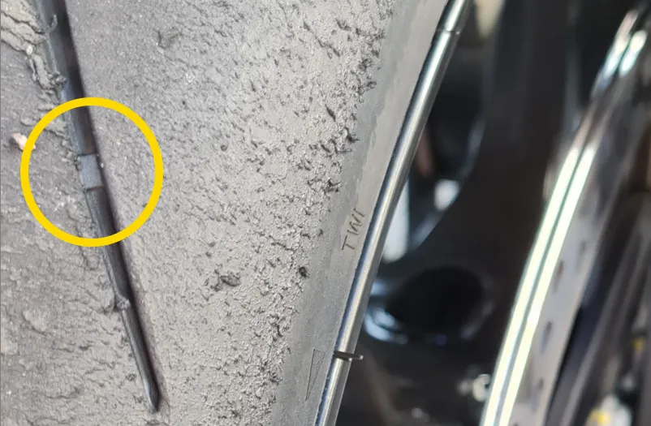

Date de production du pneu. Si le DOT n'est pas d'un côté du pneu il est de l'autre. Le 1er N° c'est la semaine, le second c'est l'année.

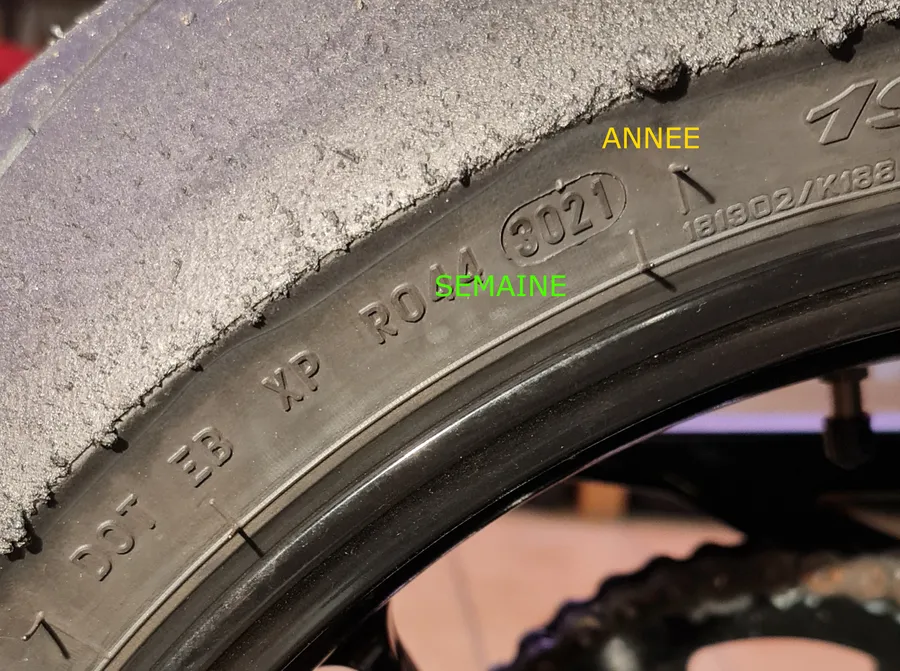

## Remarques à propos de la méthode

* J'exagère à peine mais jouer sur les réglages des suspensions consiste très souvent à faire plus ou moins rentrer une aiguille dans un tube. Si l'aiguille est dans le tube, elle le bouche et le débit est faible. Si l'aiguille n'est que partiellement dans le tube le débit d'huile est plus important. C'est typiquement ce qui se passe sur les réglages de compression et de détente. Une fois qu'on a ça en tête on comprend donc qu'il **faudra être doux** et ne pas forcer comme une brute. Si on force trop quand on serre (sens horaire) pour faire rentrer l'aiguille dans le tube et qu'on arrive au bout, cela risque d'abîmer la pointe de l'aiguille et là, on aura plus que nos yeux pour pleurer.
* Une fois qu'on a en tête l'image de l'aiguille qui rentre dans un tube on comprend mieux les expressions "ouvrir la détente" et "ouvrir la compression". Cela veut juste dire qu'il faut tout dévisser (sens trigonométrique) afin que le débit d'huile soit maximum.
* Prenez des notes et des photos : il ne faut pas hésiter à faire des tests. Par exemple, j'ouvre tout et je pompe plusieurs fois la fourche. Qu'est ce qui se passe quand je relâche ? Bon, cela dit, c'est bien gentil de faire des tests mais si je n'ai pas noté la position de départ... Je suis dans les soucis. Donc je note et/ou je prends des photos.
* À l'aide de la documentation de la moto, identifiez les différents réglages et leurs positions respectives. Typiquement : précharge, compression, détente. Parfois compression et détente rapide.

Ci-dessous, c'est un extrait de la documentation du RSV4. Positions des différents réglages de la fourche.

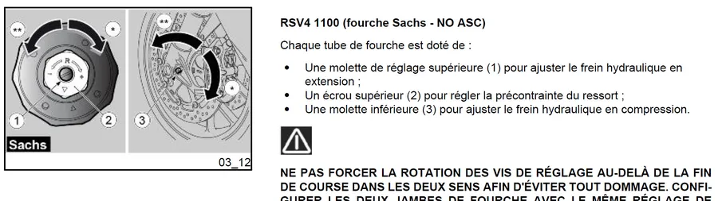

* Retrouvez sur le web ou dans la documentation les réglages recommandés. 

Ci-dessous, c'est un extrait de la documentation du RSV4. Réglages piste de la fourche.

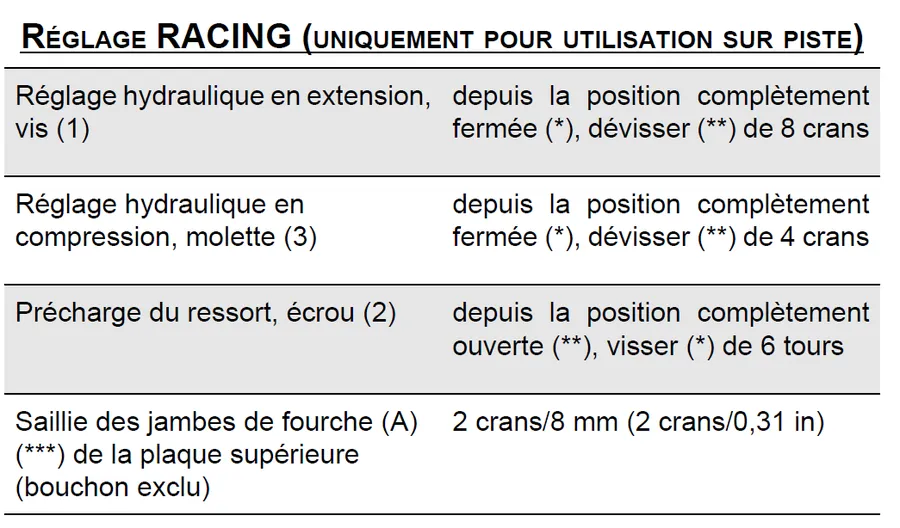

* Retrouvez sur le web les pressions recommandées par le constructeur des pneus.
* Ensuite, mettez la main sur l'outillage nécessaire : tournevis, clé Allen... Rien de très spécial en fait. La clé pour régler la précontrainte de l'amortisseur est normalement dans la trousse à outils livrée avec la moto mais la qualité est faible voire nulle. Il faudra peut-être en acheter une.

Clé issue de la trousse à outil du RSV4

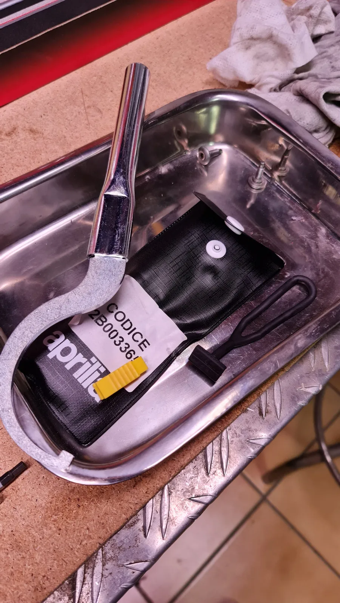

Faut penser à prendre un manche assez long pour avoir du couple

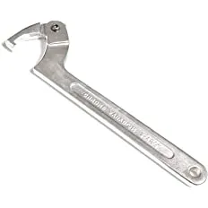

* Quand vous avez l'outillage en main, au calme, dans le garage, commencez par vérifier les réglages usine. Cela permet de mettre la main à la pâte et d'être sûr que tout est nominal et ce, même si la moto est neuve et sort du garage (oui, oui, je confirme).

## Ce que l'on recherche

Allez, on commence par la fin. Ce que l'on souhaite voir à la surface du pneu arrière, typiquement, c'est un truc comme ça :

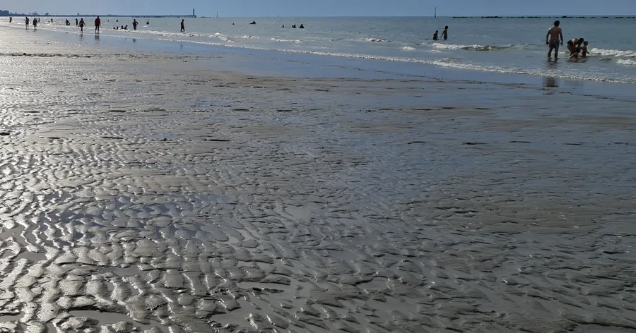

Non, je ne parle pas des gens en maillot mais plutôt des vaguelettes que forme le sable mouillé.

On souhaite :

* Que les vaguelettes aillent jusqu'aux bords du pneu.
* Que sur les bords des pneus, on ne retrouve pas de bande lisses (voir plus bas) mais plutôt des boules de gommes.
* Que sur les pneus à rainures, l'avant et l'arrière de ces dernières soient à la même hauteur (voir plus loin).

Un exemple

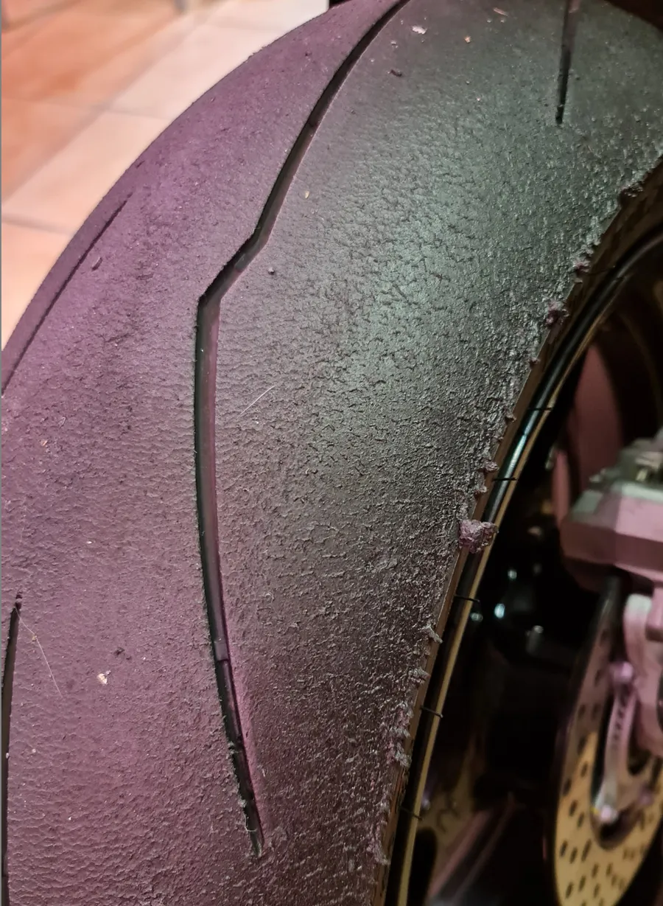

Un autre exemple

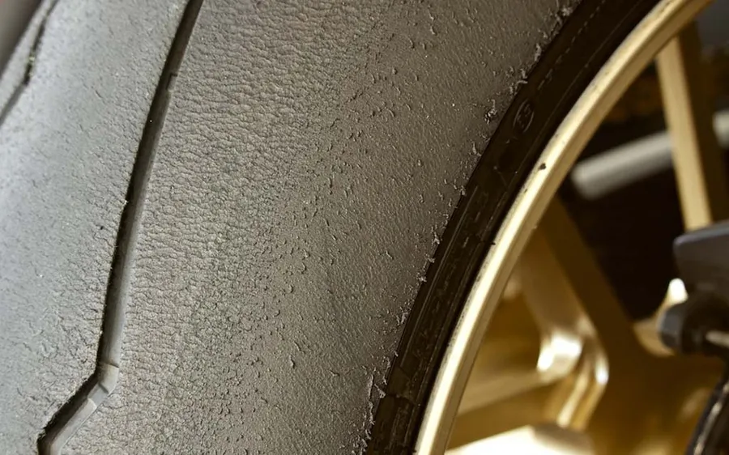

Faut regarder dans le losange rouge

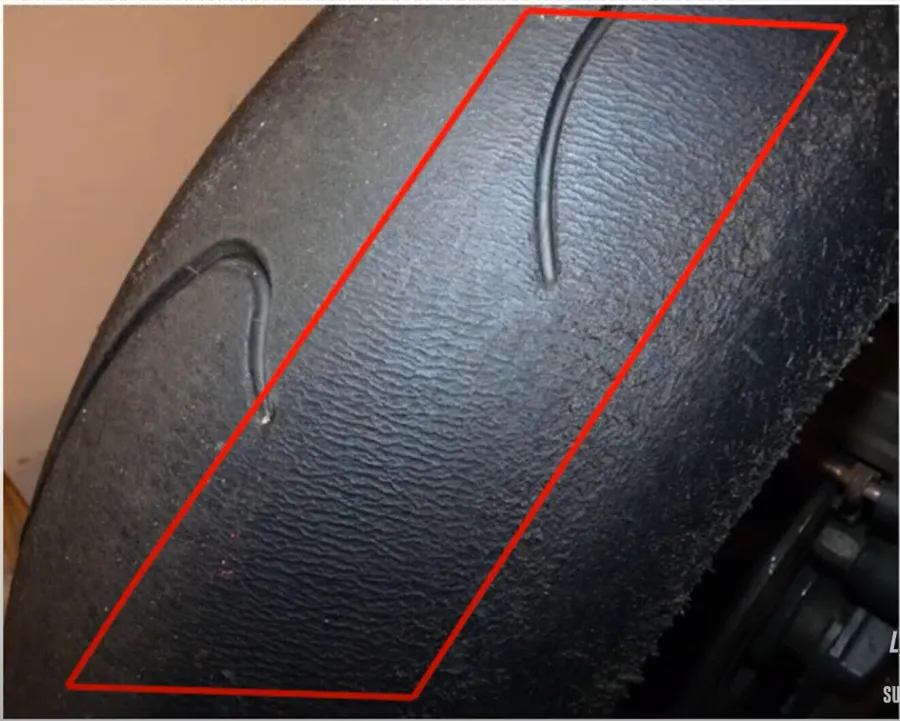

Faut regarder la droite du pneu

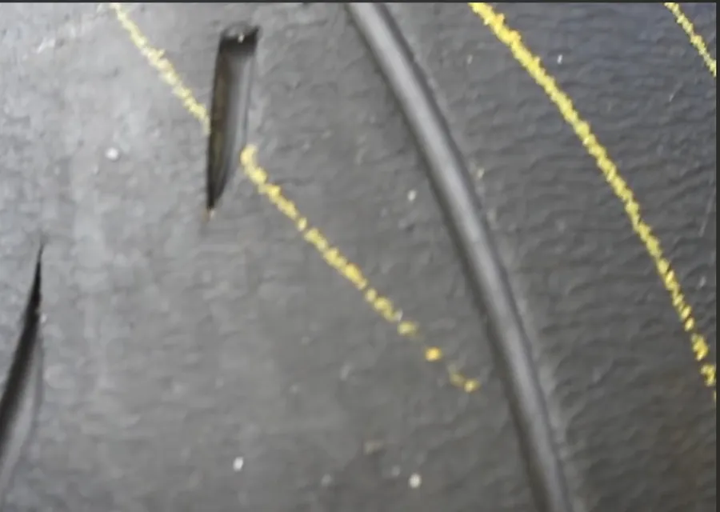

## Variation de pression

**Niveau facile**

Il s'agit simplement de suivre la pression des pneus avant et après les différentes sessions.

1. Avant de tenter de régler n'importe quel autre "problème" il faut s'assurer que les pressions sont bonnes.
2. Si à la fin d'une session on a pris +500gr de pression c'est que le pneu était sous gonflé.
3. C'est normal de prendre 250 gr entre le début et la fin d'une session.

Il ne faut pas négliger le point 1. Il peut nous éviter de perdre du temps à régler des problèmes là où il n'y en a pas. En bref, avant de faire quoi que ce soit sur l'amortissement de la moto, on revient à la base et on commence par vérifier la pression des pneus.

Tu notes que je ne parle pas de vérifier la température des pneus. En fait, un peu plus loin dans la section [Recommandations](#recommandations), je propose de vérifier cette dernière à chaque fin de session.

*Heu... Pourquoi tu dis que c'est normal de prendre 250 gr de pression au cours d'une session ?* 

En fait, en physique il y a une loi (loi des [gaz parfaits](https://fr.wikipedia.org/wiki/Loi_des_gaz_parfaits)) qui dit qu'à volume constant, le rapport de la pression sur la température est constant (autrement dit ils varient dans les mêmes proportions). Si on dit que l'air est un gaz parfait (ce qui n'est pas vrai), ça donne un truc comme ça :

$$\frac{PV}{T} = K$$

Ne commence pas à râler, c'est juste une division, ça reste gérable... Quoiqu'il en soit, cela signifie que si la température T du pneu augmente (à cause des frottements avec la piste par exemple), comme le volume V du pneu ne change pas (ou presque) alors la pression P doit augmenter. Au pire, dans l'équation précédente si tu multiplies la température T par deux, afin que la division donne toujours le même résultat K, tu dois multiplier par la pression P par deux aussi.

Un autre exemple. Il suffit de penser aux déboires de ceux qui suivent des Ducati en Moto GP. Les mamas Italiennes dégagent une telle chaleur que le pneu avant de Quartararo monte en température et en pression. Du coup le grip change radicalement, les vitesses en entrée de virage ne peuvent plus être les mêmes, le niveau de confiance baisse etc.

Cela explique aussi pourquoi il est important de mesurer la pression des pneus avant la première session de l'après-midi. En effet si entre 9H00 et 14H00 on passe de 17°C à 25°C, il est évident que cela va avoir un impact sur la pression des pneus qui va... Roulement de tambour... Augmenter, oui c'est bien ça. Ben tu vois quand tu veux 😁.

## Pneu bleu

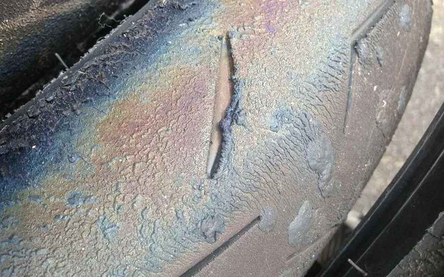

**Niveau facile**

Il n'y a pas trop d'inquiétude à avoir et pas grand-chose à faire. Cela n'est pas lié à ce que subit le pneu sur la piste mais plutôt aux cycles de montée et de descente en température. En fait, la gomme du pneu contient, [entre autres](https://www.tiregom.fr/guide/auto/pneu-voiture/choisir/longevite/entretien/indispensable/fabrication#Les_materiaux_qui_composent_un_pneu), des huiles qui permettent d'homogénéiser le mélange de gommes. Ces huiles remontent à la surface lorsque le pneu monte haut en température et ont tendance à rester en surface lorsque le pneu refroidit vite.

Imaginez que l'huile remonte à la surface via des pores qui sont ouverts quand le pneu est chaud. Le pneu refroidit vite, les pores se referment donc vite et l'huile se trouve piégée à la surface du pneu. On se retrouve alors avec le même phénomène d'irisation que lorsqu'on a une goutte d'huile ou d'essence dans une flaque d'eau (sur une [flaque](https://scienceetonnante.com/2012/09/10/lexperience-de-la-tache-dhuile-de-franklin/), le film a l'épaisseur d'une molécule d'huile, c'est de l'ordre du nanomètre)

Au début de la prochaine session le film d'huile va partir et non, le pneu ne va pas glisser. De retour de la prochaine session, si vous avez des couvertures chauffantes mettez-les sinon essayez de recouvrir le pneu ou de le laisser en plein soleil afin de ralentir son refroidissement mais bon il ne faut pas trop s'inquiéter.

## Le bord des rainures

**Niveau facile**

Il suffit d'inspecter les rainures qui sont sur le pneu. Dans ce qui suit, on va appeler "bord avant" de la rainure le coté de la rainure qui, dans le sens de rotation normal, est devant. Du coup la règle est simple mais je n'arrive jamais à la retenir :

* Si le bord **avant** est plus **haut** que le bord arrière alors le rebond est trop **lent**. Il faut l'ouvrir de 2 clics et voir ce que cela donne à la fin de la prochaine session. Petite remarque : si le rebond est trop lent, tout le poids reste sur l'avant de la moto et l'arrière va avoir tendance à être allégé et à flotter.
* Si le bord **avant** est plus **bas** que le bord arrière alors le rebond est trop **rapide**. Il faut le fermer de 2 clics et voir ce que cela donne à la fin de la prochaine session. Petite remarque : si le rebond est trop rapide, sur l'angle, il a tendance à "écarter" la roue du pilote. La roue sautille et ripe vers l'extérieur. Le pilote perd en confiance.

Afin de retenir la règle j'ai envie de proposer un truc du style "***Si y en a faut en enlever***". Sous-entendu : s'il y a de la matière devant faut enlever du rebond. Ça vaut ce que ça vaut...

Dans la photo ci-dessous le sens de rotation est vers nous. Au bout de la flèche rouge le bord avant de la rainure est plus haut que le bord arrière. Le rebond est trop lent. J'ouvre de 2 clics, je ne touche à rien d'autre et je vois comment évolue la situation à la fin de la session.

C'est bizarre, au bout de la flèche verte les 2 bords de la rainure sont à la même hauteur ? Cela s'explique par le fait que la rainure de la flèche verte est sur la bande de roulement. Normalement le rebond a déjà eu lieu et on est 100% gaz ouvert alors qu'au bout de la flèche rouge on est encore sur l'angle en train d'appliquer la [Throttle Rule]().

Il faut, en priorité, régler les problèmes qu'on rencontre quand on est sur l'angle. Ici il faut donc s'occuper de ce que l'on voit au bout de la flèche rouge.

La moto avance si elle vient vers nous

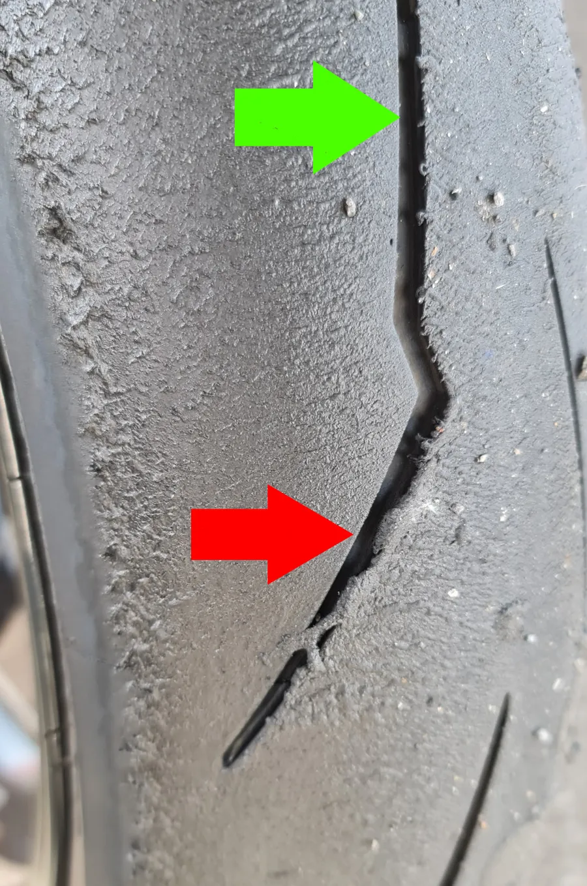

Le pneu AR avance quand il va vers la gauche.

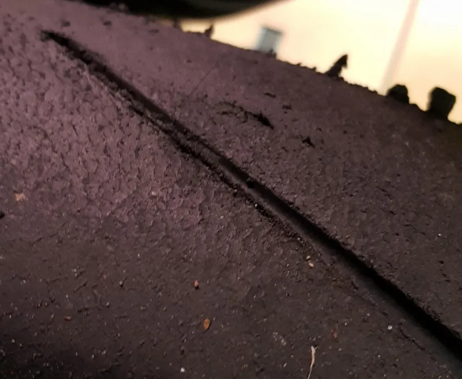

### Remarques en vrac

* Il ne faut pas hésiter à "nettoyer" le pneu autour des rainures car, parfois, ce que l'on pense être de la perte de matière devant ou derrière correspond a de l'accumulation de débris sur l'autre bord. Ce n'est pas le cas ci-dessous.

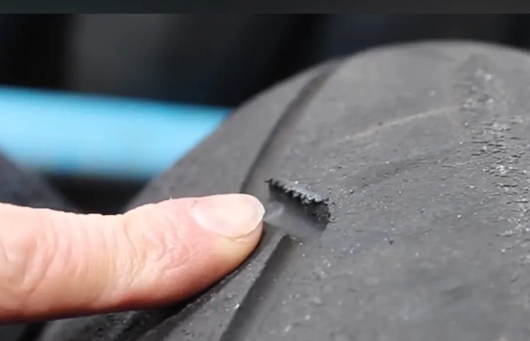

* Si la rainure est longue et va de la bande de roulement jusqu'au bord du pneu (j'exagère) on peut observer des cas où on perd de la matière à l'avant de la rainure sur la bande de roulement et en même temps, on perd de la matière à l'arrière de la rainure sur le côté du pneu. Dans ce cas-là on vérifie si la pression du pneu est bonne et on s'intéresse en priorité à ce qui se passe sur le côté du pneu.

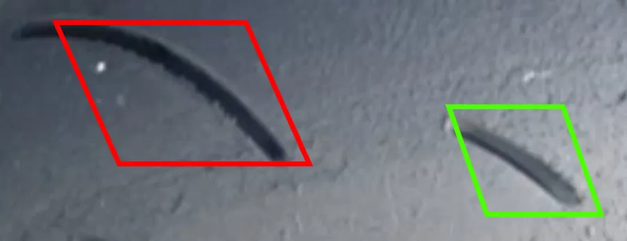

* Si, sur le bord avant des rainures du pneu AV il y a des accumulations de billes de gomme cela indique que la pression est trop basse. C'est exactement le même diagnostique si on trouve des accumulations de billes de gomme à l'arrière des rainures du pneu AR. On peut commencer par ajouter 250 gr de pression et voir ce que cela donne à la fin de la session.

Le pneu AV avance vers nous. La pression est trop basse.

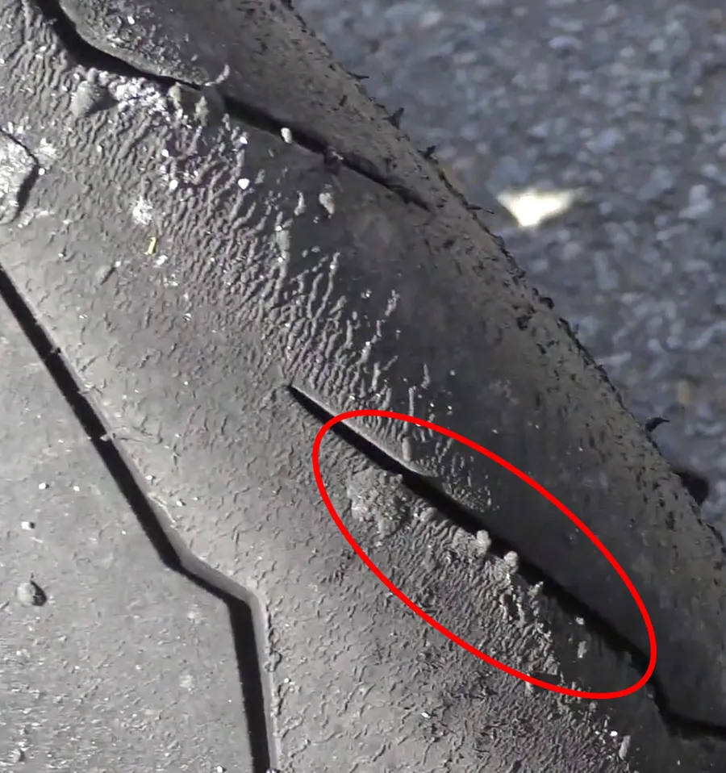

## Pneu qui ne monte pas en température

**Niveau intermédiaire**

La roue avance vers la droite

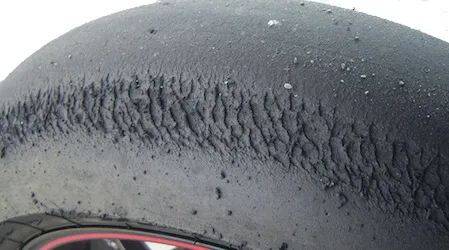

La roue avance vers la droite

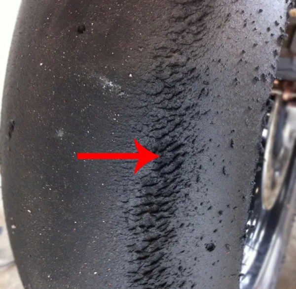

Il y a une bande vide tout au long du bord du pneu. Cette bande a une largeur constante. Ensuite on trouve une bande abîmée. Elle aussi de largeur constante s'il n'y a pas d'autre problème d'amortissement.

Le point le plus **important** c'est que les déchirures de la seconde bande s'enfoncent dans le pneu (jusqu'à 1 mm) et qu'on peut y mettre un ongle quand la main glisse sur le pneu dans le sens opposé à l'avancement de la roue (si la roue va à droite pour avancer, faites glisser la main vers la gauche, l'ongle peut rentrer dans le pneu).

Le pneu est trop gonflé. La zone de contact avec la piste est trop fine. Elle monte très/trop haut en température, le pneu se déchire à cet endroit sans que la température ne soit diffusée dans le reste du pneu.

Il faut laisser complètement refroidir le pneu et la jante puis vérifier la pression. Si vous avez un doute il ne faut pas hésiter à changer de manomètre.

## Pneu trop chaud

**Niveau intermédiaire**

La roue avance en s’enfonçant dans l'écran

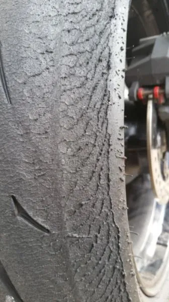

Comme quand le pneu ne monte pas en température, il y a une bande vide tout au long du bord du pneu. Cette bande a une largeur constante. Ensuite on trouve une bande abîmée. Elle aussi a une largeur constante s'il n'y a pas d'autre problème d'amortissement.

En revanche ici, le pneu est sous-gonflé et la surface de contact est donc trop grande par rapport à ce qu'elle devrait être si la pression était correcte. Du coup toute la surface du pneu surchauffe. La gomme fond en surface, elle n'est pas arrachée en profondeur. On ne peut **PAS** faire rentrer son ongle là où c'est abîmé. On ne peut pas arracher la gomme. En fait la gomme de surface a fondu et a glissé sur le pneu. Normalement on voit des traces qui convergent vers le centre de la bande de roulement.

Il faut laisser complètement refroidir le pneu et la jante puis vérifier la pression. Ici aussi, si vous avez un doute il ne faut pas hésiter à changer de manomètre.

## Recommandations

*C'est bien gentil tout ça mais, moi, demain je fais quoi de toutes ces informations?* 

Ok, ok, on va faire une petite synthèse qui se divise en deux parties selon que l'on est avant la saison des roulages ou pendant une journée de roulage.

### Avant la saison de roulages

1. Si je ne sais pas de quand date le dernier changement d'huile de la fourche ou s'il date d'y il a 2 ans et plus, je fais ou je fais faire un changement d'huile. J'en profite pour faire changer les joints spi.
2. Idem pour l'amortisseur si cela est possible.
   Pendant qu'on y est... Alors que j'ai l'amortisseur en main ou qu'il vient d'être remonté, j'en profite pour vérifier que je peux facilement dévisser et revisser les 2 bagues du réglage de précontrainte. C'est quand même plus facile de faire ça maintenant, gentiment au garage, plutôt que de découvrir, en pleine journée de roulage, que tout est coincé, qu'on manque de force etc.

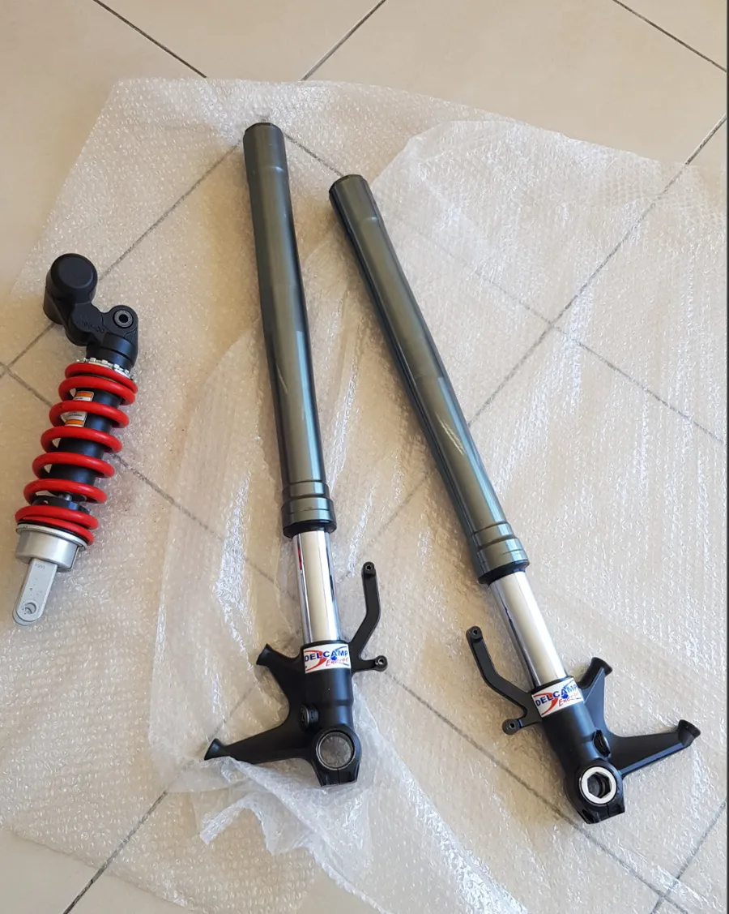

3. Je prends le temps de régler mes suspensions en statique et de noter mes réglages. Voir la section [Références](#references) un peu plus bas. Pensez à bien **tout ouvrir** (compression, détente etc.) quand vous vérifiez les courses mortes.
4. Sur la fourche je mets un Rilsan. Cela permettra de vérifier si la fourche travaille sur une amplitude maximale et/ou si elle n'arrive pas en butée. C'est alors dangereux car en butée il n'y a plus d'amortissement à part ce que peut fournir la déformation du pneu. Mais bon, cela ne va pas très loin, on croise rapidement l'avant et on termine au tas bêtement.
   C'est beaucoup moins pratique mais j'essaie aussi de mettre aussi un Rilsan sur l'amortisseur.

Voir le Rilsan sur le fourreau. Quand la fourche va s'enfoncer, il va encore descendre.

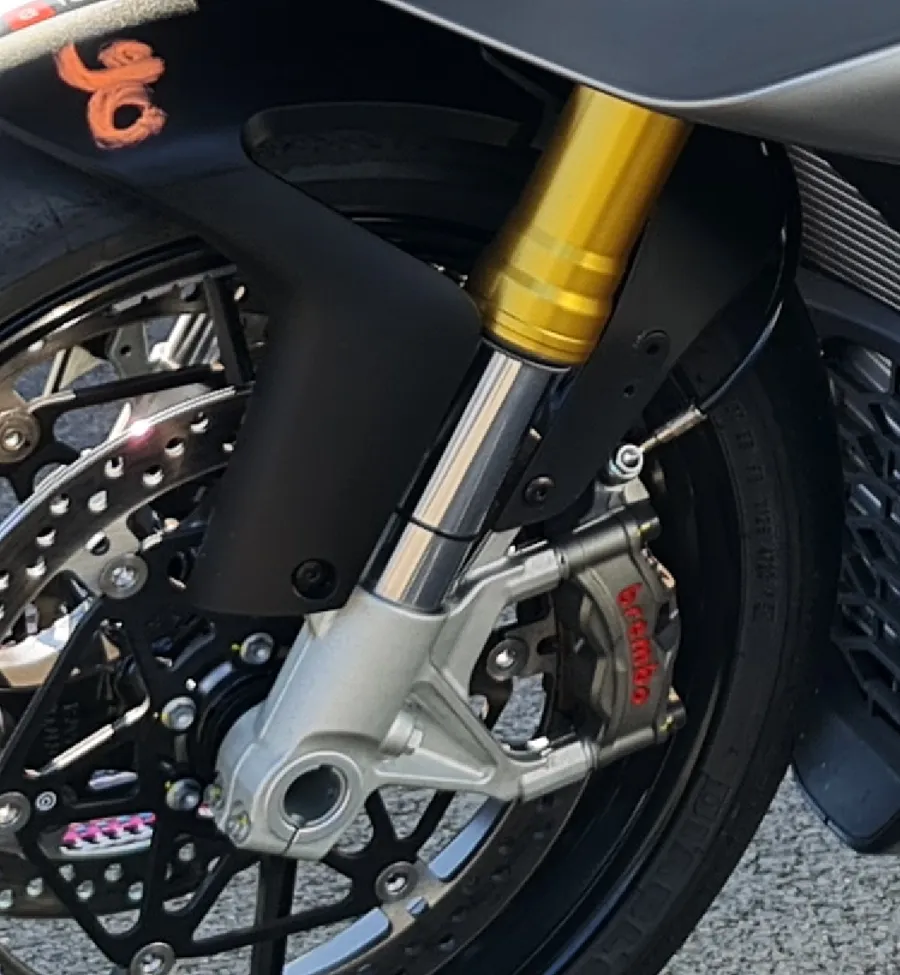

Bien sûr, en début de session il faut penser à le remonter.

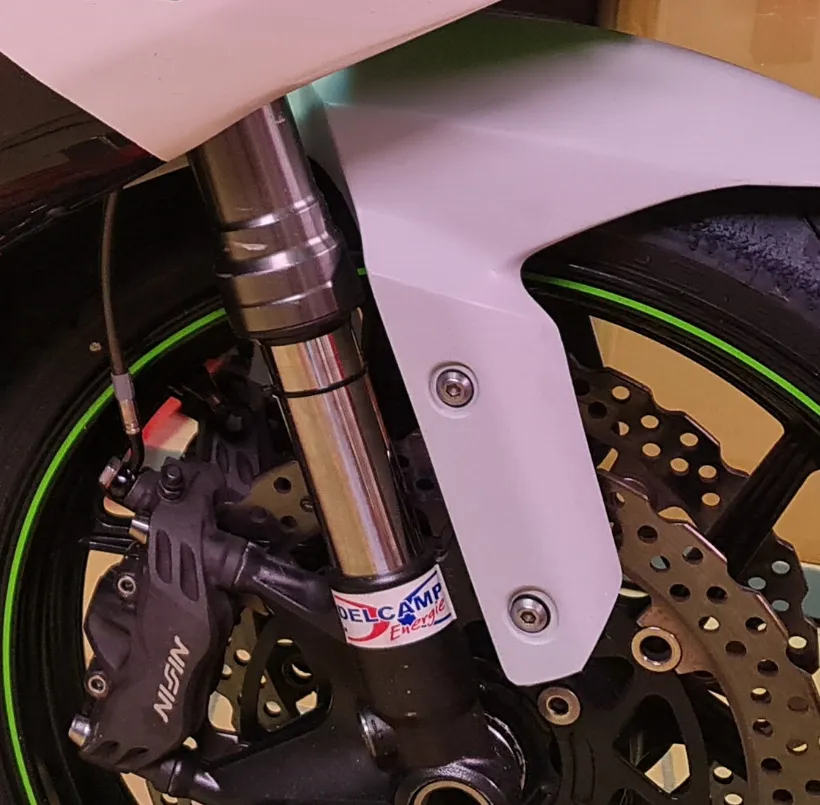

### Lors d'une journée de roulage

* À t moins 10 min de la premiere session du matin, vérifier les pressions. Personnellement j'utilise de moins en moins les couvertures chauffantes donc j'ajuste les pressions aux pressions à froid. Sinon quand j'utilise des couvertures chauffantes je les laisse sur les pneus je règle la pression des pneus à la pression "sortie de couvertures".
* À chaque fin de session
  + En ayant encore les gants aux mains et le casque sur la tête : mesurer la température des pneus, à l'avant et à l'arrière, sur les côtés gauches et droits.
  + Une fois les gants et le casque enlevés, prendre 1 minute pour inspecter les pneus et selon ce que l'on voit, utiliser les paragraphes précédents pour corriger le tir si besoin.
  + Avant de faire un changement sur la fourche ou l'amortisseur je m'assure que les pressions sont bonnes.
  + Si les pressions sont bonnes et si je décide de faire un changement sur la fourche ou l'amortisseur, je ne fais **jamais** plus de 2 clics à la fois et je ne change **jamais** plus d'un paramètre à la fois.
* À t moins 10 min de la premiere session de l'après-midi, vérifier les pressions. Voir les modalités au premier point.

#### **En complément des conseils de la journée de roulage**

Si entre 2 sessions je gagne 3 secondes au tour... C'est sûr, j'ai changé quelque chose : je passe plus vite à certains endroits, j'accélère plus fort... Bref, il faut avoir une attention particulière sur les pneus et prendre 2 minutes pour mesurer la pression avant la prochaine session.

Idem, si entre 9H00 et 11H on prend 10°C au niveau de la température ambiante. Il est clair que la température de la piste va monter aussi. Il est peut-être judicieux de mesurer de nouveau les pressions.

Histoire de se simplifier la vie... Prendre une photo ou récupérer les pressions recommandées et les garder dans son téléphone ou sur une feuille de sessions (il y a un exemple de feuille de sessions [sur cette page] NOT YET TRANSFERED ({#link docs/07_moto/002_feuille_sessions/feuille_sessions.md#}) avec les 3 types de pneus que j'utilise régulièrement)

Accessoirement...Investir dans un thermomètre laser à 20€ afin de mesurer et prendre conscience des températures des pneus en retour de sessions. Encore une fois, il faut mesurer AV et AR mais aussi côté gauche et côté droit. Instructif.
Concernant la précision du thermomètre il ne faut pas trop s'inquiéter. Ce qui est important c'est d'utiliser toujours le même en cours de journée et d'être attentif, plus aux variations qu'aux mesures. Ce que je veux dire c'est que s'il indique 52° alors qu'en réalité le pneu est à 55° ce n'est pas très grave. Cependant si entre le matin et l'après-midi nos mesures passent de 55° à 65° là, en revanche ça veut dire quelque chose et il faudra sans doute en tenir compte.

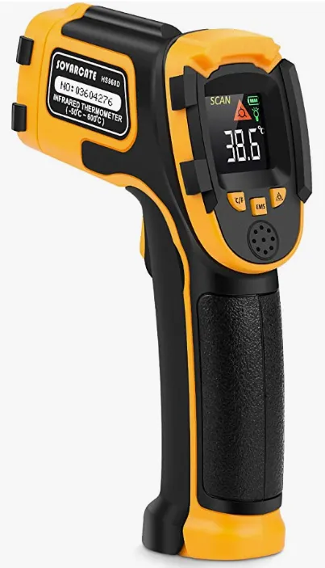

Typiquement 20€ sur [Amazon](https://www.amazon.fr/Thermom%C3%A8tre-Infrarouge-Temp%C3%A9rature-58%C2%B0F-1112%C2%B0F-50%C2%B0C%EF%BD%9E600%C2%B0C/dp/B089DYHPC6/ref=sr_1_9?keywords=thermometre+laser&qid=1667034685&qu=eyJxc2MiOiI1LjA4IiwicXNhIjoiNC41MyIsInFzcCI6IjQuNDcifQ%3D%3D&sr=8-9)

Sinon quand vous serez riches vous pourrez investir dans un ensemble de précision de type karting pour mesurer [pression et température](https://www.action-karting.fr/Manometre-HIPREMA-4-v-PRESSION-PNEUS-INFRAROUGE-T-PNEUS-par-SOND/p/4/511/18357/) (450€ quand même).

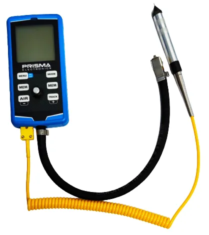

## Références

### Vidéos sur le web

La chaine YouTube de [Dave Moss](https://www.youtube.com/user/CatalystReactionSBW/videos?view=0&sort=p&flow=grid).

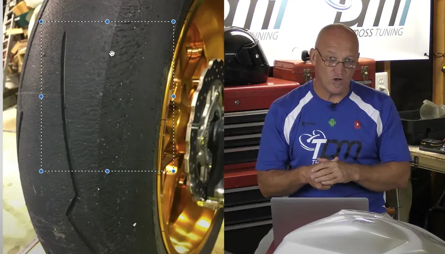

C'est, de loin, LA référence la plus complète sur le sujet. On parle ici de plus de 900 vidéos publiées depuis plus de 13 ans. Oui, oui, je sais c'est en anglais, mais bon, on peut mettre les sous-titres, ralentir à 75% la vitesse de défilement et certaines vidéos ont des sous-titres traduits.
Ce qui me chagrine c'est qu'il fait de plus en plus de "trailer" afin qu'on paie et qu'on s'abonne. Perso ça me soûle un peu car il y a de moins en moins de vidéos complètes. Il ne faut donc pas hésiter à faire des recherches dans les anciennes vidéos quitte à effectuer la recherche depuis Google et PAS depuis YouTube. En effet, dans Google on peut préciser une fenêtre de tir pour les dates. Par exemple, voilà ce que cela donne quand je cherche une vidéo entre 2018 et 2020.

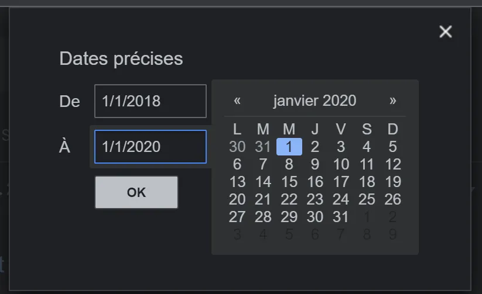

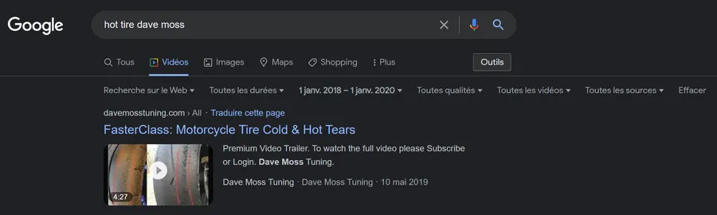

Sauf erreur de ma part il y a aussi moyen de retrouver certaines vidéos sur Vimeo

Sinon il y a 2 vidéos dédiées respectivement aux amortisseurs et à la fourche sur la chaine de **[Nathalie BETHELIE](https://www.youtube.com/channel/UCs-k62clKR91XY4T5lqoCJA)**. Attention les vidéos traitent de l'amortissement et pas vraiment des informations que nous remontent les pneus.

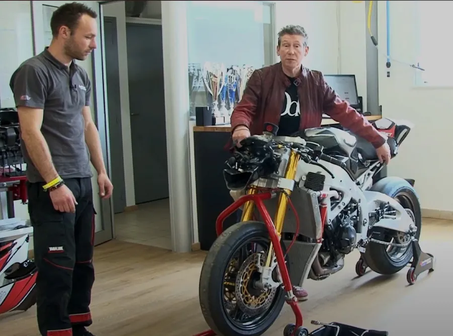

<iframe width="560" height="315" src="https://www.youtube.com/embed/0mGDdnFGyZ0?si=-gEWGkAnxt1S5sZA&amp;start=13" title="YouTube video player" frameborder="0" allow="accelerometer; autoplay; clipboard-write; encrypted-media; gyroscope; picture-in-picture; web-share" referrerpolicy="strict-origin-when-cross-origin" allowfullscreen></iframe>

Pour une introduction rapide en anglais sur le réglage des suspensions et sur ce que l'on peut faire (ou pas) en fonction des motos, il y a cette vidéo de **[MotoJitsu](https://www.youtube.com/c/MotoJitsu)** :

<!-- https://www.youtube.com/watch?v=lo0kv_6hG-0&list=PLOmfq6wDOTY47KYrwDJZC12l5aDa5ST2Y&index=74&t=22s -->

<iframe width="560" height="315" src="https://www.youtube.com/embed/lo0kv_6hG-0?si=wEv5FPW99-gH_rh8&amp;start=22" title="YouTube video player" frameborder="0" allow="accelerometer; autoplay; clipboard-write; encrypted-media; gyroscope; picture-in-picture; web-share" referrerpolicy="strict-origin-when-cross-origin" allowfullscreen></iframe>

Il y a enfin cette vidéo de l'excellente chaine anglaise [**Life at Lean**](https://www.youtube.com/c/LifeatLean) qui est pour le coup, inspirée du travail de Dave Moss et pile-poil sur le sujet. Je suis un peu inquiet, cela fait longtemps qu'il n'y a rien eu de publié sur la chaine en question. Je crois que [Dan Netting](https://www.youtube.com/channel/UCY9gbD_LrCoBCMzSiV0I1kg) est passé à autre chose. En tout cas, cela n'enlève rien à la vidéo ci-dessous.

<!-- https://youtu.be/Cqq5dEiADJY -->

<iframe width="560" height="315" src="https://www.youtube.com/embed/Cqq5dEiADJY?si=OYjaFbpurriqBqhf" title="YouTube video player" frameborder="0" allow="accelerometer; autoplay; clipboard-write; encrypted-media; gyroscope; picture-in-picture; web-share" referrerpolicy="strict-origin-when-cross-origin" allowfullscreen></iframe>

### Pages Web

Google est ton ami... En Français et à propos du réglage des suspensions, je recommande cette [page.](http://www.les7pechesdumotard.fr/Comment-regler-ses-suspensions%2C158.html?utm_source=pocket_mylist) Elle date un peu et je n'aime pas les gifs animés mais tout ce qui concerne le réglage des suspensions y est.

Sinon il y a aussi cette [page](https://acidmoto.ch/cms/content/tutoriel/2012/11/24/comment-bien-regler-ses-suspensions) ou encore cet [article](https://moto-addict.com/technique-moto/96-regler-les-suspensions-de-sa-moto).

En anglais il y a la [version web](https://lifeatlean.com/motorcycle-tyre-wear-guide/) de la vidéo de Dan Netting de Life at Lean dont je viens de parler juste au-dessus. Il existe une version traduite de cet article [ici](https://www.motoblouz.com/enjoytheride/tutos-entretien-moto/4676-usure-irreguliere-pneus-piste-identifier-lorigine-2014-04-11).

### Livres

Côté bouquins c'est un peu la misère en français et, là aussi, ils traitent surtout des suspensions et pas vraiment de la lecture des pneus.

À l'occasion vous pouvez-lire (en anglais) la première partie de [ce livre](https://lire.amazon.fr/kp/embed?asin=B00FKYXJCM&preview=newtab&linkCode=kpe&ref_=cm_sw_r_kb_dp_WKMHBQW5KY3X3XCR9AJE&tag=40tude-21) qui est dédié aux suspensions. Je trouve la seconde moitié pas appropriée à mes besoins car je n'ai pas du tout l'intention de démonter/remonter complètement ma fourche.

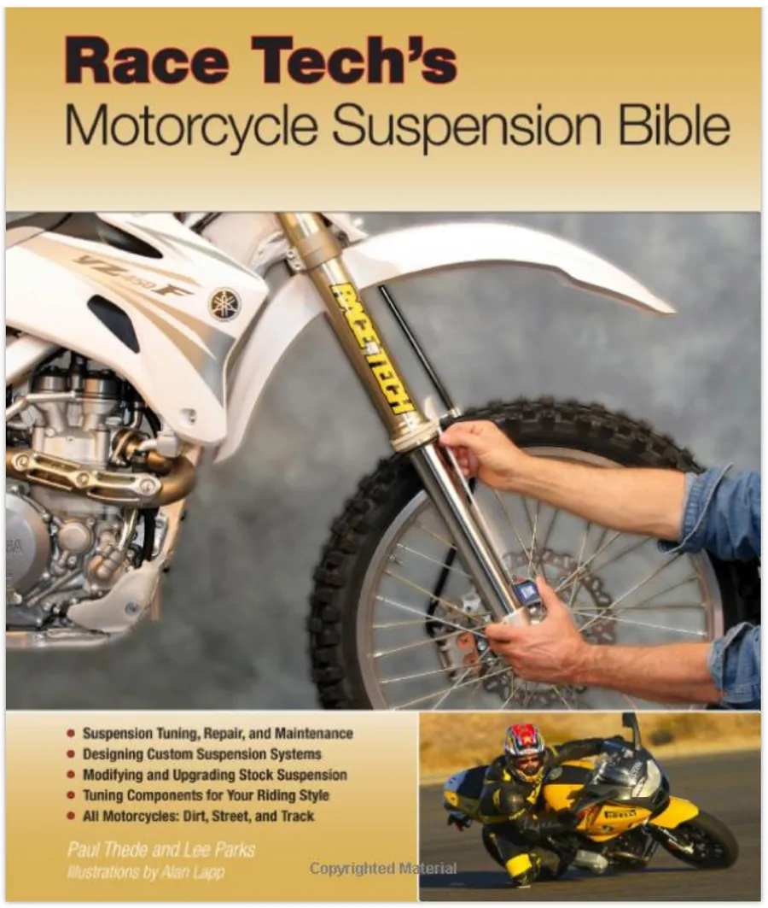

Ensuite dans le Tome 2 de "[Le chrono ne ment pas](http://kennyforay.com/shop/Le-chrono-ne-ment-pas-1%262-p195955506)" il y a un chapitre dédié aux suspensions. Sinon, il y a des informations disséminées dans les autres chapitres. Il faut acheter le livre sur le site de Kenny Foray, pas en belgique.

Enfin, je pense au bouquin [Total Control de Lee Parks]({#link https://lire.amazon.fr/kp/embed?asin=B00R31222S&preview=newtab&linkCode=kpe&ref_=cm_sw_r_kb_dp_T3MD1F4X96MNY97WZPHT&tag=40tude-21#}) dont les chapitres 3 et 15 sont dédiés aux suspensions et à leurs réglages. Malheureusement, lui aussi ne parle pas de la lecture des pneus.

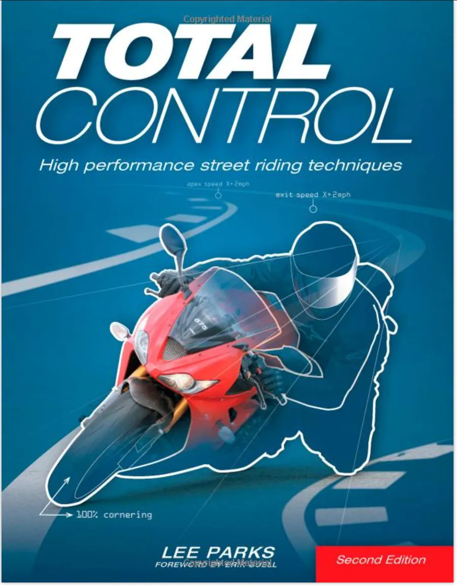

## Conclusion

Vu le prix des pneus on a intérêt à en prendre soin. Si en plus leur lecture peut nous permettre de régler correctement nos suspensions ce serait dommage de s'en priver.

Encore une fois je ne suis pas un pro du sujet et donc, si vous avez des remarques **constructives** à apporter pour améliorer la page, lâchez un commentaire. Rappelez-vous toutefois que la page traite de la lecture des pneus pour faire évoluer les pressions de pneus et/ou faire évoluer les réglages des suspensions. La page n'est pas dédiée aux réglages initiaux des suspensions qui est un sujet à part entière (si vous pensez qu'une page sur le sujet serait bienvenue, dites-le dans les commentaires).

Bon, allez, la suite au prochain numéro. D’ici-là relisez les [notes de pilotage]() ou faites des squats afin de préparer les prochains roulages.

<!-- https://youtu.be/TIhtpItTuxc -->

<iframe width="560" height="315" src="https://www.youtube.com/embed/TIhtpItTuxc?si=qL84DxP-ejd_Yi4-&amp;start=53" title="YouTube video player" frameborder="0" allow="accelerometer; autoplay; clipboard-write; encrypted-media; gyroscope; picture-in-picture; web-share" referrerpolicy="strict-origin-when-cross-origin" allowfullscreen></iframe>

