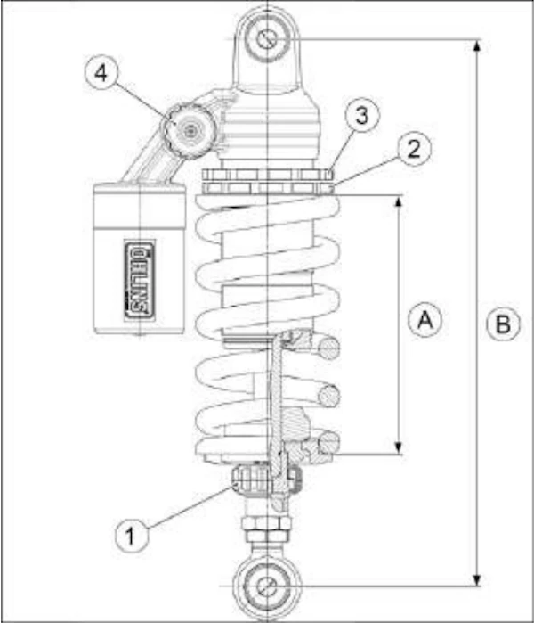

# {{ page.title }}
{: .no_toc }

{{ page.description }}
{: .lead }

<h2 align="center"><b> 🚧 This post is under construction 🚧</b></h2>

<!-- ###################################################################### -->
<!-- ###################################################################### -->
<!-- ###################################################################### -->
## TL;DR
{: .no_toc }

* `FRONT_STATIC_SAG` = 25 mm
* `REAR_STATIC_SAG` = 10 mm
* `FRONT_DRIVER_SAG` = 35 mm
* `REAR_DRIVER_SAG` = 30 mm

<figure style="max-width: 650px; margin: auto; text-align: center;">

<figcaption>Fourche RS660 Factory 2025</figcaption>
</figure>

<!-- ###################################################################### -->
<!-- ###################################################################### -->
<!-- ###################################################################### -->
## Table of Contents
{: .no_toc .text-delta}
- TOC
{:toc}

<!-- ###################################################################### -->
<!-- ###################################################################### -->
<!-- ###################################################################### -->
## 0. Préliminaires

1. Vérifier que le réservoir est rempli entre 50% et 100%

1. Vérifier que la chaîne n'est pas trop tendue
    * Si c'est le cas, le bras oscillant ne peut pas osciller librement, la chaîne tire sur le PSB... Bref, c'est vraiment pas une bonne chose.
    * On peut en profiter pour vérifier que la chaîne est bien alignée
1. Mesurer la hauteur du joint spi de fourche. **Exemple:** $$\text{SPI} = 7 \text{ mm}$$ pour un RS 660 Factory

<figure style="max-width: 650px; margin: auto; text-align: center;">

<figcaption>Mesure de la hauteur du joint spi de fourche</figcaption>
</figure>

4. Mesurer la largeur du zip. **Exemple:** $$\text{ZIP} = 2.5 \text{ mm}$$

<figure style="max-width: 650px; margin: auto; text-align: center;">

<figcaption>Mesure de la largeur du zip. On va dire 2.5 mm</figcaption>
</figure>

5. Poser le zip sur un des tubes de fourche

<figure style="max-width: 650px; margin: auto; text-align: center;">

<figcaption>Poser le zip sur un des tubes de fourche</figcaption>
</figure>

6. Retrouver dans le manuel utilisateur les valeurs des débattements AV er AR.
**Exemple:**

$$
\begin{align*}
\text{FRONT-STROKE} &= 120 \text{ mm} \\
\text{REAR-STROKE} &= 51.5 \text{ mm} \\
\end{align*}
$$

<figure style="max-width: 650px; margin: auto; text-align: center;">

<figcaption>Débattements de la fourche et de l'amortisseur dans la documentation  constructeur.</figcaption>
</figure>

6. Pour l'AV et l'AR retrouver dans la documentation les moyens de régler et les valeurs par défaut de :
    - Précharge
    - Rebond
    - Compression
    - Rebond rapide
    - Compression rapide

<figure style="max-width: 650px; margin: auto; text-align: center;">

<figcaption>Doc Aprilia. 1=précharge 2=compression (tube de droite) 3=détente (tube de droite)</figcaption>
</figure>

En fonction des motos rebond, compression, rebond rapide et compression rapide peuvent ne PAS être disponibles. Certains réglages peuvent se trouver sur le pied de fourche (en bas). Dans certains cas on peut aussi retrouver les réglages de rebond et de compression sur chacun des tubes

**Exemple de valeurs par défaut**: La doc Aprilia du RS660 Factory indique qu'il n'y a qu'une configuration piste et n'indique donc aucune valeur pour un usage route. Ensuite il est précisé :
- Précharge = -5 tours depuis la position complètement serrée
- Compression = -16 clicks depuis la position fermée
- Détente = -12 clicks depuis la position fermée

<figure style="max-width: 650px; margin: auto; text-align: center;">

<figcaption>Doc Aprilia. 2&3=précharge 4=compression 1=détente</figcaption>
</figure>

**Exemple de valeurs par défaut**: Là aussi la doc Aprilia du RS660 Factory indique qu'il n'y a qu'une configuration piste et n'indique donc aucune valeur pour un usage route. Ensuite il est précisé :
- Précharge $$\rightarrow$$ A = 143 mm
- Compression = -10 clicks depuis la position fermée
- Détente = -20 clicks depuis la position fermée

7. Préparer les outils en conséquence
- Clé à pipe de 17
- Clé Allen de 3
- ...

<figure style="max-width: 650px; margin: auto; text-align: center;">

<figcaption>Clé pour régler la précontraint de l’amortisseur</figcaption>
</figure>

<!-- ###################################################################### -->
<!-- ###################################################################### -->
<!-- ###################################################################### -->
<!-- ## 1. Fourche: Vérifier les réglages par défauts

### Pourquoi?:
{: .no_toc }

Pour vérifier car on sait jamais. Pour pouvoir y revenir le cas échéant.

### Comment?:
{: .no_toc }

#### **Précharge**
{: .no_toc }

1. Ouvrir (dévisser) et noter le nombre de tours de précharge sur les tubes gauche et droit
1. Fermer (visser) complètement et noter le nombre de tours disponibles
1. Ouvrir complètement la précharge sur les 2 tubes

### **Rebond (si disponible)**
{: .no_toc }

1. Ouvrir et noter le nombre de clics de rebond sur les tubes gauche et/ou droit
1. Fermer complètement et noter le nombre de clics disponible
1. Ouvrir complètement

#### **Compression (si disponible)**
{: .no_toc }

1. Ouvrir et noter le nombre de clics de compression sur les tubes gauche et/ou droit
1. Fermer complètement et noter le nombre de clics disponible
1. Ouvrir complètement
 -->

<!-- ###################################################################### -->
<!-- ###################################################################### -->
<!-- ###################################################################### -->
<!-- ## 1. Déterminer la buttée de fourche (bottom out) -->
## 1. Mesure de les extensions maximum à l'avant et à l'arrière

### Pourquoi?:
{: .no_toc }

### Comment?:
{: .no_toc }

#### **AVANT:**
{: .no_toc }

1. Dévisser complètement la précharge, le rebond et la compression de la fourche
1. Étendre la fourche à son maximum.
    * Il vaut mieux être 2.
    * On bascule la moto sur sa béquille latérale jusqu'à ce que le pneu AV ne touche plus terre.
1. Mesurer alors la longueur entre le fourreau et le pied de fourche (ne pas mesurer sous le joint spi).

**Exemple:**

$$\text{F1} = 143 \text{ mm}$$

#### **ARRIÈRE:**
{: .no_toc }

1. Poser un morceau de scotch bleu à peinture sur le dosseret de selle, à la verticale de l'axe de la roue arrière. Faire une croix au feutre.
1. Dévisser complètement la précharge, le rebond et la compression de l'amortisseur
1. Étendre l'amortisseur à son maximum.
    * Il vaut mieux être 2 ou 3
    * Soulever l'arrière de la moto jusqu'à ce que le pneu AR ne touche plus terre.
1. Mesurer alors la longueur entre l'axe de la roue AR et la croix.

**Exemple:**

$$\text{R1} = ??? \text{ mm}$$

<!-- ###################################################################### -->
<!-- ###################################################################### -->
<!-- ###################################################################### -->
## 2. Mesure de la course morte (static sag, moto SANS pilote)

### Pourquoi?:
{: .no_toc }

### Comment?:
{: .no_toc }

#### **AVANT:**
{: .no_toc }

1. Manipuler doucement la moto et la mettre verticale sur ses deux roues
1. Mesurer la longueur entre le fourreau et le pied de fourche (ne pas mesurer sous le joint spi).

**Exemple:**

$$\text{F2} = 115 \text{ mm}$$

1. Application numérique:

$$
\begin{align*}
\text{FRONT-STATIC-SAG} & = \text{F1} - \text{F2} \\
\text{FRONT-STATIC-SAG} & = 143 - 115 \\
\text{FRONT-STATIC-SAG} & = 28 \text{ mm}
\end{align*}
$$

1. Sur piste on veut un `STATIC_SAG` proche de 25 mm
1. Ici, avec 28 mm, la moto s'enfonce un peu trop. Faut ajouter/fermer la précharge
1. On ferme de 4 tours par exemple
1. On mesure à nouveau et on lit $$\text{F2} = 118 \text{ mm}$$.
1. Du coup on a

$$
\begin{align*}
\text{FRONT-STATIC-SAG} & = \text{F1} - \text{F2} \\
\text{FRONT-STATIC-SAG} & = 143 - 118 \\
\text{FRONT-STATIC-SAG} & = 25 \text{ mm}
\end{align*}
$$

1. On touche plus à rien

#### **ARRIÈRE:**
{: .no_toc }

1. Manipuler doucement la moto et la mettre verticale sur ses deux roues
1. Mesurer la longueur entre l'axe de la roue AR et la croix.

**Exemple:**

$$\text{R2} = ??? \text{ mm}$$

$$
\begin{align*}
\text{REAR-STATIC-SAG} & = \text{R1} - \text{R2} \\
\text{REAR-STATIC-SAG} & = ??? - ??? \\
\text{REAR-STATIC-SAG} & = 10 \text{ mm}
\end{align*}
$$

1. Sur piste on veut un `STATIC_SAG` proche de 10 mm
1. On touche plus à rien

<!-- ###################################################################### -->
<!-- ###################################################################### -->
<!-- ###################################################################### -->
## 4. Mesure de la précharge statique (driver sag, moto AVEC pilote)

### Pourquoi?:
{: .no_toc }

### Comment?:
{: .no_toc }

#### **AVANT:**
{: .no_toc }

1. S'équiper: bottes, gants, casque, combine ou blouson
1. Monter DOUCEMENT sur la moto

**Exemple:**

$$\text{F3} = 108 \text{ mm}$$

1. Application numérique:

$$
\begin{align*}
\text{FRONT-DRIVER-SAG} & = \text{F1} - \text{F3} \\
\text{FRONT-DRIVER-SAG} & = 143 - 108 \\
\text{FRONT-DRIVER-SAG} & = 35 \text{ mm}
\end{align*}
$$

1. Sur piste on veut un `FRONT_DRIVER_SAG` proche de 35 mm

<!-- 1. Freiner de l'avant et pomper plusieurs fois la fourche
1. Faire une autre mesure.
**Exemple:**
$$\text{F3} = 109 \text{ mm}$$
    1. C'est OK si la difference est de l'ordre du mm
    1. Si y a une grande difference, faire la révision de la fourche (huile, joints...)
1. Prendre la valeur moyenne des 2 valeurs précédentes
1. Objectifs `DRIVER_SAG` = 35 mm -->

Ajustements:
* Si on lit 30 mm il faut ouvrir la précharge. Si on est tout ouvert et si on atteint toujours pas la valeur souhaitée, le pilote est trop léger. Faut changer les ressorts
* Si on lit 40 mm il faut fermer la précharge. Si on est tout fermé et si on atteint toujours pas la valeur souhaitée, le pilote est trop lourd. Faut changer les ressorts

#### **ARRIÈRE:**
{: .no_toc }

**Exemple:**

$$\text{F3} = 108 \text{ mm}$$

1. Application numérique:

$$
\begin{align*}
\text{REAR-DRIVER-SAG} & = \text{F1} - \text{F3} \\
\text{REAR-DRIVER-SAG} & = 143 - 108 \\
\text{REAR-DRIVER-SAG} & = 35 \text{ mm}
\end{align*}
$$

1. Sur piste on veut un `REAR_DRIVER_SAG` proche de 30 mm

Ajustements:
* Si on lit 25 mm il faut ouvrir la précharge. Si on est tout ouvert et si on atteint toujours pas la valeur souhaitée, le pilote est trop léger. Faut changer le ressort
* Si on lit 40 mm il faut fermer la précharge. Si on est tout fermé et si on atteint toujours pas la valeur souhaitée, le pilote est trop lourd. Faut changer le ressort

<!-- ###################################################################### -->
<!-- ###################################################################### -->
<!-- ###################################################################### -->
## 5. Mesurer la buttée de fourche en fonction du réglage de précharge

### Pourquoi?:
{: .no_toc }

### Comment?:
{: .no_toc }

#### **AVANT:**
{: .no_toc }

1. Étendre la fourche à son maximum
1. Mesurer du fourreau au pied (ne pas mesurer sous le joint spi).
**Exemple:** $$\text{F1} = 146 \text{ mm}$$
1. Application numérique:

$$
\begin{align*}
\text{BOTTOM-OUT} & = \text{FULL-EXT} - \text{FRONT-STROKE} \\
\text{BOTTOM-OUT} & = 146 - 120 \\
\text{BOTTOM-OUT} & = 26 \text{ mm}
\end{align*}
$$

<!-- ###################################################################### -->
<!-- ###################################################################### -->
<!-- ###################################################################### -->
## 6. Calculer la limite à surveiller pendant le track day

### Pourquoi?:
{: .no_toc }

### Comment?:
{: .no_toc }

1. Par exemple, on veut $$\text{MARGIN} = 10 \text{ mm}$$ avant que la fourche ne touche.
1. La distance minimale entre le pied de fourche et le base du zip est donc:

$$
\begin{align*}
\text{LIMIT} & = \text{F1} - \text{FRONT-STROKE} - \text{SPI} - \text{ZIP} + \text{MARGIN} \\
\text{LIMIT} & = 146 - 120 - 5 - 2 + 10 \\
\text{LIMIT} & = 29 \text{ mm}
\end{align*}
$$

1. Il ne faut pas que le bas du zip descende sous les 29 mm
1. Poser un sticker à 29 mm sur le tube

Ajustements:
* Si le bas du zip dépasse la limite (mesure inf à 29 mm) il faut fermer la précharge et/ou vérifier les mesures
* Si le bas du zip reste loin de la limite on peut freiner plus fort et/ou vérifier les mesures

<!-- Link to a video -->
<!-- <figure style="max-width: 560px; margin: auto;">

    <iframe
    src="https://www.youtube.com/embed/MIeYz6aMBbk"
    title="Add a title"
    style="position: absolute; inset: 0; width: 100%; height: 100%;"
    allowfullscreen>
    </iframe>

<figcaption style="text-align: center;">TODO: Add a legend</figcaption>
</figure> -->

<!-- ###################################################################### -->
<!-- ###################################################################### -->
<!-- ###################################################################### -->
## 7. Mettre les valeurs par défaut des hydrauliques (compression, détente)

### Pourquoi?:
{: .no_toc }

### Comment?:
{: .no_toc }

#### **AVANT:**
{: .no_toc }

1. Retrouver les valeurs qu'on a noté au tout début
1. Pomper à l'AV et vérifier que ce dernier remonte à sa position initiale sans la dépasser.
1. Ne pas hésiter à faire des tests en ouvrant tout (la moto doit faire le yoyo) et en fermant tout (impossible d'enfoncer la fourche ou bien cette dernière remonte tout doucement).

**Objectif:** Il faut que l'AV remonte vite mais sans dépasser la position d'équilibre.

#### **ARRIÈRE:**
{: .no_toc }

1. Retrouver les valeurs qu'on a noté au tout début
1. Pomper à l'AR et vérifier que ce dernier remonte à sa position initiale sans la dépasser.

#### **AVANT** et **ARRIÈRE:**
{: .no_toc }

1.  Pomper AV et AR et vérifier que l'avant et l'arrière se comportent de manière similaire.
1. L'avant ne doit pas plonger ou remonter plus vite que l'arrière par exemple.

**Objectif:** La moto doit rester horizontale si on appui bien sur l'avant et l'arrière.

<!-- ###################################################################### -->
<!-- ###################################################################### -->
<!-- ###################################################################### -->
## Conclusion

On va commencer par enlever le scotch du dosseret.

Ensuite faut rouler et utiliser [la lecture des pneus]() pour ajuster les réglages.

<!-- ###################################################################### -->
<!-- ###################################################################### -->
<!-- ###################################################################### -->
## Webliography

<!--
https://acidmoto.ch/site/comment-bien-regler-ses-suspensions-guide-pour-comprendre-avant-de-toucher/

 -->