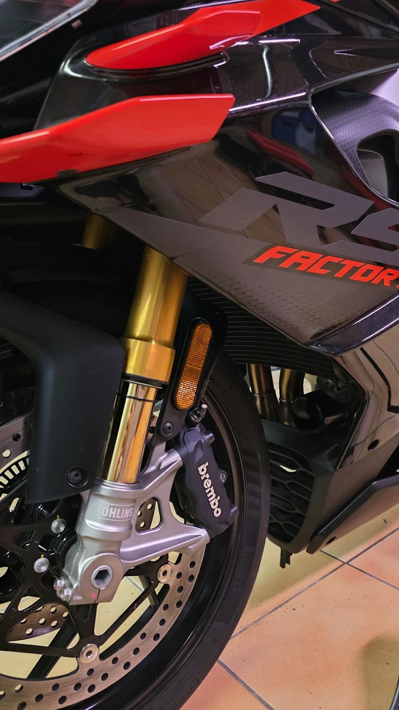
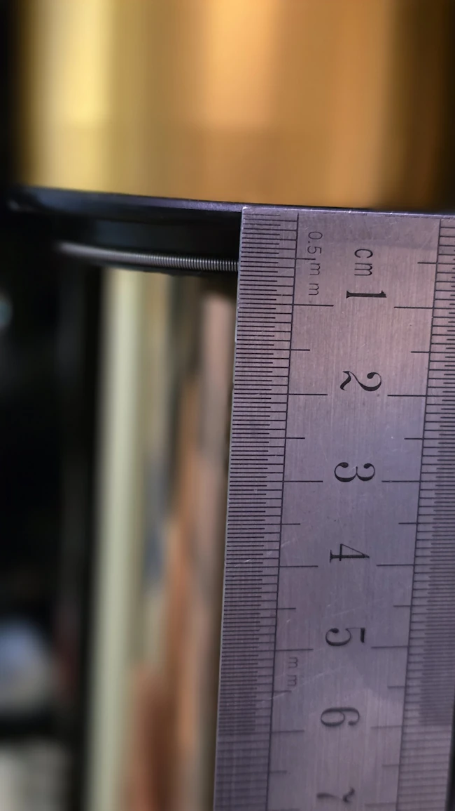
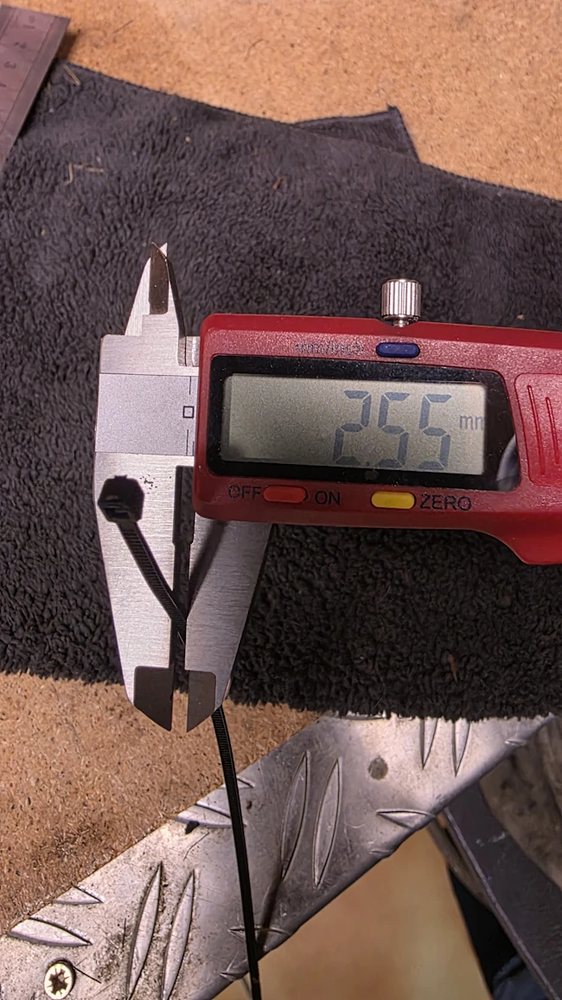
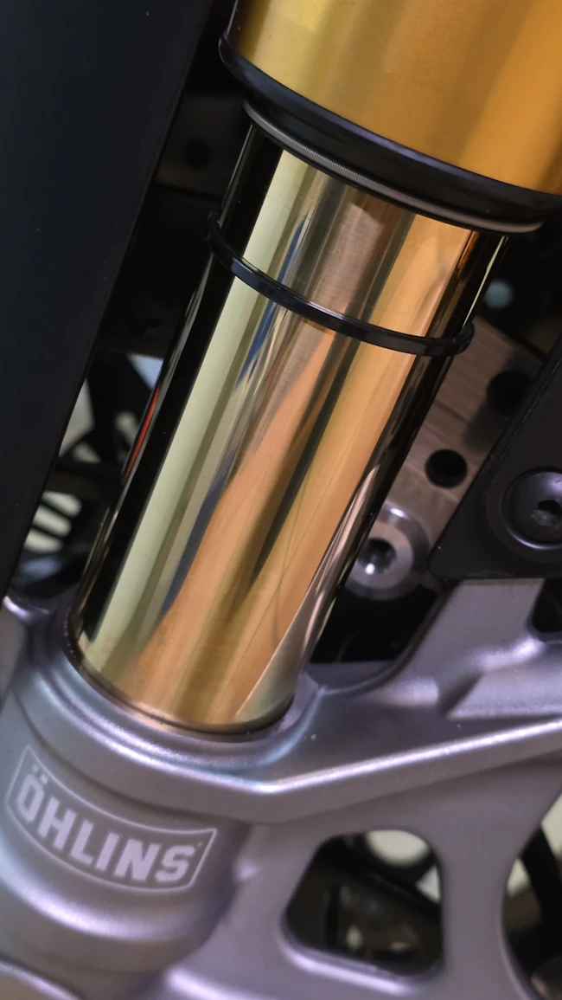
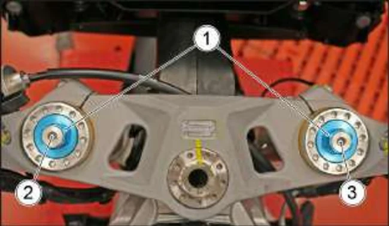
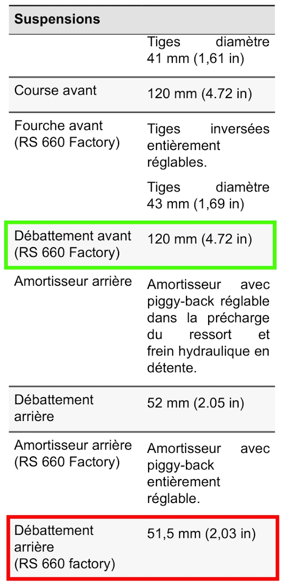

# {{ page.title }}
{: .no_toc }

{{ page.description }}
{: .lead }

<h2 align="center"><b> 🚧 This post is under construction 🚧</b></h2>

<!-- ###################################################################### -->
<!-- ###################################################################### -->
<!-- ###################################################################### -->
## TL;DR
{: .no_toc }

* Point 1
* Point 2

<figure style="max-width: 650px; margin: auto; text-align: center;">

<figcaption>TODO: Add a legend</figcaption>
</figure>

<!-- ###################################################################### -->
<!-- ###################################################################### -->
<!-- ###################################################################### -->
## Table of Contents
{: .no_toc .text-delta}
- TOC
{:toc}

<!-- ###################################################################### -->
<!-- ###################################################################### -->
<!-- ###################################################################### -->
## 0. Préliminaires

1. Vérifier que le réservoir est plein
1. Vérifier que la chaîne n'est pas trop tendue
    * Si c'est le cas, le bras oscillant ne peut pas osciller librement, la chaîne tire sur le PSB... Bref, c'est vraiment pas une bonne chose.
    * On peut en profiter pour vérifier que la chaîne est bien alignée
1. Mesurer la hauteur du joint spi de fourche. **Exemple**: $$\text{SPI} = 7 \text{ mm}$$ pour un RS 660 Factory

<figure style="max-width: 650px; margin: auto; text-align: center;">

<figcaption>Mesure de la hauteur du joint spi de fourche</figcaption>
</figure>

1. Mesurer la largeur du zip. **Exemple**: $$\text{ZIP} = 2.5 \text{ mm}$$

<figure style="max-width: 650px; margin: auto; text-align: center;">

<figcaption>Mesure de la largeur du zip. On va dire 2.5 mm</figcaption>
</figure>

1. Poser le zip sur un des tubes de fourche

<figure style="max-width: 650px; margin: auto; text-align: center;">

<figcaption>Poser le zip sur un des tubes de fourche</figcaption>
</figure>

1. Pour l'AV et l'AR retrouver dans la documentation les moyens de régler et les valeurs par défaut de :
    - Pré compression (pré-contrainte)
    - Rebond
    - Compression
    - Rebond rapide
    - Compression rapide

<figure style="max-width: 650px; margin: auto; text-align: center;">

<figcaption>Doc Aprilia. 1=précharge 2=compression (tube de droite) 3=détente (tube de droite)</figcaption>
</figure>

En fonction des motos rebond, compression, rebond rapide et compression rapide peuvent ne PAS être disponibles.

**Exemple de valeurs par défaut**: La doc Aprilia du RS660 Factory indique qu'il n'y a qu'une configuration piste et n'indique donc aucune valeur pour un usage route. Ensuite il est indiqué :
- Précharge = -5 tours depuis la position complètement serrée
- Compression = -16 clicks depuis la position fermée
- Détente = -12 clicks depuis la position fermée

1. Préparer les outils en conséquence

<!-- ###################################################################### -->
<!-- ###################################################################### -->
<!-- ###################################################################### -->
## 1. Fourche: Vérifier les réglages par défauts

### Pourquoi?:
{: .no_toc }

Pour vérifier car on sait jamais. Pour pouvoir y revenir le cas échéant.

### Comment?:
{: .no_toc }

#### **Précharge**
{: .no_toc }

1. Ouvrir (dévisser) et noter le nombre de tours de précharge sur les tubes gauche et droit
1. Fermer (visser) complètement et noter le nombre de tours disponibles
1. Ouvrir complètement la précharge sur les 2 tubes

### **Rebond (si disponible)**
{: .no_toc }

1. Ouvrir et noter le nombre de clics de rebond sur les tubes gauche et/ou droit
1. Fermer complètement et noter le nombre de clics disponible
1. Ouvrir complètement

#### **Compression (si disponible)**
{: .no_toc }

1. Ouvrir et noter le nombre de clics de compression sur les tubes gauche et/ou droit
1. Fermer complètement et noter le nombre de clics disponible
1. Ouvrir complètement

<!-- ###################################################################### -->
<!-- ###################################################################### -->
<!-- ###################################################################### -->
## 2. Déterminer la buttée de fourche (bottom out)

### Pourquoi?:
{: .no_toc }

### Comment?:
{: .no_toc }

1. Retrouver l'information dans la documentation du constructeur. **Exemple**: $$\text{FRONT\_STROKE} = 120 \text{ mm}$$ pour un RS 660 Factory

<figure style="max-width: 650px; margin: auto; text-align: center;">

<figcaption>Débattements de la fourche et de l'amortisseur dans la doc constructeur.</figcaption>
</figure>

1. Si cela n'a pas été encore fait, tout ouvrir: précharge, rebond et compression.
1. Étendre la fourche à son maximum. Faut être 2, on bascule la moto sur sa béquille latérale jusqu'à ce que le pneu AV ne touche plus terre.
1. Mesurer alors la longueur entre le fourreau et le pied de fourche (ne pas mesurer sous le joint). **Exemple**: $$\text{FULL\_EXT} = 143 \text{ mm}$$ pour un RS 660 Factory
1. Application numérique: $$\text{BOTTOM\_OUT} = \text{FULL\_EXT} - \text{FRONT\_STROKE} = 143 - 120 = 23 \text{ mm}$$

<!-- ###################################################################### -->
<!-- ###################################################################### -->
<!-- ###################################################################### -->
## 4. Mesure de la course morte (static sag, moto SANS pilote)

### Pourquoi?:
{: .no_toc }

### Comment?:
{: .no_toc }

1. Mesurer du fourreau au pied (ne pas mesurer sous le joint). **Exemple**: 115 mm pour un RS 660
1. Application numérique: $$\text{STATIC\_SAG} = 143 - 115 = 28 \text{ mm}$$
1. On veut un static sag en 15 et 25 mm (20 mm typique)
1. Avec 28 mm, la moto s'enfonce trop. Faut ajouter/fermer la précharge
1. On ferme de 4 tours
1. On mesure et on lit 118 mm.
1. $$\text{STATIC\_SAG} = 143 - 118 = 25 \text{ mm}$$
1. On touche plus à rien

<!-- ###################################################################### -->
<!-- ###################################################################### -->
<!-- ###################################################################### -->
## 4. Mesure de la précharge statique (driver sag, moto AVEC pilote)

### Pourquoi?:
{: .no_toc }

### Comment?:
{: .no_toc }

1. S'équiper: bottes, gants, casque, combine ou blouson
1. Monter DOUCEMENT sur la moto
1. Première mesure, 108 mm par exemple
1. $$\text{RIDER\_SAG} = 143 - 108 = 35 \text{ mm}$$
1. Freiner de l'avant et pomper plusieurs fois la fourche
1. Faire une mesure. **Exemple**: 109 mm pour un RS 660
    1. C'est OK si la difference est de l'ordre du mm
    1. Si y a une grande difference, faire la révision de la fourche (huile, joints...)
1. Prendre la valeur moyenne des 2 valeurs précédentes
1. Objectifs
    * Route = 35-40 mm
    * Track = 30 mm
1. Ajustements:
* Si on lit 22 mm il faut ouvrir la précharge. Si on est tout ouvert et si on atteint toujours pas la valeur souhaitée, le pilote est trop léger. Faut changer les ressorts
* Si on lit 45 mm il faut fermer la précharge. Si on est tout fermé et si on atteint toujours pas la valeur souhaitée, le pilote est trop lourd. Faut changer les ressorts

<!-- ###################################################################### -->
<!-- ###################################################################### -->
<!-- ###################################################################### -->
## 5. Mettre à jour la buttée de fourche en fonction du réglage de précharge

### Pourquoi?:
{: .no_toc }

### Comment?:
{: .no_toc }

1. Étendre la fourche à son maximum
1. Mesurer du fourreau au pied (ne pas mesurer sous le joint). Exemple: 146 mm pour un RS 660 car on a mis +3 tours de précharge
1. Application numérique:

$$
\begin{align*}
\text{BOTTOM\_OUT} & = \text{FULL\_EXT} - \text{FRONT\_STROKE} \\
\text{BOTTOM\_OUT} & = 146 - 120 \\
\text{BOTTOM\_OUT} & = 26 \text{ mm}
\end{align*}
$$

<!-- ###################################################################### -->
<!-- ###################################################################### -->
<!-- ###################################################################### -->
## 6. Calculer la limite à surveiller quand on roule

### Pourquoi?:
{: .no_toc }

### Comment?:
{: .no_toc }

1. Par exemple, on veut $$\text{MARGIN} = 10 \text{ mm}$$ avant que la fourche ne touche.
1. La distance minimale entre le pied de fourche et le base du zip est donc:

$$
\begin{align*}
\text{LIMIT} & = \text{FULL\_EXT} - \text{FRONT\_STROKE} - \text{SPI} - \text{ZIP} + \text{MARGIN} \\
\text{LIMIT} & = 146 - 120 - 5 - 2 + 10 \\
\text{LIMIT} & = 29 \text{ mm}
\end{align*}
$$

1. Il ne faut pas que le bas du zip descende sous les 29 mm

Ajustements:
* Si le bas du zip dépasse la limite (mesure inf à 29mm) il faut fermer la précharge et/ou vérifier les mesures
* Si le bas du zip reste loin de la limite on peut freiner plus fort et/ou vérifier les mesures

<!-- Link to a video -->
<figure style="max-width: 560px; margin: auto;">

    <iframe
    src="https://www.youtube.com/embed/MIeYz6aMBbk"
    title="Add a title"
    style="position: absolute; inset: 0; width: 100%; height: 100%;"
    allowfullscreen>
    </iframe>

<figcaption style="text-align: center;">TODO: Add a legend</figcaption>
</figure>

<!-- ###################################################################### -->
<!-- ###################################################################### -->
<!-- ###################################################################### -->
## Level 2 Section

Lorem ipsum dolor sit amet, consectetur adipiscing elit. Nullam luctus blandit tincidunt. Nunc et laoreet ipsum. Fusce neque nisi, blandit vitae magna nec, sollicitudin commodo felis. Morbi a viverra lorem, ut sollicitudin lacus. Pellentesque euismod magna et enim fermentum tempor. Etiam vel sagittis mauris. Praesent dictum nisl sit amet tellus rhoncus mollis. Aenean nisi nibh, tincidunt at massa eget, luctus aliquet lectus. Mauris ac massa dolor. Sed fringilla tristique est. Suspendisse nec leo et magna tincidunt ultrices. Suspendisse lacinia leo sed congue ornare. Mauris congue eu dui posuere ultricies. Duis volutpat volutpat erat, ut consequat nisl bibendum gravida. Curabitur fringilla tincidunt auctor.

<!-- ###################################################################### -->
### Level 3 Section
{: .no_toc }

Cras dui ex, scelerisque et magna et, lacinia convallis nunc. Proin sapien nunc, eleifend a mi semper, efficitur pharetra justo. Etiam sit amet ex lacinia, consequat orci sed, malesuada leo. Donec commodo felis eu commodo suscipit. Praesent vitae lorem a dui porta volutpat. Pellentesque efficitur pharetra velit, at placerat nulla iaculis in. Praesent placerat turpis sit amet mauris bibendum interdum. Sed consectetur massa lacus, tempus congue purus dictum nec.

Math inline $$x(t)$$ and, below, math offline:

$$
\frac{dS}{dt} = r \cdot S
$$

<!-- ###################################################################### -->
<!-- ###################################################################### -->
<!-- ###################################################################### -->
## Conclusion

Ensuite faut rouler et utiliser [la lecture des pneus]() pour ajuster les réglages.

<!-- ###################################################################### -->
<!-- ###################################################################### -->
<!-- ###################################################################### -->
## Webliography

<!--
https://acidmoto.ch/site/comment-bien-regler-ses-suspensions-guide-pour-comprendre-avant-de-toucher/

 -->