# Trajectoires - Ferté Gaucher 1/2

## Mises à jour
* Suite roulage du 10 juin 2023
* Billet initial 22 mai 2023

## Introduction
Les 13 et 14 mai 2023 j'étais, une fois n'est pas coutume, sur [le circuit de la Ferté Gaucher](https://www.circuitslfg.fr/). Le samedi c'était un [stage de pilotage moto] NOT YET TRANSFERED (https://www.40tude.fr/rsv4-sur-circuit-stage-du-13-05-23-lfg/) d'une journée et le dimanche un [roulage classique] NOT YET TRANSFERED (https://www.40tude.fr/rsv4-sur-circuit-roulage-du-14-05-23-lfg/). Le 14, j'ai eu l'occasion d'aller faire le tour du circuit à pied entre midi et deux. J'en ai profité pour prendre des photos et, un peu comme je l'ai déjà fait pour le [Vigeant] NOT YET TRANSFERED (https://www.40tude.fr/le-vigeant-1-3/), je vous propose de faire une présentation du circuit.

Ici il n'y aura que 2 épisodes. La division du circuit se fera entre les deux bypass qui coupent le circuit en 2 plus petits. Le "rapide" de 2 km au sud et le "technique" de 1.6 km au nord. Pour rappel, voilà ce à quoi ressemble le circuit. Il tourne à gauche, il y a pas mal de grip et par temps sec on peut rouler sur les bandes blanches et les vibreurs (même moi je le fait, c'est dire...). Ci-dessous le sud est en bas et le nord en haut. Si vous ne connaissez pas du tout le circuit, cliquez sur l'image ci-dessous. Les bypass sont autour du spot N°6.

Un dernier mot : je ne suis pas un expert, loin de là, et donc, s'il y a des trucs avec lesquels vous n'êtes pas d'accord ou si vous souhaitez apporter des compléments dites-le dans les commentaires, restez courtois et constructifs.

Afin de montrer que je ne "pipotte" pas, voilà la trace de ma "balade" relevée par ma montre. Je trouvais l'image sympa et c'est juste pour ça que je la mets ici.

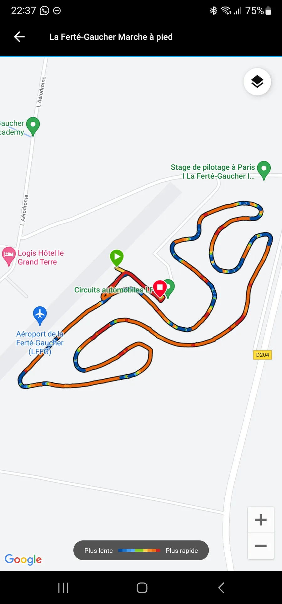

### Note

Alors que Météo-France promettait "grand bleu" le matin même... Le matin même ! La météo a été pourrie toute la journée du 14. Ils ne sont vraiment pas bons eux... . Cela explique la couleur "bizarre" du ciel et le manque de luminosité des photos. Toujours à propos des photos, normalement elles sont toutes en mode paysage et sans trop de zoom (x2 je crois). ~~Il ne faut pas hésiter à cliquer dessus pour mieux voir, zoomer et plus si affinités.~~

## Trajectoire 1/2

Allez, c'est parti. On est dans la voie des stands, on est sorti du hangar et on a tourné à droite.

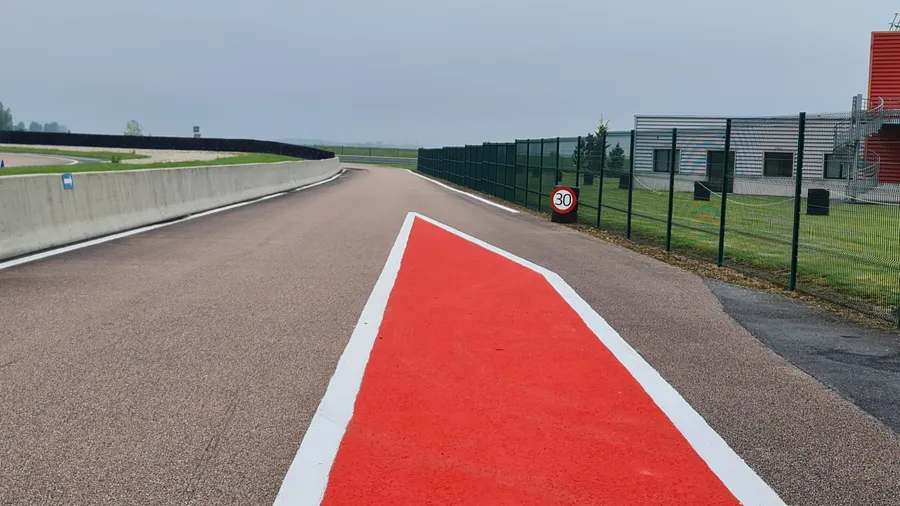

C'est limité à 30 km/h. Au bout on tourne à gauche. Attention en cas de pluie l'intérieur du virage est inondé et/ou pas très propre.

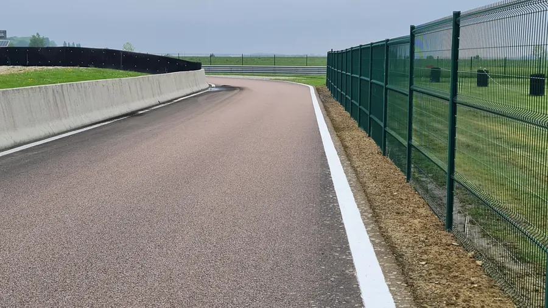

On n'est toujours pas sur la piste mais ça va y ressembler. On est sur la voie d'accès et d'accélération. **Attention**. Ceux qui sont déjà en piste arrivent à notre gauche, ils sont prioritaires et ils arrivent vite.

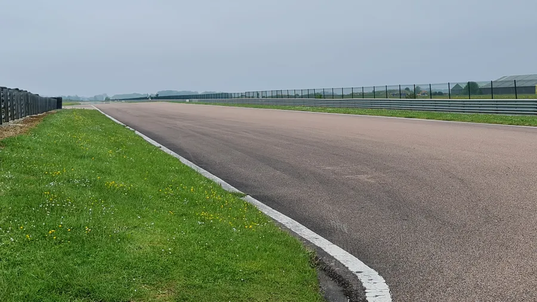

On enroule.

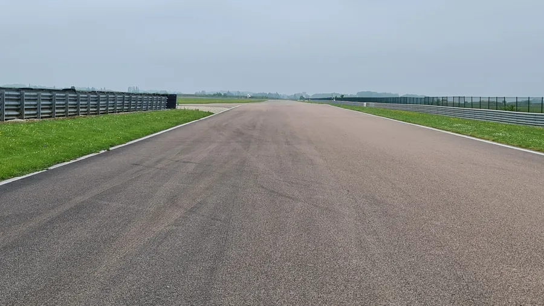

Allez, on enroule et on accélère franchement.

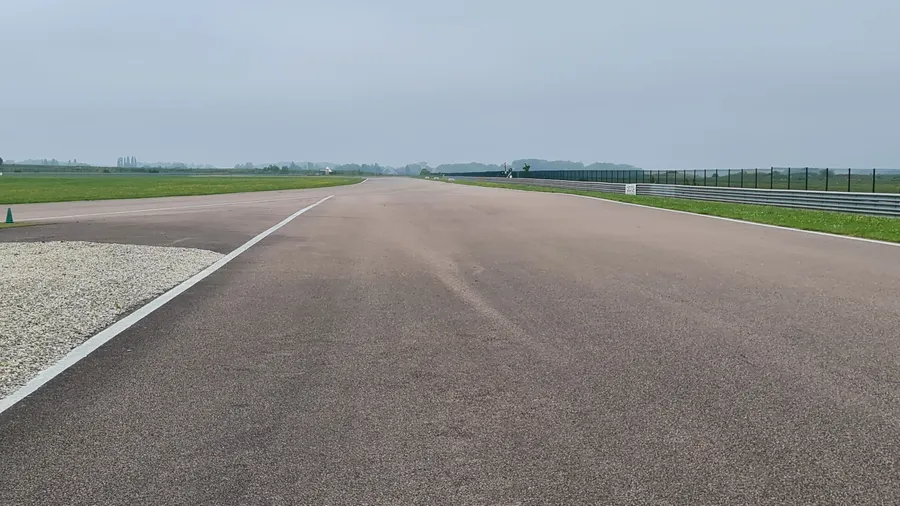

On continue d'avancer. Je tourne franchement la tête à gauche et/ou je lève mes fesses si besoin. Je me répète mais ça arrive vite à gauche.

Au sol il y a une marque de raccord de bitume. Je m'en sers comme repère pour aller me coller à droite de la piste. Au bout de la ligne droite, le premier virage tourne à gauche.

Tout de suite je fixe le panneau 150 m qui est encore un peu loin (je réalise qu'avec le zoom 2x ça ne ressemble pas vraiment à ce que l'on voit en vrai. Faudrait peut-être un zoom 3x... Je ne sais pas, je ferai mieux la prochaine fois)

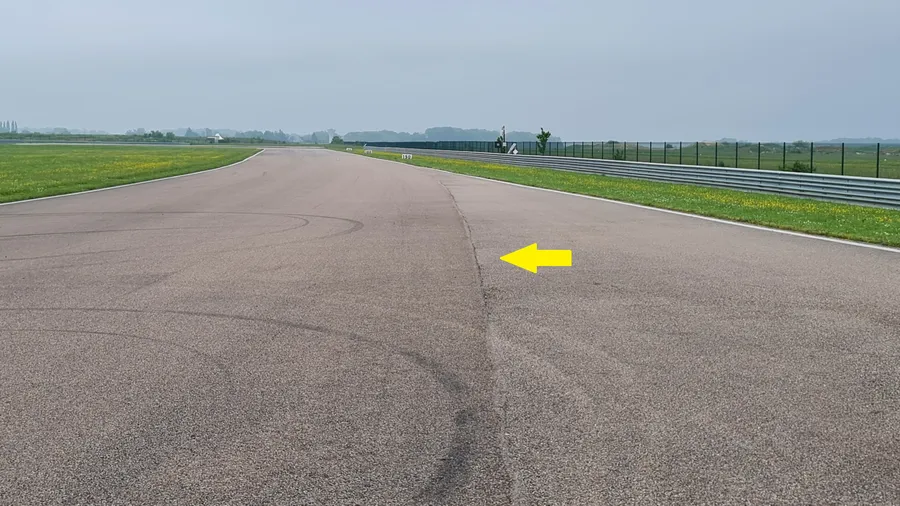

Dès que possible je vise l'arbre qui est après l'ensemble constitué par : le panneau, le poteau et le feu à droite du 150 m. L'arbre en question est entre le 150 et le 100m. Il peut servir de point de freinage (**PF**).

### Note

Sur un tour lancé je suis en 4 dans la ligne droite. Comme au bout on tourne à gauche et qu'on sort d'un virage qui tournait à gauche, j'essaie de rester avec la fesse gauche sortie. Cela dit, j'ai une fâcheuse tendance à revenir sur la selle. En fait la ligne droite n'est pas si longue que ça (400 m je crois) et donc, autant limiter les mouvements inutiles. Si besoin, relire [ce billet]() ou potasser la photo ci-dessous :

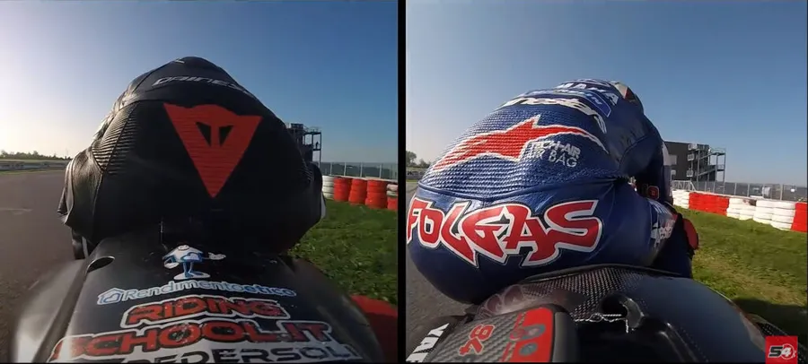

Quoiqu'il en soit, c'est de cet arbre dont je parle.

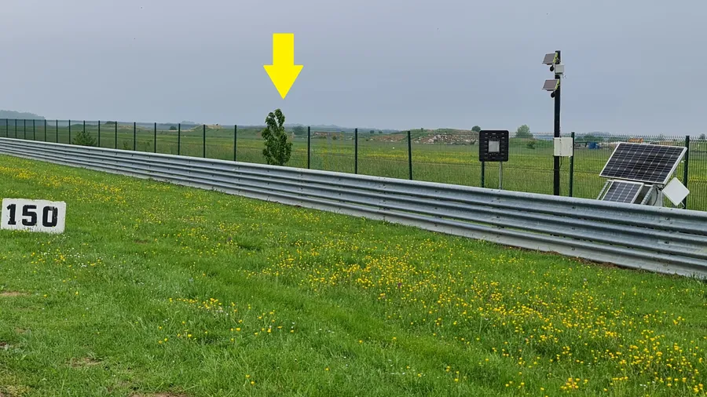

Sinon on peut choisir de freiner à 100 m. Perso, je ne freine pas encore à 100 m.

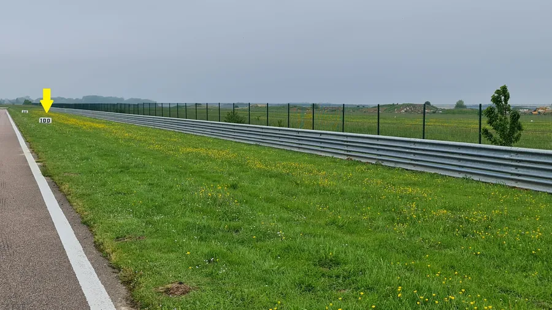

Là, je suis à la hauteur de l'arbre. Cela permet d'évaluer la distance entre lui et le panneau 100 m.

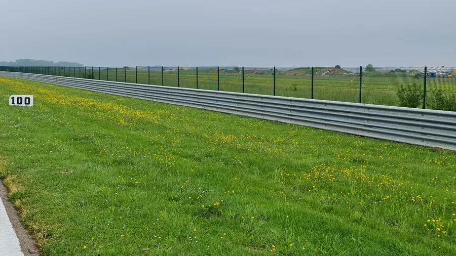

Dès que je freine je rentre 2 rapports tout de suite. Je vise avec les yeux et le menton (si, si avec le menton... Ce sera beaucoup plus important dans les virages...) le point de mise sur l'angle (**PMSA**). Il est très loin après le panneau 50 m. Il est au niveau du début du vibreur qui est à gauche de la piste. C'est pour cela que certains ont leur PF après le panneau 100 m ([Nathalie](https://www.openmutuelledesmotards.fr/?page_id=2157) a été mesurée à 87 m).

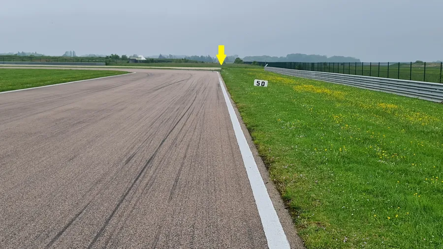

On est le long (à 1 cm 😊) de la ligne blanche, on freine, on freine on freine.

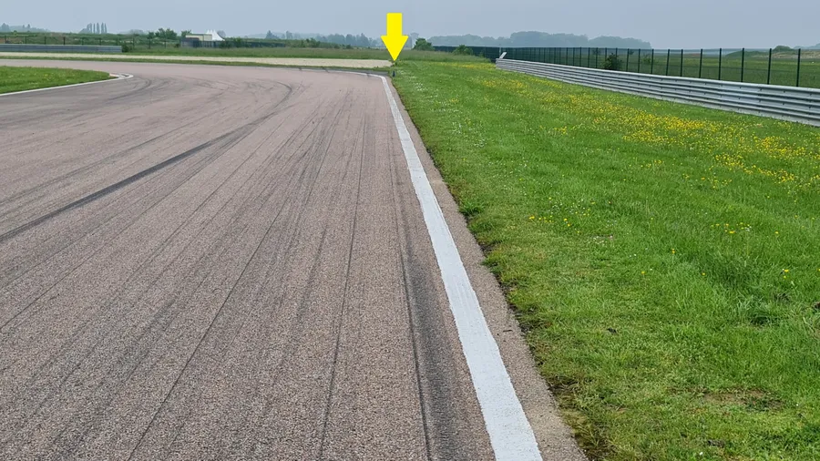

C'est bon, je sais que je vais rejoindre le PMSA matérialisé par le cône bleu. On est à quelques longueurs de motos avant le PMSA, alors que je freine toujours, je tourne la tête et je vise avec le menton le point de corde (**PC**, cône jaune)

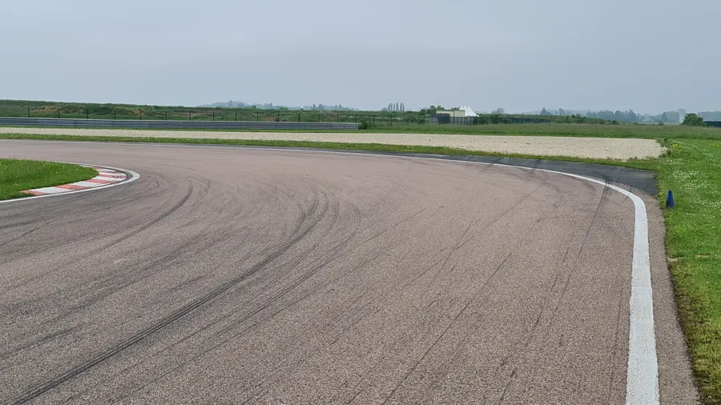

Ce dernier est assez loin. Il faut donc aller jusqu'au cône bleu, claquer la moto rapidement, la faire pivoter, rester large et ne pas plonger trop tôt à la corde si on veut mettre les roues de la moto dans la bonne direction quand on passe au point de corde.

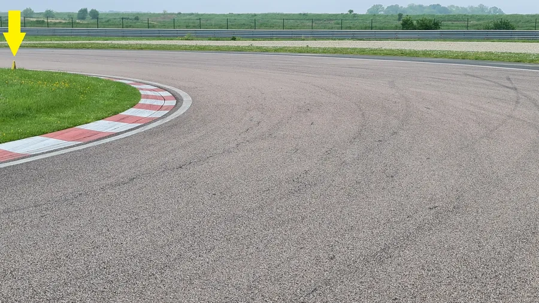

En mai 2023 il y a pas mal de traces de pneu au sol. On peut s'en servir pour rester large

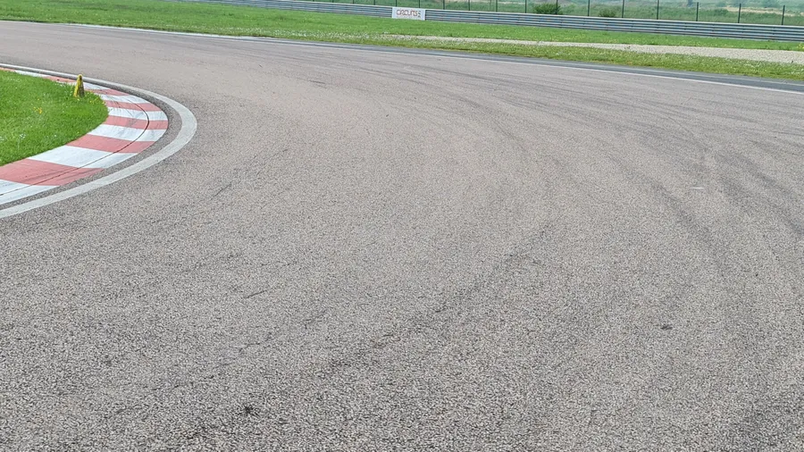

On fait virer la moto pour atteindre le PC qui est au 3/4 du vibreur. Quand je suis sûr que je vais passer sur le PC, à une distance de 2 ou 3 motos du cône jaune, je lève les yeux et le menton et j'acquiers ma prochaine cible : le PC suivant.

### Note

Quand je dis "je vais passer sur le PC" cela veut dire qu'à cet endroit-là j'aurai le corps au-dessus du vibreur ([body over the paint]()) parce que les roues seront à 1mm de la bande blanche (et dans la bonne direction). Enfin c'est l'esprit...

Ce premier point de corde est très important car il conditionne notre accélération et notre vitesse au niveau des 2 prochains PC. En effet, si on est trop large sur ce premier PC ou si on est encore en train de faire tourner la moto, on ne va pas pouvoir accélérer tout de suite, il faudra attendre puis faire basculer la moto sur une plus grande amplitude et finalement on va perdre en vitesse de pointe au bout de la petite ligne droite qui suit. Donc, désolé d'être lourd, mais au PMSA il faut rester large, claquer la moto au sol, la faire pivoter et aligner ses roues pour tangenter le PC.

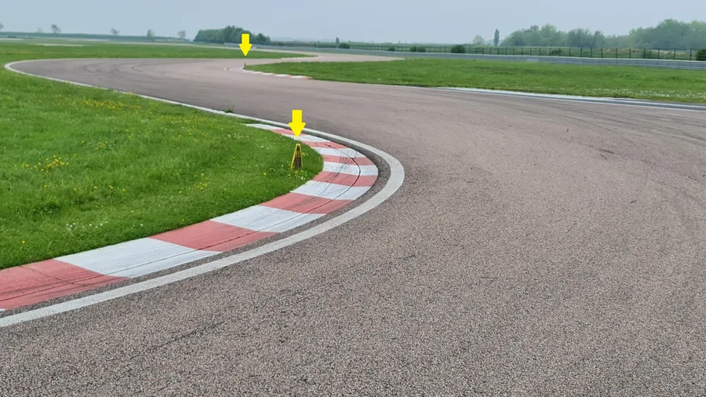

Par temps sec il ne faut pas hésiter à passer sur le vibreur et/ou entre la bande blanche et le vibreur pour tendre la trajectoire au maximum.

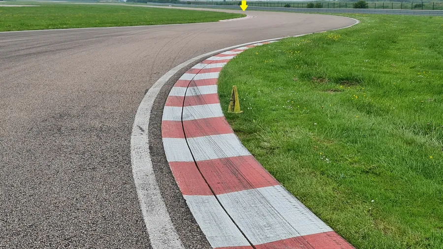

Pareil ici, il faut tendre la trajectoire, moto droite et enrouler quitte à passer entre la bande blanche et le vibreur.

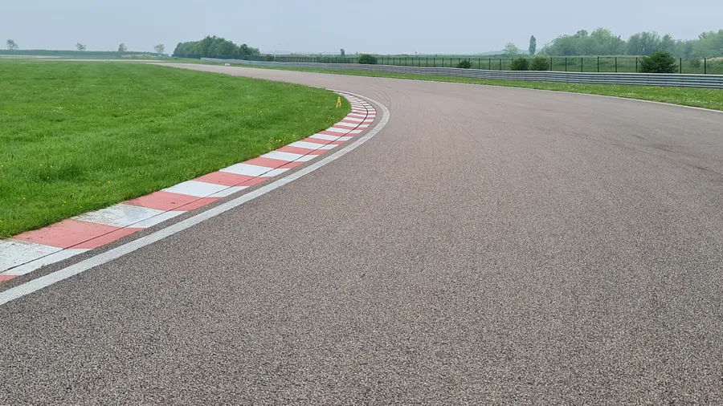

Ça va devenir une rengaine mais bon, quand je suis sûr que je vais passer sur le PC, à quelques motos de distance (j'estime les distances en "motos" car cela me parait plus facile à visualiser qu'en mètres quand on est sur piste), je lève les yeux et le menton pour acquérir le PMSA à venir.

### Remarque importante

Il faut se presenter aux PMSA en longeant la ligne blanche afin de minimiser l'angle dont on devra faire pivoter la moto. Donc quand je dis, je vise, j'acquiers, je me dirige vers le PMSA, en fait, il faut viser un point "suffisamment" en avant du PMSA qui nous permette de rejoindre ce dernier en ayant les roues parallèles à la ligne blanche. Par exemple, ci-dessous, il n'est pas productif de tirer une diagonale entre le second PC et le prochain PMSA. Il est bien plus efficace de tirer une diagonale entre le second PC et le panneau 50m (ou même avant) puis, à partir de là, de longer la ligne blanche pour rejoindre le PMSA.

Dans la photo ci-dessous, le PMSA est tout au bout, sous la flèche jaune. En fait, je pense qu'au début j'acquiers le panneau 50 m qui est plus visible puis je me verrouille sur le cône bleu.

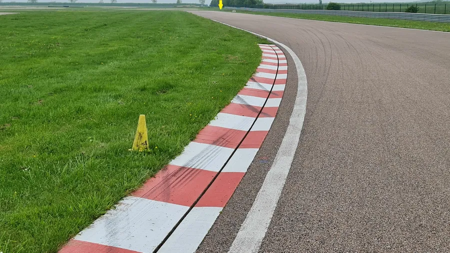

On colle la ligne blanche à droite. Y a vraiment moyen d'accélérer ici. Je passe la trois.

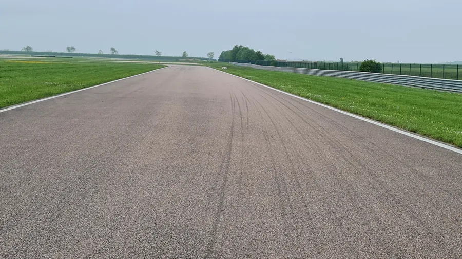

On colle, on colle, on colle pour élargir au maximum l'entrée du prochain virage. Ce dernier va se prendre en double apex (double point de corde). Le virage 3 (revoir le plan si besoin) est sans doute celui qui fait parler le plus car son décryptage n'est pas facile.

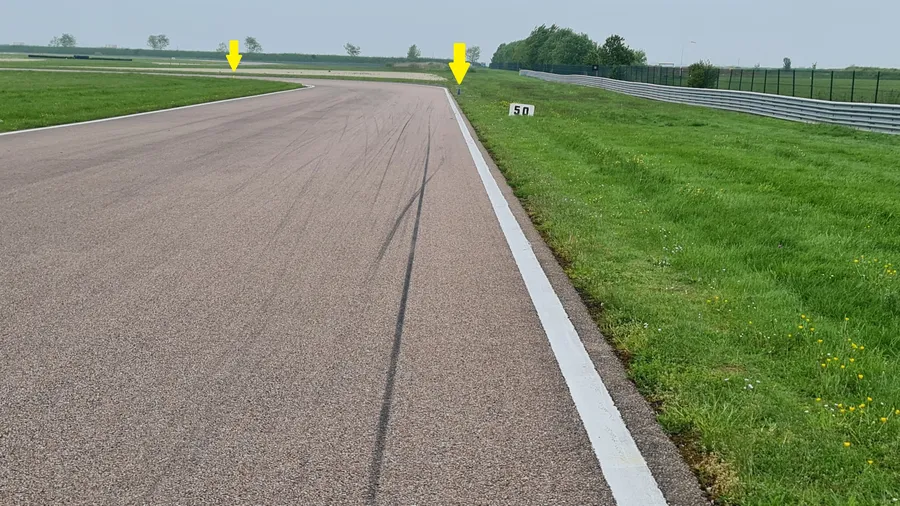

Un peu avant le 50 m, je crois que je freine et, c'est sûr, j'en rentre une tout de suite.

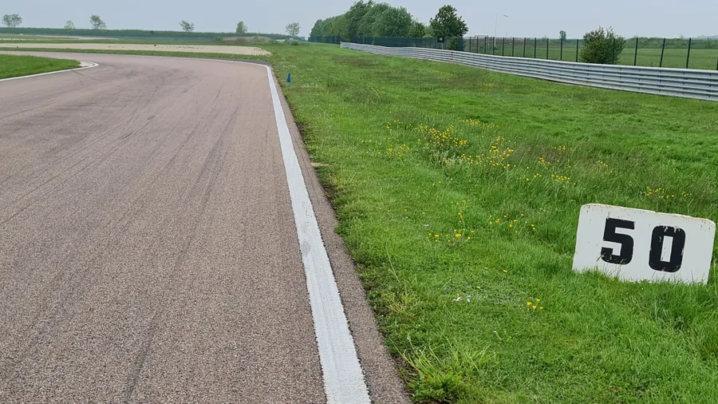

Avec le temps, les choses ont un peu évolué. Je vous propose 2 alternatives. Dernièrement j'utilise plutôt la seconde option.

1. Mon PMSA est le PMSA "officiel", le cone bleu.
1. Mon PMSA est entre le panneau 50m et le cone bleu

Quand je sais que je vais atteindre le PMSA que j'ai choisi, je vise le point de corde (PC) à venir.

**Attention**. Ici on ne claque pas la moto sur l'angle et surtout on ne se jette pas à la corde avant le cône jaune. On garde les freins et on opère un changement de direction (avec peu d'angle donc). On relâche progressivement le frein au fur et à mesure qu'on s'inscrit dans le virage et qu'on prend de l'angle.

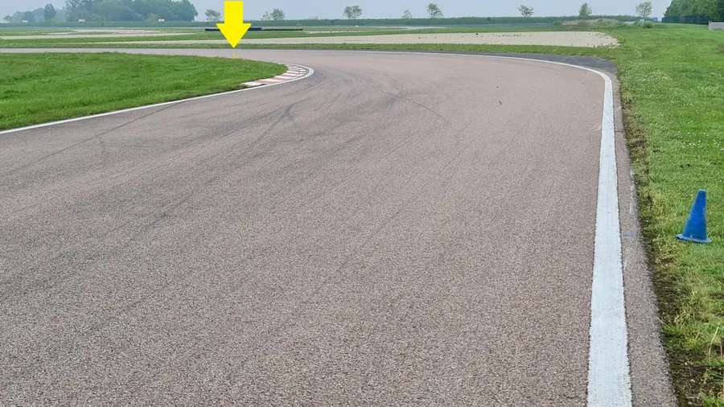

### Note

C'est pour ça aussi qu'on peut avoir de mauvaises surprises ici. Je m'explique. Tu as la bonne trajectoire, tu es à l'extérieur, tu changes de direction à partir du PMSA et tu "surprends" un gars qui te collait, qui ne connaît pas bien encore ce virage et qui avait décidé de te faire les freins en plongeant depuis le panneau 50 m vers la corde. Croisement d'effluves... C'est mal, très mal...

<!-- https://youtu.be/TAQnOzY7QXE -->

<iframe width="560" height="315" src="https://www.youtube.com/embed/TAQnOzY7QXE?si=gnSm_zT7x-XU--2Y" title="YouTube video player" frameborder="0" allow="accelerometer; autoplay; clipboard-write; encrypted-media; gyroscope; picture-in-picture; web-share" referrerpolicy="strict-origin-when-cross-origin" allowfullscreen></iframe>

OK, je sais que vais passer par le point de corde. Je lève donc les yeux et le menton pour aller chercher le prochain PMSA (bleu sous la flèche ci-dessous). Il est très à l'extérieur. Plus la cylindrée augmente et plus on devra s'en rapprocher. Avec un 1000 typiquement c'est là-bas qu'on fait pivoter la moto. Avec un R3 la courbe en V sera beaucoup moins prononcée.

Ceux qui choisissent de rester à la corde font un mauvais calcul. On en reparle dans 2 photos...

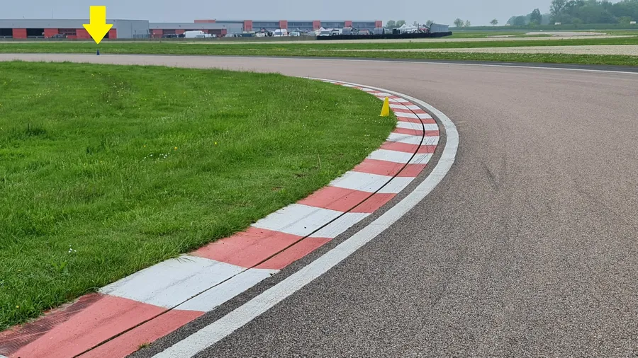

Personnellement je ne vais jamais chercher le PMSA aussi près que dans la photo ci-dessous. Je pense qu'il faut finir à 1 m.

À ce niveau je fais tourner la moto et pointant du menton et des yeux le prochain PC. Faut y aller franchement. C'est le coup de menton qui fait pivoter la moto.

Pour le reste, pas de panique si un gars de même niveau que vous essaie de vous faire l'intérieur en collant à la corde. On va se le faire au couple en sortie du virage (bien sûr, si c'est un marshal qui te fait l'inter ça va être plus tendu...)

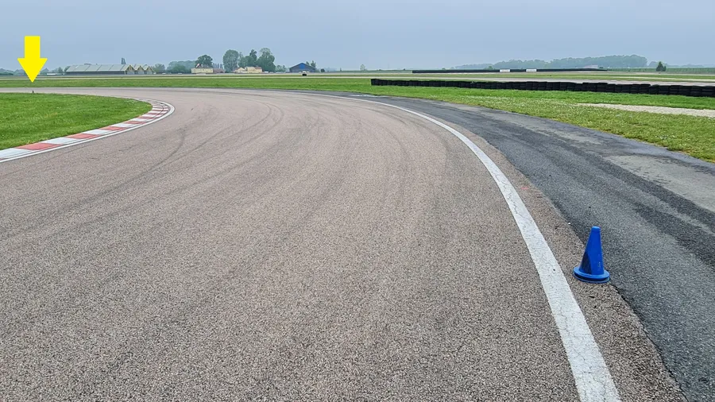

Bizarrement sur la photo c'est moins probant qu'en réalité mais, promis juré, on a ensuite une sacrée opportunité d'accélération. Si on a bien pivoté au précèdent cône bleu, les roues de la moto sont bien orientées au passage du PC. On peut accélérer largement avant celui qui nous faisait l'intérieur et qui, plein angle, à la corde, va devoir attendre après le point de corde avant de pouvoir enrouler. C'est pour ça qu'à niveau équivalent, on se le fait à l'accélération à la sortie (c'est d'autant plus vrai que les cylindrées sont importantes). Cependant cela sous-entend qu'on n'est pas timide est qu'on est gaz au PC. Il n'y a pas de risque car les roues sont dans la bonne direction, on a commencé à enrouler, la répartition sur les pneus est idéale (40% AV et 60% AR) et plus on relève la moto, plus on peut accélérer fort.

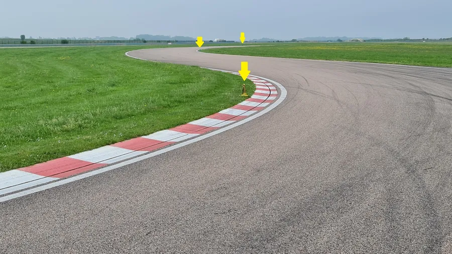

Faut vraiment avoir le "**wouaap effect**" ici car cette accélération conditionne notre vitesse d'entrée dans le prochain virage dont le PMSA est sous la flèche jaune la plus éloignée des deux. Trop souvent ça accélère "mou" ici... Non, non, faut y aller. Y a moyen de doubler à l'accélération et au freinage juste avant le virage.

On tire tout droit vers le PMSA en accélérant fort et on passe "ras les miches" du premier cône. Je suis toujours en 2. Faut vraiment voir cette section du circuit comme une ligne droite. Allez, gaaaz!

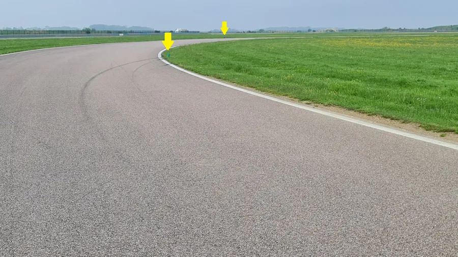

Le PMSA est hyper loin. De toute façon j'ai toujours l'impression que les PMSA sont toujours très/trop loin. Je pense que c'est lié au fait que mes mises sur l'angle se font beaucoup trop lentement. Ma faute, ma très grand fôte 😊

### Note

Compte tenu de ce que j'ai dit précédemment à propos de l'approche des PMSA, je réalise que la photo n'est pas prise au bon endroit. Dans la réalité je suis beaucoup plus à gauche.

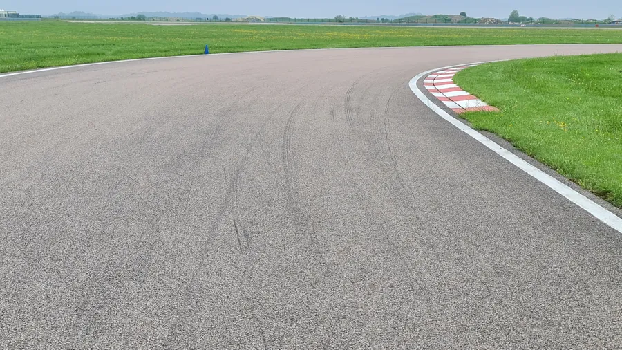

On approche... Idéalement j'essaie de passer entre la bande blanche et les marques noires sur la piste. Quand je sais que je vais atteindre le PMSA je tourne franchement la tête pour viser avec le menton et les yeux le prochain point de corde qui est très loin. La moto pivote, j'ai le genou au sol.

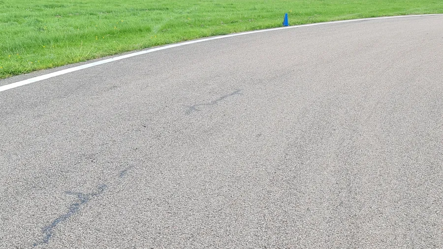

Le PC est loin, très loin. Donc on reste large, très large et on reste patient dans la zone neutre. C'est aussi pour ça qu'il faut de la vitesse en entrée car sinon on a plus d'élan et on est obligé d'accélérer trop tôt alors qu'on est encore plein angle avec les roues dirigées vers l'herbe à l'extérieur du virage (jamais une bonne idée ça...).

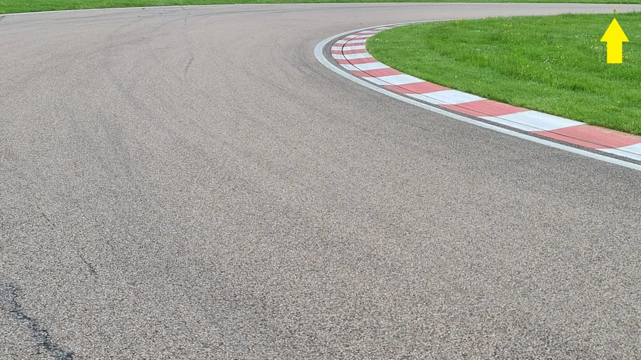

Ça va venir, ça va venir... Le point de corde se rapproche. Je reste patient. Si je suis un poil trop large, je peux faire l'effort d'abaisser encore la tête. Pas possible d'utiliser ici la pédale de frein AR pour resserrer le virage car on tourne à droite. Si tout est OK je commence à enrouler. Pas de filet de gaz. Je commence à enrouler. C'est imperceptible au début puis au fur et à mesure que je redresse la moto en m'approchant du PC j'enroule de plus en plus vite.

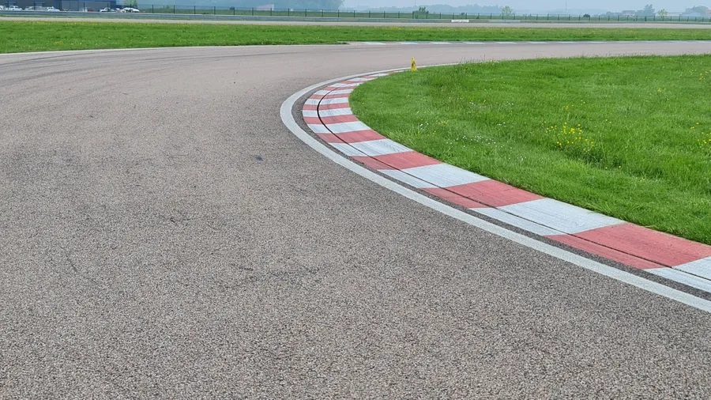

Je sais que je vais passer sur le point de corde donc... Je lève les yeux et le menton vers le point de sortie (PS) au bout du vibreur à l'extérieur.

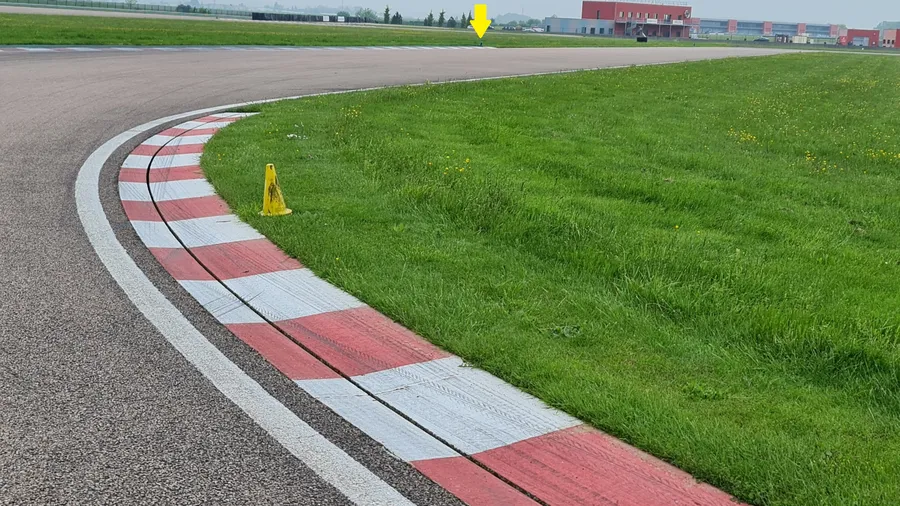

Au point de corde j'accélère franchement ("wouaap effect"). On devrait être 100% gaz au PC car avec l'inertie du moteur il sera 100% dans les tours après le point de corde alors que la moto est de plus en plus verticale.

Avec l'accélération la moto va se déporter naturellement vers la gauche. Je tire sur le bracelet intérieur pour aider la moto à se relever plus vite ([contre braquage] NOT YET TRANSFERED (https://www.40tude.fr/pilotage-moto-06-contre-braquage-en-sortie-de-virage/)). Si cela ne te parle pas, "repousse" la moto en tendant bien ton bras gauche au-dessus du réservoir (ça revient au même en fait). Je garde bien la tête en bas, à l'intérieur du virage et le corps à droite pour pouvoir accélérer fort. Je ne remonte pas sur la selle car le prochain virage tourne encore à droite.

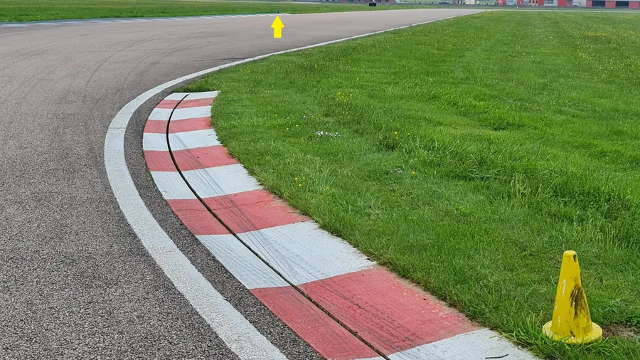

On accélère et je laisse mon pied sous le sélecteur. Tout va bien on a le prochain PMSA en ligne de mire. Perso je ne passe pas encore la 3 avant le prochain PMSA (je ne dois pas accélérer assez fort).

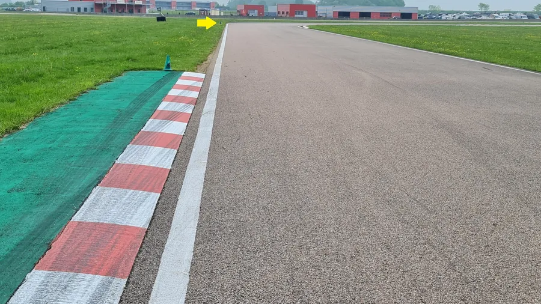

Pas ou peu de frein ici. Le frein moteur peut suffire. Faut de la vitesse en entrée car à accélération identique, c'est celui qui est le plus vite au début qui sera le plus vite à la fin...

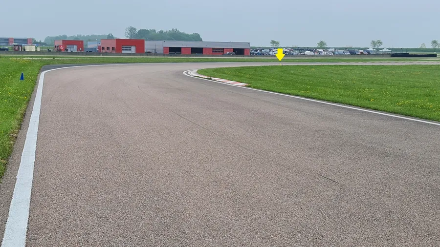

Allez, soit rapide et dynamique lors de la mise sur l'angle car la vitesse au bout de la longue parabolique à venir est critique pour le chrono (y a vraiment de gros gros gains à faire ici). Je sais où je suis, je pointe du menton et des yeux le point de corde.

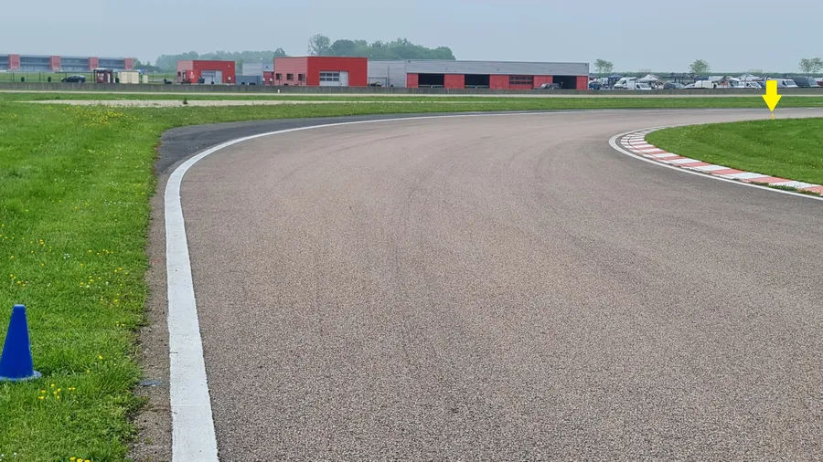

Genou au sol (pour moi c'est le signe que j'ai de la vitesse en entrée) je me dirige vers le point de corde mais j'acquiers déjà le point de sortie.

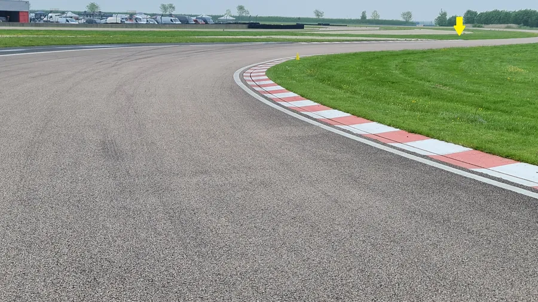

Accélération franche au point de corde.

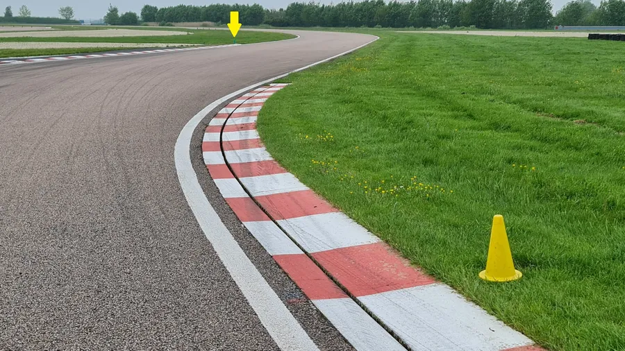

Avec l'accélération, la moto se déporte à gauche. Attention, là, il y a du boulot... Lors du changement d'angle, au moment où la moto est verticale, je passe un rapport de plus ([short shift] NOT YET TRANSFERED (https://www.40tude.fr/pilotage-moto-10-short-shift/), je passe en 3). Je mets ensuite mon pied gauche en position haute sur le cale-pied. J'angle la moto à gauche, je colle à la ligne et j'enroule. Idéalement il faut faire tout ça alors que le corps passe de droite à gauche sans s'arrêter pour s'assoir sur la selle. Mouai... En ce qui me concerne il y a encore du boulot ici...

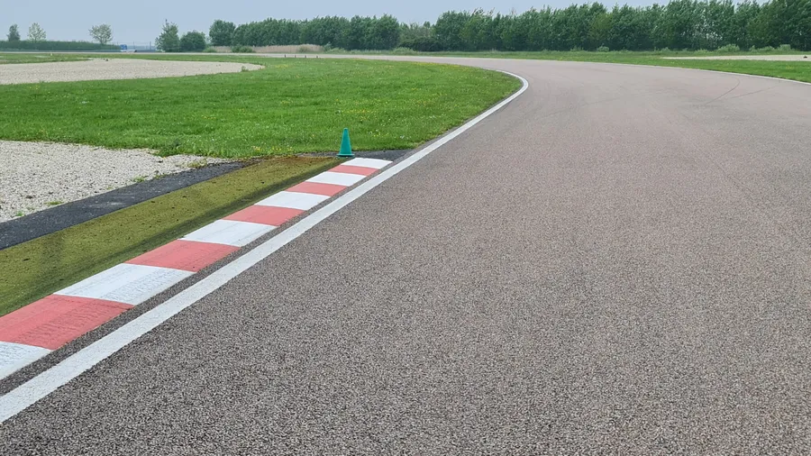

Et là... C'est la misère. Je me cale tant du point de vue de la position que de la vitesse, je n'enroule plus et je n'avance pas. Je me fais régulièrement doubler dans la parabolique.

### Note

Au secours ! Donnez-moi un conseil. J'avais tendance à ne PAS monter de rapport avant d'attaquer la parabolique. Typiquement je passais la 3 dans la parabolique. On m'a conseillé de plutôt passer la 3 lors de l'accélération avant la parabolique puis la 4 dans la parabolique. L'idée c'est qu'en 4, à ouverture de gaz identique je vais gagner des km/h par rapport à ce que je pouvais avoir en 3 ([short shift](https://www.40tude.fr/pilotage-moto-10-short-shift/)). J'ai essayé mais ça n'a pas été extraordinaire. Par exemple au panneau 50m qui arrive, j'ai un peu de mal à rétrograder en ayant de l'angle etc. Je veux bien un avis...

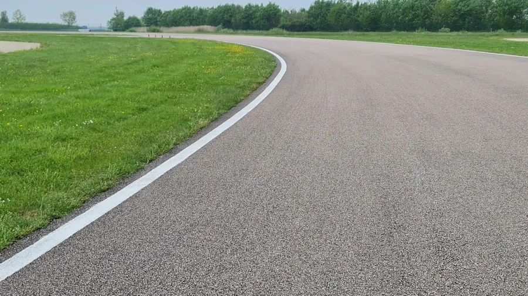

Et on arrive au premier bypass du circuit. Pour l'instant on reste le long de la ligne blanche mais bon, c'est déjà la fin de cette première partie.

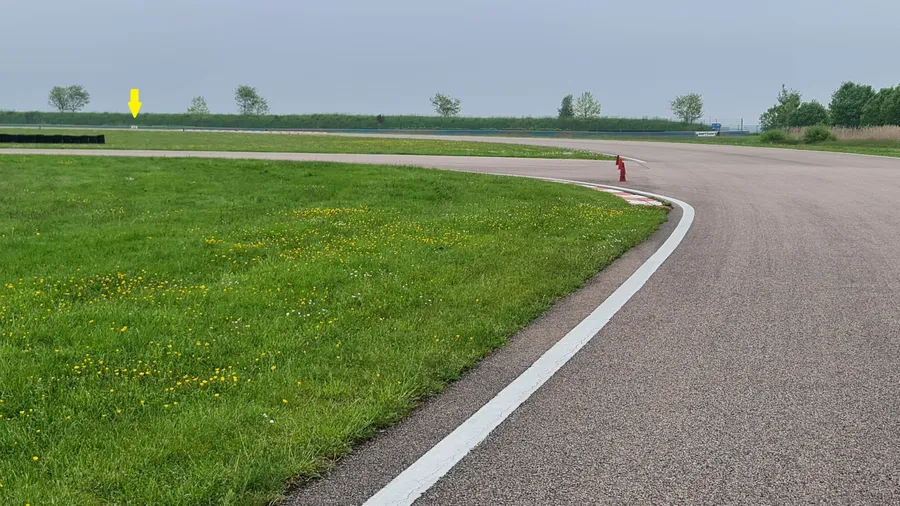

La [seconde partie]() du circuit est ici.

Sinon j'aime bien cette vidéo. Le mec est super propre sur les trajectoires et ça à l'air tellement facile devant un écran. J'adorerai être capable de rouler comme ça.

<!-- https://youtu.be/1uPDnXCMEJg -->

<iframe width="560" height="315" src="https://www.youtube.com/embed/1uPDnXCMEJg?si=83SYHdhaBjMk-zsx" title="YouTube video player" frameborder="0" allow="accelerometer; autoplay; clipboard-write; encrypted-media; gyroscope; picture-in-picture; web-share" referrerpolicy="strict-origin-when-cross-origin" allowfullscreen></iframe>

Il y a aussi celle-ci. Dans la parabolique on voit bien qu'il est en 4, là où il rentre la 3 (avant le 50 m) et la façon de lier entre eux la fin de la parabolique et le pif (on va en parler dans le second épisode). Y a d'autres trucs à prendre dans le reste du circuit...

<!-- https://youtu.be/ATbZfWwVQiA -->

<iframe width="560" height="315" src="https://www.youtube.com/embed/ATbZfWwVQiA?si=3S-eW6VRI_wHGSdX" title="YouTube video player" frameborder="0" allow="accelerometer; autoplay; clipboard-write; encrypted-media; gyroscope; picture-in-picture; web-share" referrerpolicy="strict-origin-when-cross-origin" allowfullscreen></iframe>

Bon, allez, la suite au prochain numéro. D’ici-là relisez les [notes de pilotage]() ou faites des squats afin de préparer les prochains roulages

<!-- https://youtu.be/TIhtpItTuxc -->

<iframe width="560" height="315" src="https://www.youtube.com/embed/TIhtpItTuxc?si=qL84DxP-ejd_Yi4-&amp;start=53" title="YouTube video player" frameborder="0" allow="accelerometer; autoplay; clipboard-write; encrypted-media; gyroscope; picture-in-picture; web-share" referrerpolicy="strict-origin-when-cross-origin" allowfullscreen></iframe>

