# La Ferté Gaucher 2

Si besoin, la [première partie]() du tour du circuit de la Ferté Gaucher est ici.

Dans ce billet on va parler de la partie Technique, le 1.6 km qui est au nord (en haut dans le plan ci-dessous)

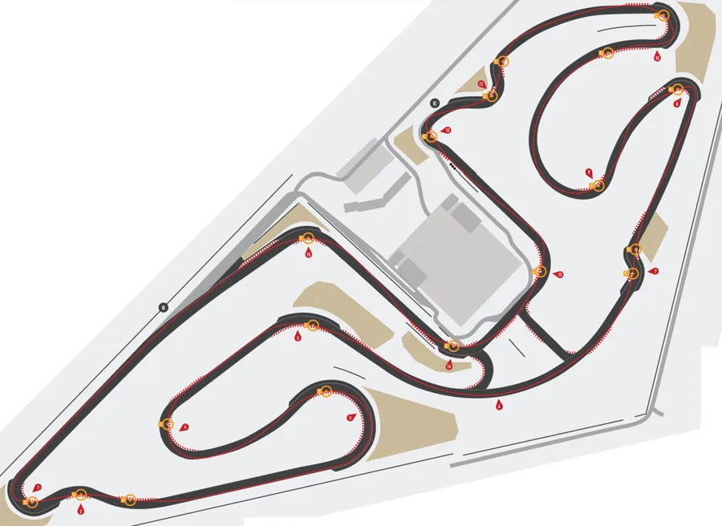

Pour rappel... On est dans la parabolique (voir le spot N° 6 sur le plan ci-dessus), le long de la ligne blanche, on est en 3 (ou en 4), on vient de passer le premier bypass, on se dirige vers le second et on a le panneau 50 m dans notre viseur (flèche jaune ci-dessous).

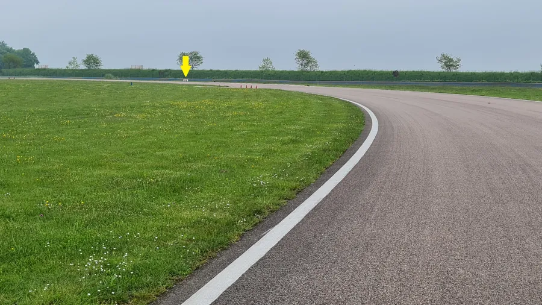

On longe, on longe... Un peu plus loin que le 50 m on trouve le PMSA. Le cône bleu sur l'herbe verte n'est pas très facile à retrouver mais bon c'est pareil pour tout le monde.

Quand on passe le second bypass on s'écarte de la ligne, on ne relève pas complètement la moto. On lui laisse de l'angle. Le truc ici est de faire en sorte de lier entre eux la fin de la parabolique et le pif de la chicane à venir. Idéalement, sur papier il ne devrait y avoir qu'un seul coup de crayon. C'est ça qu'il faut garder en tête. Une et une seule courbe. "Une seule courbe pour les gouverner tous".

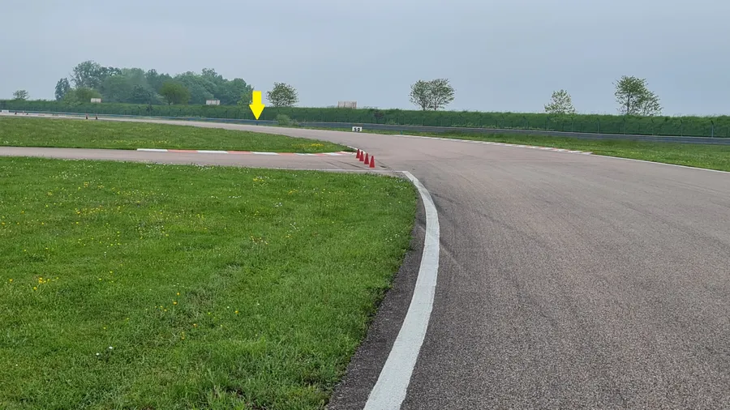

On garde de l'angle, on se dirige vers le PMSA et si besoin, on rentre la 4 avant le 50 m. Il faut se faire confiance et élargir. En ce qui me concerne j'essaie de viser un point "un peu avant" le PMSA histoire d'avoir mes roues parallèles à la ligne blanche quand je suis sur le PMSA et réduire l'angle dont je dois faire pivoter la moto.

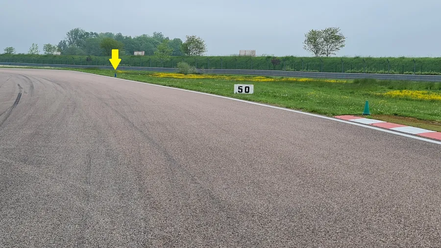

On acquiert le point de corde avec le menton et les yeux. Allez, ne fais pas ton timide, continue à t'approcher du PMSA pour élargir l'entrée du pif. Au PMSA on angle la moto.

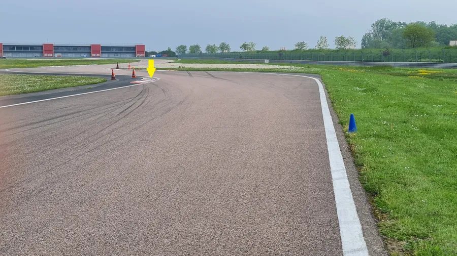

Je vise la rigole noire en plein milieu du vibreur. Si le temps est sec ça passe tranquille.

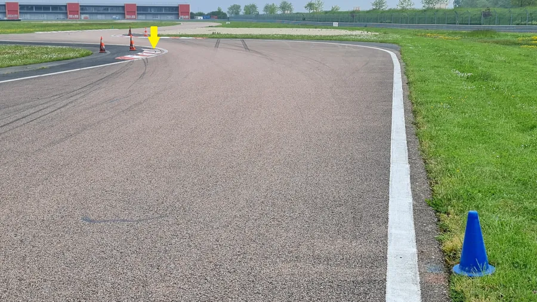

Les choses se précisent. Je me prépare à être [incisif sur mes appuis] NOT YET TRANSFERED (https://www.40tude.fr/pilotage-moto-08-pif-paf/) pour faire basculer la moto dans le paf.

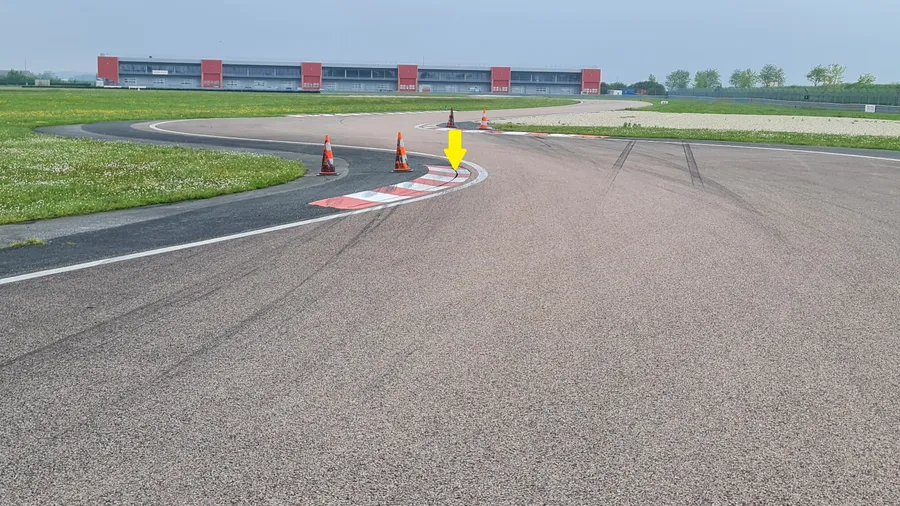

On passe là, sur la rainure noire, au niveau du cône.

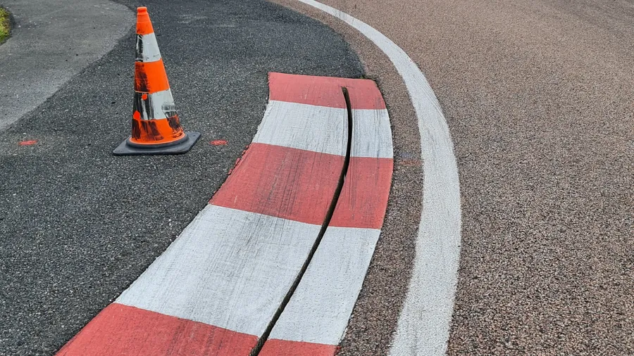

Dans le pif, je vise le PS qui est au bout du vibreur à gauche. Je ne m'occupe pas trop de ce qu'il y a entre lui et moi. En revanche accélère fort (wouaap effect) alors qu'on est entre le pif et le paf. Ici aussi y a moyen de gratter des collègues tant à l'accélération qu'au freinage.

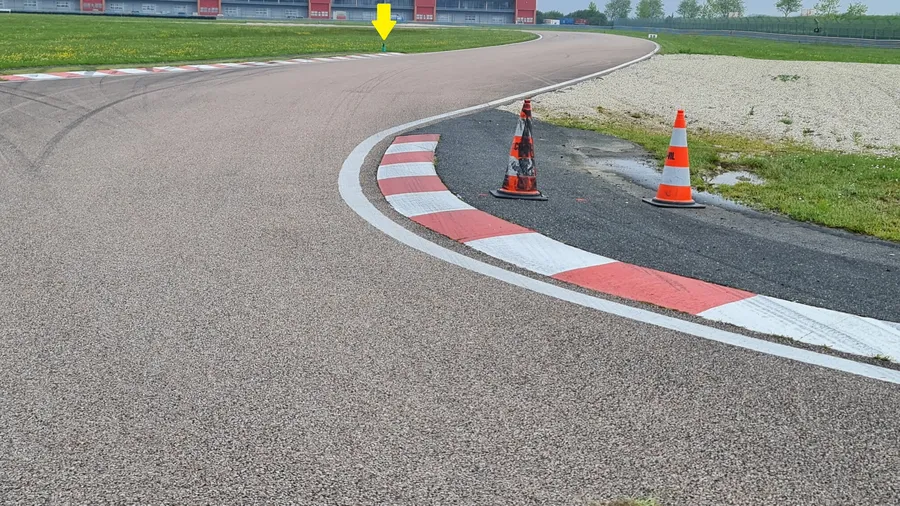

Quand je suis sur le point d'atteindre le PS, je vise le prochain PMSA (sous la flèche jaune, tout au fond). Si au niveau du PS, je peux éviter d'être sur le vibreur c'est plus efficace. En effet le prochain PMSA va arriver vite. Si on veut que les roues de la moto longent la ligne blanche à droite avant d'y arriver, il vaut mieux éviter d'avoir à traverser toute la piste. Donc sortie mi-piste, 100% gaz c'est bien.

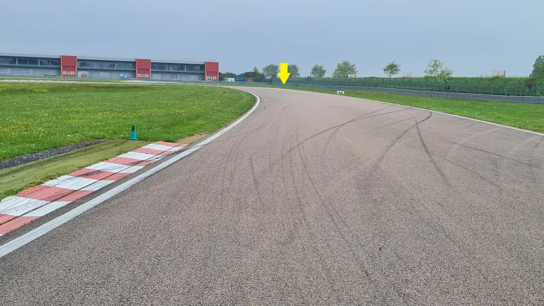

Au niveau du point de freinage c'est, pour moi, encore un peu la misère...

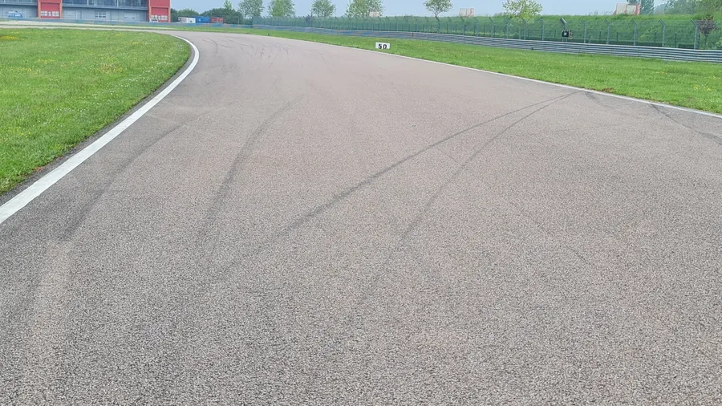

Mais... Mais il y a une bande noire qui traverse la piste un peu avant les 50 m. Pour être honnête j'ai un mal de chien à la retrouver systématiquement quand je roule (alors que lorsque je fais le tour à pied ça va 👣).

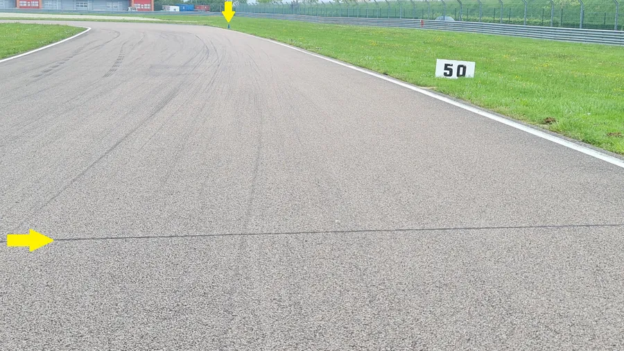

On freine et on rentre la 3 tout de suite. On freine, on freine pour atteindre le PMSA en seconde. Il est grand temps de viser avec le menton et les yeux le prochain PC.

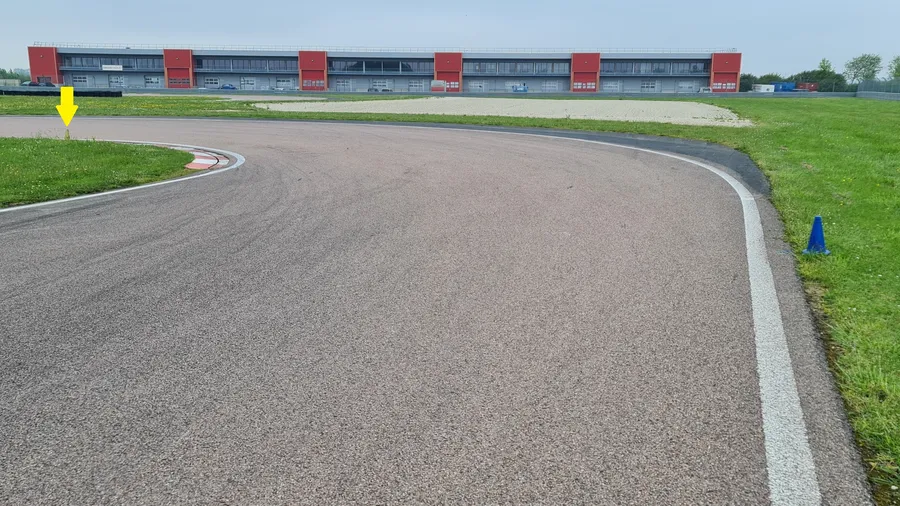

C'est une épingle ou presque. Le PC est donc très loin, au 3/4 du vibreur intérieur. Il faut donc rester large et remettre un coup de menton pour bien faire tourner la tête, les épaules et faire pivoter la moto.

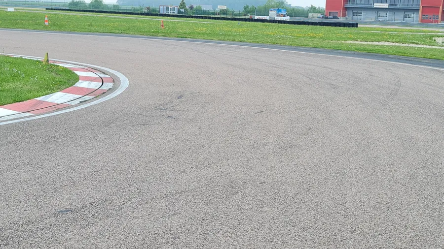

Quand je sais que je vais passer sur le PC, je ne l'oublie pas mais il sort de mon champ de vision et j'acquiers le PS au bout du vibreur à l'extérieur.

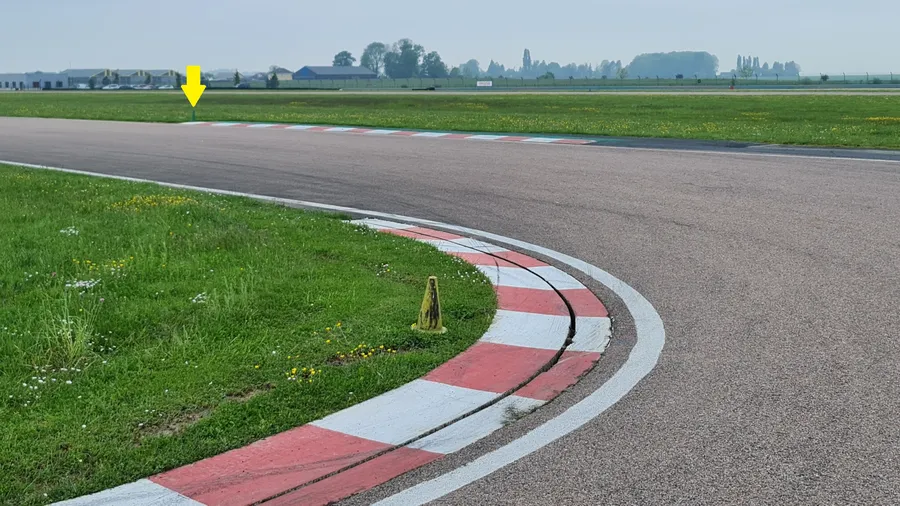

Là, il faut faire l'effort d'utiliser toute la piste en sortie pour pouvoir mettre du gaz plus longtemps et augmenter notre vitesse d'entrée dans le prochain virage. Donc gaz au PC, on laisse la moto s'écarter naturellement vers le vibreur, on garde la tête sortie, en bas à l'intérieur, on tire sur le bracelet intérieur et on en remet une louche pour faire bonne mesure.

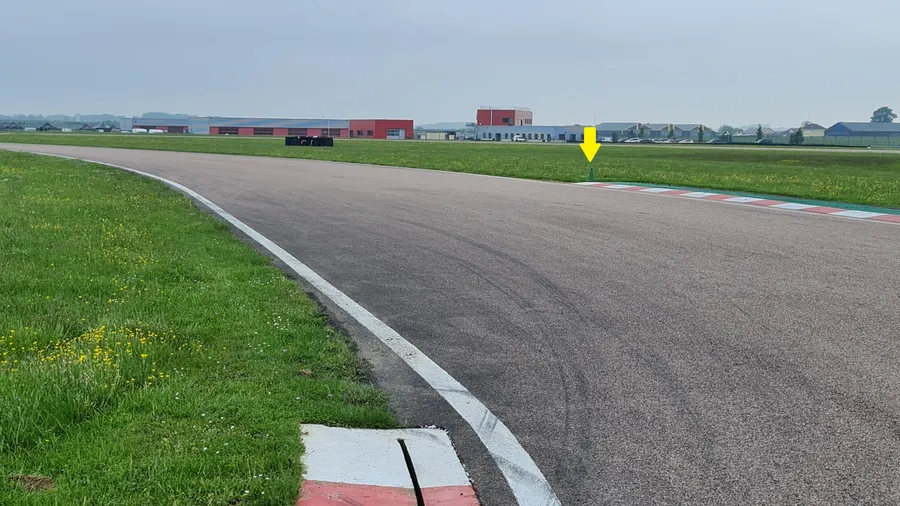

On doit bénéficier du "wouaap effect" ici aussi car quand je relève le menton, les yeux et la moto j'acquiers le prochain PMSA et je vois qu'il y a effectivement un petit bout de ligne droite dont on peut tirer parti.

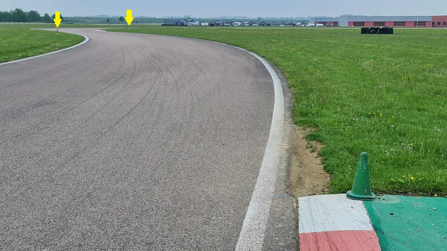

J'anticipe aussi, très en avance de phase, le premier point de corde à venir. Autrement dit, je vise un peu avant le prochain PMSA mais je vois déjà le PC. Je regarde "large", j'anticipe. J'espère que ce que je dis fait sens.

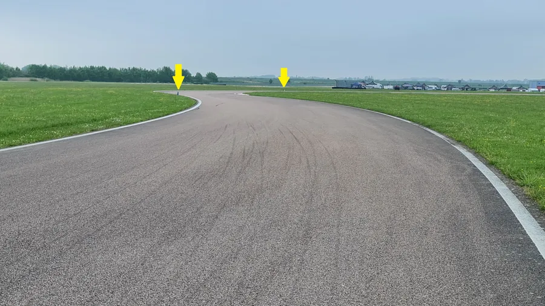

Quand j'arrive sur le PMSA en longeant la ligne blanche, j'ai un peu tendance à être obnubilé par la pointe que présente le vibreur à droite. Je pense que c'est une erreur et qu'il faudrait aller vers le PMSA, rester large (à gauche des traces de pneus par exemple) et ne toucher le vibreur qu'au niveau du PC.

### Note

Si un expert peut apporter une confirmation/infirmation à propos de la "pointe" du vibreur dans les commentaires je suis preneur.

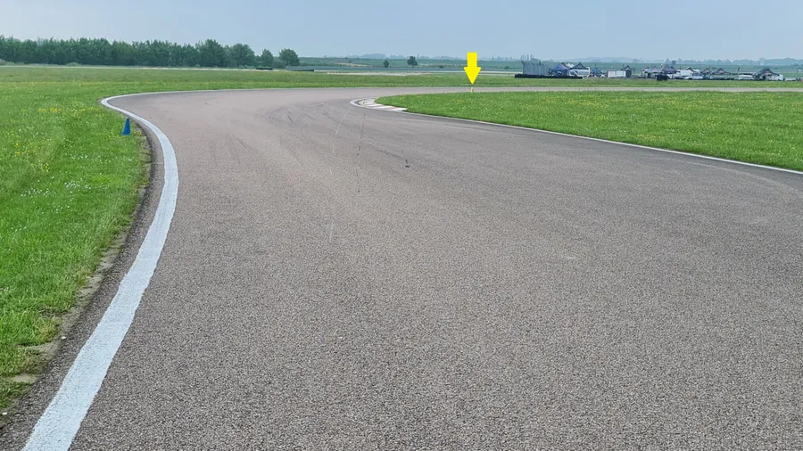

Comme le point de corde est loin derrière la pointe que présente le vibreur, j'ai tendance à me laisser attirer par cette dernière. J'espère qu'on voit bien de quoi je veux parler ci-dessous.

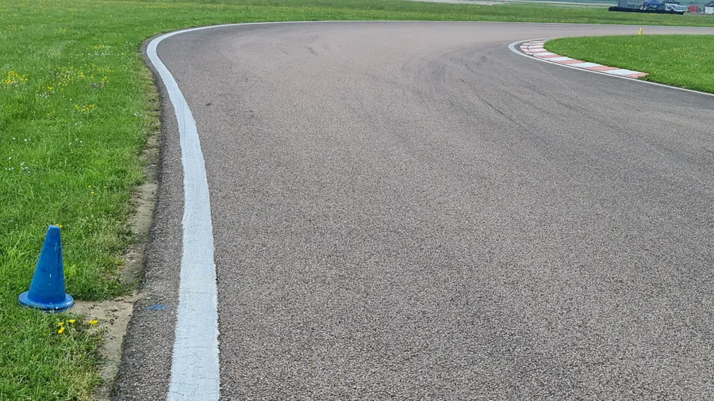

J'ai vu des pilotes rapides et propres prendre la corde au niveau de la pointe plutôt qu'au niveau du cône qui est à la fin du vibreur. Du coup je suis un peu dubitatif et un avis serait le bienvenu.

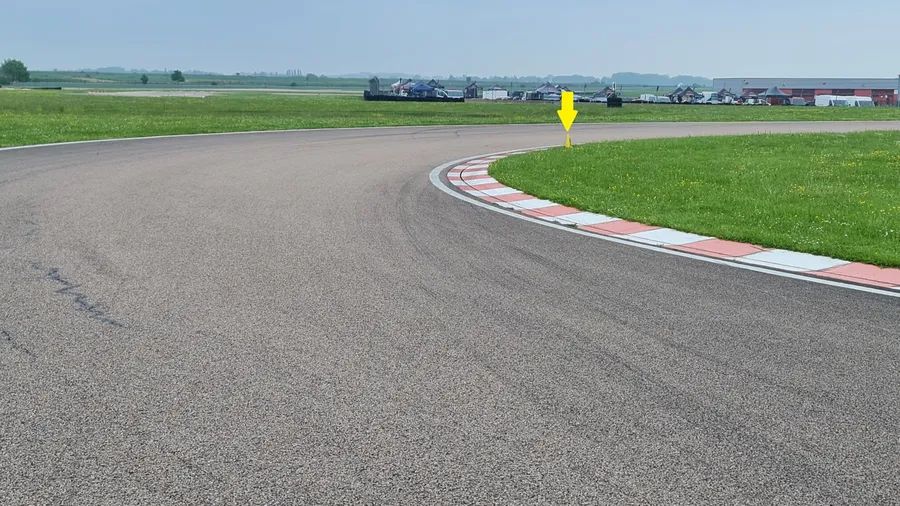

En ce qui me concerne les choses ont évoluée du côté de la trajectoire. Dorénavant, j'angle la moto au PMSA, je rejoins le PC et à partir de là, j'enroule, sur l'angle, je m'écarte de plus en plus jusqu'à rejoindre un point un peu avant le prochain PMSA sur lequel je vais passer avec les roues qui longent la ligne blanche et la moto quasi verticale. Ci-dessous je vois le cône jaune à l'extérieur et je m'en sers comme d'un repaire pour estimer la largeur de piste.

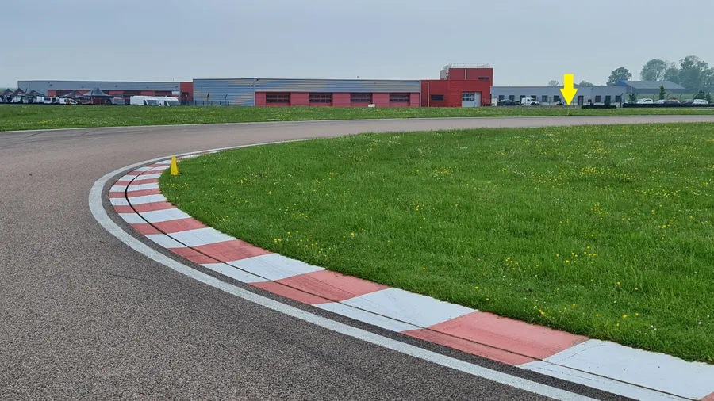

Le point à l'extérieur est loin, très loin. Il y a de la largeur de piste. Il faut se faire confiance, accélérer au point de corde, laisser la moto partir à l'extérieur. C'est tellement facile à dire derrière un clavier...

Ah oui, j'allais oublier. Bien sûr, en plus, il faudrait passer la 3 un peu en avance (short shift) pour se faire tracter, au couple, dans le reste du virage. Idéalement à la fin du vibreur ci-dessous. Je n'y arrive pas à tous les coups et à mon niveau ça complique l'arrivée à l'épingle qui suit car outre le freinage un peu "touchy" il faut rentrer la 3. Bref, j'ai encore du boulot...

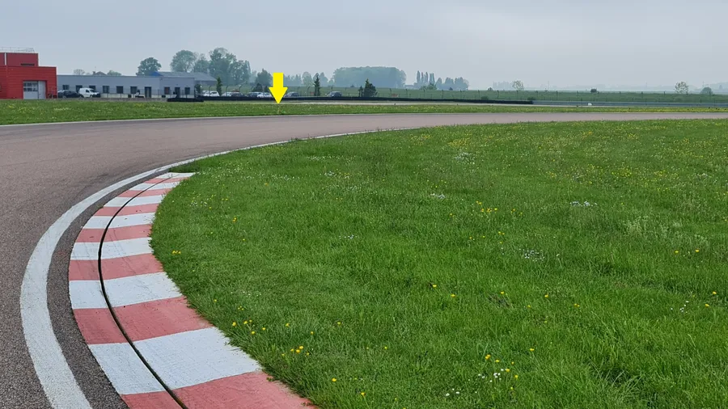

Je me fais confiance, j'ai le genou au sol, j'accélère, j'écarte la trajectoire et je tourne la tête pour rechercher le PS. Je me sers du cône jaune ci-dessous juste comme d'un repaire pour savoir où j'en suis dans la parabolique. Certains l'utilise comme un second point de corde. C'est ce que je faisais, je ne le fais plus.

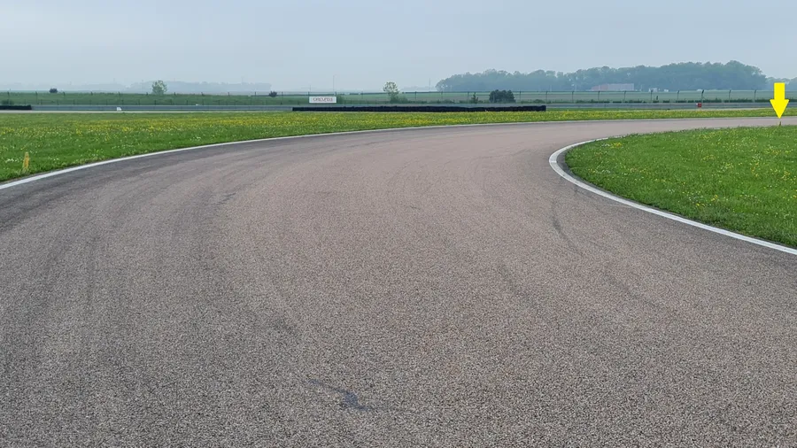

Ce que je vise vraiment c'est le PS, la flèche la plus éloignée dans la photo ci-dessous. Je souhaite arriver là-bas en longeant la ligne blanche.

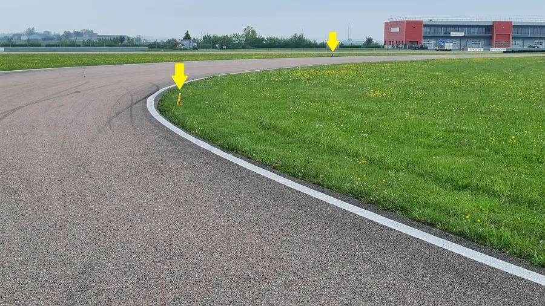

Allez, on enroule pour aller chercher naturellement le PS.

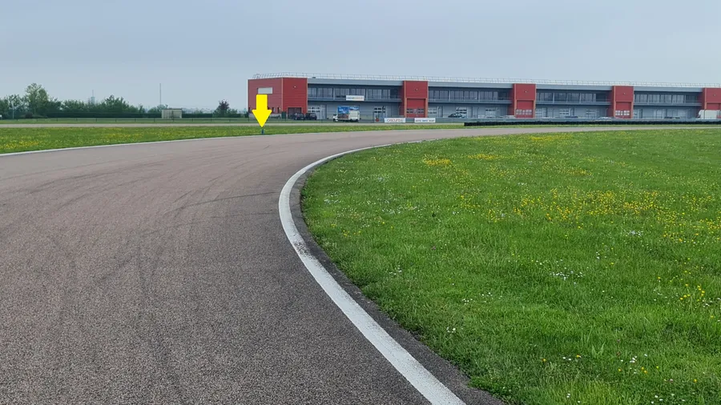

Elargis encore et imagine la ligne droite que tu vas avoir entre le PS (cône bleu) et le panneau 50 m.

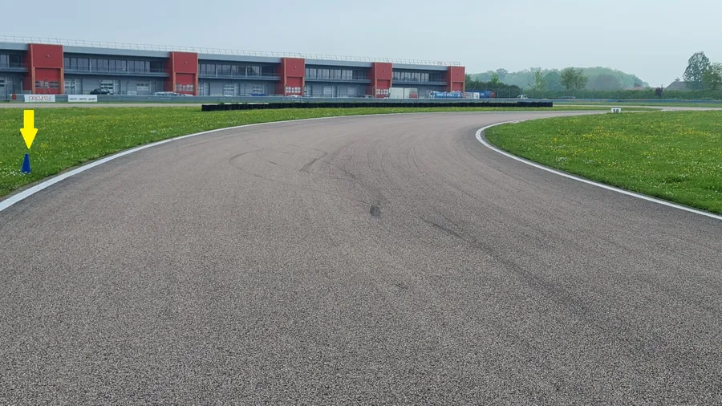

Avant d'arriver au PS (cône bleu), j'ai vu le 50 m. Quand c'est fait, je regarde encore plus loin avec mon menton et je verrouille alors le PMSA de l'épingle à venir.

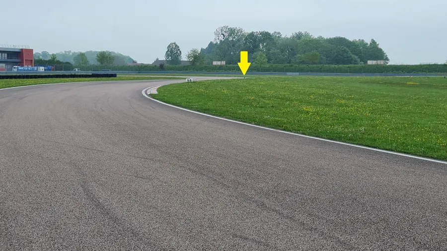

Je reste verrouillé sur ma cible, je tire droit, moto verticale ce qui me permet de freiner fort. Je vais aller croiser la ligne blanche entre le 50 m et le PMSA. Si on ne fait pas ça, il y a toujours un "mariolle" pour tenter de passer à l'extérieur... Bien sûr, on freine fort et on en rentre une tout de suite. Typiquement je suis en 2 (j'évite de rentrer en 1 dans les virages lents comme celui-ci car trop souvent je me retrouve sur un point mort et je n'aime vraiment pas ça... 🥴)

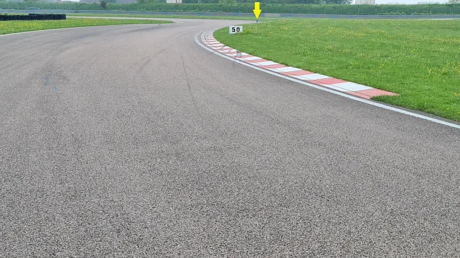

On tire tout droit vers le PMSA.

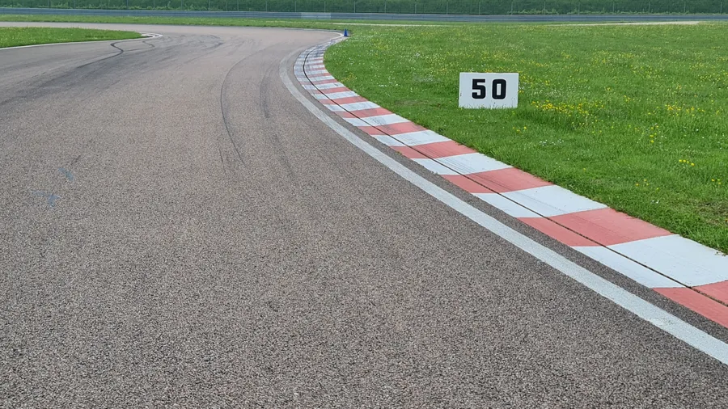

Moi je passe là. Entre la ligne blanche et le vibreur.

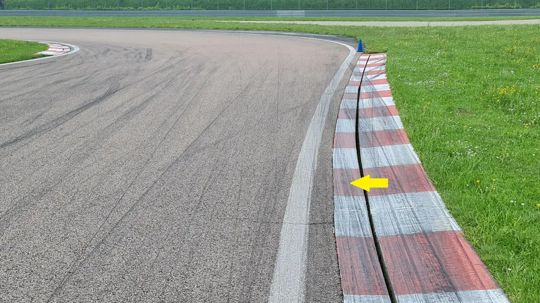

Je crois qu'on est bon, on va atteindre le PMSA. Normalement, j'ai déjà...

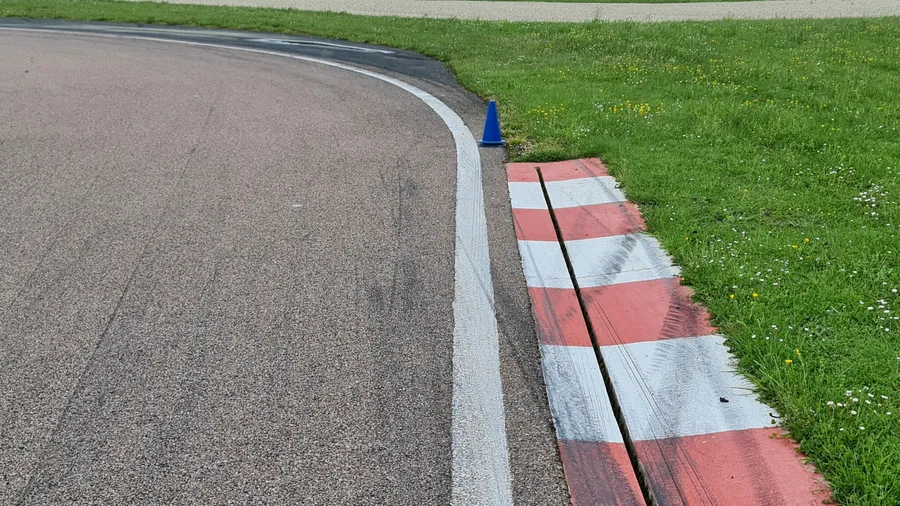

J'ai déjà tourné le menton, les yeux, la tête (alouette) vers le point de corde. Comme c'est une épingle ce dernier est très loin. Il faut donc freiner mais il faut aussi garder de la vitesse pour avoir de l'élan et pouvoir atteindre le PC avec les roues dans la bonne direction.

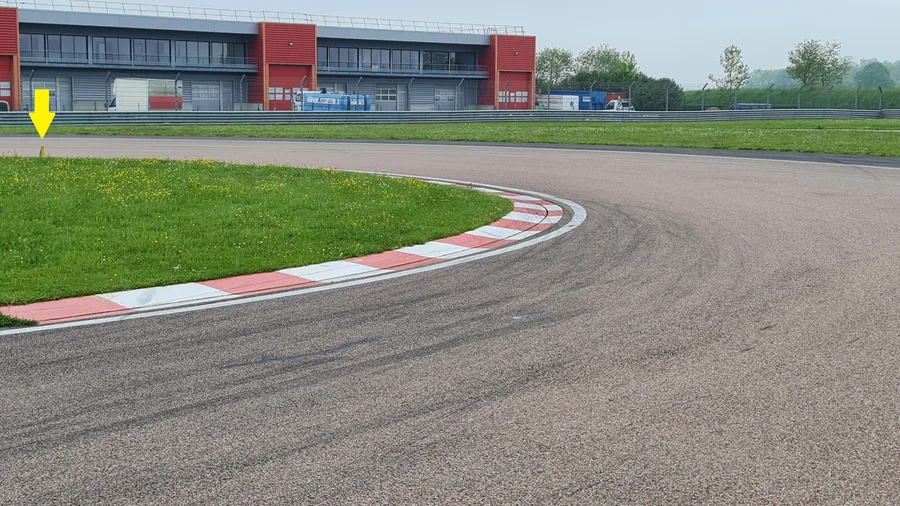

Cela devient un grand classique. Comme le PC est loin il faut rester large, ne pas se jeter à la corde sinon on est mort. On sera sur l'angle sans pouvoir rien faire. En mai 2023, il y a une marque qu'on peut, peut-être, utiliser pour garder l'intention de rester large (le plus dur c'est de la retrouver à chaque tour...)

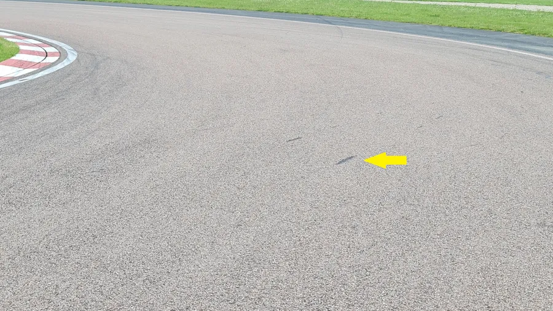

C'est bon, on va atteindre le PC. On a commencé à ouvrir les gaz pour être plein gaz au PC, les roues en direction du PS

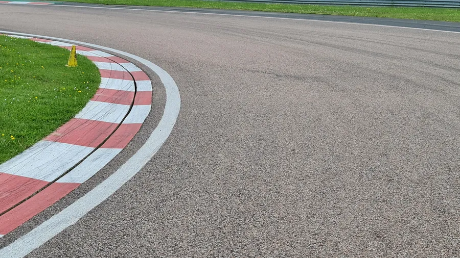

Ce dernier est tout au bout du vibreur extérieur. Si on est gaz à la corde, avec l'inertie de la mécanique on va se retrouver avec la cavalerie alors que la moto sera plus verticale, en train de se relever et il y aura peu ou pas de danger. J'ai beau le savoir, l'écrire, le décrire, j'ai toujours du mal à le mettre en application. Si besoin on peut aussi tirer sur le bracelet intérieur pour aider la moto à se relever plus vite.

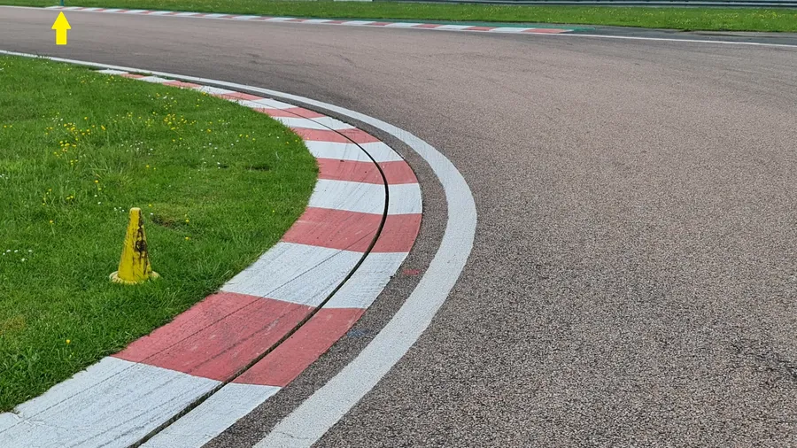

Il y a un petit bout de ligne droite dont on doit tirer parti. Donc on vise le PS et il ne faut pas oublier de rester engagé avec la tête à gauche et en bas, la fesse gauche sortie car le prochain virage est un gauche. On ne remonte pas sur la selle.

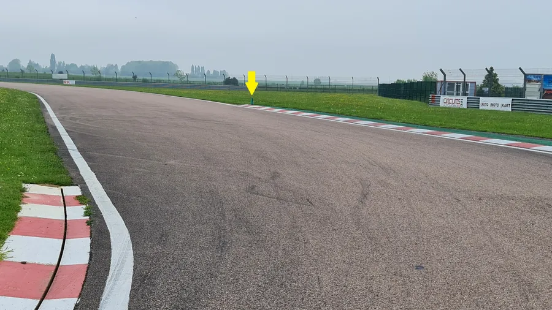

Avant d'arriver au PS au bout du vibreur, je change de cible et je vise le panneau 50 m. Pour le coup on la voit bien la ligne droite virtuelle qu'on peut tracer dans notre tête. Donc gaz, gros gaz. Faut vraiment entendre le "wouaap effect" ici.

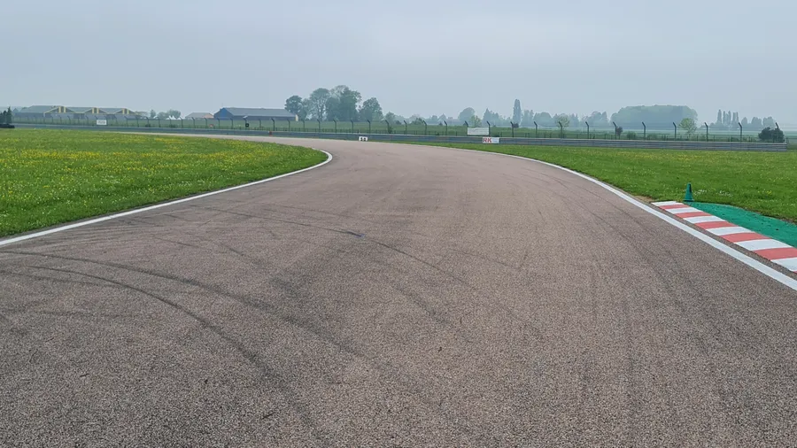

Alors qu'on avance je change de cible et je vise le prochain PMSA. Je continue à accélérer. Typiquement je reste en 2 ça braille un peu mais je n'ai pas le temps de passer la trois pour la rentrer tout de suite après.

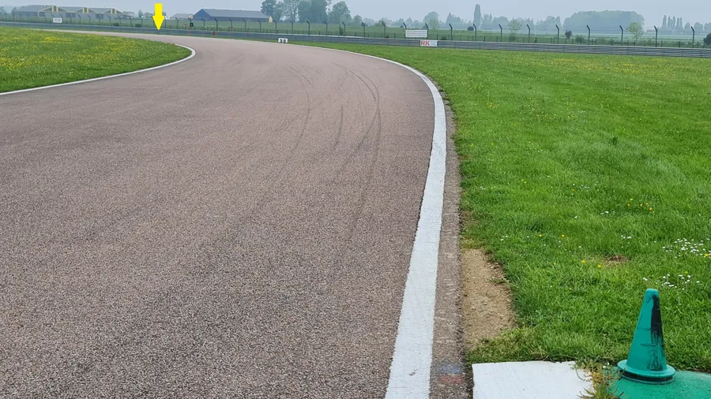

Une vraie ligne droite. Gaaaz !

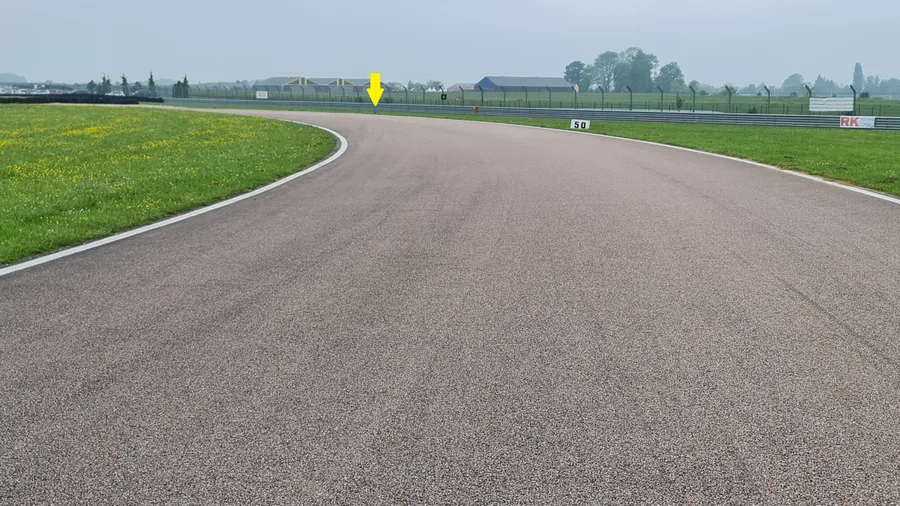

Si on a accéléré fort on freine fort (un peu avant le 50m en ce qui me concerne) mais surtout, je mets mes roues le long de la ligne blanche bien avant le PMSA. Je ne veux surtout pas arriver au PMSA comme si j'avais tracé une diagonale. Non, non, je longe le bord de la piste avant d'arriver au PMSA.

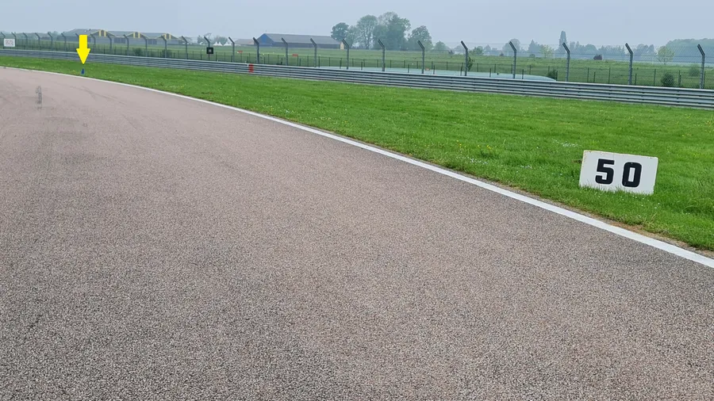

Le prochain virage est un pif-paf. Il faut donc élargir au maximum l'entrée en longeant la bande blanche et en allant jusqu'au PMSA. Bien sûr je pointe du menton et des yeux le PC du pif. Il faut de la vitesse. On est donc genou au sol à la mise sur l'angle.

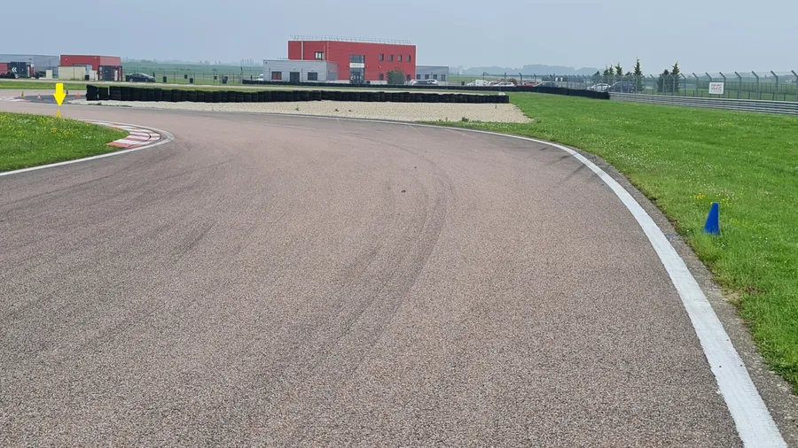

Il faut rester large (ne pas quitter la bande blanche trop tôt avant le PMSA) pour pouvoir rester à gauche après le point de corde du pif.

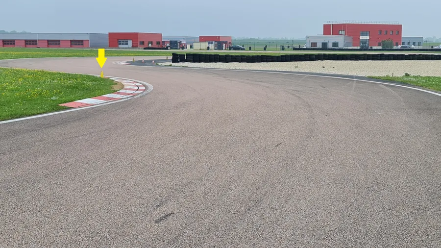

Typiquement je passe sur le vibreur à cet endroit. Sauf erreur de ma part, c'est aussi à partir de là que je laisse la moto longer le vibreur et que je tourne le menton à la recherche du prochain point de corde. Il est très loin.

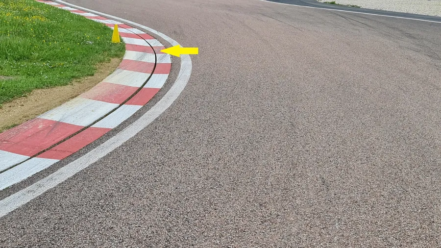

A priori je ne suis pas le seul à passer par là ...

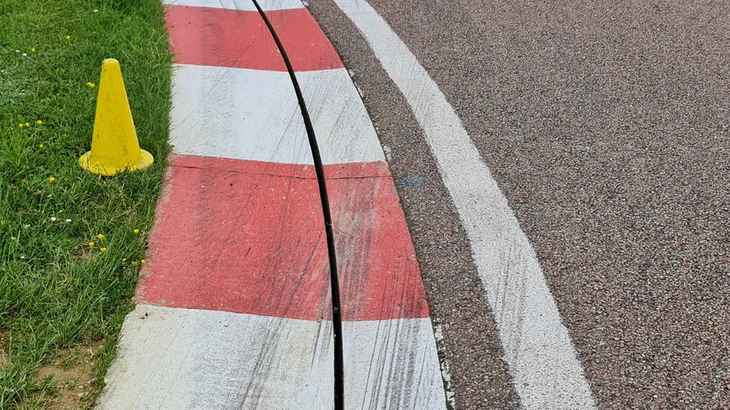

À la sortie du pif il faut longer un peu à l'extérieur avant de plonger dans le paf. Je suis donc "lite" sur les fesses. Les cuisses allègent le corps et on utilise les genoux pour passer d'un côté à l'autre ([knee to knee] NOT YET TRANSFERED (https://www.40tude.fr/pilotage-moto-07-knee-to-knee/)). Le point de corde du paf (voir la flèche ci-dessous) est assez loin. Autrement dit, si on veut une courbe en V pour bénéficier du couple de la moto un maximum de temps, il faut s'avancer un peu dans le pif avant de faire tourner rapidement la moto. On est genou au sol quand on fait pivoter la moto dans le paf.

Le truc à ne pas faire serait de passer du point de corde du pif au vibreur du paf. Ce serait facile, ce serait rassurant mais on serait mort, bloqué pendant 3H le long du vibreur, sans vitesse, sans couple... La misère quoi !

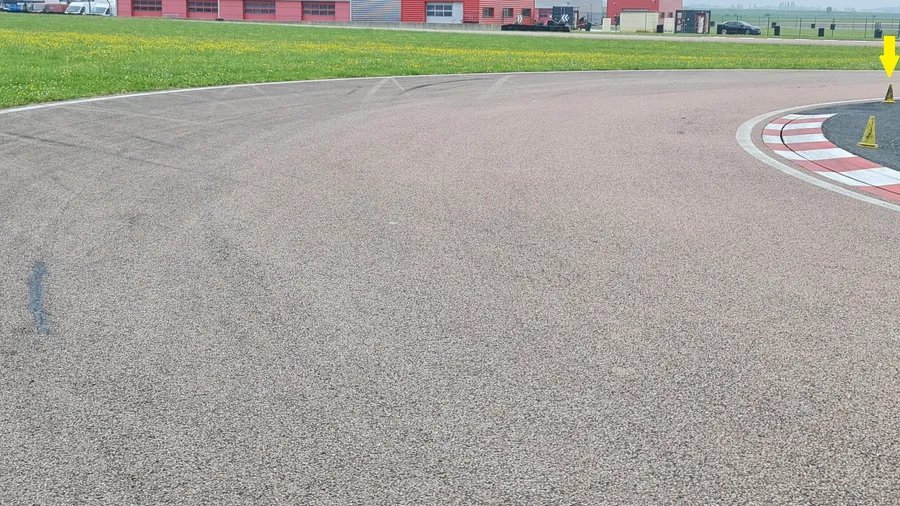

Alors là, **attention**. Idéalement, dans la photo ci-dessous, il manque une flèche. Cette dernière devrait être entre la 1ere et la 2nde flèche, sur la piste, au 3/4 vers la gauche. L'idée c'est d'avoir une trajectoire assez coulée (un peu comme dans l'opération Couleuvre où il faut rester cool).

<!-- https://youtu.be/LTlxxHEEzPQ?t=243 -->

<iframe width="560" height="315" src="https://www.youtube.com/embed/LTlxxHEEzPQ?si=Ro3DvJST6K3mfJIJ&amp;start=243" title="YouTube video player" frameborder="0" allow="accelerometer; autoplay; clipboard-write; encrypted-media; gyroscope; picture-in-picture; web-share" referrerpolicy="strict-origin-when-cross-origin" allowfullscreen></iframe>

Surtout, cela doit nous permettre de mettre un vrai coup d'accélérateur entre le PC du paf (1ere flèche) et le PMSA du prochain virage (2nde flèche). Trop souvent il n'y a pas de "wouaap effect" ici et on peut facilement en doubler par l'intérieur, au freinage du PMSA. C'est dommage de ne pas accélérer car il faut de la vitesse pour le prochain gauche qui, pour le coup, conditionne un vrai bout de ligne droite.

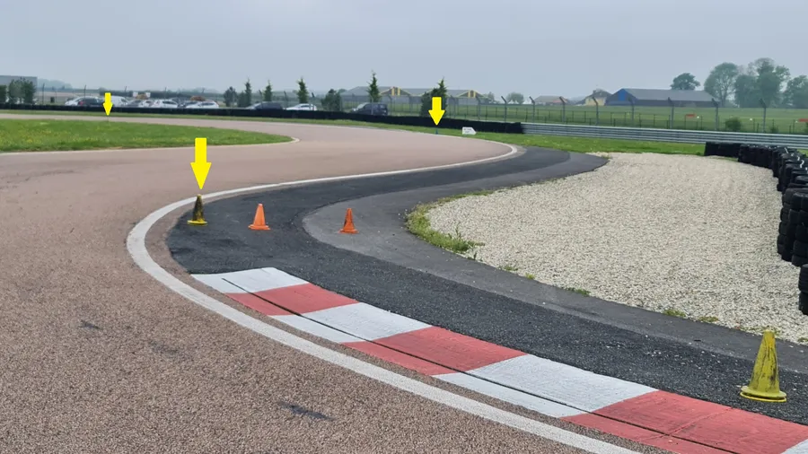

On passe le point corde du paf en accélérant, en élargissant la trajectoire et un visant le prochain PMSA.

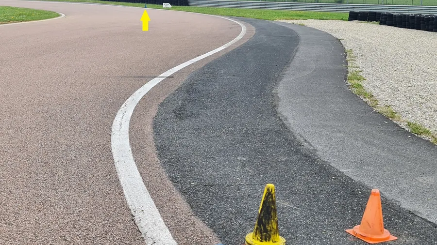

L'accélération nous déporte à gauche mais on vise un point un peu à droite des pointillés au pied du cône bleu. L'idée, encore et toujours, c'est d'éviter d'arriver la roue AV plantée dans le cône avec la roue arrière au milieu de la piste. Non, non, il faut essayer de tangenter la ligne blanche au niveau du cône bleu et donc viser un point un peu à sa droite, arrondir et longer la ligne blanche. On ne parle pas de 25m mais plutôt de une ou deux longueurs de moto.

La moto se relève, on a le poids sur les cale-pieds, on est "lite" sur les fesses et on fait passer le corps de droite à gauche.

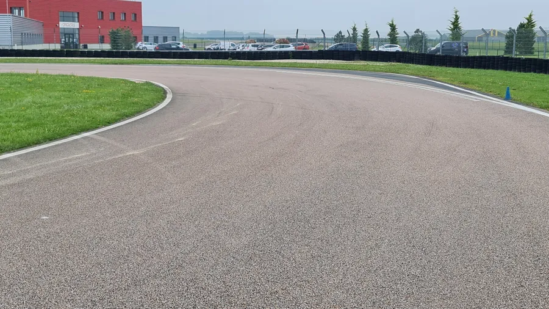

Avant d'arriver là en ayant un peu arrondi/longé la ligne blanche, bien sûr on a franchement tourné le menton vers le prochain PC. C'est ici, sur le 1er pointillé qu'il faut faire pivoter la moto en remettant un coup de menton vers le prochain PC. La tête s'abaisse, bras droit est tendu sur le réservoir, prise tournevis sur le bracelet gauche, je pousse le coude intérieur, le genou va toucher le sol et on reste détendu des bras. Qu'est-ce que je suis fort quand je suis derrière un clavier de PC 😏

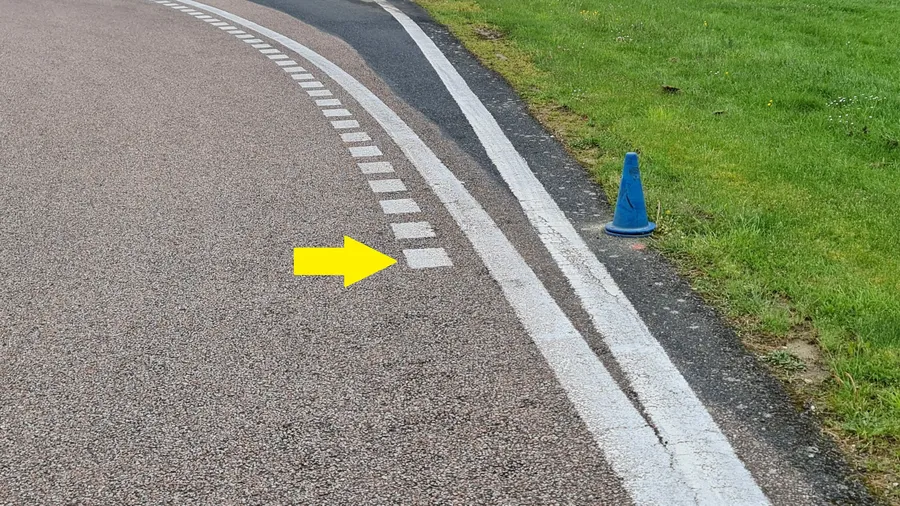

On reste large car le PC est assez loin.

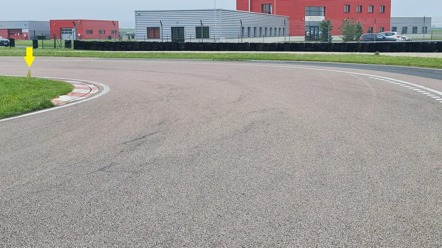

Pour ceux qui découvrent le circuit, c'est ici que se fait la sortie de piste. Là où il y a le panneau 30 km/h et les deux panneaux avec les flèches blanches et bleues.

Sinon, si on reste sur la piste, on change déjà de cible et on vise le point de sortie qui est au bout du vibreur extérieur.

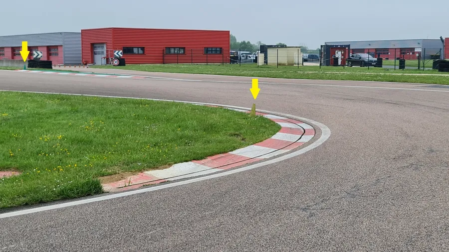

Au point de corde il ne faut pas hésiter. Gaaaz ! Il faut continuer à viser la fin du vibreur extérieur. Si on a été trop généreux, on peut passer sur le vert. C'est le seul endroit du circuit où c'est de la peinture et pas de la moquette.

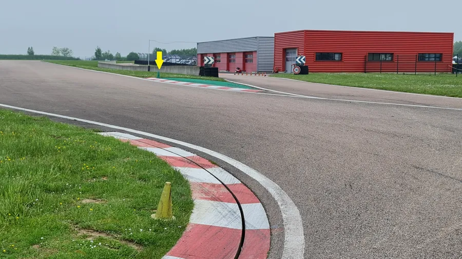

En pleine accélération la moto se déporte. Perso je ne suis jamais passé dans le vert. Je dois passer limite vibreur quand je ne loupe pas le PC et que j'ai le courage d'accélérer correctement. Quoiqu'il en soit je tourne déjà le menton et les yeux vers le 50 m puis le PMSA qui est tout au bout de la ligne droite.

C'est là qu'on comprend l'intérêt d'une courbe en V. Si j'ai un beau V, je vais vraiment pouvoir mettre 100% gaz à la corde, sortir en étant déjà vite sur le vibreur et avoir une belle vitesse à la hauteur du panneau 50 m à venir.

Dans le cas contraire, on s'est jeté sur le vibreur intérieur, on est collé à la corde, on ne peut pas accélérer... Le brin... Quand on arrive un peu après le point de corde on commence à relever la moto et à accélérer alors que celui qui a une courbe en V est déjà 100% gaz depuis une ou deux secondes. Je n'ai pas les chiffres exacts mais bon j'espère que ça aide à saisir l'idée.

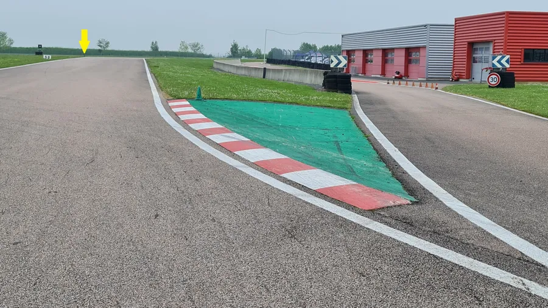

Allez, on enroule, on enroule. Tête toute à gauche, tout en bas, fesse gauche sortie, on ne lâche rien, il y a des dixièmes à gagner ici.

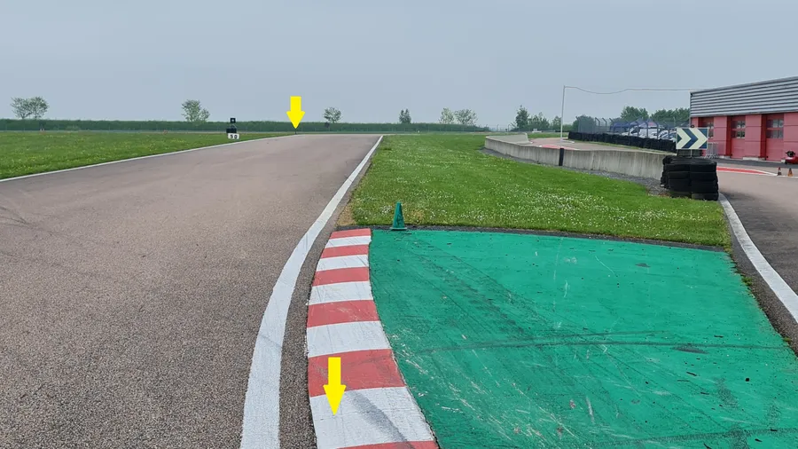

Les yeux rivés sur le PMSA je fais passer mes fesses et ma tête de gauche à droite sans m'arrêter au milieu. Typiquement je reste en 2 sur ce segment de droite.

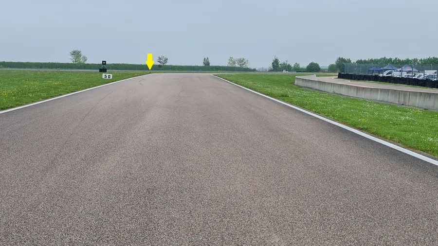

On colle bien à gauche pour élargir l'entrée du prochain virage et j'accroche du regard (pas encore du menton) le point de corde. Je freine avant les 50 m et je reste en 2.

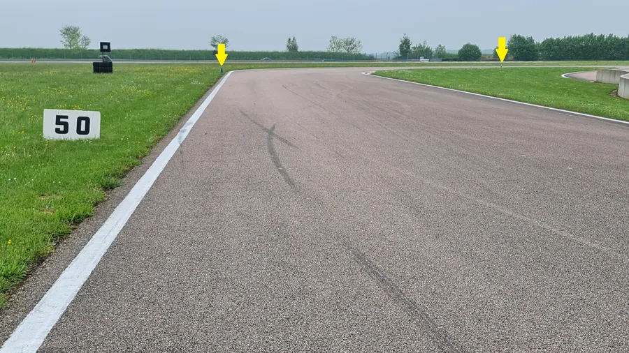

Ici il faut faire l'effort d'emmener la moto au PMSA, là où il y a la pointe de la flèche.

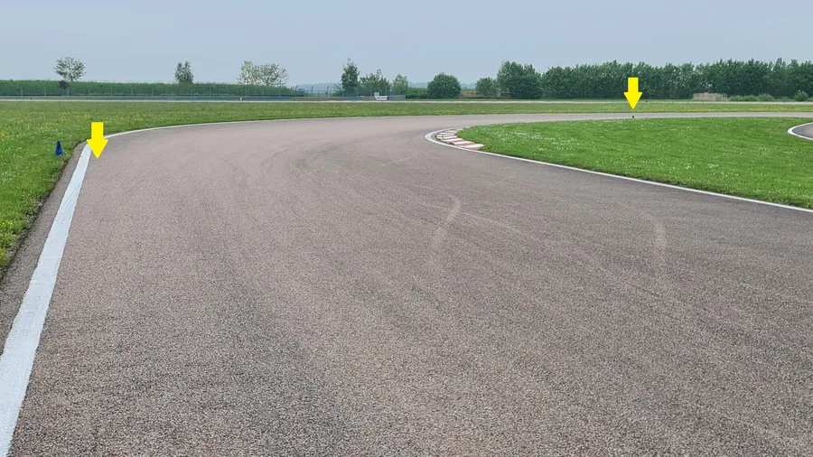

On est au niveau du PMSA (cône bleu). Le virage est à 90° et il est suivi d'un autre droit à 90°. On va quasiment enchaîner les 2 virages dans un seul mouvement.

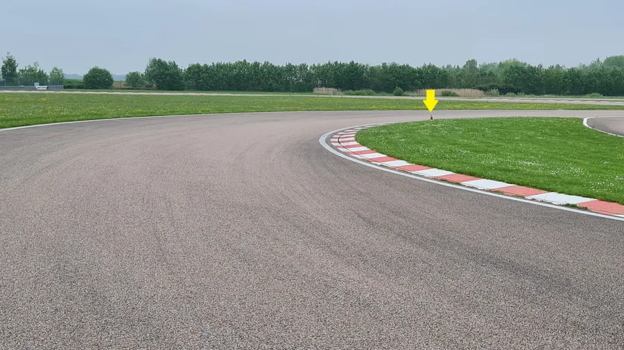

Je sais où est le point de corde, je sais que je suis bien placé, je change donc de cible. Mon menton et mes yeux pointent vers le prochain vibreur. On est en 2, genou au sol.

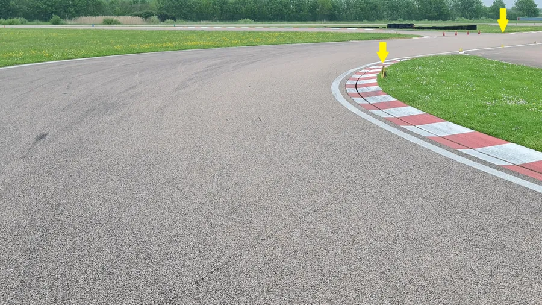

Au bout du vibreur je verrouille le PMSA et j'anticipe déjà le second PC. Je vois large. Je vise le PMSA et je sais déjà où se trouve le PC.

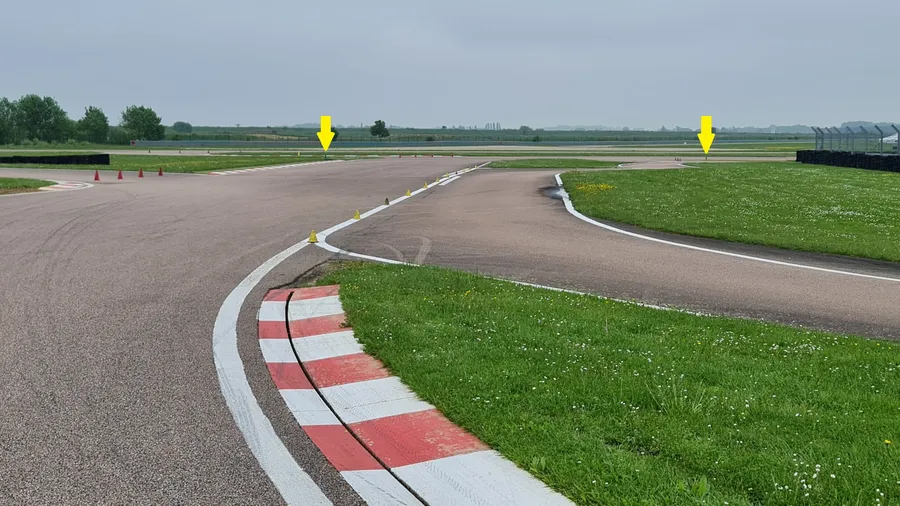

Accélération franche. Tête et fesse à droite. Faut entendre le "wouaap effect". Mes roues sont sur la ligne blanche au début du vibreur. C'est aussi au début du vibreur que je coupe et que je freine. Je suis toujours en 2.

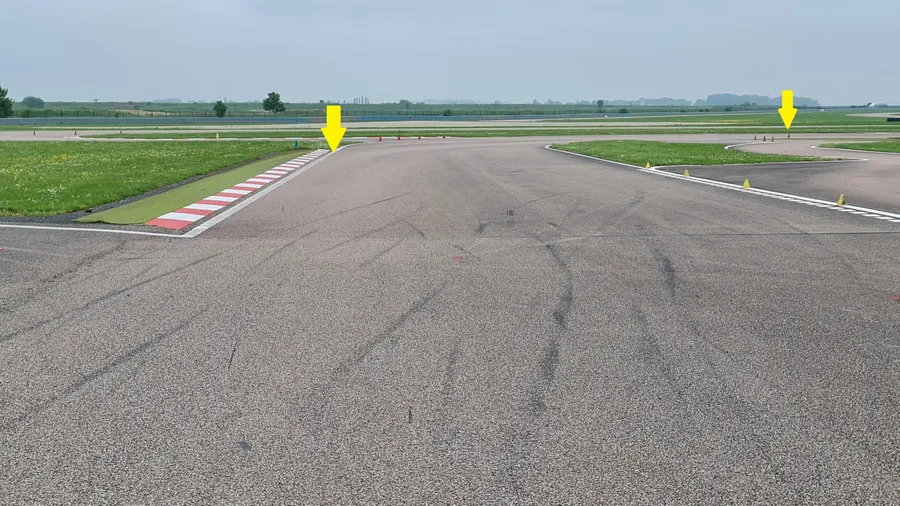

Je vais arriver sur le PMSA. En ce qui me concerne je me force à suivre les traces noires au sol pour ne pas rentrer trop tôt à la corde.

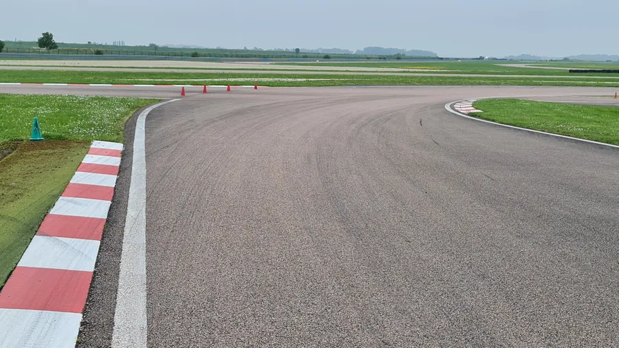

On voit bien ici que le PC est une ou 2 motos après le bord gauche du bypass (si on traverse la piste de gauche à droite). Quoiqu'il en soit, j'ai relâché les freins, je mets rapidement la moto sur l'angle, genou au sol et en avant Guingamp.

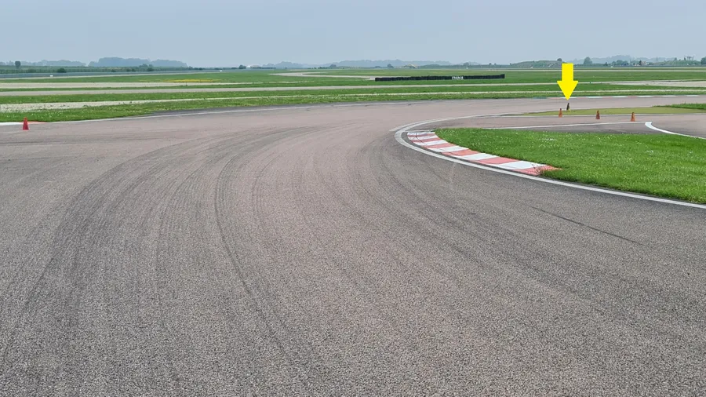

Trop souvent je tape la corde au niveau du bypass (la fin des pointillés blancs ci-dessous). Je trouve que le point de corde est vraiment loin mais bon je me soigne...

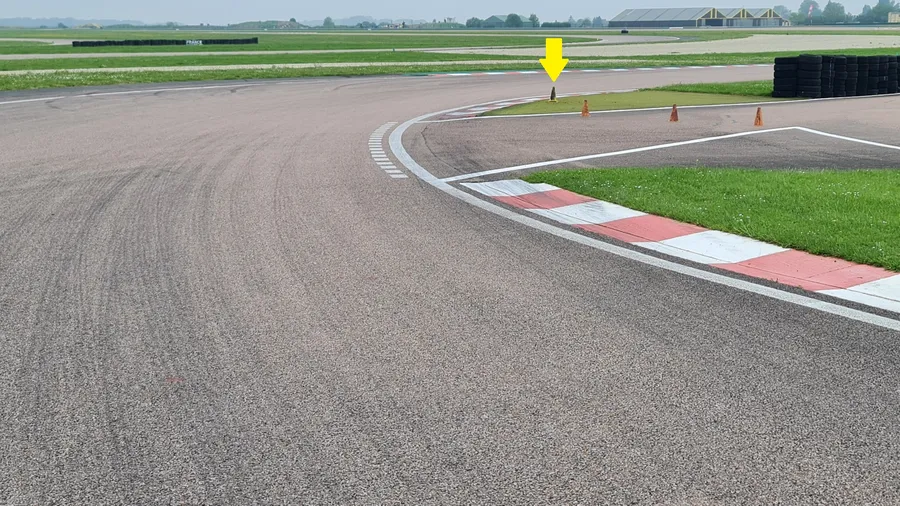

Là, on se rend compte que la fin des pointillés ce n'est sans doute pas le meilleur PC et qu'au niveau du cône les roues de la moto seront bien mieux orientées pour aller se jeter sur le point de sortie au bout du vibreur extérieur.

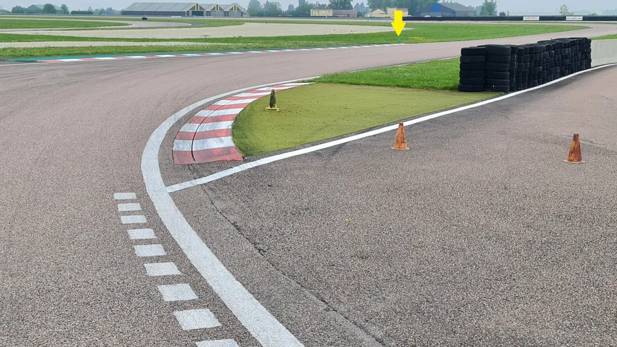

On est au point de corde. Gaaaz! Tête en bas et à l'intérieur du virage, fesse droite sortie. On tire sur le levier intérieur pour lever la moto plus vite. Elle sera bien verticale quand la cavalerie arrivera. Si on accélère précisément au PC il y a moyen de doubler du monde avant le prochain gauche.

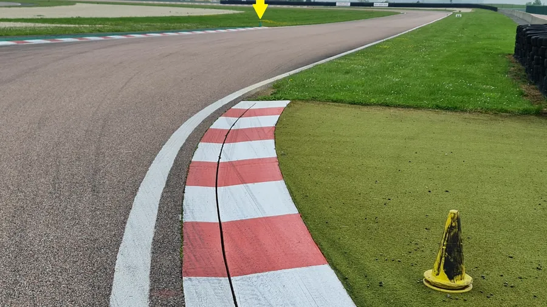

Je me dirige vers le PS et déjà j'acquiers le PMSA, là-bas, au fond à droite derrière le panneau 50 m.

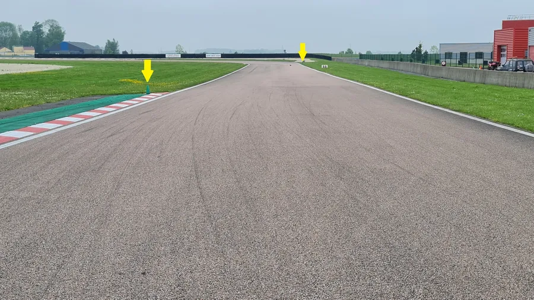

Je reste en 2. Il faut vraiment bénéficier du "wouaap effect" Faut y aller, y a un bout de ligne droite, on en profite. Tant qu'on y est et puisqu'on a le temps 😊, il faut faire passer une fesse et la tête à gauche en utilisant les jambes (cuisses et genoux). On devrait être capable de le faire sans que les mains touchent les bracelets et surtout sans reposer les fesses sur la selle (on va directement de droite à gauche).

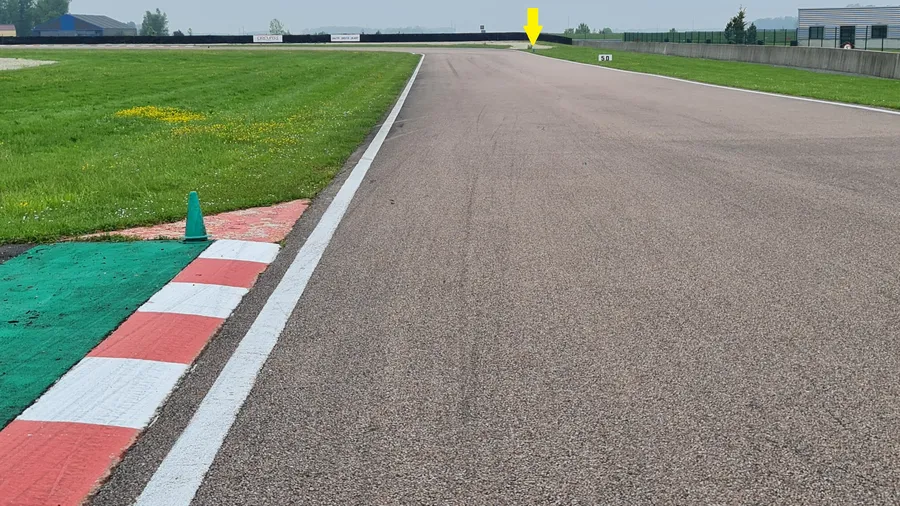

Il faut absolument arriver au PMSA avec les roues de la moto parallèles à la ligne blanche. Donc faut se bouger pour passer de la gauche à la droite de la piste. Je coupe, je freine un peu avant le 50 m mais désolé je n'ai pas de point de freinage gravé dans le sol à partager.

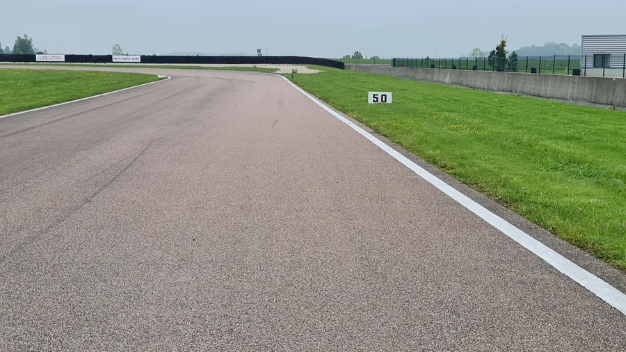

Je reste "locké" sur le PMSA

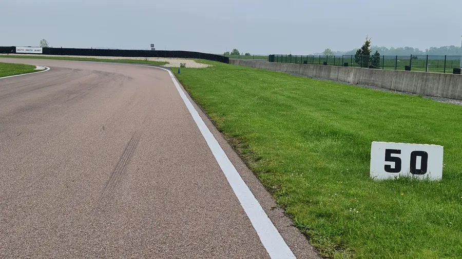

On a passé le panneau 50 m, on longe la ligne blanche pour ouvrir le virage... Et on change de cible. Je vise avec le menton et les yeux le prochain PC.

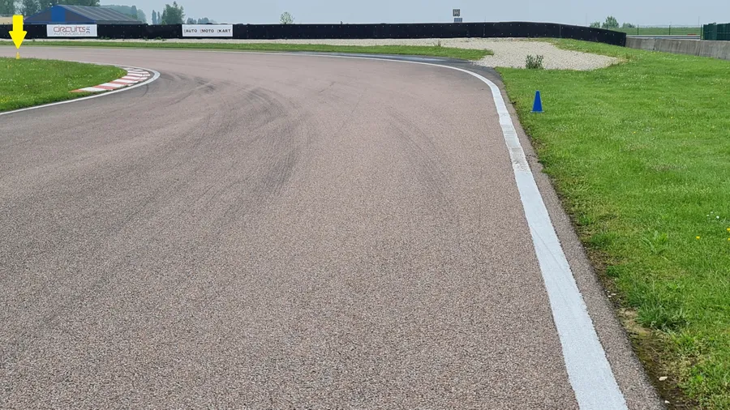

Je suis focus sur le PC mais j'anticipe déjà le point de sortie qui est assez loin au bout du vibreur extérieur. S'il est loin cela veut dire que la trajectoire est tendue (normal, on arrive sur LA ligne droite du circuit). Donc, du point de vue du chrono ce virage est essentiel puisque notre vitesse de sortie du virage va conditionner notre vitesse en bout de ligne droite. Donc, on n'a pas le droit de se louper... Je dis ça, je dis rien.

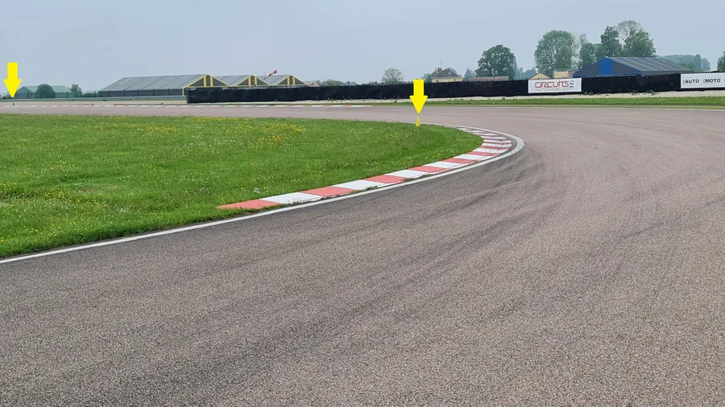

Mise sur l'angle rapide au niveau du PMSA, genou au sol quand on se dirige vers le PC.

On considère qu'on va passer au point de corde. Allez, objectif le PS au bout du vibreur.

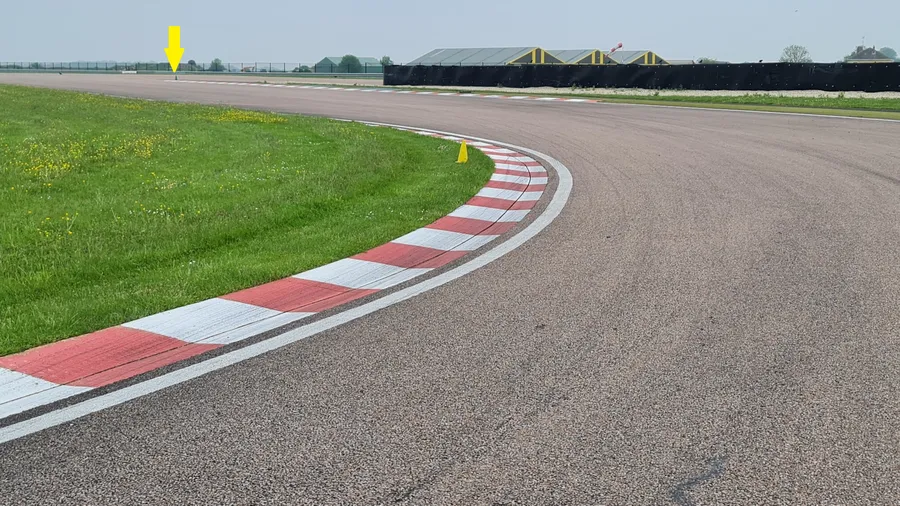

Gaz au point de corde. Tête en bas à l'intérieur, coude au soleil sur le réservoir, poitrine sur le réservoir, genou extérieur dans le réservoir. Enroule, enroule, enroule, faut passer vite et pas louper l'accélération de la ligne droite.

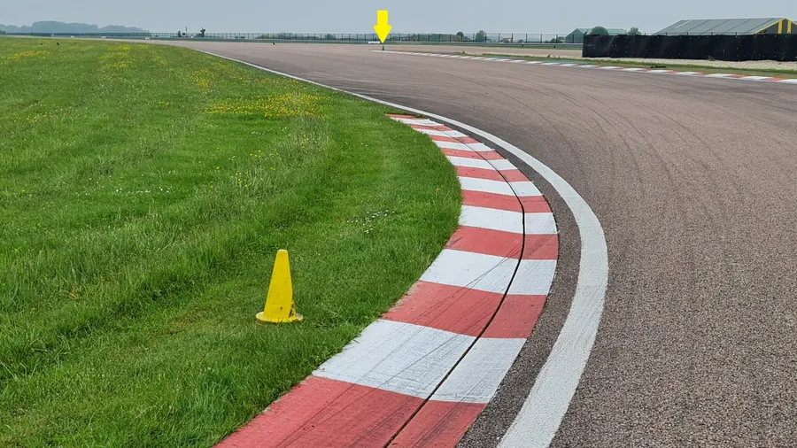

Allez, lâche rien, il y a des secondes à aller chercher ici.

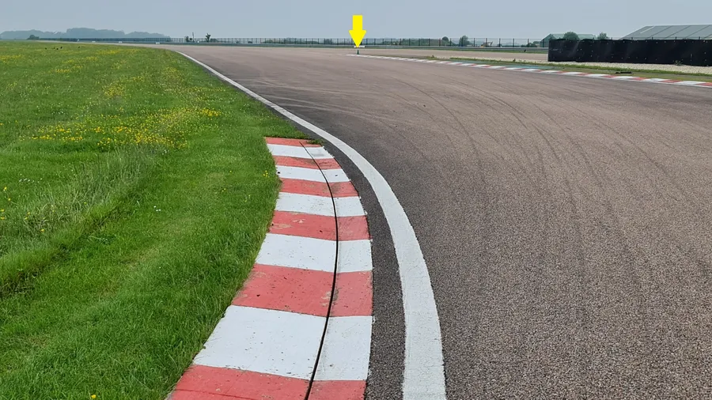

Tire sur le bracelet intérieur pour relever et accélérer rapidement. Perso, ce que je fais c'est qu'une fois le PS acquis, je change de cible et je vise la pointe du triangle de peinture. Ça allonge/tend encore la trajectoire et ça me dirige gentiment vers l'extérieur de la piste.

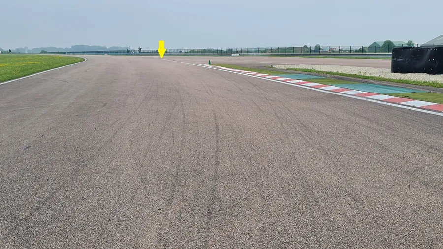

Je fais l'effort de me placer rapidement sur la droite afin d'y rester jusqu'au bout.

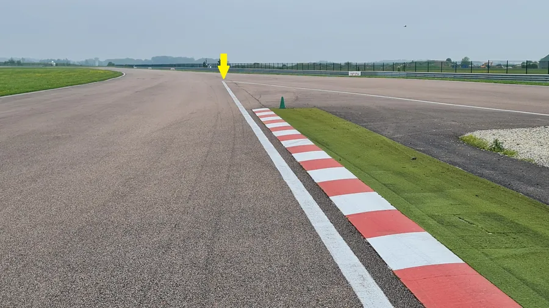

Heu... Tu la vois bien la moquette verte ? À mon niveau je n'ai pas encore eu besoin de monter sur le vibreur. Je pense que je me la joue petit bras et que je n'accélère pas encore assez (même si je sens que l'avant du RSV4 fait mine de délester un peu).

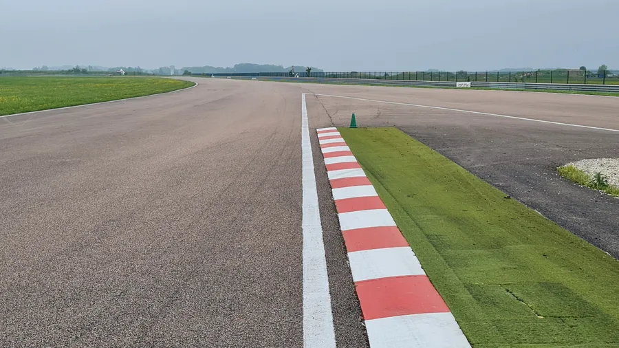

On a fait un tour du circuit. On retrouve la marque de séparation des bitumes de la piste et de la voie d'accès (elle est à droite sur la photo). Idéalement la fesse gauche est et restera dehors toute la ligne droite la tête est derrière la bulle (oui on est de travers), le menton sur le réservoir et on appuie fort sur les cale-pieds.

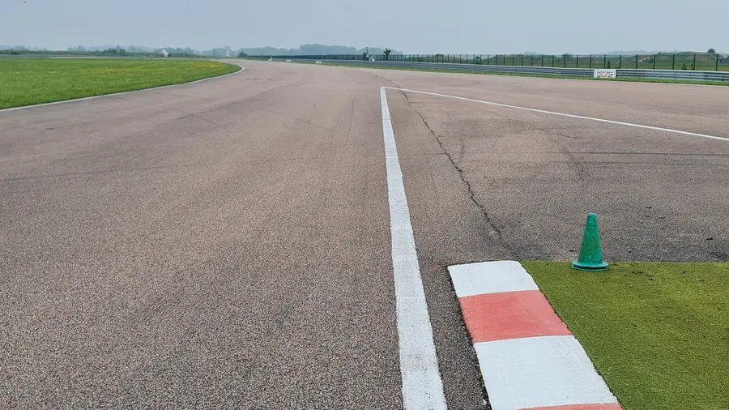

Je vise le panneau 150 m et je passe la 3 et la 4 car j'adore le bruit du moteur au moment de les rentrer au bout de la ligne droite (frimeur !).

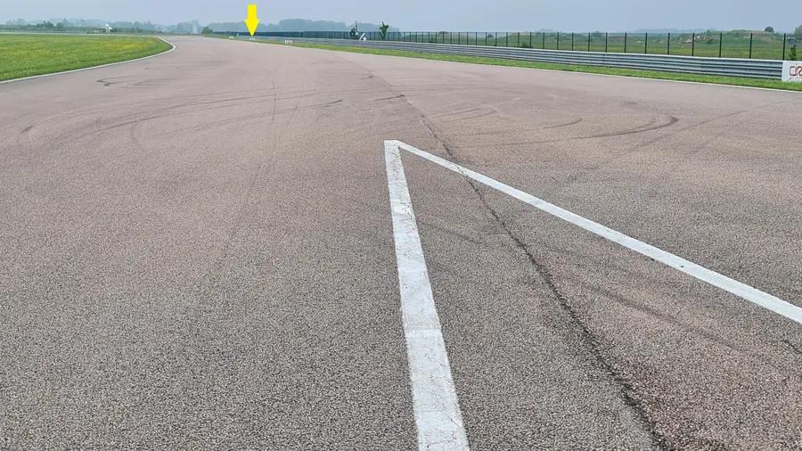

Et je crois que c'est terminé. Encore une fois, n'hésitez pas à m'aider à améliorer cette page avec des commentaires et des compléments.

Une vidéo que j'aime bien pour ses commentaires instructifs.

<!-- https://youtu.be/AzCQJLa7HDo -->

<iframe width="560" height="315" src="https://www.youtube.com/embed/AzCQJLa7HDo?si=IGSavHcnHuKzCrXj" title="YouTube video player" frameborder="0" allow="accelerometer; autoplay; clipboard-write; encrypted-media; gyroscope; picture-in-picture; web-share" referrerpolicy="strict-origin-when-cross-origin" allowfullscreen></iframe>

Bon, allez, la suite au prochain numéro et d’ici-là relisez les [notes de pilotage]() ou faites des squats afin de préparer les prochains roulages (pour moi ce sera le Vigeant les 27 et 28 mai prochains).

<!-- https://youtu.be/TIhtpItTuxc -->

<iframe width="560" height="315" src="https://www.youtube.com/embed/TIhtpItTuxc?si=qL84DxP-ejd_Yi4-&amp;start=53" title="YouTube video player" frameborder="0" allow="accelerometer; autoplay; clipboard-write; encrypted-media; gyroscope; picture-in-picture; web-share" referrerpolicy="strict-origin-when-cross-origin" allowfullscreen></iframe>

