# Le Vigeant 1

## Mises à jour

* Suite stage DRRS des [23 et 24 août 2023] NOT YET TRANSFERED (https://www.40tude.fr/rsv4-sur-circuit-stage-drrs-des-23-24-08-2023-au-vigeant/)
* Suite stage H2S des [07 et 08 juin 2023] NOT YET TRANSFERED (https://www.40tude.fr/rsv4-sur-circuit-stage-07-08-06-23-h2s-le-vigeant/)
* Suite roulage des [27 et 28 mai 2023] NOT YET TRANSFERED (https://www.40tude.fr/rsv4-sur-circuit-roulage-des-27-28-05-23-le-vigeant/)
* Billet initial 6 juin 2022

## Introduction

Il y a peu de temps, j'ai eu la possibilité de faire le tour du circuit du Vigeant à pied. J'en ai profité pour faire un max de photos (160 environ). Je vous propose dans cette série de 3 billets de refaire un tour ensemble. Attention, je ne suis pas un expert et donc s'il y a des trucs avec lesquels vous n'êtes pas d'accord, dites-le dans les commentaires. Un seul truc cependant : restez courtois et constructifs.

### Une remarque

N'hésitez pas à cliquer sur les images pour les voir en plein écran et pouvoir zoomer dessus.

Pour le reste, en cours de lecture vous croiserez des réflexions ou des questions... Pas d'offense, c'est surtout pour moi 😏.

J'ai arbitrairement découpé le circuit en 3 zones. Allez c'est parti, on attaque la zone 1 qui va de la ligne d'arrivée au milieu de la ligne droite du fond (voir le plan ci-dessous)

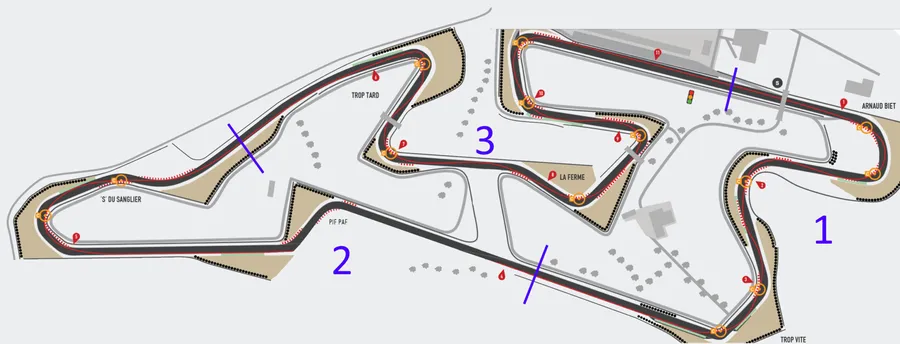

On est au-delà de la ligne d'arrivée, on est gaz en grand en 5. Dans l'image ci-dessous on regarde derrière nous, de l'endroit d'où l'on vient.

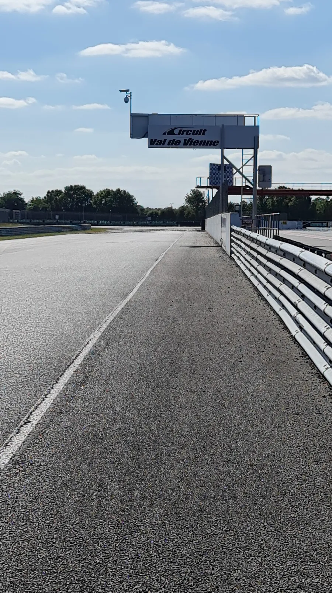

On se dirige plein pot vers la passerelle. Au fait, tu es sûr que tu es en butée de l'accélérateur, à 100% de charge ? En ce qui me concerne, je colle à la ligne blanche et mon point de freinage (PF) c'est la moitié de la zone blanche après les zébras.

Aout 2023 : Quand je suis en forme, je prends dorénavant les freins au bout de la zone blanche après les zébras. Lors du stage DRRS, Wilfrid indiquait qu'avec un mille, le PF c'est la passerelle. J'ose pas encore...

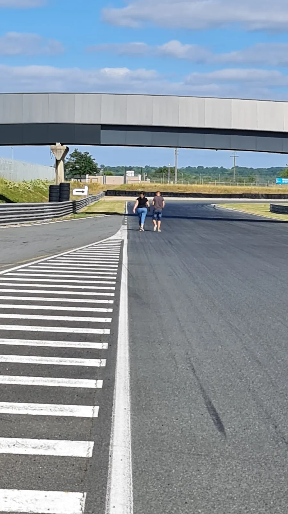

Au PF je rentre 2 rapports tout de suite pour bénéficier d'un vrai frein moteur. Je reste collé à la ligne blanche. Le point à partir duquel je change de direction pour commencer à me décoller de la ligne (le cône dans l'image ci-dessous) est pile-poil au milieu de la distance qui sépare le panneau 100 m (à droite de la piste, on ne le voit pas dans la photo ci-dessous mais il est au bout de la ligne blanche qui traverse la piste) et le panneau avec une flèche noire (à gauche de la piste et à gauche de la photo ci-dessous).

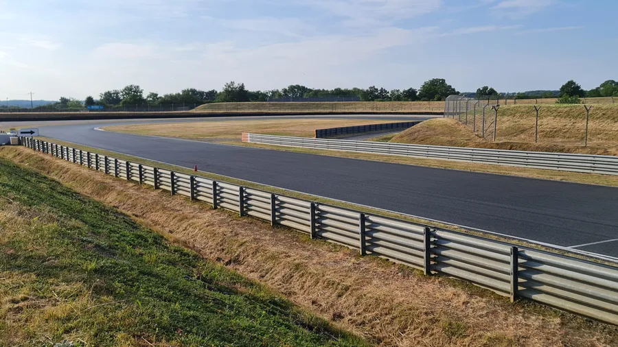

Ci-dessus, le panneau 100 m est à droite, au bout de la petite ligne blanche qui traverse la piste (en bas à droite dans l'image).

Dans l'image suivante, on est sous la passerelle. Idéalement c'est là qu'il faudrait freiner. Quoiqu'il en soit on reste droit sous la passerelle pour optimiser le freinage (rallonger les lignes droites, raccourcir les virages...)

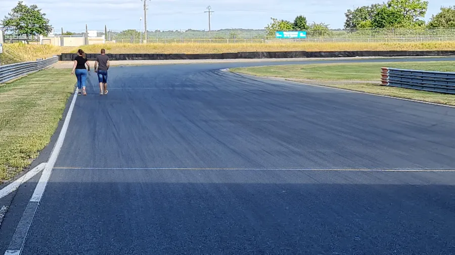

Quand on est au milieu de la distance qui sépare les panneaux 100 m et flèche on opère un changement de direction (ce n'est PAS une mise sur l'angle où on claque la moto au sol) et on se dirige vers le premier point de corde (PC).

Au sol, juste avant le premier vibreur, il y a une tache rouge qui s'estompe avec le temps...

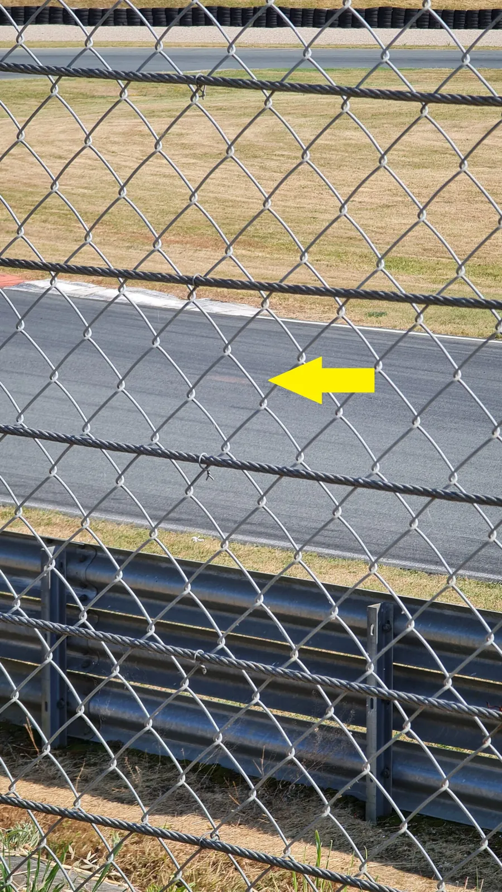

Il faut normalement la laisser à notre gauche (j'ai un peu merdé en prenant la photo)

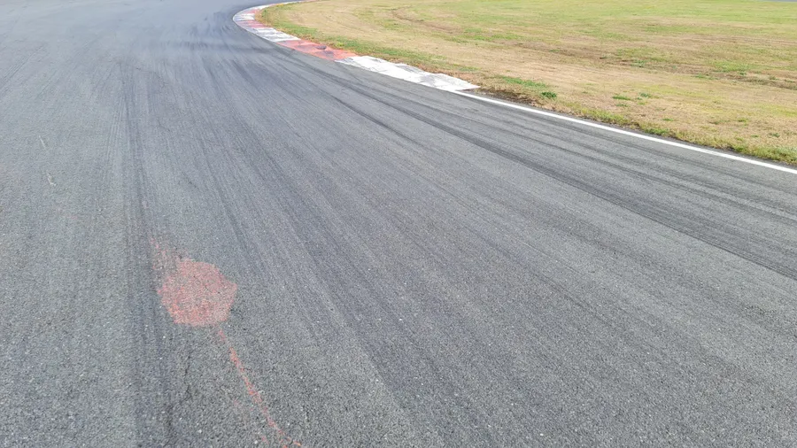

On est, bien sûr, toujours sur les freins, on se dirige vers le 1er PC (au niveau du second vibreur rouge). Faut rester droit pour pouvoir prolonger le freinage le plus longtemps possible. On passe à 1m du PC. Ensuite, faut se faire confiance et aller chercher le fond du virage à l'extérieur (3/4 piste) en étant dégressif sur les freins.

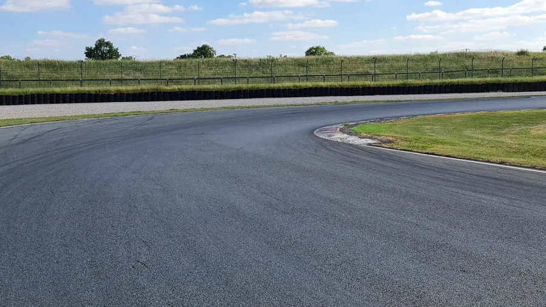

On continue à avancer dans le virage. Quand on est 3/4 de piste environ, on devrait rentrer un rapport (se retrouver en 2). Perso je n'y arrive pas encore. On a plus les freins, on n'a pas de gaz, phase neutre, on couche la moto. C'est là qu'on fait le V, c'est là qu'on doit avoir le genou au sol, pas avant. On fait pivoter la moto en pointant du menton le second PC.

Aout 2023 : comme ce n'est pas toujours facile d'en rentrer une quand on arrive au 3/4 de la piste, certains font le choix de rentrer un rapport au premier point de corde. C'est plus facile et ça permet d'être en 2 dans le virage. À tester.

Si jamais un jour il n'y a pas de cône pour marquer le PV, le point extérieur à viser se trouve en face de la fin du vibreur intérieur. Voir ci-dessous. Sauf erreur de ma part en juin 2023 il y a dorénavant un rectangle blanc peint au sol.

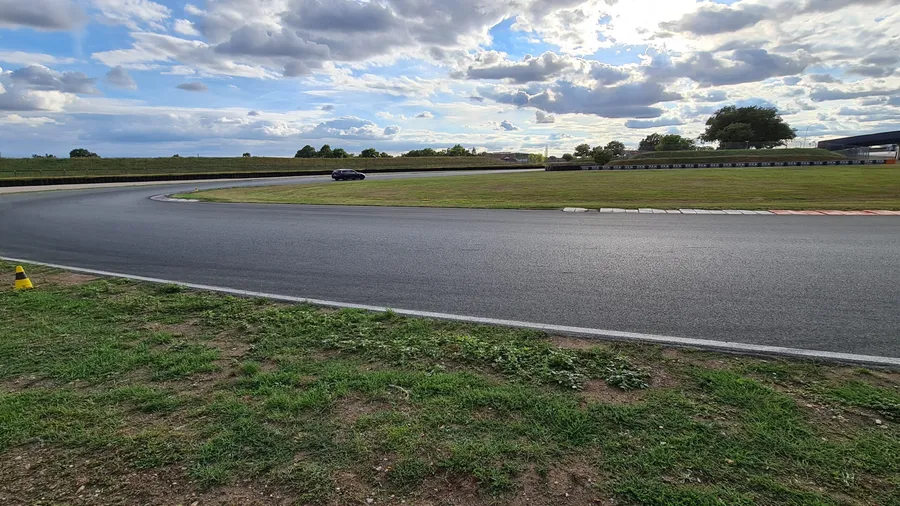

Là, on a passé le second PC (avant dernier vibreur rouge) et on regarde derrière nous. À la sortie du double droit il faut faire l'effort de ne pas vouloir aller tout à l'extérieur car en fait le prochain virage est un gauche. Il va donc falloir traverser la piste et plus on sera à l'extérieur, plus cela va nous prendre du temps.

Si on sort fort et sur le vibreur faut sentir qu'on contrebraque en repoussant la moto avec le bras extérieur qui est tendu et en tirant sur le bracelet intérieur (bras intérieur plié). Contrebraquer (consciemment ou pas) en sortie permet de relever la moto plus vite ce qui permet d'accélérer plus fort et pour plus longtemps (je parle spécifiquement du contre braquage en sortie de virage sur [cette page] NOT YET TRANSFERED (https://www.40tude.fr/pilotage-moto-06-contre-braquage-en-sortie-de-virage/)). Bref on sort 3/4 piste si possible sinon va falloir se bouger les fesses car le prochain virage arrive vite. L'idée ici est de favoriser la distance et d'éviter de faire des grands S (j'en parle sur [cette page] NOT YET TRANSFERED (https://www.40tude.fr/pilotage-moto-06-contre-braquage-en-sortie-de-virage/)).

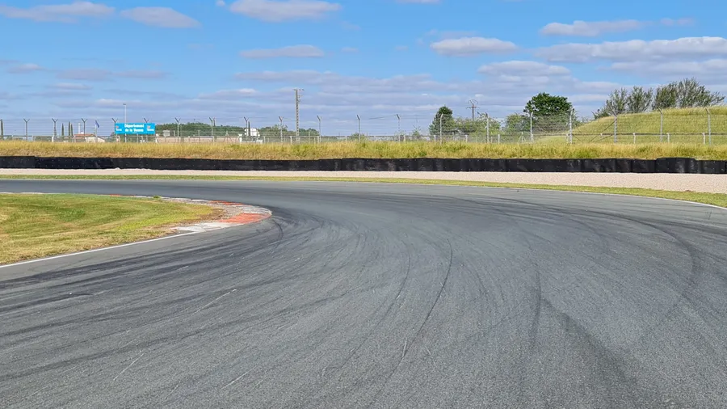

Bref, on accélère fort, si on est sorti en 2 on passe la 3 et on se débrouille comme on veut MAIS il faut que la moto longe la ligne blanche de droite (à 1 cm) avant d'arriver au prochain vibreur. C'est notre prochain point de mise sur l'angle (PMSA).

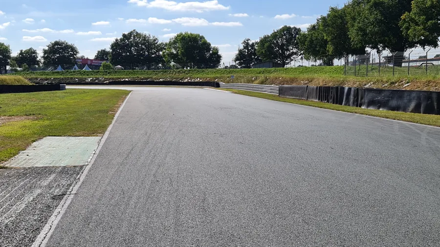

Il y a des craquelures au sol on peut s'en servir comme repaire. Je me dirige vers la droite de la piste. Je vise un point situé AVANT le vibreur afin d'avoir le temps de me mettre à longer la ligne blanche AVANT d'avoir atteint le vibreur. C'est important d'arriver au PMSA en longeant la ligne blanche.

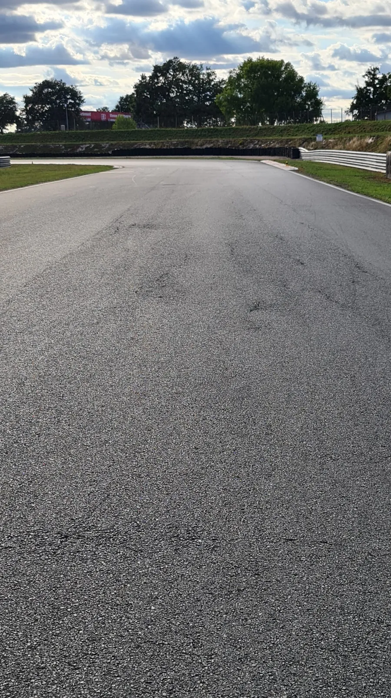

On est au début du vibreur. On a freiné sans rentrer de rapport. On est en 3. On rentre avec de la vitesse et on commence la mise sur l'angle dès qu'on arrive au niveau vibreur en faisant l'effort de rester large car le point de corde qu'on va aller chercher à gauche, à l'intérieur est très tard. Faut être rapide et incisif. Genou au sol au début de la mise sur l'angle.

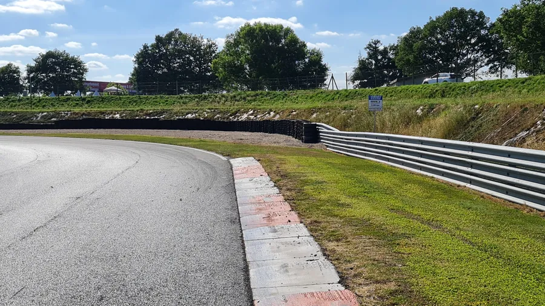

Cela n'a rien à voir avec les trajectoires... C'est juste pour confirmer qu'au Vigeant les vibreurs sont des vibreurs d'hommes (ou d'hommes qui roulent en caisse) et qu'à moins de vouloir y laisser une rotule, on a tout intérêt à ne pas y toucher. Bon, les instructeurs de DRRS et autres te disent qu'il faut y aller, que ça ne risque rien... Mouai... Ceci explique sans doute pourquoi je paie pour aller en stage alors qu'eux on les paie pour y participer 😉

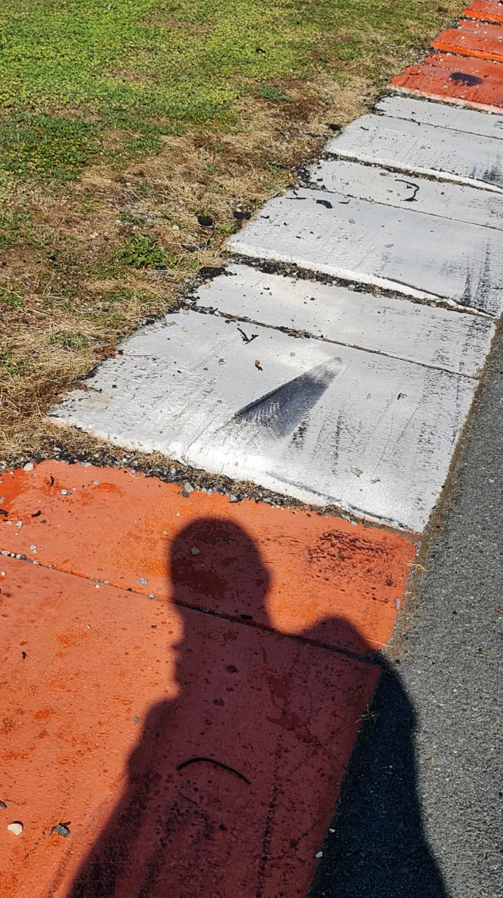

Faut rester large... Pour être complet, j'ai entendu une autre version qui dit : tu arrives mi-piste, tu claques la moto à la mise sur l'angle, genou au sol et tu colles la corde le plus vite possible. L'idée étant sans doute de bien rester à gauche à la sortie, d'accélérer fort sans trop s'écarter dans le bout de ligne droite qui suit et de rentrer très fort dans le double droit qui suit (Le Trop Vite). À voir... Pour l'instant on va rester en mode "académique".

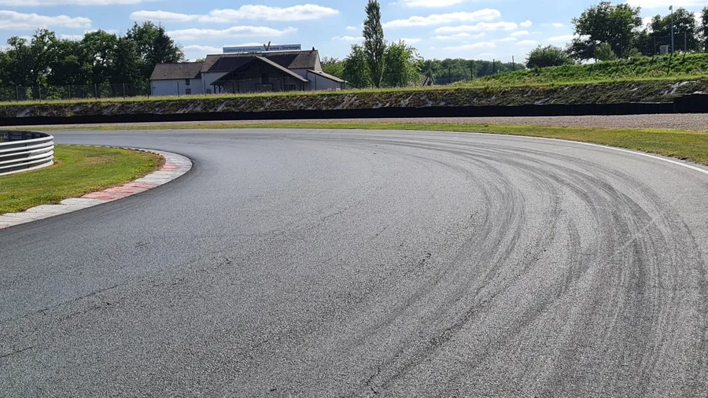

Faut rester large...

Le point de corde est très tard (6eme vibreur rouge). Ensuite il faudra faire l'effort, encore une fois, de ne PAS s'écarter de trop, d'accélérer et de rester mi-piste (faut donc regarder à gauche et tirer fort sur le bracelet de gauche pour redresser la moto rapidement).

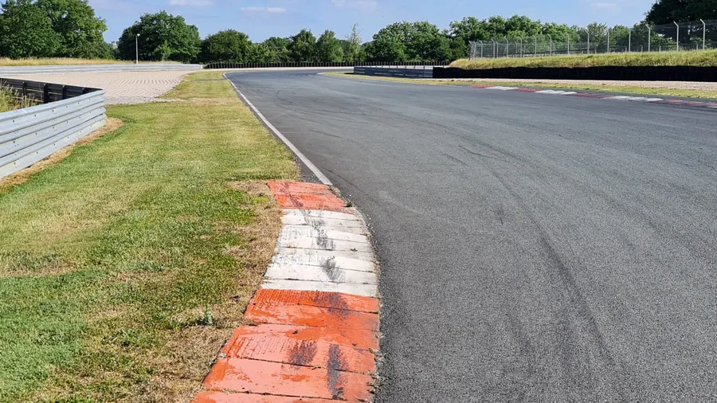

Au sol il y a une espèce de marque/rainure qui sépare la piste en deux. Il faut s'en servir comme repère à ne pas dépasser et accélérer fort et se diriger vers la gauche de la piste (au 3/4, pas tout à gauche).

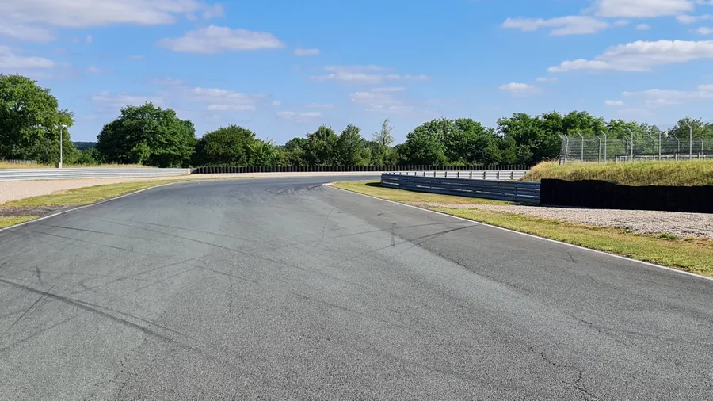

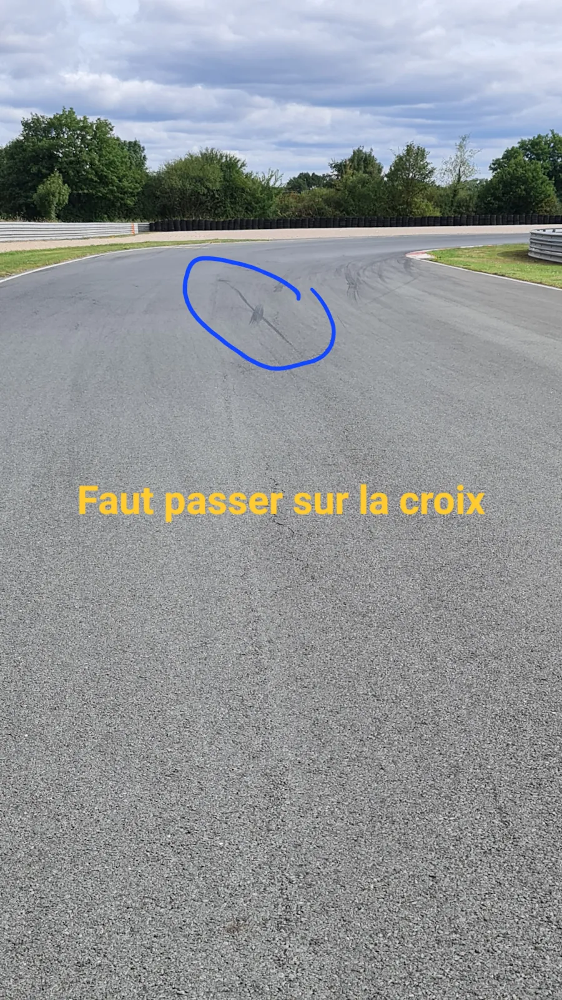

Photo de 2022. Bien sûr, la marque va disparaître un jour ou l'autre

Les 2 virages à droite qui suivent sont très importants car ils conditionnent la vitesse dans la prochaine longue ligne droite. On est sorti mi-piste puis on arrive à la hauteur du PMSA en étant 3/4 piste à gauche. On est parallèle à la bande blanche. On arrive vite et on ne freine pas. On coupe en mettant la moto très rapidement sur l'angle puis filet de gaz à partir du premier PC pour s'écarter vers l'extérieur. L'idée est d'enchaîner les 2 virages en un seul. La moto ne doit pas se relever. On passe donc les 2 virages avec le même angle, en une fois. Si on était en Snowboard, au sol on ne devrait voir qu'une seule belle courbe, bien coupée, entre les 2 PC.

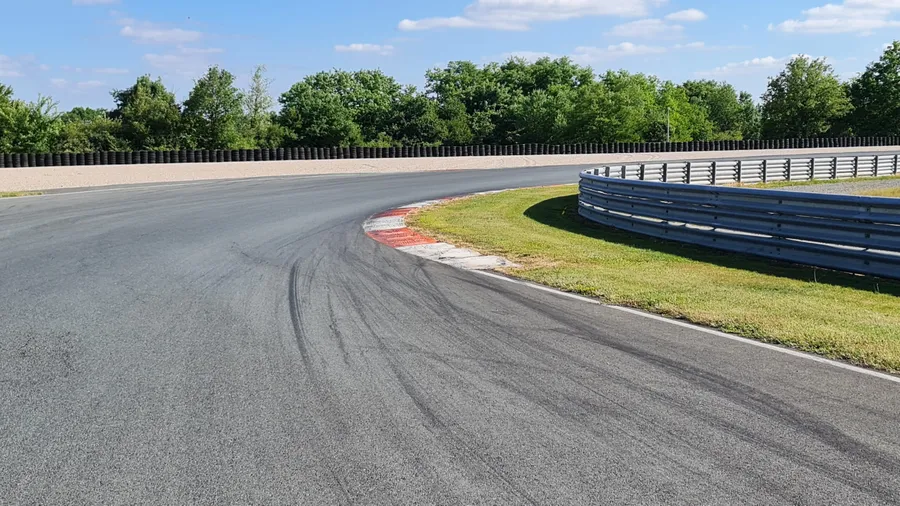

### La remarque de Gregg

Non, je ne connais pas personnellement Gregg Black et non il ne participe pas officiellement à la rédaction de ce billet mais il est le bienvenu. Quoiqu'il en soit, lors du roulage Box23 des 27 et 28 mai 2023, le matin, il a animé un atelier "position". À un moment on a pu le faire parler des rapports qu'il utilise dans certaines sections du circuit. J'indique simplement ici ce qu'il nous a dit. Après, bien sûr, il faut avoir le niveau pour pouvoir mettre en application...
"Je rentre en 3 dans le double droit avant la ligne droite pour avoir beaucoup de vitesse et ne pas être trop ralenti par de frein moteur de la 2".

Le 1er point de corde est au 3eme vibreur blanc PAS au deuxième (voir les traces au sol). Ci-dessus le 2eme vibreur blanc c'est ce que j'appelle la "pointe" du virage. En général, la pointe d'un virage n'est PAS son PC.

Ensuite il faut viser le début de la bande verte au fond à gauche et un peu avant ça le menton doit s'orienter vers le second point de corde sinon on va finir dans les graviers. Oui, oui je confirme ça sent le vécu 🥴. Ce n'est pas facile car d'un côté il faut rentrer vite, se faire confiance, laisser la moto s'écarter et de l'autre il ne faut plus regarder où on va pour pointer du menton le second point de corde. Engagez-vous qui disait, engagez-vous !

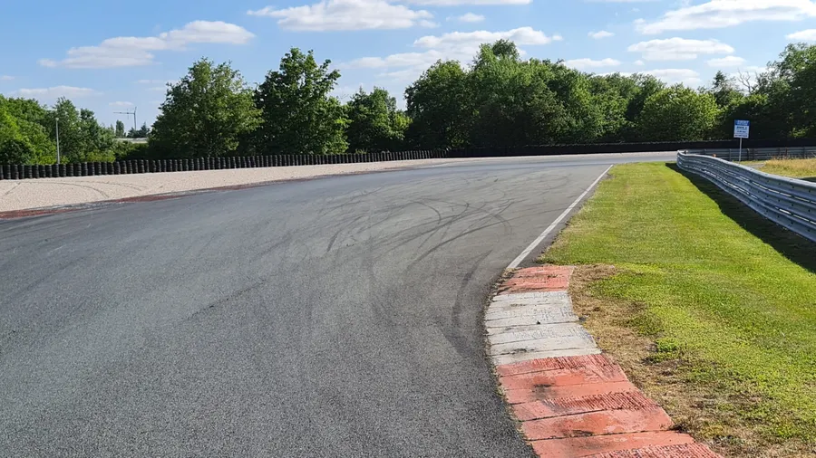

Faut laisser la moto s'écarter, se faire confiance, garder un même angle et aller à la ligne blanche. C'est là que se trouve notre point pivot (PV).

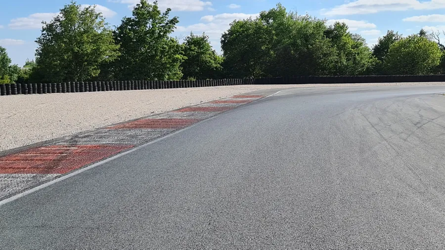

Il ne faut pas craindre d'aller trop loin car aller jusqu'à la bande blanche de gauche c'est vraiment ce qui ouvre le virage à venir et c'est ce qui nous permet de mettre les roues de la moto dans la bonne direction au prochain PC. Bref, il est important de pas être timide ici.

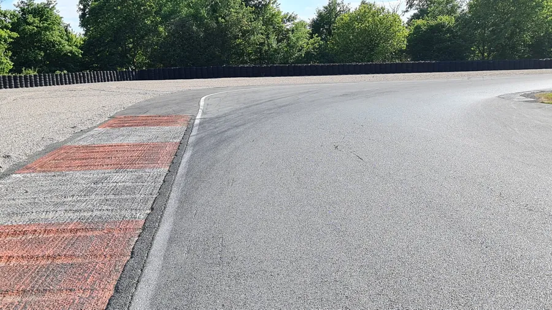

Le PC du second virage c'est le milieu du prochain vibreur (fin du premier vibreur rouge). La piste est un peu tassée à cet endroit. Normalement on le sent dans les fesses quand les pneus passent pile poil là où il faut.

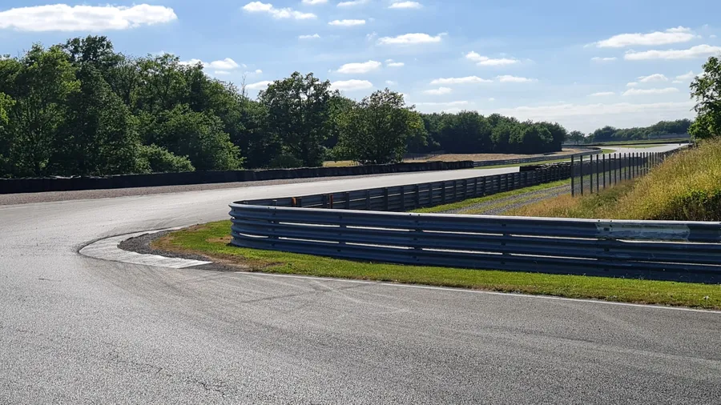

Gaz à fond au PC. Au fait, tu es sûr que tu es bien en butée d'accélérateur ? Encore une fois, ne le prenez pas mal, beaucoup de ce type de remarques sont surtout pour moi 🥴.

Pour pouvoir être 100% gaz au PC il est très important, qu'au PC, les roues soient bien orientées dans la direction de la fin du vibreur extérieur. Autrement dit il faut que le boulot ait été fait au PV précédent.

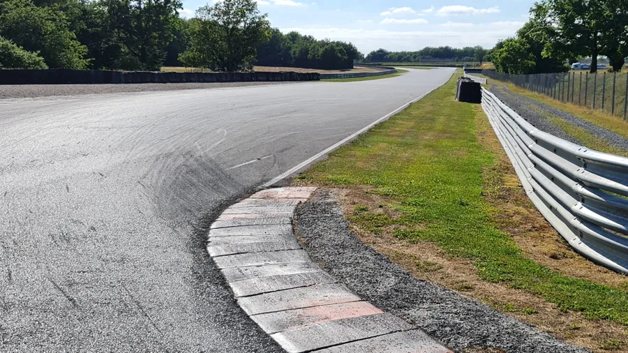

Laissez la moto écarter sa trajectoire du fait de l'accélération. Utilisez toute la piste jusqu'au vibreur.

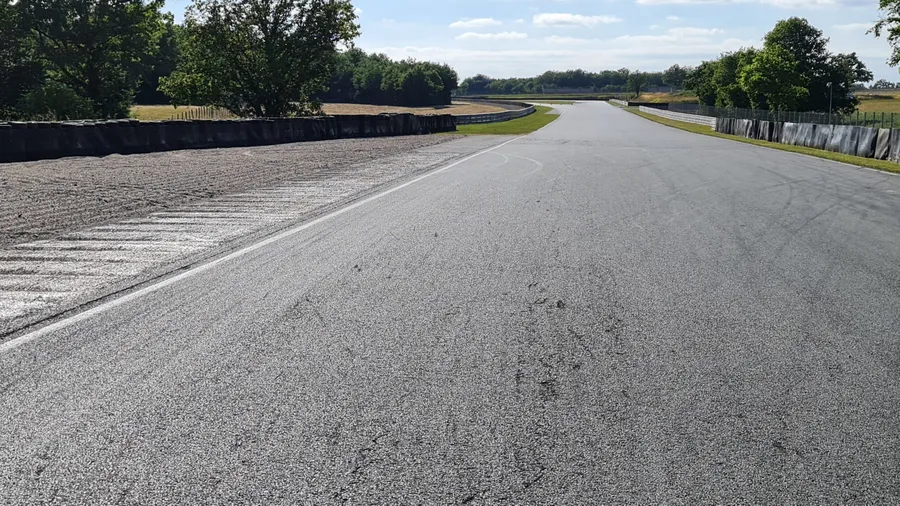

Ça c'est quand on regarde en arrière, là d'où on vient.

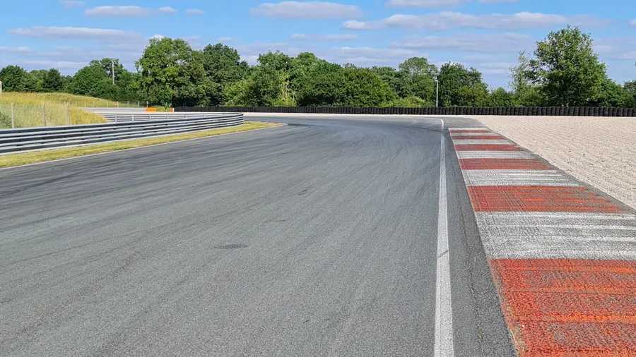

Si on n'est pas 100% gaz, enroule, enroule, enroule. On s'écarte, certains choisissent de passer entre la ligne blanche et le vibreur. Ne pas hésiter à bien tendre la trajectoire, à aller tout bout jusqu'à la partie en terre. Certains roulent sur cette dernière. Heu... Non, non, pour moi ce sera sans façon.

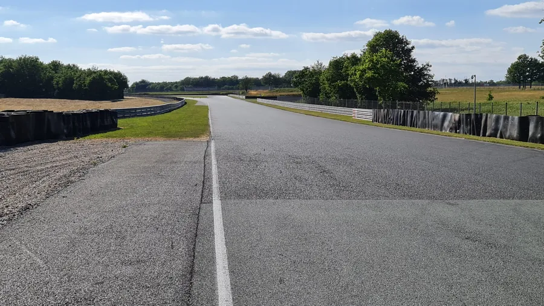

Faut ensuite viser le fond et la droite de la piste. Et... Et c'est déjà la fin de cette première partie.

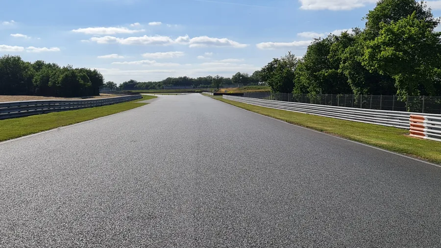

La [seconde partie]() est ici.

Bon, allez, la suite au prochain numéro. D’ici-là relisez les [notes de pilotage]() ou faites des squats afin de préparer les prochains roulages

<iframe width="560" height="315" src="https://www.youtube.com/embed/TIhtpItTuxc?si=qL84DxP-ejd_Yi4-&amp;start=53" title="YouTube video player" frameborder="0" allow="accelerometer; autoplay; clipboard-write; encrypted-media; gyroscope; picture-in-picture; web-share" referrerpolicy="strict-origin-when-cross-origin" allowfullscreen></iframe>

