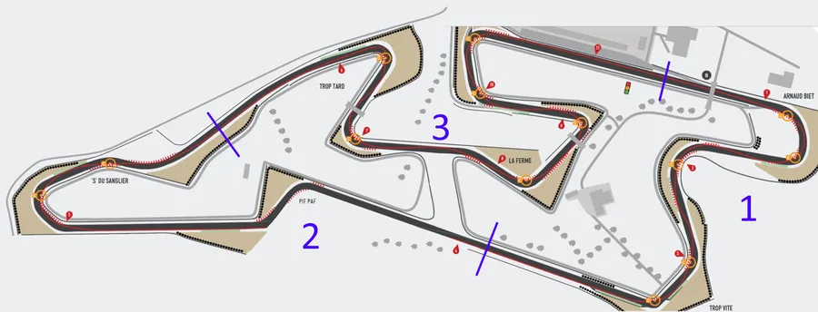
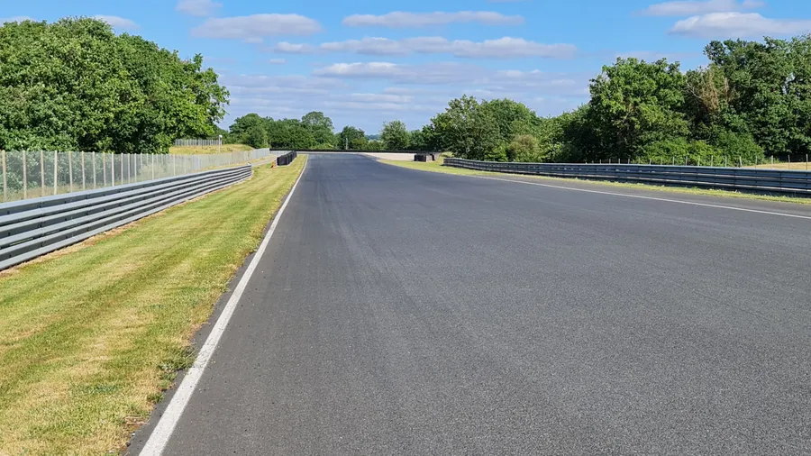
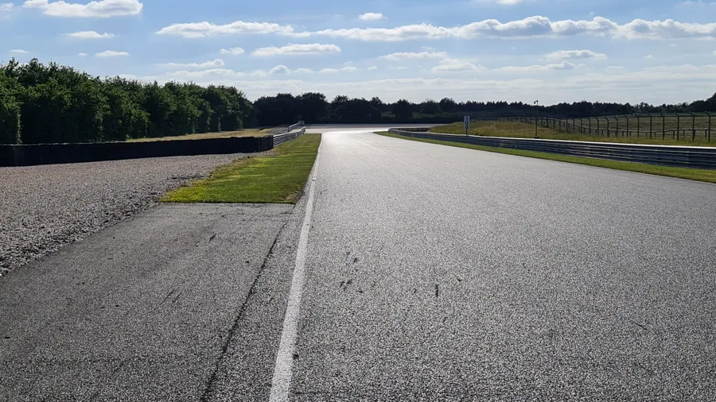
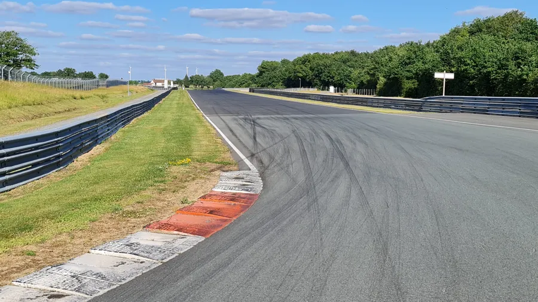
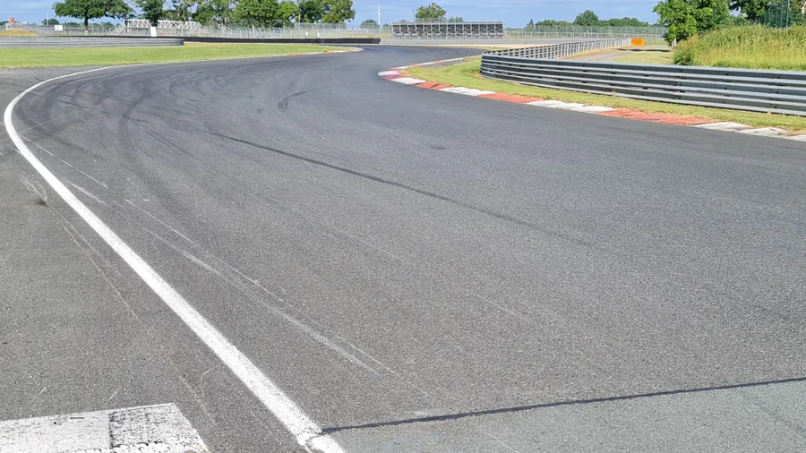

# Le Vigeant 2

C'est le deuxième volume de cette trilogie romanesque qui va nous amener du milieu de la ligne droite du fond à la ligne droite qui mène au Trop Tard.

Si besoin le [premier épisode]() est ici.

On s'était arrêté là, la dernière fois. On sort du Trop Vite, faut viser au fond et à droite de la piste. On enroule, on enroule, on enroule. J'en parle ici parce que l'on a le temps. Il faut profiter de la ligne droite pour respirer et s'assurer qu'on fait rouler l'accélérateur sous nos doigts (le contraire de : "je suis tout rouge et j'essore la poignée d'accélérateur qui ne m'a rien fait"). J'en parle dans [cette page]().

On reste à droite. À 1 cm de la ligne blanche. En tout cas personne ne doit être capable de passer entre nous et la ligne. 1 cm c'est bien. Bien sûr, on est 100% gaz. On est d'accord ?

Je colle la ligne et je suis en 5 quand j'arrive au PF.

Ça, c'est quand on regarde d'où on vient. On est bien à droite. Pas à 1 m mais plutôt à 5 cm de la ligne blanche.

Quand je suis en forme, mon repère de freinage c'est le poteau de la caméra qui est après le 200. J'accroche donc du regard le panneau 200 (c'est plus facile, il est bien plus visible) puis j'accroche le poteau de la caméra. C'est évident mais je vais le dire quand même. Je repère le poteau de la caméra. Je ne le vise pas. Je n'ai pas envie de me mettre au tas bêtement. Bref, on sait qu'il est là et on se rapproche. Ici je rentre 2 rapports, je me retrouve en 3 pour passer le Pif-Paf.

Août 2023 : le poteau à 200 m est toujours là mais le panneau 200 a disparu.

### Question

Après réflexion, je me demande si je n'ai pas un faux souvenir ou si je ne fais pas une bêtise en ayant un point de freinage aussi loin. Je vais mettre ça sur ma TO DO liste la prochaine fois que je vais au Vigeant. J'ai l'impression que le point de freinage c'est 200 m. À vérifier. Si un expert veut bien donner son avis dans les commentaires je suis preneur.

### Réponse

En discutant avec certains, j'ai entendu l'explication suivante. À 200 m j'approche les plaquettes et je fais le transfert de masse. Au poteau de caméra je freine fort. Si un expert peut confirmer/infirmer dans les commentaires, ce serait sympa.

Je freine en restant bien à droite et je vise le panneau 100m

Là, on est au panneau 100m et on regarde derrière nous.

### La remarque de Gregg

Voir la "Remarque de Gregg" dans la section 1 si besoin. "Je passe le pif-paf en 3 car je n'ai que 2 rapports à rentrer lors du freinage. En plus, au bout de la ligne droite en sortie du Paf je n'ai qu'un rapport à rentrer et c'est plus simple.".

C'est l'entrée du pif-paf. Le plus important c'est de favoriser la vitesse à la sortie du Paf. Pour cela on va un peu "sacrifier" notre vitesse d'entrée, en rentrant tard et en faisant l'effort de rester collé à gauche entre le Pif et le Paf. L'idée c'est d'élargir au maximum l'entrée du Paf pour favoriser notre vitesse de sortie.
Bon allez, mise sur l'angle rapide au niveau du début du vibreur.

Je vise la corde sans plonger complètement dessus. On peut commencer la mise sur l'angle en visant à 1 m de la "pointe" du vibreur par exemple.

Ensuite je vise la corde

J'ai passé la "pointe" du vibreur. J'ai mon point de corde très tard. Je sais que je vais rouler dessus. Je lève mon menton, je ne regarde pas encore le vibreur du Paf, mais plutôt la fin du vibreur à gauche. Vraiment, je fais l'effort de regarder à gauche. Je n'ai pas de chiffres précis mais ça dure 1/10 de seconde. L'idée c'est de laisser la moto bien à gauche pour m'élargir l'entrée du Paf. La moto doit être verticale avant la fin du vibreur de gauche. Je ne souhaite pas dépasser la moitié de la piste trop tôt. Je veux au contraire m'élargir au maximum l'entrée du Paf.

Je reste à gauche et j'accélère pour aider la moto à se relever.

Ça, c'est si on regarde derrière nous la sortie du Pif.

Le point de corde du Paf est loin. Sur le bitume, je vise l'espèce de raccord entre les pistes (celle sur laquelle on est et celle qui arrive par la gauche et qui est utilisée par les voitures). De toute façon il y a beaucoup de traces au sol. Je suis lite sur les fesses, comme un jockey sur un cheval de course. Je ne touche pas la selle. Je passe de gauche à droite très rapidement en m'aidant du genou droit qui appuie sur le réservoir et ramène toute la viande (mon corps quoi !) du bon côté.

Je vise le raccord

Je sais que je vais passer sur le point de corde, je regarde dès lors, très loin à gauche de la piste les glissières (ça tend la trajectoire). J'ouvre en grand en repoussant la moto avec le bras extérieur qui est tendu sur le réservoir et en tirant sur le bras intérieur qui est plié. Je veux mettre rapidement la moto verticale pour accélérer fort car c'est une ligne droite dont je veux tirer parti.

Ça, c'est si on regarde derrière vers la sortie du Paf

Je garde la fesse droite sortie. Je m'écarte à gauche car j'accélère fort et je souhaite élargir l'entrée du prochain virage (Le Buisson)

On regarde derrière et on s'éloigne de la sortie du Paf.

On regarde derrière et on s'éloigne toujours de la sortie du Paf.

On arrive vite, très vite à l'entrée du Buisson. Je ne remonte pas sur la selle. La fesse droite est sortie, la tête est dans la bulle, le menton sur le réservoir, je suis de travers sur la moto. Le plus dur c'est d'avoir une marque de freinage fixe. J'avoue j'ai un trop souvent tendance à remonter sur la selle...

Pour finir, à pied, j'ai repéré une marque de peinture noire sur la glissière de gauche, peu après le panneau 100m qui lui est à droite. Ce n'est vraiment pas top car elle est petite et c'est du noir sur du gris. Enfin bref... Sur 1 ou 2 tours le matin il faut faire l'effort de la repérer en roulant pas trop vite. Ensuite ça va à peu près. Heu... Cela dit, parfois je la loupe...

Quand je freine, je change de direction (un peu comme le tout premier virage), j'essaie de rester droit pour favoriser le freinage.

Je vois le début du vibreur mais je ne le vise pas. J'essaie de viser à 1 mètre à gauche de la "pointe" du vibreur.

Ça c'est quand on regarde derrière nous.

Encore une vue vers l'arrière

Vue vers l'arrière alors qu'on continue à avancer dans le virage. Ça ressemble à un parking ou un tarmac d'aéroport au choix, tellement il y a de bitume et d'espace à cet endroit-là.

On avance toujours dans le virage. Pour être honnête, j'ai un peu de mal à savoir précisément quand faire pivoter la moto. Finalement, je crois que je déroule la check-list suivante :

* À l'entrée, je vise un point à 1 m du vibreur

* J'avance sur le "parking"

* Mon menton et ma tête sont bien tournés vers la droite

* Dès que je vois la moitié du second vibreur à droite

* Je fais pivoter la moto avec un coup de menton

* Je vise alors la fin du vibreur de droite pour y trouver mon point de corde

Là, j'avance sur le "parking"

Là, j'ai repéré la moitié du vibreur (c'est un peu plus sombre sur le bitume, au niveau d'un des vibreurs rouge)

Je fais pivoter la moto en donnant un coup de menton (ça fait tourner la tête, les épaules et la moto). Alors que je me rapproche du vibreur, je vise la toute fin de ce dernier. Quand je suis sûr que je vais rouler dessus, je lève le menton et les yeux et je fixe le poteau blanc (un poteau de caméra je crois).

Je ne regarde plus que le poteau et normalement on est full gaz. Normalement...

Vue lorsqu'on regarde en arrière.

Je lâche très vite le poteau et je vise le bout du vibreur pour élargir au maximum l'entrée du S du Sanglier. J'accélère fort depuis le point de corde précédent. La moto s'écarte naturellement vers l'extérieur et je garde la fesse droite sortie car on va repiquer à droite. J'essaie de passer la 3 quand je suis à la moitié du vibreur et la 4 à la fin du vibreur avant de plonger à droite.

Vue de la sortie du Buisson quand on regarde derrière.

On est tout au bout vibreur, tout à l'extérieur et à l'entrée du S du Sanglier. J'ai passé la 3 et la 4 ([short shift] NOT YET TRANSFERED (https://www.40tude.fr/pilotage-moto-10-short-shift/)).

On est toujours au bout du vibreur. C'est la vue si on regardait derrière nous la sortie du Buissons

C'est un S. On va donc "sacrifier" un peu l'entrée pour favoriser la vitesse de sortie. On rentre donc large et il faut que j'aie passé la 4 avant d'atteindre le vibreur car après je vais être sur l'angle à gauche et ce sera beaucoup moins facile.

On reste collé au vibreur pour élargir l'entrée du virage suivant.

On rentre mais sans se jeter à la corde. Attention le matin ça peut partir en vrille car pour arriver là on a fait plus de virages à droite qu'à gauche. Le côté gauche des pneus peut être plus froid. En plus la piste est en devers vers l'extérieur (negative camber ou off-camber, ça, ça claque si tu peux le placer dans un repas de famille). Donc, si on coupe accélération ça va rajouter de la charge sur le côté gauche... Pas nécessairement une bonne idée.

Dans le S, on passe rapidement d'un côté à l'autre sur la moto. Comme un jockey sur la selle et pas comme un sac de patates. En tout cas c'est sûr on ne passe pas par le milieu de la selle.

On rentre dans le Paf mais sans se jeter à la corde (oui je sais c'est la deuxième fois que je le dis).

Le point de corde est très tard. Là, je vise le dernier arbre, le tout petit, celui qui est en ligne avec la pointe du virage, celui qui est au milieu de la photo.

Je sais que je vais rouler sur le point de corde qui est très tard, mon regard passe de l'arbre à l'extrémité de la ligne noire de pneus et/ou à la pointe du virage suivant qui est un petit peu plus loin que la fin de la ligne de pneus. Tout ça c'est virtuel. En fait, c'est comme à Carnac, je cherche des alignements.

Vue arrière. On sort très tard avec une trajectoire tendue pour accélérer fort.

J'enroule. À droite, je vise le bitume au bout de la ligne de pneus et au-delà je commence à accrocher les 2 "points blancs" qui sont très loin dans les arbres. Ils sont au centre de la photo, dans l'axe de la pointe du virage à venir. Je tire une droite, la moto est verticale, j'enroule, j'enroule, j'enroule et idéalement je sors ma fesse droite avant les pneus.

Je tire tout droit vers les 2 points blancs au fond et en passant par le bout de bitume au niveau de la fin des pneus. Une ligne droite.

Pareil

Vue quand on se retourne. Dans ma tête, c'est vraiment une ligne droite.

On va arriver au bout des pneus. C'est mon repère de freinage pour le prochain virage. Entre temps j'ai lâché du regard les 2 carrés blancs et je vise dorénavant le point de corde au niveau des pneus et beaucoup plus loin, la section blanche/claire qui est, en effet, très très loin.

Hé... Mais c'est déjà la fin de cet opus ? Ils vont se marier ? Ils vont avoir des enfants ? Le suspense est insoutenable ! Du calme petit padawan, le [troisième épisode]() est ici.

Bon, allez, la suite au prochain numéro. D’ici-là relisez les [notes de pilotage]() ou faites des squats afin de préparer les prochains roulages

<iframe width="560" height="315" src="https://www.youtube.com/embed/TIhtpItTuxc?si=qL84DxP-ejd_Yi4-&amp;start=53" title="YouTube video player" frameborder="0" allow="accelerometer; autoplay; clipboard-write; encrypted-media; gyroscope; picture-in-picture; web-share" referrerpolicy="strict-origin-when-cross-origin" allowfullscreen></iframe>

