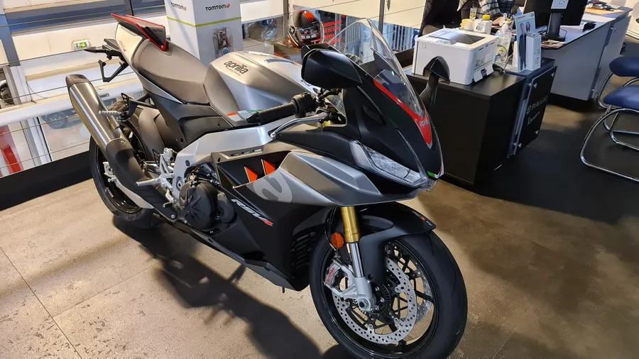

# 2021 - Choisir sa moto pour la piste

## Introduction
Cela fait 3 ans que je tourne avec [Kawette sur circuit] NOT YET TRANSFERED (https://www.40tude.fr/category/zx6r-sur-circuit/). Elle est vraiment top et franchement je recommande à ceux qui veulent passer sur piste de démarrer avec ce type de moto (moto prête pour la piste, 600, japonaise etc.) J'ai déjà expliqué mon choix à l'époque sur [cette page](). Cela dit, depuis la fin de saison dernière, j'ai envie de passer à autre chose :

* Changer de moto car cela va m'obliger à me comporter différemment. Certains ont vraiment progressé en changeant de bécanne.
* Rouler en 1 000 sur circuit. Je n'ai pas le niveau, je m'en fou, je ne l'ai jamais fait, je veux voir ce que cela va donner... C'est complètement irrationnel, je sais, mais bon je reviendrai sans doute en 600 plus tard. N'empêche, je me pisse un peu dessus quand j'y pense...
* Je ne veux toujours pas d'Italienne. "Ducati boite à outils" qu'ils disent...
* Passer à une moto un peu plus moderne : shifter up et down, drive by wire, embrayage anti-dribble, calculateur et assistances, etc.
* En fait, c'est simple, ce que je veux, c'est une R1. J'adore le son du moteur crossplane le soir au fond des bois. C'est une Yam donc il n'y a pas de problème. C'est une Yam donc il y a une énorme communauté, des pièces à foison, des polys, des forums, des manuels d'entretien au format pdf, gratuits et disponibles en ligne... En plus, c'est ce sur quoi roulent les instructeurs lors des stages DRRS et quand on sait piloter, nom de Zeus, ça envoi.
* ...

Ensuite, afin de faire un point sur l'état de l'art et confirmer le choix de la R1, je commence à faire quelques vérification sur YouTube. Par exemple j'ai regardé ça :

<iframe width="560" height="315" src="https://www.youtube.com/embed/9HHMCcGkFvI?si=JuxHDJpGU59iRXIO" title="YouTube video player" frameborder="0" allow="accelerometer; autoplay; clipboard-write; encrypted-media; gyroscope; picture-in-picture; web-share" referrerpolicy="strict-origin-when-cross-origin" allowfullscreen></iframe>

Puis encore ça

<iframe width="560" height="315" src="https://www.youtube.com/embed/yJSKmn4ooNg?si=YkzzlE5oU3bEeQbF" title="YouTube video player" frameborder="0" allow="accelerometer; autoplay; clipboard-write; encrypted-media; gyroscope; picture-in-picture; web-share" referrerpolicy="strict-origin-when-cross-origin" allowfullscreen></iframe>

Bon, après, y a 2 millions de vidéos de ce type alors j'ai pu passer quelques nuits sur le sujet. Quoiqu'il en soit, fin 2021, voilà ce que j'ai retenu :

* En neuf, on parle d'un truc autour des 20 k€. Ça pique... Heureusement il y a Le Bon Coin je trouverai bien une occasion.
* Le niveau des ventes des motos sportives est confidentiel et malgré tous les articles et les sujets qui traitent de ce type de motos... Elles ne se vendent tout simplement pas. Trop chères à l'achat, trop chères à assurer, trop extremes pour pouvoir vivre avec tous les jours... Leur place est sur piste. Point.
* Toutes ces motos sont très au-dessus du niveau du "pilote moyen". Autrement dit, lors des journées de roulage, n'importe laquelle d'entre elle est capable de claquer une pendule sous réserve que le pilote soit à la hauteur. Pour s'en convaincre, il n'y a qu'à voir, revoir et re-revoir la série des vidéos de l'excellent [Sylvain Guintoli](<https://www.youtube.com/c/SylvainGuintoli50>).
* Y a quand même un trio de tête : BMW, Ducati et Aprilia (ce n'est pas dans un ordre particulier)
* Y a les autres : Honda, Yamaha, Suzuki et Kawa. Là aussi ce n'est pas dans l'ordre. Il n'y a rien de rédhibitoire. Ce sont toutes les 4 de très bonnes motos largement au dessus du niveau du pilote moyen qu'on retrouve en journée de roulage . Ils se trouve juste que les autres ont progressé et elles moins (il n'y a qu'à voir les non-évolutions de la Suz ou de la R1 par exemple)

Après, c'est simple, Ducati et BMW je n'ai pas les moyens d'acheter ni d'entretenir. Oui, oui BMW commence à 18 k€ (quand même) mais dès que tu regardes les options tu es rapidement très au-dessus des 20 k€ (et je ne parle même pas des jantes carbones). Bon, je veux toujours une R1 mais jetons quand même un oeil sur Aprilia qui est dans le trio de tête et que je ne connais pas.

Du coup j'ai regardé ça

<iframe width="560" height="315" src="https://www.youtube.com/embed/SztLUUON0Pc?si=61njhlSQ4WickPyn" title="YouTube video player" frameborder="0" allow="accelerometer; autoplay; clipboard-write; encrypted-media; gyroscope; picture-in-picture; web-share" referrerpolicy="strict-origin-when-cross-origin" allowfullscreen></iframe>

Et puis encore ça.

<iframe width="560" height="315" src="https://www.youtube.com/embed/wDjGAwqDUy4?si=i5M0FT8z82h4D4DW" title="YouTube video player" frameborder="0" allow="accelerometer; autoplay; clipboard-write; encrypted-media; gyroscope; picture-in-picture; web-share" referrerpolicy="strict-origin-when-cross-origin" allowfullscreen></iframe>

Dans la seconde vidéo, j'ai, entre autres, apporté une attention particulière aux remarques de la toute fin de vidéo où il parle des suspensions numériques comparées aux suspensions analogiques sur circuit et où il indique dans quoi il investirait son propre argent. J'avais entendu une remarque similaire des mecs de HighSide à propos de la R1M et de la R1 et où pour la différence de prix ils préféraient acheter une R1 et lui coller des Ohlins de haut vol.

À ce stade, dans ma short list il ne reste plus que la R1 et la RSV4 toutes les deux en suspensions analogiques. Petite vérification des nouveautés du salon EICMA 2021. À priori il n'y aura pas de nouveau modèle de R1 ni de RSV4 en 2022 (côté Piaggio il y aura une version noire et or que je ne trouve pas particulièrement belle d'ailleurs, mais bon, rien de bien révolutionnaire)

On est première semaine de décembre 2021. Petit coup de téléphone chez [Rosny Yam](https://www.rosnyyam.com/) pour connaître les délais de livraison. On ne m'annonce rien avant fin mars 2022 à cause du COVID, la pénurie des composants, patati, patata. "Mais bon pas de problème je me renseigne plus précisément et je reviens vers vous par mail...". 

À l'heure où je rédige ce billet on est fin décembre et j'attends toujours le mail en question. Ils gagnent trop d'argent ces commerciaux... Faudra pas qu'ils se plaignent le jour où [Eric de Seynes](https://www.linkedin.com/in/eric-de-seynes-8b76431a9/?originalSubdomain=fr) va revoir les plans de comm' 😁. 

Comme je ne connais pas du tout Aprilia je vais voir ce qu'il y a chez [Paris Nord Moto](https://parisnordmoto.com/). Là, je trouve une RSV4 Factory d'occase et une autre neuve et encore une autre en version standard.

Bien sûr je crée des alertes sur Le Bon Coin. Quitte à changer, autant partir sur une moto récente et donc les alertes concernent des véhicules de l'année (oui, oui, ça sent le gars qui veut se faire plaisir...). 

Je retrouve sur LBC la Factory de Paris Nord Moto. C'est toujours pareil, sur LBC, je trouve que les motos sont assez chères (quand c'est un pro qui vend je n'en parle même pas). Est-ce que les vendeurs montent les prix car ils savent qu'ils vont devoir négocier ? Je ne sais pas, mais cela ne me parait pas très sain.

D'autre part, je suis estomaqué par le kilométrage très faible de ces motos : 2 000, 1 500, 1 200... Très peu de motos de l'année ont 3 000 km. Dans ces conditions j'ai du mal à croire que les rodages ont été effectués correctement et que les gars (et c'est logique) n'aient pas été tenté de pousser les moteurs. 

Bref, à ce stade de ma réflexion je me fais un peu peur vis à vis de la mécanique et, toujours à propos des modèles 2021, quand je compare le prix de l'occasion et le prix du neuf, je trouve qu'il n'y a pas tant de différence que ça.

Là-dessus je pars en déplacement pro une semaine à l'étranger et quand je reviens la RSV4 Factory d'occasion de Paris Nord Moto est partie. Y a une R1 que j'avais repérée sur LBC, dans l'Est de la France qui est partie aussi. Toujours pas de nouvelle du commercial de Rosny Yam...

Finalement, voilà le modèle que j'ai commandé le 23/12/2021 chez Paris Nord Moto 😉

Normalement je vais la chercher demain. Elle est neuve et full stock. Pas une option, pas une pièce en plus... Voilà le programme des jours, semaines et mois à venir :

* Aller la chercher (j'ai trop, trop hâte...)
* Rodage sur route (au passage l'assureur ne m'a pas loupé...)
* Au moins 2 500 km de rodage. Sur les forums tout le monde dit 1 000 km, la doc Aprilia dit 2 000 (p 193 du use+maintenance book). Bon, ben moi ce sera 2 500 km. Voilà le programme :
  + 1 000 km 7 500 tr/min max. (Révision des 1 000 km pour virer la première l'huile)
  + 1 250 km 8 000 tr/min max.
  + 1 500 km 8 500 tr/min max.
  + 1 750 km 9 000 tr/min max.
  + 2 000 km 9 500 tr/min max. (Voir le "use+maintenance book" p 193)
  + 2 250 km 11 500 tr/min. max.
  + 2 500 km 13 500 tr/min max.
* Eviter de perdre des points pendant le rodage 😡
* Participation à des roulages à partir de fin mars (le premier ce sera le 27 normalement)
* Je vais me faire une "Guintoli replica". Oui, oui, je sais, je n'ai pas son niveau mais en gros ça veut dire que je vais venir avec la moto sur la remorque avec ses rétros, ses clignotants, sa plaque... Full stock.
* Ensuite et seulement ensuite, en fonction des roulages et des besoins je vais peut-être :
  + Suspendre l'assurance (ouf!)
  + Enlever les rétros (et les clignotants), les cale-pieds passager...
  + Ajouter un chrono
  + Mettre des polys, un protège réservoir...
  + Grip sur le protège réservoir
  + etc.

Encore une fois... Quand je vois mon niveau et ce qu'arrivent à faire les instructeurs des stages avec des motos complètement d'origine... Je me dis que j'ai tout intérêt à investir dans des stages de [pilotage] NOT YET TRANSFERED (https://www.40tude.fr/category/pilotage-moto/) et des pneus plutôt que dans de l'accastillage "racing".

La vidéo ci-dessous me parait emblématique de ce que j'essaie de faire passer. Même s'il y a déjà eu quelques modifications sur la moto, il faut juste regarder la difference de vitesse de passage par rapport aux autres pilotes (nous). C'est édifiant. Par exemple à **1:43** on voit bien que le gars essaie de rattraper son retard au freinage mais... Il se loupe complètement à la sortie. On l'a tous fait... Moi le premier...Bref  vaut mieux que j'investisse dans la formation du bonhomme que dans les accessoires de la miss. 

<iframe width="560" height="315" src="https://www.youtube.com/embed/Lvf-J-2HWTU?si=5Nab7fZXb7JH57Yp&amp;start=77" title="YouTube video player" frameborder="0" allow="accelerometer; autoplay; clipboard-write; encrypted-media; gyroscope; picture-in-picture; web-share" referrerpolicy="strict-origin-when-cross-origin" allowfullscreen></iframe>

Bref, en cette fin 2021, je me dis que tant que les trajectoires ne sont pas au top je vais éviter d'investir dans des trucs qui ne font pas baisser le chrono de manière **significative**.

Un dernier mot. Bien sûr, dorénavant c'est donc dans la section [RSV4 sur circuit]NOT YET TRANSFERED (https://www.40tude.fr/category/rsv4-sur-circuit/) que je viendrai partager mes expériences.

*Bon, allez, la suite au prochain numéro*. D'ici-là relisez les [notes de pilotage]() ou faites des squats pour préparer le ski et/ou les roulages du printemps.

