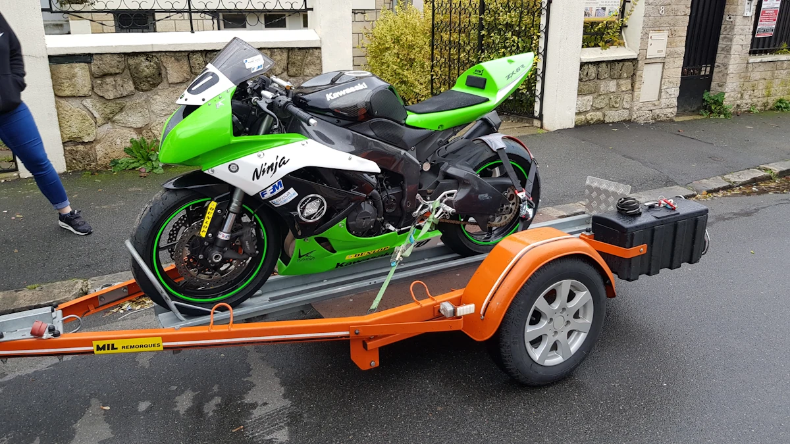

# 2018 - Choisir sa moto pour la piste

<figure style="max-width: 900px; margin: auto; text-align: center;">

<figcaption>Arrivée de ma 1ere moto de piste à la maison</figcaption>
</figure>

# Introduction

J'imagine ici qu'après un ou deux roulage avec ta moto "civile", tu as décidé d'investir dans une moto qui sera dédiée à la piste... Bienvenue au club!

Avant d'aller plus loin, tu penses qu'il va te falloir aussi un camion ou une remorque, les assurances et les lieux de stockage associées. Oui, oui on est d'accords ce sont des détails...

Ceci dit... Ceci dit, pas facile cette histoire de choix de la moto pour aller sur piste... C'est généralement une somme non négligeable. Ensuite on veut progresser côté pilotage sans passer sa vie dans le cambouis... Enfin, plus encore que lors d'un autre achat de véhicule, on est excité, anxieux, impatient... Il est donc grand temps de se calmer et de prendre du recul... Je vais donc expliquer comment ça s'est passé pour moi en espérant que ça en aidera certains...


## Partir d'une base route ou piste ?

À la suite nombreuses discussions et conseils avisés, il semble que la bonne méthode lors du choix de la moto pour aller sur piste soit d'acheter une moto déjà prête pour la piste. L'idée qui consisterait à acheter une moto de route pour la transformer ensuite en moto de piste n'est pas une bonne idée. Le problème est surtout financier car même si on pense pouvoir se refaire en revendant les pièces d'origine pour alimenter l'équipement de piste... Finalement ça coûte quand même une blinde cette histoire.

Dans mon cas ça a été vite tranché. J'ai mon permis depuis 82 et depuis j'ai eu des périodes où je n'utilisais plus de motos du tout. Après une longue interruption, finalement, l'été dernier j'ai racheté une moto de route...

Comme il est impossible dorénavant de rouler en France (l'état des routes est déplorable, ralentisseurs non conformes tous les 100 mètres, limitations à 80, les téléphones qui captent les yeux des automobilistes etc.) je décide de garder la moto "civile" et de passer sur piste.

Pour cela j'envisage d'acheter un 600 GSXR de route. L'idée est de me faire la main dessus sur route entre Novembre et Février puis de le transformer définitivement pour la piste en Mars afin d'être prêt pour les premiers roulages d'Avril.

### Merci Mr l'assureur...

Ça semblait être une idée raisonnable. C'était sans compter sans mon assureur qui a refusé de m'assurer. Moto "où vous être penché en avant, trop sportive, trop dangereuse pour vous...". J'ai vécu ce refus comme une attaque personnelle. Sérieux, je l'ai très mal pris et je suis toujours très en colère après eux. En effet, le seul accident que j'ai eu avec un Bandit 1200 c'est un père de famille qui ne m'avait pas vu, qui a déboîté sous mon nez et qui a pris 100% des tords...

Finalement je me dis que c'était peut-être un bien pour un mal. Je suis toujours très vexé et très en colère après mon assureur mais bon, quand on fait les comptes... cela aurait pas mal coûté cette histoire. Allez, à la louche :

* Polys bruts non peint = 500 € (premier prix, sans doute pas top)
* Visserie Dzus = 50 €
* Pneus = 300 €
* Protections carters = 200 €
* Durites aviation = 100 €
* Tampon de protection = 250 €

Après la liste des équipements à ajouter peut-être sans fin...Échappement, indicateur de rapport, Power Commander, Commande reculées... Là, on en est déjà à 1 500 €. Moi je préfère ne pas me faire d'illusion, je compte 3 000 €

Conclusion : à l'heure du choix de la moto pour aller sur piste il faut choisir une moto de piste.


## Quelle moto ?

On va faire simple...On est fin 2018, c'est mon avis à date, il n'engage que moi et je comprends très bien qu'on puisse ne pas être d'accord. Non, non je ne veux pas déclencher de guerre de religion, pas la peine de m'agonir dans les [commentaires](https://github.com/40tude/40tude.github.io/discussions).

* Je trouve que les CB 500 ressemblent à des ruines.
* Je ne suis pas capable de maîtriser les 200 ch d'une 1000 cc.
* Y a très peu de 300 sur piste et franchement je le regrette. Cela veut dire qu'il y aura peu de gens avec qui se comparer blablabla...
* Finalement il reste les 600 et les 750.

Ensuite, comme je ne veux pas être embêté par la fiabilité, j'élimine tout ce qui n'est pas Japonais. Finalement il reste :

* Yamaha R6
* GSXR 600 et 750
* Honda 600
* Kawasaki ZX 6R (600/636)


## Quel millésime ?

* Yamaha R6 : après 2006
* GSXR 600 et 750 : après 2004
* Honda 600 : après 2003
* Kawasaki ZX 6R (600/636) : 2003-04 ou après 2009

Bon, cela dit on va se calmer... Oui elles sont indestructibles, oui elles sont encore dix fois plus fortes que moi mais... En 2019, 2004 ça va faire 15 ans... Donc on va regarder les anciens millésimes mais faudra être prudent et/ou être sûr à 100% du gars qui va nous vendre la moto.

### Mon avis en 2 minutes

* R6 : elles sont globalement chères
* GSXR 600 : il n'y en a pas tant que ça et j'ai l'impression qu'elles sont un ton en dessous des autres. Cela dit je suis sûr qu'elle est bien plus forte que moi et/ou que je ne suis pas capable de l'utiliser à 100%
* GSXR 750 : comme il n'y en a pas beaucoup elles restent chères
* Honda : tout le monde en dit du bien. Je n'ai pas d'avis tranché
* ZX6R ouai mais pas un modèle 2003 qui reste cher. Autant prendre un truc plus récent.

À un moment j'en ai eu tellement marre que dans le cas du ZX6R et de la Honda j'ai tracé sur une feuille Excel le prix des occasions en fonction des millésimes et ce, que la moto soit dédiée à la piste ou non. Sauf erreur de ma part je crois que dans le cas de la Kawa, le jour où je l'ai fait, j'ai traité un peu plus de 100 annonces.

Ce que je remarque c'est qu'à un moment les motos de piste qui sont vieilles, sous prétexte qu'elles ont un Alfano ou une béquille de stand... ne voient plus vraiment leur prix baisser. Il n'y a plus de corrélation entre le millésime et le prix. C'est ridicule. Dans le cas des motos de route c'est plus linéaire. Le prix baisse naturellement avec les années.

### On fait comment alors ?

Autrement dit, dans nos réflexions il faut regarder le prix de la moto de piste seule puis le prix de la moto avec l'accastillage qui vient avec. Il ne faut pas se leurrer. Généralement les couvertures chauffantes ont bien vécu, les pneus pluie aussi etc. Je ne dis pas que tout est à jeter et qu'il n'y a pas de bonnes affaires à faire avec des vendeurs qui veulent simplement passer à autre chose. Je dis qu'il faut dans le prix, être capable de retrouver le prix de la moto seule et le prix des accessoires. Il ne faudrait pas surpayer une vieille moto sous prétexte qu'elle vient avec 3 couronnes et 2 pignons de sortie de boite.

Quoi qu'il en soit, à ce stade, ne me croyez surtout pas. Allez vérifier par vous-même. Google est votre ami. Allez voir les différents historiques des motos ci-dessus et/ou les fiches et les tests des années de sortie. Il ne faut sans doute pas oublier que pour une première mise sur piste, que ce soit l'une ou l'autre on ne sera pas capable de la pousser à bout. D'où l'idée de certains de partir sur des CB 500, des SV650 ou des 300 afin de privilégier le pilotage. La démarche se respecte totalement. De toute façon, le reste de la page est indépendant du type de moto.


## Le bon coin (LBC) et la recherche

Pour faire simple, j'ai essayé [Le Parking Motos](https://www.leparking-moto.fr/) et [Le Bon Coin](https://www.leboncoin.fr/). Pour finir je suis resté sur LBC où j'avais un certain nombre d'alertes qui me prévenaient par mail quand tel ou tel type de véhicule était disponible.

J'ai essayé pas mal de trucs. À un moment j'avais des alertes par marque. Ça devenait ridicule. J'ai terminé avec une seule alerte dont les critères étaient globalement les suivants :

* Recherche du mot "piste" dans le titre et rien d'autre. Tant pis pour ceux qui ne le mettent pas dans le titre de leur annonce.
* Catégorie "moto"
* 100 km ou 200 km autour de chez moi (je sais plus trop)
* Pour finir j'avais dû mettre après 2008 comme millésime
* Montant entre 3 k€ et 10 k€
* Cylindrée entre 600 et 750

Dans les résultats je vire les "pros", je crée une alarme et j'affiche en fonction des prix, de l'ancienneté des annonces etc. Quand je vois une annonce qui me plait, je clique sur le coeur et l'annonce se retrouve dans mes recherches sauvegardées. Notes bien qu'à ce stade je n'ai toujours pas lu les détails de l'annonce. J'ai juste éliminé ou sélectionné en fonction des 2 ou 3 paramètres visibles sur l'annonce.

Ensuite, à chaque fois que j'ai une mise à jour, j'ajoute (ou pas) une ou plusieurs annonces à mes annonces sauvegardées


## Gestion des annonces sauvegardées

Bon là faut être clair... Faut être dur. Une fois qu'une annonce est sauvegardée, alors faut aller lire les détails, ensuite :

* Si c'est écrit en mode SMS tu vires
* De même, si c'est très mal écrit tu vires
* Si tu as mis 200 km autour de chez toi et que franchement tu ne te sens pas de faire 2 fois 400 km pour la moto tu vires. Faudra noter dans un coin de ta tête que la limite c'est dorénavant 150 km. Je dis 2 fois 400 km car bien sûr il y aura 2 visites. Une pour voir et négocier, une seconde pour acheter et ramener.
* Si y a écrit RSV tu vires. Ça veut dire Réparations Supérieures à la Valeur. Ce n'est pas nécessairement le cas et j'ai des potes qui roulent avec des motos RSV dont ils sont très contents. Cela dit, si tu ne connais pas le vendeur et s'il est à 200 km ce n'est pas la peine d'aller chercher une épave "reconditionnée".
* Je devais bien encore avoir un ou deux critères d'élimination... À toi d'ajouter les tiens.


## La prise de contact

Si l'annonce a passé le premier filtre on peut passer à la suite et tu rentres en contact avec le vendeur via la messagerie de LBC.

### Message type

```
Bonjour,
J'ai quelques questions par rapport à l'annonce
De quand datent les photos qui illustrent l'annonce ?
Avez-vous la carte grise Française à votre nom ?
Est-ce une première main ?
Elle a XX 000 km. Savez-vous combien sur route et combien sur piste ?
Est-ce que la moto fait un bruit inférieur à 95 dB ?
Il y a bien toutes les clés ? (Les 2 clés, la plaque métallique avec le code de coupe et le cas échéant la clé maître rouge)
Est-ce que la moto a déjà chuté ?
Il s'agit d'une moto de piste mais est-ce qu'il y a un carnet d'entretien plus ou moins rempli ?
Si vous n'avez plus le carnet d'entretien est-ce que vous avez les factures des révisions et des pièces ?
Est-ce que la moto possède un power commander ou un boîtier flashé ?
Est-ce que la révision des 24 000 km a été faite dans un garage ? C'est surtout pour le réglage du jeu aux soupapes et de la synchro à l'admission que je pose la question.
Merci de prendre le temps de répondre à mes questions
Cordialement, Philippe
```
Bien sûr, le message est à adapter en fonction du contexte mais en gros ça donne une trame... Par exemple, s'il y a peu de photos il ne faut pas hésiter à en demander d'autres par exemple.

### Et ensuite?

Si le vendeur ne répond pas tout de suite faut lui accorder un ou deux jours. Ensuite je lui envoie un SMS lui demandant de lire le message sur LBC à propos de l'annonce.

En fonction des réponses (ou des non-réponses) le coup de coeur peut passer à la trappe. En revanche, si les réponses sont satisfaisantes, tu imprimes l'annonce en mode recto verso. Bien souvent tu peux n'imprimer que la première page.

Le but d'avoir une version imprimée, c'est de pouvoir comparer rapidement et d'ordonner les annonces par ordre de préférence.  C'est vraiment un truc qui manque dans LBC. Je ne comprends pas que cela n'existe pas.

Quand l'annonce est imprimée, tu recopies sur la feuille les réponses aux questions posées. Cela permettra de comparer des pommes avec des pommes. Ça aussi ça manque dans LBC. Sur des annonces qu'on a mis de côté on devrait être capable d'enrichir l'annonce avec nos propres notes.


## La gestion des annonces

On est entre nous... On ne va pas se raconter d'histoires... Dès qu'on a une annonce qui nous plais, on devient intenable, on imagine des trucs et des machins... Bref, il nous la faut, là, tout de suite, maintenant ou je fais un malheur...

Moi je dis... Tant que tu n'as pas 5 feuilles imprimées tu ne bouges pas. T'as compris ? Repeat after me : "Tant que je n'ai pas 5 feuilles imprimées je ne bouge pas". J'ai déjà fait la bêtise de m'enthousiasmer en avance de phase. Croyez-moi sur ce coup-là...

"Oui mais elle va me passer sous le nez !" Pas grave... Dans la vente comme dans l'achat il ne faut pas être pressé... Heu... Oui je sais, je suis passé par là. C'est beaucoup plus facile à écrire après coup qu'à vivre. Cela dit, l'enjeu est trop important et c'est donc là qu'il ne faut pas craquer. Il faut être persuadé que des bonnes occasions y en a eu, y en a et y en aura encore. Pas de panique Monique.

Un autre moyen de survivre... Partager son stress avec un pote, un collègue ou une épouse. Le truc c'est de prendre le temps de passer en revue les feuilles imprimées, d'expliquer le classement... De réaliser que finalement celle-ci n'est plus si attractive que ça et de la virer de la short list... De répondre à leurs questions... "Heu, dis-moi Chéri, orange fluo et vert Kermit tu le sens bien ? Non, je dis ça car sauf erreur de ma part tu n'as pas les moyens de la repeindre... Alors avec tes bottes blanches, ta combine bleue et ton casque rouge ça va peut-être, être carnaval de Rio. Je dis ça mais c'est toi qui vois mon amour."

## L'appel

Avant d'appeler c'est peut-être le moment d'aller sur le Parking Moto. Sauf erreur de ma part on va retrouver la moto. En plus, on retrouvera le prix de mise en vente initial. Ça permet de voir combien le vendeur en voulait au départ et de retrouver la date de première mise en vente.

Ça aussi c'est un truc que devrait permettre LBC. Au lieu de cela il y a des vendeurs qui tous les 2 jours enlèvent puis remettent leur annonce. C'est chi...

Toujours sur le Parking Motos on sera capable de voir combien elle est vendue en France et en Belgique par exemple. J'ai eu un cas où la moto était à 6 000€ en France et 5 000€ en Belgique... Une bonne occasion de discuter.

### Silence les gosses, j'appelle le monsieur !

Bon... On a fait le tour, on a comparé... Le budget semble correct, elle n'est pas trop loin... Allez on appelle avec la feuille imprimée sous les yeux. S'il manque des réponses à certaines questions, c'est le moment de les poser. "Heu, j'avais posé une question à propos des chutes... C'est quoi le statut ? Elle est tombée, y a des traces sur le pot, le carénage..."

C'est triste à dire mais si le mec semble "chelou" à l'autre bout de la ligne je reste poli et je m'enfuis. Pareil s'il parle trop. Idem si je ne comprends rien à ce qu'il me dit. Tout pareil si pour aller voir la moto finalement ce n'est pas si simple que ça blablabla...

Quand le RdV est pris pour la première visite et que l'adresse est connue la première chose à faire c'est de vérifier ce que dit Google. Oui, je sais, je suis parano... Cela dit, j'ai connu un vendeur "privé" qui vendait sa moto dans un local qui en fait était plus ou moins une boite d'auto-entrepreneur de restauration mécanique. Tiens, c'est bizarre c'est au nom d'un gars qui à le même patronyme mais pas le même prénom etc... Quand, en plus, le gars t'appelle la veille du rendez-vous pour te dire que la moto est tombée et quelle ne démarre plus... J'ai donné... En plus, j'étais à 2 doigts de louer un camion pour faire 400 km aller et 400 km retour... Quel idiot candide j'étais...

Bref, on prend son temps et on vérifie où on met les pieds.


## La première visite

Première visite... Ça, ça veut dire qu'il y en aura *peut-être* une seconde... Ensuite tu y vas seul ou à deux mais tu y vas avec l'intention de revenir avec rien. Mets ta main sur ton coeur et repeat after me : "À l'issue de la première visite je ne ramène rien". Donc tu ne loues pas de camionnette et tu ne prends pas ta remorque. En revanche tu emmènes un carnet et un crayon.

Au fait, c'est un détail mais par téléphone tu auras demandé au gars de démonter le bas de carénage pour le jour de la visite.

La veille de la visite tu te tapes toutes les vidéos de vérification de véhicules d'occasion sur YouTube. Oui, oui tu sais tout sur tout et tu es un dieu de la mécanique. N'empêche, les pilotes de ligne connaissent par coeur leur avion mais cela ne les empêche pas de lire une checklist pour faire la mise en route... À toi de voir comment tu veux te comporter.

### Une fois sur place

Une fois sur place tu commences par approcher la belle puis par rapprocher la main de l'échappement pour vérifier qu'il est bien froid. J'ai dit tu approches ta main, pas tu colle ta main sur l'échappement. Vas pas nous faire le coup du moine Shaolin qui met ses avant-bras sur un chaudron et rentrer à la maison avec une empreinte de tube d'échappement au creux de la main...

Ensuite, tu détournes ton regard de la moto (oui, je sais, c'est dur) et tu vérifies les papiers :

* Carte grise
* Le ou les différents certificats de session
* Les 3 clés
* La plaque métallique avec le code de découpe
* Le certificat de non-gage
* Le manuel utilisateur
* Le carnet d'entretien
* Les factures des révisions et/ou des pièces qui ont été achetées

### Inspecteur Columbo

Pour le reste, tu sors ton carnet et ton crayon. Voilà ce que l'on peut faire lors des vérifications. Ce n'est pas exhaustif et je sais qu'il y en a 10 fois trop. Franchement un acheteur qui vient et qui vérifie tout ça je le vire 😁. Enfin bref, si ça peut aider :

* Normalement le bas de carénage est enlevé. Si ce n'est pas le cas faut l'enlever. Si le gars ne veut pas le faire tu as peut-être fait 200 km pour rien... Quand c'est fait, il faut regarder l'intérieur du bas de carénage et le dessous du moteur. Fuites d'huile sous le moteur ? Cailloux et herbe dans le bas de carénage ?
* Attention aux protections de cadre et de bras oscillant qui masquent parfois une mauvaise surprise.
* Inspecter la boucle arrière qui peut être tordue (oui, oui faut enlever aussi la selle)
* Coup d'oeil dans le réservoir qui peut être rouillé (très peu de risque mais bon...)
* Regarder l'ensemble de la visserie qui ne doit pas avoir été maltraitée
* Rayures sur les axes de roues ? Ça pue
* Soudures sur le cadre ? Ça pue encore plus
* Enfoncements sur le cadre ? Je m'enfuis
* Avant la mise en route de la moto, faut vérifier les niveaux (huile, liquide de refroidissement). Ils ont pu être fait la veille mais s'ils ne l'ont pas été ça craint sérieusement.
* Aucune rouille sur le pot ! Si rouille à l'extérieur alors y a rouille à l'intérieur

Dès qu'il y a un truc tu le notes dans ton carnet car dans 30 min je ne suis pas sûr que tu te souviendras de tout. Lors de la négociation tu seras bien content de pouvoir argumenter et d'utiliser tel ou tel fait.

Avant d'aller plus loin on va se calmer. Le truc c'est qu'on peut très bien acheter une moto qui n'a plus de batterie et dont la fourche est à reconditionner. L'idée c'est que le prix demandé s'entend pour une moto en état de marche. Si la fourche est à refaire faut négocier (400€ plus les frais d'expédition en l’occurrence). Bon allez, on continue...

### Moteur

Prendre le temps de vérifier que le N° sur la carte grise se retrouve bien sur la moto...

Ensuite, je mets la moto en marche **moi-même**. Tout doit s'allumer franchement sur le tableau de bord. Si la bécane est froide, un peu de starter ou alors on laisse le calculateur faire son boulot... Coup de pouce sur le démarreur. Un moteur en bon état démarre tout de suite. Le voyant d'huile (pression et/ou niveau) doit s'éteindre tout de suite aussi.

Un coup de gaz léger (on n'est pas de bourrins, la moto est froide) : le moteur ne doit pas hésiter. Je me barre au moindre claquement ou cliquetis pas catholique. Idem si ça fume noir ou brun (à froid, une fumée blanche est acceptable). Je bouche la sortie d'échappement avec un chiffon et je colle mon oreille vers le bas moteur puis le haut moteur. Boucher l'échappement permet de mieux entendre. Ne laissez pas votre main ou un chiffon 3 H non plus.

Alors que la moto chauffe gentiment, mettre la main sur les 4 sorties d'échappement et vérifier qu'il n'y en a pas une plus froide que les autres. Si c'est le cas ça pue car y a un cylindre qui ne s'allume pas.

Elle chauffe toujours gentiment... On écoute que son ralenti est bien régulier (synchro admission). Je tourne le guidon pour vérifier qu'il n'y a pas de changement de régime (câbles mal passés). Je remets un coup d'accélérateur pour vérifier qu'elle retombe bien au ralenti précédent.

Prendre le temps de vérifier l'état dans lequel se trouve le radiateur. A-t-il été réparé ? Y a des traces de chocs ou pas ? C'est plus de 400€ le radiateur ou 250€ sur Ali Express

### Batterie

Pas facile à tester car normalement y a plus de phare. Je vérifie qu'il n'y a aucun dépôt blanchâtre sur les cosses, ni de dépôts dans les recoins du bac à batterie. Oui, oui, on l'a dit, faut enlever la selle.

Les calculateurs gèrent l'alimentation électrique par priorité, pour permettre à la moto de démarrer. Si certaines fonctions du tableau de bord ne sont plus alimentées, c'est soit que la batterie est faible ou que le calculateur part en sucette.

Demander si y a un chargeur de batterie automatiques avec maintien de charge. "Non, il n'y en a pas ? OK... En hiver vous faisiez comment pendant l'intersaison ?"

Attendez-vous à la changer (moins de 100€) et à acheter un moniteur de charge (50€)

### Embrayage

Si y a un câble, la garde doit être de 10 mm. Faut vérifier coté moteur que le tendeur de câble n'est pas arrivé au max.

Si l'embrayage est commandé hydrauliquement on est mort car on ne peut pas faire d'essais sur route. Sinon, voir en première comment cela se passe sur un parking. C'est un peu nul comme test mais c'est moins pire que rien.

Si on peut rouler alors on se met en 6ème à 5 000 tr/mn et on accélère à fond. Si l'aiguille du compte tour grimpe d'un coup sans que la moto accélère franchement, l'embrayage est mort.

### Passages des vitesses

Faire au moins un essai en statique.

Si on peut rouler, monter et descendre plusieurs fois toutes les vitesses. Aucun à-coup lors des manœuvres, pas de vitesses qui "décrochent", ou de faux points morts, ne sont acceptables. Ne surtout pas faire ça sur la béquille de stand !

### Fourche

Emmener un cric, une cale en bois et une béquille d'atelier

Lever la roue avant. Tourner le guidon de butée à butée. Le moindre point dur signifie que les roulements sont morts ou que les cuvettes sont billées.

Saisir les fourreaux de fourche et les secouer d'avant en arrière. S'il y a du jeu, les bagues fixées au bas du tube plongeur sont usées.

Vérifier les butées sur la colonne de direction et sur le T inférieur. Si elles sont abîmées alors y eu chute et moi je pars... Attention aux petits malins qui mettent des plombs d'équilibrage de roue sur les butées pour les "protéger". Faut alors les enlever et voir ce qu'il y a en dessous.

Débéquillez la moto et enfoncez puis lâchez la fourche pour vérifier que les tubes remontent naturellement, sans claquement, ni à coup, pas trop vite ni trop lentement.

Aucune trace d'huile ne doit apparaître sur les caches poussière et/ou les joints spi de fourche. Dans le cas contraire, soit les tubes sont tordus, soit les bagues de guidage sont usées ou les joints sont à changer.

Vérifier que les réglages de la fourche ne sont pas en bout de course, que les molettes et autres vis de réglages ne sont pas abîmées.

Faut évaluer la qualité de l'amortissement, par des séries de pompages, à l'affût des bruits et des fuites qu'on va retrouver sur la tige plongeante.

### Freinage

Emmener un pied à coulisse, un palmer et un crayon à papier

Les plaquettes disposent d'une gorge définissant le seuil limite. Plus de gorge ? Faut noter que les plaquettes sont à changer. Rien de grave. Faudra juste déduire le prix.

Coté disques, la cote mini utilisable est indiquée dans la revue technique correspondante et/ou sur le disque. Faut juste mesurer avec le palmer. Attention c'est 250€ un disque de frein.

L'aspect du disque doit être net, sans larges stries.

Vérifier le voile des disques en faisant tourner la roue et en apposant un point fixe (crayon ou mieux un comparateur) sur la périphérie.

Vérifier le jeu sur les œillets des disques de frein. Il peut y avoir du jeu mais il ne doit pas être trop important. Vérifier le jeu latéral et le jeu axial. C'est lui qui est le plus problématique. 450€la paire de disques.

### Bras oscillant

Faut enlever la béquille de stand et soulever l'arrière de la moto avec le cric par exemple. Roue arrière soulevée du sol. Faire bouger le bras oscillant de droite à gauche pour détecter si les roulements et/ou les bagues ont du jeu. Attention à ne pas faire tomber la moto.

Vérifier que la chaîne secondaire ne touche pas le bras oscillant.

Le pneu arrière est usé plus à droite qu'à gauche ou inversement ? Le bras oscillant est tordu !

### Les roues

Emmener un crayon à papier, un comparateur avec support aimanté, une longue règle pour l'alignement des roues, un laser pour alignement des roues

Faites tourner les roues à vide près d'un repère fixe, pour juger de leur faux rond latéral, qui ne doit pas excéder un millimètre. 500€ la jante

Ne tolérer aucune trace de choc sur les jantes. Les roues en alliage qui ont été accidentées sont dangereuses.

Vérifier l'alignement des roues avec un laser ou une grande règle de maçon en tenant compte du fait que les pneus avant et arrière n'ont pas la même largeur.

### Amortisseur

Réglage au plus dur ? C'est louche. L'amortisseur est sans doute mort.

Évaluer la qualité de l'amortissement, par des séries de pompages. Écouter les bruits et chercher les traces grasses sur la tige plongeante.


## À la fin des vérifications

Le moteur est coupé. Tu te mets à 4 pattes et tu vérifies les fuites sous la moto.

Il est temps de demander s'il n'y a pas du matériel qui vient avec la moto. Un second poly (vérifier qu'il se monte bien sur la moto), béquilles de stand, roues supplémentaires avec pneu pluie, disque de frein, couronnes, bracelet, pignons de sortie de boite, moniteur de batterie, couvertures chauffantes etc.

Il est temps de revoir tes notes et de faire une proposition. Bien sûr faut avoir une idée de combien coûtent certains éléments : pot, roues, disque, reconditionnement de fourche etc.

Attention dans une négociation c'est celui qui donne le premier un chiffre qui fixe le ton. Si je pars à 5000 € ce n'est pas la même chose que si je pars à 8500 €. Fais une recherche sur YouTube sur "l'ancrage négociation". Sinon il y a [cette excellente vidéo](https://youtu.be/fxTxU0Echq8)

Il est temps de parler des modalités de paiement. Chèque de banque c'est ce qui me parait le mieux. Quand tu auras le chèque de banque en main tu indiques que tu enverras une photo du chèque par SMS et qu'il pourra appeler ta banque pour confirmer que le chèque est bien réel.

"Bon allez, à la semaine prochaine, même heure, je viendrai chercher la moto et le matériel avec mon cousin Albert et sa camionnette"

*À plus et la suite au prochain épisode...*

