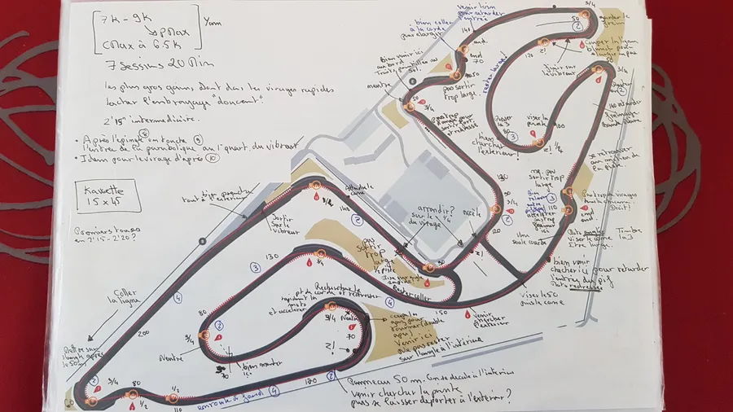
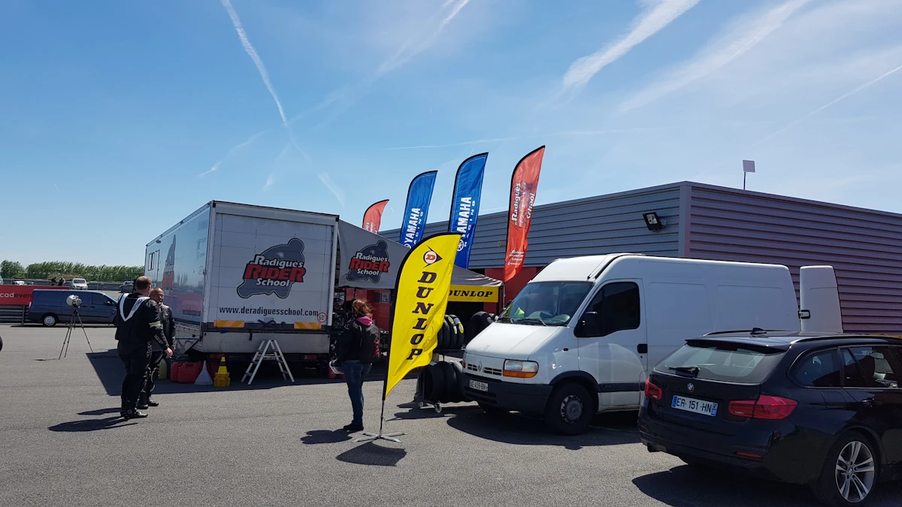
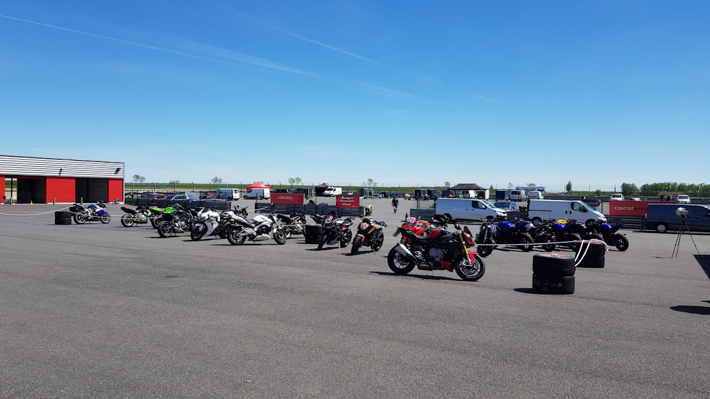
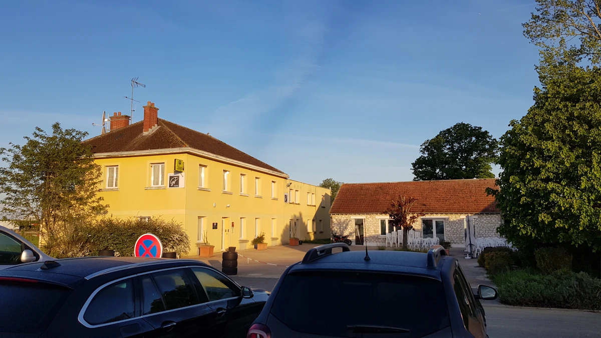
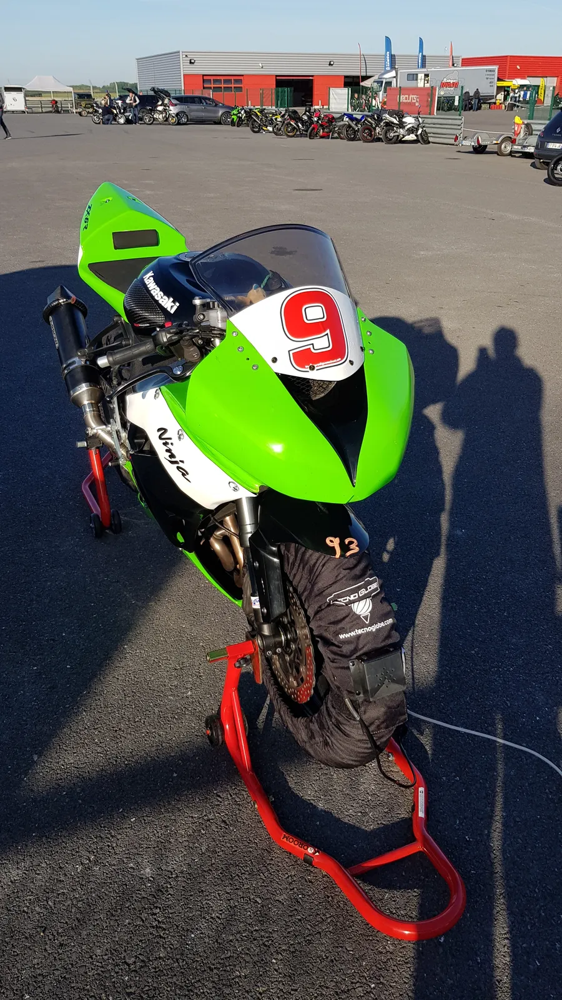
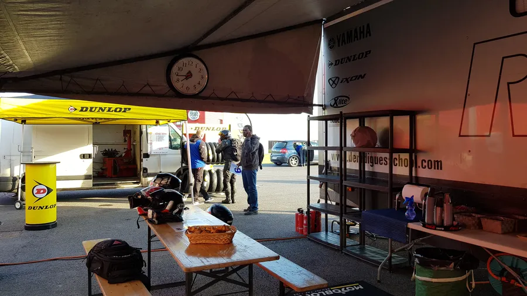
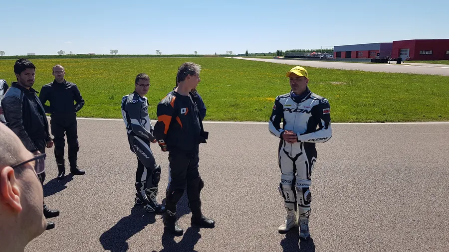
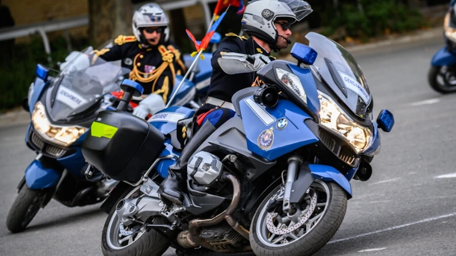

# {{ page.title }}
{: .no_toc }

{{ page.description }}
{: .lead }

Le tout premier stage de pilotage auquel j'ai participé était un stage de la De Radiguès Rider School (DRRS). Il a eu lieu en 2019, sur le circuit de la Ferté Gaucher, en début de semaine (13 et 14 mai) . J'ai ensuite poursuivi avec la journée Nolan le 15 mai sur le même circuit. Sous forme de compte rendu informel, je vous raconte comment ça s'est passé de mon côté.

## Avant le dimanche

Je me suis inscrit début décembre 2018 à 3 jours de stage avec 7 sessions de 20 minutes par jour. Histoire de pouvoir tenir le rythme, ça fait plus d'un mois que je mets l'accent sur la condition physique.

En deux mots, tous les jours (sauf le dimanche) je cours lentement 1H20. Si besoin allez voir cette [page](). Au bout de 40 minutes, je m'arrête et je fais 45 squats.

<figure style="max-width: 560px; margin: auto;">

    <iframe
    src="https://www.youtube.com/embed/TIhtpItTuxc?start=53"
    title="Comment faire des squats"
    style="position: absolute; inset: 0; width: 100%; height: 100%;"
    allowfullscreen>
    </iframe>

<figcaption style="text-align: center;">
    Comment faire des squats
</figcaption>
</figure>

Ensuite je repars en courant pour 40 min et une fois à la maison je fais 5 min. de planche.

<figure style="max-width: 560px; margin: auto;">

    <iframe
    src="https://www.youtube.com/embed/ynUw0YsrmSg"
    title="Faire des planches"
    style="position: absolute; inset: 0; width: 100%; height: 100%;"
    allowfullscreen>
    </iframe>

<figcaption style="text-align: center;">
    Faire des planches
</figcaption>
</figure>

Non, bien sûr, je n'ai pas commencé comme ça comme une brute. J'y suis allé progressivement. Ah, au fait, j'en ai aussi profité pour faire très attention à ce que je mangeais. J'ai perdu 2 Kg en 4 semaines ce qui reste raisonnable.

Pour le reste j'ai passé pas mal de temps sur YouTube à regarder des vidéos de la Ferté Gaucher. Enfin j'ai un plan de la piste avec pas mal de notes en fonction de ce que j'ai pu glaner ici ou là. Il ne faut pas hésiter à se passer les vidéos à 50% de la vitesse pour bien analyser ce qui se passe.

<figure style="max-width: 450px; margin: auto; text-align: center;">

<figcaption>Le circuit de la Ferté Gaucher annoté</figcaption>
</figure>

### Ce que je n'ai pas fait et que j'aurai dû faire

Prendre le temps, en statique, de me déplacer sur la moto pour travailler la position en virage. Faire prendre des photos de derrière, de devant et de profil.

* Est-ce que je suis bien couché sur la moto? Comment ça fait? Où est-ce que ça appuis? Qu'est-ce que je ressens?
* Comment est-ce que je vois devant quand je suis couché?
* Est-ce que j'ai une fesse qui sort bien? Je sens le bord de la selle dans la raie des fesse? Il est où mon genou extérieur?  raie
* Comment sont alors mes pieds sur les cale-pieds?
* Est-ce que je suis aussi à l'aise à gauche, qu'à droite?
* Comment doit être ma main sur la poignée (prise tournevis)?
* ...

Je ne l'ai pas fait et on va voir que cela a eu un impact.

<figure style="max-width: 560px; margin: auto;">

    <iframe
    src="https://www.youtube.com/embed/ElbKMVo4Bt0?start=22"
    title="Comment piloter une moto ? Virage, trajectoire, regard, position"
    style="position: absolute; inset: 0; width: 100%; height: 100%;"
    allowfullscreen>
    </iframe>

<figcaption style="text-align: center;">
    Comment piloter une moto ? Virage, trajectoire, regard, position
</figcaption>
</figure>

## Dimanche

Encore une fois j'ai emmené la moitié de l'atelier. Ci-dessous il n'y a pas l'outillage, les sacs avec les fringues, la combine etc. Va vraiment falloir que je me calme...

<figure style="max-width: 450px; margin: auto; text-align: center;">

<figcaption>Préparation de la moto et du matériel avant le stage sur le circuit de la Ferté Gaucher</figcaption>
</figure>

J'ai beau être tout seul, la voiture est blindée. J'ai même emmené une seconde paire de jantes avec des Dunlop D212 car je ne suis pas sûr que les Pirelli SuperCorsa V1 qui ont déjà tourné au Vigeant 2 jours, tiennent jusqu'au bout des 3 jours.

J'arrive sur site vers 18H30. Le camion DRRS est déjà là et les gars sont au montage. Je suis poli, je fais le tour et je dis bonjour à tout le monde.

<figure style="max-width: 450px; margin: auto; text-align: center;">

<figcaption>Arrivée au stage DRRS à la Ferté Gaucher</figcaption>
</figure>

Y a encore un peu de monde sur le parking car il y avait une journée de roulage moto ce dimanche. Je me cale dans un coin, pas trop loin d'une prise électrique. Je descends la moto et je l'amène dans le box DRRS pour qu'elle y passe la nuit en toute sécurité.

<figure style="max-width: 450px; margin: auto; text-align: center;">

<figcaption>Arrivée au stage DRRS à la Ferté Gaucher</figcaption>
</figure>

Je laisse la remorque sur place. Je ne peux pas faire l'inscription administrative, on verra ça demain à 7H30. Je n'ai plus rien à faire ici, allez, je vais à l'hôtel.

<figure style="max-width: 450px; margin: auto; text-align: center;">

<figcaption>Le Grand Terre - L'hôtel du circuit de la Ferté Gaucher</figcaption>
</figure>

Comme c'est Dimanche, même si j'ai mes shoes de running je ne vais pas courir. Je fais un tour à pied, je dîne tout seul en regardant des vidéos YouTube sur mon téléphone, je remonte avec la ferme intention de m'endormir tôt et de tous les éclater demain...

Bon, ça c'était le plan mais à 3H30 du mat' je ne dors toujours pas ou bien je dors par tranche de 45 minutes. Y va être frais le Marquez des bacs à sable toute à l'heure...

## Lundi

6H00. Encore une fois je suis réveillé. Il fait jour. Bon, pas la peine de croire que je vais pouvoir dormir 30 minutes de plus. Allez, zou, à la douche et au rasage. C'est sûr, j'ai le temps de compter mes orteils, de m'habiller...

7H00. Petit déjeuner "lite" histoire d'être tranquille ce matin. Je regarde dehors. Le ciel est de plus en plus bleu... Ça sent bon, les gars, ça sent bon la journée réussie.

7H20. J'arrive sur le parking. Ça pèle un peu et je ne regrette pas d'avoir emmené polaire, bonnet et tour de cou. Je retrouve la remorque et je vais chercher Kawette. Y a beaucoup plus de monde qu'hier. Je suis à côté d'un CB 500. Faut toujours se méfier des CB 500...

Vu que ça risque d'être rédhibitoire, comme les gars du sonomètre sont là j'y vais. Verdict : 93 dB écrit en gros sur mon garde boue avant. J'ai la banane... Putain, c'est un signe... Ça s'annonce bien cette journée, je vais tous les éclater...

J'installe Kawette sur ses béquilles et j'allume les couvertures chauffantes.

Direction le camion DRRS le cœur léger pour régler l'administratif. En 2 minutes c'est fait. Je repars avec un emploi du temps, un N° à coller sur la moto (9 rouge en l'occurrence), mes jetons pour les déjeuners et je suis inscrit au dîner de ce soir. Je connais le nom de mon instructeur, je sais que je suis chez les intermédiaires (les rouges) ainsi que l'horaire de mon Duo Run.

<figure style="max-width: 450px; margin: auto; text-align: center;">

<figcaption>ZX6R sur le circuit de la Ferté Gaucher</figcaption>
</figure>

Un Duo Run c'est 20 minutes pendant lesquelles un des instructeurs vous suit, vous filme et vous passe des instructions via une liaison radio. Là aussi j'ai du pot. Je passe demain après-midi. Comme d'ici là j'aurai appris plein de trucs, c'est sûr, je vais lui en mettre plein la vue...

<figure style="max-width: 560px; margin: auto;">

    <iframe
    src="https://www.youtube.com/embed/eAQ1V8_T3Yc"
    title="Duo Run Stage DRRS La Ferté Gaucher 29-30 avril 2013"
    style="position: absolute; inset: 0; width: 100%; height: 100%;"
    allowfullscreen>
    </iframe>

<figcaption style="text-align: center;">
    Duo Run Stage DRRS La Ferté Gaucher 29-30 avril 2013
</figcaption>
</figure>

Allez, j'enfile la combine et les bottes et je retourne faire un tour au camion DRRS. Le premier briefing de 8H30 est dans pas longtemps...

### L'agenda de la journée

| 8H30 | Briefing Sécurité |
| --- | --- |
| 9H00 | 1er contact avec le groupe et l'instructeur |
| 9H20 | Run Découverte de la piste |
| 9H40 | Débriefing |
| 10H00 | Atelier Frein 1 |
| 10H20 | Run Frein |
| 10H40 | Débriefing |
| 11H00 | Atelier Position |
| 11H20 | Run Slalom |
| 11H40 | Débriefing vidéo 40' |
| 12H20 | Reconnaissance piste à pied 40' |
| 13H00 | Déjeuner |
| 14H00 | Atelier Vitesse |
| 14H20 | Run Sans frein ni boite |
| 14H40 | Débriefing |
| 15H00 | Atelier Mobilité |
| 15H20 | Run Mobilité |
| 15H40 | Atelier Trajectoire 40' |
| 16H20 | Run Trajectoire |
| 16H40 | Débriefing vidéo 40' |
| 17H20 | Run Trajectoire |
| 17H40 | Débriefing |
| 18H00 | Apéro & Débrief de la journée |
| 20H30 | Dîner tous ensemble pour ceux qui le veulent |

L'agenda appelle quelques remarques...

* Il n'y a pas de trous dans l'agenda... C'est d’ailleurs un coup de pot que j'ai pensé à faire des photos le premier jour.... Quoiqu'il en soit, quand tu rentres de roulage, tu ne perds pas de temps. Tu enlèves casque et gants, tu mets la moto sur ses béquilles, tu branches les chauffantes et tu fonce au débriefing.
* Le truc à bien comprendre c'est que si l'organisation DRRS est au cordeau, il faut que la tienne le soit aussi. Pas le temps de faire une pause photo ou un atelier vernis à ongle... Si tu veux faire une vérification de pression ou une prise de température des pneus tu le fais vite et bien.
* Idem, quand l'atelier théorique se termine et qu'il faut repartir en session de roulage... Pour la pose "wawa" (sur circuit j'ai l'impression de passer ma vie aux toilettes... Limite incontinent le garçon 🤬 ) tu passes la seconde et tu n'y passes pas 3H. Ensuite tu fonces à la moto, tu la mets en route, tu enlèves les chauffantes, tu mets l'Alfano en route, tu t'équipes et c'est reparti. En fait, le truc c'est que d'autres pilotes n'ont pas nécessairement de chauffantes. Ils sont garés près du camion DRRS et sont en "prégrille" plus vite que toi. Comme c'est plus intéressant d'aller sur piste avec les autres plutôt que de rouler tout seul il est préférable de ne pas trop traîner.
* J'avais emmené un carnet avec le secret espoir de noter 2 ou 3 trucs... Je pense qu'il n'a pas quitté mon sac à dos. Cela dit, je pense qu'il y a moyen de prendre des notes au moment du déjeuner et à la fin de journée. Il faut prendre le temps de noter ses impressions et ses sensations (sentir le genou extérieur qui pousse sur le réservoir, coller à la ligne blanche extérieure lors des freinages, dans telle épingle, bien rouler sur le vibreur avant la mise sur l'angle...). J'avais fait ça quand je prenais des cours particuliers de snowboard et cela m'avait bien aidé. Surtout l'année d'après quand on y retourne et qu'on est encore "débutant". Relire mes notes me permettait d'être rapidement dans le "bain" et de retrouver les sensations notées.
* Chaque atelier est une présentation de la part de l'instructeur et il s'appuie pour cela sur des slides qui sont pas mal fait.
* Après chaque roulage, les débriefings se font sous l'auvent du camion autour d'une des 2 longues tables. En plus le café et le thé ne sont pas loin...

<figure style="max-width: 450px; margin: auto; text-align: center;">

<figcaption>Notre salle de debrief lors du stage DRRS</figcaption>
</figure>

* Les débriefings vidéo se font en salle (dans l'un des box du circuit en l’occurrence) et s'appuient sur des magnétos Sony de compétition. Ces derniers permettent de faire de l'arrêt sur image de qualité ainsi que du image par image. C'est mortel car on voit tout, tout de suite et ce n'est pas discutable. Le "non mais en fait j'ai fait ça que sur ce tour-là, après c'était bien mieux" n'est pas de mise... Ça rigole bien, ça chambre gentiment et ça permet de créer une vraie cohésion dans le groupe car on réalise rapidement qu'on a tous les mêmes soucis. Oui, bien sûr, il y en a 2 ou 3 qui sont au-dessus du lot et 2-3 qui sont un peu plus en retrait mais ce n'est statistiquement pas surprenant. En tout cas l’ambiance dans le groupe était vraiment sympa et bienveillante.

### Quelques trucs à propos de la première journée

* En discutant j'ai constaté que je n'étais pas le seul à ne pas avoir bien dormi la veille. En fait on est tous pareil... 😁
* Faut gérer les sessions. Sur 2 jours il va y avoir 14 sessions de 20 min. On a donc le temps et il ne faut surtout pas vouloir aller plus vite que la musique.
  + Typiquement, moi, au bout de 2 tours, j'oubliais tout, je passais en mode Banzaï et je fonçais (à mon niveau). C'est complètement débile...
  + Au contraire, faut prendre le temps d'appliquer les choses qu'on vient de voir sur les slides, de faire et refaire l'exercice à chaque virage. Dans des journées de roulage "classiques" on n'a pas toujours le luxe ni l'occasion de pouvoir aller doucement, de décomposer tel ou tel mouvement etc. En plus, l'agenda du lendemain montre qu'il y a des sessions sans thème précis. C'est à ce moment-là qu'il faudra mettre en oeuvre tout ce que l'on aura vu et faire progresser les chronos. Bref, première journée c'est "Doucement... Je bosse !"
* Pour chaque virage il faut, dès le départ mémoriser ses points:
  + Point de freinage
  + Point de mise sur angle
  + Point de corde
  + Point de sortie
* À part pour le point de freinage, lors du stage, les points sont identifiés avec des petits cônes noirs et jaune. Attention, sur le bord de la piste il y a aussi des cônes bleus et d'autres jaune. Il ne faut pas s'en occuper. Le plus important des cônes c'est le cône de point de corde. Celui-là n'est pas négociable. Il faut que les roues de la moto passent à 1 mm. Attention, j'ai dit les roues, ça veut donc dire que le corps et/ou le genou est au-dessus du cône et/ou des vibreurs. Si au départ cela veut dire qu'on doit rouler "doucement" pour bien atteindre le point de corde et bien tant pis, on roule doucement ! C'est une erreur que d'arriver à l'arrache totale sur les freins si c'est pour passer à 50 cm ou à 1 m du point de corde. Les autres points vont évoluer gentiment au cours du stage. Par exemple on freinera plus tard ou bien on sortira plus large. De même selon que notre mise sur l'angle est plus ou moins lente, il faudra avancer ou reculer le point de déclenchement... Mais bon, le point de corde, lui, ne bouge pas.
* Le run Slalom devrait être doublé. Dans cet exercice on nous demande de faire un slalom entre des cônes mais en gardant la tête et le corps à l'intérieur du virage (comme en piste en fait). Après le debrief vidéo, le dédoublement nous permettrait d'avoir une seconde chance car franchement dans l'ensemble ce n'était pas tip-top.
* Il faut vraiment jouer le jeu dans le run "Sans frein ni boite". Le but c'est vraiment de démontrer qu'on freine toujours trop avant la mise sur l'angle et qu'en fait, on peut rentrer plus vite dans chaque virage. En ce qui me concerne j'avais pas mal de difficulté en bout de ligne droite car j'arrivais toujours vraiment trop vite (mais vraiment... Je ne sais pas, un excès d'enthousiasme sans doute...)
* Il faut vraiment s'appliquer dans les Run Trajectoire et y aller doucement (75% de nos capacités typiquement). Faut aussi utiliser toute la piste. Cela veut dire que le freinage se fait à 1 mm de la bande blanche, que les roues passent à 1 mm du point de corde et qu'en sortie les roues se retrouvent à 1 mm de la bande blanche.
* En fin de journée, il faut penser à aller voir les photos afin de bien voir ce qu'il faut changer demain dans notre position. Je ne l'ai pas fait et je le regrette.

<figure style="max-width: 450px; margin: auto; text-align: center;">

<figcaption>Demi circuit LFG à pied avec notre instructeur DRRS</figcaption>
</figure>

Il est déjà 18H00. C'est le moment de ranger Kawette pour la nuit et d'aller au pot. Je suis crevé. J'ai qu'une envie : prendre une douche et m'étendre sur le lit avant d'aller dîner. Non, je n'ai pas envie d'aller courir et non, je n'ai pas envie de mettre mes notes noir sur blanc.

Allez, je rentre, douche et zou j'écris quand même mes impressions sur papier. J'en profite aussi pour rajouter des notes sur mon plan de piste.

Plus important je prends l'engagement d'aller moins vite demain, de m'appliquer encore plus et d'être plus mobile sur la moto.

En effet, cette première journée à mis en lumière le fait que je conduis comme un gendarme, que je ne sors pas les fesses et que je n'ai aucune chance de toucher le genou. En soit, ce ne serait pas grave mais finalement comme je prends déjà beaucoup d'angle ça limite sérieusement la progression de ma vitesse de passage en virage. Faut vraiment que je pose le genou si je veux progresser.

<figure style="max-width: 450px; margin: auto; text-align: center;">

<figcaption>Conduire comme un gendarme c'est pas piloter</figcaption>
</figure>

Bref, pas top pour un gars qui pensait tout éclater aujourd'hui.

## Mardi

### Agenda de la seconde journée

| 8H30 | Briefing Sécurité |
| --- | --- |
| 9H00 | Atelier Frein 2 |
| 9H20 | Run Frein 2 |
| 9H40 | Débriefing |
| 10H00 | Atelier Regard |
| 10H20 | Run Regard |
| 10H40 | Débriefing |
| 11H00 | Atelier Dépassement |
| 11H20 | Run |
| 11H40 | Débriefing vidéo 40' |
| 12H20 | Déjeuner |
| 14H00 | Atelier Suspension |
| 14H20 | Run |
| 14H40 | Débriefing |
| 15H00 | Atelier Phase 1 |
| 15H20 | Run Phase 1 |
| 15H40 | Debriefing |
| 16H00 | Atelier Phase 2 |
| 16H20 | Run Phase 2 |
| 16H40 | Débriefing vidéo |
| 17H00 | Stand suspension |
| 17H20 | Run |
| 17H40 | Débriefing |
| 18H00 | Remise des diplômes |

### Quelques trucs à propos de la seconde journée

* On a tous beaucoup mieux dormi que la veille. Le groupe se forme et il y a encore plus de discussions qu'hier. C'est vraiment sympa.
* Faut penser à emmener de l'essence. En ce qui me concerne je compte 11 litres par jour de roulage à peu près...
* On le voit il y a 2 ou 3 runs qui sont sans thème vraiment imposé (Run Dépassement ou Suspension par exemple). C'est peut-être à ce moment qu'il faut commencer à tourner en mettant en place gentiment tous les éléments qui ont été vus préalablement.
* Si lors d'un Run on rattrape un groupe. Pas la peine de râler, de s'énerver ou quoi ou qu'est-ce. Tu sors par les stands, tu reviens en prégrille. Le responsable de l'entrée te relâche gentiment et zou, c'est reparti.
* Si lors d'un Run on en a marre et/ou on ne le sent pas, il faut sortir. C'est aussi simple que ça.
* Certains d'entre nous n'ont pas fait tous les runs. En fait ils étaient crevés. C'est bien qu'ils se soient arrêtés. C'est une preuve d'intelligence. Pour le reste cela veut que si on vient avec l'intention de profiter de tous les runs il faut sans doute soigner sa condition physique.
* Le Duo Run c'est super bien passé. J'ai gagné 2 secondes au tour et l'instructeur bouillait de me faire poser le genou.
* Il faut penser à aller voir les photos pour voir l'évolution de la position et en profiter pour regarder ses petits camarades. En ce qui me concerne je suis trop droit (pas assez couché sur le réservoir). En virage ma tête n'est clairement pas sur ma main intérieure. Le bras intérieur n'est pas plié... Bref, y a encore beaucoup de boulot...
* En fin de journée, je n'arrive toujours pas à faire toucher le genou et ça me fait bien suer car je commence à faire une fixette là-dessus. C'est d'autant plus gênant que, comme le dit l'instructeur, par ailleurs, j'arrive à faire des choses plus compliquées ou plus "touchy" et que pour lui, poser le genou c'est de la gnognotte.

J'ai gagné un bouquin et un bonnet lors de la remise des diplômes. Il faut que j'aille chercher de l'essence, que je note mes sensations et mes remarques sur le plan de piste. Il faut aussi que j'écrive mes résolutions pour demain et que je me couche de bonne heure après avoir visionné les 20 minutes de Duo Run.

<figure style="max-width: 560px; margin: auto;">

    <iframe
    src="https://www.youtube.com/embed/8gONIGOLp2A"
    title="1ère sortie piste : Duo Run DRRS LFG"
    style="position: absolute; inset: 0; width: 100%; height: 100%;"
    allowfullscreen>
    </iframe>

<figcaption style="text-align: center;">
    1ère sortie piste : Duo Run DRRS LFG
</figcaption>
</figure>

### Qu'est-ce que je retiens de ces 2 journées ?

* **La phase neutre dans les virages.** Il faut avoir un moment où on a l'impression que l'on se traîne, où il n'y a ni gaz ni frein et où toute notre attention se porte sur le passage sur le point de corde. Généralement j'arrivais trop fort sur les freins, trop lentement en virage, pour compenser, j'avais tendance à mettre un filet de gaz rapidement et à m'écarter de la trajectoire puis à louper le point de corde et à être embêté en sortie de virage. La totale quoi !
* **Dès que tu peux, ouvre en grand.** C'est bête mais j'ai senti ça lors du Duo Run. C'est idiot mais le gars est derrière il te dis ouvre, tu ne cherches pas à comprendre, tu ouvres et tu gagnes un peu de temps. En fait, je pense qu'on est nombreux à ne pas vraiment ouvrir en grand, à être un peu fainéant de la poignée. Mais non, ça ne marche pas comme ça. Pas de pitié pour la poignée ! S'il y a 30 m où je peux ouvrir, j'ouvre et j'ouvre en grand. Au bout bien sûr faudra freiner mais c'est une autre histoire.
* **Bouge tes fesses !** Ce que laisse apparaître la vidéo du Duo Run et les photos c'est que lorsque je crois être "à fond" du point de vue de la position, en fait il n'y a qu'une demi-fesse qui sort et le genou intérieur n'est pas assez ouvert. À la suite des 3 jours, de retour à la maison j'ai fait d'autres tests dans le garage. En ce qui me concerne il faut que j'ai l'impression de sortir 2 fesses pour qu'au final, il n'y en est qu'une qui sorte. Ce n'est pas facile à faire en statique avec la moto droite mais bon j'affinerai ça au prochain roulage.

## Mercredi - La journée Nolan

Pour faire simple, c'est une journée de roulage "classique" mais comme il y a Nolan qui participe et que tout le matériel est en place, on a tous les mêmes casques et les sessions sont entrecoupées d'ateliers où on réutilise les slides du stage DRRS. Il y a des débriefings mais il n'y a pas d'analyse des vidéos.

C'est donc moins fouillé que pendant le stage mais bon, c'est beaucoup plus "pro" que ce que l'on peut voir lors d'autres journées soi-disant organisées où on est sensé avoir des Marshals pour accompagner les débutants et où en fait il n'y a rien du tout.

Pour le reste il y a 3 groupes de niveau et 7 sessions pour chaque groupe.

Enfin bref, c'est une très bonne journée à faire et qui à mon avis doit donner envie à certains de venir faire un stage de 2 jours. Ah, oui, à noter que Nolan faisait une super promo sur les casques prêtés.

Bon, allez, la suite au prochain épisode...

## Post-scriptum

Ma playlist de vidéos YouTube dédiées au pilotage sur piste. À ce jour (Mai 2019) il y a environ 90 vidéos. Il faut cliquer en haut à gauche de l'image ci-dessous pour faire apparaître la liste.

J'ai essayé de regrouper les vidéos par thèmes.

Il y a un peu de tout et dans toutes les langues, Français, Anglais, Italien, Espagnol mais on comprend car on connaît le sujet 😁

<figure style="max-width: 560px; margin: auto;">
  

    <iframe
      src="https://www.youtube.com/embed/Un9VmqE5BF4?list=PLOmfq6wDOTY7St0LApT2rQh3fsZKbvYUS"
      title="Playlist sur le pilotage moto sur circuit"
      style="position: absolute; inset: 0; width: 100%; height: 100%; border: 0;"
      allow="accelerometer; autoplay; clipboard-write; encrypted-media; gyroscope; picture-in-picture; web-share"
      referrerpolicy="strict-origin-when-cross-origin"
      allowfullscreen>
    </iframe>
  

  <figcaption style="text-align: center;">
    Playlist sur le pilotage moto sur circuit &mdash;
    <a href="https://www.youtube.com/watch?v=Un9VmqE5BF4&list=PLOmfq6wDOTY7St0LApT2rQh3fsZKbvYUS" target="_blank">Ouvrir la playlist sur YouTube</a>
  </figcaption>
</figure>
