# {{ page.title }}
{: .no_toc }

{{ page.description }}
{: .lead }

<!-- <h2 align="center"><b> 🚧 This post is under construction 🚧</b></h2> -->

<!-- ###################################################################### -->
<!-- ###################################################################### -->
<!-- ###################################################################### -->
<!-- ## TL;DR
{: .no_toc }

* Point 1
* Point 2 -->

<figure style="max-width: 500px; margin: auto; text-align: center;">
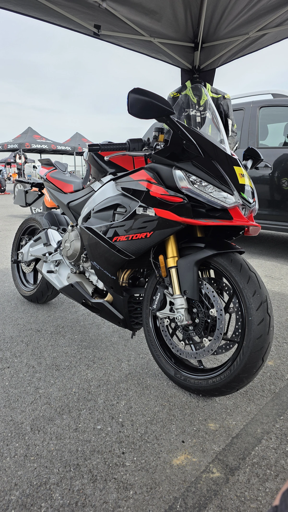
<figcaption>Premier roulage avec la RS 660</figcaption>
</figure>

<!-- ###################################################################### -->
<!-- ###################################################################### -->
<!-- ###################################################################### -->
<!-- ## Table of Contents
{: .no_toc .text-delta}
- TOC
{:toc} -->

<!-- Link to a video -->
<!-- <figure style="max-width: 560px; margin: auto;">

    <iframe
    src="https://www.youtube.com/embed/MIeYz6aMBbk"
    title="Add a title"
    style="position: absolute; inset: 0; width: 100%; height: 100%;"
    allowfullscreen>
    </iframe>

<figcaption style="text-align: center;">TODO: Add a legend</figcaption>
</figure> -->

<!-- ###################################################################### -->
<!-- ###################################################################### -->
<!-- ###################################################################### -->

On va commencer par libérer la tringlerie du sélecteur
* Faire une marque au feutre ou au stylo à peinture pour pouvoir remettre la biellette exactement dans la même position.
* Dévisser ensuite la vis hexagonale
* Extraire (plus ou moins facilement) la biellette. Faut le faire uniquement avec les mains.
* Quand c'est fait, mettre la tige et la biellette sur le côté (ne rien débrancher)

<figure style="max-width: 500px; margin: auto; text-align: center;">
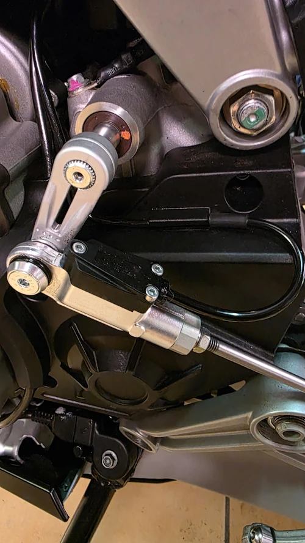
<figcaption>On commence par libérer la tringlerie du sélecteur</figcaption>
</figure>

Dévisser les 5 vis Torx qui tiennent le carter de chaîne en plastique

<figure style="max-width: 500px; margin: auto; text-align: center;">
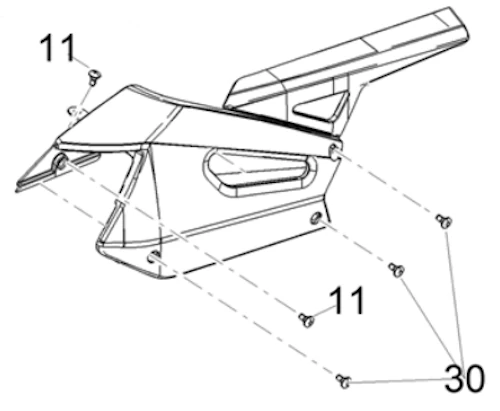
<figcaption>Le carter de chaîne</figcaption>
</figure>

Dévisser les 3 vis de 8 qui tiennent le cache pignon en plastique

<figure style="max-width: 500px; margin: auto; text-align: center;">
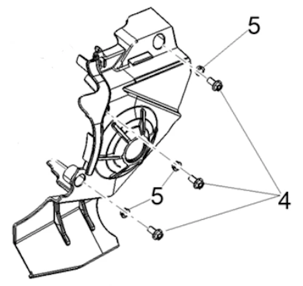
<figcaption>Le cache pignon</figcaption>
</figure>

On accède alors au pignon de sortie de boîte. Là, faut être patient et musclé (ou avoir un long bras de levier) pour sortir la vis de 12. Normalement le couple c'est 50 Nm mais elle est complètement recouverte de Loctite donc ça a été un peu chaud... J'ai mis la moto en première et pour faire bonne mesure j'ai inséré un manche de pioche à travers la roue AR. Bien sûr j'ai enroulé des chiffons autour du manche pour pas marquer la jante.

<figure style="max-width: 500px; margin: auto; text-align: center;">
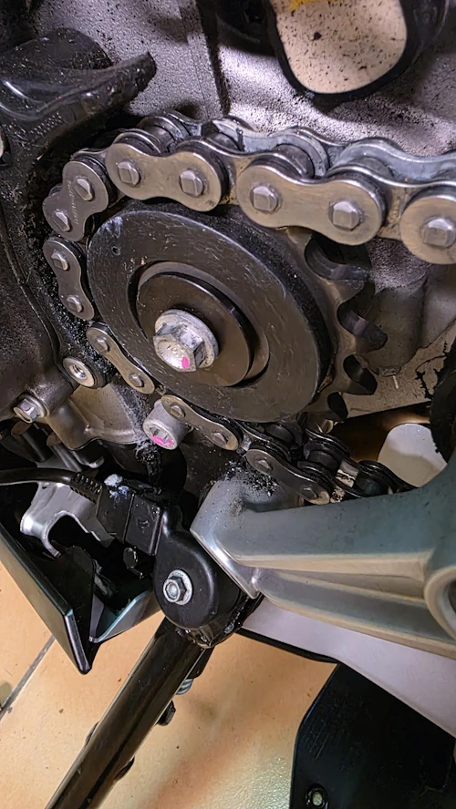
<figcaption>Le pignon de sortie de boîte original du RS 660</figcaption>
</figure>

Pauv' bête. Complètement enduite de Loctite... Tu notes sur la photo qu'il y a une rondelle et une rondelle ressort. Y avait peut ête pas besoin d'autant de Loctite. Non?

<figure style="max-width: 500px; margin: auto; text-align: center;">
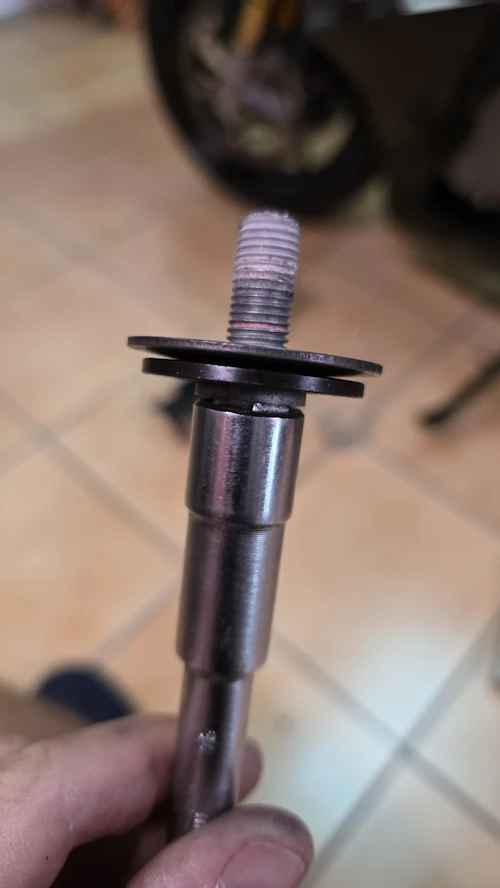
<figcaption>La vis du PSB</figcaption>
</figure>

La chaîne (neuve, 2_000 km) était déjà pas mal détendue. J'ai pu extraire le pignon directement. Si besoin faudra peut être desserrer l'axe de la roue AR et faire avancer cette dernière pour gagner un peu de mou dans la chaîne.

<figure style="max-width: 500px; margin: auto; text-align: center;">
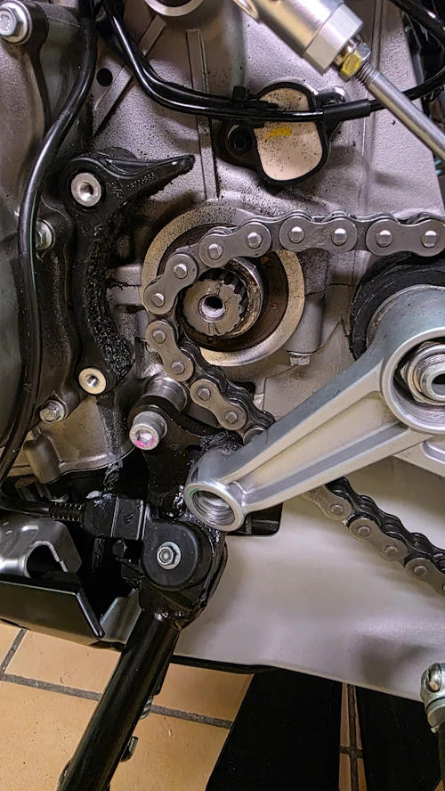
<figcaption>Le pignon est extrait. Note la quantité de Loctite sur les filets...</figcaption>
</figure>

Avant d'insérer le nouveau pignon je prends un peu de temps pour enlever la graisse et faire un peu de nettoyage au niveau du pignon et du carter (pétrole désaromatisé, pinceau, chiffons).

Si besoin, afin de vérifier dans quel sens mettre le pignon, on peut mettre côte à côte les 2 pignons sur l'établi par exemple. Ensuite faut insérer (dans le bon sens) le nouveau pignon. Ici comme il est plus petit (16 dents vs 17 originalement) il n'y a pas de difficulté particulière.

<figure style="max-width: 500px; margin: auto; text-align: center;">
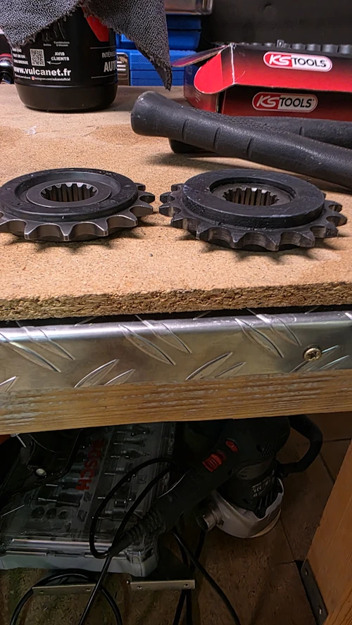
<figcaption>Le nouveau pignon de sortie de boite à gauche, l'ancien à droite</figcaption>
</figure>

Ensuite j'enlève la Loctite du pas de la vis (brosse métal). J'enlève la Loctite qui est reste dans le filetage sur le carter (visser la vis à la main, souflette). Enfin, je remet un peu (j'ai dit un peu) de Loctite bleue 243 en bout du filet de la vis et je serre au couple (50 Nm).

Il est temps de remonter mais avant on va faire la vaisselle... Pétrole désaromatisé, pinceau, soufflette et c'est parti pour les caches en plastique. Au bout de la flèche verte on retrouve une des rondelle-entraxe du cache pignon (notée 5 sur une des figures précédentes). Faut juste pas les perdre de vue ou les oublier.

<figure style="max-width: 500px; margin: auto; text-align: center;">
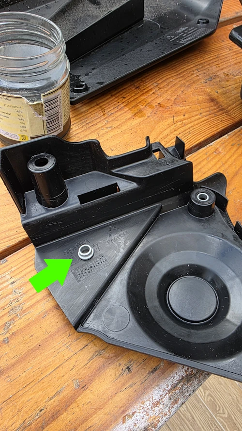
<figcaption>Un cache pignon tout propre.</figcaption>
</figure>

Pas de commentaire particulier pour le cache chaîne.

<figure style="max-width: 500px; margin: auto; text-align: center;">
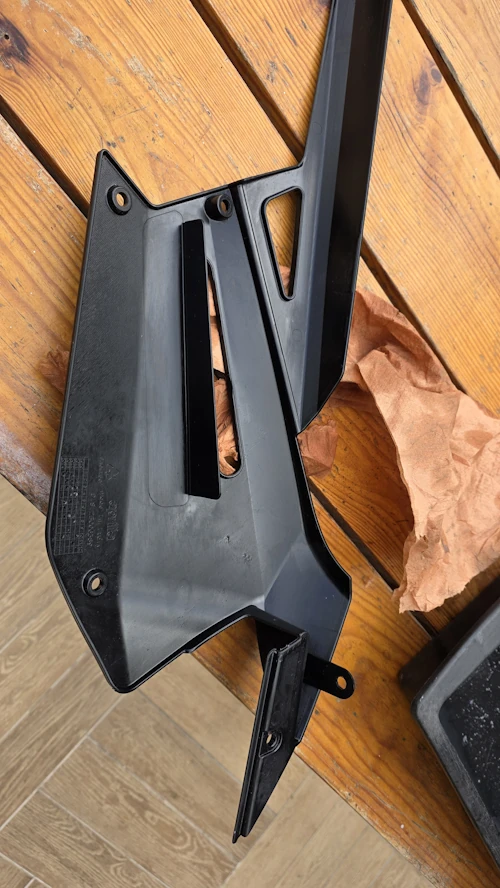
<figcaption>Un carter de chaîne tout propre aussi</figcaption>
</figure>

Au moment de présenter le cache pignon, il faut prendre soin de bien faire passer le cable à l'intérieur. Il y a une gorge, un chemin. Si on ne le fait pas, le cable se trouve coincé.

Sinon, mauvaise surprise... Au moment de remettre en place le cache pignon je réalise qu'une des vis est complètement "machouillée". C'est pas moi m'sieur, moi j'ai juste dévissé. Je sais pas ce qu'ils ont fichu. Du coup j'ai gagné un aller-retour chez mon concessionaire préféré ([Saint Maur Moto](https://www.saintmaurmotos.fr/)) qui m'a gentiment donné une nouvelle vis.

<figure style="max-width: 500px; margin: auto; text-align: center;">
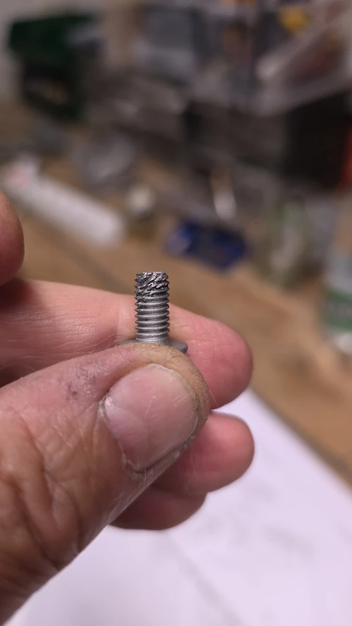
<figcaption>Une des vis du cache pignon telle que je l'ai retrouvée. Les autres sont OK.</figcaption>
</figure>

La pauvre bête, toute moche à côté de sa remplaçante.

<figure style="max-width: 500px; margin: auto; text-align: center;">
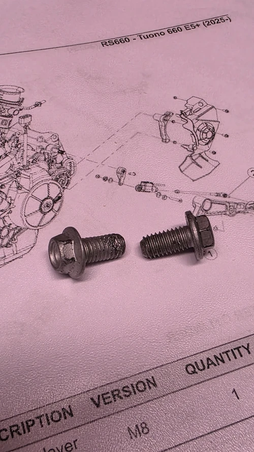
<figcaption>L'ancienne et la nouvelle vis</figcaption>
</figure>

Sinon, super, les couple de serrage de ces vis ne sont pas indiqués dans la documentation. Le seul truc qu'on a c'est un tableau générique. Comme ici les vis sont des M6 je nettoie les pas de vis, je mets une goutte de Loctite en bout de filet et je serre à 10 Nm.

<figure style="max-width: 900px; margin: auto; text-align: center;">
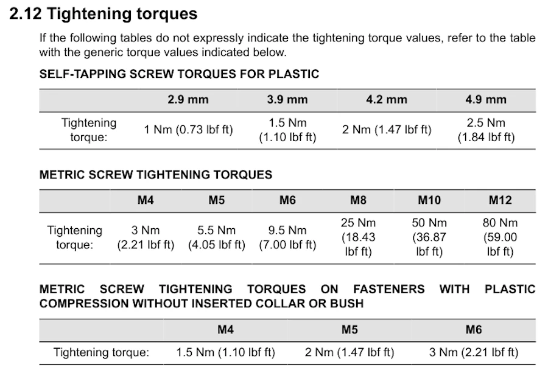
<figcaption>Les couples de serrages recommandés par Aprilia</figcaption>
</figure>

Idem pour les Torx du carter de chaîne. Aucun couple indiqué. Ce sont des M5, donc selon le tableau on devrait serrer à 5.5 Nm. Je nettoie le pas de vis, je met une goutte de Loctite en bout de filet et je serre à la main sans trop forcer (5.5 Nm ça me parait bien faible).

Ok, c'est bien gentil tout ça mais comme le pignon est plus petit, la chaîne pend carrément sur le pot d'échappement. On a gagné une tension de chaîne.

Ci-dessous le maillon rouge c'est juste un maillon recouvert de vernis à ongle. Il me sert de repère quand je nettoie la chaîne. Ca évite de mettre trop de graisse par exemple.

<figure style="max-width: 500px; margin: auto; text-align: center;">
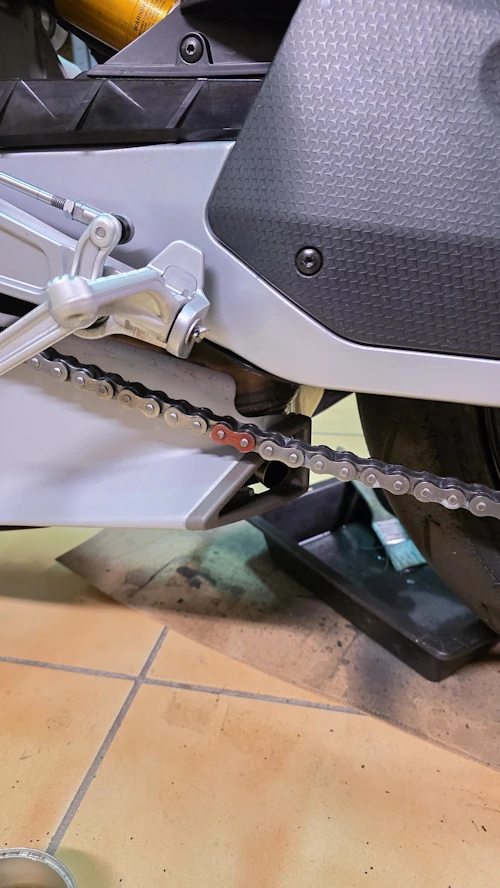
<figcaption>Pour le coup la chaîne est carrément détendue</figcaption>
</figure>

La documentation indique que, la moto sur ses roues, la chaîne doit avoir un débattement de 30mm à 250 mm de l'axe de la roue AR. Si y a un peu plus c'est pas très grave. Attention surtout à ce qu'il n'y ait pas moins. Si il n'y a pas assez de débattement, le bras oscillant ne pourra pas travailler correctement, la chaîne va tirer sur le PSB... Pas une bonne idée.

J'en profite pour vérifier au [laser](https://www.profi-products.de/fr/profi-cat-laser/) l'alignement de la chaîne. Ci-dessous on voit le point rouge sur le dessus du maillon extérieur.

<figure style="max-width: 500px; margin: auto; text-align: center;">
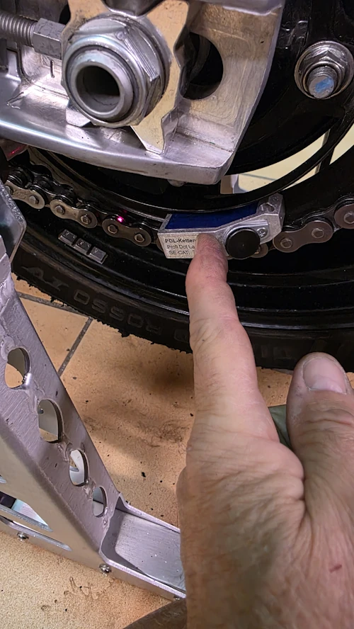
<figcaption>Vérification de l'alignement de la chaîne</figcaption>
</figure>

Je garde le doigt sur le laser, je fais tourner la roue vers l'arrière. Plus loin on retrouve bien le point rouge toujours sur le dessus du maillon extérieur. La chaîne est donc bien alignée. C'est bien comme outil. Faut juste ne pas vouloir être plus royaliste que le roi et y passer 3H pour régler l'alignement au 1/100.

<figure style="max-width: 500px; margin: auto; text-align: center;">
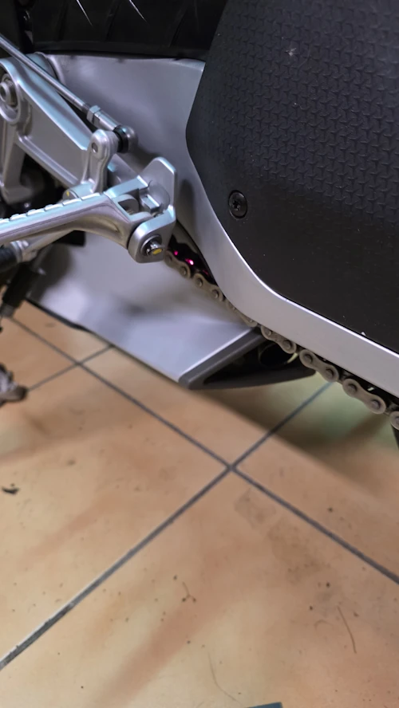
<figcaption>Tu vois le point rouge sur la chaîne, au niveau du cale-pied?</figcaption>
</figure>

Pour finir faut resserrer l'axe de la roue (écrou de 27, 120 Nm). Je vérifie que la chaîne est bien détendue, un coup de chiffon et c'est terminé. Non?

<figure style="max-width: 900px; margin: auto; text-align: center;">
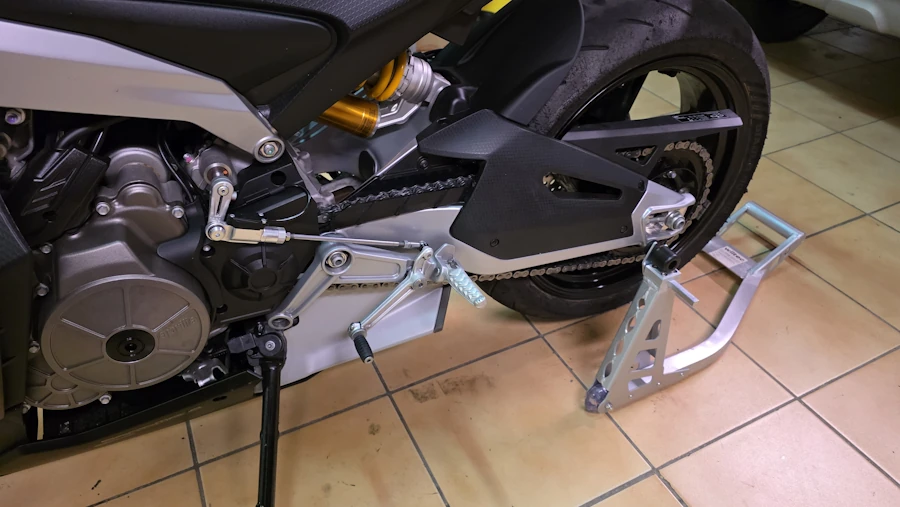
<figcaption>Terminé. Reste plus qu'à calibrer</figcaption>
</figure>

Non! C'est pas terminé. Faut encore sortir et faire une calibration:
* Menu Vehicle/Calibration
* Suivre les instructions, passer la seconde et rouler à 40 km/h pendant quelques secondes
* Éteindre la moto
* Attendre 1 minute

Pour le coup, là, on a terminé.

Bon, allez, la suite au prochain numéro. D’ici-là vous pouvez préparer votre [première journée sur circuit](), relire les [notes de pilotage]() ou faire des squats pour arriver affûté aux prochains roulages.

<figure style="max-width: 560px; margin: auto;">

    <iframe
    src="https://www.youtube.com/embed/TIhtpItTuxc?start=53"
    title="Faut faire des squats"
    style="position: absolute; inset: 0; width: 100%; height: 100%;"
    allowfullscreen>
    </iframe>

<figcaption style="text-align: center;">
    Faut faire des squats
</figcaption>
</figure>