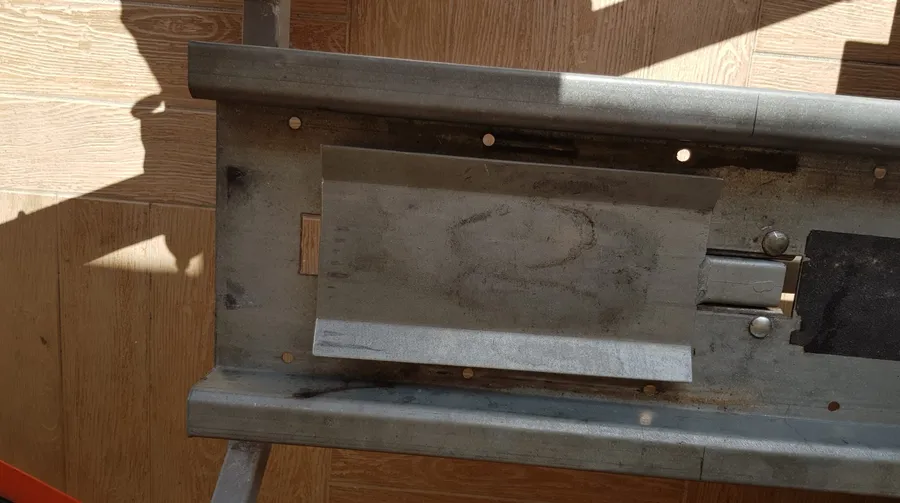

# Bloque Roue AceBikes sur Remorque MIL

Pour une fois je vais commencer par la fin et montrer ce que cela donne une fois que le bloque roue AceBikes est installé sur la remorque. Là, je suis content. J'ai le meilleur des deux mondes. Le plateau de la remorque bascule et je peux facilement monter et descendre la moto. Au pire, ce n'est pas plus compliqué qu'avant.

Le gros plus, c'est que dorénavant, une fois que la roue AV est dans le bloque roue, je peux tout lâcher et la moto tient toute seule. Magique ! C'est un vrai plus au moment où il faut installer les sangles.

Bref, je suis content du résultat mais comme cela ne s'est pas fait tout seul et que je n'ai rien vu sur le web autant expliquer les différentes étapes par lesquelles je suis passé. Rien de très compliqué mais il faut s'assurer que la cinématique du plateau qui bascule est respectée. Je travaille doucement et il m'a fallu une journée de travail.

## Commande

Tout a commencé par un coup de fil à MIL sur le site de Cognières. Là, je suis resté pendu 45 minutes au téléphone, en train d'entendre un gars servir les clients qui étaient sur site et de me laisser sécher en espérant que je raccroche... Je précise que le gars en question m'avait lâché le fameux : "Je suis à vous dans 5 minutes, pas plus".

Bref, j'ai fini par raccrocher. J'ai rappelé et je suis tombé sur un autre gars qui voulait me faire le même coup. Là, je l'ai intercepté tout de suite et j'ai pu lui poser la question : "Est-ce que je peux acheter le kit bloque roue de ma remorque MIL". Réponse : "Ah, non, non, non. Faut renvoyer la remorque à l'usine, ça va prendre beaucoup de temps et c'est impossible pour les clients de le faire par eux même."

J'adore quand on me prend pour une andouille... Bon, allez, salut et vous n'êtes pas près de me revoir... Vous l'avez compris, je ne recommande vraiment pas le revendeur MIL de Cognières.

Bon, OK, pas de solution chez MIL... De mon point de vue, c'est une bêtise, MIL aurait tout intérêt à concevoir un kit bloque roue que les clients pourraient installer après coup.

Bref, je mesure la largeur du rail sur la remorque. Je farfouille sur le web et rapidement j'arrête mon choix sur le bloque roue [AceBikes](https://www.acebikes.com/fr/). Afin de gagner 10 euros je passe commande chez Norauto... Mauvaise idée...

Franchement je ne recommande pas. Comme je ne recevais rien, pas de produit ni d'information, j'ai envoyé 2 ou 3 mails. Je n'ai jamais reçu de réponse. Finalement il aura fallu 3 semaines avant que j'aie le produit dans les mains. Dans l'absolu c'est acceptable si d'un autre côté on ne me promet pas que le colis va arriver à telle ou telle date. Enfin bref, la vente sur le web ce n'est pas le métier de Norauto. Il faut peut-être aller chez eux pour autre choses mais surtout pas pour commander des produits en ligne.

## Déballage

Finalement je reçois un SMS, je vais chercher le colis et je le déballe sur l'établi. Ça va bien se passer, je le sens, dans une heure c'est terminé...

Le produit et l'emballage donnent confiance. C'est propre et pro.

Je prends deux minutes pour poser le bloque roue dans le rail, à blanc, afin de voir ce que cela va donner. Pil-poil ce que je voulais. Je suis content, je sens que ça va être vite fait cette histoire...

En fait, la remorque est équipée d'une "pédale" qui participe à la cinématique du plateau. Cette dernière est indispensable. En effet quand la roue avant roule dessus ça fait basculer le plateau et ça verrouille ce dernier en position horizontale. On voit dans la photo précédente la "pédale" qui lève le bloque roue. Ci-dessous la "pédale" toute seule.

Il va falloir faire 2 choses :

* Réduire la largeur de la pédale afin qu'elle puisse basculer librement dans le bloque roue. Pour cela il va falloir découper, à droite et à gauche 1 cm de métal sur toute la longueur de la pédale.
* Ensuite il va falloir raccourcir la longueur de la pédale

J'ai beau retourner le problème dans tous les sens, afin de faire un travail propre, je ne vois qu'une seule solution : aller acheter une disqueuse...

### Disqueuse

Je suis hyper prudent et je fais quelques tests avant de me lancer. Oh, by the way, je prends soins de mettre ma blouse d'atelier, d'avoir les bras, les pieds et les jambes couverts. Pour finir je mets des gants et, à l'aide de serre-joint, je fixe solidement la pédale à la table qui me sert d'établit.

Je suis tout simplement bluffé par la qualité du travail effectué. C'est hyper propre, la disqueuse suit parfaitement la ligne tracée. Un demi-coup de lime à droite et à gauche et c'est terminé pour l'ajustement en largeur.

Maintenant il faut ajuster la longueur de la pédale car ci-dessous, on voit bien que si la "pédale" peut dorénavant coulisser dans le bloque roue elle coince en longueur...

On ne change pas une méthode qui gagne. Un coup de disqueuse dans la largeur et c'est réglé. Je peux alors positionner le bloque roue où je veux sur la remorque et faire librement fonctionner la pédale.

Ensuite, le plus long et le plus pénible consistera à percer et à faire des trous carrés. Une fois que c'est fait, que le bloque roue est en place et solidement vissé à la remorque, c'est terminé.

## Conclusion

J'ai commencé par faire un test avec la MT 07 (plus légère). Ensuite j'ai fait un autre test avec Kawette. Le fait de pouvoir lâcher la moto pour ajuster les sangles est un vrai plus. Je conseille vraiment d'acheter une remorque avec un bloque roue ou d'en installer un.

Bon, allez, la suite au prochain numéro. D’ici-là relisez les [notes de pilotage]() ou faites des squats afin de préparer les prochains roulages.

<!-- https://youtu.be/TIhtpItTuxc -->

<iframe width="560" height="315" src="https://www.youtube.com/embed/TIhtpItTuxc?si=qL84DxP-ejd_Yi4-&amp;start=53" title="YouTube video player" frameborder="0" allow="accelerometer; autoplay; clipboard-write; encrypted-media; gyroscope; picture-in-picture; web-share" referrerpolicy="strict-origin-when-cross-origin" allowfullscreen></iframe>

