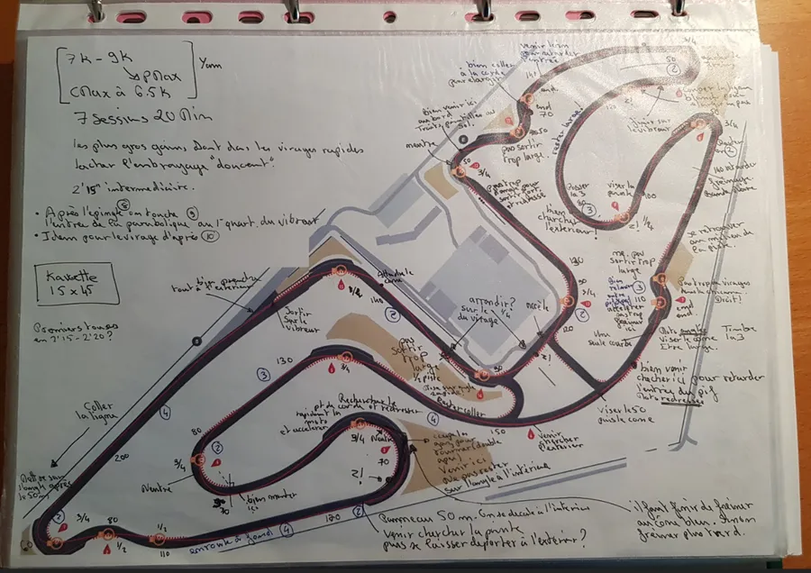
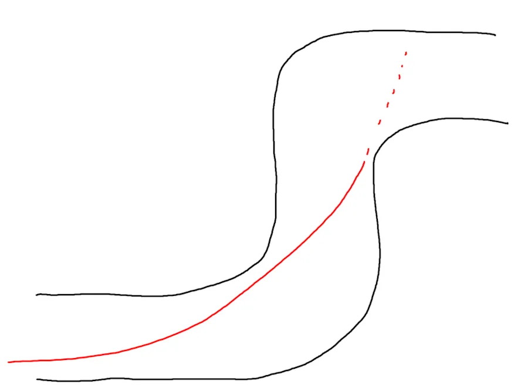
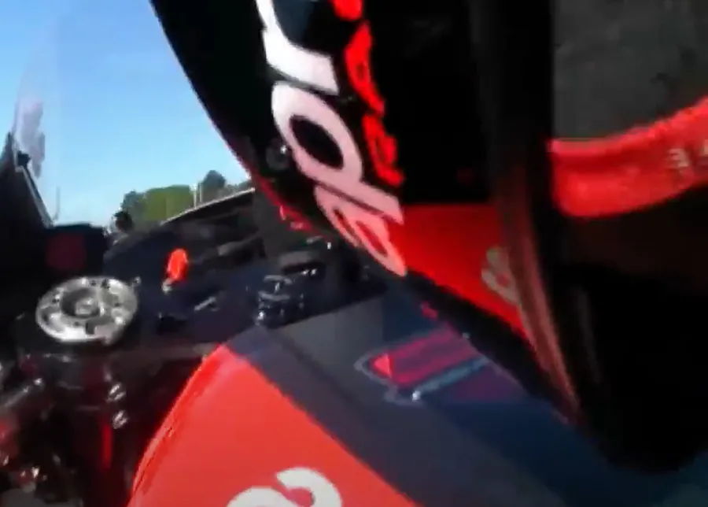

# Découverte de la piste 1
{: .no_toc }

## Table of Contents
{: .no_toc .text-delta}
- TOC
{:toc}

Tu as peu dormi la nuit dernière, tu t'es levé à 5H30, dans la voiture tu as fait le mariolle devant les autres mais bon, tu es excité comme une puce et ça gargouille un peu au niveau des intestins... Il est maintenant 9H35, tu as passé le sonomètre et le briefing. Un marshal a peut-être organisé une petite réunion à l'intention des débutants pendant que ceux du groupe "des hargneux" ouvraient le bal. Quoiqu'il en soit, il est 9H35 et les débutants doivent prendre possession du circuit dans 5 minutes. Tu mets les pieds et les roues pour la première fois ici et c'est à ce moment-là que tu te demandes ce que va donner la découverte de la piste ...

## Objectifs de la session

1. Découvrir la piste en roulant à 75% de nos capacités. Est-ce que ça veut dire que si le tour dans la catégorie débutant se fait en 2 min alors je dois tourner en 2'30" ? Peut-être. J'en suis de moins en moins sûr.
1. Faire l'effort de se coucher sur la moto
1. Faire l'effort d'ouvrir les gaz en grand dès qu'on peut
1. Faire passer ses pneus sur les points de corde

## Prérequis

### Prises de notes

* Je ne connais pas la piste **mais** j'ai étudié les trajectoires sur [YouTube](https://www.youtube.com/playlist?list=PLOmfq6wDOTY7St0LApT2rQh3fsZKbvYUS)

* Est-ce que j'ai une feuille imprimée avec le tracé du circuit et mes notes manuscrites ? Typiquement ces notes manuscrites sont prises en regardant YouTube à 75% ou même 50% de la vitesse normale. Il ne faut pas hésiter à chercher les séances Duo Run [DDRS](https://www.40tude.fr/zx6r-sur-circuit-stage-de-pilotage-de-radigues-rider-school-drrs/) où le moniteur fait des remarques au stagiaire. Il faut éviter de regarder les vidéos de pilotes pros ou de record du tour. Leurs marques de freinage, leur vitesse d'exécution n'ont rien à voir avec ce que l'on peut faire. Le seul truc qu'on a en commun avec les pros ce sont les points de corde. Bref, idéalement la découverte de la piste doit se faire avec un "prof". Un bon exemple ci-dessous au Vigeant :

https://youtu.be/ifJmAPjkvX0

<iframe width="560" height="315" src="https://www.youtube.com/embed/ifJmAPjkvX0?si=y7HGEcN_FeJfx2Rx" title="YouTube video player" frameborder="0" allow="accelerometer; autoplay; clipboard-write; encrypted-media; gyroscope; picture-in-picture; web-share" referrerpolicy="strict-origin-when-cross-origin" allowfullscreen></iframe>

### Dans la tête

* Est-ce que je suis capable de faire un tour de circuit "dans ma tête" ? Ne rigolez pas, c'est plus important qu'il n'y paraît. On déclenche le chrono sur son téléphone, on ferme les yeux, on fait un tour complet dans sa tête, on ouvre les yeux, on arrête le chrono et on regarde le temps.
  Afin que le chrono d'un tour "dans la tête" soit similaire au chrono d'un tour réel, il faut, pour chaque virage, avoir des points de repère : point de freinage, point de mise sur l'angle, point de corde, point de sortie.
  Il faut aussi avoir tout un ensemble de marques tout au long du circuit : je vise le grand arbre, je passe sur la marque jaune, sous la passerelle je suis à gauche de la piste, je fais bien attention d'arriver sur le virage en posant mes roues sur la ligne blanche, à l'extrême droite de la piste...
* Est-ce que je visualise bien les enchaînements de virages ? Est-ce que je peux les réciter sans hésitation à voix haute ?
  + Ligne droite, un gauche serré, un pif, un paf, un grand gauche…
  + Deux ou trois jours avant d'aller rouler, dans les embouteillages par exemple, c'est un bon moyen de faire passer le temps. Faut juste penser à mettre la feuille avec la piste et ses notes sur le siège passager.

### Sur papier

* Est-ce que je peux "dessiner" (plus ou moins fidèlement) la piste sur une feuille de papier ? C'est toujours le même principe... Faut qu'on arrive à avoir la piste en tête avant d'arriver.
* J'ai identifié les virages sur lesquels il va falloir porter une attention particulière durant la session. Dans ce contexte cela veut dire que dans ces virages on passe sur le point de corde au millimètre près. S'il faut diviser par 2 la vitesse dans le virage, tant pis, on pourra toujours l'augmenter ensuite. Les virages importants sont :
    1. Les virages avant les longues lignes droites
    1. Les grands virages rapides

## Petit rappel utile avant de rentrer sur le circuit

On ne pourra pas dire qu'on n'en a pas parlé...

* Petit coup d'œil derrière, sur la piste, avant de rentrer
    * Je lève mes fesses de la selle et je tourne franchement la tête et le haut du corps pour vraiment voir ce qui arrive. Si on reste assis, il ne faut pas hésiter à lâcher la main du côté vers lequel on tourne le buste.
* Ne **PAS** prendre la corde du tout premier virage
    * On rentre sur le circuit, généralement, dans une ligne droite
    * Si on va à la corde du premier virage, au bout de la ligne droite, on peut se faire percuter par un gars qui est sur la piste depuis un moment et qui est lancé
* Si on n'a pas de **couvertures chauffantes** alors on a gagné 2 tours de chauffe
    * Accélérations franches en ligne droite pour le pneu arrière
    * Freinages progressivement de plus en plus appuyés pour le pneu avant
    * **PAS** de zigzag. Ça ne sert strictement à rien
* On se fiche du chrono lors des tours de chauffe.
* Rouler très à l'aise, 2/3 de ses possibilités, ne pas se mettre en mode panique
* Au 3eme tour on monte gentiment à 3/4 de ses possibilités car c'est une session de travail (on n'est pas là pour claquer une pendule)

## La session

Le principe est simple : Pas de pression. Lors de découverte de la piste on souhaite juste prendre nos marques sur le circuit.

Avant de partir, il faudra bien se couvrir... Ça on sait. Cela dit, pense peut-être à bien remonter l'avant de ton casque quitte à avoir l'impression que ton menton ressort (ça fait bizarre au départ). Le truc c'est qu'une fois couché sur la moto, si ton casque est positionné comme pour la route tu ne vas pas voir grand-chose ou tu vas t'exploser les cervicales. Si tu oublies tu le feras à la seconde session 😂.

### À vérifier pendant la session

* Que la fin des vibreurs des lignes droites sont les points de mise sur l'angle du virage qui suit.
  + Si ce n'est pas le cas, quel repère fixe on peut prendre pour la mise sur l'angle ?

  + Y a des cônes sur le bord de la piste ?

  + Si je vois un gars beaucoup plus rapide que moi et qui colle vraiment à l'extérieur de la ligne droite qui précède un virage, est-ce que j'ai noté où il débutait sa mise sur l'angle ?

* Vérifier que dans les virages le point de corde est bien matérialisé par un cône au 3/4 du virage (late apex)
  + Si ce n'est pas le cas, quelle est la marque fixe à utiliser ?

  + S'il n'y a pas de cône, alors, si je découpe le vibreur intérieur en 4 sections, où est le point de corde ?

  + Pourquoi le cône n'est pas au 3/4 ? C'est un virage qui se resserre, qui s'ouvre, un double virage…

* Si le virage est grand et à rayon constant on va sans doute le prendre en double apex (le 2 à LFG ou le 8 des Ecuyers par exemple)

* Si c'est une épingle, il faut tirer tout droit, s'écarter du virage, plonger en retard et choper le point de corde au bout du quatrième quart du vibreur

* Dans un pif paf, on "sacrifie" le pif pour "sauver" le paf. Pas d'angoisse, il y a une fiche dédiée au [pif-paf](https://www.40tude.fr/pilotage-moto-08-pif-paf/). Cela dit, on ne rentre pas trop vite afin de ne pas sortir trop large du pif. En effet, comme il faut favoriser la sortie du paf il faut s'arranger pour être bien placé à l'extérieur avant l'entrée du paf. Si on rentre trop vite dans le pif, on va sortir large et va se retrouver à la corde du paf et on sera coincé (voir schéma ci-dessous)

### La poignée de gaz
* Faire attention à ce qu'on ne joue pas avec la poignée de gaz dans les virages
    * Jouer avec la poignée de gaz signifie, augmenter les gaz, puis les diminuer, puis en remettre une lichette, oups, je suis allé trop loin, je coupe...
    * Dit autrement, cela concerne les cas où, avant le point de corde, on rajoute des gaz car on est rentré trop lentement dans le virage. Au prochain tour il faudra retarder la mise sur l'angle.
    * Cela concerne aussi les cas où, après le point de corde, on coupe les gaz car on est beaucoup trop vite. Au prochain tour il faudra avancer la mise sur l'angle.
    * Au début, en mode découverte de la piste, on peut se faire surprendre et jouer avec la poignée de gaz dans les virages qui ont un rayon de courbure qui se resserre par exemple
    * On ne souhaite pas jouer avec la poignée de gaz car si on joue avec les gaz cela veut dire qu'on n'est PAS encore sur la ligne idéale (plus d'explications plus loin).
    * Au prochain tour il faudra donc rentrer beaucoup moins vite dans CE virage
        * Être très à l'aise pour pouvoir être très attentif
        * 2/3 de ce qu'on sait faire (au lieu de 75%)
        * On s'appliquera à ne pas jouer avec la poignée de gaz.
        * Dans les prochains tours on reviendra à 75% de nos capacités
        * Il faut passer, là, pile poil sur le point de corde sans jouer avec la poignée de gaz (ni up, ni down)
        * Et s'appliquer à mettre la Throttle Rule (voir juste après) en action dans CE virage
* Il faut bien retenir que si dans un virage on est constant sur la poignée de gaz alors on n'est PAS sur la ligne idéale (car on ne respecte pas la Throttle Rule)

### Throttle Rule
Once the throttle is cracked on, it is rolled on evenly, smoothly and constantly troughout the remainder of the turn

À partir du moment où on ouvre les gaz, on n'arrête pas de tourner la poignée, gentiment et continûment pendant tout le reste du virage.

On en parle dans cette vidéo :

<iframe width="560" height="315" src="https://www.youtube.com/embed/CE_UaGJqH-E?si=W9VrsJk1hFqXJi5V&amp;start=1014" title="YouTube video player" frameborder="0" allow="accelerometer; autoplay; clipboard-write; encrypted-media; gyroscope; picture-in-picture; web-share" referrerpolicy="strict-origin-when-cross-origin" allowfullscreen></iframe>

## À la fin de la session
Au sortir de la session de découverte de la piste, pour chaque virage, il faudrait avoir identifié :

* Le point de freinage (PF). Point où on commence à freiner.
* Le point de mise sur l'angle (PMSA). Point où on fait basculer la moto.
* Le point de corde (apex). L'unique point où les pneus de la moto se trouvent à la corde.
* Le point de sortie (PS)
* Les virages où la Throttle Rule n'est pas appliquée sont identifiés afin d'y revenir lors de la prochaine session (on n'est pas pressé, on a le temps, on peut passer plusieurs sessions à apprendre le circuit).

Allez, on rentre

* On remet les couvertures chauffantes sur les pneus
* Ensuite on boit un coup d'eau et on se remet de ses émotions
* Pour le reste on a 40 minutes avant la prochaine session. On est laaarge...
* Encore un petit effort. Prends le temps de noter tes impressions, par écrit, virage par virage, sur la feuille de papier que tu utilisais en regardant YouTube. Maj 17 03 23 : Pour chaque virage, note combien de rapport du rentre (-2, -1, -3...). En session tu n'as pas le temps et il ne faut pas regarder ton tableau de bord. Afin de te libérer la tête d'un truc supplémentaire on peut apprendre par cœur le nombre de rapport à rentrer avant chaque virage.

## Remarques complémentaires

### Est-ce que tu as la banane ?
Parce qu'en revenant de cette session de découverte de la piste c'est le plus important. Le reste on s'en fout... Faut être clair... En ce qui me concerne, ma carrière en moto GP est plutôt derrière moi :-). Quant à toi, si tu lis ces pages... Ben, ce n'est pas gagné les "Grid Girls" à tes côtés l'année prochaine. Donc, bref, ce qui compte c'est de s'être fait plaisir 😁.

Alors...Est-ce que tu t'es fait plaisir ? Si c'est le cas, bravo. Tu peux être très fier de toi. Ça veut dire que tu as roulé suffisamment lentement pour avoir assez de bande passante afin que ton cerveau réalise et mémorise tout ce qui s'est passé.

### Est-ce que je suis couché sur la moto ?
Ça, ça veut dire que je suis couché, en position aérodynamique dans les lignes droites et les longs virages. Cela n'a l'air de rien mais comme on ne le fait jamais sur route, on a tendance à avoir une position de motard de la Gendarmerie Nationale. C'est gênant car si on ne prend pas l'habitude tout de suite de se coucher, il sera d'autant plus difficile de s'y mettre plus tard.

Oui, je sais, ça fait bizarre. D'un côté on dit qu'on roule à 75% de nos moyens et de l'autre on dit qu'il faut se positionner comme si on devait aller chercher le dernier centième de seconde. En fait, ce n'est pas contradictoire avec la session de découverte de la piste. On est sur circuit, on apprend des choses nouvelles et l'une des toutes premières c'est le positionnement sur la moto dans les lignes droites et les virages rapides.

Bref, en ligne droite il ne faut plus de bras tendus, de nez au vent... Non, non, on est menton sur le réservoir, bras pliés et resserrés sur ce dernier. Quand je dis menton, c'est vraiment ça. Le casque doit toucher le réservoir. Il ne faut pas hésiter à s'entrainer à la maison, en statique dans le garage avec le casque sur la tête. Cela permet vraiment de voir ce que cela donne. Quand l'avant du casque touche le réservoir, qu'est-ce que je vois devant ? Rien, pas grand-chose... Si je veux que ma vision passe juste au-dessus du tableau de bord comment je dois être sur la moto ? Est-ce que mes coudes touchent mes genoux, est-ce qu'il y a de la place (ou pas) ... Enfin bref, autant prendre 15 minutes dans le garage pour vérifier tout ça.

Faudra en profiter pour mettre du scotch à peinture bleu sur le compteur (pas la peine d'être tenté de regarder autre chose que la piste le jour du roulage).

Si c'est difficile ou si cela ne passe pas au niveau des bras, pense à reculer tes fesses sur la selle. Si tu es très grand n'hésite pas à les pousser jusqu'à la section du passager ou alors à carrément t'assoire sur le dosseret de selle (mais là à mon avis tu mesures 2 m ou tu roules en Piwi).

En ligne droite, faut aller chercher le réservoir avec l'avant du casque. Oui, oui on voit que dalle...

Bref, on a "l'air d'un coureur" même si pour l'instant les chronos ne sont pas encore là. Perso j'ai un mal de chien à le faire car je me pette les cervicales et que je ne vois pas grand-chose... En plus ce n'est toujours pas devenu un réflexe naturel... Y a du boulot...

### Est-ce que j'ouvre les gaz en grand dès que je le peux ?

Typiquement, en ligne droite, est-ce que je suis sûr que les gaz étaient bien ouverts à 100% ?

Honnêtement, la poignée était au taquet ? Vraiment ? Et dans le petit bout de ligne droite, est ce que je n'ai pas été un peu "timide" en me disant que de toute façon, dans une demi-seconde j'allais sauter sur les freins...

Là aussi, ça peut paraître contradictoire avec le fait d'être en mode découverte de la piste et de se forcer à rouler à 75% de nos capacités. Cela dit, on peut très bien ne pas se mettre dans le rouge et accélérer à 100% dans les lignes droites (il n'y a rien de plus simple en fait). Par exemple, j’accélère fort mais je coupe tôt pour éviter de me mettre en mode panique à l'entrée du prochain freinage/virage.

Attention. S'assurer qu'on ouvre à 100% ne veut pas dire qu'on ouvre rapidement (trop rapidement) les gaz en sortie de virage. Dit autrement, ici, il faut juste s'assurer qu'on fait bien l'effort d'enrouler de plus en plus rapidement les gaz jusqu'à 100%. Faut enrouler jusqu'à ce que la poignée soit bloquée. Pas plus, pas moins.

C'est très rare que sur route on tire comme un malade sur tous les rapports. On est même plutôt toujours en sous-régime. De même, il est rare qu'on ouvre en grand quand on est sur une route de campagne. Il faut donc changer ce comportement et vraiment s'assurer qu'on est gaz à 100% dans les lignes droite et qu'on monte bien dans les tours avant de passer un rapport. Pas d'angoisse à avoir. Les moteurs modernes encaissent tout ça très bien... Cependant, il faut s'habituer à essorer la poignée de gaz et à entendre le moteur dans les tours.

## Conclusion temporaire

Je réalise que cela fait beaucoup de choses pour une session de découverte de la piste... Ici ma recommandation est la suivante : si tu n'es pas sûr d'ouvrir en grand dès que tu le peux ou si tu n'es pas sûr d'être couché sur la moto à la moindre occasion... Prends ton temps, refais une session, reste bien à 75% de tes capacités et travaille ces deux aspects de ton pilotage.
Maj 17 03 23 : Par exemple à la prochaine session donnes toi pour objectif de sentir que la poignée d'accélérateur arrive en butée à plusieurs endroits du circuit (là tu es sûr d'être 100% gaz). Pour la session d'après, en plus de l'ouverture des gaz à 100%, fixes toi comme objectif de sentir ton menton sur le réservoir à tel ou tel endroit du circuit. Tu auras préalablement choisi ces endroits sur ton plan.

À ce stade les trajectoires, la position, les chronos on s'en fout... Pense juste à te coucher et à ouvrir à 100%. Une fois que ça c'est en place, applique-toi à rentrer suffisamment **lentement** dans les virages pour placer tes roues sur le point de corde à chaque tour. Ou bien... Applique-toi à rentrer suffisamment vite dans les virages pour pouvoir rejoindre le point de corde et placer tes roues sur le point de corde à chaque tour. Généralement on (je) freine trop avant le virage, je rentre trop lentement et la moto n'a pas assez d'inertie pour rejoindre le point de corde toute seule. Au tour suivant je ne fais pas l'effort de freiner plus tard ou de freiner moins fort pour rentrer avec plus de vitesse dans le virage. La trouille ? Peut-être... Mais c'est idiot car comme on rentre sans freiner, ni accélérer, rien ne peut arriver... Enfin bref, "100 fois sur le métier, remettez votre ouvrage...". De toute façon je reviens sur ces histoires de point de corde dans l'article suivant.

Oui, oui il y a des pilotes qui roulent beaucoup plus vite... Je confirme, tes trajectoires ne sont pas au top... Oui, oui tu te fais avoir par beaucoup de monde au freinage... Cela dit, **avant de courir il faut savoir marcher**. Donc, refais une première session et acquiers de bonnes bases sur lesquelles tu pourras construire quelque chose.

