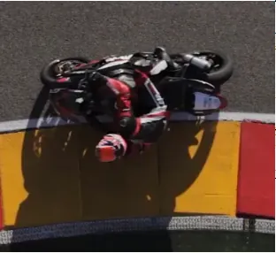
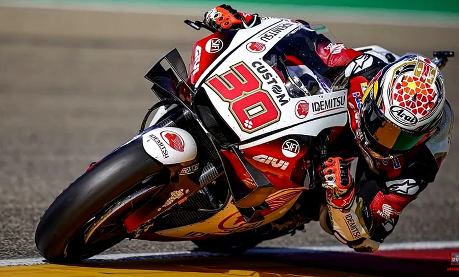
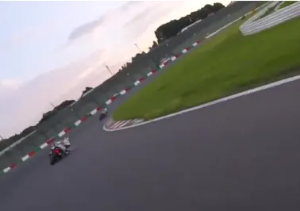
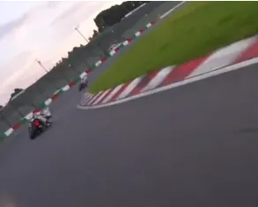
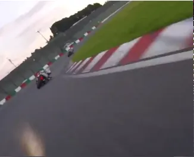
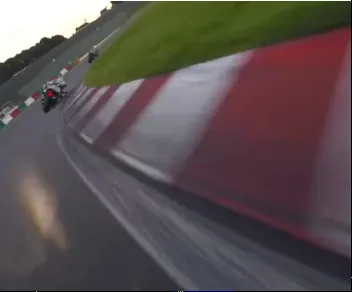
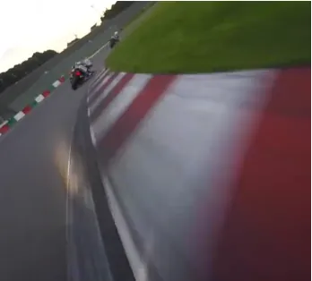
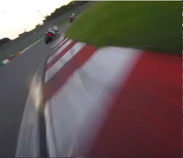
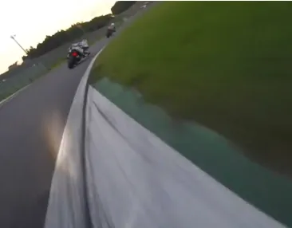
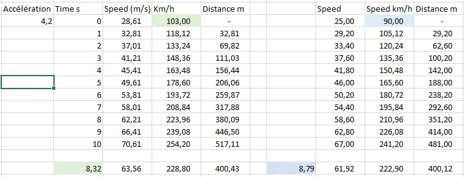

# Découverte de la piste 2
{: .no_toc }

## Table of Contents
{: .no_toc .text-delta}
- TOC
{:toc}

Comme la première note de [Pilotage Moto](https://www.40tude.fr/pilotage-moto-01-decouverte-de-la-piste/) à propos de la découverte de la piste devenait vraiment trop longue j'ai décidé de la couper en deux. Je continue donc ici avec une série de remarques diverses zé variées 😀.

## Suite des remarques complémentaires

### Note 3 : À propos du point de corde

Bon, là on ne rigole plus... C'est le quatrième, le plus important et le plus difficile à atteindre des objectifs que l'on a quand on met les pneus sur la piste (rappelle-toi Barbara : apprendre la piste, couché sur la moto, gaz à 100%, pneus sur le point de corde... [Relire ici si besoin](https://www.40tude.fr/pilotage-moto-01-decouverte-de-la-piste/))

* Quand on arrive sur un virage, il ne faut pas plonger trop tôt à la corde afin de ne pas y être coincé pendant 3 heures...

* Je le redis autrement. Si je me dirige trop tôt vers la corde, je me rassure, ma mise sur l'angle est lente etc. Mais... Mais je vais me retrouver très tôt à l'intérieur du virage. Là, je suis coincé, je ne peux rien faire : si j'accélère, je vais m'écarter et d'un autre côté je ne peux pas resserrer encore plus mon virage et finir par rouler dans l'herbe.... Bref, je peux juste attendre l'arrivée du cône libérateur qui marque le point de corde pour accélérer et sortir du virage.

* Le point de corde c'est... Un point. Donc mes pneus ne touchent les vibreurs qu'une fraction de seconde.

* Le point de corde **ce n'est pas** un point qui se trouve au même niveau que le cône, à un mètre sur le goudron de piste. Nan, nan... Il faut vraiment que les **pneus** (pas le genou ou la tête, les pneus) passent sur les premiers millimètres de goudron à la verticale du cône.
  Le corps est donc au-dessus du cône, du vibreur ou de l'herbe.
  Ce qui compte c'est la position des pneus vis à vis du point de corde et pas la position du casque ou des sliders.
  Comme on est en mode découverte de la piste, on est largement en dessous de nos capacités. Il faut donc vraiment en profiter pour faire passer les pneus à un millimètre à la verticale du point de corde. Perso j'ai tendance à vouloir aller trop vite, trop rapidement. Je ne prends pas le temps d'assurer mes points de corde à "basse vitesse" puis à passer de plus en plus vite au fil des tours. C'est complètement idiot de ma part.

#### Un exemple

Oui…mais non

Oui. Notez la différence d'écartement des pneus vis à vis de la bande blanche.

Voir la vidéo

<iframe width="560" height="315" src="https://www.youtube.com/embed/kfZlxpH2cZ0?si=cnNNl8Og5Z_6LiIj" title="YouTube video player" frameborder="0" allow="accelerometer; autoplay; clipboard-write; encrypted-media; gyroscope; picture-in-picture; web-share" referrerpolicy="strict-origin-when-cross-origin" allowfullscreen></iframe>

#### Remarques

1. Une des clés au début c'est de river ses yeux sur le cône au point de corde. On verra dans la prochaine session (three steps) que notre menton et nos yeux vont changer de cible au fur et à mesure de notre avancement dans le virage mais là, l'idée c'est d'apprendre à voir le virage, à faire abstraction du reste de la scene mais de rester focus sur le point de corde.
J'arrive au virage, je chope le cône du regard, je ne regarde rien d'autre, sans l'oublier je fais abstraction de tout le reste et jusqu'à ce que je sois sur le point de rouler dessus (2 ou 3 motos de long) je ne le lâche pas. Faut vraiment sentir que notre tête s'incline au fur et à mesure qu'on approche du cône. Il ne faut pas regarder l'entrée du virage dans son ensemble. Faut être "laser focus" sur le cône (pense aux lasers des yeux de superman).

2. Si j'ai du mal à placer mes pneus parfaitement sur le point de corde, je peux appuyer légèrement sur le frein arrière. Ça permet de resserrer le virage et d'ajuster la trajectoire le cas échéant.

3. Si je suis constamment trop loin du cône c'est que ma mise sur l'angle est trop lente. Pas de soucis, on débute... Donc, au prochain tour on ne change rien mais on freine plus tôt et on fait notre mise sur l'angle plus tôt. En faisant comme ça on ne se met pas dans le rouge en freinant plus fort ou en se mettant sur l'angle plus vite mais on va se rapprocher du point de corde.

4. Ça marche aussi dans l'autre sens. Si je suis trop tôt à la corde au prochain tour je ne change rien mais je retarde un peu (5 m, 2 motos de long) mon freinage.

#### Une autre image pour fixer les idées

Le seul truc à regarder dans la photo ci-dessous c'est la position des pneus. Ils sont où ? Sur le bitume, à un mètre du vibreur ? Nan. À 10 centimètres ? Nan. À un millimètre ? Même pas en rêve ! Ils sont sur la bande blanche en train de lécher le vibreur.

Je suis lourd, j'insiste etc. Mais finalement, avec un peu de recul, je crois que c'est le placement des roues sur le point de corde qui est le plus important. Au début il faut donc aller doucement, placer ses roues puis tour après tours passer plus vite en plaçant toujours ses roues sur le point de corde. Il faut apprendre à avoir la tête sur l'herbe, au-delà du vibreur. Ensuite, et seulement ensuite il sera temps d'affiner son freinage, sa position sur la moto, le moment où on réaccélère dans le virage... En effet, tout cela ne sera bénéfique que, si et seulement si, ils s'ajoutent à un placement correct des pneus au point de corde.

Prenons un exemple. Il est illusoire de vouloir améliorer son accélération en sortie de virage alors que mes roues ne passent toujours pas au point de corde. Pourquoi ? Tout simple. Je suis en intermédiaire, mes temps ne sont pas ridicules, j'ai, je pense des freinages de tueur etc. Je me dis qu'il faut maintenant que je soigne ma façon d'accélérer et de sortir des virages. Cela dit, je passe systématiquement à un mètre des points de corde (ma tête est au-dessus de la ligne blanche et/ou mon slider est sur la bande blanche).

Qu'est-ce qui va se passer ? Je vais peaufiner mon accélération, la vitesse à laquelle je redresse la moto en sortie de virage etc. Cela dit, je vais rapidement me heurter à un plafond de verre. En effet, comme mes pneus sont à un mètre du point de corde, mécaniquement j'ai moins d'espace pour élargir mon virage (il me manque 1 à 1.5 mètre). Le pire c'est que si je comprends qu'il faut que maintenant je soigne mes points de corde il sera trop tard (ou presque). J'aurai tellement de "mauvaises" habitudes qu'il sera très dur de revenir en arrière. En effet, cela revient à tout casser, à revenir aux fondamentaux et à tout reconstruire. Bref, ça va être long, pénible et frustrant. Autant partir sur de bonnes bases et commencer par soigner ses points de corde quitte à passer avec la moto verticale à 2 à l'heure. Le reste, on verra plus tard.

Je le redis. Le point corde c'est le quatrième, le plus difficile et le plus important de nos 4 objectifs initiaux. Il ne faut pas passer à la suite tant qu'on n'est pas capable de les assurer à chaque tour. À ce point de notre formation (niveau padawan première année...) on se fiche de la vitesse de passage et de la prise d'angle (les photographes on verra plus tard). Ça viendra naturellement par la suite lorsqu'on va accroitre notre rythme. À ce moment-là, pour assurer nos points de corde nous n'aurons pas d'autre choix que d'augmenter la vitesse de nos mises sur l'angle (très important, mais on verra plus tard), comme on ira plus vite on devra aussi prendre plus d'angle et pour prendre plus d'angle nous devrons changer notre position sur la moto, sortir un genou etc. Et là, il sera temps d'appeler Canal+ pour faire un reportage.

#### Une petite vidéo peut être...

Dans la vidéo suivante il ne faut pas hésiter à mettre la vitesse de lecture à 50% ou à 25% et à regarder où passe la roue avant... Oui, oui je sais, il n'est pas trop en mode découverte de la piste... Quoiqu'il en soit, ce sont vraiment des passages au millimètre sur les bandes blanches...

https://youtu.be/Ym4SRjSKmoI

<iframe width="560" height="315" src="https://www.youtube.com/embed/Ym4SRjSKmoI?si=TxKZ0QJrkl6UXa5b" title="YouTube video player" frameborder="0" allow="accelerometer; autoplay; clipboard-write; encrypted-media; gyroscope; picture-in-picture; web-share" referrerpolicy="strict-origin-when-cross-origin" allowfullscreen></iframe>

#### Un autre exemple

Heu… Oui, oui je confirme, lui aussi est un peu au-delà de nos 75% mais c'est parce qu'il est jeune et enthousiaste… ✊

La vidéo complète est ci-dessous.

https://www.youtube.com/watch?v=0LA2pNlNNw0

<iframe width="560" height="315" src="https://www.youtube.com/embed/0LA2pNlNNw0?si=b_x5V-D-BSLU1jnK" title="YouTube video player" frameborder="0" allow="accelerometer; autoplay; clipboard-write; encrypted-media; gyroscope; picture-in-picture; web-share" referrerpolicy="strict-origin-when-cross-origin" allowfullscreen></iframe>

### Note 4 : Comment vérifier qu'on a les bonnes lignes dans les virages ?

* Si on suppose qu'on rentre gaz coupés et freins relâchés dans la courbe

* Ce sont les lignes où on accélère constamment à partir du moment où on commence à accélérer. Oui, oui, je sais, c'est bizarre comme phrase... Le mieux, c'est de la relire et de la relire encore...

* Pour l'instant on est en mode découverte de la piste et/ou débutant. Donc, peu importe le moment où on commence à accélérer

* En revanche, il est très important qu'à partir du moment où on commence à enrouler le câble d'accélérateur, on arrête plus jusqu'à ce que la moto soit verticale et les gaz à 100% (c'est alors la fin "officielle" du virage)
  + Prenons un cas extrême pour fixer les idées. Si on commençait à accélérer à la toute fin de la courbe, notre virage se terminerait "officiellement" au milieu de la ligne droite qui suit le virage en question.

  + Pour un autre pilote qui accélérerait au tout début de la courbe (c'est un exemple théorique), la fin "officielle" de son virage se situerait peut-être au milieu du virage (ou au SAMU local).

* En gros, dans un virage, on est sur la ligne idéale quand on applique la **Throttle Rule** (relire la première partie de la note de [Pilotage moto](https://www.40tude.fr/pilotage-moto-01-decouverte-de-la-piste/))

* À garder en tête pour plus tard : Théoriquement, on est censé être 100% gaz au point de corde. Avec la throttle rule, cela veut dire qu'on a commencé à enrouler de manière imperceptible avant le point corde. Cela permet de répartir la charge de manière idéale entre l'avant et l'arrière. Ensuite au point de corde on est full gaz mais bon, comme on n'est pas sur une PlayStation, il s'écoule un certain temps entre la commande et le fait d'avoir toute la cavalerie à la roue arrière. À ce moment-là on aura dépassé le point de corde et on aura pas mal relevé la moto. Il n'y aura aucun risque.
  Mouai... Ben moi j'ai beau le savoir et faire le fanfaron en l'expliquant, je n'arrive toujours pas à le faire comme je voudrais.

### Note 5 : Lors de la première session il faut se forcer…

#### À ne pas rouler vite

Encore une fois, on est en mode découverte de la piste. Il faut donc savoir rester à 75% de nos capacités ou en tout cas à en garder sous le pied.

En ce qui me concerne, j'ai beaucoup de mal à m'y tenir et à ne pas me mettre rapidement dans le rouge. En effet, au bout de trois tours, j'ai qu'une envie, c'est d'aller "bouffer" celui qui est devant moi. C'est idiot... Je n'apprends rien et je ne progresse pas lors de ces sessions.

Il faut aussi avoir le courage de retomber à 2/3 de ses capacités pour étudier certains virages qui posent des problèmes.

Il ne faut pas hésiter non plus à sortir de la piste et à s'arrêter devant le gars qui autorise les rentrées sur piste. Ça casse le rythme et ça calme les esprits...

#### À être relâché et détendu

On ne peut pas tenir 7 sessions de 20 minutes par jour si on n'est pas détendu sur la moto. De même, comment être efficace à l'approche du prochain virage si on est tendu comme une corde dans la ligne droite qui le précède ? On n'a pas le choix, il faut se ménager des "aires de repos" où on peut reprendre notre souffle (ou s'assurer qu'on n'est pas en apnée), relâcher ses mains, ses doigts, ses bras etc.

Typiquement, je dois être capable de relâcher mon grip, de détendre mes doigts et d'aller tripoter le levier d'embrayage.

Dans un même ordre d'idée, en ligne droite je dois être capable de tenir l'accélérateur avec 3 doigts et avec la paume de la main décollée de la poignée. Qui a dit qu'il fallait être crispé et avoir une force de taureau pour enrouler une poignée de gaz ? Prends le temps de regarder cette vidéo par exemple. Instructif...

https://youtu.be/h24XjzybrA0

<iframe width="560" height="315" src="https://www.youtube.com/embed/h24XjzybrA0?si=1AiXYc_QGYxzFj5v" title="YouTube video player" frameborder="0" allow="accelerometer; autoplay; clipboard-write; encrypted-media; gyroscope; picture-in-picture; web-share" referrerpolicy="strict-origin-when-cross-origin" allowfullscreen></iframe>

De même, en ligne droite ou bien quand la moto est sur l'angle, je peux écarter mes coudes du corps. Je suis re-lâ-ché, je peux lâcher la main gauche (tu connais ta droite de ta gauche au fait?) et faire coucou au photographe...

#### À rester large en entrée de courbe

Encore une fois : "Arrêtes de plonger à la corde dès que tu peux car tu vas être dans les soucis à la sortie !"

#### À ne pas utiliser systématiquement toute la piste en sortie de courbe

Oui, oui, c'est contre intuitif car on a beau être débutant et dans une première session de découverte de la piste, on a tous en tête le mantra "Extérieur, Intérieur, Extérieur".

Le truc c'est que s'il faut au début bien penser à utiliser toute la largeur de piste en entrée et en sortie, dès qu'on est un peu plus à l'aise en sortie de tel ou tel virage, il faut alors faire l'effort de resserrer cette dernière.

L'idée, c'est qu'en faisant ainsi, on aura de la marge pour plus tard quand on accélérera beaucoup plus fort au point de corde et en sortie. On prépare l'avenir. Malin...

Un truc qui peut aider au début c'est de se forcer, en sortie de virage, à garder la tête en position basse, sur le côté de la moto alors que cette dernière est en position presque verticale.

#### Penser à regarder où passent les plus rapides et à les copier si cela a du sens.

Choisissez des gars qui, avant un virage, sont complètement à l'extérieur de la piste (limite à rouler sur la ligne blanche). Pensez aussi à repérer le marshal s'il tourne avec vous sur la piste et bien sûr s'il a adapté son rythme à celui de la session. À notre niveau, il faut regarder une seule chose... Son point de corde.

Ne suivez pas un gars qui vient de vous faire l'intérieur. Il est peut-être complètement à la ramasse, en perdition sur ses freins etc.

Ne suivez pas non plus un gars qui a un 1000 alors que vous roulez en 600. Il roule au couple et pas vous.

Idem si vous êtes en 600 et qu'un gamin en Yam R3 vous met 10" au tour (ptit con!). Il n'a pas le même moteur, et donc pas les mêmes trajectoires.

### Note 6 : Faut être relâché sur la moto

Je sais, j'en ai déjà parlé mais je vais en remettre une couche avec d'autres mots. Nos premières sessions sont des sessions de découverte de la piste. On est à 75% de nos possibilités. Donc autant faire l'effort d'être relâché. Non ?

Il faut donc vérifier régulièrement qu'on n'a pas tendance à s'accrocher au guidon.

#### À propos des guidonnages (wobble, tank slapper)

* Les mouvements de fourche sont nécessaires. Ils font partie du système de la suspension (pneus et fourche)

* Ça arrive quand les pneus et la fourche ont atteint leurs limites

* Il y a alors un changement de la charge sur les pneus qui se répercute dans la fourche qui rebondi en ne revenant pas de suite à sa position d'équilibre

* Personne n'a la force d'empêcher les mouvements de la tête de fourche

* Normalement les vibrations de l'avant ne se propagent pas au reste de la moto

* Sauf... Si le pilote est accroché au guidon (les motos rouleraient bien mieux si il n'y avait pas de pilote...)

* [Exemple de guidonnage](https://www.facebook.com/MotoGP/videos/quartararos-super-scary-sachsenring-moment-at-262kmh/343457489889047/)

* [Article complémentaire](http://www.lerepairedesmotards.com/conseils/guidonnage.php)

Si la tête de fourche secoue en sortie de virage, si la moto est correctement entretenue, cela ira tout aussi mal si on serre les bracelets. Afin de s'économiser physiquement, finalement, il est donc plus efficace de relâcher les bracelets. C'est tellement facile à dire devant un écran de PC...

Bref, autant relâcher les bracelets et laisser la moto s'auto réguler.

#### Être relâché ça veut dire

* Être capable d'écarter et de rapprocher les coudes du corps (Chicken Wings)

* Changer le grip sur les poignées quand on est sur l'angle.

* Avant et dans le virage, sentir que le buste est mobile et qu'on plie bien le coude intérieur. Avant un virage, à la fin du freinage ne pas sentir qu'on force comme un "dahu" sur les avant-bras afin de les garder tendus avec le secret espoir d'enfoncer l'avant de la moto dans le sol. À la fin du freinage on est normalement très light sur le frein avant, on utilise le poids du corps (tête et buste) pour appuyer l'avant de la moto. Les bras ne sont donc pas tendus. Au contraire, à la fin du freinage, les bras se plient pour nous permettre de pencher le buste et approcher la tête vers la poignée qui est à l'intérieur du virage.

Alors que la moto roule en ligne droite, afin de confirmer qu'on est "Zen" on peut vérifier qu'on est capable de faire des :

2. **Chicken Wings** : être capable de faire le poulet en levant et en baissant les coudes. Oui, oui je confirme, on est ridicule...

6. **Doigts de Sauron** : être capable d'étirer ses doigts et d'aller les poser sur les leviers d'embrayage. Côté accélérateur, on tient ce dernier à 3 doigts et la paume est écartée de la poignée.

La tête de fourche peut bouger à l'accélération si cette dernière est trop forte. Pour éviter ce phénomène il faut avoir des accélérations précoces, douces et continues en virages (ce n'est rien d'autre que la **[Throttle Rule](https://www.40tude.fr/pilotage-moto-01-decouverte-de-la-piste/)** )

### En cas de wheeling il faudrait...

* Rester couché, s'avancer sur le réservoir, le nez dans la bulle, fesses "soulagées " par les cuisses, en poussant sur les cales pied (sur circuit, faut finir par avoir la marque des cale-pieds sous nos semelles)

* Ne pas serrer trop fort le guidon quand la roue retouchera le sol

* C'est une évidence, mais quand la roue est en l'air, on ne touche surtout pas le frein avant mais on peut toucher le frein arrière.

#### Être accroché au guidon c'est ce qui nous fait sortir large

2. Je suis en virage

6. Comme je suis accroché au guidon je tire dessus (c'est mécanique)

10. Je tire plus sur le bracelet intérieur car c'est celui qui est le plus accessible (mon bras intérieur est plié donc c'est plus facile de tirer).

14. Donc on contre braque
    * Si ce n'est pas clair cette histoire de contre braquage, il faut juste se rappeler qu'en entrée de virage, je pousse sur le bracelet intérieur au virage (qu'on le veuille ou non, qu'on le sente ou non, qu'on le fasse sciemment ou non)
    * Autrement dit la moto tourne
      + Du côté du bracelet que je pousse

      + Du côté opposé du bracelet que je tire.

    * Relisez le point 2 précédent. Si je tire (au lieu de pousser) sur le bracelet intérieur, la moto va donc mécaniquement se diriger de l'autre côté. Pour cela elle va se relever et elle va donc élargir le virage.

18. Donc, dans un virage, quand on tire sur le bracelet intérieur, on relève la moto

22. Conclusion : quand je suis accroché au guidon en virage, je tire sur le bracelet intérieur ce qui relève mécaniquement la moto et nous fait sortir large.

### Note 7 : Idée d'exercice

* Faire plusieurs tours de circuit en restant sur un seul rapport. Au pire on en utilise 2 (la 2 et la 3 par exemple) mais utiliser un seul rapport c'est ce qu'il y a de mieux.

* **SANS FREIN** (c'est le plus important dans l'exercice). Donc, en bout de ligne droite on coupe les gaz, on ne freine pas, on rentre dans le virage avec ce que l'on a comme vitesse.

* Le but est de tout faire à l'accélérateur (accélération et ralentissement)

* Pour des raisons évidentes de sécurité, lors des journées de roulages, ce n'est pas possible. Cela dit, c'est un super exercice qui permet de réaliser qu'en règle générale, on rentre beaucoup trop lentement dans les virages. C'est un exercice qui a été initialement inventé par [Keith Code](https://en.wikipedia.org/wiki/Keith_Code) pour la California Superbike School. Cet exercice est réalisé lors des [stages de pilotage DRRS](https://www.40tude.fr/zx6r-sur-circuit-stage-de-pilotage-de-radigues-rider-school-drrs/) ou [LFG](https://www.circuitslfg.fr/produit/lfgmoto-stage-pilotage-1-jour/).

https://youtu.be/EJQaKf3txVg?t=184

<iframe width="560" height="315" src="https://www.youtube.com/embed/EJQaKf3txVg?si=_SHs0_X1wy9_4IL4&amp;start=184" title="YouTube video player" frameborder="0" allow="accelerometer; autoplay; clipboard-write; encrypted-media; gyroscope; picture-in-picture; web-share" referrerpolicy="strict-origin-when-cross-origin" allowfullscreen></iframe>

### Note 8 : À vérifier lors de la prochaine session

Trois petits trucs liés à la vitesse

2. Est-ce que je prends l'habitude de la vitesse ?
   Il n'y a pas de honte... C'est vrai qu'à rouler quotidiennement à 80 km/h on n'a tout simplement pas l'habitude de voir la piste défiler si vite. Bref, il ne faut pas hésiter à prendre son temps et s'il faut une, deux ou trois sessions de découverte de la piste pour accoutumer notre cerveau à la vitesse et bien... On va prendre le temps qui faut.

6. Est-ce que je n'ai pas peur quand je vois le bord de piste "me sauter à la gueule" ? Je ne souhaite pas être grossier pour être grossier mais c'est vrai que la première fois que je me suis trouvé dans un grand gauche, la tête pas trop loin du guidon et que j'ai vu les vibreurs blancs et rouge me foncer dessus... J'ai coupé. Ensuite j'ai arrêté d'accélérer... Ensuite je continuais à enrouler. Là aussi, je pense qu'il faut laisser du temps au temps afin que les muscles, la vision et le cerveau s'habituent à ces nouvelles positions, ces nouveaux points de vue etc. Là aussi, Rossi ce n'est pas fait un jour, il est normal que plusieurs sessions soient nécessaires.

Bref, il ne faut pas mettre la charrue avant les bœufs et tant qu'on n'est pas à l'aise avec la vitesse, les vibreurs qui jaillissent etc... Mieux vaut rester en mode découverte de la piste et se dire que le temps qu'on passe là, à se forcer à ouvrir en grand dès qu'on en a l'occasion est un investissement pour plus tard.

### Note 9 : À propos des virages importants

Il y a 2 types de virages qui sont beaucoup plus importants que les autres et sur lesquels il va falloir porter une attention particulière lors de la reconnaissance :

* Les virages avant les longues lignes droites. Il faut être sur la ligne qui nous permet d'appliquer la Throttle Rule très tôt afin de pouvoir bénéficier d'une accélération maximum pendant le plus longtemps possible.

* Les grands virages rapides. Il faut avoir une vitesse d'entrée la plus élevée possible car c'est celle qu'on va garder dans le virage. Comme le virage est long, on va la garder longtemps. C'est une question de confiance en notre capacité à rentrer plus fort (plus facile à écrire qu'à faire...)

La vidéo ci-dessous rentre plus dans les détails.

https://youtu.be/xJqnsOYD8T0

<iframe width="560" height="315" src="https://www.youtube.com/embed/xJqnsOYD8T0?si=aohrMEMyOgs7CJYJ" title="YouTube video player" frameborder="0" allow="accelerometer; autoplay; clipboard-write; encrypted-media; gyroscope; picture-in-picture; web-share" referrerpolicy="strict-origin-when-cross-origin" allowfullscreen></iframe>

Un calcul rapide montre que :

* Sur 400 m de ligne droite (c'est court)

* Avec 10 km/h de différence en sortie de virage

* En accélérant à 0,43 G (4.2 m/s²)

* On gagne 0.5 sec

* En bout de ligne droite, à 200 km/h ça représente 25m d'écart, soit 12 motos les unes derrière les autres. Pas mal...

Dans le tableau ci-dessous, on a 0.43 G (4.2 m/s²) d'accélération alors qu'on part à 103 km/h (à gauche) et 90 km/h (à droite). Au bout de 8.32 sec, à gauche, on a fait 400m. A droite, pour faire 400 m il faut attendre 8,79 sec. Y a donc 0.5 sec d'écart.

