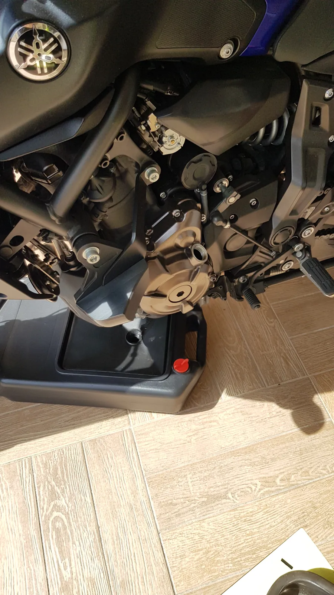
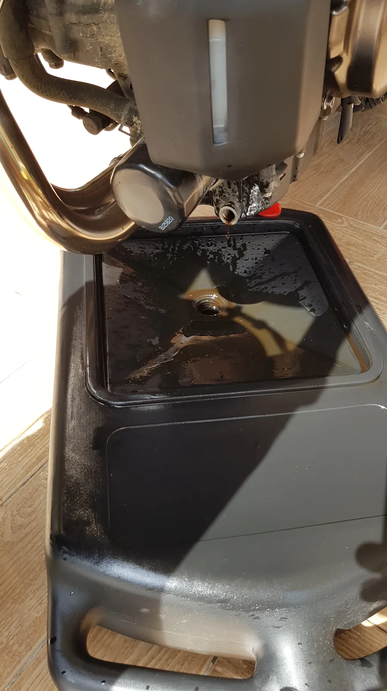
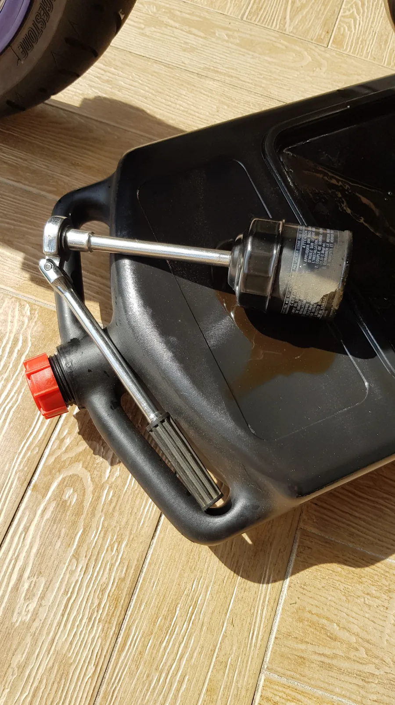
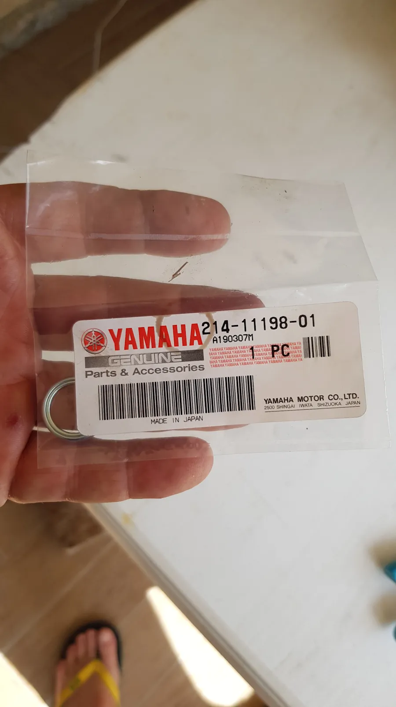
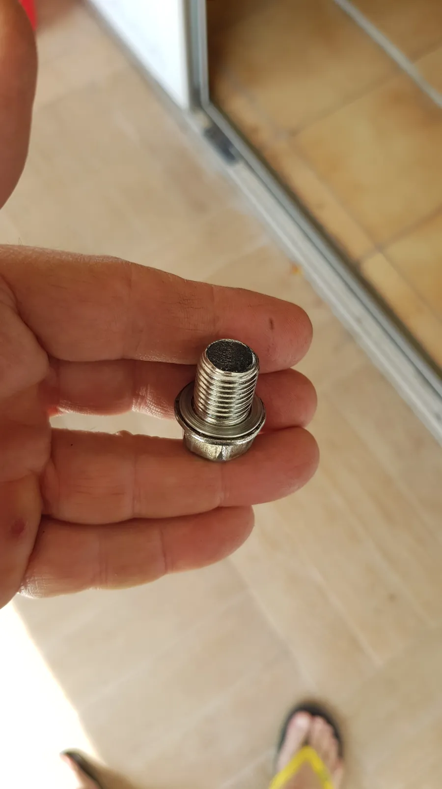
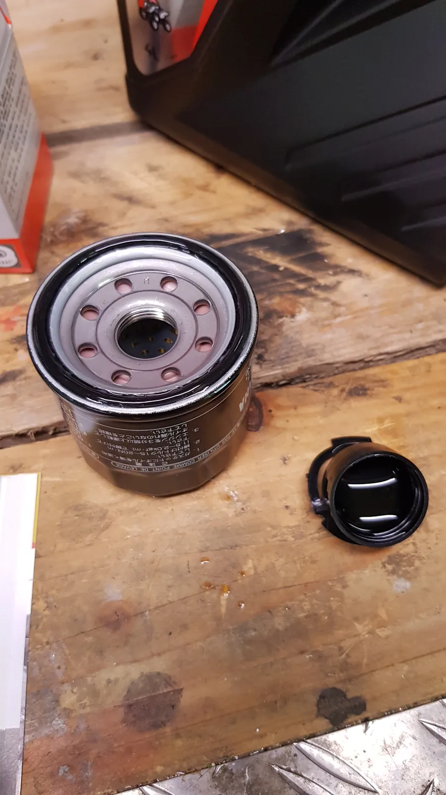
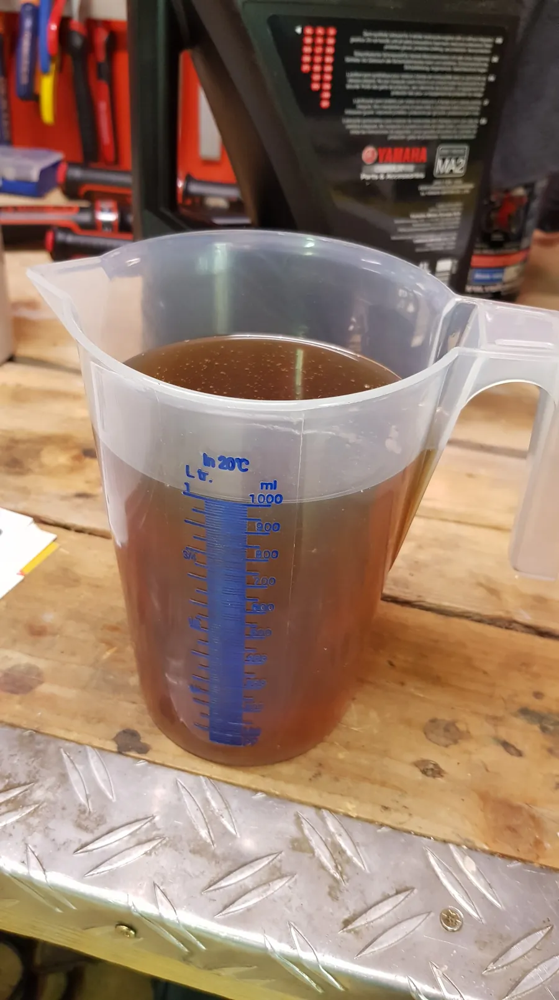
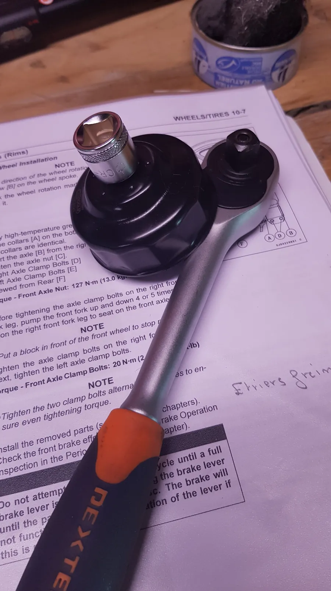
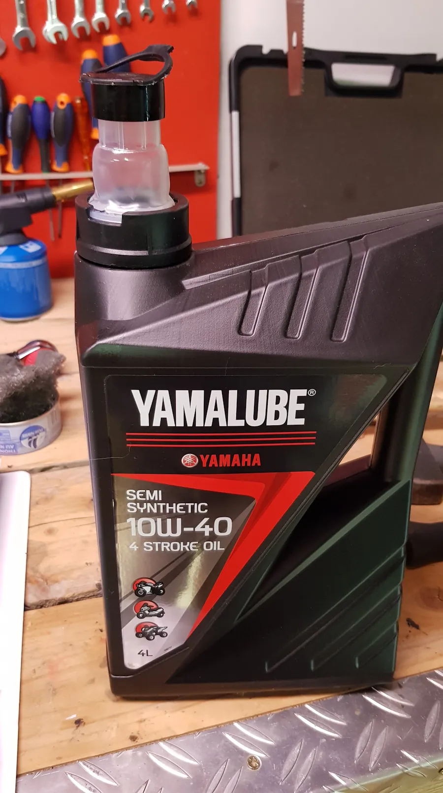

Ce n'est pas très compliqué, ce n'est pas très long, mais faire la vidange d'un MT 07 Yamaha est toujours instructif.

Du point de vue outillage il faut :

* Une clé à pipe de 17 pour le bouchon de vidange
* Une cloche multipan (64.2 mm) pour le filtre à huile et peut être un adaptateur pour la clé à cliquet.
* Un bac à huile pour recevoir l'huile usagée et l'emmener ensuite à la déchetterie
* Un entonnoir

Ensuite on procède comme suit :

1. Acheter 3L d'huile 10-40 hyper classique, un filtre et joint. Pas de petites économies. Tu changes le filtre et le joint à chaque vidange. C'est non négociable.Point.
1. Faire chauffer la moto 5 minutes pour que l'huile moteur soit plus fluide. Pas la peine de donner des coups d'accélérateur. Laisse-la monter gentiment en température.
1. Idéalement, mais ce n'est pas obligatoire, mettre la moto sur une béquille de stand pour qu'elle soit bien tenue et bien verticale.
1. Mettre le bac sous la moto (con, mais pas con Jean-Pierre...)
1. Ouvrir le bouchon de remplissage d'huile qui est à gauche de la moto pour faire rentrer de l'air dans le bas du moteur afin que l'huile puisse alors bien s'écouler
1. Dévisser le bouchon d'huile. Il est devant le moteur à côté du filtre. Tu ne peux pas le louper. Attention, à la fin du filetage, l'huile va être chaude et au début si le bac n'est pas bien positionné tu risques d'en mettre partout.
1. Dévisser le filtre à huile. Attention les cloches multipan ont souvent un carré de 3/8. Il faut alors un adaptateur 1/2 ou 1/4 vers 3/8 ou une cloche avec un carré de 1/2 ou 1/4. Les adaptateurs se trouvent très facilement : Casto, Leroy...
1. Sur le nouveau filtre, avec l'index, mettre un peu d'huile neuve sur le joint. Visser ensuite le filtre à la main au début. À la fin, ne pas visser comme un sourd si tu n'as pas de clé dynamométrique. Sinon c'est **17 Nm**. L'étanchéité se fait par le joint, pas par le couple de serrage. Donc molo sur le serrage. 
1. Normalement toute l'huile est maintenant dans le bac. Mets la moto sur ses roues et penche-la de gauche à droite pour vider ce qui peut encore être vidé.
1. Un coup de chiffon autour du trou de vidange. Tu récupère le nouveau joint et tu visse le boulon à la main au début. Là aussi, à la fin, pas la peine de serrer comme un sourd sinon c'est **43 Nm**.
1. Mesure de la quantité précise d'huile. Comme on a changé le filtre il nous faut **2.6L**. Tu effectues le remplissage doucement sans en mettre partout. Faut peut-être un entonnoir. Vissage du bouchon de remplissage. Là aussi pas la peine de serrer comme une bête.
1. Tu démarre la moto. Pas de coup d 'accélérateur et pas de panique si pendant quelques secondes le témoin d'huile s'allume. S'il reste allumé, tu mets un petit (j'ai dit un petit) coup d'accélérateur. Quand c'est bon côté témoin tu coupes le moteur.
1. Tu vérifies enfin le niveau d'huile mais normalement il est bon.
1. C'est bon tu as terminé, tu peux être fier de toi.

Quelques photos des étapes principales.

Bac à vidange sous la moto avant et pas après 😁 (étape 4)  
On voit que le bouchon de remplissage a été enlevé (étape 5).   

&nbsp;

&nbsp;

Laisse couler. Va prendre un thé, t'es pas un pro, tu as 2 minutes.

&nbsp;

&nbsp;

Filtre à huile démonté

&nbsp;

&nbsp;

Achète toujours un joint

&nbsp;

&nbsp;

Boulon et joint neuf à remonter  
Y a pas d'aimant sur le bouchon sinon lors du démontage faut regarder si y a pas de la limaille  
Si c'est le cas et si la moto n'est plus en rôdage... Ca pue.  
Si y un peu (j'ai bien dit un peu) de limaille et que la moto est en rodage, faut pas s’inquiéter. 

&nbsp;

&nbsp;

Avec le doigt, un peu d'huile sur le joint

&nbsp;

&nbsp;

Mesure de la quantité d'huile. Ici 2.6L

&nbsp;

&nbsp;

Cloche multipan avec son adaptateur 3/8

&nbsp;

&nbsp;

10W-40 hyper classique

&nbsp;

&nbsp;

  
*À plus, la suite au prochain épisode...*

