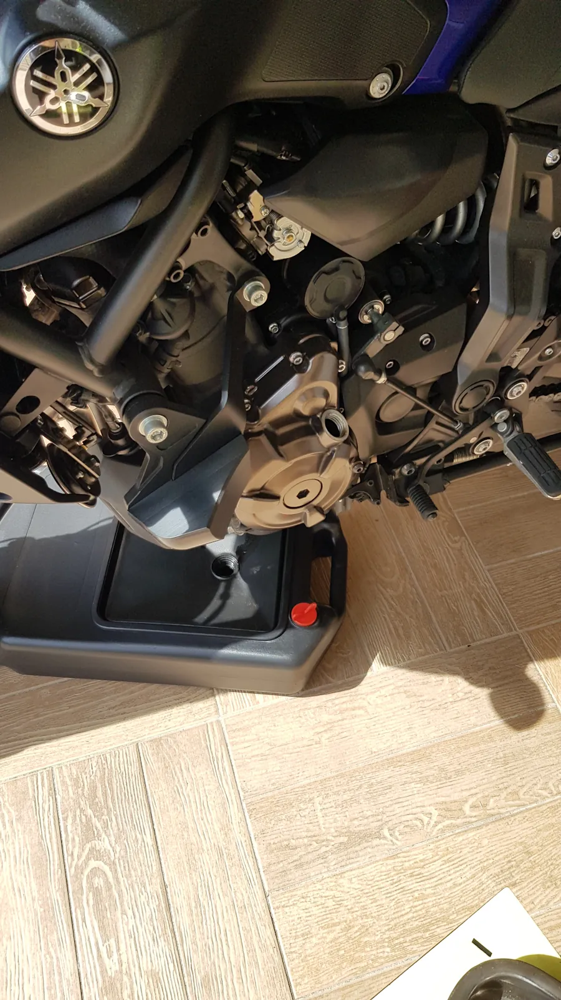
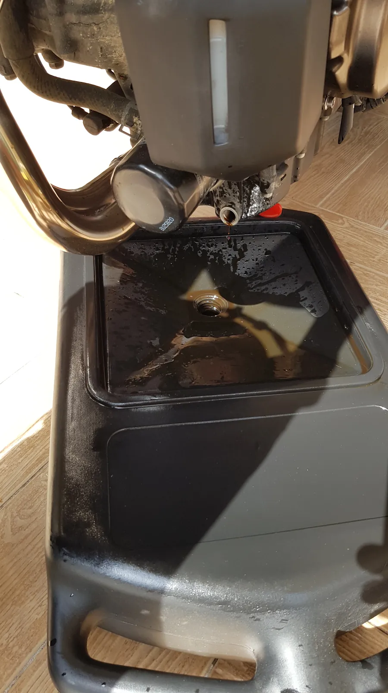
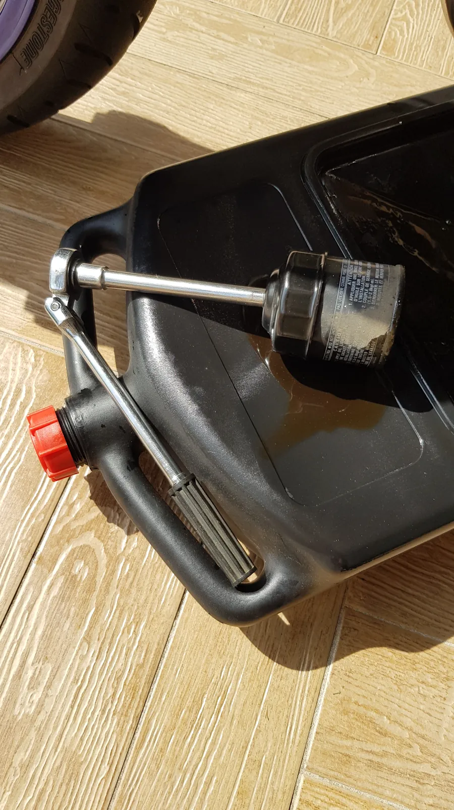
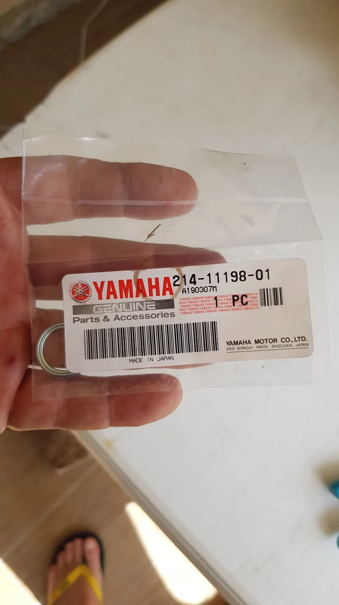
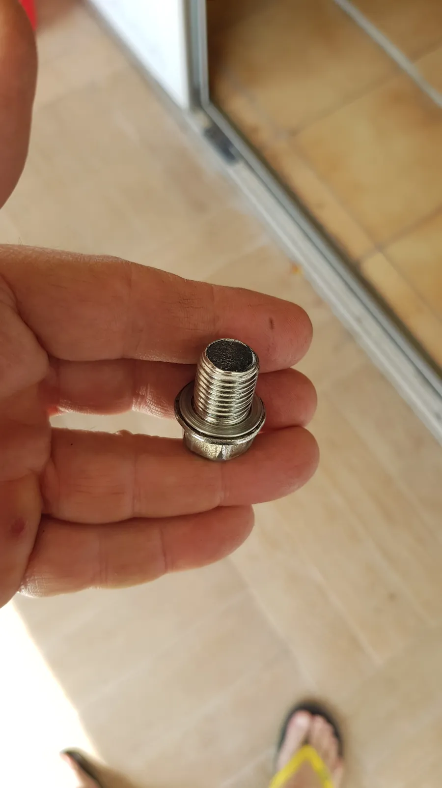
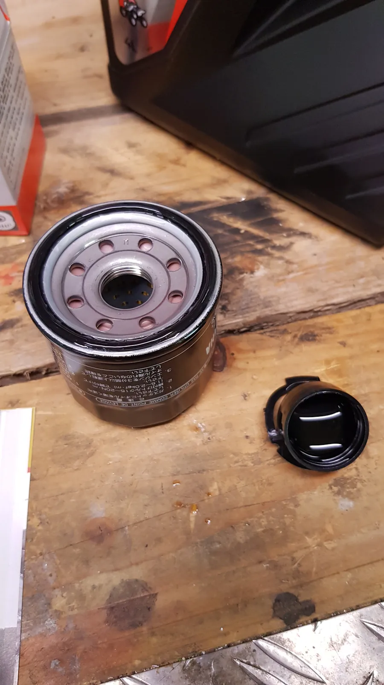
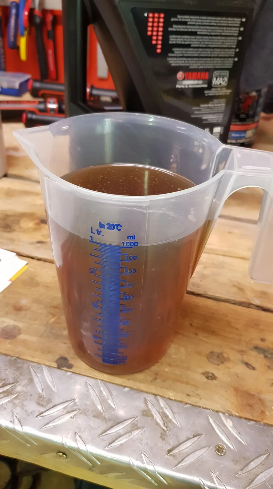
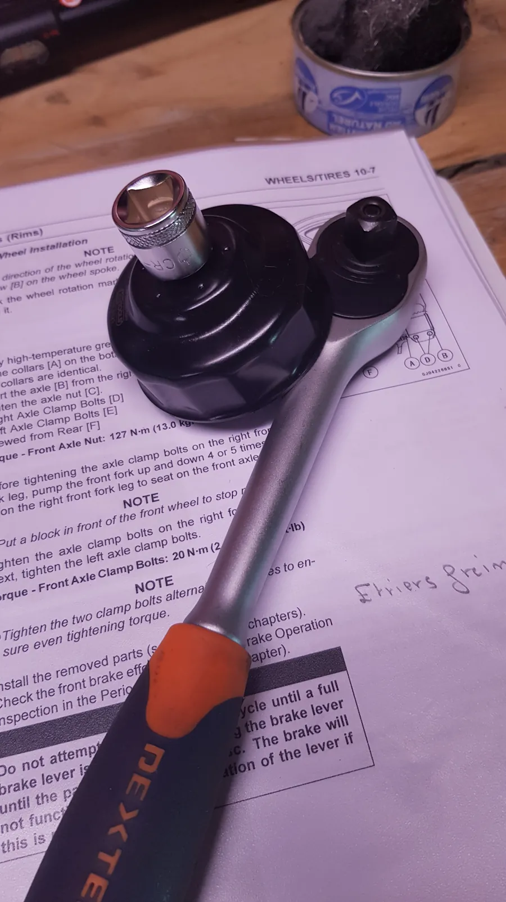
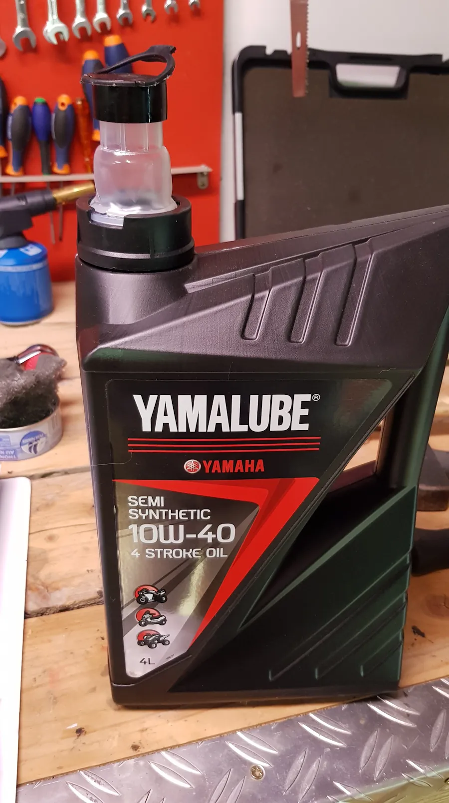

# Vidange d'un MT 07

Ce n'est pas très compliqué, ce n'est pas très long, mais faire la vidange d'un MT 07 est toujours instructif.

## Outillage

* Une clé à pipe de 17 pour le bouchon de vidange
* Une cloche multipan (64.2 mm) pour le filtre à huile et peut être un adaptateur pour la clé à cliquet.
* Un bac à huile pour recevoir l'huile usagée et l'emmener ensuite à la déchetterie
* Un entonnoir pour remettre l'huile neuve sans en mettre partout
* Chiffon et/ou Sopalin

## Achats
 * 3L d'huile 10-40 hyper classique
 * Un filtre
 * Un joint

Pas de petites économies.
Tu changes le filtre et le joint à chaque vidange.
**C'est non négociable.**

## Ensuite on procède comme suit :

1. Faire chauffer la moto 5 minutes pour que l'huile moteur soit plus fluide. Pas la peine de donner des coups d'accélérateur. Laisse-la monter gentiment en température.
1. Idéalement, mais ce n'est pas obligatoire, mettre la moto sur une béquille de stand pour qu'elle soit bien tenue et bien verticale.
1. Mettre tout de suite le bac sous la moto (con, mais pas con Jean-Pierre...)
1. Ouvrir le bouchon de remplissage d'huile qui est à gauche de la moto pour faire rentrer de l'air dans le bas du moteur afin que l'huile puisse bien s'écouler
1. Dévisser le bouchon d'huile. Il est devant le moteur à côté du filtre. Tu ne peux pas le louper. Attention, à la fin du filetage, l'huile va être **chaude** et au début si le bac n'est pas bien positionné tu risques d'en mettre partout car elle ne va pas tomber directement sous le trou mais un peu devant. Bref, méfiance au tout début de l'écoulement.
1. Dévisser le filtre à huile. Attention les cloches multipan ont souvent un carré de 3/8. Il faut alors un adaptateur 1/2 ou 1/4 vers 3/8 ou une cloche avec un carré de 1/2 ou 1/4. Les adaptateurs se trouvent très facilement : Casto, Leroy...
1. Sur le nouveau filtre, avec l'index, mettre un peu d'huile neuve sur le joint. Un coup de chiffon là où le joint va venir s'appliquer. Visser ensuite le filtre à la main au début. À la fin, ne pas visser comme un sourd si tu n'as pas de clé dynamométrique. Sinon c'est **17 Nm**. L'étanchéité se fait par le joint, pas par le couple de serrage. Donc molo sur le serrage.
1. Normalement toute l'huile est maintenant dans le bac. Mets la moto sur ses roues et penche-la de gauche à droite pour vider ce qui peut encore être vidé.
1. Un coup de chiffon autour du trou de vidange. Tu récupères le nouveau joint et tu visse le boulon à la main au début. Là aussi, à la fin, pas la peine de serrer comme un sourd sinon c'est **43 Nm**.
1. Mesure de la quantité précise d'huile. Comme on a changé le filtre il nous faut **2.6L**. Tu effectues le remplissage doucement sans en mettre partout. Faut peut-être un entonnoir. Vissage du bouchon de remplissage. Là aussi pas la peine de serrer comme une bête et surtout, pas la peine d'utiliser une pince plate ou une Becro pour "finir" le serrage (c'est carrément une connerie). À la main. c'est bon.
1. Tu démarres la moto. Pas de coup d 'accélérateur et pas de panique si pendant quelques secondes le témoin d'huile s'allume. S'il reste allumé, tu mets un petit (j'ai dit un petit) coup d'accélérateur. Quand c'est bon côté témoin tu coupes le moteur.
1. Tu vérifies enfin le niveau d'huile mais normalement il est bon.
1. Tu ranges, c'est bon tu as terminé, tu peux être fier de toi.

Au fait, tu as gagné un tour à la déchetterie pour te débarrasser de l'huile dans de bonnes conditions.

## Quelques photos des étapes principales.

Bac à vidange sous la moto **avant** et pas après 😁 (étape 4)
On voit que le bouchon de remplissage a été enlevé (étape 5).

<figure style="max-width: 450px; margin: auto; text-align: center;">

<figcaption>Bac à vidange en place, bouchon de remplissage enlevé</figcaption>
</figure>

Laisse couler. Va prendre un thé, t'es pas un pro, tu as 2 minutes.

<figure style="max-width: 450px; margin: auto; text-align: center;">

<figcaption>Vas boire un thé ou fais autre chose sur la moto pendant que l'huile chaude coule</figcaption>
</figure>

Filtre à huile démonté

<figure style="max-width: 450px; margin: auto; text-align: center;">

<figcaption>Le filtre à huile dans la cloche au bout de la clé à cliquet</figcaption>
</figure>

Achète toujours un joint

<figure style="max-width: 450px; margin: auto; text-align: center;">

<figcaption>Un beau joint de vidange tout neuf</figcaption>
</figure>

Boulon et joint neuf à remonter
Y a pas d'aimant sur le bouchon sinon lors du démontage faut regarder si y a pas de la limaille
Si c'est le cas, si la moto n'est plus en rodage et si c'est plus des petit morceau d'acier que de la limaille... Ca pue. Prends une photo et va voir ton mécano préféré.
Si y a un peu (j'ai bien dit un peu) de limaille, que ce sont des paillettes très fines et que la moto est encore en rodage, faut pas s’inquiéter, c'est normal. Sur une moto neuve, c'est pour enlever cette limaille qu'il y a une vidange des 1000 km.

<figure style="max-width: 450px; margin: auto; text-align: center;">

<figcaption>Boulon et joint neuf à remonter</figcaption>
</figure>

Avec le doigt, un peu d'huile neuve sur le joint du filtre avant de le revisser à la main au début.

**Note:** Avant de le remonter, certains remplissent le filtre à huile pour éviter toute rupture dans circuit d'huile. C'est une bonne idée. Si tu décide de faire ça, pense juste à mesurer la quantité d'huile que tu mets dans le filtre et à la soustraire de la quantité d'huile que tu vas mettre dans le moteur.

<figure style="max-width: 450px; margin: auto; text-align: center;">

<figcaption>Nouveau filtre à huile avec un peu d'huile sur le joint</figcaption>
</figure>

Mesure de la quantité d'huile. Ici il faut 2.6L

<figure style="max-width: 450px; margin: auto; text-align: center;">

<figcaption>Mesure de la quantité d'huile</figcaption>
</figure>

Cloche multipan avec son adaptateur 3/8

<figure style="max-width: 450px; margin: auto; text-align: center;">

<figcaption>Cloche et adaptateur 3/8</figcaption>
</figure>

10W-40 classique. Pas la peine de prendre du Yamaha, n'importe quelle marque fait l'affaire.

<figure style="max-width: 450px; margin: auto; text-align: center;">

<figcaption>Bidon de 10W-40 classique</figcaption>
</figure>

*À plus, la suite au prochain épisode...*

