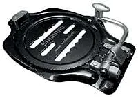
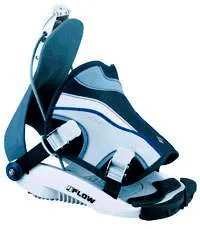
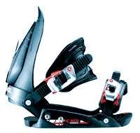

C'est la suite de cet [article]()

Dimanche soir 18H. Les skis sont rangés, la douche prise, vous avez enfilé votre jean, (un truc pas trop slim dont vous pouvez facilement remonter le bas des jambes) vous portez **vos chaussettes de ski préférées** et vous voilà dans le sous-sol de votre loueur local. Nerveuse à l'idée d'aller chercher votre première planche ? Normal... Mais vous allez voir, on va faire simple, très simple...

## La board

Au stade où on en est (débutant), on se fout complètement du type de board que le gars va vous remettre ! Voilà, c'est dit, c'est simple et c'est direct.

Comment ça on s'en fout ? Je croyais qu'en lisant ces pages j'aurais droit à des conseils, des tips, des trucs et des machins pour choisir la bonne planche ?

Ok, ok, mais bon soyons honnêtes. Actuellement le marché est entièrement dominé par les boards de type **FreeStyle** (souples, symétriques avec des spatules à chaque bout). En conséquence, le commerçant a en sa possession un maximum de planches de ce type. Comme en plus vous n'avez normalement aucune référence, vous êtes incapables de vraiment faire la différence entre une planche à pain et une board de la mort avec un noyau carbone.

Bref, à ce stade, faites-lui confiance. De toute façon, c'est un pro et le dimanche soir, il a plus de temps à vous consacrer puisque la vague des nouveaux arrivants du samedi est passée. Quoiqu'il en soit, il va vous passer une planche FreeStyle qui sera toute bonne pour ce que vous allez en faire. Attention quand même à ne pas accepter une planche trop grande. Typiquement, en FreeStyle elle ne devrait pas dépasser votre menton (milieu du cou typiquement).

Enfin, quand je dis "faites-lui confiance", je ne veux pas dire "soyez crédules". Nan, ce que cela signifie c'est que la décoration de la planche n'a aucune importance, mais qu'en revanche, vous devez jeter un œil sur l'état des carres et de la semelle.

* **La semelle** : elle doit être lisse et pas trop abîmée. J'entends par là que s'il y a 2 ou trois rayures, ce n'est pas très grave. En revanche si vous repérez une grosse balafre, faites-le remarquer. Au pire il changera la board ou mieux il la fera traiter le soir même et demain matin, vous reviendrez au magasin et vous récupérerez une planche avec une semelle toute neuve.
* **Les carres** : là, faut être plus critique. Gentiment, passez l'ongle de votre pouce sur les carres au niveau des fixations (on se fiche des carres qui sont au niveau des spatules). Attention, n'appuyez pas comme une bête. Si, à l'issue d'un passage votre ongle est marqué, tout est bon. Si cependant aucune rayure n'apparaît, faites remarquer que les carres ont peut-être besoin d'un petit affûtage. Là aussi, 2 solutions. Soit il change la planche soit le lendemain matin les carres seront affûtées.

Un dernier point. Si la planche a quelques rayures sur le dessus, ou même quelques "éclats" sur les bords... Là aussi ce n'est pas très grave. Je vous l'ai dit, compte tenu de notre niveau actuel... la planche on s'en fout.

## Les fixations

Là, il faut être plus critique et "choisir", autant que notre niveau nous le permet, ses fixations en connaissance de cause. Pour ce que j'en sais, il existe trois grandes classes de "fixes" pour les planches FreeStyle polyvalentes. Pour les surfs de type Alpin il n'existe qu'un type de fixations (les plaques) mais ce n'est pas le sujet ici.

* **Step-in :**

Personnellement ce n'est pas celles que je préfère. En effet, on "en-clique" la chaussure et tout se passe toujours bien dans le magasin, sur la moquette, debout et au chaud.

Cela dit, en fin d'après-midi, avec de la neige plein la fixe, des gros gants, pas mal de fatigue etc. On a vite fait de vouloir y mettre le feu. Honnêtement je ne les recommande pas.

Ah oui, j'oubliais (mais on verra ça avec les chaussures) compte tenu du système de fixation, vous êtes obligés d'avoir des chaussures spécifiques qui comportent, sous la semelle, un système sur lesquels les fixes peuvent s'accrocher. Ce n'est pas un problème en soit mais si par la suite vous évoluez, vous voudrez peut-être des shoes plus techniques et avoir accès au choix le plus large. Ce type de fixation peut limiter votre choix.

* **Flow :**

Y a du mieux, puisqu'elles sont très faciles à mettre et à régler. Cela dit, à l'usage, je n'aime pas trop la sensation de "flottement" que l'on peut ressentir sur le dessus du pied.

Si le troisième type de fixe vous intimide, choisissez les flow. Au pire, vous pourrez toujours changer dans la semaine si, à l'usage, vous n'êtes pas à l'aise.

* **Coque :**

Ce sont de loin celles que je recommande.

La raison en est très simple. Quand votre niveau va augmenter, vous chercherez des fixations offrants un maximum de réglages et de réactivité. Vous trouverez toujours dans la gamme de ce type de fixations votre bonheur.

Une dernière remarque. Ne rêvez pas trop quand même... En effet, rares sont les loueurs qui vont étaler devant vous la gamme de leurs fixations et qui vont vous demander "alors, avec cette planche, j'vous met quoi ?" Non, souvent les planches sont déjà équipées ce qui limite le choix. S'il y a des Flow et que vous voulez absolument des coques, assurez-vous que le loueur n'est pas débordé, soyez poli et vous verrez tout devrait bien se passer.

## Les shoes

Je l'ai dit en haut de cette page, vous avez aux pieds les chaussettes que vous utiliserez le lendemain. Ce point étant acquis, la seule règle que je connaisse c'est : "**Ferme tes yeux et laisse parler tes pieds !**".

En gros ça veut dire que même si vous avez la meilleure board avec les meilleurs fixes, si au bout de 30 min vous avez mal aux pieds, la journée sera foutue. C'est vrai, dès que l'on commence à avoir mal, on ne pense plus qu'à cela, on est tendu, raide et bon plus rien ne va. C'est incroyable de voir l'impact que peut avoir le confort d'une paire de chaussure.

Attention, ne me faites pas dire ce que je n'ai pas dit. Je ne demande pas à ce que vous preniez une planche de débutant et des chaussures dans la gamme "pro". Non, le truc c'est que vraiment, il ne faut pas hésiter à essayer 2 paires dans 2 modèles différents. Juste pour voir.

Ceci fait, il ne faudra peut-être pas hésiter à demander une demi-pointure au-dessus ou au-dessous. Là aussi, juste pour voir. Bon dans tous les cas, de la première règle découle la seconde : "**Si sur ton surf, t'as les pieds qui meurent, retourne voir ton loueur**". Il n'est pas fou, il préfère avoir un client satisfait et il n'hésitera pas à vous changer la paire qu'il vous aura loué la veille.

Bon, pour les chaussures on fait quoi ? Tout bête, le gars vous propose une paire, vous la délacée largement, vous faites de même avec le lacet intérieur (n'hésitez pas à plonger les doigts dans la chaussure !). Vous enfilez la bête, vous faites le lacet intérieur (oui, vous serrez comme si vous alliez sur la piste) vous faites le lacet extérieur (oui, là aussi, vous serrez), vous vous mettez debout et vous bougez les orteils. C'est bon ? Ça le fait ? Vous pouvez bouger vos orteils? Ils ne touchent pas le bout de la chaussure? Maintenant pliez les genoux. Ça va toujours ?

Bon... ben, re-belotte avec la seconde chaussure. Si les tests précédents passent encore, fermez les yeux et laissez parler vos pieds. Si vous sentez un point dur, un truc qui fait mal sur un orteil ou pire sur le côté extérieur du pied... Pas d'hésitation. Demandez une demi-pointure au-dessus ou carrément un modèle différent. C'est bête mais la façon de tailler les chaussures change radicalement d'un constructeur à un autre. Problème de coup de pied, pointe de chaussure trop serrée... Soyez à l'écoute de vos pieds.

### Petite remarque qui peut être utile

Ne serrez pas vos lacets comme un sourd. Positionnez correctement la languette intérieure sur votre pied et vérifiez bien qu'il n'y a pas des trucs et des machins qui traînent dans la "shoes". Ensuite, pour le lacet intérieur, serrez fermement au-dessus des orteils et du coup de pied, relâchez un peu la pression, faites bouger vos orteils, appuyez sur la languette interne de sorte qu'elle porte bien sur la jonction entre la fin du tibia et la fin du coup de pied, terminez le laçage intérieur en serrant fermement autour du tibia (en fait comme vous allez pas mal bouger y a de fortes chances pour qu'à la fin il y ait de l'espace entre le chausson intérieur et votre tibia). Pour le lacet extérieur, prenez le temps de bien positionner la languette de la chaussure, serrez les lacets au-dessus des orteils, lâchez la pression, bougez ces derniers, terminez le laçage et serrant fermement autour du tibia. Pourquoi tout ce protocole ? En fait, le truc c'est qu'il ne faut pas serrer trop fort car sinon, il n'y a pas d'air entre vos pieds et la chaussure et en plus d'avoir mal... vous allez avoir froid aux pieds. Pour avoir chaud, faut de l'air alors serrez mais serrez malin. Ok ? Ok !

Ah oui, ne soyez pas complètement surpris si lorsque vous pliez les genoux, vous avez l'impression que votre tibia "flotte" un peu dans la chaussure. Bon, bien sûr faut pas que vous puissiez passer la main mais s'il y a un petit espace entre la jambe et la chaussure, ce n'est pas mortel. Ne l'oubliez pas, ce que vous avez aux pieds, ce ne sont plus des shoes de ski.

## Régler l'ensemble

Bon, là, compte tenu de notre niveau d'incompétence, il n'y a pas grand-chose que l'on puisse faire. En effet, le loueur va maintenant à force tournevis et visseuse automatique, ajuster l'écartement des fixes, l'angle de chaque pied après vous avoir poser la sacro-sainte question : "**Goofy ou Regular ?**"

"Oh non, déjà à l'oral du BAC ce n'était pas terrible, mais là, je ne comprends même pas la question...". Pas de panique. Les termes Goofy et Regular déterminent simplement quel pied vous souhaitez mettre devant, une fois que vous êtes sur la planche.

"Et comment je sais moi... je débute !".

Une méthode très simple consiste à imaginer que vous courrez en chaussettes dans le couloir chez votre grand-mère et que vous décidez de faire une glissade. Si le pied que vous mettez devant est le pied gauche alors vous êtes Regular, sinon, si c'est le pied droit, vous êtes... Oui bien, vous êtes Gooffy.

Un autre test consiste, à fermer les yeux, à vous tenir bien droit et à demander à un tiers de vous pousser dans le dos. Si c'est le pied gauche qui part en premier vous êtes toujours et encore Regular. Si c'est l'autre (le droit), vous êtes toujours et encore Gooffy.

Bon et les réglages ? Qu'est-ce qui va faire ? Normalement, le loueur va mettre des réglages tout à fait standards du style +15 à l'avant et -15 à l'arrière. En Français dans le texte cela signifie que vous allez vous retrouver avec les pieds écartés (en canard). De plus, il est vraisemblable qu'il centrera les fixations de manières symétriques par rapport au milieu de la planche.

Une fois que c'est fait, puisque vous avez toujours les chaussures aux pieds (cela vous permet, entre autres, de vérifier si, dans le temps, vous les supportez...), remontez sur la planche et verrouillez vos pieds dans les fixations. Tenez-vous droit, pliez un peu les genoux, relevez la tête, bras le long du corps. Ça va, à l'aise ? Non, vous avez l'impression d'avoir les pieds trop écartés ? Demandez son avis au loueur. Il existe des règles plus ou moins empiriques mais il doit être capable d'évaluer d'un seul coup d'œil si ça va ou pas.

Pendant que vous y êtes, vérifiez bien sur les fixations que lorsque vous serrez les languettes du coup de pied et des orteils ces dernières ne sont pas abîmées à l'endroit même où vous arrêtez de serrer. Mais kékidit? Le Mr te dit : serre les fixes gentiment et vérifie que les dents des languettes de tes coques ne sont pas abîmées justement à l'endroit où tu arrêtes de serrer. Sinon ? Ben sinon y a toutes les chances que demain la languette en question se desserre. Tu auras plein d'autres bonnes et mauvaises raisons de râler alors ce n'est pas la peine de rajouter des problèmes de languette. OK mais qu'est-ce que je fais si justement la languette est abîmée ? A ton avis banane ? Tu es poli et tu causes avec le loueur... Idem si demain matin y a des problèmes de languette, tu ne te prends pas la tête et tu retournes voir ton loueur à midi. Bon allez il est temps de conclure.

## Conclusion

Bon ben, vous voilà l'heureux locataire d'un ensemble qui devrait vous permettre d'attaquer gentiment demain le cœur léger. Bonne tartiflette et bonne nuit !

Toc, toc ? Vous dormez ? Heu... Désolé, mais bon, faudrait peut-être faire un p'tit test avant d'aller dormir... En effet, il me semble judicieux, voir malin, de faire ce que l'on appelle en mécanique un "montage à sec". J'entends par là le fait que vous remontiez les shoes et la planche au chalet (ou dans l'appart'), que vous vous équipiez comme si vous partiez (pantalon, chaussettes), que vous régliez la longueur des lacets etc., que vous mettiez les bottes dans les fixes et que serriez tout ça (si vous avez un doute sur comment serrez les fixations allez faire un tour sur la page "premier contact").

Si vous avez des coques, un truc tout bête. Sans mettre les pieds dans les chaussures, prenez le temps de mettre une des chaussures dans les fixes et assurez-vous que la partie la plus large de la languette qui va sur votre coup de pied est bien centrée. Si ce n'est pas le cas, regardez attentivement le système de fixation. Y a forcément un moyen de décaler la languette un peu à droite ou un peu à gauche (généralement c'est un petit cliquet à lever, à décaler et à refermer). Ensuite passez à l'autre chaussure. De la même façon, assurez-vous que la languette qui sera sur vos orteils n'est pas trop décalée et qu'il n'y a pas de problème quand vous serez tout ça. Soyez consciencieux. Si enfin, sur le bout des orteils ce n'est pas une languette mais une espèce de filet en caoutchouc, ou une languette avec une partie très large, dans ce cas, il ne faut pas mettre la languette "sur" les orteils mais tout au bout des orteils, à l'extrémité de la chaussure (comme si elle était positionnée pour empêcher la chaussure d'avancer). Une fois que vous avez fait le test avec une "shoes" dans une fixe, faite les mêmes vérifications avec l'autre fixe. C'est important pour que vous soyez tranquille demain matin.

Ça va toujours ? Bon ben maintenant vous pouvez aller vous coucher. Faites de beaux rêves de glisse parce que demain... Ah demain... Ce sera une toute autre histoire...

