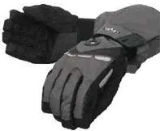
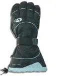
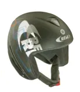

# Équipement du snowboarder débutant

C'est la suite de cet [article]().

Autant sur la planche je pouvais paraître laxiste autant là, vraiment y a des choses à dire. Pourquoi? Tout simplement parce que j'ai pas envie qu'il vous arrive ce qui m'est arrivé...

## Les gants

De mon point de vue, après le confort des pieds c'est le plus important !

Regardez vos gants de ski, ils sont biens hein ! Vous en êtes fiers, y vont faire l'affaire hein? Driiiing! Mauvaise réponse, ils sont pas bons du tout! Changez-les tout de suite!

"Oui t'es mignon, et je vais chercher l'argent où?" Je sais, c'est le problème ceci dit, en tant que débutant vous allez passer vos premières journées à quatre pattes et vos gants ne vont pas faire la semaine. Ils vont être trempés, les coutures vont lâcher, ils vont peser 3 tonnes à la fin de la journée, vos mains vont puer... Bref, l'horreur.

Et le pire, c'est que si vous ne faites pas l'investissement de suite, il faudra 2 ou 3 semaines (saisons) pour que vous compreniez qu'il faut que vous investissiez une bonne fois pour toute et que là, il sera trop tard, vous ne mettrez pratiquement plus les mains par terre. Enfin bref, après avoir loué votre matériel, si après un ou deux jours vous êtes sur de vouloir continuer le snowboard et que vos gants de ski ne sont pas à la hauteur, achetez des gants de surf corrects.

Des gants corrects c'est quoi? Pour moi ce sont des gants qui montent haut, en Gore-Tex, avec une Polaire en interne et des systèmes de resserrage au niveau du poignet et de l'avant bras (cela évite que la neige rentre dans le gant quand on prend une pelle). De plus, vérifiez bien qu'il n'y a pas de coutures aux bouts des doigts. Facile. Prenez, deux paires de gants, une chère, l'autre pas, inspectez-les point par point (surtout les coutures) et zou, vous comprendrez rapidement dans quelle paire il faut investir.

## Pantalon

Je l'ai dit, au début, vous allez passer du temps sur les fesses et sur les genoux. Il faut donc que vous trouviez un moyen pour éviter d'atomiser l'équipement que vous possédez déjà (pantalon de ski typiquement)

Comme je suis pas certains que vous soyez prêt à acheter un vrai pantalon de surf (et pourtant si vous continuez vous y viendrez) y a pas trop de solution.

Les genouillères de skate sur les genoux ou bien un pantalon de K-Way. Attention, ce dernier est glissant et donc, si pour une raison ou pour une autre vous partez en sucette sur la neige, il ne sera peut être pas facile de vous arrêter. Notez que généralement vous aurez toujours la planche au pieds et donc, elle vous aidera à vous arrêter le cas échéant.

Oui je sais, vous allez avoir un look de pingouin... Mais bon, soit vous faites le mariolle et vous flinguez votre pantalon de ski soit vous vous habillez en clown et vous préservez vos investissements passés. Si à la fin de la semaine vous décidez de refaire du snow l'année prochaine, il sera toujours temps d'investir.

Un dernier truc. Pensez à ne rien mettre dans vos poches de pantalon (encore un bon argument pour le K-Way). En effet, vous serez toujours plus ou moins plié en deux. Alors, afin d'éviter d'exploser votre paquet de cigarettes ou de vous sectionner l'aine avec la clé de l'appartement, évitez de mettre quoi que se soit dans vos poches. Enfin bon, ça, on le fait généralement une fois et après on retient la leçon.

## Le haut

Deux trucs simplement. Choisissez un vêtement ample et pas trop glissant. Ample car vous n'allez pas arrêter de vous baisser, de bouger, d'agiter les bras etc. Pas trop glissant car si par hasard vous partez sur le dos ou sur le ventre, c'est mieux si, en complément du surf qui va traîner dans la neige, le blouson peut vous aider à stopper votre glissade.

Bon, je passe sur les détails classiques que vous connaissez déjà si vous avez fait du ski (des poches partout, des fermetures qui ferment quand on les remontent, un tour de cou en polaire, des aérations etc.)

Pour le reste, évitez les pulls car vous allez les tuer quand la neige se sera accrochée dans la fibre. Enfin, toujours parce que vous allez passer vos premières journées à vous rouler par terre, même si il fait beau, éviter le T-Shirt à manches courtes.

## Le reste

Honnêtement je me demande si je vais pas acheter un casque. Je me rend compte que je vais de plus en plus vite, que je sautille un peu partout et je me dis qu'un jour ça va cartonner grave.

Ceci dit, au tout début, vous allez être sur une verte à quatre pattes, bien protégé par un filet... C'est peut être pas nécessaire d'investir de suite dans un casque. De plus, le casque va vous donner une impression de surdité. Alors ? Ben au début, j'aurai tendance à dire, partez cool. Lunette de soleil et pas de casque tant que vous restez zen sur la "board" et que vous n'allez pas trop vite.

Par contre attention, quand vous commencerez à croire que vous dominez le sujet, c'est là que les plus méchantes fautes de carres vont survenir. Il faudra alors que vous preniez une décision vis à vis du casque. Même si je ne l'ai pas encore fait, je vote pour !

### Mars 2005

Je confirme. Ayé, j'ai acheté un casque. Bon remettons tout ça dans le contexte. Très simple, premier jour de ski avec mon gamin. Lui est derrière en ski, moi devant en surf. Sur un chemin de liaison qu'on connaît par cœur (une verte, un truc tout bête...) on est en train de rejoindre une rouge. A droite y a la montagne, à gauche y a de la pente avec des arbres, c'est beau... on se croirait à la montagne. Et puis là, honnêtement, je sais pas... Sous un millimètre de neige j'arrive sur une grosse et grande plaque de glace. Même position mais grip de la board différent, la sentence a été immédiate, j'ai perdu l'équilibre et zou je suis parti à gauche (dans la pente et dans les arbres). Me voilà donc sur le dos, la tête la première et impossible de stopper la glisse lorsque je vois un gros tronc se rapprocher à vitesse grand "V". "Papa ?, PAPA !" Bon, là, pas d'autre moyen que de rigoler pour éviter l'affolement du fiston mais bon... Je me suis fait un peu peur et donc le soir même... J'ai investi. Bien sûr, le casque n'a pas été franchement utile le reste de la semaine. Enfin bref, si mon expérience peut vous inciter à acheter un casque...

Comment j'ai choisi le casque? Simple, après discussion avec mon vendeur préféré, j'ai décidé d'acheter plutôt que de louer (il est fort mon vendeur, non ?). Ceci dit c'est surtout histoire de faire la mousse intérieure à mes dimensions (un peu comme pour les casques de moto). Ensuite, j'en ai testé 5 ou 6 et j'ai vraiment pris celui qui était le plus confortable (je porte des lunettes de vue ce qui n'arrange rien), celui dans lequel j'étais le moins sourd et enfin celui qui tenait le mieux sur ma tête sans que j'ai besoin de fermer la jugulaire.

Heu... Un dernier truc tout bête pour ceux qui ont des gamins. En discutant avec d'autres parents, j'ai appris que mettre un casque permettait d'inciter les ados (pas les moins de 12 ans) à faire de même... Qu'est-ce qui faut pas faire pour ces chères petites têtes blondes...

