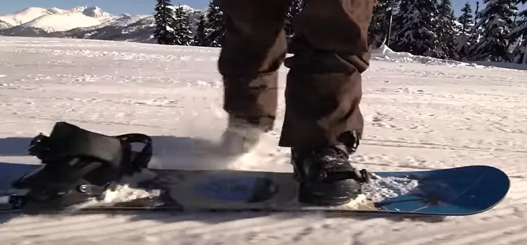

# Premier contact avec le Snowboard

C'est la suite de cet [article]()

On est lundi matin, la planche est là, il fait beau, vous êtes équipé, tout va bien... On y va ? Nan ! Rhabillez-vous, prenez vos skis et allez faire une matinée de descentes avec vos potes... Pourquoi ? Je vois trois bonnes raisons :

1. **Observations** : le premier truc c'est de se dire que ce matin, skis aux pieds, vous allez partir en reconnaissance, histoire de voir ce que font les autres débutants. Vous en profiterez aussi pour noter ce qui est fait par ceux qui savent et, entres autres, ce que font les profs de snow avec leurs élèves : il ne faut pas se leurrer, ils sont dans leur deuxième journée, en groupe... Bref y a des choses à apprendre d'eux. Pigé ? Ce matin vous allez ob-ser-ver.
2. **Échauffements** : sérieux, vous aviez l'intention de vous échauffer ? Nan, bien sûr, comme tout le monde, vous aviez l'intention de vous jeter sur la planche et zou, en voiture Simone... Bon ben, c'est vraiment pas une bonne idée, alors vous allez aller faire du ski, ça vous réchauffera.
3. **Qualité de la neige** : c'est ce dernier point qui est le plus important... En effet, à ce moment de la journée (9H00 pétante), la neige est encore dure. Cela signifie qu'à chaque fois que vous allez tomber, vous allez percuter l'équivalent d'un trottoir. Ça vous tente ? Moi, non... Autant aller faire du ski et revenir tout à l'heure quand la neige sera plus douce et qu'on sera chaud bouillant.

On est Lundi, 14H, ding dong, c'est l'heure... Faut y aller... Pour commencer, je vous propose un programme en 5 actes :

1. Chausser un pied
2. Patiner et pousser
3. Chausser l'autre pied
4. Se relever
5. Déraper

Attention, ce n'est que le début de l'après midi. Faudra ensuite, toujours cet après midi consacrer du temps aux [traversées de la piste]() ainsi qu'aux [premiers virages]().

Pour fixer les idées. Si on imagine qu'on est sur la piste de 14H à 17H je pense qu'il faut consacrer 1H environ à cette page puis passer le reste de l'après midi, sur les histoires de [traversées]() et de [virages](). De toute façon, en cours d'après midi, tu seras obligé de déchausser, rechausser, t’asseoir, te relever, glisser, patiner... Bref tu vas pratiquer. Heu... Faudra penser à faire une bonne pose au bar du coin en laissant la planche au soleil. 

Ça n'a l'air de rien, mais bon, va falloir que vous restiez zen, et promis, quand vous aurez fait tout ça, vous aurez votre compte.

Ah, au fait, bien sûr, si vous avez un collègue qui débute aussi, emmenez-le avec vous. Vous vous sentirez moins seul dans l'adversité et vous pourrez toujours comparer vos sensations.

Heu... Dans le même état d'esprit, si vous avez des potes qui surfent déjà, dites leur d'aller faire un tour et de revenir vous voir plus tard. En effet, vous allez galérer, vous allez vous énerver, c'est pas la peine de leur gâcher une après midi et c'est pas la peine, non plus, de vous montrer sous votre mauvais jour...

## 1. Chausser un pied

Dirigez-vous vers la piste, Ecole, Mickey, Pitchoune, Grenouillère... oui celle avec le tire-fesse qui va à 2 à l'heure et où les marmots descendent les mains sur les genoux... Bon, là trouvez-vous un espace relativement plat et libre (pas trop près du bar où les Allemands qui sont toujours en train de manger vont finir par se moquer de vous...).

Juste pour être très explicite... À ce moment de votre "voyage initiatique", il faut une section de terrain plat car vous allez juste "glissouiller" à plat et "sentir" ce qui se passe lorsque l'ensemble "planche + bonhomme" essaie d'aller, ensemble (le mot est important), dans la même direction et le même sens. Bref, c'est pas encore la peine de remonter à pied la piste Pitchoune.

Posez la planche perpendiculaire à la pente (même si y a pas de pente !) et mettez vous en aval de la board. Pour que ce soit clair : 
* en **aval** : ça veut dire "plus bas que", en dessous, val, vallon, vallée...
* en **amont** : ça veut dire "plus haut que", au dessus, mon, montagne...

Si la planche veut partir, vous la stoppez avec vos pieds. À ce stade, vous n'avez pas besoin de vous asseoir pour fixer votre **pied avant** (pas d'embrouille... Regular, pied gauche devant, Goofy, pied droit devant). Vous n'avez pas besoin non plus de bloquer la planche en mettant votre second pied en partie sur la planche, et en partie sur la neige. En effet, vous êtes en terrain plat, donc tout doit bien se passer. Bref, vous mettez le pied dans la fixe avant et vous réglez tout ça gentiment.

Attention quand même... Si vous avez des coques, pensez à ne pas serrer comme un sourd la languette qui se trouve au niveau des orteils. Faites glisser la languette à la main, clic, clic et normalement c'est bon. En ce qui concerne celle que se trouve au niveau du coup de pied, là par contre, vous pouvez serrer un peu plus (j'ai dit un peu...).

### Petite remarque
Vous vous êtes assurez, avant de mettre votre chaussure dans la fixe qu'il n'y avait plus de neige ni de glace? En cas de doute, enlevez le pide, jetez un oeil. Si besoin faites le ménage.  
En fait si y a de la neige ou de la glace ça va empêcher de positionner la chaussure à la bonne place, le pied peut se retrouver légèrement de travers ce qui à la longue risque de faire mal. Enfin bref, petit coup d'oeil, petit coup de gant et on est bon.  
Au prochain arrêt **vin-chaud** mettez la planche plutôt au soleil. La glace aura disparue à votre retour.

### Petite remarque

Plus ça va et moins je serre la languette au dessus des orteils. C'est vraiment un truc du style : j'enfonce la languette à la main dans le cliquet et zou clic, clic c'est fini. Non, j'ai pas dis que je laissais un espace entre la languette et la chaussure. J'ai simplement dit clic, clic. Pourquoi ? Tout bête. Si on serre de trop, y a plus d'air entre le pied et la chaussure et zou au bout de vingt minutes on a froid aux pieds. Enfin bref, serrez correctement le coup de pied et allez-y mollo sur les orteils.

Ah oui, j'allais oublier... Vous mettez votre pied dans la fixe, vous serrez la languette du coup de pied, **PUIS**, la languette du bout de pied. C'est logique, mécanique... En effet, en serrant d'abord la sangle du coup de pied vous vous assurez que la botte est bien au fond de la fixe puis en serrant la sangle au niveau des orteils, vous plaquez la botte dans la fixe et vous vous assurez de la solidarité de l'ensemble "fixe + chaussure".

Notez aussi que si vous avez des coques, à l'arrière de la fixation, il y a une partie en plastique, qui remonte le long de la chaussure : ça s'appelle un **Spoiler**. Normalement, on peut pré-régler son inclinaison. On verra ça plus tard, pour l'instant, laissez-le tranquille et n'y touchez pas.

Ça y est, c'est fait ? Vous êtes bien embêté avec ce machin collé à votre jambe hein ? Bon, normalement puisque vous êtes en terrain plat vous devriez être capable de faire 2 exercices simples.

<iframe width="560" height="315" src="https://www.youtube.com/embed/n7UHStne0Ag?si=OMTBvat-rtP8tDWO&amp;start=5" title="YouTube video player" frameborder="0" allow="accelerometer; autoplay; clipboard-write; encrypted-media; gyroscope; picture-in-picture; web-share" referrerpolicy="strict-origin-when-cross-origin" allowfullscreen></iframe>

## 2. Patiner et pousser

### Patiner

Donc là normalement vous avez le pied avant dans la fixation avant et le pied arrière dans la neige et vous êtes statique. Dans un premier temps, vous allez "monter" sur la planche, faire passer votre poids sur la jambe avant, mettre l'autre pied sur la neige (en aval de la board) et essayer de patiner gentiment. Si vous êtes Regular vous partez à gauche, si vous êtes Goofy vous partez vers la droite.

Non ! ne regardez pas vos pieds, ne pliez pas le corp, ne baissez pas le tronc, soyez fier (mais prudent), relevez le buste, relevez la tête et patinez quelques mètres dans un sens puis dans l'autre. Bien sûr, au bout de quelques mètres, faut quand même faire demi-tour pour revenir à votre point de départ. Pas facile ? Bon, ben recommencez... Prenez votre temps. Il faut qu'à la fin vous soyez relativement à l'aise.

Le truc c'est qu'il ne faut pas vouloir aller trop vite. Commence doucement, laisse ton corps apprendre le mouvement. Ensuite tu peux executer le mouvement un peu plus vite. 

C'est bon, la patinette vous dominez ? Bon et bien repartez pour un tour mais ce coup-ci, une fois que vous avez donné un coup de patin avec votre jambe arrière, vous ramenez votre pied libre sur la planche et vous le calez **entre les 2 fixations**.

Soyez souple, pliez un peu les genoux, **regardez là où vous voulez aller** et laissez la planche glisser à plat. Pensez à ne pas tendre la jambe avant et à vous retrouver dans une position complètement penchée vers l'arrière. 

Au contraire, lorsque la planche glisse à plat, forcez-vous à plier la jambe avant et y mettre un peu plus de pression que sur la jambe arrière. En ce qui concerne les épaules, essayez de les garder dans l'axe longitudinal de la planche. 

Autrement dit, pour regarder ce qui se passe devant (tu confirmes, tu regardes pas tes pieds, tu as les yeux levés et tu regardes là où tu veux aller...), vous êtes obligé de tourner la tête, le menton sur ton épaule. 

Pour les bras, faites simple, écartez-les dans l'axe de la planche puis ramenez-les le long du corps quand vous vous sentez plus à l'aise. Dans tous les cas, chaque main doit être à la verticale de la planche. 

Vous ne me croyez pas? Vous avez raison. Faites le test... Alors que vous glissez, le pied arrière entre les fixes, vous écartez les bras et vous ramenez vos deux mains devant, comme si vous conduisiez une moto. Normalement la planche à tourné et c'est **PAS** ce que l'on veut.

Allez, amusez vous à glisser à plat, à ressentir la façon dont la planche se comporte. Faites des tests... Par exemple, écartez ou rapprochez (jusqu'à les joindre) les pieds. En cas de problème (la planche qui prend un peu trop de vitesse à votre goût, mamie qui croise votre trajectoire, une gamine de 4 ans qui arrive à Mach 3 dans la position de l’œuf...), n'ayez aucun honneur. Sortez votre pied arrière de la planche et arrêtez-vous comme vous pouvez...

Faites un autre test... Alors que la planche glisse à 2 à l'heure, pliez les jambes en gardant le buste droit. Pas facile car on a tendance à plutôt plier le buste. En plus, si on ne garde pas le poids du corps à la verticale de la planche... Soit on tombe en avant ou en arrière. Entrainez-vous à plier les genoux et à vous remettre bien vertical. 

### Pousser 

Dans un second temps, après être revenu à l'endroit initial et dans le même sens. Vous faites donc face au sommet et votre pied libre est en aval de la planche. Vous allez maintenant garder votre jambe arrière en aval de la planche et pousser gentiment. Là, le mouvement va être moins ample et vous allez vous déplacer moins vite. Ceci dit, il faut quand même savoir le faire car quelques fois, dans les files d'attentes il est plus pratique de pousser sa planche que de patiner... 

Allez, courage, faites l'aller et le retour et revenez à l'endroit initial. Notez quand même que pour faire le demi-tour, il est beaucoup plus agréable de pousser la planche que de la tirer. À retenir donc...

Jusque là, ça va ? Bon, ben après la vidéo on passera à la suite...

<iframe width="560" height="315" src="https://www.youtube.com/embed/kGpGC1l7il0?si=mtwamqDTdPV45UIC" title="YouTube video player" frameborder="0" allow="accelerometer; autoplay; clipboard-write; encrypted-media; gyroscope; picture-in-picture; web-share" referrerpolicy="strict-origin-when-cross-origin" allowfullscreen></iframe>

Une autre pour la route...

<iframe width="560" height="315" src="https://www.youtube.com/embed/eFH00ZH425c?si=x9wWLyGpSd_KKSH6&amp;start=47" title="YouTube video player" frameborder="0" allow="accelerometer; autoplay; clipboard-write; encrypted-media; gyroscope; picture-in-picture; web-share" referrerpolicy="strict-origin-when-cross-origin" allowfullscreen></iframe>

## 3. Chausser l'autre pied

Tadaaa! C'est là que vous allez commencer à vraiment ressembler à un surfeur... En effet, toujours avec la planche accrochée à votre pied avant, il est temps de faire un demi tour sur vous même (vous allez vous retrouver dos à la pente, vous serez en amont de votre board) et vous asseoir...

Si initialement la section de pente dans laquelle vous êtes est vraiment trop plate, déchaussez le pied avant, remontez de quelques dizaine de mètres, rechaussez votre pied avant et asseyez-vous dos à la pente.

Vous sentez cette petite fraîcheur sur votre séant? Oui, bon ben vous avez intérêt à apprécier car cela ne fait que commencer... 

Enfin bref, alors que vous êtes assis, pliez un peu les jambes, mettez la planche bien perpendiculaire à la ligne de pente (je sais, le terrain n'est pas très pentu...) et amenez votre pied arrière au niveau de la seconde fixation. Allez, mettez le second pied et serrez.

### Note 

Vous aurez remarqué que je suppose ici que vous avez des coques sur la planche. Si vous avez des Flow, c'est vraiment Rock'n Roll de mettre le second pied en étant assis. Il est préférable, en étant debout, d'enfiler le pied arrière dans la fixe, de plier les genoux, de se mettre à quatre pattes et de verrouiller, dans cette position, la fixation arrière. Ah oui... C'est pas évident mais bon... 

Une fois la fixe arrière bloquée, passez de la position quatre pattes à la position "assis dans la neige, dos à la montagne". Notez que par la suite quand vous serez plus à l'aise avec votre planche vous pourrez accrocher vos deux pieds dans les Flow sans vous mettre à quatre pattes. Tout ceci étant dit, dans les autres pages, je supposerais que vous avez des coques sur la planche.

### Note

**La ligne de pente**. C'est tout simplement le chemin qu'emprunterait une bille si vous la lâchiez à partir de l'endroit où vous êtes (c'est la direction où le [gradient](https://www.youtube.com/watch?v=ynzRyIL2atU) est maximum). Cette ligne change donc en fonction du relief et de votre position. 

À 5 ou 10 m d’écart d'un de vos potes, ne soyez pas étonné si vos planches, perpendiculaires à vos lignes de pente respectives, n'ont pas exactement la même orientation. Heu... ceci dit, sur Pitchoun qui est généralement une piste large et rectiligne, si les orientations diffèrent de plus de 30°, vérifiez que votre collègue ne surfe pas avec 4 grammes dans le nez...

## 4. Se relever

Bien, vous avez les fesses dans le neige, les genoux pliés, la planche sur une carre... Y a plus qu'à se relever... Là, il y a 2 possibilités.

### Facile :

Mettez vous sur le dos, faites un demi-tour sur vous même (vous vous retrouvez sur le ventre, la truffe dans la neige). Mettez vous à quatre pattes, ramenez bien la planche sous votre corps et assurez-vous qu'elle est bien perpendiculaire à la ligne de pente. Poussez alors sur vos bras et relevez-vous. Attention, ne poussez pas trop fort et ne détendez pas votre corps d'un seul coup, car sinon, vous allez basculer sur le dos et retomber de l'autre côté (et ça va faire mal, car de manière instinctive vous allez retenir votre chute avec vos mains et c'est les poignets qui vont tout encaisser...). 

Bref, au contraire, quand vous sentez que vous allez être en position verticale (le planche à plat sur la neige), gardez vos jambes un peu pliées, équilibrez la pression sur les 2 pieds, les bras écartés, les mains au dessus de la planche et vous finissez le mouvement en douceur. 

Ouf, ça y est... Ooops, la planche à tendance à partir... Cherchez pas, "jetez-vous" gentiment par terre en vous penchant en avant et en vous retenant avec les mains (ici y a pas de problème car c'est un mouvement volontaire de votre part et donc, y a peu de risques de se casser quelque chose)

<iframe width="560" height="315" src="https://www.youtube.com/embed/x4caDjjOQS4?si=NRsQ-oxtj1lbS-Zy&amp;start=88" title="YouTube video player" frameborder="0" allow="accelerometer; autoplay; clipboard-write; encrypted-media; gyroscope; picture-in-picture; web-share" referrerpolicy="strict-origin-when-cross-origin" allowfullscreen></iframe>

Si la planche part, c'est qu'elle n'est pas perpendiculaire à la ligne de pente. Si vous vous êtes "jeté" par terre, vous êtes à nouveau sur le ventre, le nez dans la neige ou à quatre pattes. Bon, ben y a plus qu'à recommencer en vérifiant bien la position de la planche par rapport à la ligne de pente.

Quand vous êtes finalement relevé, la planche ne bouge pas, vous êtes face à la montagne, vous avez les genoux pliés, les épaules dans l'axe longitudinal de la planche, les bras le long du corps, les mains à la verticale de l'axe central de la planche et la tête relevée, le regard fier... "Surf attitude" quoi !

### Moins facile (surtout en terrain plat) :

Vous restez assis, vous pliez bien les jambes afin de ramener la planche le plus près de vos fesses. Vous mettez un bras derrière, la main à plat dans la neige et vous essayez de vous relever ainsi. Cette méthode est bien plus facile à mettre en oeuvre quand il y a de la pente car alors, vos jambes et la planche se trouve "naturellement" sous votre centre de gravité et c'est un jeux d'enfant que de se relever.

Quoiqu'il en soit, tout ce qui a été dit précédemment reste vrai ici: ne vous précipitez pas, ne vous détendez pas d'un coup... Là aussi faites plusieurs essais et pensez à garder la planche perpendiculaire à la ligne de pente.

Au final vous êtes en position "surf attitude" et vous avez la montagne dans le dos.

<iframe width="560" height="315" src="https://www.youtube.com/embed/x4caDjjOQS4?si=2hVQHFjRZDWnX1Ss&amp;start=28" title="YouTube video player" frameborder="0" allow="accelerometer; autoplay; clipboard-write; encrypted-media; gyroscope; picture-in-picture; web-share" referrerpolicy="strict-origin-when-cross-origin" allowfullscreen></iframe>

## 5. Déraper
Bon, allez, il est temps de faire autre chose. Pour cela, vous allez chercher un endroit sur la piste où il y a de la pente. Attention, j'ai dit un peu de pente, pas un mur (quoique que sur la piste Mickey, un mur...). Pour vous y rendre, soit vous déchaussez le pied arrière et vous y allez en patinant soit vous déchaussez complètement et vous vous y rendez la planche sous le bras.

Soyez malins... Pendant que vous y êtes, grimpez en haut de la petite pente... Bon, une fois en haut, vous rechaussez. En partant d'une position sur le ventre, vous vous relevez. Faites bien attention à ce que la planche soit perpendiculaire à la ligne de pente et à ce que la pression exercée sur vos pieds soit identique. À la fin vous devez vous retrouver face à la montagne, légèrement sur la pointe des pieds. En ce qui concerne la tête, elle est relevée et vous regardez vers la montagne.

Bon là, va falloir faire dans la dentelle... Normalement, tel que vous êtes là, sur la pointe des pieds, la carre amont (celle qui est sous les orteils) mord dans la neige alors que la carre aval (celle qui est sous les talons) est légèrement au-dessus de la neige (on est d'accord hein ? **elle ne touche pas la neige**).

En étant souple sur les genoux, faites en sorte que la carre aval se rapproche de la neige. Instantanément, la planche va déraper. Si jamais la planche part dans un sens plutôt qu'un autre, accroupissez-vous, mettez les mains et les genoux dans la neige et réfléchissez... Si, si, malgré ce que pensent certains, un surfeur ça peut réfléchir.

En fait vous avez mis plus de pression sur une jambe que sur l'autre, un pied c'est donc retrouvé plus haut que l'autre et naturellement la planche est partie soit de l'arrière, soit de l'avant. Bon allez, mettez la planche perpendiculaire à la ligne de pente, relevez-vous, écartez largement les bras dans l'axe longitudinal de la planche (cela permet de s'assurer une meilleure répartition de la pression sur les pieds) et recommencez...

Au bout du compte, en jouant simplement sur l'angle que font vos pieds avec vos tibias, vous devez être capable de faire déraper (ou arrêter) la planche afin de "descendre" perpendiculairement à la ligne de pente. Commencez gentiment, par une succession de petits dérapages. Il faut que vous appreniez à doser votre façon de déraper. À la fin, vous devez être capable de déraper la petite pente (sur 2 ou 3 m) en un ou deux longs dérapages.

Ah oui, ne faites pas la "mitraillete"... *Hein ? Mé kékidi ?* Très simple! Au début la tentation est grande de faire des micro-glissades de quelques centimètres (5 à 10 cm). C'est pas le but recherché ici. Il faut vraiment essayer de faire des dérapages relativement longs.

Bien sûr, ce que l'on a fait dans un sens, on peut le faire dans l'autre. Autrement dit, ce coup-ci vous allez faire déraper la planche alors que vous avez la montagne dans le dos (c'est la carre côté talons qui mord la neige). C'est exactement le même principe. Vous faites varier l'angle entre vos pieds et vos tibias et la planche dérape ou s'arrête.

Soyez fier, ne regardez pas vos pieds, relevez la tête, bras le long du corps, mains au dessus de la planche, genoux fléchis, soyez détendu et n'hésitez pas à faire ces exercices à plusieurs reprises. 

<iframe width="560" height="315" src="https://www.youtube.com/embed/8sdaseV7SEk?si=oYHz3FRNcnBsi17Y&amp;start=106" title="YouTube video player" frameborder="0" allow="accelerometer; autoplay; clipboard-write; encrypted-media; gyroscope; picture-in-picture; web-share" referrerpolicy="strict-origin-when-cross-origin" allowfullscreen></iframe>

Encore une fois, au début, afin de vous aider à bien glisser perpendiculairement à la ligne de pente, il faut équilibrer le poids du corps sur la planche (via vos deux pieds). Pour cela, vous pouvez choisir d'écarter largement les bras (à l'horizontal) et de bien vérifier qu'ils sont effectivement à l'aplomb de l'axe longitudinal de la planche.

On va maintenant compliquer un peu les choses histoire de bien sentir la mécanique. Au départ, vous allez délibérément pousser un tout petit peu plus sur une jambe que sur l'autre. La planche va alors avoir tendance à partir du côté où vous avez appuyé le plus. Dès qu'elle part, vous appuyez alors sur l'autre jambe. La planche doit alors revenir dans une position perpendiculaire à la ligne de pente. Si vous avez trop poussé la planche ne dérape plus. Si par contre vous avez appuyé juste ce qu'il faut, la planche ne glisse plus mais dérape perpendiculairement à la ligne de pente. On est revenu à l'un des deux cas précédents. Entraînez-vous à faire cet exercice alternativement face et dos à la montagne.

### La feuille morte

Une fois ce principe compris, recommencez à descendre la petite pente mais en enchaînant les départs volontaires de la planche à gauche et à droite. Le truc c'est de bien comprendre ce qu'il faut faire pour maîtriser les départs intempestifs de la planche : si elle part à gauche j'appuie sur la jambe droite et inversement.

Encore une fois, ici tout est affaire de finesse, de doigté. Alors dérapez, dérapez encore, dérapez toujours.

Ah oui, j'allais oublier... À chaque arrêt, évitez de vous laisser tomber et de vous rouler dans la neige. Soyez fier, faites l'effort de rester digne, même dans l'adversité (40tude) et restez debout sur votre board. Sérieux, combien de fois avez-vous vu un prof de snowboard se rouler dans la neige tel un Saint-Bernard qui retrouverait ses Alpes natales après 10 ans d'exil au Congo. 

Allez, maîtrisez votre équilibre... Ça peut pas vous faire de mal et en plus, vous rendrez un grand service à l'image de marque des surfeurs. Que demande le peuple ?

<iframe width="560" height="315" src="https://www.youtube.com/embed/H5Och_4QLyE?si=zZMYyqBPMFUDY-ZK&amp;start=62" title="YouTube video player" frameborder="0" allow="accelerometer; autoplay; clipboard-write; encrypted-media; gyroscope; picture-in-picture; web-share" referrerpolicy="strict-origin-when-cross-origin" allowfullscreen></iframe>

Allez, on passe à la suite... Les [traversées]() de piste.

