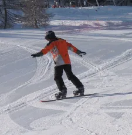

# Premières traversées en Snowboard

C'est la suite de cet [article]()

## Un point de vocabulaire

J'en ai marre de dire "face à la montagne", "dos à la pente"... Alors on va se mettre d'accord sur les deux termes suivants :

* En position **Backside** vous glissez en ayant la carre du côté des talons qui mord la neige et vous êtes **dos (back) à la pente**. Si vous êtes Regular (pied gauche devant), en back, vous partez sur votre gauche. Un pote qui est plus bas que vous et qui vous regarde vous vois partir sur sa droite. 
Si vous êtes Goofy (pied droit devant), en back, vous partez sur votre droite et donc sur la gauche du pote qui vous regarde.
* En position **Fronside** vous glissez en ayant la carre du côté des orteils qui mord la neige. Vous êtes **face (front) à la montagne**. Si vous êtes Regular, en front, vous partez sur la gauche de l'observateur. Si vous êtes Goofy, en front, vous allez vers sa droite.

## Traversée en Front

Ça va? On est toujours Lundi après midi, vous êtes remis de vos histoires de dérapages et vous n'avez plus trop de mal pour vous déplacer sur le plat avec la planche ? Bon... Ben maintenant, on va passer à un tout autre genre d'exercice puisque nous allons traverser la piste en glissant. Si, si promis, on va enfin glisser et faire du surf.

Vous êtes toujours sur la piste Mickey... À pied, remontez la pente et chaussez à un endroit dégagé de tout obstacle et pas trop pentu. Chaussez, mettez vous à quatre pattes et relevez-vous. Vous êtes donc en appuis sur la pointe des pieds, en front et comme la planche est bien perpendiculaire à la ligne de pente, vous ne bougez pas.

Vous êtes souple sur les genoux, les épaules dans l'axe de la planche, les bras le long du corps, légèrement écartés, mains au dessus de la planche... Allez, penchez vous vers l'avant de la "board", appuyez légèrement sur votre pied avant afin de mettre le nez de la planche légèrement plus bas que la spatule arrière. La planche doit alors partir. Essayez de ne pas vous raidir, restez fléchi et modulez alors la vitesse de la planche en appuyant plus ou moins sur votre **pied arrière**. On ne fait rien d'autre que ce qu'on faisait tout à l'heure : on fait déraper la planche.

Soyez malin. Comprenez bien que si vous appuyez trop sur le pied arrière, ce dernier va alors se retrouver plus bas que le pied avant. À ce moment, la planche va s'arrêter puis repartir, dans l'autre sens. C'est **PAS** ce qu'il faut faire. Il faut vraiment traverser la piste en fronside, et moduler la "vitesse" de traversée en appuyant sur le pied arrière. Si vous êtes arrêté, appuyez de nouveau sur le pied avant pour mettre le nez de la planche légèrement plus bas que l'arrière. 

Il est très important de ne **pas tendre la jambe avant**, de se raidir et de reporter tout son poids sur l'arrière de la "board". Au contraire, faites l'effort de porter votre poids sur l'avant. Amusez-vous, faites des expériences... Par exemple en exagérant les appuis, en tendant les bras et en mettant le bras avant vers le bas (à toucher la planche) et le bras arrière vers le haut. Amusez-vous, expérimentez !

### Une petite vidéo

Je sais c'est en anglais... Regardez bien ce qu'elle fait de son bras et la façon dont le regard "pilote" la board.

<iframe width="560" height="315" src="https://www.youtube.com/embed/5HA8DkBlmXE?si=OgAn_npRYt0UVwSz" title="YouTube video player" frameborder="0" allow="accelerometer; autoplay; clipboard-write; encrypted-media; gyroscope; picture-in-picture; web-share" referrerpolicy="strict-origin-when-cross-origin" allowfullscreen></iframe>

De même, si vous trouvez qu'appuyer sur la jambe arrière c'est trop puissant (vous dérapez et vous vous arrêtez à chaque fois), alors essayez de regarder vers l'amont (la haut de la montagne) pour vous ralentir et l'aval (la valée, le bas de la montagne) pour continuer à glisser. En fait, se faisant, votre visage et vos épaules vont tourner ce qui au niveau des jambes va se traduire par une différence de pression sur les pieds. Cette dernière entraînera le ralentissement ou l'accélération de la planche.

À ce niveau, ne vous occupez pas de savoir si la planche fait du bruit ou pas. Un moyen de savoir si c'est bon ou pas c'est de voir si vous êtes encore debout, si vous avez traversé en étant "cool" sur la planche. Un dernier indice est de vérifier la trace qu'à laissé la planche. Si cela ressemble à la trace d'une lame sur une motte de beurre, c'est OK. Mais enfin, compte tenu de notre niveau, ne vous prenez pas trop la tête pour l'instant...

Un dernier point : quoi qu'il arrive, durant la traversée en front, c'est toujours sur vos orteils qu'il faut appuyer. Il ne faut **jamais**, je dis bien **jamais**, que la carre aval (celle qui est sous vos talons), touche la neige.

*Ben pourquoi ?*

**Faute de carre**. Ce qui risque d'arriver si la carre aval touche la neige, s'appelle une faute de carre. Vous allez tomber vers l'aval, sortir les mains, elles et votre paire de fesses préférée vont tout encaisser et ça fait d'autant plus mal que l'on ne s'attend jamais à une faute de carre. 

Quand vous faites des traversée frontside, c'est genoux pliés et orteils, orteils, orteils.

## Traversée en Back

Très bien, vous avez traversé en front une bonne partie de la piste. On fait quoi maintenant ? Mettez vous à quatre pattes retournez vous puis asseyez-vous dans la neige.

Relevez-vous (vous êtes donc en back, et vous appuyez plus sur les talons que sur les orteils). Ça va ? Allez, appuyez sur la jambe avant (ou regardez vers l'aval) afin de faire une seconde traversée dans l'autre sens. Les principes précédents restent valables. Appuyez plus sur la jambe avant pour prendre de la vitesse (attention, modérément) et utilisez la pression sur votre jambe arrière pour ralentir (voir arrêter) la traversée. Il faut que vous restiez penché vers l'avant de la "board" en ayant les genoux fléchis car il faut que votre poids porte sur l'avant.

Ah, oui, en back c'est genoux pliés et talons, talons talons. 

Si vous ne comprenez pas ce que je viens de dire relisez la fin du paragraphe qui traite des fautes de carre.

<iframe width="560" height="315" src="https://www.youtube.com/embed/az2IcAOWCv0?si=S7oOcmJhrOpI6OmI&amp;start=38" title="YouTube video player" frameborder="0" allow="accelerometer; autoplay; clipboard-write; encrypted-media; gyroscope; picture-in-picture; web-share" referrerpolicy="strict-origin-when-cross-origin" allowfullscreen></iframe>

Bon, là il va un peu vite pour nous mais en fin d'après midi on doit être capable de faire ça. Bien voir comment il remonte la pente et qu'il laisse la board s'arrêter tout seule quand il est de l'autre côté de la piste. La trace fait une sorte de "J". 

<iframe width="560" height="315" src="https://www.youtube.com/embed/XNVgqDgRneA?si=SVEG-UI1dHuRl1YH&amp;start=23" title="YouTube video player" frameborder="0" allow="accelerometer; autoplay; clipboard-write; encrypted-media; gyroscope; picture-in-picture; web-share" referrerpolicy="strict-origin-when-cross-origin" allowfullscreen></iframe>

## Pour les courageux, et les autres

À ce niveau, y a un truc qu'il est bon de pratiquer afin de voir où vous en êtes du point de vue de l'équilibre... 

Vous partez en traversée de la piste (en front par exemple), vous êtes fléchi sur les genoux et quand vous le sentez, vous faites un petit saut (5-10 cm de haut par exemple) vertical. Attention, faut êtes clair... Vous étiez en front, donc sur la carre située sous vos orteils. Vous sautez et... Et, vous retombez sur la même carre. Hors de question de tricher en retombant à plat et de faire une faute de carre quand vous allez toucher la neige.

