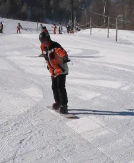
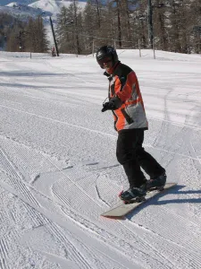
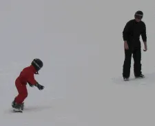
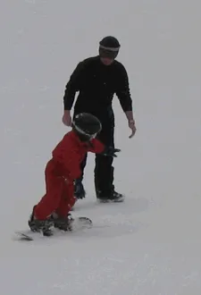
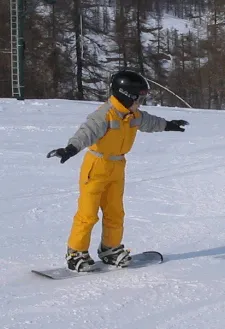
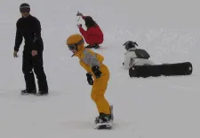
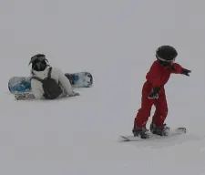
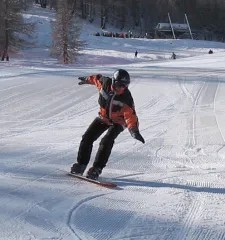

# Premiers virages en Snowboard

C'est la suite de cet [article]()

On est toujours Lundi après midi et comme on est en forme, il est temps de passer aux choses vraiment sérieuses : on va s'attaquer aux virages avec la planche. Pour cela, on reste toujours sur la piste Pitchoun, vous montez un peu et vous chaussez. Mettez vous à quatre pattes puis relevez-vous, on va y aller gentiment. Attention, on est bien d'accord... Vous êtes sur Pitchoun mais vous êtes sur une section de la piste où il y a un peu de pente. Bon allez, on y va et avec le sourire s'il vous plait...

## Virage Frontside

Je pense qu'il est préférable de commencer par ce virage car, psychologiquement, en ayant l'impression de pouvoir vous laisser tomber sur les mains, vous devriez être mentalement "rassuré".

Puisque la pente est faible, mettez le nez de la planche dans la pente. Vous gardez la planche à plat même si elle prend un tout petit peu de vitesse, vous tendez les bras dans l'axe longitudinal de la planche, vous tournez la tête et vous regardez devant vous. Euh... On est d'accord, vous êtes fléchi et vous appuyez sur la jambe avant.

Une petite remarque : quand je dis, "mettez le nez de la planche dans la pente", il ne s'agit pas de débouler à 100 km/h ou d'aller sauter un mur avec les cameramen de M6 en dessous. Du calme, on est d'accord, vous êtes sur Pitchoun... Alors même si la phrase semble "agressive" et tonique, je ne vous demande pas d'aller vous fracasser mais plutôt d'être volontaire, physique et de ne pas avoir peur de glisser à plat sur une faible distance (2-3 m par exemple).

On en était où ? Ah, oui, on en était à : "Ooops ! Ça va bien vite tout d'un coup..." Pas de panique. Surtout, vous ne reculez pas le tronc vers l'arrière de la planche et vous ne tendez pas la jambe avant. Au contraire, vous gardez la position fléchie, volontaire, et vous continuez à peser sur la jambe avant. Ceci dit, vous tournez progressivement les épaules et les bras. La main avant doit quitter la verticale de la planche et venir pointer vers l'amont (vers le haut de la montagne) alors que la main arrière doit quitter la verticale de la planche et aller vers l'aval (le bas de la montagne). Bien sûr, vous restez fléchi et vous appuyez toujours sur la jambe avant. "Ouais, mais ça marche pas, la planche continue tout droit !"

Encore une fois, pas de panique, regardez, ça y est elle commence à tourner. Faut juste lui donner un peu de temps (2 ou 3 secondes). Ne vous arrêtez pas, continuez à faire pivoter vos épaules et vos bras. La "board" continue son virage. Quand vous êtes satisfait, ré-équilibrez votre poids sur les deux jambes et redressez-vous un peu quand le mouvement est arrêté.

Vous avez commencé en mettant le nez de la planche dans la pente vous devriez être maintenant à l'arrêt, perpendiculaire à la ligne de pente et bien équilibré sur vos deux pieds (dans la même position qu'au départ avant que vous ne "plongiez" dans la pente, mais un peu plus bas).

En fait, on a pas fait un vrai virage mais juste une partie de virage. Comme en plus on s'est arrêté, y a encore du boulot...

Allez, faites en quelques uns comme ça. Quand vous en aurez marre d'avoir les bras écartés, mettez vos mains sur vos hanches (comme des danseurs Russes) et faites encore une fois pivoter les épaules, les hanches et les bras qui y sont accrochés.

Enfin, quand vous en aurez marre de passer pour un danseur Russe qui aurait du mal à se recycler, essayez d'être "surf attitude" et continuez à faire des virages mais en laissant vos bras à la verticale. Attention comme il faut impérativement que vos épaules tournent, vos bras, même verticaux, vont tourner aussi. Aidez-vous du regard... Vous partez "nez dans la pente", quand vous faites pivoter vos épaules, votre regard lui aussi remonte vers la montagne. Allez, faites encore des virages frontside, expérimentez, faites des tests. Ah oui, puisqu'on est en front, c'est genoux pliés et c'est "orteils, orteils, orteils".

## Virage Backside

Tout ce que l'on vient de dire à propos du front est valable en back. Ici vous partez assis, vous vous relevez avec grâce, vous mettez le nez de la planche dans la "pente", vous tournez vos épaules vers la montagne etc. Tout pareil je vous dis. Bien sûr, vous étiez fléchi, vous pesez sur votre jambe avant et c'est "talons, talons, talons".

En back comme en front, un bon moyen de se forcer à appuyer sur la jambe avant c'est de mettre le bras avant en bas et le bras arrière en haut. Bonjour la dégaine...

## Une petite vidéo qui reprend tout ça

<iframe width="560" height="315" src="https://www.youtube.com/embed/i9af352o5Ok?si=AXp0x6jG_w-cphfG" title="YouTube video player" frameborder="0" allow="accelerometer; autoplay; clipboard-write; encrypted-media; gyroscope; picture-in-picture; web-share" referrerpolicy="strict-origin-when-cross-origin" allowfullscreen></iframe>

## Enchaînement de virages

Jusqu'à présent, on a fait des morceaux de virages histoire de ne pas impressionner les foules dès le départ... Maintenant, il est temps d'utiliser ce que l'on vient de décomposer afin de descendre "dignement" cette fameuse piste Pitchoun. Attention, ici on va mettre en oeuvre, non seulement les virages, mais aussi les traversées.

Pour ces exercices, je vous conseille de monter un bon morceau de la piste. Ceci fait, mettez vous perpendiculaire à la ligne de pente en front ou en back, comme il vous plaira. Vous êtes vertical, à l'arrêt et les jambes légèrement fléchies. Pour les besoins des explications qui vont suivre, j'imagine que vous vous êtes relevé à quatre pattes, et que vous êtes donc en position frontside. La situation serait symétrique si vous étiez en back.

Commencez par l'équivalent d'une traversée. Attention, pas un truc à toute vitesse. Nan, un truc tout cool, presque à plat. Quand vous êtes prêt "dans votre tête", faites tourner pro-gre-ssi-ve-ment vos bras vers l'aval et le nez de la planche "va plonger tout seul dans la pente". Encore une fois, pas de panique, vous avez déjà ressenti cette sensation dans les exercices précédents. Ne raidissez pas vos jambes, gardez la position fléchie, continuez à appuyer sur la jambe avant et à faire tourner vos bras.

Ça y est, la planche qui un moment c'est retrouvée à plat dans la pente, continue de tourner et vient de passer sur l'autre carre. Vous étiez partis en front, la "board" est passé momentanément à plat et vous vous retrouvez en back.

N'ayez pas peur au début de continuer à faire tourner exagérément vos bras quitte à ce que la planche remonte un peu la pente et s'arrête en back. Le plus délicat à gérer dans ces tout premiers virages, c'est le passage d'une carre sur l'autre. Faut être clair... Au tout début, personne n'aime cet instant où l'on passe d'une carre à l'autre via une position à plat. Ceci dit, réfléchissez...

Dans les premiers exercices de virages en front ou en back on faisait partir la planche à plat. D'autre part, même si on ne l'a pas encore fait, la planche dans le tire fesse sera, là aussi, à plat. Conclusion, rassurez vous, une board n'est pas un être vicieux qui attend la moindre occasion pour vous faire du mal. Non, non, au contraire, elle sait glisser à plat et n'attend qu'une chose... Que vous passiez le cap mental du "carre-plat-carre" pour vraiment commencer à jouer avec vous.

Si jamais vous rencontrez des problèmes, ils sont certainement dû au fait que vous n'appuyez pas suffisamment sur votre jambe avant (en fait, c'est à mon avis tout le secret des premiers virages).

Encore une fois, réfléchissez... Si, alors que la planche est à plat dans la pente, vous raidissez votre jambe avant et reportez tout votre poids vers l'arrière, vous comprenez intuitivement que la planche va avoir tendance à se trouver le nez en l'air. Autrement dit il y aura moins de carre en contact avec la neige pour vous aider à passer en back et réaliser le virage. Bref, la peur n'évitant pas le danger, lorsque la board est à plat, il faut continuer à appuyer sur la jambe avant et à tourner les bras.

Tiens, arrêtez tout. Mettez-vous en perpendiculairement à la ligne de pente ou sur une portion plate de la piste. OK ? Bon maintenant, à l'arrêt, appuyez comme un bête sur votre jambe arrière et remontez votre jambe avant. Qu'est-ce qui se passe ? La planche se tord et son nez se retrouve à 20-30 cm de la neige. Pas convaincu ? L'avant ne lève pas vraiment... C'est de votre faute! Tirez plus fort. Elle est plus solide et plus souple que vous. Elle ne va pas casser. Levez bien le nez de la planche. Bon maintenant, remettez-vous à plat, gentiment, reprenez votre souffle et encore une fois réfléchissez...

En surf, comme en ski, ce qui vous fait tourner ce sont les carres. Si à l'extrême, il n'y a plus que votre spatule arrière qui touche la neige, c'est pas avec 2 cm de carre que vous allez tourner... Allez je vous laisse méditer là dessus...

Autre truc. Vous l'avez compris maintenant : on est passé d'une carre sur l'autre... Autrement dit, afin d'éviter les fautes de carre il faut que vous vous rappeliez la règle qui dit que : "en front je suis sur les orteils alors qu'en back je suis sur les talons". Même si sur ces premiers virages qui se font dans des pentes et à des vitesses faibles vous ne voulez pas chuter lourdement, il faut que vous soyez capable de placer "instinctivement" la pression sur les orteils ou les talons.

Bon, ben faut aller plus loin maintenant... On vient de faire front, back. Il faut faire maintenant back, front, back. Allez, repartez au charbon, faites une traversée en back (sur les talons), mettez la planche dans la pente (pieds à plat) grâce à la rotation des bras, passez en front (sur les orteils), repartez sur une petite traversée, faites pivoter à nouveau vos bras vers l'aval, vous vous retrouvez encore à plat, continuez à pivoter, changez de carre (vous êtes sur les talons) et vous finissez en back. Deux choses importantes : poids sur l'avant et rotation des bras progressive.

Heu... C'est idiot mais le dernier mot "pro-gre-ssive" est très important. Cela sous entend que vous ne donnez pas de coups de hanche intempestifs sous prétexte que "la planche veut pas tourner !". De la même manière cela suppose que vous ne balancez pas ni un bon vieux coup de pied arrière, ni un bon coup de fesse histoire d'abréger ce virage qui ne veut pas se déclencher.

Pensez à un grand prix moto... Vous avez déjà vu Max Biaggi ou El Doctor changer brutalement l'angle de sa moto en plein milieu d'une courbe parabolique ? Nan... Il arrive comme un boulet, il freine comme un malade, il angle (je passe sous silence l'aspect contre braquage qui sort du cadre de ce billet...), il garde l'angle et accélère le plus tôt possible. Bon ben nous c'est pareil. Une fois que la décision de virage est prise, que les bras et le regard ont tourné, on garde la position... Comme on est sur Pitchoun qui est dégagée, on appuie sur la jambe avant, on garde les genoux pliés et on attend que cela se passe.

Au fait... Pendant que vous allez vous entraîner à virer, de grâce, évitez de descendre toute la piste en dérapage (du style, "maman j'ai peur, je vais attendre encore un peu avant de mettre la planche à plat et déclencher mon virage"). D'abord c'est moche, ça fait du bruit, ça fait peur aux gamins (et aux mamies qui les surveillent) mais surtout vous n'apprenez rien...

Si vous êtes deux, le mieux, c'est qu'à tour de rôle il y en ai un qui parte et l'autre qui observe. Quand vous vous regroupez, prenez le temps de partager vos sensations, vos "feelings" et d'analyser pourquoi tel virage était OK alors que tel autre était minable.

Mieux encore : Si vous êtes deux filmez vous... N'ayez pas honte. C'est comme au tennis ou à moto. C'est super instructif. En plus, ici y a pas besoin d'un super matériel. N'importe quel téléphone avec un peu de mémoire devrait suffire pour l'après midi. Le soir, gentiment à l'apéro vous regardez et commentez tout ça. Regardez vos bras, comment est votre jambe avant, et le regard...

Si vous êtes tout seul, en plus du reste, essayez "d'écouter" la board. Si elle fait du bruit ou si vous la sentez qui gratte la neige c'est qu'il y a encore des efforts à faire (mais c'est pas grave, on verra ça plus tard quand on parlera des virages coupés). Vous pouvez aussi à la fin du virage, vous retourner et regarder votre trace. Si cette dernière est large (et que la planche a fait du bruit) faut se remettre au boulot. Sinon, si il n'y a qu'une seule trace (semblable à un coup de couteau sur une motte de beurre) et que la planche était silencieuse c'est que vous approchez du résultat attendu.

Allez au boulot, et n'hésitez pas à y passer le temps qu'il faut (en gros, tout le reste de l'après midi).

## Ce soir après la douche
Prends le temps de noter au dos de la feuille tes impressions du jour.

