# Yet another linear regression and $R^2$ introduction
{: .no_toc }

{: .note }
This article was first published on [Medium](https://medium.com/@philippe.baucour/yet-another-linear-regression-introduction-0835e333508b){:target="_blank"} on Dec 5, 2024. I really enjoy reading on Medium. However, at the time of writing, and based on my understanding, Medium does not support Markdown or $$\mathrm{\LaTeX}$$. As a result, the content of the article is not rendered as intended. Additionally, to be honest, the writing experience was frustrating. I suppose this will be my first and last article on Medium.

This article is for beginners. My goal is to help you gain a clearer understanding of $R^2$ so you can confidently explain it to yourself or someone else. 

## Table of Contents
{: .no_toc .text-delta}
- TOC
{:toc}

<!-- ###################################################################### -->
<!-- ###################################################################### -->
<!-- ###################################################################### -->
## Introduction
I recently went to Sequoia National Park with a park ranger. All day long, I measured tree trunk diameters, and he gave me his opinion on the age of each sequoia. I'm exhausted but happy. The weather was beautiful, the ranger was super friendly and incredibly knowledgeable, and the cherry on top—I now have a wealth of data to build my model.  

When I plot the age of the sequoias against their trunk diameters, here's what I see:  

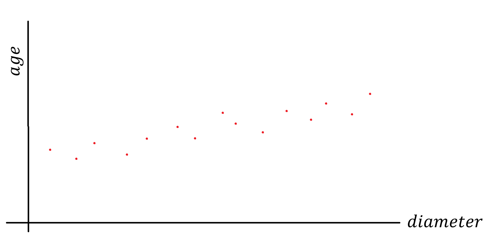

<!-- ###################################################################### -->
<!-- ###################################################################### -->
<!-- ###################################################################### -->
## The million-dollar question

For every diameter value (horizontal axis, the x-axis), I've placed a red dot at the height (vertical axis, the y-axis) corresponding to the age given by the ranger. 

I don't know about you, but my brain immediately wants to draw a straight line through all these points. What I have in mind looks like this:  

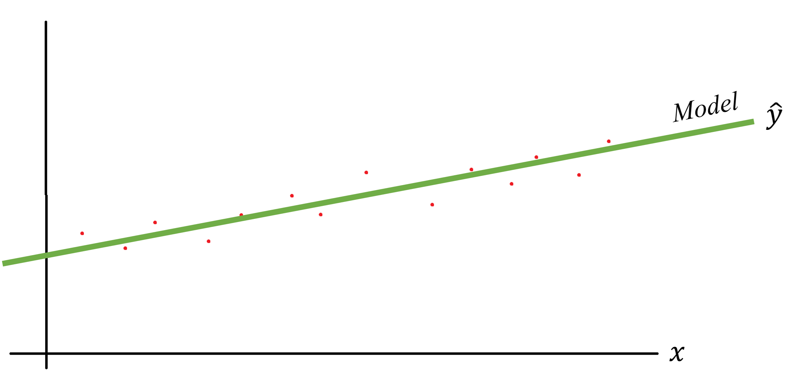

The green line is my model, and we usually denote the predicted value of the model as $\hat{y}$. I say this is my model because if you give it a diameter which was not in the initial dataset, it will be able to infer an age. Notice that, to generalize, on the graph, I'm no longer mentioning sequoia trunk diameters or ages but simply a variable $x$ and corresponding values $y$.  

It seems to work for most points, but I notice there's always a difference between the actual measurement (red dots) and the value predicted by the model (the green dots of the line). To illustrate this, I've exaggerated the differences in the diagram below:  

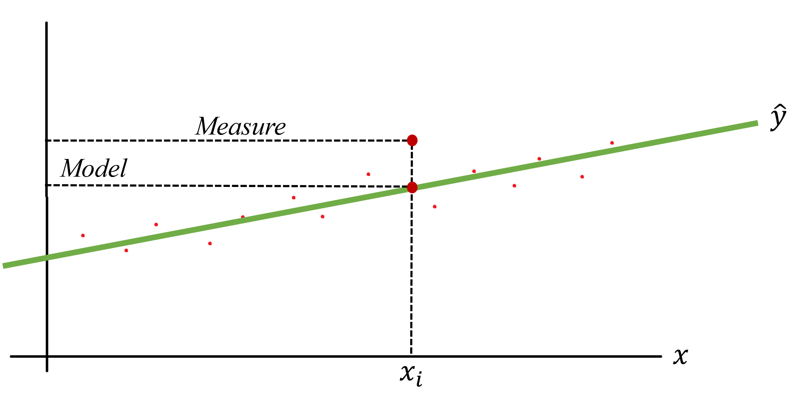

For example, the diameters range from 0 to 11 m (the General Sherman), and I've picked a specific value: 7 m. To generalize later, I'll call this specific value $x_i$. When I check my notes and the graph, the ranger's estimated age for this diameter was 1_750 years (see the dashed “Measure” line). Meanwhile, for this same $x_i$, the green line (the model) predicts an age of 1_500 years (see the “Model” line).  

This is just one point, but I see the same pattern across all points. There are always discrepancies, either positive or negative, between the ranger's estimates (which I'll treat as the truth) and the predictions from the model (the green line).  

Now comes the million-dollar question: **How good is this model?**  

And while we're at it, if tomorrow I have another a dark green line model (color matters) with a slightly steeper slope—how can I determine which of the two models performs better?  

<!-- ###################################################################### -->
<!-- ###################################################################### -->
<!-- ###################################################################### -->
## How good is this model ?

This is where $R^2$ comes in. The idea is that it gives us a single value that helps us compare the performance of different models.  

OK… How does it work? We want to compare models. Fair enough. But what would be the simplest possible model for our sequoia story? One option could be a very unsophisticated model that always gives the same answer. It wouldn't respond with 0, since few sequoias have a trunk diameter of 0 m. Nor would it respond with 11 m, as there's only one General Sherman. A reasonable approach for a “not-so-smart” model would be to always predict the **average** of all measurements. 

*Wait wait wait… Where does this average come from?*

Let's say I have a set of values: 18, 12, 13, 17 and 15.  
I'm trying to determine a value which, when announced in place of any other value in the set, will minimize the error between this value and reality.  
Let's take an extreme example… If I say the value in question is 100, is that a good value? No, because the difference between 100 and any of the values in my set is very large. 100 is not an "optimal" representative of the dataset.  
Similarly, 10 isn't a good value either, because it's too small.  
In short, I'm looking for x such that the sum of the deviations (x-18) + (x-12) + (x-13) + (x-17) + (x-15) is minimal.  
So, an x such that 5x - (18+12+13+17+15) = 0  
As a result, for x we find the expression for the arithmetic mean x = (18+12+13+17+15)/5  
OK? Let's continue.    

The situation would look like this:  

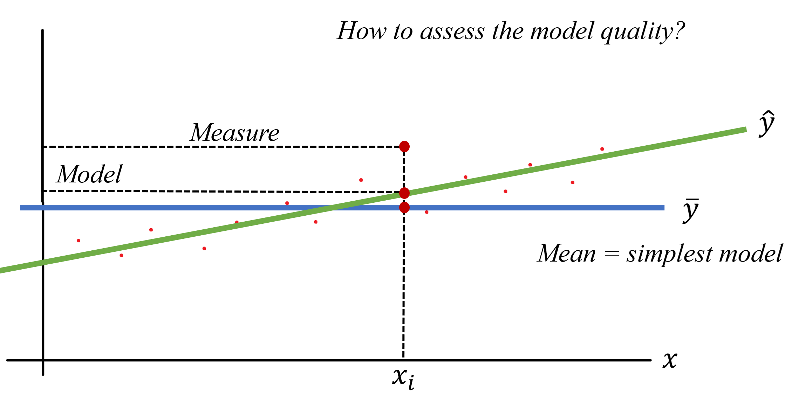

Here, I've drawn a horizontal blue line at a height of $\bar{y}$ (notice the bar above $y$), which is the average value of all measured ages. This model would respond, for instance, with 1,250 years regardless of the trunk diameter. If I say the diameter is 2 m, the model predicts 1,250 years. If I say the diameter is 8 m, the model still predicts 1_250 years. When I say it's “not-so-smart,” I really mean it.  

Now, let's take a specific $x_i$. The simple model predicts $\bar{y}$ (e.g., 1_250 years), while my model predicts $\hat{y}_i$, which is the height (y-value) at the point where the vertical line through $x_i$ intersects the green line.  

*Hmm... Earlier, we saw a gap between the true value and the predicted value of the model. Now we also see a gap but between the “not-so-smart” model and my model. What's the point?*  

The key takeaway here is that the model returning the average serves as a **benchmark** or **reference point**. Moving forward, we'll create a method to compare our model against this benchmark. Later, if we compare another model to the same benchmark, we'll also be able to compare the two models with each other.  

<!-- ###################################################################### -->
<!-- ###################################################################### -->
<!-- ###################################################################### -->
## Ok but how do we compare two quantities?
This is where Weber's Law comes in, which states that we are more sensitive to ratios than to absolute differences.  

Let's use an example to make this clearer. Imagine I'm walking down the street and see two couples ahead of me. In the first couple, both people are about 1.75 m tall. The woman might be slightly taller, but it's only a matter of a centimeter or so. To me, they seem the same height. In the second couple, it's a different story. It looks like Shi Feng Luo (the Chinese weightlifting champion, 1.65 m tall) is walking with Victor Wembanyama (the French basketball player, 2.23 m tall). In this case, the difference is glaringly obvious.  

So, to compare the performance of our linear regression to the true measurements, we'll calculate the ratio of their respective gaps relative to the average value (our benchmark, or zero point).  

It's going to be fine—you'll see—and it will look something like this:  

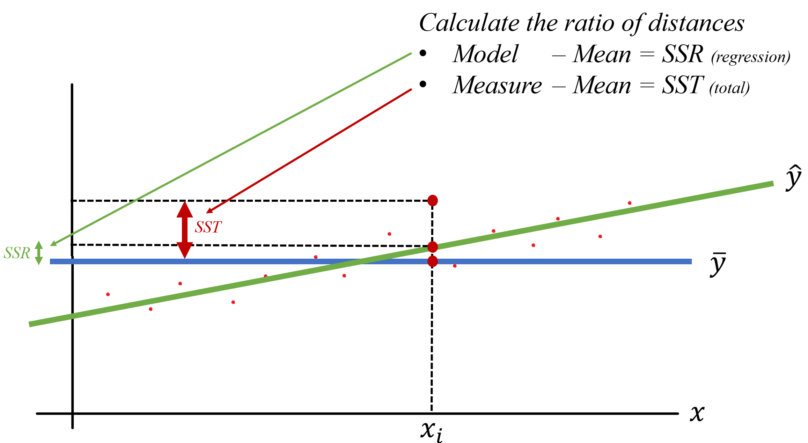

Don't panic, bear with me. Our model is a regression—hence the "R." Above, $SSR$ represents the distance between the predictions of the baseline model (I'll stop calling it "not-so-smart" to avoid hurting its feelings) and the predictions of our model (Regression). In other words, it's the difference between the blue line and the green line.  

Next, we'll define $SST$, where "T" stands for Total. This is the distance between the true value (given by the park ranger) and the average predicted by the baseline model.  

*Wait, wait… What are these "SS" terms that just appeared out of nowhere?* 

For now, trust me—we'll justify them in a couple of paragraphs. Trust in me, just in me…  

*OK, but you mentioned we're going to compare values. So, I was expecting to compare* $SST$ *(the difference between the baseline model's prediction and the true value) with something not named in your diagram but representing the difference between the green curve and the true value from the ranger.* That's an excellent observation. Actually, there are two ways to approach this, and I made a choice. Again, bear with me—I'll discuss this at the end of the article.  

Now, we're almost there. At this point, let's say:  

$$R^2 = \frac{\text{Model}}{\text{Measure}}$$

This is what the situation looks like:  

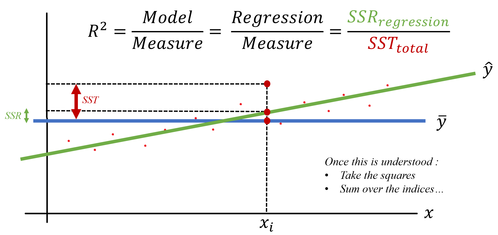

<!-- ###################################################################### -->
<!-- ###################################################################### -->
<!-- ###################################################################### -->
## It is completely wrong

Yes, of course, this is not entirely correct—in fact, it's completely wrong. But keep in mind that $R^2$ is essentially a **comparison** (a ratio) of the model's predictions versus what happens, on average, in real life.  

If the ratio equals 1, our model is fantastic—it perfectly matches reality. If $R^2$ equals 0, it means our model performs no better than the baseline model.  

$$R^2 = \frac{\text{Model}}{\text{Measure}} = \frac{\text{Regression}}{\text{Measure}} = \frac{SSR_{\text{regression}}}{SST_{\text{total}}}$$

*Wait, wait… Can you go over that last sentence again? If* $R^2 = 0$*, does that mean the model is useless and we need to move on?* 

No, not quite. If $R^2 = 0$, it means the numerator is 0. In other words, there's no difference between our model's predictions and the baseline model's predictions.  

To be in this situation, all we'd need to do is lower the green line until it intersects the blue line when $x = x_i$. So, when $R^2 = 1$, the model perfectly matches reality. When $R^2 = 0$, the model isn't useless—it's just no better than the baseline model, which always predicts “average,” “average,” “average,” regardless of the diameter.  

That said, it's like with insurance contracts—the devil is in the details. The $R^2$ we just calculated applies only to the specific $x_i$ value. What we need is a figure that summarizes the overall performance of our model—a single $R^2$ value that covers all possible $x_i$.  

To achieve this, we'll calculate the ratio of the **sums** of all differences. But wait—it's not that simple. While summing the differences is a good idea, we can't directly use the sum of differences. Why not?  

If at $x_3$, the difference is -4, and at $x_{42}$, the difference is +4, the two errors would cancel each other out, even though they actually add up. To avoid this, we'll use Gauss's method: squaring the differences before summing them. This ensures we only deal with positive numbers, so they can't cancel each other out.  

Hmm... Sum of squared differences. Sum with an 'S' and squared with an 'S' too. Do you understand from where the "SS" are coming from?

<!-- ###################################################################### -->
<!-- ###################################################################### -->
<!-- ###################################################################### -->
## Here's how it works:  

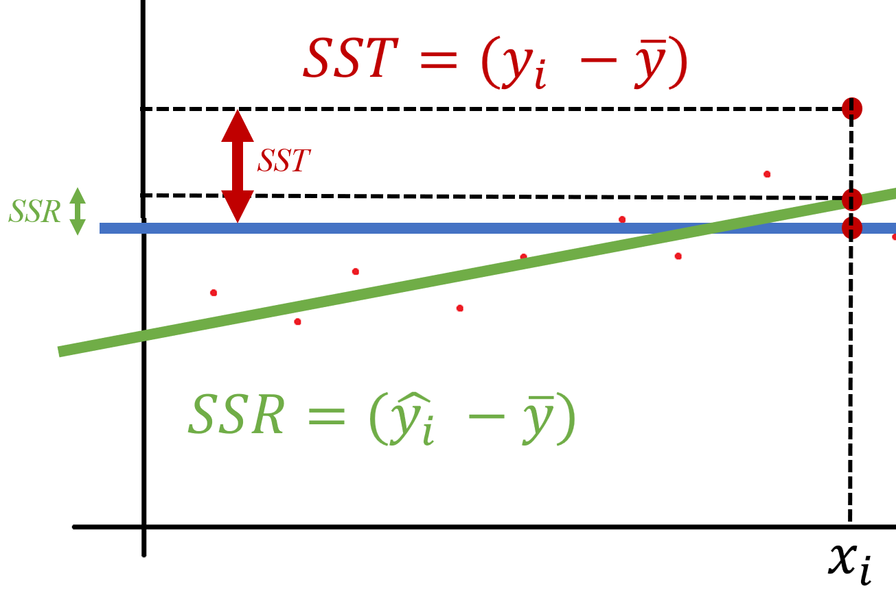

For each index $i$, we calculate $SSR_i$ and $SST_i$.  

Next, we square these two calculated values.  

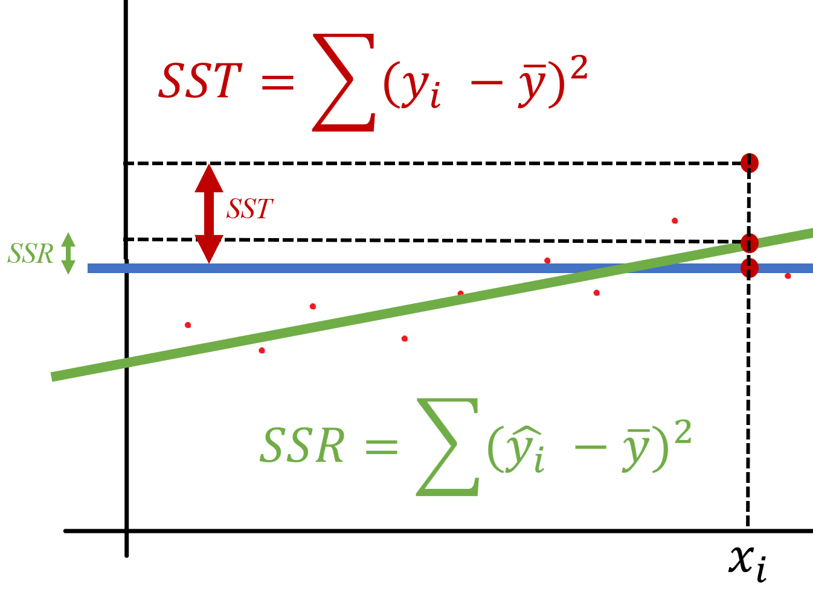

Finally, we sum up all the squared values. At the end, we have the true values of $SST$, $SSR$, and $R^2$.  

This is what the final situation looks like:  

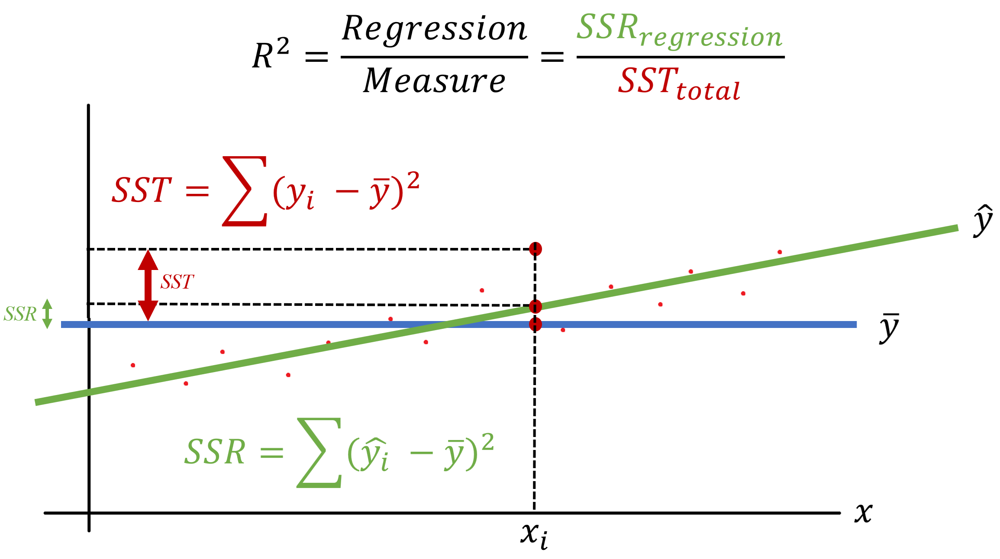

At the end, $R^2$ synthesizes into a single value the model's ability to explain the variability of measurements relative to their average. Once again :
- if the model's $R^2$ is 1, it means the model explains 100% of the variability. 
- If the model's $R^2$ is 0, it means the model is no better than the baseline model, which always predicts 'average,' 'average,' 'average' (it always reminds me of 'spam,' 'spam,' 'spam' from Monty Python).

<!-- ###################################################################### -->
<!-- ###################################################################### -->
<!-- ###################################################################### -->
## One last thing before we summarize

We said $R^2$ is the ratio of the model's predictions to what happens, on average, in real life ($\frac{SSR}{SST}$). With that in mind, if we note that **total variability** equals **explained variability** plus **unexplained variability**, we can introduce the term we must not name—no, not Lord Voldemort, but $SSE$.  

We can illustrate the situation as follows:  

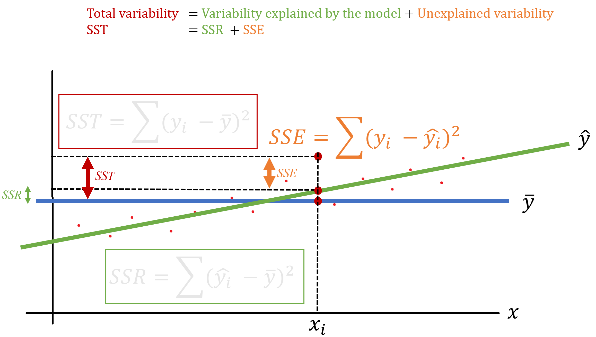

Notice that we've written:  

$$SST = SSR + SSE$$

In plain English, this means that the total variability ($SST$) equals the variability explained by the model ($SSR$) plus the variability not explained by the model ($SSE$).  

Finally, we can express $R^2$ in two different ways:  

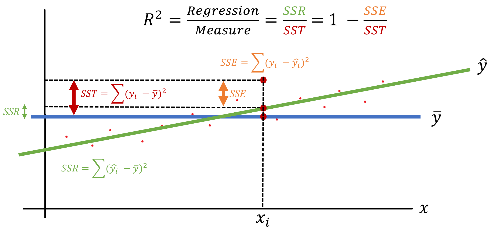

<!-- ###################################################################### -->
<!-- ###################################################################### -->
<!-- ###################################################################### -->
## Summary Notes

1. **We worked in 2D for simplicity**, as it makes illustrations easier to understand. However, everything discussed so far applies to higher dimensions as well. Imagine that, besides measuring the diameter, I also measured the height of the sequoias. With $x$ as the diameter and $y$ as the height, we can determine $z$, the age of the tree. In this case, our green line becomes a green plane. Similarly, if we add another feature (I'm not sure what—I'm not exactly a sequoia expert), we now have three features: $x$, $y$, and $z$. The plane becomes a 3D regression cube, and at that point, aside from drawing its shadow, I'm not sure what else we can do visually.  

2. **$R^2$ summarizes the model's ability to explain the variability of measurements compared to their average in a single value.**

3. **If the model's $R^2 = 1$:**  
   - The model explains **100% of the variability** of the measurements.  

4. **If the model's $R^2 = 0$:**  
   - The model explains **no more variability** in the measurements than the baseline model, which always predicts "average," "average," "average."  

5. **The relationship $SST = SSR + SSE$:**  
   - In plain English, the total variability ($SST$) equals the variability explained by the model ($SSR$) plus the variability not explained by the model ($SSE$).  

6. **The formula for $R^2$:**  

  $$R^2 = \frac{\text{Regression}}{\text{Measurement}} = \frac{SSR}{SST} = 1 - \frac{SSE}{SST}$$

* $SSR$ : Distance between the **mean** and the **predicted value**.  
* $SST$ : Distance between the **mean** and the **actual value**.  
* $SSE$ : Distance between the **actual value** and the **predicted value**.  

## TODOs  

- Research **Adjusted $R^2$** and how it accounts for model complexity.  
- Read the article: [What's Wrong With R-Squared (And How to Fix It)](https://medium.com/towards-data-science/whats-wrong-with-r-squared-and-how-to-fix-it-7362c5f26c53) by Samuele Mazzanti.  
