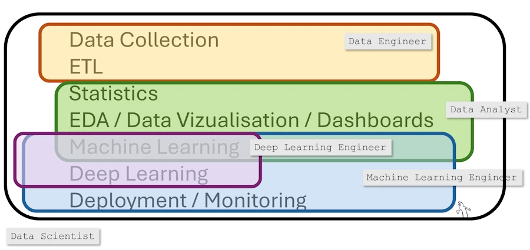

## Introduction

Un billet très court et non exhaustif afin de dégrossir les principaux métiers, rôles et "job title" dont on entend parler quand on cherche une formation ou qu'on lit des offres d'emploi. 

## Synthèse 

| Métier | Objectif principal | Compétences clés | Outils typiques | Livrable attendu |
|--------|--------------------|------------------|-----------------|------------------|
| **Data Analyst** | Comprendre et communiquer clairement les tendances des données | Analyse exploratoire, visualisation, reporting | Excel, SQL, Tableau, Power BI, Python (Pandas) | Rapports, dashboards, analyses descriptives |
| **Data Scientist** | Extraire des insights à partir de données, créer des modèles ML | Statistiques avancées, Machine Learning, visualisation | Python (Pandas, Scikit-Learn), Jupyter, SQL, Notebooks | Modèles prédictifs, analyses statistiques, insights |
| **Data Engineer** | Assurer la disponibilité, la qualité et la structuration des données | Pipeline de données, gestion des flux, stockage, ETL/ELT | SQL/NoSQL, Apache Spark, Kafka, Airflow, Hadoop, Cloud (AWS, GCP) | Pipelines robustes, bases optimisées, flux automatisés |
| **ML Ops** | Industrialiser et surveiller les modèles ML en production | Déploiement ML, monitoring, automatisation | Docker, Kubernetes, CI/CD (Jenkins, GitHub Actions), MLflow, Evidently | Modèles en prod monitorés, pipelines automatisées, retraining continu |
| **Dev Ops** | Accélérer et sécuriser le déploiement logiciel en continu | Automatisation, CI/CD, monitoring d’applications | Docker, Kubernetes, Jenkins, Git, Terraform, Ansible | Applications robustes déployées rapidement, environnements reproductibles |
| **AI Engineer** | Concevoir, développer et déployer des modèles d’IA avancés | Deep learning, NLP, Computer Vision, ML avancé | TensorFlow, PyTorch, OpenAI API, CUDA, Python | Solutions d’IA performantes déployées en production |
| **AI Architect** | Définir la stratégie et l'architecture globale des solutions IA | Vision stratégique, gestion de projet, architectures cloud et AI | Cloud providers (AWS, Azure, GCP), Kubernetes, Frameworks AI/ML | Architecture robuste et évolutive, stratégie technique et IA claire |

## Complément 

- **Data Analyst** :  
  Plutôt orienté exploration descriptive, création de visualisations et communication des insights aux équipes métier. Il doit savoir communiquer, être pédagogue, traduire les données en quelque chose de compréhensible. Fait pas de développement. SQL oui, Python non. 

- **Data Scientist** :  
  Principalement centré sur l’exploitation de la donnée pour modéliser, prédire, classifier et extraire des insights. Plus orienté "modélisation" et statistiques avancées.

- **Data Engineer** :  
  S'occupe de la gestion opérationnelle des données (stockage, pipeline d'intégration, temps réel, batch) pour assurer une disponibilité fiable, rapide et sécurisée aux équipes data science et analytiques. Va faire du scraping, de l'ETL Pandas ou Spark. Fait du dev toute la journée. Y a peu de différence entre dev Python et Data Engineer.

- **ML Ops** :  
  Vise l'opérationnalisation des modèles ML, leur mise en production, leur surveillance et leur gestion de cycle de vie (retraining automatique, rollback, monitoring des dérives).

- **Dev Ops** :  
  A une approche similaire au ML Ops mais appliquée aux logiciels et applications classiques. Met en œuvre des stratégies d’intégration continue et de déploiement continu (CI/CD) pour accélérer les mises à jour et garantir stabilité et sécurité.

- **AI Engineer** :  
  Développe et déploie des modèles avancés (Deep Learning, NLP, Vision, génération, etc.). Fort accent technique, compétences pointues en apprentissage profond et ingénierie logicielle dédiée à l'IA.
  
  Ça vaut ce que ça vaut mais tu peux aller voir le [RNCP35288](https://www.francecompetences.fr/recherche/rncp/35288/) de France Formation (je l'ai obtenu via JEDHA Bootcamp fin 2024).

- **AI Architect** :  
  Positionnement stratégique : définit l’architecture technique globale, sélectionne les bonnes technologies IA/cloud, assure cohérence et évolutivité technique sur les projets IA à grande échelle. Vision transverse orientée décision stratégique.
  
  Voir le [RNCP38777](https://www.francecompetences.fr/recherche/rncp/38777/) de France Formation (je l'ai obtenu via JEDHA Bootcamp fin 2024).

## Une autre façon de voir

On regarde ici les rôle le long du pipeline qui va du Data Collection au Deployment & Monitoring.

- **ML Engineer** :  
  Remplace de plus en plus les data scientist. Partie technique du data scientist. S'occupe du déploiement et fait du developpement. En contact avec les clients.

- **ML Ops** :
  Vient de Dev Ops. Il source les outils disponibles, détermine la stack, trouve les solutions chez AWS etc. Il fait de la veille technique et il monitore les tarifications.
  

## Ma conclusion
* Le titres changent d'une boîte à une autre
* Faut surtout regarder les compétences demandées
* Demander la description d'une journée type, les outils utilisés...