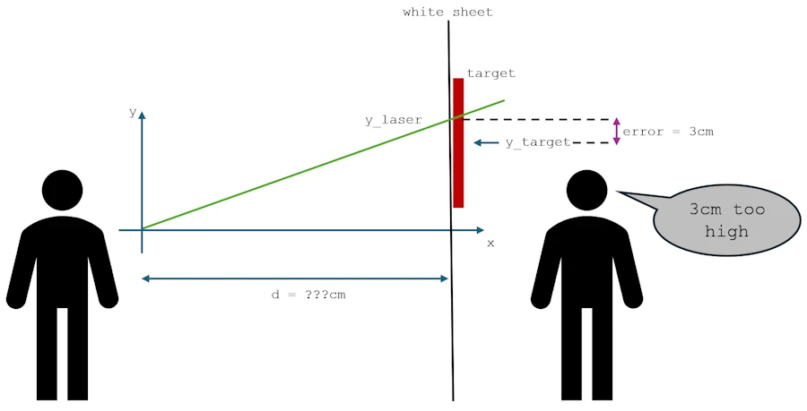
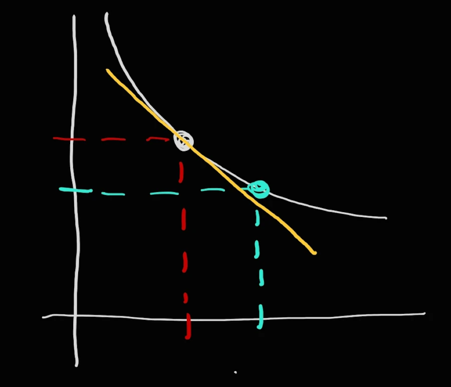
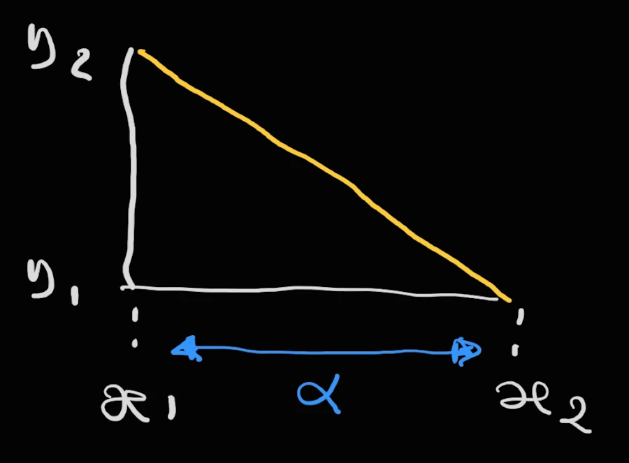

# Understanding Gradient Descent
{: .no_toc }

An introduction with a 1D model
{: .lead }


<!-- <h2 align="center">
<span style="color:orange"><b> 🚧 This post is under construction 🚧</b></span>
</h2> -->


<!-- ###################################################################### -->
<!-- ###################################################################### -->
<!-- ###################################################################### -->

## TL;DR
{: .no_toc }

* a variable $$y$$
* error between $$y$$ and $$y_{true}$$
* cost function in NOT error (it is a function of the error $$cost(error)$$)
* slope, gradient, derivative of the cost function with respect to the variable $$y$$
* learning rate ($$\alpha$$, the step by which we progress along the x-axis)
* error ➡️ cost(error) ➡️ derivative ➡️ $$y_2 = y_1 - \alpha \cdot \text{grad}$$
* Gradient descent = Taking a step towards the target (where the cost=0)


<div align="center">
<br/>
<span>Gradient Descent in 1D.</span>
</div>


<!-- ###################################################################### -->
<!-- ###################################################################### -->
<!-- ###################################################################### -->

## Table of Contents
{: .no_toc .text-delta}
- TOC
{:toc}


<!-- ###################################################################### -->
<!-- ###################################################################### -->
<!-- ###################################################################### -->

## Introduction

I just finish [this book](https://www.amazon.fr/Anyone-Builds-Everyone-Dies-Superhuman/dp/0316595640):

<div align="center">
<br/>
<span>If Anyone Builds It, Everyone Dies.</span>
</div>

And I realized that the authors were using the term “gradient descent” as if it were self-explanatory. There is a brief explanation at one point, but still... From their perspective, the term is as commonplace as "hot", "high", or "low". And they're right. In the age of AI, the term gradient descent is ubiquitous, and we'd rather have strong foundations and a deep understanding of what it means.

Therefore I think it is important to clarify our ideas on the subject so that we know exactly what we are talking about.

Don't panic, as usual I will start very slowly, assuming little or nothing about your level of mathematics.

I'll also take the time to review key terms, make summaries, etc. You'll see, it'll be fine...


<!-- ###################################################################### -->
<!-- ###################################################################### -->
<!-- ###################################################################### -->

## Configure a Laser Pointer Game

Imagine that you are holding a laser pointer, pointed at a white sheet hanging in front of you. Behind that sheet, there's a target at a specific height - but you can't see it.

Your friend standing behind the sheet can see both your laser dot and the target, and they shout feedback: "3 centimeters too high!" or "5 centimeters below!". Hum... Just to make sure...You confirm that you use the metric system, like 95% of humanity, and NOT... *That Which Must Not Be Named*. Right?

Your goal? Adjust the angle of your laser until it hits the target perfectly. No, you can’t change anything else yet—only the height of the dot.

<div align="center">
<br/>
<!-- <span>Gradient Descent.</span> -->
</div>


Let's translate this with equations. Say you're standing few meters away from the wall, and your laser starts at chest height (let's call that 0 centimeters for simplicity).

The laser beam follows a straight line that we can describe mathematically as:

$$y = a × x + b$$

Where:
- $$x$$ is the horizontal distance
- $$y$$ is the height where the laser hits
- $$a$$ is the angle (technically the slope/tangent of the angle)
- $$b$$ is your starting height (0 cm in our case)

Since you're holding the laser steady at chest height, $$b = 0$$, and you can only adjust the angle $$a$$. So our equation simplifies to:

$$y = a × x$$

<div align="center">
<br/>
<!-- <span>Gradient Descent in 2D.</span> -->
</div>

The **key point** here is : you **don't know the distance** between you and the target. Otherwise the "problem" is solved in one step once your friend tells you the error.

<!-- $$\alpha = arctan(frac{}{distance})$$ -->


Now, let's define our "mistake" mathematically. Let’s call the vertical position of the target $$y\_target$$. The current vertical position of your laser dot is $$y\_laser$$.

The $$\text{error}$$ is the difference between where you are and where you want to be: $$\text{error} = y\_laser - y\_target$$

Your friend's shout, "3 cm too high," means the error is `+3 cm`. If they shout "5 cm below," the error is `-5 cm`. But a negative error for "below" can be a little confusing. A more common way is to define a **cost function** (this term is important).

Let's square the error. This does two great things:
1.  It makes all errors positive (`(3)² = 9` and `(-5)² = 25`).
2.  It penalizes larger errors more severely.

Our **cost function**, let's call it $$J$$, becomes:
$$J = (y\_laser - y\_target)^2$$

Now, our goal is no longer just to minimize the **error**, but to minimize this **cost**. The point where the cost is zero is the bullseye!

***Yes, but no...I understand "error" but I do not understand why you introduce the "cost" and in addition, I do not understand why you decided to square the error. Can you come back on this point?***

That's a totally fair question. Let me explain why we do this and trust me, it's **NOT** just to make math more complicated, it is to solve two specific problems.

**Problem #1:** The "Which Way is Up?" problem

Think about our "3 cm too high" error. The error is `+3`. Easy. Now, imagine you're "5 cm too low". What's the error? It's `-5`.

See the issue? We have positive and negative errors. If we just used the raw error `(y_laser - y_target)` to guide us, a positive error would tell us to go down, but a negative error would tell us to go... up? Well, actually, yes. But for an algorithm, having a clear, consistent signal is super helpful. We want a function that is *always* positive, so we know that our only goal is to make it go down to zero. It gives us a single, unified direction: **downhill**.

What's more, I'm a bit stuck here because I only have one dimension, but imagine that you can point your laser both up and across.
* If it's 3 cm too high and 3 cm too far to the left, what's the error? 3 + 3 = 6?
* If it's 3 cm too high and 3 cm too far to the right, what's the error? 3 + (-3) = 0?

To prevent sign errors from canceling each other out, with more than one dimension, we make them all positive and we sum them up. An easy way to make them positive is to square them. We could also decide to raise them to the power of 4, the power of 6... Or to add up their absolute values.

Do you get why we talk about an error and a cost function? Right — on one side we have a value, the error. On the other, we apply a function to that value, and we call it the cost function because it basically tells us that larger errors 'cost' more.

**Problem #2:** The "How Wrong Am I, Really?" Problem

This is the bigger reason. Let's play this out. You take two shots:

*   **Shot A:** You're 1 cm off.
*   **Shot B:** You're 10 cm off.

If we just used the raw error, Shot B is only 10 times worse than Shot A (`10` vs. `1`). But intuitively, being 10 cm off isn't just a little worse—it's a *catastrophe* compared to being 1 cm off. You'd want to make a much bigger correction for Shot B.

The raw error doesn't capture this "punish big mistakes more" idea.

**The "Squaring" Genius Move**

Now, watch what happens when we square the error to get our cost ($$J = error^2$$).

*   **Shot A (1 cm off):** $$\text{cost} = 1^2 = 1$$
*   **Shot B (10 cm off):** $$\text{cost} = 10^2 = 100$$

Boom! Now, Shot B isn't just 10 times worse; it's **100 times worse** in terms of its cost. This is a much better reflection of how "bad" the miss is.

So, by squaring the error:
1.  We solve the positive/negative problem. The cost is always positive, so our goal is crystal clear: **minimize the cost**.
2.  We "amplify" large errors. The algorithm becomes *desperate* to fix big mistakes first, which usually helps it find the target much faster.

**The Car Analogy:**

Think of it like driving. Here I imagine that like [2/3 of the planet](https://en.wikipedia.org/wiki/Left-_and_right-hand_traffic) you drive in a right-hand-traffic. The raw error is your distance from the center of your lane. The cost is like your stress level.
*   If you're 1 cm out of your lane, you're a little stressed (`cost = 1`).
*   If you're 100 cm on the left from the center of your lane and heading into oncoming traffic, you're *panicked* (`cost = 100`).

You don't just correct your steering proportionally to the distance; you correct it more aggressively when you're in real danger. The squared cost makes our laser pointer algorithm do the same thing.

So, the **cost function** is **NOT** just a fancy name for error. It's our carefully designed measure of "wrongness" that is perfectly tailored for an algorithm to efficiently minimize it. It's the mathematical version of your friend not just saying "you're off," but screaming "YOU'RE REALLY, *REALLY* OFF, DUDE!" when you are.

Oh, by the way, if you want to impress your grandmother at Thanksgiving dinner, you can add that it was Gauss and Legendre who came up with all this more than 200 years ago.

OK? Let's move on...


<!-- ###################################################################### -->
<!-- ###################################################################### -->
<!-- ###################################################################### -->

## The Core Idea: Learning from the Slope

You take your first shot. Your laser dot appears at some random height $$y$$. Your friend shouts: "error = 3 cm" (too high).

What does this tell you? You need to aim **lower**. The feedback not only tells you that you're wrong, but also **in which direction** you are wrong. This "direction" is the **slope** or the **gradient**.

In this 1-dimensional case (only moving up and down), the gradient is just the derivative of the cost function with respect to your laser's position, $$y\_laser$$.


***The what? The derivative of the... No way I’m going any further. I didn’t catch jack of what you just said.***


Ok, you're right... Let's talk about the slope, our mathematical "Tilt-O-Meter".

<div align="center">
<br/>
<span>Tilt-O-Meter</span>
</div>

So, we have our cost function, $$J = (y\_laser - y\_target)^2$$. Imagine we graph this. Since the only thing changing is `y_laser`, we get a simple U-shaped curve because $$J = (y\_laser - y\_target)^2 \approx (x - k)^2 \approx x^2$$. This is nothing else than a parabola where the bottom of the "U" is right where `y_laser` equals `y_target`— that's our bullseye, where the cost is zero.


<!-- ###################################################################### -->

### Let's play with Python
{: .no_toc }

Paste the code below in [JupyterLab](https://jupyter.org/try-jupyter/lab/).

```python
import numpy as np
import matplotlib.pyplot as plt

# Configuration
plt.style.use('default')
plt.rcParams['figure.figsize'] = (10, 6)

# Define the target
y_target = 100

# Create an array of value for y_laser
y_laser = np.linspace(70, 130, 100)  # from 70cm to 130cm

# Calculate the cost function J = (y_laser - y_target)²
J = (y_laser - y_target)**2

# Create graph
plt.figure(figsize=(10, 6))
plt.plot(y_laser, J, 'b-', linewidth=2, label='Cost $J = (y_{laser} - y_{target})^2$')
plt.axvline(x=y_target, color='red', linestyle='--', alpha=0.7, label=f'Target ($y_{{target}} = {y_target}$ cm)')

# Spot the minimum
min_index = np.argmin(J)
plt.plot(y_laser[min_index], J[min_index], 'ro', markersize=8, label='Minimum (cost = 0)')

# Personnalisation du graphique
plt.xlabel('Laser Position $y_{laser}$ (cm)', fontsize=12)
plt.ylabel('Cost $J$', fontsize=12)
plt.title('Cost Function: Squared Error', fontsize=14)
plt.grid(True, alpha=0.3)
plt.legend(fontsize=11)

# Ajouter quelques annotations pour illustrer
plt.annotate('High cost = large value', xy=(115, 200), xytext=(110, 400),
            arrowprops=dict(arrowstyle='->', color='gray'), fontsize=10)

plt.annotate('Low cost = small value', xy=(95, 25), xytext=(85, 150),
            arrowprops=dict(arrowstyle='->', color='gray'), fontsize=10)

plt.tight_layout()
plt.show()

```


<div align="center">
<br/>
<span>Drawing the cost function.</span>
</div>

Now, put one of your fingers on the horizontal axis (`Laser position ylaser`) and move it slowly from left to right. Reach the point $$y\_laser=80$$ go up, vertically and when your finger meet the curve, say it loud : "when `y_laser` is 80 centimeters, the cost is 400". Continue and reach the point where $$y\_laser=100$$ on the x-axis and say it loud : "when `y_laser` is 100 centimeters, the cost is 0". One more time, just to make sure... Put your finger on point $$y\_laser=110$$ and say it loud : "when `y_laser` is 110 centimeters, the cost is 100".

It is important to realize and understand that positioning the laser at 80 cm is just as wrong as positioning it at 120 cm. In both cases, the cost is the same (400).

This said, picture yourself standing on the left hand side of this curve, like you're on a snowboard in a half-pipe. Your position on the x-axis is your current `y_laser` guess, and the height of the curve beneath you is your current cost $$J$$.

Your goal is to get to the bottom of the half-pipe.

**Here's the crucial question: How do you know which way to go?**

You feel it with your feet. If the ground is tilting down to the right, you go right. If it's tilting down to the left, you go left. The **steepness of the tilt** tells you *how urgently* you need to move.

This "tilt" is what mathematicians call the **slope** or the **gradient**. In our one-dimensional case, it's the derivative of the cost function.

*   When the slope is **positive** (ground tilting upwards to the right), you are to the **right** of the target. To go downhill, you need to move **left**... which, on our `y_laser` axis, means you need to **decrease** your `y_laser` value (from 130 to 110 cm for example).
*   When the slope is **negative** (ground tilting downwards to the right), you are to the **left** of the target. To go downhill, you need to move **right**, which means you need to **increase** your `y_laser` value (from 80 to 90 cm for example).


The slope gives us both the **direction** to move and the **intensity** of the correction needed. A steep slope means we're far from the bottom and should take a big step. A gentle slope means we're close and should make a fine adjustment.

Ok, now let's calculate this all-important slope. We find the derivative of our cost function $$J$$ with respect to our laser's position, `y_laser`.


$$J = (y\_laser - y\_target)^2$$

The derivative, $$\frac{\mathrm{d}J}{\mathrm{d}y\_laser}$$, tells us the slope of the cost function at our current position.

$$\frac{\mathrm{d}J}{\mathrm{d}y\_laser} = 2 \cdot (y\_laser - y\_target)$$


**Side Note:** If you get lost, rewrite $$J$$ this way

$$\begin{aligned}
J & = (y\_laser - y\_target)^2 \\
y & = (x - k)^2 \\
y & = x^2 -2 \cdot k \cdot x + k^2 \\
y^{\prime} & = 2 \cdot x - 2 \cdot k \\
y^{\prime} & = 2 \cdot (x - k) \\
y^{\prime} & = 2 \cdot (y\_laser - y\_target)
\end{aligned}
$$


Notice that $$(y\_laser - y\_target)$$ is just our original $$error$$. So here: $$\text{gradient} = 2 * \text{error}$$

This gradient is our mathematical "friend's shout." It gives us both the **direction** and the **magnitude** of our error.
*   **Sign:** A positive gradient (e.g., `+3`) means you're too high, so you need to aim lower (move *down* the slope).
*   **Magnitude:** A larger absolute value means you're further from the target, so you need a bigger adjustment.


<!-- ###################################################################### -->
<!-- ###################################################################### -->
<!-- ###################################################################### -->

## The Descent: Taking a Step Towards the Target

Now, how much should you adjust your aim? If you move your wrist too much, you might overshoot the target and oscillate around it forever. If you move it too little, it will take forever to get there.

The amount you adjust is controlled by a crucial parameter: the **Learning Rate**. Let's call it $$\alpha$$ (the Greek letter alpha). It's like the "sensitivity" of your wrist movement.

The update rule, the very heart of gradient descent, is this:

$$y\_laser\_new = y\_laser\_old - \alpha \cdot \text{gradient}$$

Let's break this down:
*   $$y\_laser\_old$$: Your current (wrong) aim position.
*   $$\alpha$$: The learning rate (a small, positive number, e.g., `0.1`).
*   $$\text{gradient}$$ : $$2 \cdot (y\_laser\_old - y\_target)$$
*   $$y\_laser\_new$$: Your new, improved aim position.


***Where does the previous formula comes from?***

You talk about this one: $$y\_laser\_new = y\_laser\_old - \alpha \cdot \text{gradient}$$. Right?

OK, let me simplify the notation and "redraw" the previous parabola. You were snowboarding on the left part of the curve so let me sketch the situation as below:

<div align="center">
<br/>
<!-- <span>Drawing the cost function.</span> -->
</div>

You are on the upper point and you want to reach the second, lower point. One "good" approximation (and trust me the closer the 2 points the better the approximation) is to use the yellow line. The yellow line is the tangente at the first point.

Let's zoon in and it comes:


<div align="center">
<br/>
<!-- <span>Drawing the cost function.</span> -->
</div>

$$x_1$$ and $$y_1$$ are the coordinates of the first point (where you are) and ($$x_2$$, $$y_2$$) are the coordinates where you want to go. With the information available on the "fantastic" figure above, how would you do? What do you know? Do not overthink. Make it simple...

Yes! From the kinder garden you remember that: $$tan(angle) = \frac{\Delta{y}}{\Delta{x}}$$.

Now, let's keep in mind that the tangent is the slope, the gradient. Finally we also know that $$x_2 = x_1 + \alpha$$ where $$\alpha$$ is the learning rate (the step by which we want to progress along the x-axis).

At the end of the day it comes:

$$\begin{aligned}
tan(angle) & = \frac{\Delta{y}}{\Delta{x}} \\
\text{gradient} & = \frac{\Delta{y}}{\Delta{x}} \\
\text{gradient} & = \frac{y_1 -y_2}{x_2 - x_1} \\
\text{gradient} &= \frac{y_1 - y_2}{\alpha} \\
\alpha \cdot \text{gradient} & = y_1 - y_2 \\
-\alpha \cdot \text{gradient} - y_1 & =  - y_2 \\
-\alpha \cdot \text{gradient} + y_1 & =  y_2 \\
y_2 & =  y_1 -\alpha \cdot \text{gradient}  \\
\end{aligned}
$$

Note that above, since you are going downhill while sliding to the right, $$y$$ is decreasing while $$x$$ is increasing. This explains why we have $$y_1-y_2$$ on the numerator and $$x_2-x_1$$ on the denominator.


<!-- ###################################################################### -->

### Let's Run the Simulation by hand
{: .no_toc }

Let's say:
*   The target is at $$y\_target = 100$$ cm
*   Your first guess is $$y\_laser = 103$$ cm
*   We choose a learning rate $$\alpha = 0.1$$.

**Step 1:**
*   error = 103 - 100 = 3 cm (you're 3 cm too high).
*   gradient = 2 * error = 2 * 3 = 6
*   Update: $$y\_laser\_new = y\_laser\_old - \alpha \cdot \text{gradient} = 103 - 0.1 \cdot 6 = 103 - 0.6 = 102.4$$ cm
*   Your friend shouts: "Still too high, but better! error is now +2.4 cm."

**Step 2:**
*   error = 102.4 - 100 = 2.4 cm
*   gradient = 2 * error = 2 * (2.4) = 4.8
*   Update: $$y\_laser\_new = y\_laser\_old - \alpha \cdot \text{gradient} = 102.4 - 0.1 \cdot 4.8 = 102.4 - 0.48 = 101.92$$ cm
*   Shout: "Getting closer! error = +1.92 cm."

**Step 3:**
*   error = 101.92 - 100 = 1.92 cm
*   gradient = 2 * error = 2 * 1.92 = 3.84
*   Update: $$y\_laser\_new = y\_laser\_old - \alpha \cdot \text{gradient} = 101.92 - 0.1 \cdot 3.84 = 101.92 - 0.384 = 101.536$$ cm

If we continue this process:
*   **Step 4:** $$y\_laser\_new \approx 101.23$$ cm
*   **Step 10:** $$y\_laser\_new \approx 100.07$$ cm
*   ...
*   **Step 15:** $$y\_laser\_new \approx 100.003$$ cm

You can see how each step gets you closer and closer to the target of 100 cm. The adjustments become smaller as the error gets smaller, allowing you to smoothly converge on the bullseye without overshooting.


<!-- ###################################################################### -->

### Let's play with Python
{: .no_toc }

```python
import numpy as np
import matplotlib.pyplot as plt

# Gradient Descent Visualization for Laser Pointer Problem

# Define target and initial guess
y_target = 100
y_laser_initial = 103  # Starting 3cm too high
learning_rate = 0.1

# Cost function J = (y_laser - y_target)^2
def cost_function(y_laser, y_target):
    return (y_laser - y_target)**2

# Gradient of cost function: dJ/dy_laser = 2*(y_laser - y_target)
def gradient(y_laser, y_target):
    return 2 * (y_laser - y_target)

# Prepare for gradient descent
current_y = y_laser_initial
steps = 15  # Number of iterations to perform
history_y = [current_y]  # Store all y_laser values
history_cost = [cost_function(current_y, y_target)]  # Store all cost values
history_gradient = [gradient(current_y, y_target)]  # Store all gradient values

# print("=== Gradient Descent Steps ===")
# print(f"Target: y_target = {y_target} cm")
# print(f"Initial: y_laser = {y_laser_initial} cm")
# print(f"Learning rate: α = {learning_rate}")
# print()

# Perform gradient descent
for step in range(steps):
    # Calculate current error and gradient
    current_error = current_y - y_target
    current_gradient = gradient(current_y, y_target)

    # Update position: y_new = y_old - α * gradient
    new_y = current_y - learning_rate * current_gradient
    new_cost = cost_function(new_y, y_target)

    # Store history
    history_y.append(new_y)
    history_cost.append(new_cost)
    history_gradient.append(current_gradient)

    # Print progress
    # print(f"Step {step+1}:")
    # print(f"  y_laser = {current_y:.3f} cm")
    # print(f"  Error = {current_error:+.3f} cm")
    # print(f"  Gradient = {current_gradient:+.3f}")
    # print(f"  Update: {current_y:.3f} - {learning_rate} × {current_gradient:.3f} = {new_y:.3f} cm")
    # print(f"  New Cost J = {new_cost:.6f}")
    # print()

    # Update for next iteration
    current_y = new_y

# Create the visualization
plt.figure(figsize=(15, 5))

# Plot 1: Cost function with descent path
plt.subplot(1, 3, 1)
y_range = np.linspace(95, 105, 100)
cost_range = cost_function(y_range, y_target)

plt.plot(y_range, cost_range, 'b-', linewidth=2, label='Cost Function $J = (y_{laser} - y_{target})^2$')
plt.plot(history_y, history_cost, 'ro-', linewidth=1.5, markersize=4, label='Gradient Descent Path')
plt.axvline(x=y_target, color='green', linestyle='--', alpha=0.7, label='Target (100 cm)')

# Annotate some key steps
for i, (y, cost) in enumerate(zip(history_y[:4], history_cost[:4])):
    plt.annotate(f'Step {i}', (y, cost), textcoords="offset points", xytext=(0,10), ha='center', fontsize=8)

plt.xlabel('Laser Position $y_{laser}$ (cm)')
plt.ylabel('Cost $J$')
plt.title('Gradient Descent on Cost Function')
plt.grid(True, alpha=0.3)
plt.legend()

# Plot 2: Laser position convergence
plt.subplot(1, 3, 2)
steps_range = list(range(len(history_y)))
plt.plot(steps_range, history_y, 'go-', linewidth=2, markersize=6, label='$y_{laser}$')
plt.axhline(y=y_target, color='green', linestyle='--', alpha=0.7, label='Target')

plt.xlabel('Iteration Step')
plt.ylabel('Laser Position (cm)')
plt.title('Convergence to Target')
plt.grid(True, alpha=0.3)
plt.legend()

# Plot 3: Error reduction over time
plt.subplot(1, 3, 3)
errors = [y - y_target for y in history_y]
plt.semilogy(steps_range, np.abs(errors), 'mo-', linewidth=2, markersize=4, label='Absolute Error')
plt.axhline(y=0.01, color='red', linestyle=':', alpha=0.5, label='1mm error threshold')

plt.xlabel('Iteration Step')
plt.ylabel('Absolute Error |y - target| (cm)')
plt.title('Error Reduction (Log Scale)')
plt.grid(True, alpha=0.3)
plt.legend()

plt.tight_layout()
plt.show()

# Print final results
print("=== Final Results ===")
print(f"Initial position: {y_laser_initial} cm")
print(f"Final position: {history_y[-1]:.6f} cm")
print(f"Final error: {history_y[-1] - y_target:.6f} cm")
print(f"Target: {y_target} cm")
print(f"Number of steps to converge: {steps}")
```


<div align="center">
<br/>
<span>Drawing the gradient descent.</span>
</div>


<!-- ###################################################################### -->
<!-- ###################################################################### -->
<!-- ###################################################################### -->

## Summary

* **Laser Dot Position** ($$y\_laser\_new$$) is the **parameter** the model is trying to optimize => 1D
* **Your Friend's Shout** is the **gradient** of the cost function
* **The "3 cm" part of the shout** is the **magnitude** of the gradient
* **How much you move your wrist** is the **learning rate** ($$\alpha$$)
* **The process of adjusting your aim** is the **gradient descent algorithm**


<!-- ###################################################################### -->
<!-- ###################################################################### -->
<!-- ###################################################################### -->

## Q&A - Checking for understanding

* Why the cost function does not raise the error to the power of 3?
* Why is a cost function that raises the error to the power of 2 said to punish large errors more than a cost function that uses the absolute value of the error?
* What happens if the learning rate is 10 times smaller?
* If you start with y_laser = 97 cm (below the target at 100 cm), will the gradient be positive or negative? In which direction will the laser move after the update?
* What happens if the learning rate $$\alpha$$ is too large (for example $$\alpha$$ = 1.5)? Will the system still converge to the target?
* Why is the gradient multiplied by 2 in the derivative formula (gradient = 2 × error)? Does this factor of 2 fundamentally change the behavior of the algorithm?


<!-- ###################################################################### -->
<!-- ###################################################################### -->
<!-- ###################################################################### -->

## What is Next?

* [Part 1](): where we discuss the gradient descent in 1D
* [Part 2](): where we discuss the gradient descent in 2D
* [Part 3](): where we generalize the gradient descent to N dimensions


In the mean time you can read [this book](https://www.amazon.fr/dp/1786494337). It mentions "stochastic gradient descent" in chapter one if I remember well.

<div align="center">
<br/>
<span>The Alignment Problem</span>
</div>


<!-- ###################################################################### -->
<!-- ###################################################################### -->
<!-- ###################################################################### -->

## Webliography
* [JupyterLab](https://jupyter.org/try-jupyter/lab/). Where you can past the scripts above.
* [Yet Another Intro to Linear Regression and R²]() where squaring the errors is used, again.
* [If Anyone Builds It, Everyone Dies.](https://www.amazon.fr/Anyone-Builds-Everyone-Dies-Superhuman/dp/0316595640)
* [The Alignment Problem](https://www.amazon.fr/dp/1786494337)
