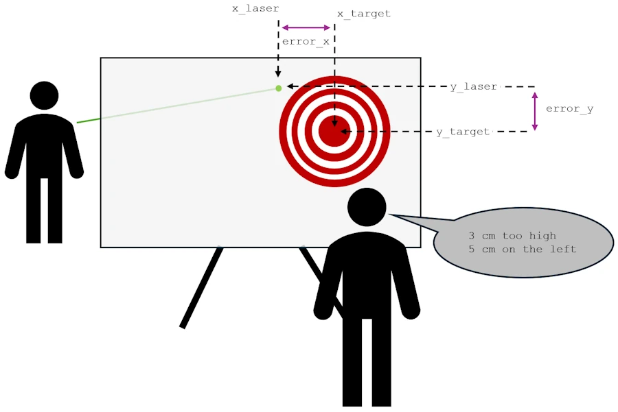
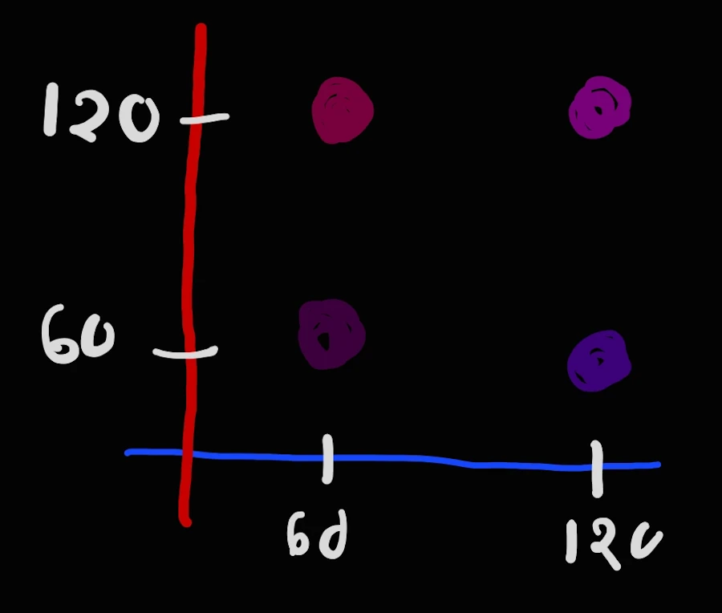
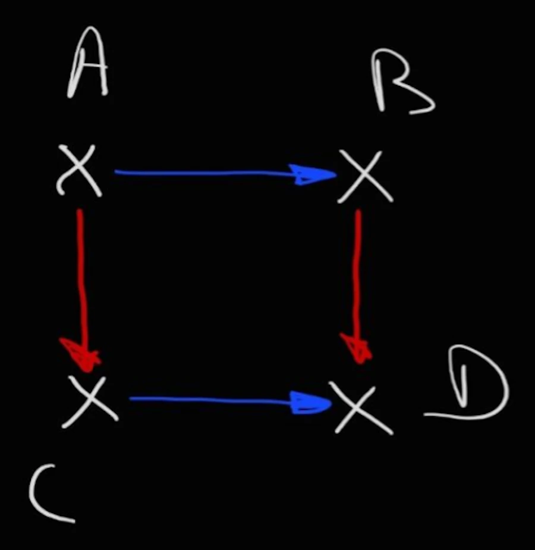
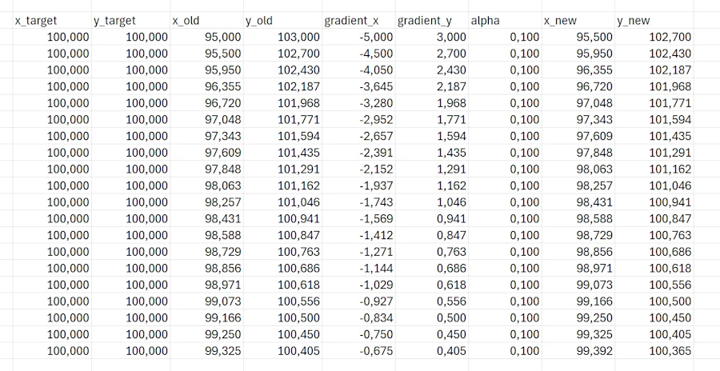
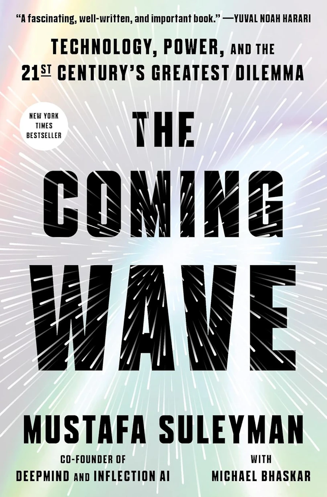

# Understanding Gradient Descent in 2D
{: .no_toc }

We continue our introduction to the gradient descent but with a 2D model.
{: .lead }


<!-- <h2 align="center">
<span style="color:orange"><b> 🚧 This post is under construction 🚧</b></span>
</h2> -->


## TL;DR
{: .no_toc }

* The cost function is now a function of 2 independent variables: $$C= f(error\_x, error\_y)$$
* Independence of the variables is crucial
* This is what allow us to evaluate the total variation of the cost function as the sum of each variation of the cost function along each dimension
* Along each dimension we apply what we learnt in [Episode 1](): where we discuss the gradient descent in 1D


<div align="center">
<br/>
<span>Gradient Descent in 2D.</span>
</div>


<!-- ###################################################################### -->
<!-- ###################################################################### -->
<!-- ###################################################################### -->


## Table of Contents
{: .no_toc .text-delta}
- TOC
{:toc}


<!-- ###################################################################### -->
<!-- ###################################################################### -->
<!-- ###################################################################### -->


## Second version of our Laser Pointer Game

This Episode follows [this one]() and I strongly recommend you read it before to read this one.

The setup is similar to the previous one. Again, you do not know where is the target on the screen and you do not know the distance between you and the target. This time you can modify the $$y$$ and the $$x$$ of the laser point on the screen. Finally your friend tells you the two errors : "x centimeters too high and y centimeters on the left"

<div align="center">
<br/>
<span>Gradient Descent in 2D.</span>
</div>


<!-- ###################################################################### -->
<!-- ###################################################################### -->
<!-- ###################################################################### -->


## The Cost Function

In this context, one way to evaluate the cost function could be: $$C = \sqrt{error\_x^2 + error\_y^2}$$

Where:

- On the y-axis we have $$error\_y = y\_laser - y\_target$$
- And on the x-axis we have $$error\_x = x\_laser - x\_target$$

Why? In fact, when one think about the situation he could imagine that a laser dot is a dot in a Cartesian coordinates system:

<div align="center">
<br/>
<!-- <span>Gradient Descent in 2D.</span> -->
</div>

Based on what we learnt in [Epsiode 1](), the lost function uses square so that errors are always cumulated. Here it also uses a square root so I'm not sure large errors yield larger penalties but this is what we have so far.

As we will see later this cost function is way much too complicated but let's start with what we have...

Do you remember the song?
 * error ➡️ cost(error) ➡️ derivative ➡️ $$y_2 = y_1 - \alpha \cdot \text{grad}$$

We have a cost function so, now, we need the expression of the derivative...

***Wait, wait, wait… Now things are getting way more complicated — we’ve got two variables! Before, it was easy. It even takes me back to when I was in high school and I met Cindy… but here, 2 variables...***


You’re missing **one key point**: these variables are **independent**. It’s not like saying "I ate 8 burgers last night" (`variable_1 = 8`) and "this morning I gained 2.5 kg" (`variable_2 = 2.5`). Those two aren’t independent — there’s a clear cause-and-effect relationship.

Now think about truly independent variables, like colors. You can’t describe a certain shade of blue if all you have is red. And the same goes for trying to express how red something is while only having blue available.

But if you *do* have both variables — blue and red — you can create an infinite number of purples by mixing $$x$$ amount of blue with $$y$$ amount of red. Just take a look below:

<div align="center">
<br/>
<span>Above the scales in blue and red go from 0 to 255.</span>
</div>

Now we can draw/specify an infinite number of cost in the plan using the two independent variables: $$err\_x$$ and $$err\_y$$

<div align="center">
<br/>
<!-- <span>Gradient Descent in 2D.</span> -->
</div>

Furthermore, we can change the intensity of one of the two variables independently of the other and see the effect on the cost error. In the "figure" above, imagine $$err\_x$$ remains constant while $$err\_y$$ increase. The red vector would be horizontal at the beginning when $$err\_y$$ equal 0 and at 45°, at the end, when the magnitude or $$err\_y$$ is equal to the magnitude of $$err\_x$$. This is exactly what happens when you mixt more and more red in a fixed quantity of blue.

Why is it so important? Simply because we can then divide and conquer. We can say that the variation of the cost function $$C$$ is equal to the sum of cost function when $$error\_x$$ vary while $$error\_y$$ remains constant, plus the variation of the cost function when $$error\_y$$ vary and $$error\_x$$ remains constant.

This is similar to say to go from from A to D I can go from A to B then from B to D or from A to C then from C to D.

<div align="center">
<br/>
<!-- <span>Gradient Descent in 2D.</span> -->
</div>


We had : $$C = \sqrt{error\_x^2 + error\_y^2}$$

**Case 1:** $$error\_x$$ vary and $$error\_y$$ remains constant

$$\begin{aligned}
C & = \sqrt{error\_x^2 + error\_y^2} \\
C & = \sqrt{error\_x^2 + k} \\
\frac{\partial C}{\partial error\_x} & = \frac{1}{2} \cdot  (error\_x^2 + k)^{-\frac{1}{2}} (2 \cdot error\_x) \\
\frac{\partial C}{\partial error\_x} & = \frac{error\_x}{\sqrt{error\_x^2 + k}} \\
\frac{\partial C}{\partial error\_x} & = \frac{error\_x}{\sqrt{error\_x^2 + {error\_y}^2}} \\
\frac{\partial C}{\partial error\_x} & = \frac{error\_x}{C}
\end{aligned}$$


* Line 2: if $$error\_y$$ is constant, then $${error\_y}^2$$ is constant and I call it $$k$$.
* Line 3: when a variable function ($$C$$, the cost function here) is made of more thant one variable, mathematicians prefer to use the partial derivative notation $$\frac{\partial f}{\partial x}$$ to express the fact that we look at the variation of $$f$$ when $$x$$ is the sole variable that change and all the others variables remains constant. This is the rate of change of $$f$$ when only $$x$$ vary.
* Line 6: remember that $$C = \sqrt{error\_x^2 + error\_y^2}$$


**Case 2:** $$error\_y$$ vary and $$error\_x$$ remains constant
Due to the symmetry of $$C$$ expression it comes

$$
\frac{\partial C}{\partial error\_y} = \frac{error\_y}{C}
$$


<!-- ###################################################################### -->
<!-- ###################################################################### -->
<!-- ###################################################################### -->

## Simpler Cost Function


***Could we simplify the previous calculations?***

Yes we can. Remember, what we said in [Episode 1](): *The cost function is NOT just a fancy name for error. It's our carefully designed measure of "wrongness" that is perfectly tailored for an algorithm to efficiently minimize it.* So here, instead of:

$$C = \sqrt{error\_x^2 + error\_y^2}$$

We can decide that:

$$C = \frac{1}{2} \cdot ({error\_x}^2 + {error\_y}^2)$$

Because then, calculate the derivative of the cost function $$C$$ with respect to one of its component ($$error\_x$$ for example) is much faster and easier. It comes:

$$\begin{aligned}
\frac{\partial C}{\partial error\_x} = {error\_x} \\
\frac{\partial C}{\partial error\_y} = {error\_y}
\end{aligned}$$


<!-- ###################################################################### -->

### Let's Run the Simulation by hand
{: .no_toc }

As you will see, the process is similar to what we did in [Episode 1]() but here we run the calculation for each independent dimension.

Let's say:
* The target is at $$x\_target = 100$$ cm and $$y\_target = 100$$ cm
* Your first guess is $$x\_target = 95$$ cm and $$y\_laser = 103$$ cm
* We choose a learning rate $$\alpha = 0.1$$

**Step 1:**
* error_x = 95 - 100 = -5 cm
* gradient_x = error_x = -5
* Update: $$x\_laser\_new = x\_laser\_old - \alpha \cdot gradient\_x = 95 - 0.1 \cdot (-5) = 95 + 0.5 = 95.5$$ cm
* error_y = 103 - 100 = 3 cm
* gradient_y = error_y = 3
* Update: $$y\_laser\_new = y\_laser\_old - \alpha \cdot gradient\_y = 103 - 0.1 \cdot (3) = 103 - 0.3 = 102.7$$ cm


**Step 2:**
* error_x = 95.5 - 100 = -4.5 cm
* gradient_x = error_x = -4.5
* Update: $$x\_laser\_new = x\_laser\_old - \alpha \cdot gradient\_x = 95.5 - 0.1 \cdot (-4.5) = 95.5 + 0.45 = 95.95$$ cm
* error_y = 102.7 - 100 = 2.7 cm
* gradient_y = error_y = 2.7
* Update: $$y\_laser\_new = y\_laser\_old - \alpha \cdot gradient\_y = 102.7 - 0.1 \cdot (2.7) = 102.7 - 0.27 = 102.43$$ cm


<!-- ###################################################################### -->

### Let's Play with Excel
{: .no_toc }


<div align="center">
<br/>
<!-- <span>Gradient Descent in 2D.</span> -->
</div>


The Excel sheet is [here]()


<!-- ###################################################################### -->

### Let's Play with Python
{: .no_toc }

```python
import numpy as np
import matplotlib.pyplot as plt
from matplotlib.animation import FuncAnimation
from IPython.display import HTML

# Configuration
np.random.seed(42)
x_target = 100  # Target x position in cm
y_target = 100  # Target y position in cm
x_laser_init = 95  # Initial x position
y_laser_init = 103  # Initial y position
alpha = 0.1  # Learning rate
n_iterations = 50  # Number of iterations

# Initialize arrays to store the trajectory
x_history = [x_laser_init]
y_history = [y_laser_init]
cost_history = []

# Current position
x_laser = x_laser_init
y_laser = y_laser_init

# Gradient descent iterations
print("Starting Gradient Descent in 2D\n")
print(f"Target: ({x_target}, {y_target})")
print(f"Initial position: ({x_laser:.2f}, {y_laser:.2f})\n")

for iteration in range(n_iterations):
    # Calculate errors
    error_x = x_laser - x_target
    error_y = y_laser - y_target

    # Calculate cost
    cost = 0.5 * (error_x**2 + error_y**2)
    cost_history.append(cost)

    # Calculate gradients (partial derivatives)
    gradient_x = error_x
    gradient_y = error_y

    # Update positions
    x_laser_new = x_laser - alpha * gradient_x
    y_laser_new = y_laser - alpha * gradient_y

    # Store history
    x_history.append(x_laser_new)
    y_history.append(y_laser_new)

    # Print every 10 iterations
    if iteration % 10 == 0:
        print(f"Iteration {iteration}:")
        print(f"  Position: ({x_laser:.4f}, {y_laser:.4f})")
        print(f"  Error: ({error_x:.4f}, {error_y:.4f})")
        print(f"  Cost: {cost:.4f}\n")

    # Update for next iteration
    x_laser = x_laser_new
    y_laser = y_laser_new

print(f"Final position: ({x_laser:.4f}, {y_laser:.4f})")
print(f"Final cost: {cost_history[-1]:.6f}")

# Visualization
fig, axes = plt.subplots(1, 3, figsize=(18, 5))

# Plot 1: 2D trajectory
ax1 = axes[0]
ax1.plot(x_history, y_history, 'b-o', markersize=4, linewidth=1, label='Laser path')
ax1.plot(x_target, y_target, 'r*', markersize=20, label='Target')
ax1.plot(x_history[0], y_history[0], 'go', markersize=10, label='Start')
ax1.plot(x_history[-1], y_history[-1], 'mo', markersize=10, label='End')
ax1.set_xlabel('X position (cm)', fontsize=12)
ax1.set_ylabel('Y position (cm)', fontsize=12)
ax1.set_title('2D Gradient Descent Trajectory', fontsize=14, fontweight='bold')
ax1.grid(True, alpha=0.3)
ax1.legend()
ax1.axis('equal')

# Add arrows to show direction
# for i in range(0, len(x_history)-1, 5):
#     dx = x_history[i+1] - x_history[i]
#     dy = y_history[i+1] - y_history[i]
#     ax1.arrow(x_history[i], y_history[i], dx, dy,
#               head_width=0.5, head_length=0.3, fc='blue', ec='blue', alpha=0.5)

# Plot 2: Cost function over iterations
ax2 = axes[1]
ax2.plot(cost_history, 'r-', linewidth=2)
ax2.set_xlabel('Iteration', fontsize=12)
ax2.set_ylabel('Cost', fontsize=12)
ax2.set_title('Cost Function Decrease', fontsize=14, fontweight='bold')
ax2.grid(True, alpha=0.3)
ax2.set_yscale('log')

# Plot 3: X and Y convergence
ax3 = axes[2]
ax3.plot(x_history, 'b-', linewidth=2, label='X position')
ax3.plot(y_history, 'g-', linewidth=2, label='Y position')
ax3.axhline(y=x_target, color='b', linestyle='--', alpha=0.5, label='X target')
ax3.axhline(y=y_target, color='g', linestyle='--', alpha=0.5, label='Y target')
ax3.set_xlabel('Iteration', fontsize=12)
ax3.set_ylabel('Position (cm)', fontsize=12)
ax3.set_title('X and Y Convergence', fontsize=14, fontweight='bold')
ax3.grid(True, alpha=0.3)
ax3.legend()

plt.tight_layout()
plt.show()

# Create a 3D visualization of the cost surface
fig = plt.figure(figsize=(12, 10))
ax = fig.add_subplot(111, projection='3d')

# Create a mesh grid for the cost surface
x_range = np.linspace(90, 110, 100)
y_range = np.linspace(90, 110, 100)
X, Y = np.meshgrid(x_range, y_range)

# Calculate cost for each point
Z = 0.5 * ((X - x_target)**2 + (Y - y_target)**2)

# Plot the surface
surf = ax.plot_surface(X, Y, Z, cmap='viridis', alpha=0.6, edgecolor='none')

# Plot the gradient descent path
costs_trajectory = [0.5 * ((x - x_target)**2 + (y - y_target)**2)
                    for x, y in zip(x_history, y_history)]
ax.plot(x_history, y_history, costs_trajectory, 'r-o', markersize=4,
        linewidth=2, label='Gradient descent path')

# Mark start and end points
ax.scatter([x_history[0]], [y_history[0]], [costs_trajectory[0]],
           color='green', s=100, label='Start', marker='o')
ax.scatter([x_history[-1]], [y_history[-1]], [costs_trajectory[-1]],
           color='magenta', s=100, label='End', marker='o')
ax.scatter([x_target], [y_target], [0],
           color='red', s=200, label='Target (minimum)', marker='*')

ax.set_xlabel('X position (cm)', fontsize=11)
ax.set_ylabel('Y position (cm)', fontsize=11)
ax.set_zlabel('Cost', fontsize=11)
ax.set_title('Cost Surface with Gradient Descent Path', fontsize=14, fontweight='bold')
ax.legend()

# Add colorbar
fig.colorbar(surf, ax=ax, shrink=0.5, aspect=5)

plt.tight_layout()
plt.show()

# Print summary statistics
print("\n" + "="*50)
print("SUMMARY STATISTICS")
print("="*50)
print(f"Number of iterations: {n_iterations}")
print(f"Learning rate (α): {alpha}")
print(f"Initial distance from target: {np.sqrt((x_history[0]-x_target)**2 + (y_history[0]-y_target)**2):.4f} cm")
print(f"Final distance from target: {np.sqrt((x_history[-1]-x_target)**2 + (y_history[-1]-y_target)**2):.4f} cm")
print(f"Cost reduction: {cost_history[0]:.4f} → {cost_history[-1]:.6f}")
print(f"Cost reduction percentage: {(1 - cost_history[-1]/cost_history[0])*100:.2f}%")
```

When looking at the first plot on the left hand side below, keep in mind that on the x-axis we move from 95 to 100 in 50 steps while on the y-axis we are moving from 103 to 100 is 50 step as well. This explain the "slope" of the blue line.

<div align="center">
<br/>
<!-- <span>Gradient Descent in 2D.</span> -->
</div>

In the figure below, when we are at error_x=95 and error_y=103 our "altitude" (cost function) is $$17 = \frac{1}{2} ((95-100)^2 + (103-100)^2)$$. Then we go downhill to the valley at the spot (100, 100) where our final altitude (cost) is 0.

The 3D map is very symmetric. Indeed, if we only speak about the initial altitude, there are 4 ways to get there : (95, 103), (105, 103), (95, 106) and (105, 106).

<div align="center">
<br/>
<!-- <span>Gradient Descent in 2D.</span> -->
</div>


<!-- ###################################################################### -->
<!-- ###################################################################### -->
<!-- ###################################################################### -->

## Summary

* **Independent variables**: In 2D gradient descent, we work with two independent variables ($$error\_x$$ and $$error\_y$$) that can be adjusted separately, similar to mixing red and blue to create different shades of purple.

* **Partial derivatives**: When dealing with multiple variables, we use partial derivatives ($$\frac{\partial C}{\partial error\_x}$$ and $$\frac{\partial C}{\partial error\_y}$$) to measure how the cost function changes when only one variable varies while others remain constant.

* **Divide and conquer**: The key insight is that we can treat each dimension independently - we calculate the gradient for each variable separately and update them using the same rule: $$new\_value = old\_value - \alpha \cdot gradient$$.

* **Simplified cost function**: Instead of using $$C = \sqrt{error\_x^2 + error\_y^2}$$, we choose $$C = \frac{1}{2} \cdot ({error\_x}^2 + {error\_y}^2)$$ because it yields much simpler derivatives: $$\frac{\partial C}{\partial error\_x} = error\_x$$ and $$\frac{\partial C}{\partial error\_y} = error\_y$$.

* **Simultaneous convergence**: Both dimensions converge toward the target simultaneously but at their own pace, with each step moving the laser pointer closer to the target in a diagonal trajectory through the 2D space.


<!-- ###################################################################### -->
<!-- ###################################################################### -->
<!-- ###################################################################### -->

## Q&A - Checking for understanding

* Why do we say that $$error\_x$$ and $$error\_y$$ are independent variables? Give an example from everyday life of two variables that are NOT independent.

* In the cost function $$C = \frac{1}{2} \cdot ({error\_x}^2 + {error\_y}^2)$$, what would happen if we removed the $$\frac{1}{2}$$ factor? Would gradient descent still work? Why or why not?

* If your laser pointer starts at position (95, 103) and the target is at (100, 100) with a learning rate $$\alpha = 0.2$$, what would be the position after the first iteration? Play with the Excel sheet.

* Explain in your own words what a partial derivative ($$\frac{\partial C}{\partial error\_x}$$) represents. How is it different from a regular derivative?

* Imagine the learning rate $$\alpha$$ is too large (e.g., $$\alpha = 2.0$$). What problem might occur during the gradient descent process in 2D? Describe what the trajectory of the laser pointer might look like.


<!-- ###################################################################### -->
<!-- ###################################################################### -->
<!-- ###################################################################### -->

## What is Next?

* [Part 1](): where we discuss the gradient descent in 1D
* [Part 2](): where we discuss the gradient descent in 2D
* [Part 3](): where we generalize the gradient descent to N dimensions


In the mean time you can read [this book](https://www.amazon.fr/Coming-Wave-Technology-Twenty-first-Centurys/dp/0593728173).

<div align="center">
<br/>
<span>The Coming Wave</span>
</div>


<!-- ###################################################################### -->
<!-- ###################################################################### -->
<!-- ###################################################################### -->

## Webliography
* [JupyterLab](https://jupyter.org/try-jupyter/lab/). Where you can past the scripts above.
* [The Coming Wave](https://www.amazon.fr/Coming-Wave-Technology-Twenty-first-Centurys/dp/0593728173).
* You’re welcome to share [comments or suggestions](https://github.com/40tude/40tude.github.io/discussions) on GitHub to help improve this article.
