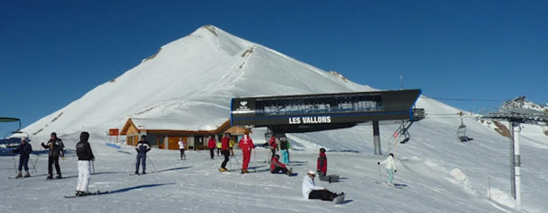
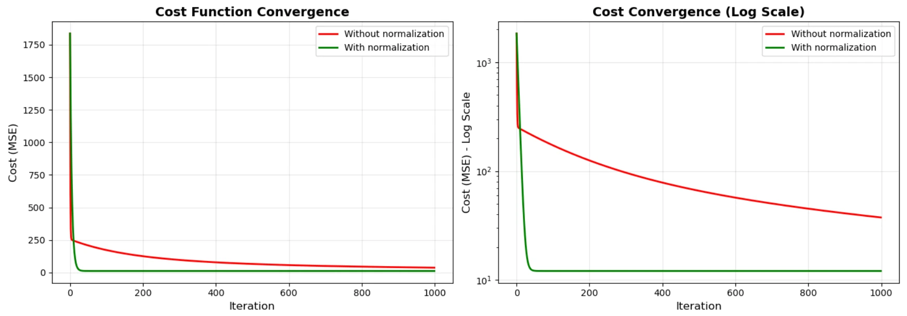
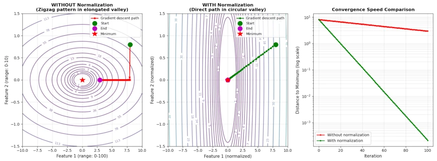
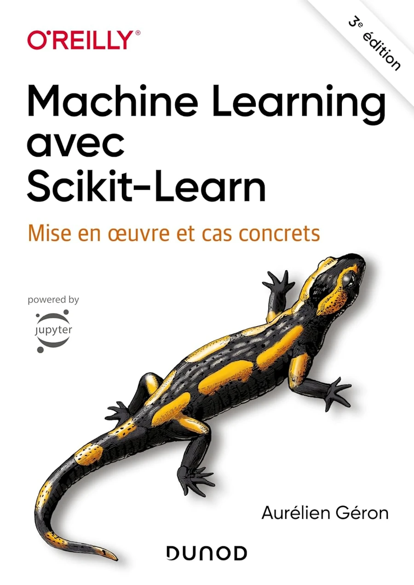

# Understanding Gradient Descent in N Dimensions
{: .no_toc }

Generalizing to real-world machine learning problems
{: .lead }


<!-- <h2 align="center">
<span style="color:orange"><b> 🚧 This post is under construction 🚧</b></span>
</h2> -->


## TL;DR
{: .no_toc }

* The gradient is a vector pointing "uphill" in N-dimensional space
* Each dimension is updated independently using partial derivatives
* **Important.** Features must be on similar scales or one will dominate
* Feature normalization ensures all parameters contribute fairly
* The math generalizes beautifully: same principle, just more dimensions


<div align="center">
<br/>
<span>Gradient Descent in ND.</span>
</div>


<!-- ###################################################################### -->
<!-- ###################################################################### -->
<!-- ###################################################################### -->

## Table of Contents
{: .no_toc .text-delta}
- TOC
{:toc}


<!-- ###################################################################### -->
<!-- ###################################################################### -->
<!-- ###################################################################### -->

## Introduction

You know what is cool with maths? Sometimes, when you don't understand something in high dimensions, let's say 3 or 4... Just go back to 2 or even 1D. Then, when you feel OK, when you truly understand what is going on, be convinced that you've understood everything. Going from 2D to 42D is just... more of the same.

Have you ever wondered what life would be like in 2D? Watch this:

<div align="center">
<iframe width="560" height="315" src="https://www.youtube.com/embed/avMX-Zft7K4?si=v2l0VbpP00yiE0zl" title="YouTube video player" frameborder="0" allow="accelerometer; autoplay; clipboard-write; encrypted-media; gyroscope; picture-in-picture; web-share" referrerpolicy="strict-origin-when-cross-origin" allowfullscreen></iframe>
</div>

Let's see if we can generalize to N dimensions in this post but first, let's take a step back and look at what we've accomplished so far.


<!-- ###################################################################### -->

### What We've Been Doing Until Now
{: .no_toc }

In [Part 1](), we pointed a laser at a target. We had **one parameter** to adjust: the vertical position $$y\_laser$$. Our goal? Make the error $$error = y\_laser - y\_target$$ equal to zero.


In [Part 2](), we controlled the laser in **two dimensions**: both $$x\_laser$$ and $$y\_laser$$. Same principle, just more parameters to adjust.

In both cases, we were **directly adjusting what we wanted to fix**. The laser position was wrong, so we adjusted... the laser position. Simple.


<!-- ###################################################################### -->

### The Shift: From Adjusting Positions to Building Models
{: .no_toc }

But now, we're going to make a quantum leap. We're going to use gradient descent for what it was really designed for: **machine learning**. Here's the key difference:

**Before (laser pointer)**
- We adjusted the **thing itself** (laser position)
- To match a **known target** (bullseye on the wall)
- Direct relationship: move laser → reduce error

**Now (machine learning)**
- We adjust **model parameters** (weights $$w_1, w_2, ..., w_N$$)
- To predict **unknown targets** from **known inputs**
- Indirect relationship: adjust weights ➡️ change predictions ➡️ reduce error

Let's make this concrete with an example. Imagine... Imagine we want to predict a student's final exam score. We don't directly adjust the exam score—that would be cheating. Instead, we build a **model**:

$$predicted\_score = w_1 \times study\_hours + w_2 \times sleep\_hours + w_3 \times classes\_missed + w_4 \times previous\_score$$

The **inputs** (study_hours, sleep_hours, etc.) are what we observe. The **weights** ($$w_1, w_2, w_3, w_4$$) are what we adjust. The **prediction** is what our model outputs.

Now, for a student who studied 10 hours, slept 7 hours, missed 2 classes, and scored 75 on the previous exam, our model might predict 82. But the actual score, the observation, was 85. There's an error: $$error = 82 - 85 = -3$$.

**Here's the magic**: We don't adjust the student's sleep or study hours—those are fixed, observed facts. Instead, we adjust the **weights** of our model to make better predictions next time.

This is what machine learning is: **finding the right weights** so your model makes accurate predictions. More precisely:
* Fix your target in term of model's performance first
* Get a set of observations (this may involve cleaning, deduplicating, features engineering...)
* Select the number of features. You may keep all the features (large number of dimensions) or keep only the most relevant (study_hours, sleep_hours, etc.)
* Train the model = adjust the weights of each feature to make accurate predictions on 80% of the observations
* Check the behavior of the model on unseen observations (the remaining 20%)


<!-- ###################################################################### -->

### Same Math, Different Interpretation
{: .no_toc }

The beautiful thing? The mathematics we learned in Episodes [1]() and [2]() **apply exactly the same way**:

- In the laser game, we adjusted $$y\_laser$$ to minimize $$(y\_laser - y\_target)^2$$
- In machine learning, we adjust $$w_1, w_2, ..., w_N$$ to minimize $$(prediction - actual)^2$$

Same gradient descent algorithm. Same update rule: $$param\_new = param\_old - \alpha \times gradient$$.

The only difference? Now we have **many parameters** (weights) instead of just one or two positions. And that's exactly what this episode is about: scaling gradient descent to N dimensions.


<!-- ###################################################################### -->

### What we'll Learn
{: .no_toc }

In this third, and last, Episode, we'll cover:

1. How the gradient becomes a **vector** in N-dimensional space
2. Why **feature scaling** is absolutely critical (spoiler: without it, everything breaks)
3. A complete example: predicting student exam scores with real Python code
4. The "zigzag problem" and how normalization solves it
5. Clean vector notation that prepares you for advanced books

By the end, you'll understand how gradient descent powers everything from linear regression to deep neural networks. Same principle, just more dimensions.

<!-- This post will give you the solid foundations you need before diving into more advanced books like Aurélien Géron's "Hands-On Machine Learning with Scikit-Learn, Keras, and TensorFlow." Think of this as your launchpad into real machine learning. -->

Ready? Let's go.


<!-- ###################################################################### -->
<!-- ###################################################################### -->
<!-- ###################################################################### -->

## The Pattern We've Learnt

Let's recap the previous Episodes:

**In Episode 1 (1D)**, we had:
- One variable: $$y\_laser$$
- One error: $$error = y\_laser - y\_target$$
- Cost function: $$C = error^2$$
- One gradient: $$\frac{dC}{dy\_laser} = 2 \cdot error$$
- Update rule: $$y\_new = y\_old - \alpha \cdot \text{gradient}$$

**In Episode 2 (2D)**, we had:
- Two independent variables: $$x\_laser$$ and $$y\_laser$$
- Two errors: $$error\_x$$ and $$error\_y$$
- Cost function: $$C = \frac{1}{2}(error\_x^2 + error\_y^2)$$
- Two gradients: $$\frac{\partial C}{\partial error\_x}$$ and $$\frac{\partial C}{\partial error\_y}$$
- Two update rules: one for x, one for y

Do you see the pattern? **Each dimension is independent.** We calculate the gradient for each variable separately, and we update each one using the exact same formula.

In N dimensions? Same thing. Just... more of them but again, trust in you and don't try to draw a 42D spaces on a 2D sheet of paper.


<!-- ###################################################################### -->
<!-- ###################################################################### -->
<!-- ###################################################################### -->

## What Really Is a Gradient?

Before we jump to N dimensions, let's clarify this key concept.

In 1D, the gradient was just a number telling us "how steep is the slope?" Positive means the function goes up, negative means it goes down.

In 2D, the gradient became a **vector** with two components:

$$\nabla C = \begin{bmatrix} \frac{\partial C}{\partial x} \\ \frac{\partial C}{\partial y} \end{bmatrix}$$

Don't start to grumble. You already know the word gradient. So now, when you read $$\nabla C$$ you say "gradient of C" or "grad C". And yes, vectors are written vertically. Each line correspond to one dimension. This vector points in the direction of **steepest ascent**. It's like a compass that always points "uphill". Do you remember the 1D Tilt-O-Meter? Here is an example of a 2D version:

<div align="center">
<br/>
<span>A 2D version of the Tilt-O_Meter.</span>
</div>

Since we want to go **downhill** (to minimize the cost function), we move in the **opposite direction**: $$-\nabla C$$.

In N dimensions? The gradient is still a vector but it has N components:

$$\nabla C = \begin{bmatrix} \frac{\partial C}{\partial w_1} \\ \frac{\partial C}{\partial w_2} \\ \vdots \\ \frac{\partial C}{\partial w_N} \end{bmatrix}$$

Where $$w_1, w_2, ..., w_N$$ are our N parameters (weights).

**Key insight**: The gradient is a **direction** in N-dimensional space. It tells us which way to adjust all N parameters simultaneously to reduce the cost most effectively.


Imagine... Imagine you're in the Alps, in Serre Chevalier. The name of the resort is important—otherwise this example doesn't work. You and your snowboard are at the top of the "Cucumelle" slope (a red run). Don't ask me why, but you're looking for the path with the steepest descent. Believe it or not, you're mentally computing the gradient at the spot where you're sitting. You won't traverse the slope from left to right because in that case you'd be almost perpendicular to the fall line and your speed would be limited. No—instead, you plan to point the nose of your board straight downhill, go like that for 200 meters, then carve to the right... You get the idea.

Have you ever watched a drop of water in a sink? It always follows the path where the gradient is strongest. Your are doing exactly the same thing but on the snow. Additionally you may visit the local hospital later today but this is a bonus.

<div align="center">
<br/>
<span>The start of Cucumelle (on the right) at Serre Chevalier ski resort.</span>
</div>


<!-- ###################################################################### -->
<!-- ###################################################################### -->
<!-- ###################################################################### -->

## N Dimensions = N Independent Dials

Now, imagine you're standing in front of a complex control panel with N dials. Each dial controls one aspect of a machine's output. Your job? Adjust all N dials until the machine produces the perfect output.


<div align="center">
<br/>
<span>N independent parameters to optimize.</span>
</div>

Here's the beautiful part: **each dial is independent**. Turning dial #3 doesn't magically change what dial #7 does. They all contribute to the final output independently.

Mathematically, if we have N parameters $$w_1, w_2, ..., w_N$$, our prediction is:

$$\hat{y} = w_1 \cdot x_1 + w_2 \cdot x_2 + ... + w_N \cdot x_N$$

There is a "hat" and you read "y-hat" to distinguish the prediction ($$\hat{y}$$) from the observation ($$y$$)

In a more compact notation we write:

$$\hat{y} = \sum_{i=1}^{N} w_i \cdot x_i$$

**STOP!**. Did you *look at* the previous formula or did you *read it*? Nothing personal but I don't trust you. Could you please, give ma a favor? Say it loud : "$$y$$ hat, the value predicted by our model, is the sum for $$i$$ equal 1 to $$N$$ of each feature's value $$x_i$$ multiplied by the value of the ith knob $$w_i$$".

The error is now:

$$error = \hat{y} - y\_true$$

And our cost function, using the squared error we already used, becomes:

$$C = \frac{1}{2} \cdot error^2 = \frac{1}{2} \left( \sum_{i=1}^{N} w_i \cdot x_i - y\_true \right)^2$$

Again... Do not start to grumble. Remember the Alamo and remember what we had in 2D. It looked like that:

<div align="center">
<br/>
<!-- <span>N independent parameters to optimize.</span> -->
</div>

Then we said that expression of $$C$$ with the square root was too complicated and we wrote : $$C = \frac{1}{2} \cdot ({error\_x}^2 + {error\_y}^2)$$. What you see above is nothing more than the same expression but in N rather than 2 dimensions.

Again, don't look at, read the math formula and said it loud as if you were explaining it to your invisible friend (good luck if your mother or wife rush into the room and ask you "what's going on here!")

To minimize this cost in N dimensions, we need to compute the gradient with respect to **each** parameter $$w_i$$ :

$$\frac{\partial C}{\partial w_i} = error \cdot x_i$$

And then update each parameter:

$$w_i\_new = w_i\_old - \alpha \cdot \frac{\partial C}{\partial w_i}$$

See? It's exactly what we did in 1D and 2D. Just... repeated N times.


<!-- ###################################################################### -->
<!-- ###################################################################### -->
<!-- ###################################################################### -->

## The Scale Problem

Now, here's where things get tricky. And this is **crucial** for real-world applications.

Imagine we have these four features:
- Study hours: values between 0 and 20
- Sleep hours: values between 4 and 10
- Classes missed: values between 0 and 15
- Previous exam score: values between 0 and 100

Let's say we are trying to predict a student's final exam score using this equation:

$$\text{exam_score} = w_1 \cdot \text{study} + w_2 \cdot \text{sleep} + w_3 \cdot \text{missed} + w_4 \cdot \text{previous}$$

Now, suppose the student studied 10 hours, slept 7 hours, missed 2 classes, and scored 75 on the previous exam.

If all weights start at 1.0, the prediction is:

$$\hat{y} = 1 \cdot 10 + 1 \cdot 7 + 1 \cdot 2 + 1 \cdot 75 = 94$$

**Do you see the problem?** The "previous exam score" contributes $$\frac{75}{94}$$ to the prediction, while "study hours" only contributes for $$\frac{10}{94}$$. The gradient will be dominated by $$w_4$$ because $$x_4$$ is so much larger!

Let's see what happens to the gradients:

$$\frac{\partial C}{\partial w_1} = error \cdot 10$$

$$\frac{\partial C}{\partial w_4} = error \cdot 75$$

The gradient for $$w_4$$ is **7.5 times larger** than for $$w_1$$, not because $$w_4$$ is more important, but simply because the feature values are on **different scales**.

This causes a nasty problem: gradient descent will spend most of its effort adjusting $$w\_4$$ and will barely touch $$w\_1$$, $$w\_2$$, and $$w\_3$$.

<!-- <div align="center">
<br/>
<span>Without normalization, one dimension dominates.</span>
</div> -->

Visually, imagine trying to navigate down a long, narrow valley. If the scales are different, gradient descent will "**zigzag**" down the valley instead of taking the direct path. It's inefficient and slow.


<!-- ###################################################################### -->

### Let's Play with Python
{: .no_toc }

<!-- Let me show share another visualization that really drives home why normalization matters. -->

Imagine we have just two features, but one ranges from 0 to 100 and the other from 0 to 10. Our cost function forms a long, narrow valley:


```python
import numpy as np
import matplotlib.pyplot as plt
from matplotlib.patches import Ellipse

# Set random seed for reproducibility
np.random.seed(42)

# Define a simple quadratic cost function with different scales
# C(x, y) = 0.5 * (a*x^2 + b*y^2)
# where a << b creates an elongated valley

def cost_function(x, y, a=1, b=100):
    """
    Cost function with different scales for x and y.

    Args:
        x, y: coordinates
        a, b: scaling factors (b >> a creates elongated valley)

    Returns:
        cost value
    """
    return 0.5 * (a * x**2 + b * y**2)

def gradient(x, y, a=1, b=100):
    """
    Gradient of the cost function.

    Returns:
        (grad_x, grad_y): gradient components
    """
    grad_x = a * x
    grad_y = b * y
    return grad_x, grad_y

def gradient_descent(x_start, y_start, learning_rate, n_iterations, a=1, b=100):
    """
    Perform gradient descent and track the path.

    Args:
        x_start, y_start: starting position
        learning_rate: step size
        n_iterations: number of steps
        a, b: cost function parameters

    Returns:
        x_history, y_history: trajectory of gradient descent
    """
    x = x_start
    y = y_start

    x_history = [x]
    y_history = [y]

    for i in range(n_iterations):
        # Compute gradient
        grad_x, grad_y = gradient(x, y, a, b)

        # Update position
        x = x - learning_rate * grad_x
        y = y - learning_rate * grad_y

        # Store history
        x_history.append(x)
        y_history.append(y)

    return x_history, y_history

# Parameters for unnormalized case (creates zigzag)
a_unnorm = 1     # Small coefficient for x
b_unnorm = 100   # Large coefficient for y (creates elongated valley)

# Starting point
x_start = 8.0
y_start = 0.8

# Gradient descent WITHOUT normalization
learning_rate_unnorm = 0.01  # Small learning rate required
n_iterations = 100

x_unnorm, y_unnorm = gradient_descent(
    x_start, y_start, learning_rate_unnorm, n_iterations, a_unnorm, b_unnorm
)

# Gradient descent WITH normalization (balanced scales)
a_norm = 1
b_norm = 1  # Same scale as a

learning_rate_norm = 0.1  # Can use larger learning rate
x_norm, y_norm = gradient_descent(
    x_start, y_start, learning_rate_norm, n_iterations, a_norm, b_norm
)

# Create visualization
fig = plt.figure(figsize=(16, 6))

# ============================================================================
# Plot 1: WITHOUT normalization (zigzag pattern)
# ============================================================================
ax1 = fig.add_subplot(1, 3, 1)

# Create contour plot
x_range = np.linspace(-10, 10, 400)
y_range = np.linspace(-1.5, 1.5, 400)
X, Y = np.meshgrid(x_range, y_range)
Z_unnorm = cost_function(X, Y, a_unnorm, b_unnorm)

# Plot contours
levels = np.logspace(0, 3, 20)
contour = ax1.contour(X, Y, Z_unnorm, levels=levels, cmap='viridis', alpha=0.6)
ax1.clabel(contour, inline=True, fontsize=8, fmt='%1.0f')

# Plot gradient descent path
ax1.plot(x_unnorm, y_unnorm, 'r-o', linewidth=2, markersize=4,
         label='Gradient descent path', zorder=10)

# Mark start and end
ax1.plot(x_unnorm[0], y_unnorm[0], 'go', markersize=12,
         label='Start', zorder=11)
ax1.plot(x_unnorm[-1], y_unnorm[-1], 'mo', markersize=12,
         label='End', zorder=11)
ax1.plot(0, 0, 'r*', markersize=15, label='Minimum', zorder=11)

# Add arrows to show zigzag pattern
for i in range(0, min(10, len(x_unnorm)-1), 2):
    ax1.annotate('', xy=(x_unnorm[i+1], y_unnorm[i+1]),
                xytext=(x_unnorm[i], y_unnorm[i]),
                arrowprops=dict(arrowstyle='->', color='red', lw=1.5))

ax1.set_xlabel('Feature 1 (range: 0-100)', fontsize=11)
ax1.set_ylabel('Feature 2 (range: 0-10)', fontsize=11)
ax1.set_title('WITHOUT Normalization\n(Zigzag pattern in elongated valley)',
              fontsize=12, fontweight='bold')
ax1.legend(loc='upper right', fontsize=9)
ax1.grid(True, alpha=0.3)
ax1.set_xlim(-10, 10)
ax1.set_ylim(-1.5, 1.5)

# ============================================================================
# Plot 2: WITH normalization (direct path)
# ============================================================================
ax2 = fig.add_subplot(1, 3, 2)

# Create contour plot
Z_norm = cost_function(X, Y, a_norm, b_norm)

# Plot contours
levels = np.logspace(0, 2, 20)
contour = ax2.contour(X, Y, Z_norm, levels=levels, cmap='viridis', alpha=0.6)
ax2.clabel(contour, inline=True, fontsize=8, fmt='%1.0f')

# Plot gradient descent path
ax2.plot(x_norm, y_norm, 'g-o', linewidth=2, markersize=4,
         label='Gradient descent path', zorder=10)

# Mark start and end
ax2.plot(x_norm[0], y_norm[0], 'go', markersize=12,
         label='Start', zorder=11)
ax2.plot(x_norm[-1], y_norm[-1], 'mo', markersize=12,
         label='End', zorder=11)
ax2.plot(0, 0, 'r*', markersize=15, label='Minimum', zorder=11)

# Add arrows to show direct path
for i in range(0, min(5, len(x_norm)-1)):
    ax2.annotate('', xy=(x_norm[i+1], y_norm[i+1]),
                xytext=(x_norm[i], y_norm[i]),
                arrowprops=dict(arrowstyle='->', color='green', lw=1.5))

ax2.set_xlabel('Feature 1 (normalized)', fontsize=11)
ax2.set_ylabel('Feature 2 (normalized)', fontsize=11)
ax2.set_title('WITH Normalization\n(Direct path in circular valley)',
              fontsize=12, fontweight='bold')
ax2.legend(loc='upper right', fontsize=9)
ax2.grid(True, alpha=0.3)
ax2.set_xlim(-10, 10)
ax2.set_ylim(-1.5, 1.5)

# ============================================================================
# Plot 3: Convergence comparison
# ============================================================================
ax3 = fig.add_subplot(1, 3, 3)

# Calculate distance from minimum over iterations
dist_unnorm = [np.sqrt(x**2 + y**2) for x, y in zip(x_unnorm, y_unnorm)]
dist_norm = [np.sqrt(x**2 + y**2) for x, y in zip(x_norm, y_norm)]

# Calculate cost over iterations
cost_unnorm = [cost_function(x, y, a_unnorm, b_unnorm)
               for x, y in zip(x_unnorm, y_unnorm)]
cost_norm = [cost_function(x, y, a_norm, b_norm)
             for x, y in zip(x_norm, y_norm)]

# Plot distance to minimum
iterations = range(len(dist_unnorm))
ax3.semilogy(iterations, dist_unnorm, 'r-o', linewidth=2, markersize=3,
            label='Without normalization', alpha=0.8)
ax3.semilogy(iterations[:len(dist_norm)], dist_norm, 'g-o', linewidth=2,
            markersize=3, label='With normalization', alpha=0.8)

ax3.set_xlabel('Iteration', fontsize=11)
ax3.set_ylabel('Distance to Minimum (log scale)', fontsize=11)
ax3.set_title('Convergence Speed Comparison', fontsize=12, fontweight='bold')
ax3.legend(fontsize=10)
ax3.grid(True, alpha=0.3, which='both')

plt.tight_layout()
plt.show()

# ============================================================================
# Print statistics
# ============================================================================
print("=" * 70)
print("ZIGZAG PROBLEM DEMONSTRATION")
print("=" * 70)
print("\nWITHOUT NORMALIZATION:")
print(f"  Feature scales: x has coefficient {a_unnorm}, y has coefficient {b_unnorm}")
print(f"  Learning rate: {learning_rate_unnorm}")
print(f"  Starting position: ({x_start:.2f}, {y_start:.2f})")
print(f"  Distance traveled: {sum([np.sqrt((x_unnorm[i+1]-x_unnorm[i])**2 + (y_unnorm[i+1]-y_unnorm[i])**2) for i in range(len(x_unnorm)-1)]):.2f}")
print(f"  Final position: ({x_unnorm[-1]:.6f}, {y_unnorm[-1]:.6f})")
print(f"  Final distance to minimum: {dist_unnorm[-1]:.6f}")
print(f"  Iterations to converge: {len(x_unnorm)}")

print("\nWITH NORMALIZATION:")
print(f"  Feature scales: x has coefficient {a_norm}, y has coefficient {b_norm}")
print(f"  Learning rate: {learning_rate_norm}")
print(f"  Starting position: ({x_start:.2f}, {y_start:.2f})")
print(f"  Distance traveled: {sum([np.sqrt((x_norm[i+1]-x_norm[i])**2 + (y_norm[i+1]-y_norm[i])**2) for i in range(len(x_norm)-1)]):.2f}")
print(f"  Final position: ({x_norm[-1]:.6f}, {y_norm[-1]:.6f})")
print(f"  Final distance to minimum: {dist_norm[-1]:.6f}")
print(f"  Iterations to converge: {len(x_norm)}")
```

<div align="center">
<br/>
<span>Without normalization: zigzag descent. With normalization: straight path.</span>
</div>


**Without normalization**, gradient descent takes tiny steps along the narrow dimension and huge steps along the wide dimension. It zigzags down the valley, wasting time and iterations.

**With normalization**, the valley becomes circular (or at least more balanced), and gradient descent can take the direct path to the minimum.

<!-- This is exactly what happens in N dimensions—except you can't visualize it anymore! But the math is the same. -->


***OK but what is the solution to the zigzag problem?***
Feature normalization.


<!-- ###################################################################### -->
<!-- ###################################################################### -->
<!-- ###################################################################### -->

## Feature Normalization

The idea is simple: **put all features on the same scale** before training.

The most common method is called **standardization** (also known as z-score normalization):

$$x_i\_normalized = \frac{x_i - \mu_i}{\sigma_i}$$

Where:
- $$\mu_i$$ is the mean of feature $$i$$
- $$\sigma_i$$ is the standard deviation of feature $$i$$

After standardization, each feature has:
- Mean = 0
- Standard deviation = 1

This puts all features on equal footing. Now the gradients reflect the **true importance** of each feature, not just their relatives scales.

**Side Note:** Another popular method is min-max scaling where we write

$$x_i\_normalized = \frac{x_i - \min(x_i)}{\max(x_i) - \min(x_i)}$$

Sorry to insist. Do **NOT** look at the formula. Read it, explain it to yourself and say it loud. Formulas tell stories that we must learn to appreciate. Here the formula explains that it scales all features to the range [0, 1].

***Which one to use?***
Standardization is generally preferred because it handles outliers. Outliers are the guys that are very far from average. Think of Victor Wembanyama, 2.24m, in a bus of supporters. Anyway, standardization is better because it is less sensitive to the exact min/max values in our dataset.


<!-- ###################################################################### -->

### Let's play with Python
{: .no_toc }

Let's build a complete example with real code to predicting student exam scores. We'll predict final exam scores based on four features, and we'll compare gradient descent **with** and **without** feature normalization.

```python
import numpy as np
import matplotlib.pyplot as plt

# Set random seed for reproducibility
np.random.seed(42)

# Generate synthetic student data
n_students = 100

# Features with different scales
study_hours = np.random.uniform(0, 20, n_students)          # 0-20 range
sleep_hours = np.random.uniform(4, 10, n_students)          # 4-10 range
classes_missed = np.random.randint(0, 15, n_students)       # 0-15 range
previous_score = np.random.uniform(40, 100, n_students)     # 40-100 range

# True relationship (with some noise)
# exam_score = 2*study + 5*sleep - 3*missed + 0.3*previous + noise
exam_score = (2 * study_hours +
              5 * sleep_hours -
              3 * classes_missed +
              0.3 * previous_score +
              np.random.normal(0, 5, n_students))

# Combine features into a matrix
X = np.column_stack([study_hours, sleep_hours, classes_missed, previous_score])
y = exam_score

# Add bias term (column of ones)
X = np.column_stack([np.ones(n_students), X])

print("Feature ranges (before normalization):")
print(f"Study hours: [{study_hours.min():.1f}, {study_hours.max():.1f}]")
print(f"Sleep hours: [{sleep_hours.min():.1f}, {sleep_hours.max():.1f}]")
print(f"Classes missed: [{classes_missed.min()}, {classes_missed.max()}]")
print(f"Previous score: [{previous_score.min():.1f}, {previous_score.max():.1f}]")
print()

# Function to perform gradient descent
def gradient_descent(X, y, learning_rate, n_iterations):
    """
    Perform gradient descent on the dataset.

    Args:
        X: Feature matrix (n_samples, n_features)
        y: Target vector (n_samples,)
        learning_rate: Step size alpha
        n_iterations: Number of iterations

    Returns:
        weights: Final weight vector
        cost_history: Cost at each iteration
    """
    n_samples, n_features = X.shape
    weights = np.zeros(n_features)
    cost_history = []

    for iteration in range(n_iterations):
        # Make predictions
        predictions = X @ weights

        # Calculate error
        errors = predictions - y

        # Calculate cost (MSE)
        cost = (1 / (2 * n_samples)) * np.sum(errors ** 2)
        cost_history.append(cost)

        # Calculate gradient
        gradient = (1 / n_samples) * (X.T @ errors)

        # Update weights
        weights = weights - learning_rate * gradient

    return weights, cost_history


# Train WITHOUT normalization
print("=" * 60)
print("GRADIENT DESCENT WITHOUT NORMALIZATION")
print("=" * 60)

learning_rate_unnorm = 0.0001  # Need very small LR!
n_iterations = 1000

weights_unnorm, cost_unnorm = gradient_descent(
    X, y, learning_rate_unnorm, n_iterations
)

print(f"\nLearning rate: {learning_rate_unnorm}")
print(f"Final weights: {weights_unnorm}")
print(f"Initial cost: {cost_unnorm[0]:.2f}")
print(f"Final cost: {cost_unnorm[-1]:.2f}")


# Normalize features (except bias term)
X_normalized = X.copy()
X_normalized[:, 1:] = (X[:, 1:] - X[:, 1:].mean(axis=0)) / X[:, 1:].std(axis=0)

print("\n" + "=" * 60)
print("GRADIENT DESCENT WITH NORMALIZATION")
print("=" * 60)

learning_rate_norm = 0.1  # Can use much larger LR!
weights_norm, cost_norm = gradient_descent(
    X_normalized, y, learning_rate_norm, n_iterations
)

print(f"\nLearning rate: {learning_rate_norm}")
print(f"Final weights: {weights_norm}")
print(f"Initial cost: {cost_norm[0]:.2f}")
print(f"Final cost: {cost_norm[-1]:.2f}")


# Visualization
fig, axes = plt.subplots(1, 2, figsize=(14, 5))

# Plot 1: Cost convergence
axes[0].plot(cost_unnorm, 'r-', linewidth=2, label='Without normalization')
axes[0].plot(cost_norm, 'g-', linewidth=2, label='With normalization')
axes[0].set_xlabel('Iteration', fontsize=12)
axes[0].set_ylabel('Cost (MSE)', fontsize=12)
axes[0].set_title('Cost Function Convergence', fontsize=14, fontweight='bold')
axes[0].legend()
axes[0].grid(True, alpha=0.3)

# Plot 2: Cost convergence (log scale)
axes[1].semilogy(cost_unnorm, 'r-', linewidth=2, label='Without normalization')
axes[1].semilogy(cost_norm, 'g-', linewidth=2, label='With normalization')
axes[1].set_xlabel('Iteration', fontsize=12)
axes[1].set_ylabel('Cost (MSE) - Log Scale', fontsize=12)
axes[1].set_title('Cost Convergence (Log Scale)', fontsize=14, fontweight='bold')
axes[1].legend()
axes[1].grid(True, alpha=0.3)

plt.tight_layout()
plt.show()

print("\n" + "=" * 60)
print("KEY OBSERVATIONS")
print("=" * 60)
print(f"Without normalization - needed LR={learning_rate_unnorm}")
print(f"With normalization - could use LR={learning_rate_norm} (1000x larger!)")
print(f"\nCost reduction without normalization: {cost_unnorm[0]:.2f} → {cost_unnorm[-1]:.2f}")
print(f"Cost reduction with normalization: {cost_norm[0]:.2f} → {cost_norm[-1]:.2f}")
print("\nConclusion: Normalization allows faster convergence and larger learning rates!")
```

<div align="center">
<br/>
<span>Gradient descent with and without normalization.</span>
</div>


<!-- ###################################################################### -->

### What This Code Shows
{: .no_toc }

The code demonstrates three critical points:

1. **Without normalization**, we need a tiny learning rate (0.0001) because the gradients are on wildly different scales. Use a larger learning rate and the algorithm explodes.

2. **With normalization**, we can use a learning rate 1000x larger (0.1) because all gradients are on the same scale.

3. **Convergence is much faster** with normalization. The cost drops smoothly and quickly, while without normalization it struggles to find the right direction.

Notice how in the log-scale plot, the green line (normalized) drops like a stone, while the red line (unnormalized) barely moves.


<!-- ###################################################################### -->
<!-- ###################################################################### -->
<!-- ###################################################################### -->

## Few Words About the Vector Notation

The elegant way. Now that we understand the concept, let's write it in clean vector notation. This is how you'll see gradient descent written in textbooks and papers.

**Weight vector**:
* A vector is in lower case and bold.
* A vector is a column

$$\mathbf{w} = \begin{bmatrix} w_0 \\ w_1 \\ w_2 \\ \vdots \\ w_N \end{bmatrix}$$


**Feature vector** (for one sample):

$$\mathbf{x} = \begin{bmatrix} 1 \\ x_1 \\ x_2 \\ \vdots \\ x_N \end{bmatrix}$$


**Prediction**:
* Below, $$\mathbf{w}^T$$ means that the vector is transposed
* In a transposition, the first column becomes the first line, the second col the second line...
* Here the column vector becomes a line vector

$$\hat{y} = \mathbf{w}^T \mathbf{x} = \sum_{i=0}^{N} w_i \cdot x_i$$


**Cost function** (for all M observations):

$$C(\mathbf{w}) = \frac{1}{2M} \sum_{i=1}^{M} (\mathbf{w}^T \mathbf{x}^{(i)} - y^{(i)})^2$$


**Gradient**:

$$\nabla C(\mathbf{w}) = \frac{1}{M} \mathbf{X}^T (\mathbf{X}\mathbf{w} - \mathbf{y})$$

Where $$\mathbf{X}$$ is the matrix of all M samples (M rows, N+1 columns).

**Update rule**:

$$\mathbf{w} := \mathbf{w} - \alpha \cdot \nabla C(\mathbf{w})$$

That's it. One line. Beautiful.

This vectorized form is not only elegant—it's also **much faster** to compute because modern libraries (NumPy, PyTorch, TensorFlow) are optimized for matrix operations.


### Numerical Application
Let's make one update by hand. Just to make sure we understand how the previous formulas are translated with values. Let's take a case where we have :
* 3 observations. $$M = 3$$.
* 4 features (including bias = 1). $$N = 4$$


***Excuse me... Including bias blablabla? Never heard about this guy... Can you tell me more?***
Do you remember, September... Do you remember Episode 1 when we translated mathematically the setup. In order to simplify we said that the source of the laser was at your chest and so the equation of the line was not $$y = a \cdot x + b$$ but simply $$y = a \cdot x$$ with a bias equal to 0. Here this is similar, we just make sure bias values are taken into account.


**The feature matrix $$\mathbf{X}$$:**

* There are 3 lines because we have 3 observations
* There are 4 columns because each observation has 4 features (study_hours, sleep_hours, ...)
* The first column is a bias, set to 1 here.
* The other columns correspond to feature_1, feature_2, feature_3.

$$
\mathbf{X} =
\begin{bmatrix}
1 & 2 & 1 & 0 \\
1 & 0 & 3 & 1 \\
1 & -1 & 2 & 2
\end{bmatrix}
$$

<!-- * Observation 1 : $$ x^{(1)} = [1, 2, 1, 0]^T$$
* Observation 2 : $$ x^{(2)} = [1, 0, 3, 1]^T$$
* Observation 3 : $$ x^{(3)} = [1, -1, 2, 2]^T$$ -->


**The vector of weights:**

The vector has 4 dimensions because we have 1 weight per feature and 4 features. The more important the feature, the greater its weight.

$$
\mathbf{w} =
\begin{bmatrix}
0.5 \\
-1.0 \\
2.0 \\
0.5
\end{bmatrix}
$$


**The target vector $$\mathbf{y}$$:**

The vector has 3 dimensions because there are 3 observations.

$$
\mathbf{y} =
\begin{bmatrix}
4 \\
1 \\
3
\end{bmatrix}
$$


**Predictions for each observation:**

We use the formula:

$$ \hat{y} = \mathbf{X}\mathbf{w}$$

It comes:

$$\begin{aligned}
\hat{y} & = \mathbf{X}\mathbf{w} \\
\hat{y} &  = \begin{bmatrix} 1 & 2 & 1 & 0 \\ 1 & 0 & 3 & 1 \\ 1 & -1 & 2 & 2 \end{bmatrix} \cdot \begin{bmatrix} 0.5 \\ -1.0 \\ 2.0 \\ 0.5 \end{bmatrix} \\
\hat{\mathbf{y}} & = \begin{bmatrix} 0.5 \\ 7 \\ 6.5 \end{bmatrix}
\end{aligned}$$


Let's compute the matrix/vector product by hand. Below, note how we take a line in the matrix $$\mathbf{X}$$ and multiply each of its components with the respective component in the vector $$\mathbf{w}$$ and sum them up. It comes:

*Observation 1*

$$
\hat{y}^{(1)} = 1 \cdot 0.5 + 2 \cdot (-1.0) + 1 \cdot 2.0 + 0 \cdot 0.5 = 0.5 - 2 + 2 = 0.5
$$

*Observation 2*

$$
\hat{y}^{(2)} = 1 \cdot 0.5 + 0 \cdot (-1.0) + 3 \cdot 2.0 + 1 \cdot 0.5
= 0.5 + 0 + 6 + 0.5 = 7
$$

*Observation 3*

$$
\hat{y}^{(3)} = 1 \cdot 0.5 + (-1) \cdot (-1.0) + 2 \cdot 2.0 + 2 \cdot 0.5
= 0.5 + 1 + 4 + 1 = 6.5
$$


**Compute the error vector:**

We use the formula:

$$ \mathbf{e} = \hat{\mathbf{y}} - \mathbf{y}$$

It comes:

$$\begin{aligned}
\mathbf{e} & = \hat{\mathbf{y}} - \mathbf{y} \\
\mathbf{e} & = \begin{bmatrix}0.5\\ 7\\ 6.5 \end{bmatrix} - \begin{bmatrix}4 \\1 \\3 \\\end{bmatrix} \\
\mathbf{e} & = \begin{bmatrix} -3.5\\ 6\\ 3.5 \end{bmatrix}
\end{aligned}$$


**Compute the gradient:**

We use the formula:

$$\begin{aligned}
\nabla C(\mathbf{w}) = \frac{1}{M} \mathbf{X}^T (\mathbf{X}\mathbf{w} - \mathbf{y}) \\
\nabla C(\mathbf{w}) = \frac{1}{M} \mathbf{X}^T (\hat{\mathbf{y}} - \mathbf{y}) \\
\nabla C(\mathbf{w}) = \frac{1}{M} \mathbf{X}^T (\mathbf{e}) \\
\end{aligned}$$


Let's first compute $$\mathbf{X}^T \mathbf{e}$$:

* Pay attention. $$\mathbf{X}^T$$ is the transposed matrix (lines become columns and columns become lines)

$$\begin{aligned}
\mathbf{X}^T \mathbf{e} & = \begin{bmatrix}1 & 1 & 1 \\ 2 & 0 & -1 \\ 1 & 3 & 2 \\ 0 & 1 & 2 \end{bmatrix} \cdot \begin{bmatrix} -3.5\\ 6\\ 3.5 \end{bmatrix} \\
\mathbf{X}^T \mathbf{e} & = \begin{bmatrix} 6 \\ -10.5 \\ 18 \\ 13 \end{bmatrix}
\end{aligned}$$


<!-- Multiplication "by hand":

*First component*

$$
1(-3.5) + 1(6) + 1(3.5) = 6
$$

*Second component*

$$
2(-3.5) + 0(6) + (-1)(3.5) = -10.5
$$

*Third component*

$$
1(-3.5) + 3(6) + 2(3.5) = 18
$$

*Fourth component*

$$
0(-3.5) + 1(6) + 2(3.5) = 13
$$ -->


Now, let's divide by $$M=3$$ and we get:

$$
\nabla C(\mathbf{w}) =
\begin{bmatrix}
2 \\
-3.5 \\
6 \\
4.333
\end{bmatrix}
$$


**Let's apply the update Rule**

We use the formula:

$$
\mathbf{w} := \mathbf{w} - \alpha \cdot \nabla C(\mathbf{w})
$$

If we choose a learning rate $$\alpha=0.1$$ we can write:


$$\begin{aligned}
\mathbf{w}_{\text{new}} & = \begin{bmatrix} 0.5 \\ -1.0 \\ 2.0 \\ 0.5 \end{bmatrix} - 0.1 \cdot \begin{bmatrix} 2 \\ -3.5 \\ 6 \\ 4.333 \end{bmatrix} \\
\mathbf{w}_{\text{new}} & = \begin{bmatrix} 0.5 - 0.2 \\ -1.0 + 0.35 \\ 2.0 - 0.6 \\ 0.5 - 0.4333 \end{bmatrix} \\
\mathbf{w}_{\text{new}} & = \begin{bmatrix}0.3 \\ -0.65 \\ 1.4 \\ 0.0667 \end{bmatrix}
\end{aligned}$$


<!-- ###################################################################### -->
<!-- ###################################################################### -->
<!-- ###################################################################### -->

## A Word About High Dimensions

***Does this really work in 1_000 dimensions? Or 10_000?***

Yes, with a caveat however... The principle is exactly the same. But a few things change:

1. **It gets slower**: More dimensions mean more computations per iteration. But the algorithm still converges.

2. **You need more data**: The "[curse of dimensionality](https://en.wikipedia.org/wiki/Curse_of_dimensionality)" means that high-dimensional spaces are sparse. You need more training examples to learn reliable patterns.

3. **Local minima become common**: In high dimensions, especially with non-linear models (neural networks), there are many valleys. Gradient descent might get stuck in a **local minimum** instead of finding the global one. But modern techniques (momentum, adaptive learning rates) help a lot.

4. **You might use variants**: For very large datasets, "batch" gradient descent (what we've been doing) is slow. Stochastic Gradient Descent (SGD) uses one example at a time, and mini-batch SGD uses small batches. These are faster and often work better.

But the core idea—compute the gradient, take a step downhill—remains unchanged.

**Side Note:** More dimentions (more features) is not means better model. Here like in many other places "Perfect is the enemy of good". Next rainy Saturday morning look for **PCA**. Basically the idea is that most of the time Paretto is right and 20% of the dimensions explains 80% of the model and it is most of the time better to work with smaller number of dimmensions. Then, if it is still raining Sunday morning look for **features engineering**. Here the idea is that, quite often, it is smart to compose a new dimension with 3 dimensions and to get rid of the latters.


<!-- ###################################################################### -->
<!-- ###################################################################### -->
<!-- ###################################################################### -->

## Summary

* **Gradient descent generalizes beautifully**: The same principle from 1D and 2D extends to N dimensions. Compute partial derivatives for each parameter, update each one independently.

* **The gradient is a vector**: In N dimensions, $$\nabla C$$ has N components, each telling us how to adjust one parameter. It points uphill; we go the opposite direction.

* **Feature scaling is critical**: When features are on different scales, one dimension dominates the gradients. This causes slow convergence and requires tiny learning rates.

* **Normalization fixes the scale problem**: Standardization (z-score) or min-max scaling puts all features on equal footing. This allows faster convergence and larger learning rates.

* **Vectorized notation is elegant and fast**: Writing gradient descent in matrix form ($$\mathbf{w} := \mathbf{w} - \alpha \cdot \nabla C(\mathbf{w})$$ is not only cleaner but also much faster to compute.

* **The zigzag problem**: Without normalization, gradient descent zigzags through long, narrow valleys. With normalization, it takes the direct path.

* **It works in high dimensions**: The same algorithm works for 10 features or 10,000 features. The principle doesn't change, though practical considerations (speed, local minima, data requirements) become more important.


<!-- ###################################################################### -->
<!-- ###################################################################### -->
<!-- ###################################################################### -->

## Q&A - Checking for Understanding

* Why is feature normalization so important in N-dimensional gradient descent? What happens if you forget to normalize your features?

* If you have three features with ranges [0-5], [0-10], and [0-1000], which feature will dominate the gradients? Why?

* In the student exam score example, we used standardization. What would happen if we used min-max scaling instead? Would the algorithm still work?

* Explain in your own words what the gradient vector $$\nabla C$$ represents in N-dimensional space. Why do we move in the direction of $$-\nabla C$$?

* If you have 50 features and use a learning rate $$\alpha = 0.1$$ with normalized data, why can you use such a large learning rate compared to unnormalized data?

* Look at the vectorized update rule: $$\mathbf{w} := \mathbf{w} - \alpha \cdot \nabla C(\mathbf{w})$$. This single line updates all N weights simultaneously. How does this compare to writing N separate update equations?

* In the code example, why do we add a column of ones to the feature matrix $$X$$? What does the corresponding weight $$w_0$$ represent?

* The cost function for M samples is $$C(\mathbf{w}) = \frac{1}{2M} \sum_{i=1}^{M} (\mathbf{w}^T \mathbf{x}^{(i)} - y^{(i)})^2$$. Why do we divide by M? Why do we divide by 2?


<!-- ###################################################################### -->
<!-- ###################################################################### -->
<!-- ###################################################################### -->

## What Is Next?

* [Part 1](): where we discuss the gradient descent in 1D
* [Part 2](): where we discuss the gradient descent in 2D
* [Part 3](): where we generalize the gradient descent to N dimensions


Now that you understand the fundamentals of gradient descent, you're ready to explore more advanced topics:
- Stochastic Gradient Descent (SGD) and mini-batch variants
- Adaptive learning rates (Adam, RMSprop, Adagrad)
- Momentum and Nesterov acceleration
- Regularization techniques (L1, L2)
- Gradient descent in neural networks (backpropagation)

I recommend [this book](https://www.amazon.fr/dp/2100847686) (39€, Nov 2025) for your next steps.

<div align="center">
<br/>
<span>Hands-On Machine Learning with Scikit-Learn, Keras, and TensorFlow</span>
</div>

It covers all the topics above (and much more) with clear explanations and practical code examples. You now have the foundations to understand everything in that book. Pay attention to the Edition number. Personally I prefer the English version because you read the words used by the ML community. There are other books but then the cost is clearly a problem (72€, 60€... They are crazy...).


<!-- ###################################################################### -->
<!-- ###################################################################### -->
<!-- ###################################################################### -->

## Webliography

* [JupyterLab](https://jupyter.org/try-jupyter/lab/). Where you can paste the scripts above.
* [Machine Learning avec Scikit-Learn](https://www.amazon.fr/dp/2100847686)
* [Flatland: A Romance of Many Dimensions by Edwin A. Abbott](https://www.amazon.fr/Flatland-Romance-Dimensions-Edwin-Abbott/dp/B0875SRH84)
