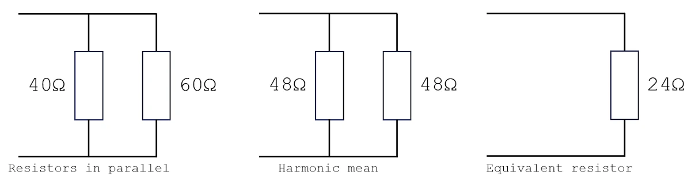
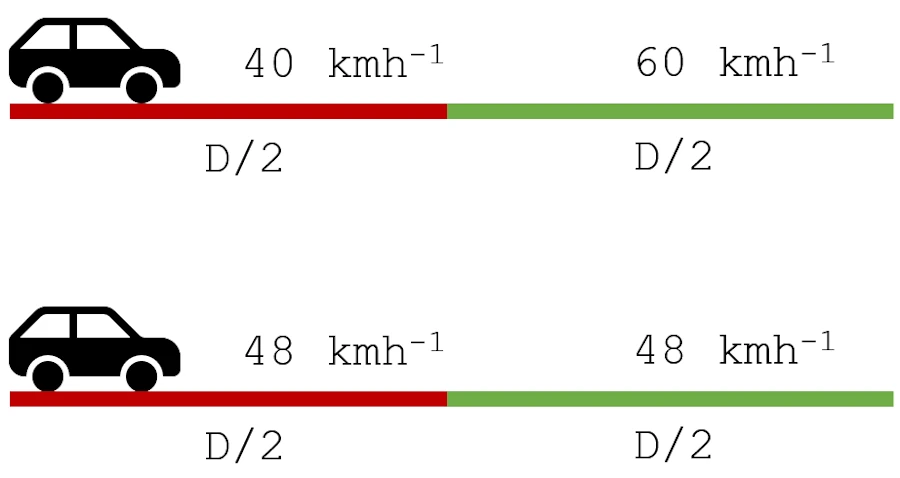
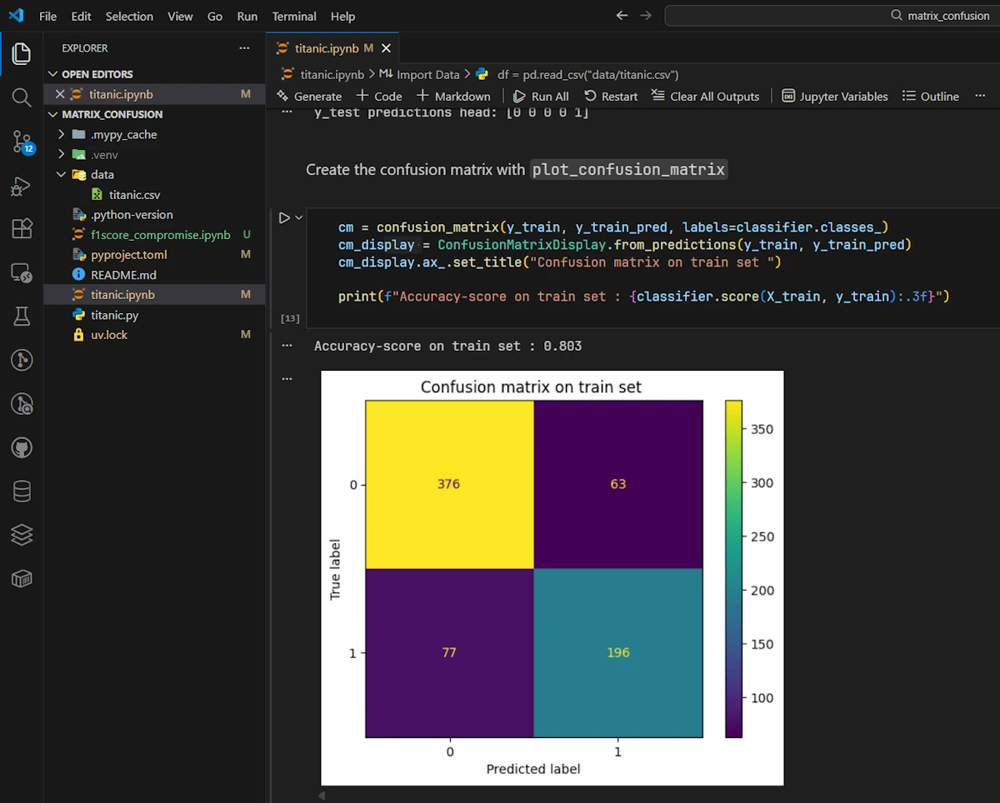
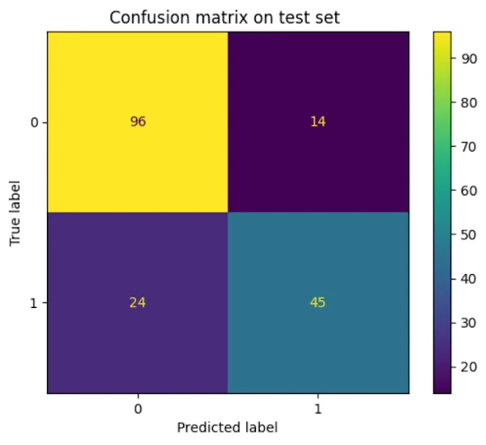

<!--
TODO
* Do this
* Do that
-->


# Understanding the Confusion Matrix
{: .no_toc }

A gentle, story-driven introduction so you’ll never be confused again.
{: .lead }


<h2 align="center">
<span style="color:orange"><b> 🚧 This post is under construction 🚧</b></span>
</h2>


<!-- ###################################################################### -->
<!-- ###################################################################### -->
## TL;DR
{: .no_toc }
* For beginners
* In a ML context but applicable elsewhere
* In the confusion matrix we indicate whether the prediction is correct (T/F) + the kind of prediction (P/N)
* For binary classifiers and beyond


<div align="center">
<br/>
<span>Click the images to zoom in.</span>
</div>


<!-- ###################################################################### -->
<!-- ###################################################################### -->
## Table of Contents
{: .no_toc .text-delta}
- TOC
{:toc}


<!-- ###################################################################### -->
<!-- ###################################################################### -->
## Introduction

One day, a great Machine Learning philosopher once whispered to me: “Listen, kid. A Machine Learning project is just like a dish in a fine restaurant. Every step matters, especially the first ones. You can plate it beautifully, serve it with elegance, even impress the critics… but if the recipe is bad, the dish will never be good. And trust me — no amount of fancy deployment can save a rotten model. Capiche?”

<div align="center">
<br/>
<span>Rémy, the ML philosopher</span>
</div>

| Step                      | Analogy                        |
|---------------------------|--------------------------------|
| EDA                       | The recipe                     |
| Features Engineering      | The secret sauce               |
| Baseline model            | The first taste                |
| Metrics Analysis          | The critics' score             |
| API & App                 | Sharing with friends           |
| Deployment & Monitoring   | Serve the dish, maintain quality |


At one of the very early steps of the process — before jumping into modeling, optimization, and all that fun stuff with Scikit-Learn — it’s absolutely crucial to choose a metric, to be able to explain *why* you chose it, to set yourself a goal, and to stick to it. And honestly, that’s usually the hardest part. Because when we don’t get the results we want, we all have a tendency to “bend the data” until it says what we want to hear — and that is a **very, very bad idea**.

When I say “choose a metric,” right away you start hearing words like *Recall*, *Precision*, *F1 score*, *Accuracy*… On top of that, people start talking about the confusion matrix. And that’s usually where I completely lose my footing.

Let’s be clear: I have no problem with the F1 score itself, or with formulas in general. No, no, it is even worst than that. The real issue was that for a very long time, I just couldn’t wrap my head around how the *labels* in the confusion matrix were written: `TP`, `FP`, `TN`, and `FN`.

Which made it… somewhat awkward to properly explain my choices. But that was before. Since then, I went to Lourdes, I [saw the light](https://en.wikipedia.org/wiki/Lourdes_apparitions), and now I *almost* understand everything.

So yeah — that’s exactly what we’re going to talk about in this post. As usual, I’ll start very slowly, without assuming anything about your math background (okay, you still need to know how to add and divide), but by the end — pinky swear — your ideas will be crystal clear. You’ll be able to choose and explain the metric for your ML project… and also to legitimately worry if a test tells you that you may have caught this or that disease.

Alright. Let’s get started.


<!-- ###################################################################### -->
<!-- ###################################################################### -->
## Drawing The Matrix

To kick things off, I want to finally put to rest this whole “how do I draw a confusion matrix?” question.

Let’s imagine we have some “thing” that makes predictions. It could be a ML model, a pregnancy test, a fortune teller… whatever you want, it’s your story.

Now, this binary predictor will sometimes get things right and sometimes get things wrong. If you look closer, you can actually split its predictions into four categories:

1. I said before going into the club that I was going to leave with a girl, and sure enough, I left with the one who became my wife (poor thing, for better or for worse, as they say…)
1. I said before going into the club that I was going to leave with a girl, but no luck, I went home alone.
1. I said before going into the club that I wasn’t going to leave with a girl, and… I went home alone.
1. I said before going into the club that I wasn’t going to leave with a girl, but the way I danced to those wild beats… I ended up leaving with the most beautiful girl of the night.

Yeah, I know, the example is silly, but that’s the point—it sticks in your mind. And trust me, when it comes to ridiculous examples, you haven’t seen anything yet. The worst is yet to come…

So, we can sum all this up in a table to evaluate how good the predictions are. If you go clubbing twice a week on average, by the end of the year you’ve made 104 predictions… and now it’s starting to look legit.

Anyway, in the previous paragraph, the key word is “**evaluate the accuracy of the predictions**”. Yeah, I know, that’s more than one word.

What we’re going to do now is make a two-way table: on one side, you put the predictions, and on the other, you put reality. So it’s a “Reality vs. Predictions” matrix, and for now, don’t worry about which is the row and which is the column.

Now, **THE REALLY IMPORTANT THING** is that in each cell of the table, we’ll indicate whether **the prediction was correct** and what **kind of prediction** it was.

Let’s clarify the vocabulary:
* The prediction is **NEGATIVE** or **POSITIVE**. Here, a **POSITIVE** prediction could mean "I left with a girl".
* Reality is **NEGATIVE** or **POSITIVE**. These are in the same "units" as the predictions so we can compare them.
* The **correctness of the prediction** compared to reality is **TRUE** or **FALSE**.

So I suggest this first empty matrix:

```
              ┌──────────┬──────────┐
   Negative   │          │          │
REALITY       ├──────────┼──────────┤
   Positive   │          │          │
              └──────────┴──────────┘
                Negative   Positive
                    PREDICTION
```

Which we will fill in together by announcing what we do “out loud.”

**The data:**
At the end of the year, out of 104 outings, I said I was going to go out with a girl 80 times, but in fact I came home alone 70 times. On the other 24 outings where I said I was going to be serious, I only kept my word 18 times.

Let's continue, and now I say:

1. Prediction **P** and Reality **P**: bottom right. The prediction is correct. I said that I would meet a girl and that’s what happened (what a charmer!). I write **T** (the prediction was true) and then **P** (because the prediction was **P**). The value is 10 (80–70).

2. Prediction **P** and Reality **N**: top right. The prediction is incorrect. I said that I would meet a girl, but I went home alone. I write **F** (the prediction was false) and then **P** (because the prediction was **P**). The value is 70.

3. Prediction **N** and Reality **N**: top left. The prediction is correct. I said that I would behave seriously and go home alone, and that is indeed what happened. I write **T** (the prediction was true) and then **N** (because the prediction was **N**). The value is 18.

4. Prediction **N** and Reality **P**: bottom left. The prediction is incorrect. I said that I would behave seriously and go home alone, but on those nights I met the girl of my life (at least that’s what I thought at the time). I write **F** (the prediction was false) and then **N** (because the prediction was **N**). The value is 06 (24–18).


<div align="center">
<br/>
<span><b>Tadaa!</b></span>
</div>


```
              ┌──────────┬──────────┐
   Negative   │  TN 18   │  FP 70   │
REALITY       ├──────────┼──────────┤
   Positive   │  FN 06   │  TP 10   │
              └──────────┴──────────┘
                Negative   Positive
                    PREDICTION
```

**Notes:**
* You can see that it doesn’t really matter what is shown in rows or columns. Here I followed what Scikit-Learn (a library used with Python) displays, but that’s really not the most important part. In this case we have:
  * **X-axis (columns)**: what the model predicted (Negative then Positive)
  * **Y-axis (rows)**: the ground truth (Positive at the bottom, Negative at the top)
* Obviously, the sum of all the cells is 104, the total number of nights out.
* In the same way, with this matrix, the sums of the different columns correspond to my predictions (going home alone 24 times, being a charmer 80 times).
* The sum along the main diagonal (top-left, bottom-right) corresponds to the number of correct predictions (with either positive or negative outcomes, but the predictions were correct: 28).
* The sum along the anti-diagonal (bottom-left, top-right) is the number of times the predictions were wrong (76).


**Summary:**
Each cell contains a two-letter code:
- **First letter**: whether the prediction was correct (**T** for True) or wrong (**F** for False)
- **Second letter**: the prediction itself (**P** or **N**)

Building the Matrix Step by Step

| Prediction | Reality | Correct? | Label |
|------------|---------|----------|-------|
| P | P | Yes → T | TP |
| P | N | No → F | FP |
| N | P | No → F | FN |
| N | N | Yes → T | TN |


<!-- ###################################################################### -->
### Exercices
{: .no_toc }


**Exercice 00**

**Exercice 01**

**Exercice 02**


<!-- ###################################################################### -->
<!-- ###################################################################### -->
## Intuitive Understanding

Before we dive into a bit of algebra, let's step back and appreciate the matrix we just built. First off, we can be proud of ourselves. More importantly, tomorrow morning you should be able to read it "out loud", I really mean it, without any trouble. Then, as a bonus challenge, try swapping the rows and columns, or flipping the two rows and/or the two columns around. The results stay the same, only the layout changes. Here, I'm using the format that the excellent Scikit-Learn library uses, but we don't want our understanding to depend on any particular arrangement.

Speaking of understanding... Let's try replacing TP and friends with everyday words. Starting from our original matrix:

```
              ┌──────────┬──────────┐
   Negative   │    TN    │    FP    │
REALITY       ├──────────┼──────────┤
   Positive   │    FN    │    TP    │
              └──────────┴──────────┘
                Negative   Positive
                    PREDICTION
```

And I propose the following matrix:

```
              ┌────────────────────┬───────────────┐
   Negative   │ Correct Rejections │  False Alarm  │
REALITY       ├────────────────────┼───────────────┤
   Positive   │      Misses        │      Hits     │
              └────────────────────┴───────────────┘
                      Negative          Positive
                              PREDICTION
```

1. **Hits:** Whether it's at a nightclub, detecting a wildfire on a satellite image, or spotting a fraudulent credit card. You get it. I announced that my natural charisma was going to work its magic once again, and sure enough, I left with a girl. Same thing for wildfire detection and fake cards: we correctly detected what needed to be detected.
1. **False Alarm:** Okay, the nightclub pickup example doesn't work great here, but with the wildfire detector, you understand that it screamed "fire!" when there wasn't one, and we scrambled the water bombers for nothing. Way to go, AI...
1. **Correct Rejection:** This one's simple. The fake credit card detector says the card is *NOT* fraudulent, and that's indeed the case. As for me, I managed to resist the advances of my many groupies and went home alone (such strength of character, truly inspiring...).
1. **Misses:** Here, the wildfire detector saw nothing, the credit card detector caught nothing, and I didn't keep my word. I ended up leaving with a gorgeous young woman even though I'd said I wouldn't (the willpower of a panda...).

There's really nothing new here compared to what we've already covered, but I think it's **important** to be able to put words to math formulas, lines of code, or confusion matrices. It lets you verify that you've actually understood, and it confirms that you can explain to a friend what the matrix, formula, or line of code is trying to tell us. Plus, I'm convinced it helps anchor these concepts in our heads.


Alright, let's do some math. Don't panic—it's going to be fine, you'll see.


### Exercices
{: .no_toc }


**Exercice 00**

**Exercice 01**

**Exercice 02**


<!-- ###################################################################### -->
<!-- ###################################################################### -->
## The Metrics

<!-- ### Ideas to explore
{: .no_toc }

- A concrete example using the clubbing scenario (consistency)
- When to prioritize this metric (which you partially cover later)
- Common pitfalls or misinterpretations -->


We've mastered the confusion matrix and we understand the "story" it tells us. That's great, but there's a small problem. There's still too much information. How are you going to walk up to your favorite CFO and ask for an extra 2 million dollars in new GPUs because the numbers in your matrix aren't looking great? That's not going to fly. Plus, as I mentioned earlier, at the start of any ML project you need to pick one metric and stick with it. A confusion matrix isn't a metric, it's a table with 4 numbers. So yeah, that's not going to work...

In what follows, I'll use **our** confusion matrix, which looks like this:

```
              ┌──────────┬──────────┐
   Negative   │    TN    │    FP    │
REALITY       ├──────────┼──────────┤
   Positive   │    FN    │    TP    │
              └──────────┴──────────┘
                Negative   Positive
                    PREDICTION
```


<!-- ###################################################################### -->
### Precision
{: .no_toc }

$$\text{Precision} = \frac{\text{TP}}{\text{TP} + \text{FP}}$$

* What matters to us is the number of hits (`TP`)
* We start with `TP`
* In the last column, we compare `TP` to the sum of that column
* **Storytelling:** "Among everything I predicted as Positive, how many were actually Positive?"

<!-- ###################################################################### -->
### Recall
{: .no_toc }

$$\text{Recall} = \frac{\text{TP}}{\text{TP} + \text{FN}}$$

* What matters to us is the number of hits (`TP`)
* We start with `TP`
* In the bottom row, we compare `TP` to the sum of that row
* **Storytelling:** "Among all actual Positives, how many did I find?"
* The term `Recall` comes from the field of information retrieval. Out of all the relevant documents available in the database, how many did I retrieve?
* For example, we might want to extract all documents of interest, even if that means pulling a few irrelevant ones along the way.


<!-- ###################################################################### -->
### F1 Score
{: .no_toc }

$$\text{F1} = \frac{2}{\frac{1}{\text{Precision}} + \frac{1}{\text{Recall}}}$$

* The `F1 score` is the harmonic mean of `Precision` and `Recall`
* The `F1 score` looks for a compromise between `Precision` and `Recall`
* **Storytelling:** "How well am I balancing finding all the positives with not crying wolf?"

Let's go back to the nightclub. I could adopt two extreme strategies:

1. **The overconfident guy:** Every single night, I announce "Tonight, I'm leaving with someone!" This way, I never miss an opportunity (if there's a chance). I've predicted it (Recall = 100%). But my hit rate is abysmal because most nights I go home alone despite my bold claims (Precision in the gutter).

2. **The overcautious guy:** I only predict success when I'm absolutely certain (say, when a girl has already shared her phone number while we were queuing outside the nightclub). Sure, when I make a prediction, I'm almost always right (Precision ≈ 100%). But I miss tons of opportunities I didn't dare call (Recall in the gutter).

The F1 score tells us "Pick a lane, buddy, but not an extreme one." It forces us to find a balance. And here's the key property of the harmonic mean: it punishes imbalance harshly. If one metric is great but the other is terrible, the F1 score stays low. You can't hide a weakness by excelling elsewhere.

If you remember your physics classes, the harmonic mean shows up in two classic situations:

1. **Two resistors in parallel**


<div align="center">
<br/>
<!-- <span><b>Tadaa!</b></span> -->
</div>

2. **A car traveling the same distance at two different speeds**

<div align="center">
<br/>
<!-- <span><b>Tadaa!</b></span> -->
</div>

In both cases, we can't just average the values. Indeed, the smaller one "drags down" the result. Same thing here: a fantastic Precision can't compensate for a catastrophic Recall, and vice versa.

<!-- * Python script to show the compromise -->


<!-- ###################################################################### -->
### Accuracy
{: .no_toc }


$$\text{Accuracy} = \frac{\text{TP} + \text{TN}}{\text{Total}}$$

* What "matters" for us, is the number of good predictions (`TN+TP`)
* First Diagonal over `Total`
* **Storytelling:** "The Accuracy of a predictor is the percentage of correct predictions among all predictions made."

At this point, it is important to make the distinction between [`Accuracy` and `Precision`](https://en.wikipedia.org/wiki/Accuracy_and_precision)

<div align="center">
<br/>
<span><b>Accuracy & Precision</b></span>
</div>

Indeed, you can have low accuracy even with a high precision. See the top-left example below:

<div align="center">
<br/>
<!-- <span><b>Tadaa!</b></span> -->
</div>


Finally (*CeCe Peniston, 91*) you may want to keep in mind the figure below:

<div align="center">
<br/>
<span><b>Tadaa!</b></span>
</div>


<!-- ###################################################################### -->
### Confusion Matrix Labels in a Tree
{: .no_toc }

<!-- #### Ideas to explore
{: .no_toc }

* Prevalence
* Sensitivity
* Specificity
* Example and Numerical Application
* One word about Bayes? Intro a new post ?

-->

Do you remember when you were young and innocent. You start learning probabilities and you used to draw trees to simulate, for example, that you toss a coin twice and get 4 possible results (HH, HT, TH, TT).

You know what? We can find the Confusion Matrix labels in the tree you used to draw. See below:

<div align="center">
<br/>
<span><b>Confusion Matrix metrics in a Tree</b></span>
</div>

We assume that the probability of being sick, called the **prevalence**, is a certain percentage of the population. Each person is therefore either sick or healthy.

Then, everyone takes a medical test that has two key characteristics:
* **Sensitivity**, which is the percentage of sick people who are correctly identified as sick by the test.
* **Specificity**, which is the percentage of healthy people who are correctly identified as not sick by the test.

Look, at the end of the top branch of the tree for example. We found our friend `TP`. Indeed, the guy is affected, so the reality is POSITIVE. Then the prediction is "he is affected", "he is `POSITIVE`". So, in this case, the prediction is correct, it is `TRUE` and so the leaf is labeled `TRUE-POSITIVE`, aka `TP`.

Check for yourself but the same reasoning applied to the three other branches and you get: `FN`, `FP` and `TN`.

Now, if we stay focused on the top branch, you may remember that our teacher was talking about the "probability to be tested sick knowing that the patient is sick". Does the word conditional probability resonate? No? Have you ever heard about Bayes statistics, the statistic of the causes? This is not the topic of this post but believe or not TP its friends not only appears in the kind of binary tree but also in Bayes statistics.


Now, if we stay focused on the top branch, you may recall that our teacher mentioned the "probability of testing positive given that the patient is sick". Does the term "conditional probability" ring a bell? No? What about "Bayesian statistics", often described as the statistics of causes?

While this is not the main topic here, it is worth noting that `TP` and its friends appear not only in this type of binary tree, but also play a central role in Bayesian statistics.


<!-- ###################################################################### -->
### Exercices
{: .no_toc }


**Exercice 00:** Draw the same kind of binary tree but in the case of me and my friends clubbing. Calculate Prevalence, Sensitivity and Specificity in percentage using the numbers of the table below.

```
              ┌──────────┬──────────┐
   Negative   │  TN 18   │  FP 70   │
REALITY       ├──────────┼──────────┤
   Positive   │  FN 06   │  TP 10   │
              └──────────┴──────────┘
                Negative   Positive
                    PREDICTION
```

**Exercice 01:**

**Exercice 02:**


<!-- ###################################################################### -->
<!-- ###################################################################### -->
## The Imbalance Problem

### Ideas to explore
{: .no_toc }

* Eclair 1 sur 1_000_000 CB frauduleuses FR = 0.015%
    * https://www.cchst.ca/oshanswers/safety_haz/weather/lightning.html
    * https://www.banque-france.fr/en/press-release/ecb-and-eba-publish-joint-report-payment-fraud?utm_source=chatgpt.com

* To motivate the metrics
* Critical often overlooked.
* Explain why accuracy can be misleading with imbalanced datasets (the classic "99% accuracy on fraud detection" trap).
* This explains why we need Precision/Recall.


<!-- ###################################################################### -->
### Exercices
{: .no_toc }


**Exercice 00**

**Exercice 01**

**Exercice 02**


<!-- ###################################################################### -->
<!-- ###################################################################### -->
## The Threshold Concept

### Ideas to explore
{: .no_toc }

* Before "How to Select a Metric,"
* Explains that changing the threshold shifts the trade-off between FP and FN.
* Finish with the ROC curve.


<!-- ###################################################################### -->
### Exercices
{: .no_toc }


**Exercice 00**

**Exercice 01**

**Exercice 02**


<!-- ###################################################################### -->
<!-- ###################################################################### -->
## ROC Curve and AUC


### Ideas to explore
{: .no_toc }

* A standard topic
* Encountered by beginners after confusion matrices


<!-- ###################################################################### -->
### Exercices
{: .no_toc }


**Exercice 00**

**Exercice 01**

**Exercice 02**


<!-- ###################################################################### -->
<!-- ###################################################################### -->
## Confusion Matrix in Code


You thought we were in the Matrix? Nah, instead the confusion matrix is in the code. Below you'll find two complete sample code because I hate partial code you can find in [Medium](https://medium.com/@philippe.baucour/yet-another-linear-regression-introduction-0835e333508b) that never works. One is in Python, the other is in Rust. Both use the Titanic dataset.


<!-- ###################################################################### -->
### Python
{: .no_toc }

```python
import pandas as pd
from sklearn.model_selection import train_test_split
from sklearn.impute import SimpleImputer
from sklearn.preprocessing import StandardScaler, OneHotEncoder
from sklearn.compose import ColumnTransformer
from sklearn.linear_model import LogisticRegression
from sklearn.metrics import confusion_matrix, ConfusionMatrixDisplay

# Mandatory when running in a terminal
import matplotlib.pyplot as plt

df = pd.read_csv("data/titanic.csv")
# print("df datatype & shape :", type(df), df.shape)

# In a script one must use print to see the head of dataframe
print("\n\nDataset head:")
print(df.head())

# Remove `PassengerId`, `Name`, `Ticket`, `Cabin` columns from the dataset
df = df.drop(columns=["PassengerId", "Name", "Ticket", "Cabin"])

print("\n\nDataset head (useless col removed) :")
print(df.head())

# ## Preprocessing
# No EDA? What a shame!
# Split the dataset by $X$ and
# $y$ = Survived
# $X$ = Pclass	Sex	Age	SibSp	Parch	Fare	Embarked

y = df.loc[:, "Survived"]

features_list = ["Pclass", "Sex", "Age", "SibSp", "Parch", "Fare", "Embarked"]
X = df.loc[:, features_list]

# Split the data in `train` and `test` sets
X_train, X_test, y_train, y_test = train_test_split(
    # `stratify=y` allows to stratify our sample.
    # Meaning, we will have the same proportion of categories in test and train set
    X,
    y,
    test_size=0.2,
    random_state=0,
    stratify=y,
)

# Deal with missing values with `SimpleImputer`
# Create an imputer for numerical columns
numerical_imputer = SimpleImputer(strategy="mean")

# Apply it on "Age" column.
# ! See the X[["Age"]] to get a 2D array rather than 1D
X_train[["Age"]] = numerical_imputer.fit_transform(X_train[["Age"]])

# In col `Embarked` replace missing val with "Unknown"
categorical_imputer = SimpleImputer(strategy="constant", fill_value="Unknown")
X_train[["Embarked"]] = categorical_imputer.fit_transform(X_train[["Embarked"]])

# Make all the required preprocessing on the train set
print("\n\nX_train head:")
print(X_train.head())

# Reminder, we have : ['Pclass', 'Sex', 'Age', "SibSp", "Parch", "Fare", "Embarked"]
numeric_features = [0, 2, 3, 4, 5]
numeric_transformer = StandardScaler()

categorical_features = [1, 6]
categorical_transformer = OneHotEncoder()

# No change in score with or without drop=first
# TODO: I think it's better without because in `LogisticRegression` there is an l2-type regulation/penalty
# categorical_transformer = OneHotEncoder(drop="first")

# Apply ColumnTransformer to create a pipeline that will apply the above preprocessing
feature_encoder = ColumnTransformer(
    transformers=[
        ("cat", categorical_transformer, categorical_features),
        ("num", numeric_transformer, numeric_features),
    ]
)

X_train = feature_encoder.fit_transform(X_train)
print("\n\nX_train fit_transformed head:")
print(X_train[0:5, :].round(2))  # print first 5 rows (not using iloc since now X_train became a numpy array)

# Build the Logistic Regression model
classifier = LogisticRegression(random_state=0)  # Instantiate model
classifier.fit(X_train, y_train)  # Fit model. Ajustement

y_train_pred = classifier.predict(X_train)
print(f"\n\ny_train predictions head: {y_train_pred[0:5]}")

# Evaluate the model but preprocess `X_test` first
X_test[["Age"]] = numerical_imputer.transform(X_test[["Age"]])
X_test[["Embarked"]] = categorical_imputer.transform(X_test[["Embarked"]])
X_test = feature_encoder.transform(X_test)

y_test_pred = classifier.predict(X_test)
print(f"y_test predictions head: {y_test_pred[0:5]}")

# Create the confusion matrix with `plot_confusion_matrix`
cm = confusion_matrix(y_train, y_train_pred, labels=classifier.classes_)
cm_display = ConfusionMatrixDisplay.from_predictions(y_train, y_train_pred)
cm_display.ax_.set_title("Confusion matrix on train set ")

# Mandatory when running in a terminal
plt.show()

print(f"\n\nAccuracy-score on train set : {classifier.score(X_train, y_train):.3f}")

cm = confusion_matrix(y_test, y_test_pred, labels=classifier.classes_)
cm_display = ConfusionMatrixDisplay.from_predictions(y_test, y_test_pred)
cm_display.ax_.set_title("Confusion matrix on test set ")

# Mandatory when running in a terminal
plt.show()

print(f"Accuracy-score on test set : {classifier.score(X_test, y_test):.3f}")
```

<div align="center">
<br/>
<span><b>Running the code in the terminal</b></span>
</div>


There is also a Jupyter notebook. The code is the same at 99% and we get the same result.

<div align="center">
<br/>
<span><b>Running the code in VSCode in a Jupyter notebook</b></span>
</div>


So the accuracy is 0.803 on the train set and 0.788 on the test set. Then what?

Good news first. The two values are close which suggests our model isn't overfitting. It generalizes reasonably well when used with unseen data.

But wait... Should we really be celebrating an 80% accuracy? Well, it depends. Remember what we said earlier: accuracy alone can be misleading. What if 80% of passengers actually died? A dumb model that always predicts "died" would score 80% accuracy without learning anything useful.

Let's dig deeper and look at the full confusion matrix of the test set (the unseen data).

<div align="center">
<br/>
<span><b>Confusion matrix of the test set</b></span>
</div>


On the capture above we can read:
- **TN = 96:** We correctly predicted 96 passengers would not survive (Correct Rejections)
- **FP = 14:** We predicted 14 passengers would survive, but they didn't (False Alarms)
- **FN = 24:** We predicted 24 passengers wouldn't survive, but they actually did (Misses)
- **TP = 45:** We correctly predicted 45 survivors (Hits)

Total: 96 + 14 + 24 + 45 = 179 passengers in the test set (20% of the data set).

Now let's compute "by hands" our metrics:

- **Accuracy** = (96 + 45) / 179 = 141 / 179 ≈ **0.788** This matches what sklearn reported
- **Precision** = 45 / (45 + 14) = 45 / 59 ≈ **0.763** "When I predict survival, I'm right 76% of the time"
- **Recall** = 45 / (45 + 24) = 45 / 69 ≈ **0.652** "I found 65% of the actual survivors"
- **F1 Score** = 2 × (0.763 × 0.652) / (0.763 + 0.652) ≈ **0.703**

What does this tell us? Our model is more cautious than aggressive. It's better at not crying wolf (decent `Precision`) than at finding all survivors (lower `Recall`). In other words, when it predicts someone will survive, it's fairly reliable. But it misses about a third of the actual survivors.

Is that a problem? It depends on the context and this brings us to our next section...


<!-- ###################################################################### -->
### Rust
{: .no_toc }


<!-- ###################################################################### -->
### Exercices
{: .no_toc }


**Exercice 00**

**Exercice 01**

**Exercice 02**


<!-- ###################################################################### -->
<!-- ###################################################################### -->
## How to select a Metric?

### Ideas to explore
{: .no_toc }

* Sex films among cartoons for kids
* CB
* Spam
* Find more weird examples 😁


<!-- ###################################################################### -->
### Exercices
{: .no_toc }


**Exercice 00**

**Exercice 01**

**Exercice 02**


<!-- ###################################################################### -->
<!-- ###################################################################### -->
## Multi-class Confusion Matrices

* One word
* the concept extends beyond binary classification.
* don't need to go deep, show an example with some explanation/interpretation


<!-- ###################################################################### -->
### Exercices
{: .no_toc }


**Exercice 00**

**Exercice 01**

**Exercice 02**


<!-- ###################################################################### -->
<!-- ###################################################################### -->
## Last Dance (*Donna Summer, 79*)

It is time to conclude.

* Add a Bayes teaser


<!-- ###################################################################### -->
<!-- ###################################################################### -->
## Webliography

