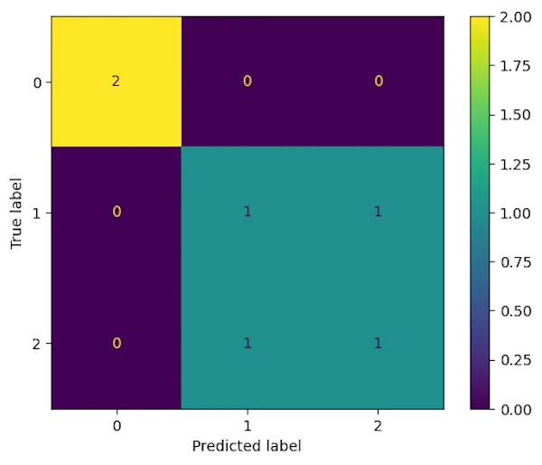

# Understanding the Confusion Matrix
{: .no_toc }

A gentle, story-driven introduction so you’ll never be confused again.
{: .lead }


<!-- <h2 align="center">
<span style="color:orange"><b> 🚧 This post is under construction 🚧</b></span>
</h2> -->


<!-- ###################################################################### -->
### This is Episode 02
{: .no_toc }

#### The Posts Of The Saga
{: .no_toc }
* [Episode 00]()
* [Episode 01]()
* [Episode 02]()


<div align="center">
<br/>
<span>Click the images to zoom in.</span>
</div>


<!-- ###################################################################### -->
<!-- ###################################################################### -->
## Table of Contents
{: .no_toc .text-delta}
- TOC
{:toc}


<!-- ###################################################################### -->
<!-- ###################################################################### -->
## The Threshold Concept

Let’s take a two-minute breather before moving on…

At this point in the story, we know how to draw a confusion matrix and we understand the nature of the labels it uses (TP, FN, and friends). We’ve also picked up some new vocabulary along the way: Precision, Recall, F1-score, and Accuracy. And the cherry on top? We know what they actually mean. We understand them, they tell a story, and, pure bliss, we even know how to compute them. Finally, we’ve confirmed that when dealing with imbalanced datasets, Accuracy alone isn’t going to be much help. Fantastic! If we look back for a moment, we can be justifiably proud of how far we’ve come.

That said, remember what I explained right at the beginning of this post: *before* diving head-first into optimizing our machine learning model, we need to choose a metric and stick with it. Which means we must give ourselves the tools to choose, for example, between Recall, Precision, F1-score, and Accuracy. And for that, we need to take the time to truly understand how Recall and Precision work and understand the thing that actually causes the fight: the Threshold

So I suggest we leave nightclubs behind for a moment and do a bit of politics instead. Let’s imagine that these two metrics are actually two political parties, each doing their best to get more votes than the other, fighting like dogs over a single bone.
FF
### The Threshold is a continuous value
{: .no_toc }

Most classifiers don’t say *"this is positive"* or *"this is negative"*. Instead they say something closer to "Hmm… this looks 73% suspicious to me". That number is continuous. It lives somewhere between 0% and 100%. The Threshold is simply the rule we apply afterward:

```
If the score is above this value Then
    predict Positive
Else
    predict Negative
```


### Watching Precision and Recall move when the Threshold moves
{: .no_toc }

Let’s make this concrete. Same model. Same scores. Only the Threshold will change.

```python
import numpy as np
import matplotlib.pyplot as plt

# Ground truth: 1 = positive, 0 = negative
y_true = np.array([1, 1, 1, 1, 0, 0, 0, 0, 0, 0])

# Continuous scores produced by the model
y_score = np.array([0.95, 0.85, 0.70, 0.40, 0.60, 0.50, 0.30, 0.20, 0.10, 0.05])

def precision_recall(threshold):
    # Convert scores into binary predictions
    y_pred = (y_score >= threshold).astype(int)

    tp = np.sum((y_pred == 1) & (y_true == 1))
    fp = np.sum((y_pred == 1) & (y_true == 0))
    fn = np.sum((y_pred == 0) & (y_true == 1))

    precision = tp / (tp + fp) if tp + fp > 0 else 0.0
    recall = tp / (tp + fn) if tp + fn > 0 else 0.0

    return precision, recall

# Sweep thresholds from 0% to 100%
thresholds = np.linspace(0, 1, 101)
precisions = []
recalls = []

for t in thresholds:
    p, r = precision_recall(t)
    precisions.append(p)
    recalls.append(r)

# Plot
plt.figure()
plt.plot(thresholds, precisions, label="Precision")
plt.plot(thresholds, recalls, label="Recall")
plt.xlabel("Threshold")
plt.ylabel("Metric value")
plt.title("Precision and Recall vs Threshold")
plt.legend()
plt.show()

```

<div align="center">
<br/>
<span><b>Precision and Recall vs Treshold</b></span>
</div>

#### **Why the curves look like "stairs"?**
{: .no_toc }

You might expect smooth curves but, this is not what we get and the curves are step-shaped because:
1. the Threshold varies continuously
1. but the model’s decisions only change when the Threshold crosses an actual score produced by the model.

Between two consecutive score values:
* `TP`, `FP`, and `FN` do not change
* therefore Precision and Recall remain constant

Remember the Alamo but remember that "*The model outputs a finite set of scores; the Threshold only reacts to those.*"

#### **What the plot tells us**
{: .no_toc }

* **Recall** starts high and decreases as the Threshold increases
    * We miss more and more true positives
* **Precision** starts low and increases
    * We progressively filter out false positives

Same model, same data, just one slider moving from 0 to 1.


#### **What about the "weird" point when `Threshold == 1`**
{: .no_toc }

* The model predicts no positive samples at all
* Recall is 0 (we miss everything)
* Precision is undefined and is displayed here as 0 by convention


#### **How to use this kind of plot?**
{: .no_toc }

This figure allows us to make a strong statement: "Choosing a Threshold is not about improving the model. It’s about deciding where WE want to sit on this curve."

Or, even more bluntly: "Asking for a Recall of 90% means accepting a certain Precision, whether we like it or not".

So next time the Marketing manager ask for a Precision of 90% you can answer "No problemo but are YOU OK with a Recall of 30%?".
* Draw a vertical line on the plot
* Explain what happen at **this point**
* Educate people, even marketing manager can learn something


### Explaining the Threshold "with hands"
{: .no_toc }

Think of the Threshold as a **gate**.
* Lower the gate → more people get through
* Raise the gate → fewer people get through

Now let’s translate that into metrics.


#### **Recall cares about missed positives**
{: .no_toc }

$$\text{Recall} = \frac{\text{TP}}{\text{TP} + \text{FN}}$$

When we raise the Threshold:

* fewer samples are predicted positive
* some true positives fall below the gate
* FN increases
* Recall goes down


#### **Precision cares about mistaken positives**
{: .no_toc }

$$\text{Precision} = \frac{\text{TP}}{\text{TP} + \text{FP}}$$

When we raise the Threshold:

* Fewer negatives sneak through
* FP decreases
* Precision goes up ⬆️


#### **Same action, opposite effects**
{: .no_toc }

```
Threshold ⬆️
  FP ⬇️  → Precision ⬆️
  TP ⬇️  → Recall ⬇️
```

This is why Precision and Recall feel like they fighting political parties. But in fact they are not true enemies, they are more like brothers and sisters fighting for the same toys. They are "negotiating" over the same decision rule.


#### **Why this is fundamentally a trade-off**
{: .no_toc }

Here is the part worth remembering: "Asking for a given Recall value implicitly fixes the best Precision we can hope for (and vice versa)."

If someone says "I want at least 95% Recall", what they are really saying is "I accept more false positives". Now if someone says "I want 99% Precision" they are also saying "I accept missing real positives."

We can't optimize both independently. Wou choose where to stand on the curve.


### And no, we cannot have both at 100%
{: .no_toc }

* Precision = 100% means zero false positives
* Recall = 100% means zero false negatives

That would require:
* perfect separation
* zero overlap between classes
* a world without noise, ambiguity, or measurement error

In other words a toy dataset or a miracle. For real-world problems, Precision and Recall are not targets to maximize simultaneously, they are constraints to balance.


### And yes, we can have both at 100%
{: .no_toc }

Yes, it is absolutely possible to have **100% Recall and 100% Precision** at the same time. We could have:

```
              ┌──────────┬──────────┐
   Negative   │  TN 80   │  FP  0   │
REALITY       ├──────────┼──────────┤
   Positive   │  FN  0   │  TP 24   │
              └──────────┴──────────┘
                Negative   Positive
                    PREDICTION
```


If a confusion matrix has false positives and no false negatives (only value on the first diagonal TN and TP), then there is **no Recall–Precision trade-off**.

The trade-off is not a mathematical rule. It appears **only when classes overlap** and the model makes errors. In a **perfectly separable problem**, both metrics can be maximized simultaneously. But in real life, perfect models simply don't exist.

I might decide to come back alone, but this Friday night, don’t ask me why, a whole group of nursing school students decided to celebrate the end of their exams at the same place. And, of course, what had to happen… happened. I couldn’t keep my promise.

Or maybe it’s the other way around: tonight, for sure, I’m going to go wild... Except I twist my ankle getting out of the car, and once inside the club, I spend the entire night whining on a couch. Perfection is definitively NOT of this world.


### Things to keep in mind
{: .no_toc }

* Precision vs Recall is NOT a technical issue or a limitation of models.
* It is a decision problem.
* Move the Threshold, and you choose which mistakes you are willing to live with.


<!-- ###################################################################### -->
### Exercices
{: .no_toc }


**Exercise 00 — Austin Powers’ Evil Detector.** Dr. Evil has built a machine that assigns a *“villain probability”* to everyone entering his lair.
Unfortunately, it can’t tell the difference between actual evil geniuses and slightly weird interns.

You can choose the Threshold that decides who gets thrown into the shark tank.

- What happens to **Recall** if you lower the Threshold to catch *all* potential villains?
- What happens to **Precision** if you raise it to avoid throwing innocent interns to the sharks?
- Where would you set the Threshold if releasing a real villain is worse than sacrificing a few interns?


**Exercise 01 — Martian Invasion Alarm System.** Earth has deployed a radar system that outputs a probability that a flying object is a Martian ship. Most objects are… just pigeons.

- Low Threshold: the alarm rings all the time, even for pigeons.
- High Threshold: the alarm almost never rings… including when Martians actually land.

For each scenario below, decide which metric you prioritize and why:
- Missing a real Martian invasion.
- Launching nuclear defense because of a pigeon.
- Convincing politicians that your choice of Threshold makes sense.


**Exercise 02 — Batman’s Night Patrol.** Batman uses a model to decide whether someone in an alley is a criminal. The model outputs a *“crime likelihood score”*.

- A false positive means Batman punches an innocent person.
- A false negative means a criminal escapes.

- Which metric does Batman care about more: Precision or Recall?
- How does raising or lowering the Threshold change Gotham’s nightly crime statistics?
- At what point does Batman become more of a menace than the criminals themselves?


<!-- ###################################################################### -->
<!-- ###################################################################### -->
<!-- ## ROC Curve and AUC


### Ideas to explore
{: .no_toc }

* A standard topic
* Encountered by beginners after confusion matrices -->


<!-- ###################################################################### -->
<!-- ### Exercices
{: .no_toc }


**Exercice 00**

**Exercice 01**

**Exercice 02** -->


<!-- ###################################################################### -->
<!-- ###################################################################### -->
## How to select a Metric of the Confusion Matrix?


<!-- ###################################################################### -->
### When Precision is King: "The Guillotine of Innocence"
{: .no_toc }

**Context:** A system that predicts who is a secret vampire to be executed.
*   **Scenario:** The town's ancient law states: "If the predictor says `VAMPIRE` execution is immediate and irreversible." A false positive means killing an innocent human.
*   **Ridiculous Outcome:** The predictor, to be "safe" only labels 1 person as a vampire every decade. It's almost always the eccentric old historian who collects garlic. **Precision is 100%** (when it predicts vampire, it's correct), but **Recall is terrible** (99% of vampires roam free). The town feels "accurate" but is actually overrun by vampires.
*   **Why Precision Matters:** The cost of a false positive (executing an innocent) is catastrophically high and unethical. We must be *certain* when we trigger the positive action.

**Other Examples:**
*   **Spam Filter for Your Wedding RSVPs:** If it flags a genuine guest's "Yes" as spam, they might not get a seat. You'd rather let some spam through (lower Recall) than miss Aunt Martha's reply.
*   **Targeted Gold Bar Delivery:** A drone system identifies houses for gold bar delivery. Sending a bar to the wrong house (false positive) is a massive financial loss. Better to deliver to fewer, absolutely sure houses.
*   **Buck Rogers’ auto-fire laser:** Buck Rogers’ ship auto-fires when it detects "enemy spacecraft". False Positive = vaporizing Princess Ardala’s limousine. False Negative = letting enemy fighters escape. Buck would rather miss than accidentally start an interplanetary war. Extreme Precision required.


<!-- ###################################################################### -->
### When Recall is Critical: "The Missed Meteor"
{: .no_toc }

**Context:** A global early-warning system for civilization-ending asteroid impacts.
*   **Scenario:** The AI scans the sky. A false negative means the system says "all clear" when a deadly asteroid is inbound (doom for humanity). A false positive means a costly global alarm and panic for no reason.
*   **Ridiculous Outcome:** The system is calibrated to avoid false alarms. **Accuracy is 99.99%** because impacts are rare. But it has **poor Recall**. It misses 1 in 10 real killer asteroids. Humanity is wiped out because we optimized for a quiet, "accurate" system. Too bad...
*   **Why Recall Matters:** The cost of missing a positive instance (a real threat) is existential. You must catch *almost all* threats, even if it means frequent false alarms.

**Other Examples:**
*   **HIV Blood Test:** Telling someone they are HIV-negative when they are positive (false negative) prevents life-saving treatment and leads to further transmissions. You want the test to catch *every single* positive case, even if it means some false scares.
*   **Search & Rescue Drone:** Looking for a lost child in a forest. Flagging a log as the child (false positive) wastes time. *Not* flagging the actual child (false negative) is an unthinkable tragedy. Maximize finding the child at all costs.
*   **Predator cloaking detection:** A human AI tries to detect "invisible Predators". False Negative = Predator eats you. False Positive = shooting at trees. Shooting at trees is acceptable while being eaten is not. => Maximize Recall


<!-- ###################################################################### -->
### Side note
{: .no_toc }

When you have to decide between Precision and Recall try this. **"Which mistake would hurt me the most?"**
* If **missing a real positive** is catastrophic → **Recall**
* If **accusing something innocent** is catastrophic → **Precision**

That’s it. No metrics. No formulas. Just pain.


<!-- ###################################################################### -->
### When the F1-Score is Essential: "The Psychic Friend Recommender"
{: .no_toc }

**Context:** An algorithm for a social app that identifies and recommends potential "best friends" to users.
*   **Scenario:** If it's too strict (high Precision), you get very few, maybe perfect matches, but you miss out on many other great friends (low Recall). If it's too lax (high Recall), it recommends everyone, including terrible matches, flooding you with spam "friendship" requests (low Precision).
*   **Ridiculous Outcome:** **Optimizing only for Accuracy** leads to a useless app: it's easy to be "accurate" by just saying "NO" to everyone (since true friends are rare). You need the **F1-Score** to balance between being a lonely hermit (high Precision) and a desperate networker flooded with incompatible pals (high Recall).
*   **Why F1-Score Matters:** Both false positives (annoying, irrelevant recommendations) and false negatives (missed opportunities) carry significant but *balanced* costs. You need a harmonic mean of both concerns.

**Other Examples:**
*   **Factory QA for Expensive Gadgets:** Flagging too many good gadgets as defective (false positives) wastes money. Letting too many defective gadgets through (false negatives) ruins your brand. Both are costly; you need a balance.
*   **Document Triage for Legal Discovery:** Finding "smoking gun" emails in a million documents. Missing a key email (false negative) loses the case. Flagging too many irrelevant emails (false positive) buries lawyers in wasted time. Balance is key.


<!-- ###################################################################### -->
### When Accuracy is Meaningful: "The Potato-Chip Sorting Oracle"
{: .no_toc }

**Context:** An automated optical sorter in a chip factory separating perfect chips from broken bits (burned, too small, etc.).
*   **Scenario:** The process is binary: keep (good) or reject (bad). The pieces look very different. A false positive (sending a broken bit to the bag) angers one customer. A false negative (throwing away a perfect chip) costs a tiny fraction of a cent.
*   **Ridiculous Outcome:** Focusing only on **Recall** (catch all broken bits) might lead to rejecting 30% of perfect chips, destroying profit. Focusing only on **Precision** (ensure every rejected item is truly bad) might let too many broken bits through. Here, **Overall Accuracy** is a fantastic simple metric because the classes are roughly balanced and the costs of both errors are similar and *low*.
*   **Why Accuracy Matters:** When the dataset is balanced and the cost of both types of errors is roughly symmetrical and acceptable, accuracy gives a clear, intuitive measure of total correctness.

**Other Examples:**
*   **Broadcast Weather (Rain/No Rain):** For most people, the cost of carrying an umbrella on a sunny day is similar to the cost of getting wet. A false positive and a false negative are equally annoying. Being correct most of the time (accuracy) is what builds trust.
*   **Trivia Bot Answer Classification (Right/Wrong):** You're gauging its general knowledge. Neither type of error (calling a right answer wrong or vice versa) is more costly than the other. You just want it to be correct as often as possible.
*   **Predator's "Should I Attack Earth?" Decision Model** Training data: 999,999 days of "Earth not worth attacking", 1 day of "Schwarzenegger is here!". Model: "Never attack Earth" → 99.9999% accuracy! Predator elders: "Our model has six nines of accuracy!". Predator warriors: "But we never get to hunt anything...". Dies of boredom with perfect accuracy scores.


<!-- ###################################################################### -->
### Things to keep in mind
{: .no_toc }

* Choosing a metric isn't a technical afterthought, it's a **value judgment** about what kind of mistakes you're willing to make. These shocking examples force that point home.
* Think in terms of cost
    * What is the cost of missing a positive instance => Recall high => Precision low
* Think in term of strictness
    * Strict = Precision high = Recall low


<!-- ###################################################################### -->
### Exercices
{: .no_toc }


**Exercise 00 — Dracula’s Dating App.** A dating app tries to detect *actual vampires* hiding among normal humans. If the app labels someone as `VAMPIRE`, they are instantly banned and staked.

- False Positive: you stake a perfectly normal human looking for love.
- False Negative: you match an actual vampire who drinks your blood on the first date.

Questions:
- Which metric should the app optimize first: Precision or Recall?
- What kind of Threshold would you choose?
- Describe the absurd outcome of pushing this metric to the extreme.


**Exercise 01 — Indiana Jones and the Temple of Traps.** Indiana Jones uses an AI to detect deadly traps in ancient temples. The model flags tiles as `TRAP` or `SAFE`.

- False Positive: the AI flags a safe tile as dangerous → Indy avoids it and wastes time.
- False Negative: the AI misses a real trap → Indy falls, screams, and the movie ends early.

Questions:
- Which mistake is more acceptable?
- Which metric dominates the decision?
- Why would optimizing Accuracy alone be a terrible idea here?


**Exercise 02 — Alien Nightclub Bouncer.** An intergalactic nightclub has a bouncer AI deciding who gets in. The goal: admit cool aliens, reject monsters that eat other guests.

- False Positive: a monster gets in and eats three DJs.
- False Negative: a cool alien is rejected and leaves a bad Yelp review.

Questions:
- Would you prioritize Precision, Recall, F1-score, or Accuracy?
- What happens if the bouncer optimizes only for Precision?
- What happens if it optimizes only for Recall?
- Explain why a *balanced metric* might actually save the club.


<!-- ###################################################################### -->
<!-- ###################################################################### -->
## Multi-class Confusion Matrices


The concept of a confusion matrix naturally extends beyond binary classification to **multi-class problems**, where the model must choose between more than two classes.

In a multi-class confusion matrix
* **Rows** represent the true classes
* **Columns** represent the predicted classes
* Each cell indicates how many samples of a given true class were predicted as another class

The first diagonal still represents **correct predictions**, while anti-diagonal values highlight **confusions between classes**. This makes the matrix especially useful to understand which classes the model tends to mix up.

### Example
{: .no_toc }

Imagine a classifier that recognizes handwritten digits (`0` to `9`).
A multi-class confusion matrix can quickly show that the model often confuses **3 and 5**, but almost never mistakes **1 for 8**.


### Minimal Python example
{: .no_toc }

Thanks to Scikit-Learn we call the same functions: `confusion_matrix()` and `ConfusionMatrixDisplay()`.

```python
import numpy as np
import matplotlib.pyplot as plt
from sklearn.metrics import ConfusionMatrixDisplay, confusion_matrix

# Example ground truth and predictions for a 3-class problem
y_true = np.array([0, 1, 2, 2, 1, 0])
y_pred = np.array([0, 2, 1, 2, 1, 0])

# Compute confusion matrix
cm = confusion_matrix(y_true, y_pred)

# Display confusion matrix
disp = ConfusionMatrixDisplay(confusion_matrix=cm)
disp.plot()
plt.show()
```


<div align="center">
<br/>
<span><b>Multi-class Confusion Matrix</b></span>
</div>

This provides an intuitive overview of model performance across the classes.


<!-- ######################################################################
### Exercices
{: .no_toc }


**Exercice 00**

**Exercice 01**

**Exercice 02** -->


<!-- ###################################################################### -->
<!-- ###################################################################### -->
## Last Dance (*Donna Summer, ’79*)

So here we are. The lights are coming back on, the DJ is packing up, and it’s time to face reality, both in machine learning *and* on the dance floor.

If there’s one thing this long detour through confusion matrices, metrics, thresholds, vampires, asteroids, and Titanic passengers should have taught us, it’s this: **being confident is not the same thing as being right**. And sadly, my nightclub career was a textbook example of that distinction.

Looking back at my personal confusion matrix, the verdict is brutal but fair:

* My Recall was phenomenal. I *never* missed an opportunity to predict success.
* My Precision, on the other hand… Let’s say it was more "optimistic" than "scientific".
* My Accuracy? Technically measurable, emotionally questionable.
* And the F1-score politely suggests I should have spent more time calibrating my Threshold instead of rehearsing dance moves.

In other words, I was an overconfident classifier operating with a catastrophically low decision Threshold. Every weak signal was interpreted as a strong positive. A smile? Positive. Eye contact? Definitely positive. Standing within a 3-meter radius? Highly positive. The model was clearly overfitting on noise.

And that’s exactly the point. The confusion matrix is not about math for the sake of math. It’s a mirror. It forces us to confront *how* we are wrong, not just *how often*. It tells we whether we cry wolf too much, miss real signals, or proudly achieve 99% accuracy while being completely useless.

Once we understand that:
* Precision and Recall stop being abstract formulas
* Thresholds stop being "technical details"
* And metric selection stops being an afterthought

They become explicit choices about the mistakes we are willing to make.

So whether we are building a fraud detector, a medical test, a recommender system, or just trying to predict how our Friday night will end, we should remember this:
**the world doesn’t reward confidence, it rewards calibrated confidence**.

As for me? I eventually adjusted my model, raised my threshold, improved my precision… and married my best True Positive. Not bad for a guy who started with 70 false alarms.


<!-- ###################################################################### -->
<!-- ###################################################################### -->
## Webliography

* [Fraud Detection 2](https://github.com/40tude/fraud_detection_2)
* You’re welcome to share [comments or suggestions](https://github.com/40tude/40tude.github.io/discussions) on GitHub to help improve this article.


<!-- ###################################################################### -->
<!-- ###################################################################### -->
## The Posts Of The Saga
{: .no_toc }
* [Episode 00]()
* [Episode 01]()
* [Episode 02]()


