# {{ page.title }}
{: .no_toc }

{{ page.description }}
{: .lead }


<h2 align="center"><span style="color:orange"><b> 🚧 This post is under construction 🚧</b></span></h2>


<!-- ###################################################################### -->
<!-- ###################################################################### -->
<!-- ###################################################################### -->
<!--
## TL;DR
{: .no_toc }

* Point 1
* Point 2
 -->


<figure style="max-width: 600px; margin: auto; text-align: center;">

<figcaption>Under Windows 11, use Ollama to install and run LLM locally</figcaption>
</figure>


<!-- ###################################################################### -->
<!-- ###################################################################### -->
<!-- ###################################################################### -->
<!-- ## Table of Contents
{: .no_toc .text-delta}
- TOC
{:toc} -->


<!-- ###################################################################### -->
<!-- ###################################################################### -->
<!-- ###################################################################### -->
## Introduction

Running large language models locally on Windows 11 is easier than ever. Tools like Ollama make installation almost trivial: as we will see, you can download a model and start prompting in just a few minutes.

But getting something to run is not the same as making it *useful*.

My initial goal was simple: run a local model overnight to iterate on code. Generate it, execute it, measure results, improve it, and repeat—all without relying on cloud APIs or subscription limits. In theory, this should be possible with modern open models.

In practice, things get more complicated.

Very quickly, the choice of model becomes critical. Smaller models run fast but struggle with reasoning or memory. Larger ones promise better results but introduce hardware constraints. And then there’s a less obvious limitation that turns out to be a dealbreaker for real workflows: **context length**.

In this article, I’ll walk through a hands-on exploration of running local LLMs on Windows 11. We’ll start with Ollama as a convenient entry point, then move beyond simple setup to:

* test different models like Qwen and Gemma 4
* understand how hardware impacts what you can realistically run
* and experiment with extending context size to unlock more reliable behavior

The goal isn’t just to “run a model locally,” but to better understand what it takes to build a setup that can actually support real development tasks.


<!-- ###################################################################### -->
<!-- ###################################################################### -->
<!-- ###################################################################### -->
## Install Ollama

Visit [ollama.com](https://ollama.com/)

<figure style="max-width: 450px; margin: auto; text-align: center;">

<figcaption>Visit ollama.com</figcaption>
</figure>


Open a terminal and copy the line below (no need to be admin) :

```powershell
irm https://ollama.com/install.ps1 | iex
```


<!-- ###################################################################### -->
<!-- ###################################################################### -->
<!-- ###################################################################### -->
## Install and Run QWEN

QWEN 2.5 is a "small" model (2GB). This is perfect to check our setup. In the same terminal past the command below:

```powershell
ollama run qwen2.5:3b
```


<figure style="max-width: 900px; margin: auto; text-align: center;">

<figcaption>Install and Run QWEN in Ollama</figcaption>
</figure>

Ollama downloads and run the model in an interactive session.


<!-- ###################################################################### -->
<!-- ###################################################################### -->
<!-- ###################################################################### -->
## First prompt

Once you see the `>>>>`, you can try your first prompt. See below an example:

```powershell
# prompt:
Write a Rust function that reverses a string safely

# Explain what Rust ownership is in simple terms
# ...

# /exit or CTRL+D to exit
```

See below the answer:

<figure style="max-width: 900px; margin: auto; text-align: center;">

<figcaption>First prompt within Ollama</figcaption>
</figure>


<!-- ###################################################################### -->
<!-- ###################################################################### -->
<!-- ###################################################################### -->
## Getting Help and Information

As Claude, Ollama have a set of slash commands but it is much shorter:

<figure style="max-width: 600px; margin: auto; text-align: center;">
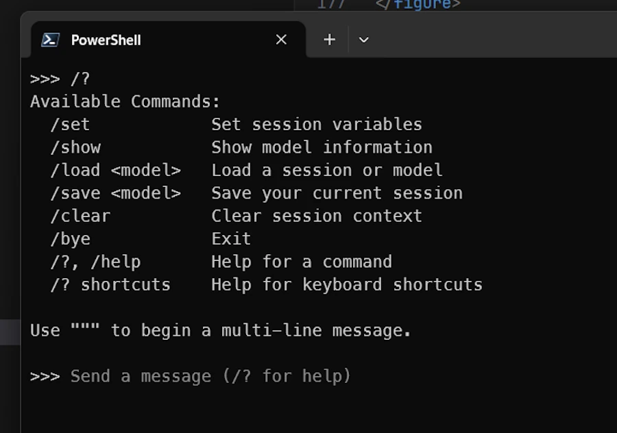
<figcaption>List of Ollama's slash commands</figcaption>
</figure>


- Exit Ollama (`/exit`, `/bye` or `CTRL+D`)
- In the terminal type


```powershell
ollama --help
```


<figure style="max-width: 600px; margin: auto; text-align: center;">

<figcaption>Getting Help from Ollama</figcaption>
</figure>


- Let's try `ollama list` to see the list of models available locally:

```powershell
ollama list
ollama show qwen2.5:3b
```


<figure style="max-width: 900px; margin: auto; text-align: center;">
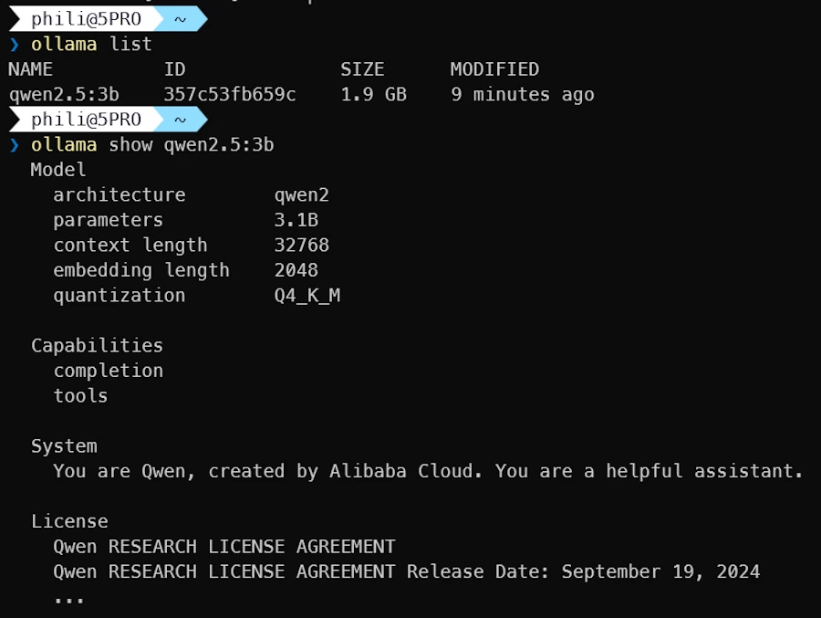
<figcaption>Getting information about QWEN</figcaption>
</figure>

The `show` command provides detailed information about the model. I'm not sure to understand the `context length` parameter (more information below).


<!-- ###################################################################### -->
<!-- ###################################################################### -->
<!-- ###################################################################### -->
## Checking where the models are stored

Under Windows, Ollama is installed in `$env:USERPROFILE/.ollama`. This is a good news because this means it is NOT monitored by OneDrive. If needed one can read this [page](https://docs.ollama.com/windows#changing-model-location) and change `OLLAMA_MODELS` default value.

```powershell
Get-ChildItem $env:USERPROFILE/.ollama/models -Recurse
```

<figure style="max-width: 900px; margin: auto; text-align: center;">

<figcaption>Ollama: checking where the models are stored locally</figcaption>
</figure>

Models are stored in the `blobs` sub folder.

<figure style="max-width: 225px; margin: auto; text-align: center;">

<figcaption>With Ollama, the models are stored in the blobs/ folder</figcaption>
</figure>


<!-- ###################################################################### -->
<!-- ###################################################################### -->
<!-- ###################################################################### -->
## Know your hardware configuration

Under WIndows 11 you can try the commands below to get information about RAM, VRAM...

```powershell
& dxdiag /t "$env:TEMP\dxdiag.txt"; Start-Sleep -Seconds 5; Select-String "Display Memory|Card name" "$env:TEMP\dxdiag.txt"
Get-CimInstance Win32_Processor | Select-Object Name, NumberOfCores, NumberOfLogicalProcessors, MaxClockSpeed
Get-CimInstance Win32_PhysicalMemory | Select-Object Manufacturer, Capacity, Speed, MemoryType
(Get-CimInstance Win32_ComputerSystem).TotalPhysicalMemory / 1GB
```

<figure style="max-width: 900px; margin: auto; text-align: center;">
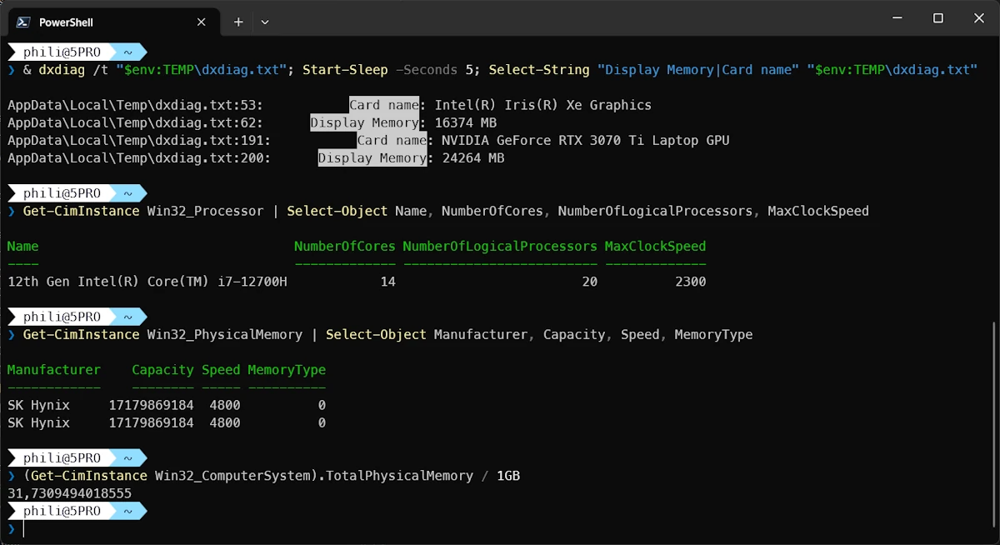
<figcaption>I'm a legend</figcaption>
</figure>


<!-- ###################################################################### -->
<!-- ###################################################################### -->
<!-- ###################################################################### -->
## Selecting gemma4

Select the text from the terminal then copy it into ChatGPT, Claude or other friends then add this prompt:

```
Given the hardware configuration described above, which gemma4 model would you recommend for my Windows 11 PC?
```


<figure style="max-width: 900px; margin: auto; text-align: center;">
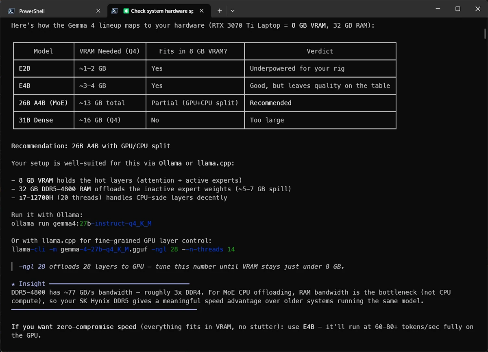
<figcaption>Claude recommend 26B A4B (MoE, Mixture of Experts)</figcaption>
</figure>


After discussing with ChatGPT and double checking [this page](https://ollama.com/library/gemma4) I decided to give a try to `gemma4:e4B`


<!-- ###################################################################### -->
<!-- ###################################################################### -->
<!-- ###################################################################### -->
## Using gemma4 in the terminal

⚠️ Make sure to plug an Ethernet cable rather than using Wifi then use the following command to download and run `gemma4:e4B`.

```powershell
ollama run gemma4:e4b
```

<figure style="max-width: 900px; margin: auto; text-align: center;">
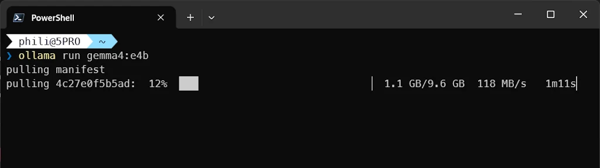
<figcaption>Ollama download gemma4:e4B</figcaption>
</figure>


Once the model is succesfully downloaded, let's try a prompt:

<figure style="max-width: 900px; margin: auto; text-align: center;">
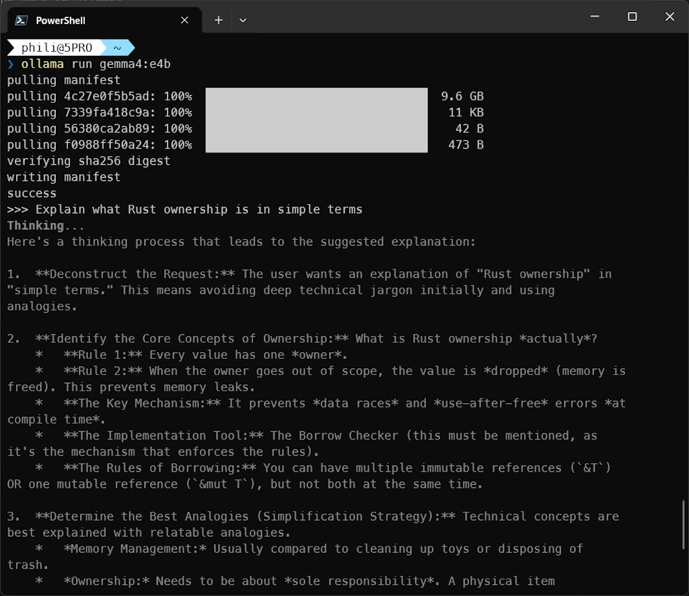
<figcaption>Second prompt with gemma4:e4b</figcaption>
</figure>


Let's check the state of the GPU while the model is working. I tried different options but I was not able to display Compute/CUDA on the discrete GPU using task manager (CTRL+SHIFT+ESC). So I propose to open a second terminal and run this command

```powershell
nvidia-smi --query-gpu=utilization.gpu --format=csv -l 1
```

Below we can see that `ollama.exe` uses the GPU. Then the monitoring shows what happens when I run a prompt in another terminal (the activity jumps from 0% to 40%)

<figure style="max-width: 900px; margin: auto; text-align: center;">
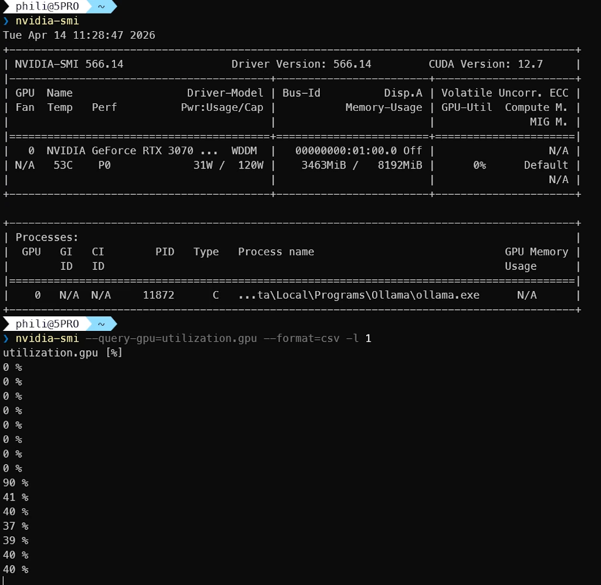
<figcaption>The GPU is working</figcaption>
</figure>


**Side Note**
- `%LOCALAPPDATA%/Ollama` contains the logs
- `%LOCALAPPDATA%/Programs/Ollama` contains the app and the lib


<!-- ###################################################################### -->
<!-- ###################################################################### -->
<!-- ###################################################################### -->
## Using gemma4 in the Ollama Windows app

Launch the Ollama app and select `gemma4:4b` model in the drop down list (bottom right). Use a third prompt (we could alternatively paste an image)

<figure style="max-width: 900px; margin: auto; text-align: center;">
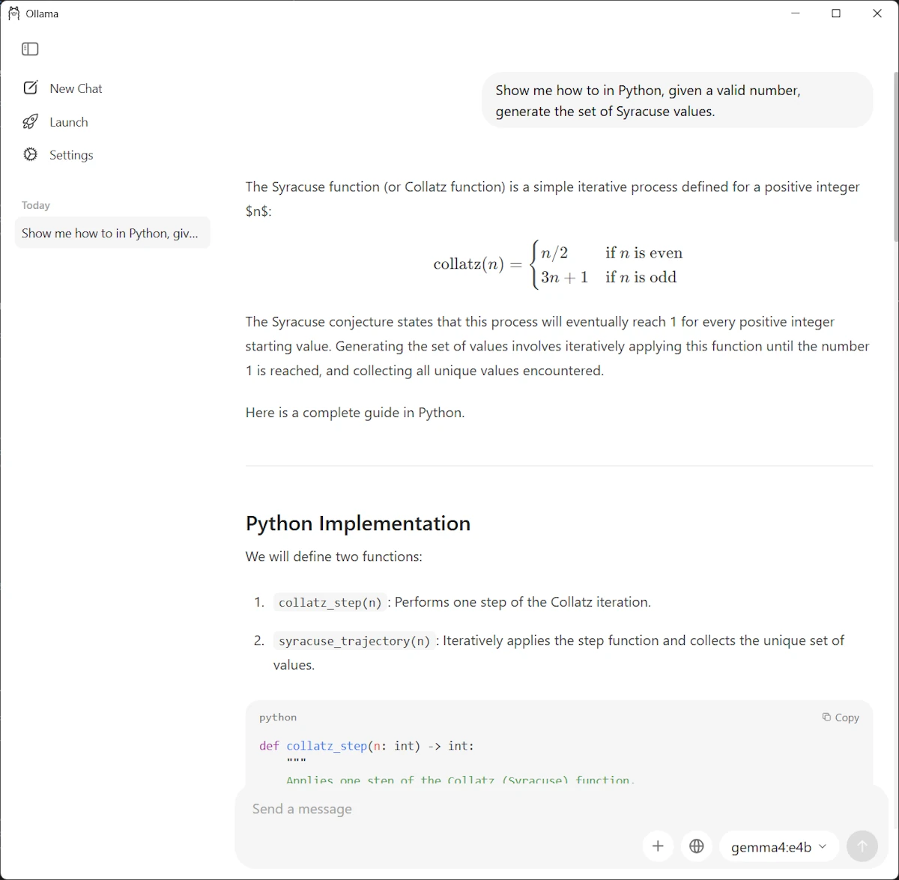
<figcaption>Using gemma4:e4B model in the Ollama Windows app</figcaption>
</figure>


<!-- ###################################################################### -->
<!-- ###################################################################### -->
<!-- ###################################################################### -->
## Using gemma4 with Claude

* Open VSCode in an empty directory
* Open a terminal and call

```powershell
ollama launch
```

<figure style="max-width: 900px; margin: auto; text-align: center;">
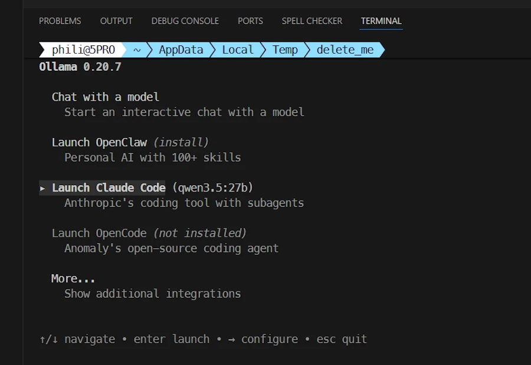
<figcaption>ollama launch</figcaption>
</figure>


Select `Claude Code` then use the ➡️ (**right arrow** ) to select in the list of models, at the bottom of the terminal, select `gemma4:e4b`


<figure style="max-width: 900px; margin: auto; text-align: center;">
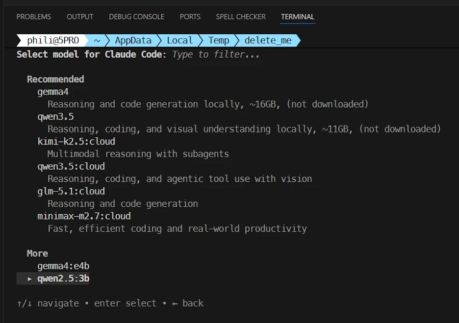
<figcaption>ollama launch</figcaption>
</figure>


Once in Claude, my status line indicates the model, the directory... We are all set:

<figure style="max-width: 900px; margin: auto; text-align: center;">
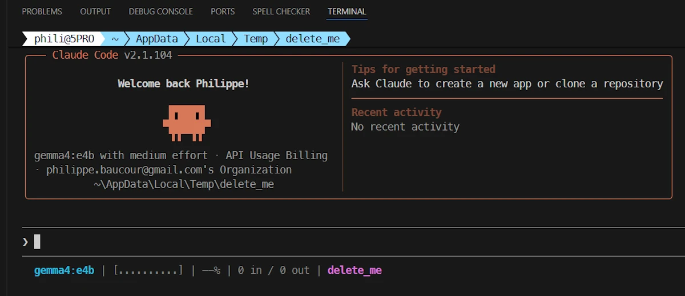
<figcaption>gemma4:e4b used by Claude Code in VSCode</figcaption>
</figure>

Then I use this prompt

```
show me how to print the 10 first odd numbers in Python
```

I get this answer:


<figure style="max-width: 900px; margin: auto; text-align: center;">
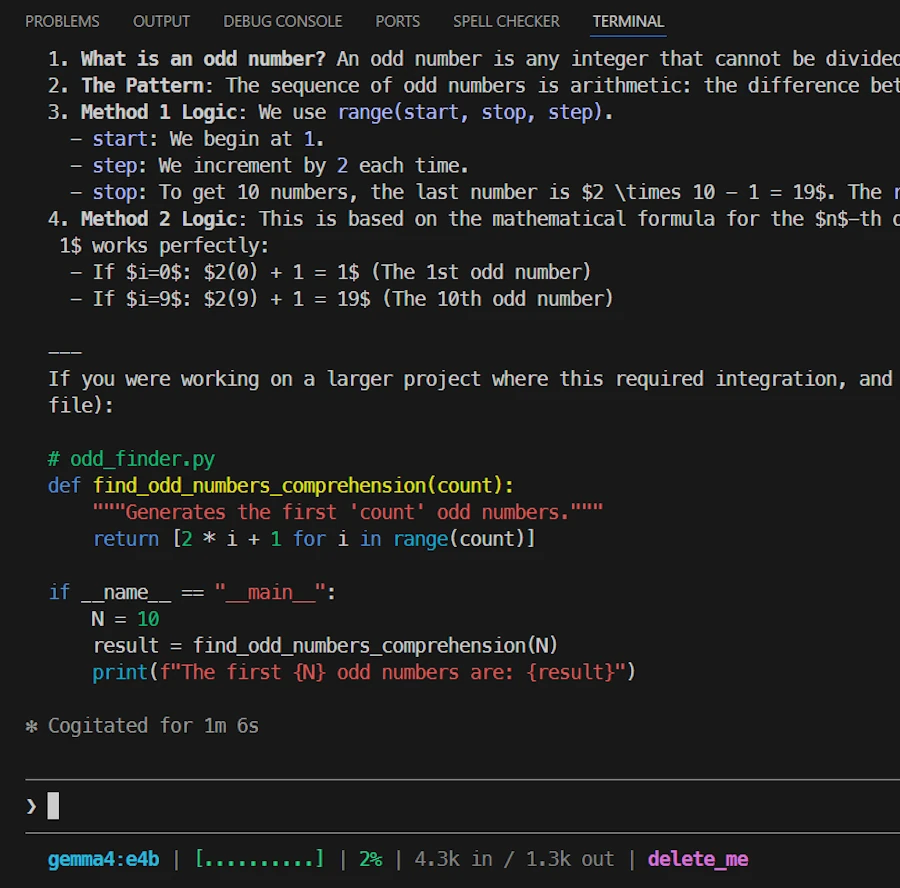
<figcaption>Answer from the model</figcaption>
</figure>


Then I use this prompt:

```
Can you save the script in the current directory in odd.py
```

Then things get weird and **not usable**. Indeed, for what I understand, Claude context is too large and the context of the model is too small. The model doesn't even remember the code it generated few seconds before. It does'nt know how to save a file, it does not use Claude API to save the file...

I also did some tests with `gemma4:26b`. Same kind of problems/bugs... Not yet usable in my point of view.

This is unfortunate because I wanted to run the model all night to improve some code. To do that, I would need the ability to:

* generate code
* save it
* run it
* read some results (for example, execution time)
* decide whether the latest version of the code is better or not
* repeat the loop

I can’t do this kind of experiment with my “limited” Claude Pro subscription. That’s why I wanted to run everything locally, even if it meant it would be slow. Time wasn’t the issue for this experiment.


<!-- ###################################################################### -->
<!-- ###################################################################### -->
<!-- ###################################################################### -->
## A New Hope: smaller model & extended context

<figure style="max-width: 225px; margin: auto; text-align: center;">

<figcaption>Let's use a smaller model with an extended context</figcaption>
</figure>


In one terminal I run this command:

```powershell
ollama run qwen3.5:9b
```

Then, in a second terminal I run this one:

```powershell
ollama ps
NAME          ID              SIZE      PROCESSOR          CONTEXT    UNTIL
qwen3.5:9b    6488c96fa5fa    8.9 GB    28%/72% CPU/GPU    4096       4 minutes from now
```
We can see that the context is "only" `4k`. Do you remember the output of the `ollama show qwen2.5:3b` showing a `context length` of `32k`? Know you undesrtand why I said I was confused.

Ok... I stay in the current folder (`$env:tmp/delete_me` in my case) and I run the following commands:

```powershell
# create Modelfile
@"
FROM qwen3.5:9b
PARAMETER num_ctx 65536
"@ | Set-Content -Path Modelfile -Encoding UTF8


# use Modelfile to create a "new" model
ollama create qwen3.5-9b-64k -f Modelfile
```

Now we should have a `3.5:9B` model with `64k` context rather than `4k` by default. Let's check that:

```powershell
ollama list

NAME                     ID              SIZE      MODIFIED
qwen3.5-9b-64k:latest    b7b9afeaf023    6.6 GB    2 minutes ago
qwen3.5:9b               6488c96fa5fa    6.6 GB    14 minutes ago
gemma4:26b               5571076f3d70    17 GB     4 hours ago
gemma4:e4b               c6eb396dbd59    9.6 GB    8 hours ago
qwen2.5:3b               357c53fb659c    1.9 GB    2 days ago
```

Let's double check. In terminal 1 I run:

```powershell
ollama run qwen3.5-9b-64k
```

In terminal 2 I run:

```powershell
ollama ps
NAME                     ID              SIZE     PROCESSOR          CONTEXT    UNTIL
qwen3.5-9b-64k:latest    b7b9afeaf023    12 GB    36%/64% CPU/GPU    65536      3 minutes from now
```
We are good to go because the context seems to be effectively 64k. Let's see if this helps.


<!-- ###################################################################### -->
<!-- ###################################################################### -->
<!-- ###################################################################### -->
## Using our 64k context model with Claude in VSCode


* I stay in the same directory
* Open VSCode (`code .`)
* Open a terminal in VSCode (`CTRL+ù`) and run this command

```powershell
ollama launch claude --model qwen3.5-9b-64k
```


<figure style="max-width: 900px; margin: auto; text-align: center;">
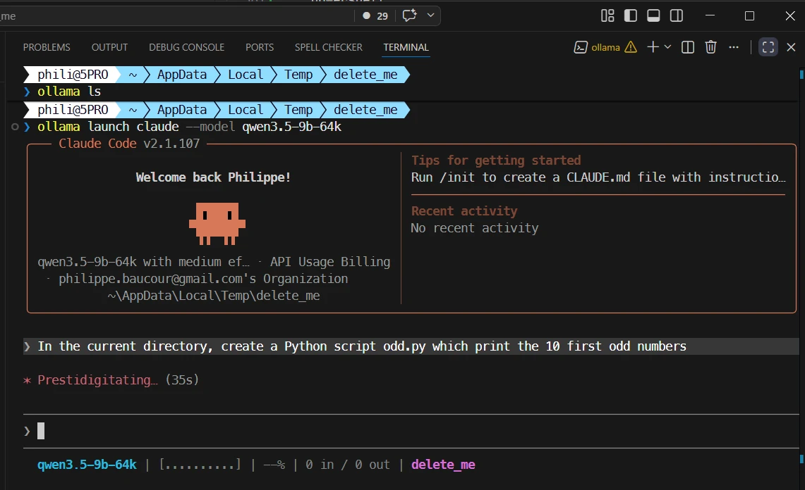
<figcaption>Claude Code with QWEN 3.5:9b and 64k context</figcaption>
</figure>


Now I use this prompt : `In the current directory, create a Python script odd.py which print the 10 first odd numbers`

Once this is done, since I want to see if the model follows the instructions of my `CLAUDE.md` I ask it to run the script with this prompt: `Can you run it?`. See below:

<figure style="max-width: 900px; margin: auto; text-align: center;">
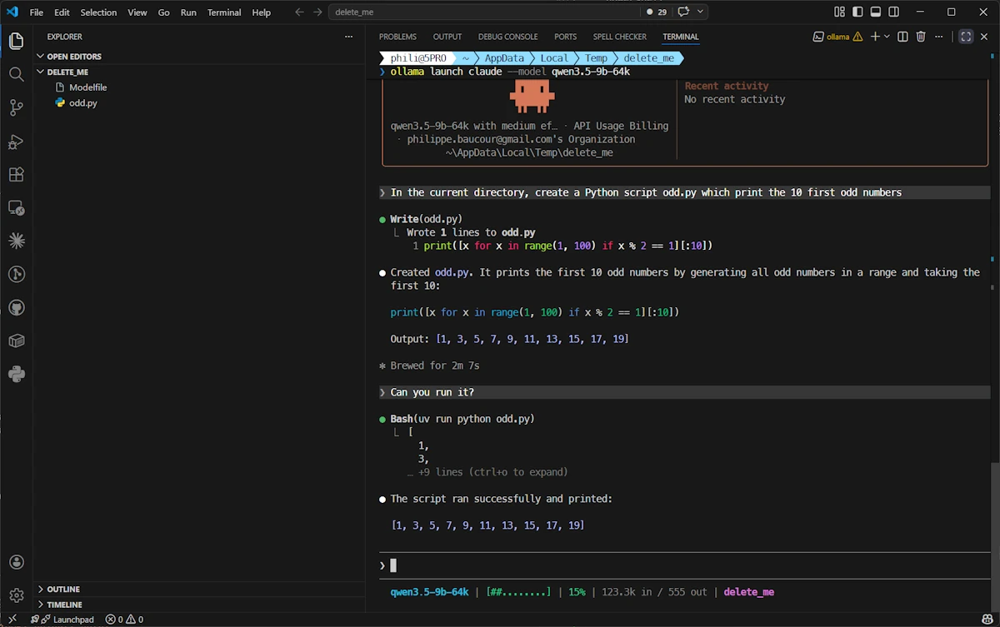
<figcaption>The model run the Python script using uv</figcaption>
</figure>

Cool... It seems that with a 64k context, the model is able to save the file, it remembers what it does (in the second prompt I just said "can you run it" without mentioning the script whatsoever) and it follows the instructions of my `CLAUDE.md` (it use `uv` to run the script). So it seems context length is someting we should keep an eye on.


<!-- ###################################################################### -->
<!-- ###################################################################### -->
<!-- ###################################################################### -->
## Conclusion

We learn a lot but at the end of the day we have a setup we can improve. Remember, I wanted to run a model in a loop all night. I needed the ability to:
* generate code
* save it
* run it (`uv` or `cargo run`)
* read some results (for example, execution time)
* decide whether the latest version of the code is better or not
* repeat the loop

We will see how it goes but the next step should be to check the context of `gemma4:26b`, extend it if needed and work on the loop. Stay tune!


<!-- ###################################################################### -->
<!-- ###################################################################### -->
<!-- ###################################################################### -->
## Webliography

* [Unsloth: gemma4](https://unsloth.ai/docs/models/gemma-4)


